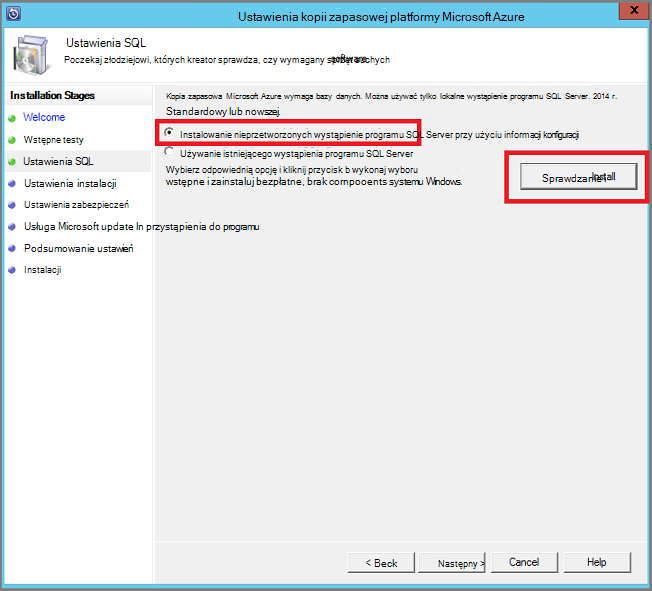
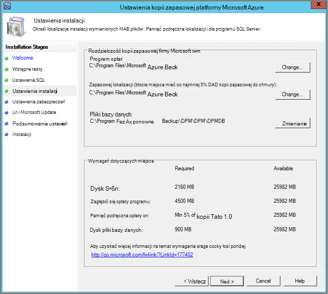
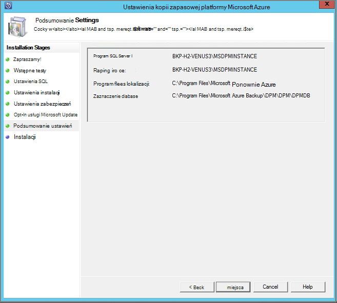

<properties
  pageTitle="Przygotowywanie środowiska do tworzenia kopii zapasowych obciążenia przy użyciu serwera kopii zapasowej Azure | Microsoft Azure"
  description="Upewnij się, że środowiska właściwie jest gotowa do tworzenia kopii zapasowych obciążenia przy użyciu serwera kopii zapasowej Azure"
  services="backup"
  documentationCenter=""
  authors="pvrk"
  manager="shivamg"
  editor=""
  keywords="Azure kopii zapasowych serwera. Magazyn kopii zapasowej"/>

<tags
  ms.service="backup"
  ms.workload="storage-backup-recovery"
  ms.tgt_pltfrm="na"
  ms.devlang="na"
  ms.topic="article"
  ms.date="08/22/2016"
  ms.author="jimpark;trinadhk;pullabhk; markgal"/>

# <a name="preparing-to-back-up-workloads-using-azure-backup-server"></a>Przygotowanie do tworzenia kopii zapasowych obciążenia przy użyciu serwera kopii zapasowej Azure

> [AZURE.SELECTOR]
- [Serwer Azure kopii zapasowej](backup-azure-microsoft-azure-backup.md)
- [SCDPM](backup-azure-dpm-introduction.md)
- [Azure kopii zapasowych serwera (klasyczny)](backup-azure-microsoft-azure-backup-classic.md)
- [SCDPM (klasyczny)](backup-azure-dpm-introduction-classic.md)


Ten artykuł dotyczy przygotowania środowiska do tworzenia kopii zapasowych obciążenia przy użyciu Azure kopii zapasowych serwera. Za pomocą Azure kopii zapasowych serwera można chronić obciążeń pracą aplikacji, takich jak maszyny wirtualne funkcji Hyper-V, Microsoft SQL Server, program SharePoint Server, program Microsoft Exchange i klientów z systemem Windows z poziomu pojedynczej konsoli.

>[AZURE.WARNING] Azure kopii zapasowych serwera dziedziczy funkcji danych Protection Manager (DPM) do tworzenia kopii zapasowych obciążenie pracą. Znajdziesz łącza do dokumentacji DPM niektóre z tych funkcji. Azure kopii zapasowych serwera nie zapewniają ochronę na taśmą lub Integracja z Centrum systemu.

## <a name="1-windows-server-machine"></a>1. serwer Windows


Pierwszy krok w kierunku wprowadzenie serwer Azure kopii zapasowych w górę i uruchamianie ma komputera systemu Windows Server.

| Lokalizacja | Minimalne wymagania | Dodatkowe informacje |
| -------- | -------------------- | ----------------------- |
| Azure | Azure maszyn wirtualnych IaaS<br><br>A2 Standardowe: 2 rdzeniom 3,5 GB pamięci RAM | Możesz rozpocząć z prostego Galeria systemu Windows Server 2012 R2 w centrum danych. [Ochrona IaaS obciążenia za pomocą Azure kopii zapasowych serwera (DPM)](https://technet.microsoft.com/library/jj852163.aspx) zawiera wiele drobne. Upewnij się, przeczytaj artykuł całkowicie przed wdrożeniem komputera. |
| Lokalne | Funkcji Hyper-V Głosowa,<br> VMWare Głosowa,<br> lub fizycznie hosta<br><br>2 rdzenie i 4GB pamięci RAM | Można deduplicate magazynie DPM, korzystając z systemu Windows Server Deduplication. Dowiedz się więcej na temat sposobu DPM deduplication współdziałania [i](https://technet.microsoft.com/library/dn891438.aspx) po wdrożeniu w maszyny wirtualne funkcji Hyper-V. |

> [AZURE.NOTE] Zaleca się zainstalowania Azure kopii zapasowych serwera na komputerze z systemem Windows Server 2012 R2 w centrum danych. Automatycznie obejmuje wiele wymagania wstępne z najnowszą wersją systemu operacyjnego Windows.

Jeśli zamierzasz dołączyć ten serwer do domeny w pewnym momencie, zaleca się wykonać aktywności dołączania domeny przed instalacją Azure kopii zapasowych serwera. Przenoszenie istniejących Azure kopii zapasowej serwerze do nowej domeny po wdrożenie nie jest *obsługiwane*.

## <a name="2-backup-vault"></a>2. kopii zapasowej magazynu


Czy wysyłanie danych kopii zapasowej Azure lub pozostaw je zaznaczone lokalnie, oprogramowania musi być połączony z Azure. Bardziej szczegółowe, Azure kopii zapasowych serwera musi zostać zarejestrowany z magazynu kopii zapasowej.

Tworzenie kopii zapasowej magazynu:

1. Zaloguj się do [portalu zarządzania](http://manage.windowsazure.com/).

2. Kliknij przycisk **Nowy** > **usług danych** > **usługi odzyskiwania** > **kopii zapasowej magazynu** > **Szybkie tworzenie**. Jeśli masz wiele subskrypcji skojarzonego z kontem organizacji, wybierz poprawny subskrypcji skojarzyć z magazynu kopii zapasowej.

3. W polu **Nazwa**wpisz przyjazną nazwę identyfikującą magazyn. Musi to być unikatowe dla każdej subskrypcji.

4. W **regionie**zaznacz regionu geograficznego dla magazyn. Zazwyczaj region magazynu jest pobierany na podstawie ograniczeń opóźnienie suwerenności lub siecią danych.

    

5. Kliknij przycisk **Utwórz magazynu**. Może minąć trochę czasu, zanim magazynu kopii zapasowej do utworzenia. Monitorowanie powiadomienia o stanie w dolnej części portalu.

    

6. Komunikat potwierdzający, że magazyn został utworzony i będzie on wymieniony na stronie usługi odzyskiwania jako aktywna.
    

  > [AZURE.IMPORTANT] Upewnij się, że opcja nadmiarowości magazynowania odpowiednie został wybrany w prawo, po utworzeniu magazyn. Przeczytaj więcej o tym [zbędne geo](../storage/storage-redundancy.md#geo-redundant-storage) [lokalnie zbędne](../storage/storage-redundancy.md#locally-redundant-storage) opcje [— Omówienie](../storage/storage-redundancy.md)i.


## <a name="3-software-package"></a>3. pakiet oprogramowania


### <a name="downloading-the-software-package"></a>Pobieranie pakietu oprogramowania

Podobnie jak magazynu poświadczeń, możesz pobrać kopii zapasowej Microsoft Azure dla obciążenia aplikacji z **Szybkie strona startowa** magazynu kopii zapasowej.

1. Kliknij, **Aby obciążenia aplikacji (dysku na dysk do chmury)**. To spowoduje przejście do strony Centrum pobierania, z której można pobrać pakiet oprogramowania.

    

2. Kliknij przycisk **Pobierz**.

    

3. Zaznacz wszystkie pliki, a następnie kliknij przycisk **Dalej**. Pobierz wszystkie pliki pochodzące ze strony pobierania programu Microsoft Azure wykonywanie kopii zapasowych i umieść wszystkie pliki w tym samym folderze.


    Ponieważ pobieranie rozmiar wszystkie pliki są ze sobą > 3G, na 10 Pobierz łącze, które może potrwać do 60 minut do pobrania zakończyć.


### <a name="extracting-the-software-package"></a>Wyodrębnianie pakietu oprogramowania

Po pobraniu wszystkie pliki, kliknij pozycję **MicrosoftAzureBackupInstaller.exe**. Spowoduje to uruchomienie **Kreatora instalacji pakietu Microsoft Azure kopii zapasowej** , aby wyodrębnić pliki konfiguracji do lokalizacji określonej przez użytkownika. Kontynuuj korzystanie z kreatora i kliknij przycisk **Wyodrębnij** , aby rozpocząć proces wyodrębniania.

> [AZURE.WARNING] Co najmniej 4GB wolnego miejsca jest wymagane do wyodrębnienia plików Instalatora.


Po wyodrębnianie procesu wykonane, zaznacz pola, aby uruchomić świeżo wyodrębnionej *setup.exe* aby rozpocząć instalację Microsoft Azure kopii zapasowych serwera, a następnie kliknij przycisk **Zakończ** .

### <a name="installing-the-software-package"></a>Instalowanie pakietu oprogramowania

1. Kliknij pozycję **Kopia zapasowa Microsoft Azure** , aby uruchomić Kreatora konfiguracji.

    

2. Na ekranie powitalnym kliknij przycisk **Dalej** . Spowoduje to przejście do sekcji *Sprawdza wstępne* . Na ekranie kliknij przycisk **Sprawdź** ustalenie, jeśli są spełnione wymagania wstępne sprzętu i oprogramowania dla Azure kopii zapasowych serwera. Jeśli wszystkie wymagania wstępne są zostały spełnione pomyślnie, pojawi się komunikat informujący, że komputer spełnia wymagania. Kliknij przycisk **Dalej** .

    

3. Microsoft Azure kopii zapasowej serwer wymaga programu SQL Server Standard, a pakiet instalacyjny Azure kopii zapasowych serwera zawiera powiązanych potrzeby odpowiednich plików binarnych programu SQL Server. Podczas uruchamiania, nową instalację Azure kopii zapasowych serwera, możesz wybierz opcję **Zainstaluj nowe wystąpienie programu SQL Server przy użyciu tego ustawienia** i kliknij przycisk **Sprawdź i zainstaluj** . Po pomyślnym zainstalowaniu wymagania wstępne, kliknij przycisk **Dalej**.

    

    Jeśli w przypadku wystąpienia błędu z rekomendacji ponowne uruchomienie komputera zrobić i kliknij pozycję **Sprawdź ponownie**.

    > [AZURE.NOTE] Serwer Azure kopii zapasowej nie będzie działać z zdalnego wystąpienia programu SQL Server. Wystąpienie jest używana przez serwer kopii zapasowej Azure musi być lokalne.

4. Podaj lokalizację instalacji pakietu Microsoft Azure wykonywanie kopii zapasowych serwera plików, a następnie kliknij przycisk **Dalej**.

    

    Wymazywanie lokalizacji jest wymagane wykonywanie kopii zapasowej Azure. Upewnij się, że pliki tymczasowe znajduje się co najmniej 5% danych planowana do wykonania kopii zapasowej w chmurze. Ochrony dysku oddzielnych dyskach muszą zostać skonfigurowane po zakończeniu instalacji. Aby uzyskać więcej informacji dotyczących pul miejsca do magazynowania zobacz [Konfigurowanie puli miejsca do magazynowania i ilość miejsca do magazynowania](https://technet.microsoft.com/library/hh758075.aspx).

5. Podać silnego hasła dla kont użytkowników lokalnych ograniczony, a następnie kliknij przycisk **Dalej**.

    

6. Określ, czy chcesz używać *Usługi Microsoft Update* sprawdzać dostępność aktualizacji, a następnie kliknij przycisk **Dalej**.

    >[AZURE.NOTE] Zaleca się o przekierować do Microsoft Update, która oferuje zabezpieczeń i ważnych aktualizacji dla systemu Windows i innych produktów, takich jak Microsoft Azure kopii zapasowych serwera usługi Windows Update.

    

7. Przejrzyj *Podsumowanie ustawienia* , a następnie kliknij przycisk **Zainstaluj**.

    

8. Instalacja się dzieje w fazy. W pierwszym etapie agenta usługi Microsoft Azure odzyskiwania jest zainstalowany na serwerze. Kreator również sprawdza, czy połączenie z Internetem. Jeśli połączenie z Internetem jest dostępna w przypadku kontynuowania instalacji, jeśli nie, musisz podać szczegóły serwera proxy, aby nawiązać połączenie z Internetem.

    Następnym krokiem jest skonfigurowanie agenta usługi Microsoft Azure odzyskiwania. W ramach konfiguracji konieczne będzie zapewnienie, że jest się poświadczenia magazynu, aby zarejestrować komputer magazynu kopii zapasowej. Zawiera również hasło do Szyfrowanie/odszyfrowywanie danych przesyłanych między Azure i swojej siedzibie. Można automatycznie wygenerować hasło lub zapewnić własne minimalne hasło 16 znaków. Kontynuuj przy użyciu kreatora, aż agent został skonfigurowany.

    

9. Po pomyślnym wykonaniu rejestracji serwera kopia zapasowa Microsoft Azure Kreatora konfiguracji ogólnego przechodzi do instalacji i konfiguracji programu SQL Server i składniki Azure kopii zapasowych serwera. Po zakończeniu instalacji składnika programu SQL Server, składniki Azure kopii zapasowych serwera są instalowane.

    


Po ukończeniu kroku instalacji produktu ikony pulpitu zostanie utworzono także. Wystarczy kliknąć dwukrotnie ikonę, aby uruchomić produktu.

### <a name="add-backup-storage"></a>Dodawanie magazynu kopii zapasowej

Pierwszy kopii zapasowej są przechowywane w magazynie dołączone do serwera kopii zapasowej Azure. Aby uzyskać więcej informacji na temat dodawania dysków Zobacz [Konfigurowanie puli miejsca do magazynowania i ilość miejsca do magazynowania](https://technet.microsoft.com/library/hh758075.aspx).

> [AZURE.NOTE] Musisz dodać magazynu kopii zapasowej, nawet jeśli planujesz wysyłanie danych do Azure. W bieżącym architekturze Azure kopii zapasowych serwera Azure kopii zapasowej magazynu zawiera *drugą* kopię danych podczas lokalnego magazynu zawiera pierwszy (i obowiązkowe) kopii zapasowej.  

## <a name="4-network-connectivity"></a>4. łączność sieciowa


Azure kopii zapasowych serwera wymagają łączności z usługą Azure kopii zapasowej dla produktu działała poprawnie. Aby sprawdzić poprawność, czy komputer ma łączność Azure, za pomocą ```Get-DPMCloudConnection``` polecenia w konsoli Azure kopii zapasowych serwera programu PowerShell. Jeśli wynik polecenia ma wartość PRAWDA, a następnie istnieje połączenie, jeszcze nie istnieje brak łączności.

W tym samym czasie Azure subskrypcji musi być w stanie prawidłowy. Aby sprawdzić stan subskrypcji i zarządzać nim, zaloguj się do [portalu subskrypcji]( https://account.windowsazure.com/Subscriptions).

Znając stan Azure łączności oraz Azure subskrypcji, możesz sprawdzić ich wpływu na funkcje tworzenia kopii zapasowych i przywracania za pomocą w poniższej tabeli.

| Stan połączenia | Azure subskrypcji | Kopia zapasowa Azure| Wykonywanie kopii zapasowych na dysku | Przywracanie z platformy Azure | Przywróć z dysku |
| -------- | ------- | --------------------- | ------------------- | --------------------------- | ----------------------- |
| Połączone | Aktywne | Dozwolone | Dozwolone | Dozwolone | Dozwolone |
| Połączone | Wygasła | Zatrzymano | Zatrzymano | Dozwolone | Dozwolone |
| Połączone | Wstrzymano obsługę administracyjną | Zatrzymano | Zatrzymano | Punkty przestał i Azure odzyskiwanie usuniętych | Zatrzymano |
| Łączność utracone > 15 dni | Aktywne | Zatrzymano | Zatrzymano | Dozwolone | Dozwolone |
| Łączność utracone > 15 dni | Wygasła | Zatrzymano | Zatrzymano | Dozwolone | Dozwolone |
| Łączność utracone > 15 dni | Wstrzymano obsługę administracyjną | Zatrzymano | Zatrzymano |  Punkty przestał i Azure odzyskiwanie usuniętych | Zatrzymano |

### <a name="recovering-from-loss-of-connectivity"></a>Odzyskiwanie przed utratą łączności
Jeśli masz zapory lub serwera proxy, który uniemożliwia dostęp do Azure, musisz listy sprawdzonej następujące adresy domeny w profilu zapory i serwera proxy:

- www.msftncsi.com
- \*. Witryny Microsoft.com
- \*. WindowsAzure.com
- \*. microsoftonline.com
- \*. windows.net

Po łączności z programem Azure została przywrócona na serwerze Azure kopii zapasowej, operacji, które mogą być wykonywane są uzależnione od stanu Azure subskrypcji. Powyższej tabeli zawiera szczegółowe informacje o operacje dozwolone, gdy komputer jest "połączony".

### <a name="handling-subscription-states"></a>Obsługa subskrypcji Państwa

Użytkownik może wykonać Azure subskrypcji z *Wygasłe* lub *Deprovisioned* stanu, aby *aktywny* . Jednak ma pewne wpływ na zachowanie produktu, gdy stan nie jest *aktywny*:

- Subskrypcja *Deprovisioned* utraci funkcje okresu jej jest wstrzymano obsługę administracyjną. Na temat włączania *aktywne*, funkcji produktu tworzenie kopii zapasowych i przywracanie jest przywrócona. Można również pobrać danych kopii zapasowej na lokalnym dysku Jeśli znajdowały się kropką wystarczającej przechowywania. Jednak dane kopii zapasowej w Azure jest nieodwracalnie po subskrypcję przechodzi do stanu *Deprovisioned* .
- Subskrypcję *Wygasłe* tylko utraci funkcje dla, dopóki nie została dostosowana *aktywne* ponownie. Wszelkie kopie zapasowe zaplanowane w podanym okresie, że subskrypcja została *Wygasłe* nie będzie działać.


## <a name="troubleshooting"></a>Rozwiązywanie problemów

Jeśli serwer Microsoft Azure kopii zapasowej kończy się niepowodzeniem z błędami podczas fazy instalacji (lub wykonywanie kopii zapasowych i przywracanie), zapoznaj się z tego [dokumentu kody błędów](https://support.microsoft.com/kb/3041338) , aby uzyskać więcej informacji.
Możesz również znaleźć [kopii zapasowej Azure](backup-azure-backup-faq.md) powiązane często zadawane pytania


## <a name="next-steps"></a>Następne kroki

Szczegółowe informacje na temat [przygotowania środowiska dla DPM](https://technet.microsoft.com/library/hh758176.aspx) można uzyskać w witrynie Microsoft TechNet. Zawiera także informacje o obsługiwanych konfiguracji, w których można wdrożony i używane Azure kopii zapasowych serwera.

Te artykuły umożliwia uzyskanie szczegółowego Opis ochrony obciążenie pracą przy użyciu serwera Microsoft Azure wykonywanie kopii zapasowych.

- [Kopia zapasowa programu SQL Server](backup-azure-backup-sql.md)
- [Kopia zapasowa programu SharePoint server](backup-azure-backup-sharepoint.md)
- [Kopia zapasowa alternatywnego serwera](backup-azure-alternate-dpm-server.md)
