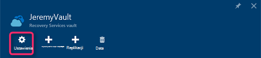

<properties
  pageTitle="Przygotowywanie środowiska do tworzenia kopii zapasowych obciążenia przy użyciu serwera kopii zapasowej Azure | Microsoft Azure"
  description="Przygotowania środowiska za pomocą Azure kopii zapasowych serwera ochrony lub wykonywanie kopii zapasowej obciążenia."
  services="backup"
  documentationCenter=""
  authors="PVRK"
  manager="shivamg"
  editor=""
  keywords="Azure kopii zapasowych serwera. Ochrona obciążenia; wykonywanie kopii zapasowej obciążenia"/>

<tags
  ms.service="backup"
  ms.workload="storage-backup-recovery"
  ms.tgt_pltfrm="na"
  ms.devlang="na"
  ms.topic="article"
  ms.date="09/27/2016"
  ms.author="jimpark;trinadhk;pullabhk;markgal"/>

# <a name="preparing-to-back-up-workloads-using-azure-backup-server"></a>Przygotowanie do tworzenia kopii zapasowych obciążenia przy użyciu serwera kopii zapasowej Azure

> [AZURE.SELECTOR]
- [Serwer Azure kopii zapasowej](backup-azure-microsoft-azure-backup.md)
- [SCDPM](backup-azure-dpm-introduction.md)
- [Azure kopii zapasowych serwera (klasyczny)](backup-azure-microsoft-azure-backup-classic.md)
- [SCDPM (klasyczny)](backup-azure-dpm-introduction-classic.md)

W tym artykule wyjaśniono, jak do przygotowania środowiska do tworzenia kopii zapasowych obciążenia przy użyciu Azure kopii zapasowych serwera. Za pomocą Azure kopii zapasowych serwera można chronić obciążeń pracą aplikacji, takich jak maszyny wirtualne funkcji Hyper-V, Microsoft SQL Server, program SharePoint Server, program Microsoft Exchange i klientów z systemem Windows z poziomu pojedynczej konsoli. Można także chronić informacje w ramach obciążenia serwera (IaaS), takich jak maszyny wirtualne platformy Azure.

> [AZURE.NOTE] Azure występują dwa modele wdrożenia służące do tworzenia i pracy z zasobami: [Menedżer zasobów i klasyczny](../resource-manager-deployment-model.md). Ten artykuł zawiera informacje i procedury przywracania maszyny wirtualne wdrożony przy użyciu modelu Menedżera zasobów.

Azure kopii zapasowych serwera dziedziczy wiele funkcji kopii zapasowej obciążenie pracą z danych Protection Manager (DPM). Ten artykuł zawiera linki DPM w dokumentacji opisano niektóre funkcje udostępnionego. Mimo że serwer kopii zapasowej Azure udostępnia wiele funkcji DPM. Serwer Azure kopii zapasowej nie Utwórz kopię zapasową taśmą ani czy integracja z Centrum systemu.

## <a name="1-choose-an-installation-platform"></a>1. Wybierz platformy instalacji

Pierwszy krok w kierunku wprowadzenie serwer Azure kopii zapasowych w górę i uruchamianie jest konfigurowanie systemu Windows Server. Serwer może być Azure lub lokalnego.

### <a name="using-a-server-in-azure"></a>Za pomocą serwera platformy Azure

Wybierając serwer usługami kopii zapasowej Azure, zalecane jest początkowych Galeria systemu Windows Server 2012 R2 w centrum danych. Artykuł [Tworzenie komputera pierwszego wirtualnych w portalu Azure](..\virtual-machines\virtual-machines-windows-hero-tutorial.md), z samouczkiem rozpoczynania pracy z zalecanych maszyny wirtualnej Azure, nawet jeśli nie znasz Azure przed. Zalecane minimalne wymagania dotyczące serwera maszyny wirtualnej (maszyn wirtualnych) powinny być: A2 standardowo 2 rdzenie i 3,5 GB pamięci RAM.

Ochrona obciążenie pracą z serwerem kopii zapasowej Azure ma wiele drobne. Artykuł [Instalowanie DPM jako Azure maszyn wirtualnych](https://technet.microsoft.com/library/jj852163.aspx)pomaga wyjaśnić te różnice. Przeczytaj ten artykuł całkowicie przed wdrożeniem komputera.

### <a name="using-an-on-premises-server"></a>Używanie lokalnego serwera

Czy chcesz uruchomić podstawowy serwer platformy Azure, możesz uruchomić serwer maszyny funkcji Hyper-V, maszyny VMware lub fizycznie host. Zalecane minimalne wymagania dotyczące sprzętu serwera są 2 rdzenie i 4 GB pamięci RAM. Obsługiwane systemy operacyjne są wymienione w poniższej tabeli.

| System operacyjny        | Platformy           | JEDNOSTKA SKU  |
| :------------- |-------------| :-----|
|Windows Server 2012 R2 i najnowszych SPs| 64-bitowej| Standardowe i centrum danych, Foundation|
|Windows Server 2012 i najnowszych SPs|    64-bitowej| Standardowe centrum danych, Foundation,|
|Windows miejsca do magazynowania Server 2012 R2 i najnowszych SPs  |64-bitowej|    Standardowe, grupa robocza|
|Windows miejsca do magazynowania Server 2012 i najnowszych SPs |64-bitowej |Standardowe, grupa robocza|


Można deduplicate magazynie DPM, korzystając z systemu Windows Server Deduplication. Dowiedz się więcej na temat sposobu DPM deduplication współdziałania [i](https://technet.microsoft.com/library/dn891438.aspx) po wdrożeniu w maszyny wirtualne funkcji Hyper-V.

> [AZURE.NOTE]  Azure kopii zapasowych serwera nie można zainstalować na komputerze, na którym działa jako kontrolera domeny.

Azure kopii zapasowych serwera należy przyłączyć do domeny. Jeśli użytkownik chce przenieść na serwerze do innej domeny, zaleca się dołączyć serwer do nowej domeny przed zainstalowaniem Azure kopii zapasowych serwera. Przenoszenie istniejących Azure kopii zapasowej serwerze do nowej domeny po wdrożenie nie jest *obsługiwane*.

## <a name="2-recovery-services-vault"></a>2. magazynu usługi odzyskiwania

Czy wysyłanie danych kopii zapasowej Azure lub pozostaw je zaznaczone lokalnie, oprogramowania musi być połączony z Azure. Bardziej szczegółowe, Azure kopii zapasowych serwera musi zostać zarejestrowany z magazynu usługi odzyskiwania.

Aby utworzyć magazynu usługi odzyskiwania:

1. Zaloguj się do [portalu Azure](https://portal.azure.com/).

2. W menu Centrum kliknij przycisk **Przeglądaj** , a następnie na liście zasobów, wpisz **Usługi odzyskiwania**. Po rozpoczęciu wpisywania, będzie filtrować listę według dane wejściowe. Kliknij pozycję **magazynu usługi odzyskiwania**.

     <br/>

    Zostanie wyświetlona lista magazynów usługi odzyskiwania.

3. W menu **usługi odzyskiwania magazynów** kliknij przycisk **Dodaj**.

    

    Zostanie wyświetlona karta magazynu usługi odzyskiwania monituje o podanie **nazwy**, **subskrypcji**, **Grupa zasobów**i **lokalizacji**.

    

4. W polu **Nazwa**wpisz przyjazną nazwę identyfikującą magazyn. Nazwa musi być unikatowa dla Azure subskrypcji. Wpisz nazwę, która zawiera od 2 do 50 znaków. Musi rozpoczynać się od litery i mogą zawierać tylko litery, cyfry i łączniki.

5. Kliknij **subskrypcję** , aby wyświetlić listę dostępnych subskrypcji. Jeśli nie masz pewności, jakie subskrypcję, należy użyć wartości domyślnej (lub sugerowane) subskrypcji. Będzie wiele opcji do wyboru tylko wtedy, gdy konto organizacji jest skojarzony z wiele subskrypcji Azure.

6. Kliknij pozycję **Grupa zasobów** , aby wyświetlić listę dostępnych grup zasobów, lub kliknij przycisk **Nowy** , aby utworzyć nową grupę zasobów. Aby uzyskać pełne informacje dotyczące grup zasobów zobacz [Omówienie Menedżera zasobów Azure](../azure-resource-manager/resource-group-overview.md)

7. Kliknij **miejsce** , aby wybrać regionu geograficznego dla magazyn.

8. Kliknij przycisk **Utwórz**. Może upłynąć trochę czasu, zanim magazynu usługi odzyskiwania ma zostać utworzony. Monitorowanie powiadomienia o stanie w górnym obszarze po prawej stronie w portalu.
Po utworzeniu z magazynu zostanie otwarty w portalu.

### <a name="set-storage-replication"></a>Ustawianie replikacji miejsca do magazynowania

Opcja replikacji magazynowania umożliwia wybranie zbędne geo miejsca do magazynowania i lokalnie zbędne miejsca do magazynowania. Domyślnie do magazynu ma zbędne geo miejsca do magazynowania. Pozostaw wybraną opcję do magazynu geo zbędne w przypadku kopii zapasowej podstawowego. Wybierz opcję lokalnie zbędne miejsca do magazynowania, jeśli chcesz tańsze opcja, która nie jest bardzo jako trwałe. Przeczytaj więcej o tym [zbędne geo](../storage/storage-redundancy.md#geo-redundant-storage) i [lokalnie zbędne](../storage/storage-redundancy.md#locally-redundant-storage) opcje przechowywania w [Omówienie replikacji magazyn Azure](../storage/storage-redundancy.md).

Aby zmienić ustawienie replikacji miejsca do magazynowania:

1. Wybierz pozycję usługi magazynu, aby otworzyć pulpitu nawigacyjnego magazynu i karta Ustawienia. Jeśli karta **Ustawienia** nie zostanie otwarty, kliknij pozycję **wszystkie ustawienia** na pulpicie nawigacyjnym magazynu.

2. Karta **Ustawienia** wybierz polecenie **Kopia zapasowa infrastruktury** > **Konfiguracji kopii zapasowej** , aby otworzyć karta **Konfiguracji kopii zapasowej** . Na karta **Konfiguracji kopii zapasowej** wybierz opcję replikacji miejsca do magazynowania z magazynu.

    

    Po wybraniu opcji miejsca do magazynowania dla swojego magazynu, możesz przystąpić do skojarzyć maszyn wirtualnych magazyn. Aby rozpocząć skojarzenia, należy wykrywanie i zarejestrować Azure maszyn wirtualnych.

## <a name="3-software-package"></a>3. pakiet oprogramowania

### <a name="downloading-the-software-package"></a>Pobieranie pakietu oprogramowania
1. Zaloguj się do [portalu Azure](https://portal.azure.com/).

2. Jeśli masz już Otwórz magazynu usługi odzyskiwania, przejdź do kroku 3. Jeśli nie masz usługi odzyskiwania magazynu otwarte, ale znajdują się w portalu Azure, w menu Centrum kliknij przycisk **Przeglądaj**.

    - Na liście zasobów wpisz **Usługi odzyskiwania**.
    - Po rozpoczęciu wpisywania, będzie filtrować listę według dane wejściowe. Gdy zostanie wyświetlony **magazynów usługi odzyskiwania**, kliknij go.

    

    Zostanie wyświetlona lista magazynów usługi odzyskiwania.

    - Na liście usługi odzyskiwania magazynów zaznacz magazynu.

    Zostanie otwarte na pulpicie nawigacyjnym wybranego magazynu.

    

3. Karta Ustawienia jest otwierany domyślnie. Jeśli jest zamknięta, wybierz polecenie **Ustawienia** , aby otworzyć karta Ustawienia.

    

4. Kliknij pozycję **Kopia zapasowa** w **Wprowadzenie** , aby otworzyć Kreatora wprowadzenie.

    

5. Rozpoczynania pracy w otwartym ekran cele kopii zapasowej będą automatycznie wybierane.
    

    W sekcji **cele kopii zapasowej** wybierz *lokalnego* , na *którym działa z pracą*.

    

6. Wybierz obciążenie pracą, który chcesz chronić, przy użyciu Azure kopii zapasowych serwera w *obciążenia, jakie mają być chronione* , a następnie kliknij przycisk **OK**.

    > [AZURE.NOTE] Jeśli planujesz ochrona tylko pliki i foldery, następnie zalecamy używanie agent Azure Backup. Jeśli planujesz ochrony obciążenia więcej niż tylko pliki i foldery lub w przyszłości Jeśli planujesz rozwiń wymagania dotyczące ochrony, zaznacz te obciążeń pracą.

    Spowoduje to zmianę wprowadzenie do kreatora, aby przygotować infrastruktury chroniące obciążenia ze źródeł lokalnych Azure.

    

7. W kartę **Przygotowywanie infrastruktury** , która zostanie otwarta kliknij łącza, **Pobierz** Zainstaluj serwer kopii zapasowej Azure i pobierania magazynu poświadczeń. Podczas rejestrowania Azure kopii zapasowych serwera do magazynu usługi odzyskiwania za pomocą magazynu poświadczeń. Łącza prowadzą do Centrum pobierania, gdzie można pobrać pakiet oprogramowania.

    

8. Zaznacz wszystkie pliki, a następnie kliknij przycisk **Dalej**. Pobierz wszystkie pliki pochodzące ze strony pobierania programu Microsoft Azure wykonywanie kopii zapasowych i umieść wszystkie pliki w tym samym folderze.

    

    Ponieważ pobieranie rozmiar wszystkie pliki są ze sobą > 3G, na 10 Pobierz łącze, które może potrwać do 60 minut do pobrania zakończyć.


### <a name="extracting-the-software-package"></a>Wyodrębnianie pakietu oprogramowania

Po pobraniu wszystkie pliki, kliknij pozycję **MicrosoftAzureBackupInstaller.exe**. Spowoduje to uruchomienie **Kreatora instalacji pakietu Microsoft Azure kopii zapasowej** , aby wyodrębnić pliki konfiguracji do lokalizacji określonej przez użytkownika. Kontynuuj korzystanie z kreatora i kliknij przycisk **Wyodrębnij** , aby rozpocząć proces wyodrębniania.

> [AZURE.WARNING] Co najmniej 4GB wolnego miejsca jest wymagane do wyodrębnienia plików Instalatora.


Po wyodrębnianie procesu wykonane, zaznacz pola, aby uruchomić świeżo wyodrębnionej *setup.exe* aby rozpocząć instalację Microsoft Azure kopii zapasowych serwera, a następnie kliknij przycisk **Zakończ** .

### <a name="installing-the-software-package"></a>Instalowanie pakietu oprogramowania

1. Kliknij pozycję **Kopia zapasowa Microsoft Azure** , aby uruchomić Kreatora konfiguracji.

    

2. Na ekranie powitalnym kliknij przycisk **Dalej** . Spowoduje to przejście do sekcji *Sprawdza wstępne* . Na ekranie kliknij przycisk **Sprawdź** ustalenie, jeśli są spełnione wymagania wstępne sprzętu i oprogramowania dla Azure kopii zapasowych serwera. Jeśli wszystkie wymagania wstępne są zostały spełnione pomyślnie, pojawi się komunikat informujący, że komputer spełnia wymagania. Kliknij przycisk **Dalej** .

    

3. Microsoft Azure kopii zapasowej serwer wymaga programu SQL Server Standard, a pakiet instalacyjny Azure kopii zapasowych serwera zawiera powiązanych potrzeby odpowiednich plików binarnych programu SQL Server. Podczas uruchamiania, nową instalację Azure kopii zapasowych serwera, możesz wybierz opcję **Zainstaluj nowe wystąpienie programu SQL Server przy użyciu tego ustawienia** i kliknij przycisk **Sprawdź i zainstaluj** . Po pomyślnym zainstalowaniu wymagania wstępne, kliknij przycisk **Dalej**.

    

    Jeśli w przypadku wystąpienia błędu z rekomendacji ponowne uruchomienie komputera zrobić i kliknij pozycję **Sprawdź ponownie**.

    > [AZURE.NOTE] Serwer Azure kopii zapasowej nie będzie działać z zdalnego wystąpienia programu SQL Server. Wystąpienie jest używana przez serwer kopii zapasowej Azure musi być lokalne.

4. Podaj lokalizację instalacji pakietu Microsoft Azure wykonywanie kopii zapasowych serwera plików, a następnie kliknij przycisk **Dalej**.

    

    Wymazywanie lokalizacji jest wymagane wykonywanie kopii zapasowej Azure. Upewnij się, że pliki tymczasowe znajduje się co najmniej 5% danych planowana do wykonania kopii zapasowej w chmurze. Ochrony dysku oddzielnych dyskach muszą zostać skonfigurowane po zakończeniu instalacji. Aby uzyskać więcej informacji dotyczących pul miejsca do magazynowania zobacz [Konfigurowanie puli miejsca do magazynowania i ilość miejsca do magazynowania](https://technet.microsoft.com/library/hh758075.aspx).

5. Podać silnego hasła dla kont użytkowników lokalnych ograniczony, a następnie kliknij przycisk **Dalej**.

    

6. Określ, czy chcesz używać *Usługi Microsoft Update* sprawdzać dostępność aktualizacji, a następnie kliknij przycisk **Dalej**.

    >[AZURE.NOTE] Zaleca się o przekierować do Microsoft Update, która oferuje zabezpieczeń i ważnych aktualizacji dla systemu Windows i innych produktów, takich jak Microsoft Azure kopii zapasowych serwera usługi Windows Update.

    

7. Przejrzyj *Podsumowanie ustawienia* , a następnie kliknij przycisk **Zainstaluj**.

    

8. Instalacja się dzieje w fazy. W pierwszym etapie agenta usługi Microsoft Azure odzyskiwania jest zainstalowany na serwerze. Kreator również sprawdza, czy połączenie z Internetem. Jeśli połączenie z Internetem jest dostępna w przypadku kontynuowania instalacji, jeśli nie, musisz podać szczegóły serwera proxy, aby nawiązać połączenie z Internetem.

    Następnym krokiem jest skonfigurowanie agenta usługi Microsoft Azure odzyskiwania. Jako części konfiguracji musisz podać poświadczenia magazynu, aby zarejestrować komputer magazynu usługi odzyskiwania. Zawiera również hasło do Szyfrowanie/odszyfrowywanie danych przesyłanych między Azure i swojej siedzibie. Można automatycznie wygenerować hasło lub zapewnić własne minimalne hasło 16 znaków. Kontynuuj przy użyciu kreatora, aż agent został skonfigurowany.

    

9. Po pomyślnym wykonaniu rejestracji serwera kopia zapasowa Microsoft Azure Kreatora konfiguracji ogólnego przechodzi do instalacji i konfiguracji programu SQL Server i składniki Azure kopii zapasowych serwera. Po zakończeniu instalacji składnika programu SQL Server, składniki Azure kopii zapasowych serwera są instalowane.

    


Po ukończeniu kroku instalacji produktu ikony pulpitu zostanie utworzono także. Wystarczy kliknąć dwukrotnie ikonę, aby uruchomić produktu.

### <a name="add-backup-storage"></a>Dodawanie magazynu kopii zapasowej

Pierwszy kopii zapasowej są przechowywane w magazynie dołączone do serwera kopii zapasowej Azure. Aby uzyskać więcej informacji na temat dodawania dysków Zobacz [Konfigurowanie puli miejsca do magazynowania i ilość miejsca do magazynowania](https://technet.microsoft.com/library/hh758075.aspx).

> [AZURE.NOTE] Musisz dodać magazynu kopii zapasowej, nawet jeśli planujesz wysyłanie danych do Azure. W bieżącym architekturze Azure kopii zapasowych serwera Azure kopii zapasowej magazynu zawiera *drugą* kopię danych podczas lokalnego magazynu zawiera pierwszy (i obowiązkowe) kopii zapasowej.

## <a name="4-network-connectivity"></a>4. łączność sieciowa

Azure kopii zapasowych serwera wymagają łączności z usługą Azure kopii zapasowej dla produktu działała poprawnie. Aby sprawdzić poprawność, czy komputer ma łączność Azure, za pomocą ```Get-DPMCloudConnection``` polecenia cmdlet w konsoli Azure kopii zapasowych serwera programu PowerShell. Jeśli wynik polecenia cmdlet ma wartość PRAWDA, a następnie istnieje połączenie, jeszcze nie istnieje brak łączności.

W tym samym czasie Azure subskrypcji musi być w stanie prawidłowy. Aby sprawdzić stan subskrypcji i zarządzać nim, zaloguj się do [portalu subskrypcji]( https://account.windowsazure.com/Subscriptions).

Znając stan Azure łączności oraz Azure subskrypcji, możesz sprawdzić ich wpływu na funkcje tworzenia kopii zapasowych i przywracania za pomocą w poniższej tabeli.

| Stan połączenia | Azure subskrypcji | Kopia zapasowa Azure| Wykonywanie kopii zapasowych na dysku | Przywracanie z platformy Azure | Przywróć z dysku |
| -------- | ------- | --------------------- | ------------------- | --------------------------- | ----------------------- |
| Połączone | Aktywne | Dozwolone | Dozwolone | Dozwolone | Dozwolone |
| Połączone | Wygasła | Zatrzymano | Zatrzymano | Dozwolone | Dozwolone |
| Połączone | Wstrzymano obsługę administracyjną | Zatrzymano | Zatrzymano | Punkty przestał i Azure odzyskiwanie usuniętych | Zatrzymano |
| Łączność utracone > 15 dni | Aktywne | Zatrzymano | Zatrzymano | Dozwolone | Dozwolone |
| Łączność utracone > 15 dni | Wygasła | Zatrzymano | Zatrzymano | Dozwolone | Dozwolone |
| Łączność utracone > 15 dni | Wstrzymano obsługę administracyjną | Zatrzymano | Zatrzymano |  Punkty przestał i Azure odzyskiwanie usuniętych | Zatrzymano |

### <a name="recovering-from-loss-of-connectivity"></a>Odzyskiwanie przed utratą łączności
Jeśli masz zapory lub serwera proxy, który uniemożliwia dostęp do Azure, musisz listy sprawdzonej następujące adresy domeny w profilu zapory i serwera proxy:

- www.msftncsi.com
- \*. Witryny Microsoft.com
- \*. WindowsAzure.com
- \*. microsoftonline.com
- \*. windows.net

Po łączności z programem Azure została przywrócona na serwerze Azure kopii zapasowej, operacji, które mogą być wykonywane są uzależnione od stanu Azure subskrypcji. Powyższej tabeli zawiera szczegółowe informacje o operacje dozwolone, gdy komputer jest "połączony".

### <a name="handling-subscription-states"></a>Obsługa subskrypcji Państwa

Użytkownik może wykonać Azure subskrypcji z *Wygasłe* lub *Deprovisioned* stanu, aby *aktywny* . Jednak ma pewne wpływ na zachowanie produktu, gdy stan nie jest *aktywny*:

- Subskrypcja *Deprovisioned* utraci funkcje okresu jej jest wstrzymano obsługę administracyjną. Na temat włączania *aktywne*, funkcji produktu tworzenie kopii zapasowych i przywracanie jest przywrócona. Można również pobrać danych kopii zapasowej na lokalnym dysku Jeśli znajdowały się kropką wystarczającej przechowywania. Jednak dane kopii zapasowej w Azure jest nieodwracalnie po subskrypcję przechodzi do stanu *Deprovisioned* .
- Subskrypcję *Wygasłe* tylko utraci funkcje dla, dopóki nie została dostosowana *aktywne* ponownie. Wszelkie kopie zapasowe zaplanowane w podanym okresie, że subskrypcja została *Wygasłe* nie będzie działać.


## <a name="troubleshooting"></a>Rozwiązywanie problemów

Jeśli serwer Microsoft Azure kopii zapasowej kończy się niepowodzeniem z błędami podczas fazy instalacji (lub wykonywanie kopii zapasowych i przywracanie), zapoznaj się z tego [dokumentu kody błędów](https://support.microsoft.com/kb/3041338) , aby uzyskać więcej informacji.
Możesz również znaleźć [kopii zapasowej Azure](backup-azure-backup-faq.md) powiązane często zadawane pytania


## <a name="next-steps"></a>Następne kroki

Szczegółowe informacje na temat [przygotowania środowiska dla DPM](https://technet.microsoft.com/library/hh758176.aspx) można uzyskać w witrynie Microsoft TechNet. Zawiera także informacje o obsługiwanych konfiguracji, w których można wdrożony i używane Azure kopii zapasowych serwera.

Te artykuły umożliwia uzyskanie szczegółowego Opis ochrony obciążenie pracą przy użyciu serwera Microsoft Azure wykonywanie kopii zapasowych.

- [Kopia zapasowa programu SQL Server](backup-azure-backup-sql.md)
- [Kopia zapasowa programu SharePoint server](backup-azure-backup-sharepoint.md)
- [Kopia zapasowa alternatywnego serwera](backup-azure-alternate-dpm-server.md)
