<properties
   pageTitle="Kopie zapasowe wdrożony Menedżera zasobów monitor maszyn wirtualnych | Microsoft Azure"
   description="Monitorowanie zdarzeń i alerty z kopii zapasowych maszyn wirtualnych wdrożony Menedżera zasobów. Wysyłanie wiadomości e-mail oparte na alerty."
   services="backup"
   documentationCenter="dev-center-name"
   authors="markgalioto"
   manager="cfreeman"
   editor=""/>

<tags
ms.service="backup"
ms.workload="storage-backup-recovery"
ms.tgt_pltfrm="na"
ms.devlang="na"
ms.topic="article"
ms.date="08/25/2016"
ms.author="trinadhk; giridham;"/>

# <a name="monitor-alerts-for-azure-virtual-machine-backups"></a>Monitorowanie alerty kopii zapasowych Azure maszyn wirtualnych

Alerty są odpowiedzi od usług, że próg zdarzenia zostały spełnione lub przekroczona. Znajomość, kiedy start problemów może zostać niezwykle ważne ograniczenia kosztów firm. Alerty zwykle nie występują zgodnie z harmonogramem, a więc warto wiedzieć, jak najwcześniej po wystąpieniu alertów. Na przykład, kiedy zadanie kopii zapasowej lub przywracania nie powiedzie się, 5 minut błąd pojawia się alert. Na pulpicie nawigacyjnym magazynu kafelków alerty kopia zapasowa wyświetla zdarzenia krytyczne i poziom ostrzeżenia o. W obszarze Ustawienia alertów kopii zapasowej możesz wyświetlać wszystkie zdarzenia. Ale co zrobić, jeśli pojawia się alert podczas pracy w oddzielnym problem? Jeśli nie znasz sytuacji alert, może to być pomocniczych niedogodności lub może złamanie danych. Aby upewnić się, że osobom wiedzą o istnieniu istotnych alert — Jeśli występuje on, skonfigurować usługę do wysyłania alertów za pośrednictwem poczty e-mail. Aby uzyskać szczegółowe informacje dotyczące konfigurowania powiadomień e-mail zobacz [Konfigurowanie powiadomień](backup-azure-monitor-vms.md#configure-notifications).

## <a name="how-do-i-find-information-about-the-alerts"></a>Jak znaleźć informacje o alerty

Aby wyświetlić informacje dotyczące zdarzenia, który wygenerował alertu, musisz otworzyć karta alertów kopii zapasowej. Istnieją dwa sposoby otwierania karta alertów kopii zapasowej: kafelka z kopii zapasowej alerty na pulpicie nawigacyjnym magazynu lub karta alertów i zdarzeń.

Aby otworzyć karta alertów kopii zapasowej z kafelków alerty kopii zapasowej:

- Na kafelku **Kopii zapasowej alerty** na pulpicie nawigacyjnym magazynu kliknij pozycję **krytyczne** lub **ostrzeżenia** , aby wyświetlić zdarzenia operacyjne tego poziomu ważności.

    


Aby otworzyć karta alertów kopia zapasowa z karta alertów i zdarzeń:

1. Na pulpicie nawigacyjnym magazynu kliknij polecenie **Wszystkie ustawienia**. 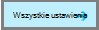

2. Karta **Ustawienia** wybierz polecenie **alertów i zdarzeń**. 

3. Na karta **alertów i zdarzenia** kliknij pozycję **Kopia zapasowa alerty**. 

    Karta **Alertów kopii zapasowej** zostanie wyświetlona a filtrowanych alertów.

    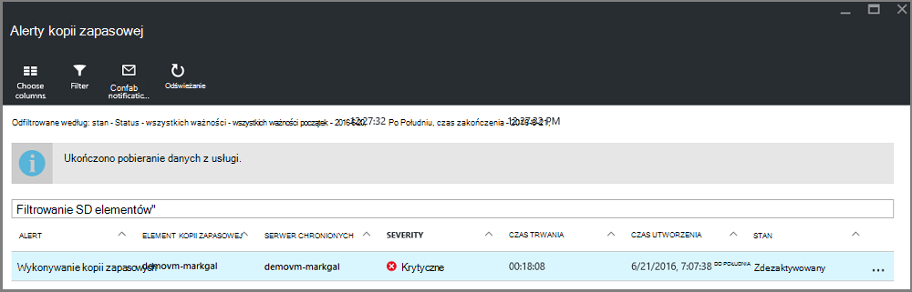

4. Aby wyświetlić szczegółowe informacje na temat określonego alert, na liście zdarzenia, kliknij alert, aby otworzyć jego karta **Szczegóły** .

    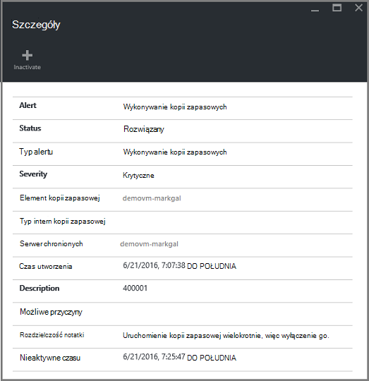

    Aby dostosować atrybuty wyświetlane na liście, zobacz [atrybuty dodatkowe zdarzenia widoku](backup-azure-monitor-vms.md#view-additional-event-attributes)

## <a name="configure-notifications"></a>Konfigurowanie powiadomień

 Można skonfigurować usługę do wysyłania powiadomień e-mail dla alertów o wprowadzonych w ciągu ostatnich godziny lub gdy występują określonych typów zdarzeń.

Aby skonfigurować powiadomienia e-mail dla alertów

1. W menu alerty kopii zapasowej kliknij pozycję **Konfiguruj powiadomienia**

    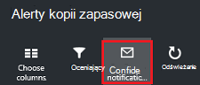

    Zostanie wyświetlona karta Konfiguruj powiadomienia.

    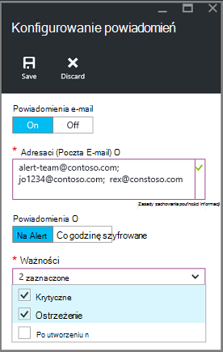

2. Konfigurowanie powiadomień karta, powiadomienia E-mail wybierz polecenie **na**.

    Adresatów oraz ważności okien dialogowych być gwiazdką, ponieważ informacje te są wymagane. Podaj co najmniej jeden adres e-mail, a następnie zaznacz co najmniej jeden ważności.

3. W oknie dialogowym **Adresaci (Poczta E-mail)** wpisz adresy e-mail dla osób, które powiadomień. Użyj formatu: username@domainname.com. Wiele adresów e-mail rozdzielone średnikami (;).

4. W obszarze **powiadamiania** wybierz **Na Alert** do wysyłania powiadomień, gdy występuje określony alertu lub **Godzinowego szyfrowane** wysłać skrót do ostatniej godziny.

5. W oknie dialogowym **ważności** wybierz jeden lub więcej poziomów, które ma zostać wyzwolona powiadomienia pocztą e-mail.

6. Kliknij przycisk **Zapisz**.
### <a name="what-alert-types-are-available-for-azure-iaas-vm-backup"></a>Jakie typy alertów są dostępne dla kopii zapasowych maszyn wirtualnych IaaS Azure?
| Poziom alertów  | Wysyłania alertów |
| ------------- | ------------- |
| Krytyczne | Błąd kopii zapasowej, niepowodzenie odzyskiwania  |
| Ostrzeżenie  | Brak |
| Informacyjne  | Brak  |

### <a name="are-there-situations-where-email-isnt-sent-even-if-notifications-are-configured"></a>Czy istnieją sytuacje, w której nie jest wysłana wiadomość e-mail, nawet jeśli skonfigurowano powiadomienia?

Istnieją sytuacje, w którym alert nie zostanie wysłany, mimo że powiadomienia o jego zostały poprawnie skonfigurowane. W następujących sytuacjach wiadomości e-mail powiadomienia nie są wysyłane w celu uniknięcia hałasu alert:

- Jeśli powiadomienia są skonfigurowane do godzinowe szyfrowane i alert jest podniesiona rozwiązany przez godzinę.
- Zadanie zostało anulowane.
- Zadanie kopii zapasowej zostanie wywołana, a następnie kończy się niepowodzeniem, a zadanie kopii zapasowej jest w toku.
- Uruchamia zaplanowane zadanie kopii zapasowej dla maszyn wirtualnych obsługiwanych przez Menedżera zasobów, ale maszyn wirtualnych już nie istnieje.

## <a name="customize-your-view-of-events"></a>Dostosowywanie widoku zdarzenia

Ustawienie **dzienników inspekcji** zawiera zestaw wstępnie zdefiniowanych filtrów i kolumny z informacjami o zdarzenia operacyjnego. Widok można dostosować tak, aby po otwarciu karta **zdarzenia** zawiera informacje, które chcesz.

1. W [pulpitu nawigacyjnego magazynu](./backup-azure-manage-vms.md#open-a-recovery-services-vault-in-the-dashboard)przejdź do, a następnie kliknij przycisk **Dzienników inspekcji** , aby otworzyć karta **zdarzeń** .

    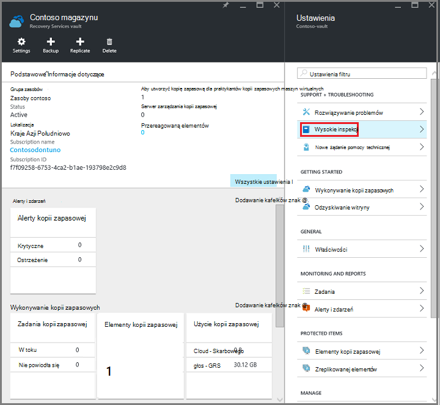

    Karta **zdarzeń** po otwarciu zdarzenia operacyjne filtrowane tylko dla bieżącego magazynu.

    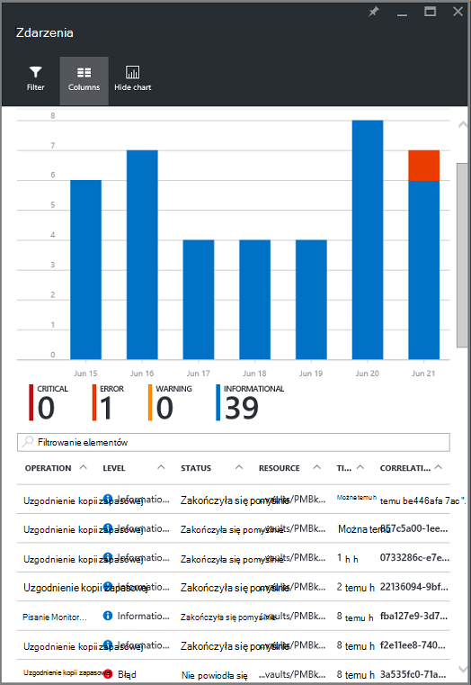

    Karta Lista krytyczne, błędu, ostrzeżenia i zdarzenia informacyjne, które wystąpiły w ostatnim tygodniu. Przedział czasu jest wartością domyślną w **Filtr**. Karta **zdarzenia** zawiera również wykresu słupkowego śledzenia po wystąpieniu zdarzenia. Jeśli nie chcesz wyświetlić wykres słupkowy w menu **zdarzenia** kliknij pozycję **Ukryj wykres** , aby przełączyć wyłączenia na wykresie. Widok domyślny zdarzeń pokazuje informacje operacji, poziom, stan, zasobów i czasu. Aby dowiedzieć się, jak Uwidacznianie dodatkowe atrybuty zdarzenia Zobacz sekcji [rozwijanie informacje dotyczące zdarzeń](backup-azure-monitor-vms.md#view-additional-event-attributes).

2. Aby uzyskać dodatkowe informacje dotyczące zdarzenia operacyjne, w kolumnie **Operacja** kliknij zdarzenie operacyjne, aby otworzyć jej karta. Karta zawiera szczegółowe informacje o zdarzeniach. Zdarzenia są pogrupowane według ich identyfikator korelacji i Lista zdarzeń, które wystąpiły w przedziale czasu.

    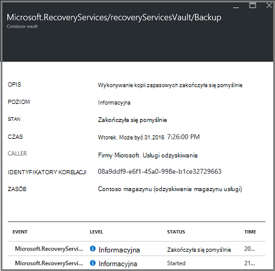

3. Aby wyświetlić szczegółowe informacje dotyczące określonego zdarzenia, na liście zdarzenia, kliknij zdarzenie, aby otworzyć jego karta **Szczegóły** .

    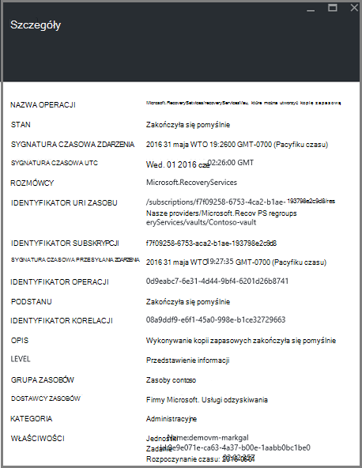

    Informacje o poziom zdarzeń jest tak szczegółowe, jak uzyskuje informacje. Jeśli wolisz tyle informacje o każdym zdarzeniu są wyświetlane, a potem dodać tyle szczegółów do karta **zdarzenia** , zobacz sekcję [rozwijanie informacje dotyczące zdarzeń](backup-azure-monitor-vms.md#view-additional-event-attributes).


## <a name="customize-the-event-filter"></a>Dostosuj filtr zdarzeń
Aby dostosować lub wybierz informacje, które pojawia się w określonym karta za pomocą **filtru** . Aby filtrować informacje dotyczące zdarzeń:

1. W [pulpitu nawigacyjnego magazynu](./backup-azure-manage-vms.md#open-a-recovery-services-vault-in-the-dashboard)przejdź do, a następnie kliknij przycisk **Dzienników inspekcji** , aby otworzyć karta **zdarzeń** .

    

    Karta **zdarzeń** po otwarciu zdarzenia operacyjne filtrowane tylko dla bieżącego magazynu.

    

2. W menu **zdarzenia** kliknij **Filtr** , aby otworzyć tego karta.

    

3. Karta **Filtr** dopasowanie filtry **poziom**, **zakresu czasu**i **rozmówcy** . Inne filtry nie są dostępne, ponieważ zostały one skonfigurowany w celu zapewnienia bieżących informacji na potrzeby magazynu usługi odzyskiwania.

    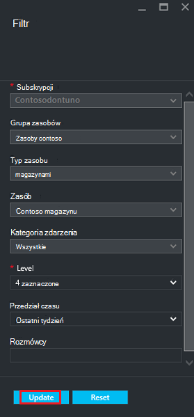

    Możesz określić **poziom** zdarzenia: krytycznych, błędu, ostrzeżenia lub informacyjne. Możesz wybrać dowolne poziomy zdarzenia, ale są konieczne co najmniej jeden wybrany poziom. Włącz poziom lub wyłącz. Filtr **zakresu czasu** można określić czas rejestrowania zdarzeń. Jeśli korzystasz z niestandardowej przedziale czasu, można ustawić godziny rozpoczęcia i zakończenia.

4. Gdy zechcesz kwerendy dzienników operacji przy użyciu filtru, kliknij przycisk **Aktualizuj**. Wyniki są wyświetlane w karta **zdarzeń** .

    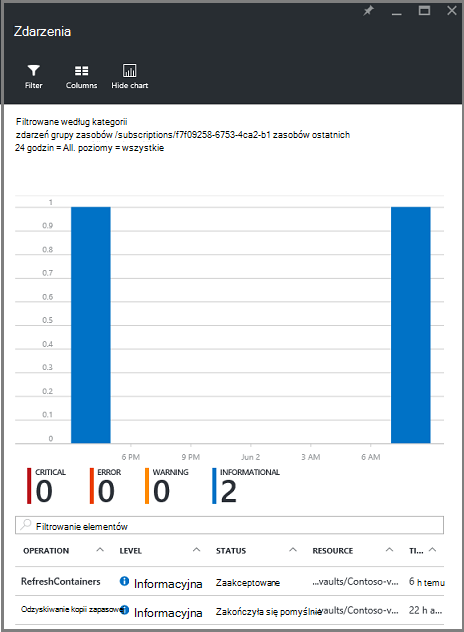


### <a name="view-additional-event-attributes"></a>Wyświetlenie atrybutów dodatkowe zdarzenia
Przycisk **kolumny** można włączyć atrybuty dodatkowe wydarzenia są wyświetlane na liście Karta **zdarzeń** . Domyślna lista zdarzeń wyświetla informacje dotyczące operacji, poziom, stan, zasobów i czasu. Aby włączyć dodatkowe atrybuty:

1. Wybierz polecenie **kolumny**z karta **zdarzeń** .

    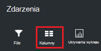

    Zostanie wyświetlona karta **Wybierz kolumny** .

    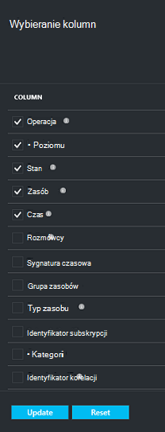

2. Aby zaznaczyć atrybut, zaznacz pole wyboru. Pole wyboru atrybut przełącza Włączanie i wyłączanie funkcji.

3. Kliknij przycisk **Resetuj** zresetować listę atrybutów w karta **zdarzeń** . Po dodaniu lub usunięciu atrybuty z listy, służy do wyświetlania nowej listy atrybutów zdarzenia **zresetować** .

4. Kliknij przycisk **Aktualizacja** , aby zaktualizować dane w atrybutach zdarzenia. Poniższa tabela zawiera informacje o wszystkich atrybutów.

| Nazwa kolumny      |Opis|
| -----------------|-----------|
| Operacja|Nazwa operacji|
| Poziom|Poziom operacji wartości mogą być: informacyjny, ostrzeżenie, błąd lub krytyczne|
|Stan|Opisowy stan operacji|
|Zasób|Adres URL, który identyfikuje zasób; nazywane także identyfikator zasobu|
|Czas|Czas, od bieżącego czasu, jeśli wystąpiło zdarzenie|
|Rozmówcy|Kto lub co o nazwie lub wywołany wydarzenia; może być systemu lub użytkownika|
|Sygnatura czasowa|Podczas gdy Wyzwolone zdarzenie|
|Grupa zasobów|Grupa zasobów|
|Typ zasobu|Typ zasobu wewnętrznych, używanym przez Menedżera zasobów|
|Identyfikator subskrypcji|Identyfikator subskrypcji skojarzone|
|Kategoria|Kategoria zdarzenia|
|Identyfikator korelacji|Typowe identyfikator powiązane z nimi zdarzenia|


## <a name="use-powershell-to-customize-alerts"></a>Dostosowywanie alertów przy użyciu programu PowerShell
Niestandardowe alertów dla zadań można uzyskać w portalu. Aby pobrać te zadania, należy zdefiniować programu PowerShell reguły alertu o zdarzeniach dzienniki operacyjne. Używanie *programu PowerShell wersji 1.3.0 lub nowszej*.

Aby zdefiniować powiadomieniem niestandardowym alert dla kopii zapasowej błędy, użyj polecenia, takie jak następujący skrypt:

```
PS C:\> $actionEmail = New-AzureRmAlertRuleEmail -CustomEmail contoso@microsoft.com
PS C:\> Add-AzureRmLogAlertRule -Name backupFailedAlert -Location "East US" -ResourceGroup RecoveryServices-DP2RCXUGWS3MLJF4LKPI3A3OMJ2DI4SRJK6HIJH22HFIHZVVELRQ-East-US -OperationName Microsoft.Backup/RecoveryServicesVault/Backup -Status Failed -TargetResourceId /subscriptions/86eeac34-eth9a-4de3-84db-7a27d121967e/resourceGroups/RecoveryServices-DP2RCXUGWS3MLJF4LKPI3A3OMJ2DI4SRJK6HIJH22HFIHZVVELRQ-East-US/providers/microsoft.backupbvtd2/RecoveryServicesVault/trinadhVault -Actions $actionEmail
```

**ResourceId** : ResourceId możesz przejść z dzienników inspekcji. ResourceId jest adres URL podany w kolumnie zasób dzienniki operacji.

**OperationName** : OperationName są zapisane w formacie "Microsoft.RecoveryServices/recoveryServicesVault/*EventName*" miejsce, w którym można *EventName* :<br/>
- Zarejestruj się <br/>
- Unregister <br/>
- ConfigureProtection <br/>
- Wykonywanie kopii zapasowych <br/>
- Przywracanie <br/>
- StopProtection <br/>
- DeleteBackupData <br/>
- CreateProtectionPolicy <br/>
- DeleteProtectionPolicy <br/>
- UpdateProtectionPolicy <br/>

**Stan** : obsługiwane są następujące wartości wprowadzenie, udało się lub nie powiodło się.

**Grupa zasobów** : jest to grupa zasobów, do której należy zasób. Możesz dodać kolumny grupa zasobów do wygenerowane dzienników. Grupa zasobów jest jednym z dostępnych typów danych zdarzenia.

**Nazwa** : Nazwa reguły alertu.

**CustomEmail** : określić adres e-mail niestandardowy, do którego chcesz wysłać powiadomienie o alercie

**SendToServiceOwners** : Ta opcja wysyła alertów dla wszystkich administratorów i administratorów współpracujących subskrypcji. Mogą zostać użyte w polecenia cmdlet **New-AzureRmAlertRuleEmail**

### <a name="limitations-on-alerts"></a>Ograniczenia dotyczące alertów
Alerty na podstawie zdarzenia podlegają następującym ograniczeniom:

1. Alerty są wyzwalane w przypadku wszystkich maszyn wirtualnych w magazynu usługi odzyskiwania. Nie można dostosować alert dotyczący podzbiór maszyn wirtualnych w magazynu usługi odzyskiwania.
2. Ta funkcja jest w podglądzie. [Dowiedz się więcej](../monitoring-and-diagnostics/insights-powershell-samples.md#create-alert-rules)
3. Alerty są wysyłane z "alerts-noreply@mail.windowsazure.com". Obecnie nie można zmodyfikować nadawcy wiadomości e-mail.


## <a name="next-steps"></a>Następne kroki

Dzienniki zdarzeń Włącz doskonałe podsumowaniem końcowym i inspekcji obsługę kopii zapasowych. Rejestrowane są następujące operacje:

- Zarejestruj się
- Unregister
- Konfigurowanie ochrony
- Kopia zapasowa (według harmonogramu oraz kopii zapasowej na żądanie)
- Przywracanie
- Wyłączanie ochrony
- Usuwanie danych kopii zapasowej
- Dodawanie zasad
- Usuwanie zasad
- Zasady aktualizacji
- Anulowanie zadania

Szeroki opis zdarzenia operacje i dzienników inspekcji w usługach Azure, zapoznaj się z artykułem [Przeglądanie zdarzeń i dzienników inspekcji](../monitoring-and-diagnostics/insights-debugging-with-events.md).

Aby uzyskać informacje dotyczące ponownego tworzenia maszyny wirtualnej z punktu odzyskiwania zapoznaj się z [Przywracanie maszyny wirtualne Azure](backup-azure-restore-vms.md). Jeśli potrzebujesz informacji o ochronie maszyn wirtualnych, zobacz [najpierw sprawdzić: wykonywanie kopii zapasowej pośrednictwem SMS do magazynu usługi odzyskiwania](backup-azure-vms-first-look-arm.md). Informacje na temat zadań zarządzania kopii zapasowych maszyn wirtualnych w artykule [Zarządzanie Azure maszyn wirtualnych wykonywania kopii zapasowych](backup-azure-manage-vms.md).
