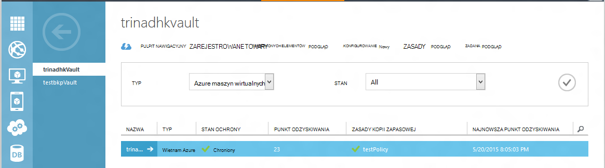
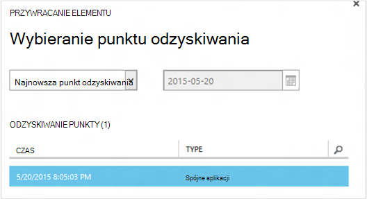
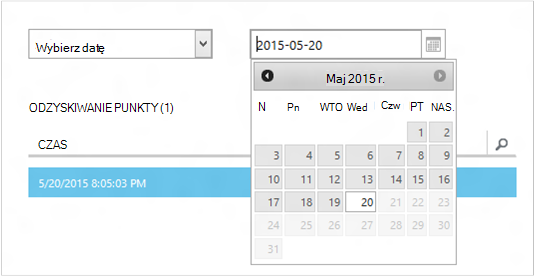
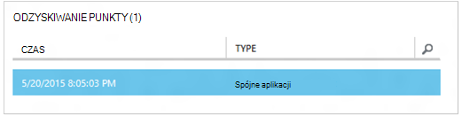
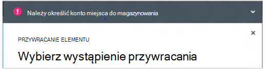
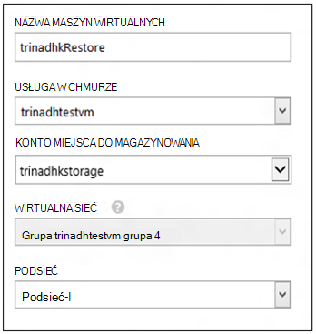
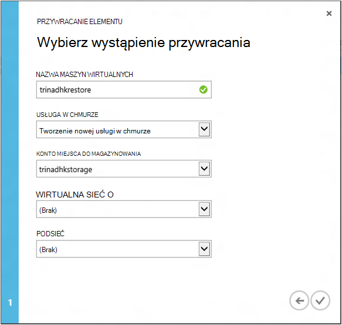
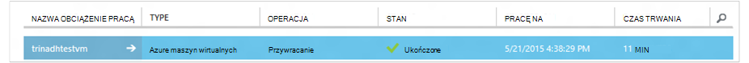

<properties
    pageTitle="Przywracanie z kopii zapasowej maszyn wirtualnych | Microsoft Azure"
    description="Dowiedz się, jak przywrócić Azure maszyn wirtualnych z punkt odzyskiwania"
    services="backup"
    documentationCenter=""
    authors="trinadhk"
    manager="shreeshd"
    editor=""
    keywords="Przywracanie kopii zapasowych. jak przywrócić; punkt odzyskiwania;"/>

<tags
    ms.service="backup"
    ms.workload="storage-backup-recovery"
    ms.tgt_pltfrm="na"
    ms.devlang="na"
    ms.topic="article"
    ms.date="08/02/2016"
    ms.author="trinadhk; jimpark;"/>

# Przywracanie maszyn wirtualnych platformy Azure

> [AZURE.SELECTOR]
- [Przywracanie maszyny wirtualne w Azure portal](backup-azure-arm-restore-vms.md)
- [Przywracanie maszyny wirtualne w klasycznym portalu](backup-azure-restore-vms.md)

Przywracanie maszyny wirtualnej do nowych maszyn wirtualnych z kopii zapasowych przechowywanych w Azure magazynu kopii zapasowej poniższe czynności.

## Przywracanie przepływu pracy

### 1. Wybierz odpowiedni element, aby przywrócić

1. Przejdź do karty **Chronionych elementów** i wybierz pozycję maszyny wirtualnej, który chcesz przywrócić do nowych maszyn wirtualnych.

    

    Kolumny **Punkt odzyskiwania** na stronie **Chronionych elementów** określić liczbę punktów odzyskiwania dla maszyny wirtualnej. Kolumna **Punkt odzyskiwania najnowszych** informuje czas najnowszą kopię zapasową, z której można je przywrócić maszyny wirtualnej.

2. Kliknij pozycję **Przywracanie** , aby otworzyć kreatora **Przywracanie elementu** .

    

### 2. Wybierz punkt odzyskiwania

1. Na ekranie **Wybierz punkt odzyskiwania** można przywrócić z najnowszych punkt odzyskiwania lub poprzedniego punktu w czasie. Domyślna opcja zaznaczone, gdy zostanie otwarty Kreator to *najnowszych odzyskiwania*.

    

2. Aby wybrać wcześniejszą w czasie, wybierz opcję **Wybierz daty** na liście rozwijanej, a w formant kalendarza wybierz datę, klikając **ikonę kalendarza**. W celu kontrolowania wszystkie daty, które zawierają punkty odzyskiwania są wypełnione uproszczonej odcień szarości i są możliwe do wybrania przez użytkownika.

    

    Po kliknięciu przycisku Data w formancie kalendarza odzyskiwania punktów dostępnych na że daty będą wyświetlane w poniższej tabeli punktów odzyskiwania. Kolumnie **czas** wskazuje czas, w którym wykonano migawki. Kolumna **Typ** Wyświetla [spójności](https://azure.microsoft.com/documentation/articles/backup-azure-vms/#consistency-of-recovery-points) punkt odzyskiwania. Nagłówka tabeli zawiera liczbę punktów odzyskiwania dostępnych w danym dniu w nawiasach.

    

3. Wybierz punkt odzyskiwania z tabeli **Odzyskiwania punktów** , a następnie kliknij przycisk Dalej strzałkę, aby przejść do następnego ekranu.

### 3. Określ miejsce docelowe

1. Na ekranie **Wybierz pozycję Przywróć wystąpienie** określić szczegóły gdzie przywracać maszyny wirtualnej.

  - Określ nazwę maszyn wirtualnych: W usłudze w chmurze danej, nazwa maszyn wirtualnych musi być unikatowa. Firma Microsoft nie obsługuje nadmiernie pisania istniejących maszyn wirtualnych. 
  - Wybierz pozycję usługi w chmurze dla maszyn wirtualnych: jest to konieczne do tworzenia maszyn wirtualnych. Możesz użyć istniejącej usługi w chmurze lub utworzyć nowe usługi w chmurze.

        Whatever cloud service name is picked should be globally unique. Typically, the cloud service name gets associated with a public-facing URL in the form of [cloudservice].cloudapp.net. Azure will not allow you to create a new cloud service if the name has already been used. If you choose to create select create a new cloud service, it will be given the same name as the virtual machine – in which case the VM name picked should be unique enough to be applied to the associated cloud service.

        We only display cloud services and virtual networks that are not associated with any affinity groups in the restore instance details. [Learn More](../virtual-network/virtual-networks-migrate-to-regional-vnet.md).

2. Wybierz konto miejsca do magazynowania dla maszyn wirtualnych: jest to konieczne do tworzenia maszyn wirtualnych. Możesz wybrać z istniejących kont miejsca do magazynowania w tym samym regionie jako magazynu kopii zapasowej Azure. Firma Microsoft nie obsługuje konta miejsca do magazynowania, które są strefy zbędne lub typu miejsca do magazynowania Premium.

    Jeśli nie ma żadnych kont miejsca do magazynowania z obsługiwana konfiguracja, Utwórz konto miejsca do magazynowania obsługiwana konfiguracja przed rozpoczęciem operacji przywracania.

    

3. Wybierz pozycję wirtualną sieć: wirtualną sieć (VNET) dla maszyny wirtualnej powinna już być zaznaczona w momencie tworzenia maszyn wirtualnych. Przywracanie interfejsu użytkownika zawiera wszystkie VNETs w tej subskrypcji, który może być używany. Nie jest obowiązkowe, aby wybrać VNET przywrócenie maszyn wirtualnych — będzie mógł połączyć się z przywróconym maszyny wirtualnej w Internecie, nawet jeśli nie zastosowano VNET.

    Jeśli zaznaczona usługa w chmurze jest skojarzone z wirtualnej sieci, nie można zmienić wirtualnej sieci.

    

4. Zaznacz podsieć: W przypadku, gdy VNET ma podsieci, domyślnie pierwszą podsieć zostanie wybrana. Wybierz odpowiednie opcje listy rozwijanej podsieci wybranych przez użytkownika. Aby uzyskać szczegóły podsieci Przejdź rozszerzenia sieci na [stronie głównej portalu](https://manage.windowsazure.com/), przejdź do **Wirtualnych sieci** i wybierz pozycję wirtualną sieć i przechodzenie do szczegółów w Konfiguruj, aby wyświetlić szczegóły podsieci.

    

5. Kliknij ikonę **Prześlij** w kreatorze, aby przesłać szczegóły i utworzyć zadanie przywracania.

## Śledzenie operacji przywracania
Po wprowadzania wszystkie informacje w Kreatorze przywracania i przesłane jej kopia zapasowa Azure spróbuj utworzyć zadanie do śledzenia przywracanie.

Tworzenie zadania się pomyślnie, pojawi się powiadomienie z wyskakującego wskazująca, czy zadanie jest tworzona. Więcej informacji można uzyskać, klikając przycisk **Zadania** , które umożliwią Przechodzenie do karty **zadania** .

Po ukończeniu operacji przywracania zostaną oznaczone jako ukończone na karcie **zadania** .

Po przywróceniu maszyna wirtualna może być konieczne ponownie zainstalować rozszerzenia istniejących na oryginalnym maszyn wirtualnych i [Modyfikowanie punkty końcowe](../virtual-machines/virtual-machines-windows-classic-setup-endpoints.md) maszyny wirtualnej w portalu Azure.

## Po wprowadzeniu Przywracanie czynności
Jeśli korzystasz z rozkładu Linux inicjowania chmury podstawie takich jak Ubuntu, ze względów bezpieczeństwa, hasło zostaną zablokowane opublikować przywracania. Użyj rozszerzenia VMAccess na przywrócenie maszyn wirtualnych o [zresetowanie hasła](../virtual-machines/virtual-machines-linux-classic-reset-access.md). Zaleca się za pomocą klawiszy SSH na tych dystrybucji, aby uniknąć resetowania hasła wpis przywracania. 

## Wykonywanie kopii zapasowej dla przywrócenie maszyny wirtualne
Po przywróceniu maszyn wirtualnych do samej usługi w chmurze o takiej samej nazwie jak pierwotnie kopii zapasowej maszyn wirtualnych, nadal kopii zapasowej na przywracanie wpis maszyn wirtualnych. Jeśli masz przywrócona maszyn wirtualnych do usługi w chmurze różnych lub określony inną nazwę przywrócenie maszyn wirtualnych, to jest traktowana jako nowy maszyn wirtualnych i potrzebne do wykonania kopii zapasowej konfiguracji przywrócone maszyn wirtualnych.

## Przywracanie maszyny podczas Azure awarii centrum danych
Azure kopia zapasowa umożliwia przywracanie kopii zapasowej maszyny wirtualne Centrum iloczynów danych, w przypadku, gdy dane podstawowe Centrum miejsce, w którym maszyny wirtualne z awarii środowiska i skonfigurowano magazynu kopii zapasowej należy geo zbędne. Podczas takich scenariuszy należy wybrać konta miejsca do magazynowania, które znajduje się w centrum danych iloczynów i pozostałą część procesu przywracania pozostaje w tym samym. Azure kopii zapasowej używa do uruchamiania usługi iloczynów geo do utworzenia przywrócenie maszyny wirtualnej. 

## Przywracanie maszyny wirtualne kontrolera domeny
Wykonywanie kopii zapasowych maszyn wirtualnych kontrolera domeny kontrolera (domeny) jest obsługiwany scenariusz z kopią zapasową Azure. Jednak niektóre należy zachować ostrożność podczas procesu przywracania. Środowisko Przywróć znacznie różni się w maszyny wirtualne kontrolera domeny w konfiguracji kontrolera domeny pojedynczej a maszyny wirtualne w konfiguracji kontrolera domeny wielokrotne.

### Pojedynczy kontrolera domeny
Maszyn wirtualnych można przywrócić (na przykład innych maszyn wirtualnych) Azure portalu lub przy użyciu programu PowerShell.

### Wiele DCs
Gdy masz środowisku kontrolera domeny wielu kontrolerów mieć własne sposób synchronizacja danych. Po punkcie przywracania starszych przywrócony *bez właściwych środków bezpieczeństwa*procesu wycofywania USN można zrobić spustoszenie w środowisku kontrolera domeny wielokrotne. Jest to odpowiednia metoda odzyskać maszyn wirtualnych uruchomić go w trybie DSRM.

Największym wyzwaniem powstaje, ponieważ trybu DSRM nie znajduje się w Azure. Aby przywrócić maszyn wirtualnych, nie można używać Azure portal. Obsługiwane tylko przywracanie mechanizm jest oparta na dysku przywracania przy użyciu programu PowerShell.

>[AZURE.WARNING] Aby maszyny wirtualne kontrolera domeny w środowisku kontrolera domeny wielokrotne nie należy używać Azure portal do przywrócenia! Przywracanie programu PowerShell podstawie tylko jest obsługiwane

Dowiedz się więcej o [USN wycofywania problemu](https://technet.microsoft.com/library/dd363553) i strategii sugerowane poprawki automatycznej.

## Przywracanie maszyny wirtualne za pomocą konfiguracji sieci specjalne
Kopia zapasowa Azure obsługuje kopii zapasowej po konfiguracji sieci specjalnych maszyn wirtualnych.

- Maszyny wirtualne w obszarze równoważenia obciążenia (wewnętrznych i zewnętrznych)
- Maszyny wirtualne z wielu zastrzeżone adresy IP
- Maszyny wirtualne z kart

Tę konfigurację przesądza po zagadnienia podczas ich przywracania.

>[AZURE.TIP] Użyj programu PowerShell podstawie Przywracanie przepływu do odtworzenia konfiguracji sieci specjalnych maszyny wirtualne wpis przywracania.

### Przywracanie z interfejsu użytkownika:
Podczas przywracania z interfejsu użytkownika, **zawsze wybierz nowy usługi w chmurze**. Należy zauważyć, że ponieważ portalu wymaga tylko obowiązkowe parametry podczas przywracania przepływ, maszyny wirtualne przywrócić za pomocą interfejsu użytkownika zostaną utracone konfiguracji sieci specjalnych, które posiadają. Innymi słowy, przywracanie maszyny wirtualne będzie normalnym maszyny wirtualne bez konfiguracji równoważenia obciążenia lub wielu NIC lub wielu zastrzeżonego adresu IP.

### Przywracanie z programu PowerShell:
PowerShell ma możliwość tylko przywracanie z kopii zapasowej dysków maszyn wirtualnych i nie tworzenia maszyny wirtualnej. Jest to pomocne w przypadku przywracanie maszyn wirtualnych, wymagających mentined konfiguracji sieci specjalnych powyżej.

Aby w pełni odtworzyć dysków Przywracanie wpis maszyn wirtualnych, wykonaj następujące czynności:

1. Przywracanie z kopii zapasowej magazynu przy użyciu [Programu PowerShell kopii zapasowej Azure](../backup-azure-vms-classic-automation.md#restore-an-azure-vm) dysków

2. Tworzenie konfiguracji maszyn wirtualnych wymagane dla usługi równoważenia obciążenia / wielu NIC-wielokrotności zastrzeżony adres IP przy użyciu poleceń cmdlet programu PowerShell i użyj go, aby utworzyć maszyn wirtualnych systemu potrzeby konfiguracji.
    - Tworzenie maszyn wirtualnych w usłudze w chmurze przy użyciu [usługi równoważenia obciążenia wewnętrznych](https://azure.microsoft.com/documentation/articles/load-balancer-internal-getstarted/)
    - Tworzenie maszyn wirtualnych, aby nawiązać połączenie [Internet przeciwległych równoważenia obciążenia] (https://azure.microsoft.com/en-us/documentation/articles/load-balancer-internet-getstarted/)
    - Tworzenie maszyn wirtualnych przy użyciu [kart](https://azure.microsoft.com/documentation/articles/virtual-networks-multiple-nics/)
    - Tworzenie maszyn wirtualnych przy użyciu [wielu zastrzeżone adresy IP](https://azure.microsoft.com/documentation/articles/virtual-networks-reserved-public-ip/)

## Następne kroki
- [Rozwiązywanie problemów z błędami](backup-azure-vms-troubleshoot.md#restore)
- [Zarządzanie maszyn wirtualnych](backup-azure-manage-vms.md)
