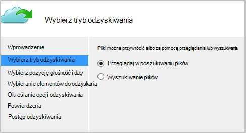

<properties
   pageTitle="Przywracanie danych do systemu Windows Server lub klienta systemu Windows z Azure przy użyciu modelu wdrożenia Menedżera zasobów | Microsoft Azure"
   description="Dowiedz się, jak przywrócić z systemem Windows Server lub klienta w systemie Windows."
   services="backup"
   documentationCenter=""
   authors="saurabhsensharma"
   manager="shivamg"
   editor=""/>

<tags
   ms.service="backup"
   ms.workload="storage-backup-recovery"
     ms.tgt_pltfrm="na"
     ms.devlang="na"
     ms.topic="article"
     ms.date="08/02/2016"
     ms.author="trinadhk; jimpark; markgal;"/>

# Przywracanie plików systemu Windows server lub komputer kliencki systemu Windows przy użyciu modelu wdrożenia Menedżera zasobów

> [AZURE.SELECTOR]
- [Azure portal](backup-azure-restore-windows-server.md)
- [Klasyczny portalu](backup-azure-restore-windows-server-classic.md)

W tym artykule opisano kroki wymagane do wykonywania dwa typy operacji przywracania:

- Przywracanie danych na tym samym komputerze, z której zostały pobrane kopie zapasowe.
- Przywracanie danych do innego komputera.

W obu przypadkach dane są pobierane z magazynu usługi Azure odzyskiwania.

[AZURE.INCLUDE [learn-about-deployment-models](../../includes/learn-about-deployment-models-rm-include.md)]model klasyczny wdrożenia.

## Odzyskiwanie danych do tego samego komputera
Jeśli przypadkowo usunięty plik i chcesz go przywrócić do tego samego komputera (z którego kopii zapasowej, jest przyjmowana), robiąc tak pomoże Ci odzyskania danych.

1. Otwieranie przystawki **Kopia zapasowa Microsoft Azure** .
2. Kliknij pozycję **Odzyskiwanie danych** , aby zainicjować przepływu pracy.

    

3. Wybierz pozycję * *ten serwer (*yourmachinename*) ** opcję, aby przywrócić kopie zapasowe plików na tym samym komputerze.

    

4. Wybierz opcję **Przeglądaj w poszukiwaniu plików** lub **wyszukiwać pliki**.

    Pozostaw wybraną opcję domyślne, jeśli planujesz przywrócić jeden lub więcej plików, którego ścieżka jest znany. Jeśli wątpliwości dotyczących struktury folderów, ale chcesz wyszukać plik, wybierz opcję **wyszukiwania plików** . W tej sekcji w celu firma Microsoft będzie kontynuować domyślnej opcji.

    

5. Wybierz wielkość, z której chcesz przywrócić plik.

    Można przywrócić z dowolnego miejsca w czasie. Daty, które są wyświetlane czcionką **pogrubioną** w formancie kalendarza wskazują dostępność punktu przywracania. Po wybraniu daty według harmonogramu tworzenia kopii zapasowych i powodzenia operacji wykonywania kopii zapasowej, można wybrać punktu w czasie z listy **czasu** w dół.

    

6. Wybieranie elementów do odzyskania. Możesz wybrać wiele folderów i plików, które chcesz przywrócić.

    

7. Parametry odzyskiwania.

    

  - Dostępna jest opcja Przywracanie w pierwotnej lokalizacji (w którym plik/folder byłyby zastępowane) lub do innej lokalizacji w tym samym komputerze.
  - Jeśli plik/folder, który chcesz przywrócić istnieje w lokalizacji docelowej, można tworzyć kopie (dwie wersje tego samego pliku), zastąpić pliki w lokalizacji docelowej lub pominąć odzyskiwania plików, które istnieje w docelowej.
  - Zdecydowanie zaleca się pozostawienie domyślna opcja przywracania list kontroli dostępu do plików, które są ich odzyskania.

8. Po tych danych wejściowych są dostarczane, kliknij przycisk **Dalej**. Przepływ pracy odzyskiwania, które przywraca pliki do tego komputera, zostanie rozpoczęte.

## Odzyskiwanie do naprzemiennych komputera
Jeśli serwer całego zostaną utracone, możesz nadal odzyskiwanie danych z kopii zapasowej Azure na innym komputerze. Poniższe kroki przedstawiają przepływu pracy.  

Terminologii w tych krokach zawiera:

- *Komputerem źródłowym* — oryginalny komputer, z którym wykonano kopię zapasową i który jest obecnie niedostępna.
- *Komputer docelowy* — komputer, do którego jest ich odzyskania danych.
- *Przykładowe magazynu* — magazynu usługi odzyskiwania, do której są rejestrowane *komputerem źródłowym* a *komputera docelowego* .  

> [AZURE.NOTE] Nie można przywrócić kopie zapasowe wykonane na komputerze na komputerze, na którym jest uruchomiony starszej wersji systemu operacyjnego. Na przykład jeśli kopie zapasowe są wykonywane na komputerze z systemem Windows 7, może ona zostać przywrócona w systemie Windows 8 lub nad komputera. Jednak na odwrót nie ma wartość PRAWDA.

1. Otwórz **Program Kopia zapasowa Microsoft Azure** przystawki na *komputerze docelowym*.
2. Upewnij się, że *komputerze docelowym* i *komputerem źródłowym* są zarejestrowane na tym samym magazynu usługi odzyskiwania.
3. Kliknij pozycję **Odzyskiwanie danych** , aby zainicjować przepływu pracy.

    

4. Wybierz **inny serwer**

    

5. Udostępnić plik poświadczeń magazynu, który odpowiada *magazynu próbki*. Jeśli plik magazynu poświadczeń jest nieprawidłowy (lub wygasłe) Pobierz nowy plik magazynu poświadczeń z *magazynu próbki* w portalu Azure. Po znajduje się plik magazynu poświadczeń, zostanie wyświetlony magazynu usługi odzyskiwania w odniesieniu do magazynu poświadczeń pliku.

6. Wybierz *źródło komputera* z listy maszyn wyświetlane.

    

7. Wybierz opcję **wyszukiwania plików** lub **Przeglądaj w poszukiwaniu plików** . W tej sekcji w celu użyjemy opcji **wyszukiwania plików** .

    

8. Na następnym ekranie wybierz pozycję objętości i daty. Wyszukiwanie nazwy folderów i plików, które chcesz przywrócić.

    

9. Wybierz lokalizację, w którym trzeba przywrócić pliki.

    

10. Podaj hasło szyfrowania otrzymany podczas rejestrowania *komputerem źródłowym* *magazynu próbki*.

    

11. Gdy wprowadzono, kliknij polecenie **Odzyskaj**, wyzwalające Przywracanie kopie zapasowe plików do miejsca docelowego, pod warunkiem.

## Następne kroki
- Teraz, gdy zostały odzyskane pliki i foldery, możesz [zarządzać kopie zapasowe](backup-azure-manage-windows-server.md).
