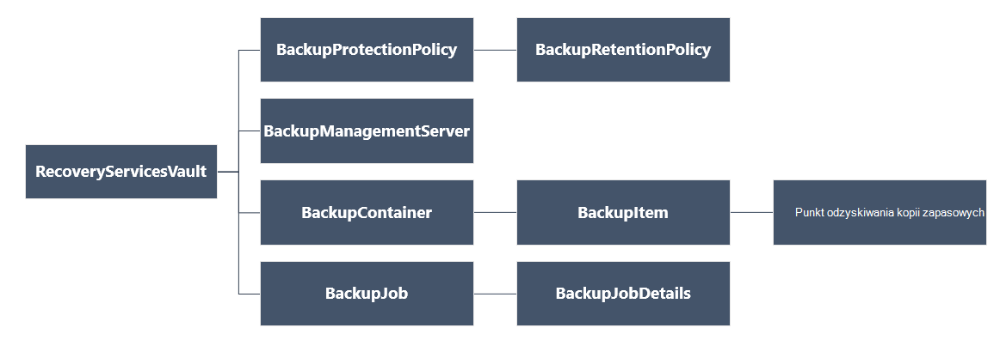

<properties
   pageTitle="Wdrażanie i zarządzanie nią kopie zapasowe dla wdrożony Menedżera zasobów przy użyciu programu PowerShell maszyny wirtualne | Microsoft Azure"
   description="Wdrażanie i zarządzanie nią kopie zapasowe w Azure dla wdrożony Menedżera zasobów maszyny wirtualne za pomocą programu PowerShell"
   services="backup"
   documentationCenter=""
   authors="markgalioto"
   manager="cfreeman"
   editor=""/>

<tags
   ms.service="backup"
   ms.devlang="na"
   ms.topic="article"
   ms.tgt_pltfrm="na"
   ms.workload="storage-backup-recovery"
   ms.date="08/03/2016"
   ms.author="markgal; trinadhk"/>

# <a name="deploy-and-manage-backups-for-resource-manager-deployed-vms-using-powershell"></a>Wdrażanie i zarządzanie nią kopie zapasowe dla maszyny wirtualne wdrożony Menedżera zasobów, przy użyciu programu PowerShell

> [AZURE.SELECTOR]
- [Menedżer zasobów](backup-azure-vms-automation.md)
- [Klasyczny](backup-azure-vms-classic-automation.md)

W tym artykule pokazano, jak za pomocą poleceń cmdlet środowiska PowerShell Azure wykonywanie kopii zapasowej i odzyskiwanie Azure maszyn wirtualnych (maszyn wirtualnych) z magazynu usługi odzyskiwania. Magazynu usługi odzyskiwania jest zasobem Azure Menedżera zasobów i służy do ochrony danych oraz majątku w usługach zarówno Azure i przywracania kopii zapasowych Azure witryny. Za pomocą magazynu usługi odzyskiwania ochrony wdrożony Menedżer usługi Azure maszyny wirtualne, a także wdrożyć Menedżera zasobów Azure maszyny wirtualne.

>[AZURE.NOTE] Azure występują dwa modele wdrożenia służące do tworzenia i pracy z zasobami: [Menedżer zasobów i klasyczny](../resource-manager-deployment-model.md). Ten artykuł dotyczy do użytku z maszyny wirtualne utworzony przy użyciu modelu Menedżera zasobów.

W tym artykule opisano przy użyciu programu PowerShell ochrony maszyny oraz wykonywania i przywracania danych z punktu odzyskiwania.

## <a name="concepts"></a>Pojęcia

Jeśli nie znasz z usługą Azure kopii zapasowej zawiera omówienie dotyczące usługi, zapoznaj się z [Co to jest Azure kopii zapasowej?](backup-introduction-to-azure-backup.md) Zanim zaczniesz, upewnij się, że obejmuje podstawowe informacje o wymaganiach wstępnych wymagane do pracy z kopii zapasowej Azure i ograniczenia dotyczące bieżącego tworzenia kopii zapasowych maszyn wirtualnych.

Aby efektywnie używać programu PowerShell, należy zrozumieć hierarchii obiektów i od czego zacząć.



Aby wyświetlić informacje dotyczące poleceń cmdlet programu AzureRmRecoveryServicesBackup PowerShell, zobacz [Kopia zapasowa Azure - polecenia cmdlet usługi odzyskiwania](https://msdn.microsoft.com/library/mt723320.aspx) w bibliotece Azure.
Aby wyświetlić informacje dotyczące poleceń cmdlet programu AzureRmRecoveryServicesVault PowerShell, zobacz [Polecenia cmdlet Azure odzyskiwania usług](https://msdn.microsoft.com/library/mt643905.aspx).


## <a name="setup-and-registration"></a>Instalacja i rejestracji

Aby rozpocząć:

1. [Pobierz najnowszą wersję programu PowerShell](https://github.com/Azure/azure-powershell/releases) (minimalna wersja wymagana jest: 1.4.0)

2. Znajdź i poleceń cmdlet programu PowerShell kopii zapasowej Azure, wpisując następujące polecenie:

```
PS C:\> Get-Command *azurermrecoveryservices*

CommandType     Name                                               Version    Source
-----------     ----                                               -------    ------
Cmdlet          Backup-AzureRmRecoveryServicesBackupItem           1.4.0      AzureRM.RecoveryServices.Backup
Cmdlet          Disable-AzureRmRecoveryServicesBackupProtection    1.4.0      AzureRM.RecoveryServices.Backup
Cmdlet          Enable-AzureRmRecoveryServicesBackupProtection     1.4.0      AzureRM.RecoveryServices.Backup
Cmdlet          Get-AzureRmRecoveryServicesBackupContainer         1.4.0      AzureRM.RecoveryServices.Backup
Cmdlet          Get-AzureRmRecoveryServicesBackupItem              1.4.0      AzureRM.RecoveryServices.Backup
Cmdlet          Get-AzureRmRecoveryServicesBackupJob               1.4.0      AzureRM.RecoveryServices.Backup
Cmdlet          Get-AzureRmRecoveryServicesBackupJobDetails        1.4.0      AzureRM.RecoveryServices.Backup
Cmdlet          Get-AzureRmRecoveryServicesBackupManagementServer  1.4.0      AzureRM.RecoveryServices.Backup
Cmdlet          Get-AzureRmRecoveryServicesBackupProperties        1.4.0      AzureRM.RecoveryServices
Cmdlet          Get-AzureRmRecoveryServicesBackupProtectionPolicy  1.4.0      AzureRM.RecoveryServices.Backup
Cmdlet          Get-AzureRMRecoveryServicesBackupRecoveryPoint     1.4.0      AzureRM.RecoveryServices.Backup
Cmdlet          Get-AzureRmRecoveryServicesBackupRetentionPolic... 1.4.0      AzureRM.RecoveryServices.Backup
Cmdlet          Get-AzureRmRecoveryServicesBackupSchedulePolicy... 1.4.0      AzureRM.RecoveryServices.Backup
Cmdlet          Get-AzureRmRecoveryServicesVault                   1.4.0      AzureRM.RecoveryServices
Cmdlet          Get-AzureRmRecoveryServicesVaultSettingsFile       1.4.0      AzureRM.RecoveryServices
Cmdlet          New-AzureRmRecoveryServicesBackupProtectionPolicy  1.4.0      AzureRM.RecoveryServices.Backup
Cmdlet          New-AzureRmRecoveryServicesVault                   1.4.0      AzureRM.RecoveryServices
Cmdlet          Remove-AzureRmRecoveryServicesProtectionPolicy     1.4.0      AzureRM.RecoveryServices.Backup
Cmdlet          Remove-AzureRmRecoveryServicesVault                1.4.0      AzureRM.RecoveryServices
Cmdlet          Restore-AzureRMRecoveryServicesBackupItem          1.4.0      AzureRM.RecoveryServices.Backup
Cmdlet          Set-AzureRmRecoveryServicesBackupProperties        1.4.0      AzureRM.RecoveryServices
Cmdlet          Set-AzureRmRecoveryServicesBackupProtectionPolicy  1.4.0      AzureRM.RecoveryServices.Backup
Cmdlet          Set-AzureRmRecoveryServicesVaultContext            1.4.0      AzureRM.RecoveryServices
Cmdlet          Stop-AzureRmRecoveryServicesBackupJob              1.4.0      AzureRM.RecoveryServices.Backup
Cmdlet          Unregister-AzureRmRecoveryServicesBackupContainer  1.4.0      AzureRM.RecoveryServices.Backup
Cmdlet          Unregister-AzureRmRecoveryServicesBackupManagem... 1.4.0      AzureRM.RecoveryServices.Backup
Cmdlet          Wait-AzureRmRecoveryServicesBackupJob              1.4.0      AzureRM.RecoveryServices.Backup
```


Następujące zadania można zautomatyzować przy użyciu programu PowerShell:

- Tworzenie magazynu usługi odzyskiwania
- Aby utworzyć kopię zapasową lub chronić maszyny wirtualne Azure
- Wyzwalanie zadania wykonywania kopii zapasowej
- Monitorowanie zadania wykonywania kopii zapasowej
- Przywracanie Azure maszyn wirtualnych

## <a name="create-a-recovery-services-vault"></a>Tworzenie magazynu usługi odzyskiwania

Poniższe kroki prowadzi użytkownika przez proces tworzenia magazynu usługi odzyskiwania. Magazynu usługi odzyskiwania różni się od magazynu kopii zapasowej.

1. Jeśli korzystasz z kopii zapasowej Azure po raz pierwszy, należy użyć polecenia cmdlet **[AzureRMResourceProvider rejestru](https://msdn.microsoft.com/library/mt679020.aspx)** zarejestrować usługodawcy Azure odzyskiwania przy użyciu swojej subskrypcji.

    ```
    PS C:\> Register-AzureRmResourceProvider -ProviderNamespace "Microsoft.RecoveryServices"
    ```

2. Magazynu usługi odzyskiwania jest zasobem Menedżera zasobów, więc należy umieścić w grupie zasobów. Możesz użyć istniejącej grupy zasobów lub tworzenie nowej grupy zasobów przy użyciu polecenia cmdlet **[New-AzureRmResourceGroup](https://msdn.microsoft.com/library/mt678985.aspx)** . Podczas tworzenia nowej grupy zasobów, określ nazwę i lokalizację dla grupy zasobów.  

    ```
    PS C:\> New-AzureRmResourceGroup –Name "test-rg" –Location "West US"
    ```

3. Aby utworzyć nowy magazyn, należy użyć polecenia cmdlet **[AzureRmRecoveryServicesVault nowy](https://msdn.microsoft.com/library/mt643910.aspx)** . Pamiętaj określić tej samej lokalizacji dla magazyn, która była używana dla grupy zasobów.

    ```
    PS C:\> New-AzureRmRecoveryServicesVault -Name "testvault" -ResourceGroupName " test-rg" -Location "West US"
    ```

4. Określ typ nadmiarowości miejsca do magazynowania mają być używane; można użyć [Lokalnie zbędne przestrzeni dyskowej (LRS)](../storage/storage-redundancy.md#locally-redundant-storage) lub [Geo zbędne przestrzeni dyskowej (GRS)](../storage/storage-redundancy.md#geo-redundant-storage). W poniższym przykładzie pokazano, że jest ustawiona opcja - BackupStorageRedundancy testVault GeoRedundant.

    ```
    PS C:\> $vault1 = Get-AzureRmRecoveryServicesVault –Name "testVault"
    PS C:\> Set-AzureRmRecoveryServicesBackupProperties  -Vault $vault1 -BackupStorageRedundancy GeoRedundant
    ```

    > [AZURE.TIP] Wiele kopii zapasowej Azure poleceń cmdlet wymagają obiekt magazynu usługi odzyskiwania jako danych wejściowych. Z tego powodu jest wygodny do przechowywania obiektu magazynu usługi odzyskiwania kopii zapasowych w zmiennej.

## <a name="view-the-vaults-in-a-subscription"></a>Wyświetlanie magazynów w subskrypcji
Aby wyświetlić listę wszystkich magazynów w bieżącej subskrypcji za pomocą **[Get-AzureRmRecoveryServicesVault](https://msdn.microsoft.com/library/mt643907.aspx)** . Za pomocą tego polecenia, aby sprawdzić, że został utworzony nowy magazynu lub magazynów jakie są dostępne w subskrypcji.

Uruchom polecenie Get-AzureRmRecoveryServicesVault i znajdują się wszystkie magazynami w subskrypcji.

```
PS C:\> Get-AzureRmRecoveryServicesVault
Name              : Contoso-vault
ID                : /subscriptions/1234
Type              : Microsoft.RecoveryServices/vaults
Location          : WestUS
ResourceGroupName : Contoso-docs-rg
SubscriptionId    : 1234-567f-8910-abc
Properties        : Microsoft.Azure.Commands.RecoveryServices.ARSVaultProperties
```


## <a name="backup-azure-vms"></a>Kopii zapasowej Azure maszyny wirtualne
Teraz, gdy użytkownik utworzył magazynu usługi odzyskiwania, można je chronić maszyny wirtualnej. Jednak przed zastosowaniem ochronę, należy ustawić kontekstu magazynu i należy sprawdzić zasady ochrony. Kontekst magazynu definiuje typ danych, który jest chroniony magazyn. Zasady ochrony są harmonogramu uruchomienia zadania kopii zapasowej, a po jakim jest zachowywana każdej kopii zapasowej migawki.

Przed włączeniem ochrony maszyny, możesz ustawić kontekstu magazynu. Kontekst jest stosowana do wszystkich kolejnych poleceń cmdlet.

```
PS C:\> Get-AzureRmRecoveryServicesVault -Name testvault | Set-AzureRmRecoveryServicesVaultContext
```

### <a name="create-a-protection-policy"></a>Tworzenie zasad ochrony

Po utworzeniu nowego magazynu pochodzi z domyślnych zasad. Tych zasad Uaktywnia zadanie kopii zapasowej każdego dnia w określonym czasie. Zasady domyślne kopii zapasowej migawki jest zachowywana przez 30 dni. Domyślną zasadę umożliwia szybkie ochrona usługi maszyn wirtualnych i edytować zasady później z różnych szczegółów.

Umożliwia wyświetlanie listy dostępnych zasad w magazyn **[Get-AzureRmRecoveryServicesBackupProtectionPolicy](https://msdn.microsoft.com/library/mt723300.aspx)** :

```
PS C:\> Get-AzureRmRecoveryServicesBackupProtectionPolicy -WorkloadType AzureVM
Name                 WorkloadType       BackupManagementType BackupTime                DaysOfWeek
----                 ------------       -------------------- ----------                ----------
DefaultPolicy        AzureVM            AzureVM              4/14/2016 5:00:00 PM
```

> [AZURE.NOTE] Strefa czasowa pola BackupTime w programie PowerShell jest UTC. Jednak podczas wykonywania kopii zapasowej jest widoczny w portalu Azure, czas jest dostosowywany do swojej lokalnej strefy czasowej.

Zasady ochrony kopii zapasowej jest skojarzony z co najmniej jedną zasad przechowywania.  Zasady przechowywania Określa, jak długo punkt odzyskiwania są przechowywane z kopią zapasową Azure. **Get-AzureRmRecoveryServicesBackupRetentionPolicyObject** umożliwia wyświetlanie domyślnych zasad przechowywania.  Podobnie **Get AzureRmRecoveryServicesBackupSchedulePolicyObject** umożliwia uzyskanie domyślnych zasad harmonogram. Planowanie i przechowywania obiektów zasad są używane jako dane wejściowe do polecenia cmdlet **New-AzureRmRecoveryServicesBackupProtectionPolicy** .

Zasady ochrony kopii zapasowej Określa, kiedy i jak często zakończeniu tworzenia kopii zapasowej elementu. Polecenia cmdlet New-AzureRmRecoveryServicesBackupProtectionPolicy tworzy obiekt programu PowerShell, który zawiera informacje o zasadach kopii zapasowej. Zasady kopii zapasowej jest używany jako dane wejściowe do polecenia cmdlet Enable-AzureRmRecoveryServicesBackupProtection.

```
PS C:\> $schPol = Get-AzureRmRecoveryServicesBackupSchedulePolicyObject -WorkloadType "AzureVM"
PS C:\>  $retPol = Get-AzureRmRecoveryServicesBackupRetentionPolicyObject -WorkloadType "AzureVM"
PS C:\>  New-AzureRmRecoveryServicesBackupProtectionPolicy -Name "NewPolicy" -WorkloadType AzureVM -RetentionPolicy $retPol -SchedulePolicy $schPol
Name                 WorkloadType       BackupManagementType BackupTime                DaysOfWeek
----                 ------------       -------------------- ----------                ----------
NewPolicy           AzureVM            AzureVM              4/24/2016 1:30:00 AM
```

### <a name="enable-protection"></a>Włącz ochronę

Włączanie ochrony obejmuje dwa obiekty - elementu i zasady. Oba obiekty są wymagane do włączenia ochrony magazyn. Gdy zasady zostały skojarzone z magazyn, kopii zapasowych przepływu pracy zostanie wywołana w czasie zdefiniowane w harmonogramie zasad.

Aby włączyć ochronę na tylko danych szyfrowanych maszyny wirtualne rąk

```
PS C:\> $pol=Get-AzureRmRecoveryServicesBackupProtectionPolicy -Name "NewPolicy"
PS C:\> Enable-AzureRmRecoveryServicesBackupProtection -Policy $pol -Name "V2VM" -ResourceGroupName "RGName1"
```

Aby włączyć ochronę na zaszyfrowaną maszyny wirtualne [zaszyfrowany przy użyciu BEK i KEK], musisz nadać uprawnienia do odczyt klucza magazynu kluczy i hasła usługi Azure kopii zapasowej. 

```
PS C:\> Set-AzureRmKeyVaultAccessPolicy -VaultName 'KeyVaultName' -ResourceGroupName 'RGNameOfKeyVault' -PermissionsToKeys backup,get,list -PermissionsToSecrets get,list -ServicePrincipalName 262044b1-e2ce-469f-a196-69ab7ada62d3
PS C:\> $pol=Get-AzureRmRecoveryServicesBackupProtectionPolicy -Name "NewPolicy"
PS C:\> Enable-AzureRmRecoveryServicesBackupProtection -Policy $pol -Name "V2VM" -ResourceGroupName "RGName1"
```

Na podstawie ASM maszyny wirtualne

```
PS C:\>  $pol=Get-AzureRmRecoveryServicesBackupProtectionPolicy -Name "NewPolicy"
PS C:\>  Enable-AzureRmRecoveryServicesBackupProtection -Policy $pol -Name "V1VM" -ServiceName "ServiceName1"
```

### <a name="modify-a-protection-policy"></a>Modyfikowanie zasady ochrony

Aby zmodyfikować zasady, zmodyfikować obiektu BackupSchedulePolicyObject lub BackupRetentionPolicy i modyfikowanie zasad przy użyciu zestawu AzureRmRecoveryServicesBackupProtectionPolicy

Poniższy przykład zmienia statystykę zasad przechowywania do 365.

```
PS C:\> $retPol = Get-AzureRmRecoveryServicesBackupRetentionPolicyObject -WorkloadType "AzureVM"
PS C:\> $retPol.DailySchedule.DurationCountInDays = 365
PS C:\> $pol= Get-AzureRmRecoveryServicesBackupProtectionPolicy -Name NewPolicy
PS C:\> Set-AzureRmRecoveryServicesBackupProtectionPolicy -Policy $pol  -RetentionPolicy  $RetPol
```

## <a name="run-an-initial-backup"></a>Uruchamianie wstępnej kopii zapasowej

Harmonogram kopii zapasowej uaktywnia pełne wykonywanie kopii zapasowej na początkowy wrócić do elementu. Na kolejnej kopii ups, tworzenia kopii zapasowych jest kopia przyrostowa. Jeśli chcesz wymusić wstępnej kopii zapasowej nastąpić w określonym czasie lub nawet natychmiast użyj polecenia cmdlet **[AzureRmRecoveryServicesBackupItem kopii zapasowej](https://msdn.microsoft.com/library/mt723312.aspx)** :

```
PS C:\> $namedContainer = Get-AzureRmRecoveryServicesBackupContainer -ContainerType "AzureVM" -Status "Registered" -Name "V2VM"
PS C:\> $item = Get-AzureRmRecoveryServicesBackupItem -Container $namedContainer -WorkloadType "AzureVM"
PS C:\> $job = Backup-AzureRmRecoveryServicesBackupItem -Item $item
WorkloadName     Operation            Status               StartTime                 EndTime                   JobID
------------     ---------            ------               ---------                 -------                   ----------
V2VM              Backup               InProgress            4/23/2016 5:00:30 PM                       cf4b3ef5-2fac-4c8e-a215-d2eba4124f27
```

> [AZURE. Uwaga: Strefy czasowej pól Czas rozpoczęcia i zakończenia w programie PowerShell jest UTC. Gdy czas jest wyświetlana w portalu Azure, czas zostanie dopasowana do swojej lokalnej strefy czasowej.

## <a name="monitoring-a-backup-job"></a>Monitorowanie zadania wykonywania kopii zapasowej

Większość długotrwałych operacji w kopii zapasowej Azure są sporządzony według wzoru jako zadanie. To ułatwia śledzenie postępu bez konieczności zachować Azure portal otwarte przez cały czas.

Aby uzyskać najnowsze stan w trakcie wykonywania zadania, należy użyć polecenia cmdlet Get-AzureRmRecoveryservicesBackupJob.

```
PS C:\ > $joblist = Get-AzureRmRecoveryservicesBackupJob –Status InProgress
PS C:\ > $joblist[0]
WorkloadName     Operation            Status               StartTime                 EndTime                   JobID
------------     ---------            ------               ---------                 -------                   ----------
V2VM             Backup               InProgress            4/23/2016 5:00:30 PM           cf4b3ef5-2fac-4c8e-a215-d2eba4124f27
```

Zamiast ankieta te zadania do ukończenia — czyli niepotrzebne dodatkowy kod — należy użyć polecenia cmdlet **[AzureRmRecoveryServicesBackupJob oczekiwania](https://msdn.microsoft.com/library/mt723321.aspx)** . To polecenie cmdlet można wstrzymać wykonanie, aż do zakończeniu zadania lub wartości określonego limitu czasu.

```
PS C:\> Wait-AzureRmRecoveryServicesBackupJob -Job $joblist[0] -Timeout 43200
```

## <a name="restore-an-azure-vm"></a>Przywracanie Azure maszyn wirtualnych

Ma klucza różnicy między przywracanie maszyn wirtualnych za pomocą portalu Azure i przywracanie maszyn wirtualnych przy użyciu programu PowerShell. Przy użyciu programu PowerShell Przywracanie zakończeniu po utworzeniu dysków oraz informacje o konfiguracji od punktu odzyskiwania. Przywracanie nie tworzy maszyny wirtualnej. Instrukcje dotyczące tworzenia maszyny wirtualnej z dysków są dostarczane. Jednak aby w pełni przywrócić maszyny, potrzebne do pracy z poniższych procedur:

- Wybierz pozycję maszyn wirtualnych
- Wybierz punkt odzyskiwania
- Przywracanie dysków
- Tworzenie maszyn wirtualnych z przechowywaną dysków

Poniższy rysunek przedstawia hierarchię obiektów z RecoveryServicesVault do BackupRecoveryPoint.


W celu przywrócenia danych kopii zapasowej, identyfikowanie elementu kopii zapasowej i punkt odzyskiwania, który zawiera dane w chwili. Następnie należy użyć polecenia cmdlet **[AzureRmRecoveryServicesBackupItem przywracania](https://msdn.microsoft.com/library/mt723316.aspx)** do przywrócenia danych z magazynu do klienta.

### <a name="select-the-vm"></a>Wybierz pozycję maszyn wirtualnych

Aby uzyskać obiekt programu PowerShell, który identyfikuje element prawym kopii zapasowej, uruchom z kontenera w magazyn i sposobu pracy użytkownika w dół hierarchii obiektów. Aby zaznaczyć kontenera, która reprezentuje maszyn wirtualnych, należy użyć polecenia cmdlet **[Get-AzureRmRecoveryServicesBackupContainer](https://msdn.microsoft.com/library/mt723319.aspx)** i które potoku do polecenia cmdlet **[Get-AzureRmRecoveryServicesBackupItem](https://msdn.microsoft.com/library/mt723305.aspx)** .

```
PS C:\> $namedContainer = Get-AzureRmRecoveryServicesBackupContainer  -ContainerType AzureVM –Status Registered -Name 'V2VM'
PS C:\> $backupitem = Get-AzureRmRecoveryServicesBackupItem –Container $namedContainer  –WorkloadType "AzureVM"
```

### <a name="choose-a-recovery-point"></a>Wybierz punkt odzyskiwania

Aby wyświetlić listę wszystkich punktów odzyskiwania dla elementu kopii zapasowej, należy użyć polecenia cmdlet **[Get-AzureRmRecoveryServicesBackupRecoveryPoint](https://msdn.microsoft.com/library/mt723308.aspx)** . Następnie wybierz punkt przywracania. W razie wątpliwości punkt odzyskiwania, najlepiej wybrać ostatnio RecoveryPointType = AppConsistent punkt na liście.

W następujących skrypt zmienną **$rp**jest tablicą punktów odzyskiwania dla zaznaczonego elementu kopii zapasowej. Tablica sortowane w odwrotnej kolejności czasu przy użyciu najnowszych punktu odzyskiwania indeksem 0. Użyj standardowego indeksowanie tablicy programu PowerShell, aby wybrać punkt odzyskiwania. Na przykład: $rp [0] zostanie wybrana najnowszą punkt odzyskiwania.

```
PS C:\> $startDate = (Get-Date).AddDays(-7)
PS C:\> $endDate = Get-Date
PS C:\> $rp = Get-AzureRmRecoveryServicesBackupRecoveryPoint -Item $backupitem -StartDate $startdate.ToUniversalTime() -EndDate $enddate.ToUniversalTime()
PS C:\> $rp[0]
RecoveryPointAdditionalInfo :
SourceVMStorageType         : NormalStorage
Name                        : 15260861925810
ItemName                    : VM;iaasvmcontainer;RGName1;V2VM
RecoveryPointId             : /subscriptions/XX/resourceGroups/ RGName1/providers/Microsoft.RecoveryServices/vaults/testvault/backupFabrics/Azure/protectionContainers/IaasVMContainer;iaasvmcontainer;RGName1;V2VM/protectedItems/VM;iaasvmcontainer; RGName1;V2VM
                              /recoveryPoints/15260861925810
RecoveryPointType           : AppConsistent
RecoveryPointTime           : 4/23/2016 5:02:04 PM
WorkloadType                : AzureVM
ContainerName               : IaasVMContainer;iaasvmcontainer; RGName1;V2VM
ContainerType               : AzureVM
BackupManagementType        : AzureVM
```


### <a name="restore-the-disks"></a>Przywracanie dysków

Polecenie cmdlet **[AzureRmRecoveryServicesBackupItem Przywróć](https://msdn.microsoft.com/library/mt723316.aspx)** przywrócić punkt odzyskiwania danych i konfiguracji dla elementu kopii zapasowej. Po zidentyfikowaniu punkt odzyskiwania go używać jako wartość parametru **- RecoveryPoint** . W poprzednim przykładowym kodzie **$rp [0]** została wybrana jako punkt odzyskiwania korzystać. W poniższym kodzie przykładowych **$rp [0]** jest określony jako punkt odzyskiwania służących do przywracania na dysku.

Aby przywrócić dysków oraz informacje o konfiguracji

```
PS C:\> $restorejob = Restore-AzureRmRecoveryServicesBackupItem -RecoveryPoint $rp[0] -StorageAccountName DestAccount -StorageAccountResourceGroupName DestRG
PS C:\> $restorejob
WorkloadName     Operation          Status               StartTime                 EndTime            JobID
------------     ---------          ------               ---------                 -------          ----------
V2VM              Restore           InProgress           4/23/2016 5:00:30 PM                        cf4b3ef5-2fac-4c8e-a215-d2eba4124f27
```

Po zakończeniu przywracania zadanie, użyj polecenia cmdlet **[Get-AzureRmRecoveryServicesBackupJobDetails](https://msdn.microsoft.com/library/mt723310.aspx)** , aby uzyskać szczegóły operacji przywracania. Właściwość JobDetails zawiera informacje potrzebne do odbudowanie maszyn wirtualnych.

```
PS C:\> $restorejob = Get-AzureRmRecoveryServicesBackupJob -Job $restorejob
PS C:\> $details = Get-AzureRmRecoveryServicesBackupJobDetails
```

Po przywróceniu dyski, przejdź do następnej sekcji, aby uzyskać informacje na temat tworzenia maszyn wirtualnych.

### <a name="create-a-vm-from-restored-disks"></a>Tworzenie maszyn wirtualnych z przywróconym dysków

Po przywróceniu dyski, wykonaj poniższe kroki, aby utworzyć i skonfigurować maszyny wirtualnej z dysku.

1. Kwerenda właściwości przywrócenie dysku szczegóły zadania.

    ```
    PS C:\> $properties = $details.properties
    PS C:\> $storageAccountName = $properties["Target Storage Account Name"]
    PS C:\> $containerName = $properties["Config Blob Container Name"]
    PS C:\> $blobName = $properties["Config Blob Name"]
    ```

2. Ustaw kontekst Azure miejsca do magazynowania i przywracanie pliku konfiguracji JSON.

    ```
    PS C:\> Set-AzureRmCurrentStorageAccount -Name $storageaccountname -ResourceGroupName testvault
    PS C:\> $destination_path = "C:\vmconfig.json"
    PS C:\> Get-AzureStorageBlobContent -Container $containerName -Blob $blobName -Destination $destination_path
    PS C:\> $obj = ((Get-Content -Path $destination_path -Encoding Unicode)).TrimEnd([char]0x00) | ConvertFrom-Json
    ```

3. Plik konfiguracyjny JSON umożliwia utworzenie konfiguracji maszyn wirtualnych.

    ```
  PS C:\> $vm = New-AzureRmVMConfig -VMSize $obj.HardwareProfile.VirtualMachineSize -VMName "testrestore"
    ```

4. Dołącz dysku systemu operacyjnego i dyskach danych.

      Aby uzyskać tylko danych szyfrowanych maszyny wirtualne

       ```
       PS C:\> Set-AzureRmVMOSDisk -VM $vm -Name "osdisk" -VhdUri $obj.StorageProfile.OSDisk.VirtualHardDisk.Uri -CreateOption “Attach”
       PS C:\> $vm.StorageProfile.OsDisk.OsType = $obj.StorageProfile.OSDisk.OperatingSystemType foreach($dd in $obj.StorageProfile.DataDisks)
       {
       $vm = Add-AzureRmVMDataDisk -VM $vm -Name "datadisk1" -VhdUri $dd.VirtualHardDisk.Uri -DiskSizeInGB 127 -Lun $dd.Lun -CreateOption Attach
       }
       ```
      Dla szyfrowanego maszyny wirtualne musisz określić [Klucz magazynu informacji](https://msdn.microsoft.com/library/dn868052.aspx) przed dołączeniem dysków.
      
      ```
      PS C:\> Set-AzureRmVMOSDisk -VM $vm -Name "osdisk" -VhdUri $obj.StorageProfile.OSDisk.VirtualHardDisk.Uri -DiskEncryptionKeyUrl "https://ContosoKeyVault.vault.azure.net:443/secrets/ContosoSecret007" -DiskEncryptionKeyVaultId "/subscriptions/abcdedf007-4xyz-1a2b-0000-12a2b345675c/resourceGroups/ContosoRG108/providers/Microsoft.KeyVault/vaults/ContosoKeyVault" -KeyEncryptionKeyUrl "https://ContosoKeyVault.vault.azure.net:443/keys/ContosoKey007" -KeyEncryptionKeyVaultId "subscriptions/abcdedf007-4xyz-1a2b-0000-12a2b345675c/resourceGroups/ContosoRG108/providers/Microsoft.KeyVault/vaults/ContosoKeyVault" -CreateOption "Attach" -Windows
      PS C:\> $vm.StorageProfile.OsDisk.OsType = $obj.StorageProfile.OSDisk.OperatingSystemType foreach($dd in $obj.StorageProfile.DataDisks)
       {
       $vm = Add-AzureRmVMDataDisk -VM $vm -Name "datadisk1" -VhdUri $dd.VirtualHardDisk.Uri -DiskSizeInGB 127 -Lun $dd.Lun -CreateOption Attach
       }
      ```
      
5. Konfigurowanie ustawień sieci.

    ```
    PS C:\> $nicName="p1234"
    PS C:\> $pip = New-AzureRmPublicIpAddress -Name $nicName -ResourceGroupName "test" -Location "WestUS" -AllocationMethod Dynamic
    PS C:\> $vnet = Get-AzureRmVirtualNetwork -Name "testvNET" -ResourceGroupName "test"
    PS C:\> $nic = New-AzureRmNetworkInterface -Name $nicName -ResourceGroupName "test" -Location "WestUS" -SubnetId $vnet.Subnets[$subnetindex].Id -PublicIpAddressId $pip.Id
    PS C:\> $vm=Add-AzureRmVMNetworkInterface -VM $vm -Id $nic.Id
    ```

6. Tworzenie maszyny wirtualnej.

    ```
    PS C:\> $vm.StorageProfile.OsDisk.OsType = $obj.StorageProfile.OSDisk.OperatingSystemType
    PS C:\> New-AzureRmVM -ResourceGroupName "test" -Location "WestUS" -VM $vm
    ```

## <a name="next-steps"></a>Następne kroki

Jeśli wolisz przy użyciu programu PowerShell nawiązanie połączenia z zasobami Azure, zapoznaj się z tego artykułu programu PowerShell do ochrony Windows Server, [rozmieszczanie i zarządzanie kopia zapasowa systemu Windows Server](./backup-client-automation.md). Istnieje także artykuł programu PowerShell do zarządzania kopie zapasowe DPM, [rozmieszczanie i zarządzanie kopia zapasowa DPM](./backup-dpm-automation.md). Obie te artykuły zainstalowana wersja wdrożenia Menedżera zasobów, a także we wdrożeniach klasyczny.  
