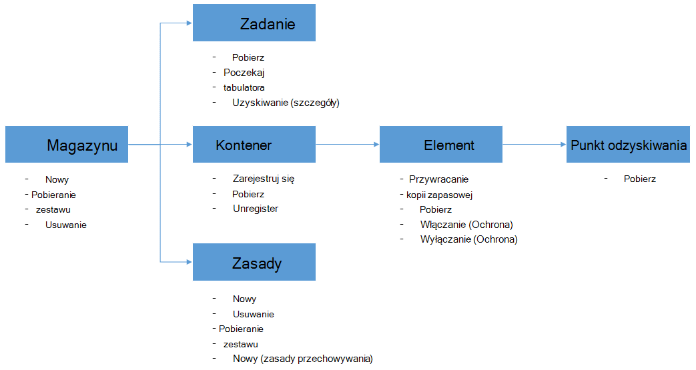

<properties
    pageTitle="Wdrażanie i zarządzanie nią kopii zapasowej dla maszyny wirtualne Azure przy użyciu programu PowerShell | Microsoft Azure"
    description="Dowiedz się, jak wdrażać i zarządzanie Azure kopii zapasowej przy użyciu programu PowerShell"
    services="backup"
    documentationCenter=""
    authors="markgalioto"
    manager="cfreeman"
    editor=""/>

<tags
    ms.service="backup"
    ms.workload="storage-backup-recovery"
    ms.tgt_pltfrm="na"
    ms.devlang="na"
    ms.topic="article"
    ms.date="08/08/2016"
    ms.author="markgal;trinadhk;jimpark" />


# <a name="deploy-and-manage-backup-for-azure-vms-using-powershell"></a>Wdrażanie i zarządzanie nią kopii zapasowej dla maszyny wirtualne Azure przy użyciu programu PowerShell

> [AZURE.SELECTOR]
- [Menedżer zasobów](backup-azure-vms-automation.md)
- [Klasyczny](backup-azure-vms-classic-automation.md)

W tym artykule pokazano, jak używać programu PowerShell Azure kopii zapasowych i odzyskiwania maszyny wirtualne Azure. Azure występują dwa modele rozmieszczania służące do tworzenia i pracy z zasobami: Menedżera zasobów i klasyczny. W tym artykule opisano, jak przy użyciu modelu wdrożenia klasyczny. Firma Microsoft zaleca się, że większość nowych wdrożeń za pomocą modelu Menedżera zasobów.

## <a name="concepts"></a>Pojęcia


Ten artykuł zawiera informacje dotyczące poleceń cmdlet środowiska PowerShell umożliwia wykonywanie kopii zapasowych maszyn wirtualnych. Dla wprowadzający informacji na temat ochrony maszyny wirtualne Azure zobacz [Planowanie infrastruktury kopii zapasowej maszyn wirtualnych w Azure](backup-azure-vms-introduction.md).

> [AZURE.NOTE] Zanim zaczniesz, przeczytaj [Warunki wstępne](backup-azure-vms-prepare.md) wymagane do pracy z kopii zapasowej Azure i [ograniczenia dotyczące](backup-azure-vms-prepare.md#limitations) bieżącego tworzenia kopii zapasowych maszyn wirtualnych.

Aby efektywnie używać programu PowerShell, Poświęć chwilę na opis hierarchii obiektów i od czego zacząć.



Dwie najważniejsze przebiegu są włączyć ochronę maszyny i przywracania danych z punktu odzyskiwania. Ten artykuł jest opanować doświadczenie Praca z poleceń cmdlet programu PowerShell, aby włączyć tych dwóch scenariuszy.


## <a name="setup-and-registration"></a>Instalacja i rejestracji
Aby rozpocząć:

1. [Pobierz najnowszą programu PowerShell](https://github.com/Azure/azure-powershell/releases) (minimalna wersja wymagana jest: 1.0.0)

2. Znajdź i poleceń cmdlet programu PowerShell kopii zapasowej Azure, wpisując następujące polecenie:

```
PS C:\> Get-Command *azurermbackup*

CommandType     Name                                               Version    Source
-----------     ----                                               -------    ------
Cmdlet          Backup-AzureRmBackupItem                           1.0.1      AzureRM.Backup
Cmdlet          Disable-AzureRmBackupProtection                    1.0.1      AzureRM.Backup
Cmdlet          Enable-AzureRmBackupContainerReregistration        1.0.1      AzureRM.Backup
Cmdlet          Enable-AzureRmBackupProtection                     1.0.1      AzureRM.Backup
Cmdlet          Get-AzureRmBackupContainer                         1.0.1      AzureRM.Backup
Cmdlet          Get-AzureRmBackupItem                              1.0.1      AzureRM.Backup
Cmdlet          Get-AzureRmBackupJob                               1.0.1      AzureRM.Backup
Cmdlet          Get-AzureRmBackupJobDetails                        1.0.1      AzureRM.Backup
Cmdlet          Get-AzureRmBackupProtectionPolicy                  1.0.1      AzureRM.Backup
Cmdlet          Get-AzureRmBackupRecoveryPoint                     1.0.1      AzureRM.Backup
Cmdlet          Get-AzureRmBackupVault                             1.0.1      AzureRM.Backup
Cmdlet          Get-AzureRmBackupVaultCredentials                  1.0.1      AzureRM.Backup
Cmdlet          New-AzureRmBackupProtectionPolicy                  1.0.1      AzureRM.Backup
Cmdlet          New-AzureRmBackupRetentionPolicyObject             1.0.1      AzureRM.Backup
Cmdlet          New-AzureRmBackupVault                             1.0.1      AzureRM.Backup
Cmdlet          Register-AzureRmBackupContainer                    1.0.1      AzureRM.Backup
Cmdlet          Remove-AzureRmBackupProtectionPolicy               1.0.1      AzureRM.Backup
Cmdlet          Remove-AzureRmBackupVault                          1.0.1      AzureRM.Backup
Cmdlet          Restore-AzureRmBackupItem                          1.0.1      AzureRM.Backup
Cmdlet          Set-AzureRmBackupProtectionPolicy                  1.0.1      AzureRM.Backup
Cmdlet          Set-AzureRmBackupVault                             1.0.1      AzureRM.Backup
Cmdlet          Stop-AzureRmBackupJob                              1.0.1      AzureRM.Backup
Cmdlet          Unregister-AzureRmBackupContainer                  1.0.1      AzureRM.Backup
Cmdlet          Wait-AzureRmBackupJob                              1.0.1      AzureRM.Backup
```

Następujące zadania konfiguracji i rejestracji można zautomatyzować przy użyciu programu PowerShell:

- Tworzenie kopii zapasowej magazynu
- Rejestrowanie maszyny wirtualne z usługą Azure kopii zapasowej

### <a name="create-a-backup-vault"></a>Tworzenie kopii zapasowej magazynu

> [AZURE.WARNING] Dla klientów korzystających z kopii zapasowej Azure po raz pierwszy musisz zarejestrować dostawcy Azure kopia zapasowa może być używany przy użyciu swojej subskrypcji. Można to zrobić, uruchamiając następujące polecenie: Register AzureRmResourceProvider - ProviderNamespace "Microsoft.Backup"

Możesz utworzyć nowy magazynu kopii zapasowej przy użyciu polecenia cmdlet **New-AzureRmBackupVault** . Magazyn kopii zapasowej jest zasobem ARM, więc należy umieścić w grupie zasobów. W pełnych konsoli Azure programu PowerShell uruchom następujące polecenia:

```
PS C:\> New-AzureRmResourceGroup –Name “test-rg” –Location “West US”
PS C:\> $backupvault = New-AzureRmBackupVault –ResourceGroupName “test-rg” –Name “test-vault” –Region “West US” –Storage GeoRedundant
```

Możesz wyświetlić listę wszystkich kopii zapasowej magazynami w danej subskrypcji przy użyciu polecenia cmdlet **Get-AzureRmBackupVault** .

> [AZURE.NOTE] Rozwiązaniem jest zapisać obiekt magazynu kopii zapasowej do zmiennej. Obiekt magazynu jest potrzebny jako danych wejściowych dla wielu kopii zapasowej Azure poleceń cmdlet.


### <a name="registering-the-vms"></a>Rejestrowanie maszyny wirtualne
Pierwszy krok w kierunku Konfigurowanie kopii zapasowej z kopii zapasowej Azure jest zarejestrować swojego komputera lub maszyn wirtualnych usługi Azure kopii zapasowej magazynu. Polecenia cmdlet **AzureRmBackupContainer rejestru** trwa wprowadzania informacji o maszyn wirtualnych Azure IaaS i rejestruje go z określonego magazynu. Operacja rejestracji kojarzy Azure maszyny wirtualnej z kopii zapasowej magazynu i śledzenie maszyn wirtualnych podczas kopii zapasowej cyklu życia.

Rejestrowanie usługi maszyn wirtualnych z usługą Azure kopii zapasowej tworzy obiekt kontenera najwyższego poziomu. Kontener zazwyczaj zawiera wiele elementów, które można wykonać kopii zapasowej, ale w przypadku maszyny wirtualne będą tylko jeden element kopii zapasowej kontenera.

```
PS C:\> $registerjob = Register-AzureRmBackupContainer -Vault $backupvault -Name "testvm" -ServiceName "testvm"
```

## <a name="backup-azure-vms"></a>Kopii zapasowej Azure maszyny wirtualne

### <a name="create-a-protection-policy"></a>Tworzenie zasad ochrony
Nie jest wymagane do tworzenia nowych zasad ochrony, aby rozpocząć tworzenie kopii zapasowych pośrednictwem usługi SMS. Magazyn jest "Domyślne zasady z" można umożliwia szybkie włączyć ochronę, a później edytować, z prawej szczegóły. Listę dostępnych w magazyn zasad można uzyskać za pomocą polecenia cmdlet **Get-AzureRmBackupProtectionPolicy** :

```
PS C:\> Get-AzureRmBackupProtectionPolicy -Vault $backupvault

Name                      Type               ScheduleType       BackupTime
----                      ----               ------------       ----------
DefaultPolicy             AzureVM            Daily              26-Aug-15 12:30:00 AM
```

> [AZURE.NOTE] Strefa czasowa pola BackupTime w programie PowerShell jest UTC. Jednak podczas wykonywania kopii zapasowej jest widoczny w portalu Azure, strefa czasowa jest wyrównany do lokalny system oraz przesunięcie czasu UTC.

Zasady tworzenia kopii zapasowych jest skojarzony z co najmniej jedną zasad przechowywania. Zasady przechowywania Określa, jak długo punkt odzyskiwania są przechowywane z kopią zapasową Azure. Polecenia cmdlet **New-AzureRmBackupRetentionPolicy** tworzy obiektów programu PowerShell, które zawierają informacje o zasadach przechowywania. Te obiekty zasad przechowywania są używane jako dane wejściowe do polecenia cmdlet *New-AzureRmBackupProtectionPolicy* lub bezpośrednio przy użyciu polecenia cmdlet *Enable-AzureRmBackupProtection* .

Zasady tworzenia kopii zapasowych określa, kiedy i jak często zakończeniu tworzenia kopii zapasowej elementu. Polecenia cmdlet **New-AzureRmBackupProtectionPolicy** tworzy obiekt programu PowerShell, który zawiera informacje o zasadach kopii zapasowej. Zasady kopii zapasowej jest używany jako dane wejściowe do polecenia cmdlet *Enable-AzureRmBackupProtection* .

```
PS C:\> $Daily = New-AzureRmBackupRetentionPolicyObject -DailyRetention -Retention 30
PS C:\> $newpolicy = New-AzureRmBackupProtectionPolicy -Name DailyBackup01 -Type AzureVM -Daily -BackupTime ([datetime]"3:30 PM") -RetentionPolicy $Daily -Vault $backupvault

Name                      Type               ScheduleType       BackupTime
----                      ----               ------------       ----------
DailyBackup01             AzureVM            Daily              01-Sep-15 3:30:00 PM
```

### <a name="enable-protection"></a>Włącz ochronę
Włączanie ochrony obejmuje dwa obiekty - elementu i zasady i oba muszą należeć do samego magazynu. Gdy zasady zostały skojarzone z elementem, kopii zapasowych przepływu pracy zostanie grzybków w zdefiniowanym harmonogramem.

```
PS C:\> Get-AzureRmBackupContainer -Type AzureVM -Status Registered -Vault $backupvault | Get-AzureRmBackupItem | Enable-AzureRmBackupProtection -Policy $newpolicy
```

### <a name="initial-backup"></a>Wstępnej kopii zapasowej
Harmonogram kopii zapasowej przejmuje czynności wstępny pełny kopię elementu i skopiowanie przyrostowe kolejne kopie zapasowe. Jednak jeśli chcesz wymusić wstępnej kopii zapasowej nastąpić w określonym czasie lub nawet natychmiast użyć polecenia cmdlet **AzureRmBackupItem kopii zapasowej** :

```
PS C:\> $container = Get-AzureRmBackupContainer -Vault $backupvault -Type AzureVM -Name "testvm"
PS C:\> $backupjob = Get-AzureRmBackupItem -Container $container | Backup-AzureRmBackupItem
PS C:\> $backupjob

WorkloadName    Operation       Status          StartTime              EndTime
------------    ---------       ------          ---------              -------
testvm          Backup          InProgress      01-Sep-15 12:24:01 PM  01-Jan-01 12:00:00 AM
```

> [AZURE.NOTE] Strefa czasowa pól Czas rozpoczęcia i zakończenia, wyświetlane w programie PowerShell jest UTC. Gdy podobne informacje są wyświetlane w portalu Azure, strefy czasowej jest wyrównany do zegar systemowy lokalnego.

### <a name="monitoring-a-backup-job"></a>Monitorowanie zadania wykonywania kopii zapasowej
Większość długotrwałych operacji w kopii zapasowej Azure są sporządzony według wzoru jako zadanie. To ułatwia śledzenie postępu bez konieczności zachować Azure portal otwarte przez cały czas.

Aby uzyskać najnowsze stan w trakcie wykonywania zadania, należy użyć polecenia cmdlet **Get-AzureRmBackupJob** .

```
PS C:\> $joblist = Get-AzureRmBackupJob -Vault $backupvault -Status InProgress
PS C:\> $joblist[0]

WorkloadName    Operation       Status          StartTime              EndTime
------------    ---------       ------          ---------              -------
testvm          Backup          InProgress      01-Sep-15 12:24:01 PM  01-Jan-01 12:00:00 AM
```

Zamiast sondowanie te zadania na ukończenie - — kod niepotrzebne, dodatkowe - łatwiej jest użyć polecenia cmdlet **AzureRmBackupJob oczekiwania** . Użycie skryptu polecenia cmdlet zatrzyma wykonywanie, aż do zakończeniu zadania lub wartości określonego limitu czasu.

```
PS C:\> Wait-AzureRmBackupJob -Job $joblist[0] -Timeout 43200
```


## <a name="restore-an-azure-vm"></a>Przywracanie Azure maszyn wirtualnych

W celu przywrócenia danych kopii zapasowej, należy zidentyfikować elementu kopii zapasowej i punkt odzyskiwania, który zawiera dane w chwili. Te informacje są dostarczane do polecenia cmdlet AzureRmBackupItem Przywróć, aby zainicjować przywracania danych z magazynu do klienta.

### <a name="select-the-vm"></a>Wybierz pozycję maszyn wirtualnych

Aby uzyskać obiekt programu PowerShell, który identyfikuje element prawym kopii zapasowej, należy uruchomić z kontenera w magazyn i sposobu pracy użytkownika w dół hierarchii obiektów. Aby zaznaczyć kontenera, która reprezentuje maszyn wirtualnych, należy użyć polecenia cmdlet **Get-AzureRmBackupContainer** i które potoku do polecenia cmdlet **Get-AzureRmBackupItem** .

```
PS C:\> $backupitem = Get-AzureRmBackupContainer -Vault $backupvault -Type AzureVM -name "testvm" | Get-AzureRmBackupItem
```

### <a name="choose-a-recovery-point"></a>Wybierz punkt odzyskiwania

Można teraz wyświetlić listę wszystkich punktów odzyskiwanie kopii zapasowej towaru przy użyciu polecenia cmdlet **Get-AzureRmBackupRecoveryPoint** i wybrać punkt odzyskiwania, aby przywrócić. Zazwyczaj użytkownicy wybierz najnowszy punkt *AppConsistent* na liście.

```
PS C:\> $rp =  Get-AzureRmBackupRecoveryPoint -Item $backupitem
PS C:\> $rp

RecoveryPointId    RecoveryPointType  RecoveryPointTime      ContainerName
---------------    -----------------  -----------------      -------------
15273496567119     AppConsistent      01-Sep-15 12:27:38 PM  iaasvmcontainer;testvm;testv...
```

Zmienna ```$rp``` jest tablicą punktów odzyskiwania dla wybranej kopii zapasowej element, sortowane w odwrotnej kolejności czasu - najnowszą punkt odzyskiwania indeksem 0. Użyj standardowego indeksowanie tablicy programu PowerShell, aby wybrać punkt odzyskiwania. Na przykład: ```$rp[0]``` zostanie wybrana najnowszą punkt odzyskiwania.

### <a name="restoring-disks"></a>Przywracanie dysków

Ma klucza różnicy między operacji przywracania wykonywane za pośrednictwem portalu Azure i Azure programu PowerShell. Przy użyciu programu PowerShell Przywracanie zatrzymuje się na przywracanie dysków i konfiguracji informacje od punktu odzyskiwania. Nie tworzy maszyny wirtualnej.

> [AZURE.WARNING] AzureRmBackupItem Przywróć nie tworzy maszyny. Przywraca tylko dyski na koncie określonego miejsca do magazynowania. Nie jest to samo zachowanie, które będą występować w portalu Azure.

```
PS C:\> $restorejob = Restore-AzureRmBackupItem -StorageAccountName "DestAccount" -RecoveryPoint $rp[0]
PS C:\> $restorejob

WorkloadName    Operation       Status          StartTime              EndTime
------------    ---------       ------          ---------              -------
testvm          Restore         InProgress      01-Sep-15 1:14:01 PM   01-Jan-01 12:00:00 AM
```

Możesz uzyskać szczegółów operacji przywracania przy użyciu polecenia cmdlet **Get-AzureRmBackupJobDetails** po zakończeniu zadania przywracania. Właściwość *ErrorDetails* uzyskuje informacje potrzebne do odbudowanie maszyn wirtualnych.

```
PS C:\> $restorejob = Get-AzureRmBackupJob -Job $restorejob
PS C:\> $details = Get-AzureRmBackupJobDetails -Job $restorejob
```

### <a name="build-the-vm"></a>Tworzenie maszyn wirtualnych

Tworzenie maszyn wirtualnych poza przywrócenie dysków jest możliwe przy użyciu starszych Azure usługi zarządzania programu PowerShell poleceń cmdlet nowych szablonów Menedżera zasobów Azure lub nawet Azure portal. W przykładzie szybkie pokazano, czynności do wykonania przy użyciu polecenia cmdlet zarządzania usługą Azure.

```
 $properties  = $details.Properties

 $storageAccountName = $properties["Target Storage Account Name"]
 $containerName = $properties["Config Blob Container Name"]
 $blobName = $properties["Config Blob Name"]

 $keys = Get-AzureStorageKey -StorageAccountName $storageAccountName
 $storageAccountKey = $keys.Primary
 $storageContext = New-AzureStorageContext -StorageAccountName $storageAccountName -StorageAccountKey $storageAccountKey


 $destination_path = "C:\Users\admin\Desktop\vmconfig.xml"
 Get-AzureStorageBlobContent -Container $containerName -Blob $blobName -Destination $destination_path -Context $storageContext


$obj = [xml](((Get-Content -Path $destination_path -Encoding UniCode)).TrimEnd([char]0x00))
 $pvr = $obj.PersistentVMRole
 $os = $pvr.OSVirtualHardDisk
 $dds = $pvr.DataVirtualHardDisks
 $osDisk = Add-AzureDisk -MediaLocation $os.MediaLink -OS $os.OS -DiskName "panbhaosdisk"
 $vm = New-AzureVMConfig -Name $pvr.RoleName -InstanceSize $pvr.RoleSize -DiskName $osDisk.DiskName

 if (!($dds -eq $null))
 {
     foreach($d in $dds.DataVirtualHardDisk)
     {
         $lun = 0
         if(!($d.Lun -eq $null))
         {
             $lun = $d.Lun
         }
         $name = "panbhadataDisk" + $lun
     Add-AzureDisk -DiskName $name -MediaLocation $d.MediaLink
     $vm | Add-AzureDataDisk -Import -DiskName $name -LUN $lun
    }
}

New-AzureVM -ServiceName "panbhasample" -Location "SouthEast Asia" -VM $vm
```

Aby uzyskać więcej informacji na temat tworzenia maszyn wirtualnych z przywróconym dysków przeczytaj o następujące polecenia cmdlet:

- [Dodawanie AzureDisk](https://msdn.microsoft.com/library/azure/dn495252.aspx)
- [Nowy AzureVMConfig](https://msdn.microsoft.com/library/azure/dn495159.aspx)
- [Nowy AzureVM](https://msdn.microsoft.com/library/azure/dn495254.aspx)

## <a name="code-samples"></a>Przykłady kodu

### <a name="1-get-the-completion-status-of-job-sub-tasks"></a>1. Pobierz stan ukończenia zadania podrzędnego

Aby śledzić stan ukończenia poszczególnych zadań podrzędnych, możesz użyć polecenia cmdlet **Get-AzureRmBackupJobDetails** :

```
PS C:\> $details = Get-AzureRmBackupJobDetails -JobId $backupjob.InstanceId -Vault $backupvault
PS C:\> $details.SubTasks

Name                                                        Status
----                                                        ------
Take Snapshot                                               Completed
Transfer data to Backup vault                               InProgress
```

### <a name="2-create-a-dailyweekly-report-of-backup-jobs"></a>2. Tworzenie raportu codziennie tygodniowym zadań kopii zapasowej

Administratorzy zazwyczaj chcesz się dowiedzieć, zadania kopii zapasowej uruchomiono w ciągu ostatnich 24 godzin, stan tych zadań kopii zapasowej. Ponadto ilość danych przesyłanych zapewnia administratorom sposobem oszacowania ich miesięczny użycia danych. Skrypt poniżej pobiera dane z usługi Azure wykonywanie kopii zapasowych i wyświetla informacje w konsoli programu PowerShell.

```
param(  [Parameter(Mandatory=$True,Position=1)]
        [string]$backupvaultname,

        [Parameter(Mandatory=$False,Position=2)]
        [int]$numberofdays = 7)


#Initialize variables
$DAILYBACKUPSTATS = @()
$backupvault = Get-AzureRmBackupVault -Name $backupvaultname
$enddate = ([datetime]::Today).AddDays(1)
$startdate = ([datetime]::Today)

for( $i = 1; $i -le $numberofdays; $i++ )
{
    # We query one day at a time because pulling 7 days of data might be too much
    $dailyjoblist = Get-AzureRmBackupJob -Vault $backupvault -From $startdate -To $enddate -Type AzureVM -Operation Backup
    Write-Progress -Activity "Getting job information for the last $numberofdays days" -Status "Day -$i" -PercentComplete ([int]([decimal]$i*100/$numberofdays))

    foreach( $job in $dailyjoblist )
    {
        #Extract the information for the reports
        $newstatsobj = New-Object System.Object
        $newstatsobj | Add-Member -Type NoteProperty -Name Date -Value $startdate
        $newstatsobj | Add-Member -Type NoteProperty -Name VMName -Value $job.WorkloadName
        $newstatsobj | Add-Member -Type NoteProperty -Name Duration -Value $job.Duration
        $newstatsobj | Add-Member -Type NoteProperty -Name Status -Value $job.Status

        $details = Get-AzureRmBackupJobDetails -Job $job
        $newstatsobj | Add-Member -Type NoteProperty -Name BackupSize -Value $details.Properties["Backup Size"]
        $DAILYBACKUPSTATS += $newstatsobj
    }

    $enddate = $enddate.AddDays(-1)
    $startdate = $startdate.AddDays(-1)
}

$DAILYBACKUPSTATS | Out-GridView
```

Jeśli chcesz dodać możliwości tworzenia wykresów do tego raportu raportu, Dowiedz się, w witrynie TechNet wpis w blogu [Charting przy użyciu programu PowerShell](http://blogs.technet.com/b/richard_macdonald/archive/2009/04/28/3231887.aspx)

## <a name="next-steps"></a>Następne kroki

Jeśli wolisz przy użyciu programu PowerShell nawiązanie połączenia z zasobami Azure, zapoznaj się z tego artykułu programu PowerShell do ochrony Windows Server, [rozmieszczanie i zarządzanie kopia zapasowa systemu Windows Server](./backup-client-automation-classic.md). Istnieje także artykuł programu PowerShell do zarządzania kopie zapasowe DPM, [rozmieszczanie i zarządzanie kopia zapasowa DPM](./backup-dpm-automation-classic.md). Obie te artykuły zainstalowana wersja wdrożenia Menedżera zasobów, a także we wdrożeniach klasyczny.
