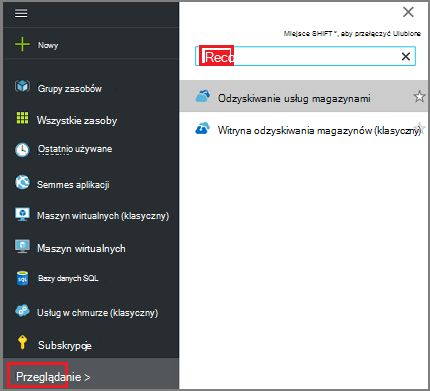
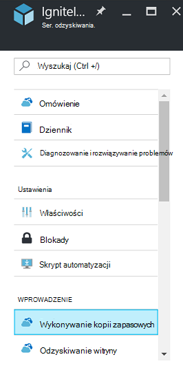
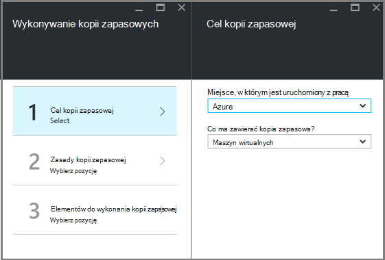
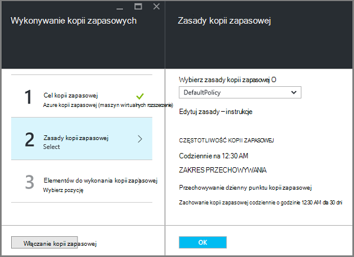
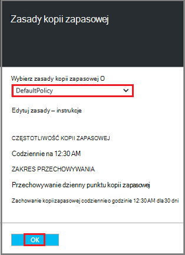
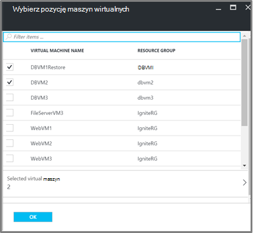
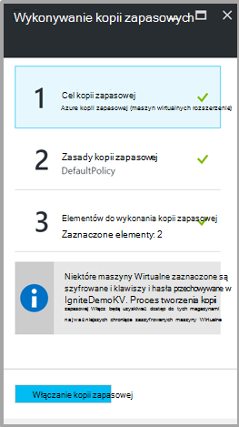

<properties
   pageTitle="Kopia zapasowa i przywracanie zaszyfrowanych maszyny wirtualne przy użyciu kopii zapasowej Azure"
   description="Ten artykuł zawiera informacje o kopia zapasowa i przywracanie obsługę maszyny wirtualne zaszyfrowany przy użyciu szyfrowania dysku Azure."
   services="backup"
   documentationCenter=""
   authors="JPallavi"
   manager="vijayts"
   editor=""/>
<tags
   ms.service="backup"
   ms.devlang="na"
   ms.topic="article"
   ms.tgt_pltfrm="na"
   ms.workload="storage-backup-recovery"
   ms.date="10/25/2016"
   ms.author="markgal; jimpark; trinadhk"/>

# Kopia zapasowa i przywracanie zaszyfrowanych maszyny wirtualne przy użyciu kopii zapasowej Azure

Ten artykuł zawiera informacje o czynności, aby kopia zapasowa i przywracanie maszyn wirtualnych przy użyciu Azure kopii zapasowej. Umożliwia także szczegółowe informacje o obsługiwanych scenariusze, wymagania wstępne i procedurę rozwiązywania problemów w przypadku wystąpienia błędów.

## Obsługiwane scenariusze

> [AZURE.NOTE]
1.  Kopia zapasowa i przywracanie zaszyfrowanych maszyny wirtualne jest obsługiwana tylko dla maszyn wirtualnych wdrożony Menedżera zasobów. Nie jest obsługiwane dla maszyn wirtualnych klasyczny.  
2.  Jest obsługiwana tylko w przypadku maszyn wirtualnych zaszyfrowany przy użyciu klucza szyfrowania funkcji BitLocker i klucz szyfrowania. Nie jest obsługiwane dla maszyn wirtualnych szyfrowane tylko przy użyciu klucza szyfrowania funkcji BitLocker.  

## Wymagania wstępne

1.  Maszyn wirtualnych został zaszyfrowany przy użyciu [Szyfrowania dysku Azure](../security/azure-security-disk-encryption.md). Należy szyfrowane, przy użyciu klucza szyfrowania funkcji BitLocker i klucz szyfrowania.
2.  Utworzono magazynu usługi odzyskiwania i replikacji miejsca do magazynowania zestaw przy użyciu kroków wymienionych w artykule [przygotowania środowiska dla kopii zapasowej](backup-azure-arm-vms-prepare.md).

## Wykonywanie kopii zapasowych zaszyfrowanych maszyn wirtualnych
Wykonaj następujące czynności, aby ustawić cel kopii zapasowej, opracowanie zasad, skonfiguruj elementów i wyzwalacza kopii zapasowej.

### Konfigurowanie kopii zapasowej

1. Jeśli masz już magazynu usługi odzyskiwania, otwieranie, przejdź do następnego kroku. Jeśli nie masz usługi odzyskiwania magazynu otwarte, ale znajdują się w portalu Azure, w menu Centrum kliknij przycisk **Przeglądaj**.

  - Na liście zasobów wpisz **Usługi odzyskiwania**.
  - Rozpoczęciu wpisywania lista filtrów na podstawie wprowadzanych danych. Gdy zostanie wyświetlony **magazynów usługi odzyskiwania**, kliknij go.
  
        

    Zostanie wyświetlona lista magazynów usługi odzyskiwania. Na liście usługi odzyskiwania magazynów zaznacz magazynu.

    Zostanie otwarte na pulpicie nawigacyjnym wybranego magazynu.

2. Z listy elementów, który pojawia się w obszarze magazynu kliknij pozycję Otwórz karta kopii zapasowej **kopii zapasowej** .

       
    
3. Na karta kopii zapasowej kliknij przycisk **Cel kopia zapasowa** , otworzyć karta cel kopii zapasowej.

       
    
4.   Na karta kopii zapasowej cel ustaw **miejsce, w którym działa z pracą** Azure i **co ma zawierać kopia zapasowa** maszyn wirtualnych, a następnie kliknij **przycisk OK**.

    Karta Kopia zapasowa cel zostaje zamknięte, a zostanie wyświetlona karta Zasady kopii zapasowej.

       

5. Na karta Zasady kopii zapasowej wybierz zasady kopii zapasowej, który chcesz zastosować do magazyn, a następnie kliknij **przycisk OK**.

       

    Szczegółowe informacje o domyślnych zasad znajdują się w sekcji szczegółów. Jeśli chcesz utworzyć zasady, wybierz polecenie **Utwórz nowy** z menu rozwijanego. Po kliknięciu przycisku **OK**kopii zapasowej zasad jest skojarzony z magazynu.

    Następnie wybierz maszyny wirtualne skojarzyć z magazynu.
    
6. Wybierz pozycję zaszyfrowanych maszyn wirtualnych skojarzyć z określonej zasady, a następnie kliknij przycisk **OK**.

      
   
7. Ta strona zawiera komunikat o najważniejszych magazynu skojarzony z zaszyfrowaną maszyny wirtualne zaznaczone. Usługa Kopia zapasowa wymaga dostępu tylko do odczytu do kluczy i hasła klucza magazynu. Używa te uprawnienia dla kopii zapasowej klucz i tajny, wraz z skojarzone maszyny wirtualne. 

      

      Teraz, gdy zdefiniowano wszystkie ustawienia magazyn w karta kopii zapasowej kliknij pozycję Włącz wykonywanie kopii zapasowych w dolnej części strony. Włączenie wykonywania kopii zapasowych wdraża zasady magazyn i maszyny wirtualne.

8. Następnej fazy przygotowania instaluje agenta maszyn wirtualnych lub upewnić się, że Agent maszyn wirtualnych jest zainstalowany. Aby zrobić to samo, użyj kroków wymienionych w artykule [przygotowania środowiska dla kopii zapasowej](backup-azure-arm-vms-prepare.md). 

### Powodujące zadania wykonywania kopii zapasowej
Wykonaj kroki wymienione w artykule [Kopii zapasowej Azure maszyny wirtualne do magazynu usługi odzyskiwania](backup-azure-arm-vms.md) wyzwalacza zadania wykonywania kopii zapasowej.

## Przywracanie zaszyfrowanych maszyn wirtualnych
Przywracanie obsługę zaszyfrowane i nie zaszyfrowane maszyn wirtualnych jest taki sam. Kroki wymienione w [Przywracanie maszyn wirtualnych w Azure portal](backup-azure-arm-restore-vms.md) umożliwia przywracanie zaszyfrowanych maszyn wirtualnych. W przypadku, gdy chcesz przywrócić klucze i hasła, musisz zapewnić, że tego klucza magazynu, aby je przywrócić powinna już istnieje.

## Rozwiązywanie problemów z błędami

| Operacja | Informacje o błędzie | Rozdzielczość |
| -------- | -------- | -------|
| Wykonywanie kopii zapasowych | Sprawdzanie poprawności nie powiodło się, jak maszyn wirtualnych jest zaszyfrowany przy użyciu BEK tylko. Kopie zapasowe mogą być włączone tylko w przypadku maszyn wirtualnych szyfrowane BEK i KEK. | Maszyn wirtualnych powinny być szyfrowane przy użyciu BEK i KEK. Po wykonaniu tej kopii zapasowej powinna być włączona. |
| Przywracanie | Nie można przywrócić tego zaszyfrowanych maszyn wirtualnych, ponieważ nie istnieje klucza magazynu skojarzone z tym maszyn wirtualnych. | Tworzenie klucza magazynu przy użyciu [Rozpocząć pracę z magazynu klucza Azure](../key-vault/key-vault-get-started.md). Można znaleźć w artykule [Przywracanie klucza magazynu klucz i tajny przy użyciu kopii zapasowej Azure](backup-azure-restore-key-secret.md) przywrócenie klucz i tajny, jeśli nie są dostępne. |
| Przywracanie | Nie można przywrócić tej zaszyfrowanej maszyn wirtualnych, ponieważ nie istnieją klucza i hasło skojarzone z tym maszyn wirtualnych. | Można znaleźć w artykule [Przywracanie klucza magazynu klucz i tajny przy użyciu kopii zapasowej Azure](backup-azure-restore-key-secret.md) przywrócenie klucz i tajny, jeśli nie są dostępne. |
