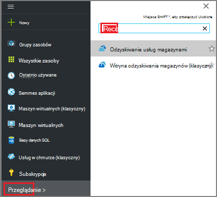
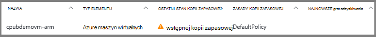
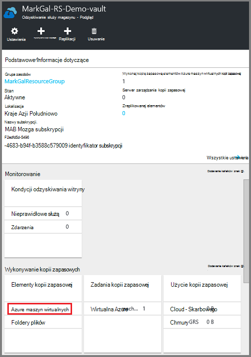

<properties
    pageTitle="Najpierw sprawdź: ochrona maszyny wirtualne Azure z magazynu usługi odzyskiwania | Microsoft Azure"
    description="Chroń maszyny wirtualne Azure z magazynu usługi odzyskiwania. Ochrona danych za pomocą kopie zapasowe maszyny wirtualne wdrożony Menedżera zasobów, wdrożony w klasycznym maszyny wirtualne i maszyny wirtualne miejsca do magazynowania Premium. Utwórz i zarejestruj magazynu usługi odzyskiwania. Zarejestruj się maszyny wirtualne, tworzenie zasad i ochrona maszyny wirtualne platformy Azure."
    services="backup"
    documentationCenter=""
    authors="markgalioto"
    manager="cfreeman"
    editor=""
    keyword="backups; vm backup"/>

<tags
    ms.service="backup"
    ms.workload="storage-backup-recovery"
    ms.tgt_pltfrm="na"
    ms.devlang="na"
    ms.topic="hero-article"
    ms.date="10/13/2016"
    ms.author="markgal; jimpark"/>

# Najpierw sprawdź: ochrona maszyny wirtualne Azure z magazynu usługi odzyskiwania

> [AZURE.SELECTOR]
- [Ochrona maszyny wirtualne z magazynu usługi odzyskiwania](backup-azure-vms-first-look-arm.md)
- [Ochrona maszyny wirtualne z kopii zapasowej magazynu](backup-azure-vms-first-look.md)

Ten samouczek przejście przez kolejne etapy tworzenia magazynu usługi odzyskiwania i tworzenie kopii zapasowych Azure maszyn wirtualnych (maszyn wirtualnych). Ochrona odzyskiwania usług magazynów:

- Azure maszyny wirtualne wdrożony Menedżera zasobów
- Klasyczny maszyny wirtualne
- Standardowego magazynu maszyny wirtualne
- Magazyn Premium maszyny wirtualne
- Maszyny wirtualne zaszyfrowany przy użyciu szyfrowania dysku Azure, z BEK i KEK

Aby uzyskać więcej informacji dotyczących ochrony miejsca do magazynowania Premium maszyny wirtualne Zobacz [Tworzenie kopii zapasowych i przywracanie maszyny wirtualne Premium miejsca do magazynowania](backup-introduction-to-azure-backup.md#back-up-and-restore-premium-storage-vms)

>[AZURE.NOTE] Tego samouczka przyjęto założenie, masz już maszyny w ramach subskrypcji Azure i miały środki umożliwiające usługę kopii zapasowej uzyskać dostęp do maszyn wirtualnych.

[AZURE.INCLUDE [learn-about-Azure-Backup-deployment-models](../../includes/backup-deployment-models.md)]

Na wysokim poziomie wykonaj poniższe kroki wykonasz.  

1. Tworzenie magazynu usługi odzyskiwania dla maszyny.
2. Azure portal za pomocą zaznacz scenariusz, ustawianie zasad i identyfikowania elementów ochrony.
3. Uruchom wstępnej kopii zapasowej.

## Tworzenie magazynu usługi odzyskiwania dla maszyn wirtualnych

Magazynu usługi odzyskiwania jest jednostką zapisującego wykonywania kopii zapasowych i odzyskiwania punktów, które zostały utworzone w czasie. Magazyn usług odzyskiwania zawiera również stosowane do chronionego maszyny wirtualne zasady kopii zapasowej.

>[AZURE.NOTE] Wykonywanie kopii zapasowej maszyny wirtualne jest procesem lokalny. Nie można się kopię zapasową maszyny wirtualne z jednej lokalizacji do magazynu usługi odzyskiwania w innej lokalizacji. Tak dla każdej Azure lokalizacji, która ma maszyny wirtualne do wykonania kopii zapasowej, co najmniej jeden odzyskiwania usług magazynu musi istnieć w tej lokalizacji.

Aby utworzyć magazynu usługi odzyskiwania:

1. Zaloguj się do [portalu Azure](https://portal.azure.com/).

2. W menu Centrum kliknij przycisk **Przeglądaj** , a następnie na liście zasobów, wpisz **Usługi odzyskiwania**. Rozpoczęciu wpisywania lista filtrów na podstawie wprowadzanych danych. Kliknij pozycję **magazynu usługi odzyskiwania**.

      

    Na liście magazynami usług odzyskiwania są wyświetlane.

3. W menu **usługi odzyskiwania magazynów** kliknij przycisk **Dodaj**.

    

    Zostanie wyświetlona karta magazynu usługi odzyskiwania monituje o podanie **nazwy**, **subskrypcji**, **Grupa zasobów**i **lokalizacji**.

    

4. W polu **Nazwa**wpisz przyjazną nazwę identyfikującą magazyn. Nazwa musi być unikatowa dla Azure subskrypcji. Wpisz nazwę, która zawiera od 2 do 50 znaków. Musi rozpoczynać się od litery i mogą zawierać tylko litery, cyfry i łączniki.

5. Kliknij **subskrypcję** , aby wyświetlić listę dostępnych subskrypcji. Jeśli nie masz pewności, jakie subskrypcję, należy użyć wartości domyślnej (lub sugerowane) subskrypcji. Istnieje wiele opcji do wyboru tylko wtedy, gdy konto organizacji jest skojarzony z wiele subskrypcji Azure.

6. Kliknij pozycję **Grupa zasobów** , aby wyświetlić listę dostępnych grup zasobów, lub kliknij przycisk **Nowy** , aby utworzyć grupę zasobów. Aby uzyskać pełne informacje dotyczące grup zasobów zobacz [Omówienie Menedżera zasobów Azure](../azure-resource-manager/resource-group-overview.md)

7. Kliknij **miejsce** , aby wybrać regionu geograficznego dla magazyn. Magazynu **musi** znajdować się w tym samym regionie jako maszyn wirtualnych, które mają być chronione.

    >[AZURE.IMPORTANT] Jeśli masz pewności co do lokalizacji, w którym istnieje usługi maszyn wirtualnych, zamknąć okno dialogowe Tworzenie magazynu i przejdź do listy maszyn wirtualnych w portalu. Jeśli masz maszyn wirtualnych w wielu regionów Tworzenie magazynu usługi odzyskiwania w każdym regionie. Tworzenie magazynu w pierwszej lokalizacji przed przejściem do następnej lokalizacji. Trzeba określić konta miejsca do magazynowania do przechowywania danych kopii zapasowej — magazynu usługi odzyskiwania i usługi Azure kopii zapasowej rozwiązać automatycznie.

8. Kliknij przycisk **Utwórz**. Może minąć trochę czasu, zanim magazynu usługi odzyskiwania ma zostać utworzony. Monitorowanie powiadomienia o stanie w górnym obszarze po prawej stronie w portalu. Po utworzeniu z magazynu pojawi się na liście magazynami usług odzyskiwania.

    

Teraz, gdy został utworzony z magazynu, Dowiedz się, jak ustawić replikacji miejsca do magazynowania.

### Ustawianie replikacji miejsca do magazynowania

Opcja replikacji magazynowania umożliwia wybranie zbędne geo miejsca do magazynowania i lokalnie zbędne miejsca do magazynowania. Domyślnie do magazynu ma zbędne geo miejsca do magazynowania. Pozostaw wybraną opcję do magazynu geo zbędne w przypadku kopii zapasowej podstawowego. Wybierz opcję lokalnie zbędne miejsca do magazynowania, jeśli chcesz tańsze opcja, która nie jest jako trwałe. Przeczytaj więcej o tym [zbędne geo](../storage/storage-redundancy.md#geo-redundant-storage) i [lokalnie zbędne](../storage/storage-redundancy.md#locally-redundant-storage) opcje przechowywania w [Omówienie replikacji magazyn Azure](../storage/storage-redundancy.md).

Aby zmienić ustawienie replikacji miejsca do magazynowania:

1. Wybierz pozycję usługi magazynu, aby otworzyć pulpitu nawigacyjnego magazynu i karta Ustawienia. Jeśli karta **Ustawienia** nie zostanie otwarty, kliknij pozycję **wszystkie ustawienia** na pulpicie nawigacyjnym magazynu.

2. Karta **Ustawienia** wybierz polecenie **Kopia zapasowa infrastruktury** > **Konfiguracji kopii zapasowej** , aby otworzyć karta **Konfiguracji kopii zapasowej** . Na karta **Konfiguracji kopii zapasowej** wybierz opcję replikacji miejsca do magazynowania z magazynu.

    

    Po wybraniu opcji miejsca do magazynowania dla swojego magazynu, możesz przystąpić do skojarzyć maszyn wirtualnych magazyn. Aby rozpocząć skojarzenia, należy wykrywanie i zarejestrować Azure maszyn wirtualnych.

## Wybierz pozycję Cel kopii zapasowej, ustawianie zasad i definiowanie elementów w celu ochrony

Przed zarejestrowaniem maszyn wirtualnych z magazynu, należy uruchomić proces odnajdowanie, aby upewnić się, że wszelkie nowe maszyn wirtualnych, które zostały dodane do subskrypcji są oznaczane. Kwerendy proces Azure listy maszyn wirtualnych w subskrypcji, wraz z dodatkowymi informacjami, takich jak nazwa usługi cloud i regionu. W portalu usługi Azure scenariusz odwołuje się do mają wprowadzone do magazynu usługi odzyskiwania. Zasady są harmonogramu jak często i kiedy punktów odzyskiwania są pobierane. Zasady zawierają także zakres przechowywania dla punktów odzyskiwania.

1. Jeśli masz już usługi odzyskiwania, otwórz magazynu, przejdź do kroku 2. Jeśli nie masz odzyskiwania usług magazynu otwarte, ale znajdują się w portalu Azure, w menu Centrum kliknij przycisk **Przeglądaj**.

  - Na liście zasobów wpisz **Usługi odzyskiwania**.
  - Rozpoczęciu wpisywania lista filtrów na podstawie wprowadzanych danych. Gdy zostanie wyświetlony **magazynów usługi odzyskiwania**, kliknij go.

      

    Zostanie wyświetlona lista magazynów usług odzyskiwania.
  - Na liście odzyskiwania usług magazynów zaznacz magazynu.

    Zostanie otwarte na pulpicie nawigacyjnym wybranego magazynu.

    

2. Z menu pulpit nawigacyjny magazynu kliknij pozycję Otwórz karta kopii zapasowej **kopii zapasowej** .

    

    Gdy zostanie otwarta karta, usługa Kopia zapasowa wyszukuje wszelkie nowe maszyny wirtualne w subskrypcji.

    

3. Na karta kopii zapasowej kliknij przycisk **Cel kopia zapasowa** , otworzyć karta cel kopii zapasowej.

    

4. Na karta kopii zapasowej cel ustaw **miejsce, w którym działa z pracą** Azure i **co ma zawierać kopia zapasowa** maszyn wirtualnych, a następnie kliknij **przycisk OK**.

    Karta Kopia zapasowa cel zostaje zamknięte, a zostanie wyświetlona karta Zasady kopii zapasowej.

    

5. Na karta Zasady kopii zapasowej wybierz zasady kopii zapasowej, który chcesz zastosować do magazyn, a następnie kliknij **przycisk OK**.

    

    Szczegółowe informacje o domyślnych zasad znajdują się w sekcji szczegółów. Jeśli chcesz utworzyć zasady, wybierz polecenie **Utwórz nowy** z menu rozwijanego. Menu rozwijane udostępnia opcję przełączenia czas podczas migawki jest, 7 PM. Aby uzyskać instrukcje dotyczące określania zasady tworzenia kopii zapasowych Zobacz [Definiowanie zasady tworzenia kopii zapasowych](backup-azure-vms-first-look-arm.md#defining-a-backup-policy). Po kliknięciu przycisku **OK**kopii zapasowej zasad jest skojarzony z magazynu.

    Następnie wybierz maszyny wirtualne skojarzyć z magazynu.

6. Wybierz pozycję maszyn wirtualnych, aby skojarzyć z określonej zasady, a następnie kliknij przycisk **Wybierz**.

    

    Jeśli nie widzisz odpowiedniej Głosowa, sprawdź, czy istnieje go w tym samym miejscu Azure jako magazynu usługi odzyskiwania.

7. Teraz, gdy zdefiniowano wszystkie ustawienia magazyn w karta kopii zapasowej kliknij przycisk **Włącz kopii zapasowych** w dolnej części strony. Magazyn i maszyny wirtualne wdrożona zasady.

    

## Wstępnej kopii zapasowej

Po wdrożeniu zasady tworzenia kopii zapasowych na komputerze wirtualnych, które nie powinny danych wykonano kopię zapasową. Domyślnie pierwszy zaplanowanej kopii zapasowej (zdefiniowana w kopii zapasowej zasad) jest wstępnej kopii zapasowej. Do momentu wystąpienia wstępnej kopii zapasowej, ostatni stan kopii zapasowej na karta **Zadania kopii zapasowej** zawiera jako **Ostrzeżenie (początkowa kopia zapasowa do czasu)**.

Zalecane jest uruchamianie **Wykonaj kopię zapasową teraz**, chyba że ukończenia szybko rozpocząć kopii zapasowej początkowej.

Aby uruchomić, **Wykonaj kopię zapasową teraz**:

1. Na pulpicie nawigacyjnym magazynu na kafelku **kopii zapasowej** kliknij pozycję **maszyn wirtualnych Azure**  
    

    Zostanie wyświetlona karta **Elementy kopii zapasowej** .

2. Na karta **Elementy kopii zapasowej** kliknij prawym przyciskiem myszy magazyn, który chcesz utworzyć kopię zapasową i kliknij polecenie **Wykonaj kopię zapasową**.

    

    Zadanie kopii zapasowej zostanie wywołana.  

    

3. Aby wyświetlić, że kopia zapasowa początkowej zakończeniu na pulpicie nawigacyjnym magazynu na kafelku **Zadania kopii zapasowej** , kliknij pozycję **Azure maszyn wirtualnych**.

    

    Zostanie wyświetlona karta zadaniami kopii zapasowej.

4. W kopii zapasowej karta zadania można wyświetlić stan wszystkich zadań.

    

    >[AZURE.NOTE] Jako części wykonywanie kopii zapasowej kopii zapasowej Azure problemy z usługą polecenia kopii zapasowej rozszerzenia w poszczególnych maszyn wirtualnych, aby opróżnić wszystkich zapisów i zrób migawkę spójne.

    Po zakończeniu zadania kopii zapasowej jej stan to *wykonane*.

[AZURE.INCLUDE [backup-create-backup-policy-for-vm](../../includes/backup-create-backup-policy-for-vm.md)]

## Agent maszyn wirtualnych zostaną zainstalowane na komputerze wirtualnych

Te informacje są dostarczane w przypadku, gdy jest to potrzebne. Agent maszyn wirtualnych Azure musi być zainstalowany na komputerze wirtualnych Azure rozszerzenia kopii zapasowej do pracy. Jednak jeśli utworzono usługi maszyn wirtualnych z galerii Azure, następnie Agent maszyn wirtualnych jest już na komputerze wirtualnych. Maszyny wirtualne, które są migrowane z centrami danych lokalnych, czy nie agenta maszyn wirtualnych zainstalowana. W takim przypadku Agent maszyn wirtualnych musi być zainstalowany. Jeśli masz problemy z kopii zapasowych maszyn wirtualnych Azure, sprawdź, czy Agent maszyn wirtualnych Azure jest poprawnie zainstalowany na komputerze wirtualnych (zobacz poniższą tabelę). Jeśli tworzysz niestandardowy maszyn wirtualnych, [Upewnij się, że jest zaznaczone pole wyboru **zainstalować agenta maszyn wirtualnych** ](../virtual-machines/virtual-machines-windows-classic-agents-and-extensions.md) przed maszyny wirtualnej jest obsługi administracyjnej.

Informacje na temat [Agenta maszyn wirtualnych](https://go.microsoft.com/fwLink/?LinkID=390493&clcid=0x409) i [jak go zainstalować](../virtual-machines/virtual-machines-windows-classic-manage-extensions.md).

Poniższa tabela zawiera dodatkowe informacje o agenta maszyn wirtualnych dla systemu Windows i Linux oraz maszyny wirtualne.

| **Operacja** | **Systemu Windows** | **Linux** |
| --- | --- | --- |
| Instalowanie agenta maszyn wirtualnych | <li>Pobierz i zainstaluj [agenta MSI](http://go.microsoft.com/fwlink/?LinkID=394789&clcid=0x409). Musisz mieć uprawnienia administratora, aby ukończyć instalację. <li>[Aktualizowanie właściwości maszyn wirtualnych](http://blogs.msdn.com/b/mast/archive/2014/04/08/install-the-vm-agent-on-an-existing-azure-vm.aspx) oznaczającą, że agent jest zainstalowany. | <li> Zainstaluj najnowszą wersję [agenta Linux](https://github.com/Azure/WALinuxAgent) z GitHub. Musisz mieć uprawnienia administratora, aby ukończyć instalację. <li> [Aktualizowanie właściwości maszyn wirtualnych](http://blogs.msdn.com/b/mast/archive/2014/04/08/install-the-vm-agent-on-an-existing-azure-vm.aspx) oznaczającą, że agent jest zainstalowany. |
| Aktualizowanie agenta maszyn wirtualnych | Aktualizowanie agenta maszyn wirtualnych jest tak proste, jak ponownie zainstalować [plików binarnych agenta maszyn wirtualnych](http://go.microsoft.com/fwlink/?LinkID=394789&clcid=0x409).  Upewnij się, że nie wykonywanie kopii zapasowej jest uruchomiona podczas aktualizowania agenta maszyn wirtualnych. | Postępuj zgodnie z instrukcjami na temat [aktualizowania agenta maszyn wirtualnych Linux ](../virtual-machines-linux-update-agent.md).  Upewnij się, że nie wykonywanie kopii zapasowej jest uruchomiona podczas aktualizowania agenta maszyn wirtualnych. |
| Sprawdzanie poprawności instalacji agenta maszyn wirtualnych | <li>Przejdź do folderu *C:\WindowsAzure\Packages* w maszyn wirtualnych Azure. <li>Powinien znajdować się plik WaAppAgent.exe Prezentuj.<li> Kliknij prawym przyciskiem myszy plik, przejdź do **Właściwości**, a następnie wybierz kartę **Szczegóły** . Pole wersji produktu należy 2.6.1198.718 lub nowszym. | N/D! |

### Rozszerzenie kopii zapasowej

Po zainstalowaniu na komputerze wirtualnych agenta maszyn wirtualnych usługi Azure kopii zapasowej instaluje kopii zapasowej rozszerzenia agenta maszyn wirtualnych. Usługa Azure kopii zapasowej bezproblemowo uaktualnienia i poprawki kopii zapasowej rozszerzenie bez dodatkowych cichym.

Rozszerzenie kopii zapasowej jest zainstalowany przez usługę kopii zapasowej, czy jest uruchomiony maszyn wirtualnych. Bieżąca maszyn wirtualnych zawiera największe prawdopodobieństwo uzyskania punkt odzyskiwania spójną z aplikacją. Jednak usługa Azure kopia zapasowa będzie nadal do tworzenia kopii zapasowych maszyn wirtualnych, nawet jeśli jest wyłączona, a nie można zainstalować rozszerzenia. Jest to nazywane w trybie Offline maszyn wirtualnych. W tym przypadku punkt odzyskiwania będą *spójne ze stanem awarii*.

## Informacje dotyczące rozwiązywania problemów
Jeśli masz problemy z wykonywanie zadań w tym artykule, zwróć się [wskazówki dotyczące rozwiązywania problemów](backup-azure-vms-troubleshoot.md).

## Cennik
Azure maszyn wirtualnych kopii zapasowej zostanie naliczona oparte na modelu wystąpienia chroniony. Dowiedz się więcej o [Ceny kopii zapasowej](https://azure.microsoft.com/pricing/details/backup/)

## Masz pytania?
Jeśli masz pytania lub w przypadku dowolnej funkcji, którą chcesz wyświetlić dołączone, [Prześlij opinię](http://aka.ms/azurebackup_feedback).
