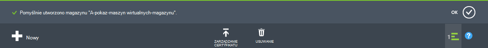
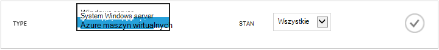
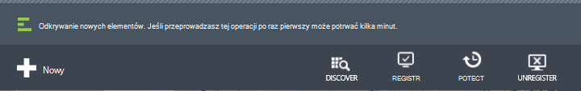
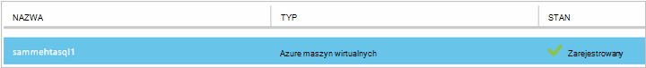
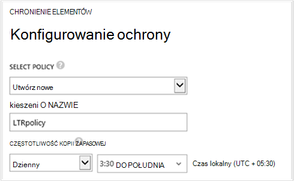
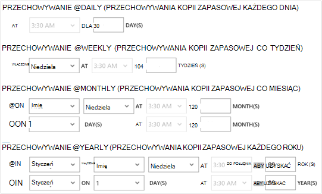
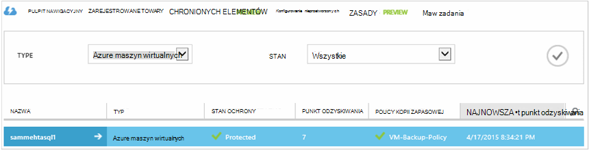

<properties
    pageTitle="Pierwsze spojrzenie: Ochrona maszyny wirtualne Azure z kopii zapasowej magazynu | Microsoft Azure"
    description="Chroń maszyny wirtualne Azure z magazynu kopii zapasowej. Samouczek opisano tworzenie magazynu, zarejestrować maszyny wirtualne Tworzenie zasad i ochrona maszyny wirtualne platformy Azure."
    services="backup"
    documentationCenter=""
    authors="markgalioto"
    manager="cfreeman"
    editor=""/>

<tags
    ms.service="backup"
    ms.workload="storage-backup-recovery"
    ms.tgt_pltfrm="na"
    ms.devlang="na"
    ms.topic="hero-article"
    ms.date="09/15/2016"
    ms.author="markgal; jimpark"/>

# Najpierw sprawdź: wykonywanie kopii zapasowej Azure maszyn wirtualnych

> [AZURE.SELECTOR]
- [Ochrona maszyny wirtualne z magazynu usługi odzyskiwania](backup-azure-vms-first-look-arm.md)
- [Ochrona maszyny wirtualne Azure z kopii zapasowej magazynu](backup-azure-vms-first-look.md)

Ten samouczek przejście kroki tworzenia kopii zapasowych Azure maszyn wirtualnych (maszyn wirtualnych) do kopii zapasowej magazynu platformy Azure. Ten artykuł zawiera opis modelu Klasyczny lub Menedżer usługi modelu wdrożenia, tworzenia kopii zapasowych maszyny wirtualne. Jeśli interesuje Cię wykonywania kopii zapasowych maszyn wirtualnych do magazynu usługi odzyskiwania, należący do grupy zasobów, zobacz [najpierw sprawdzić: ochrona maszyny wirtualne z magazynu usługi odzyskiwania](backup-azure-vms-first-look-arm.md). Aby pomyślnie ukończyć tego samouczka, musi istnieć następujące wymagania wstępne:

- Utworzono maszyny w ramach subskrypcji Azure.
- Maszyn wirtualnych ma łączność Azure publicznych adresów IP. Aby uzyskać dodatkowe informacje zobacz [łączności sieciowej](./backup-azure-vms-prepare.md#network-connectivity).

Aby utworzyć kopię zapasową maszyny, istnieje pięć głównych kroków:  

 tworzenie kopii zapasowej magazynu lub identyfikowanie istniejącego magazynu kopii zapasowej.  
 portal Azure Klasyczny umożliwia odnajdowanie i Zarejestruj się w środowisku maszyn wirtualnych systemu.  
 zainstalować agenta maszyn wirtualnych.  
 Tworzenie zasad ochrony maszyn wirtualnych.  
 kopię zapasową.

>[AZURE.NOTE] Azure występują dwa modele wdrożenia służące do tworzenia i pracy z zasobami: [Menedżer zasobów i klasyczny](../resource-manager-deployment-model.md). Ten samouczek jest do użytku z maszyny wirtualne utworzone w portalu Azure klasyczny. Usługa Azure kopii zapasowej obsługuje maszyny wirtualne oparte na Menedżera zasobów. Aby uzyskać szczegółowe informacje o tworzeniu kopii zapasowych maszyny wirtualne do magazynu usługi odzyskiwania, zobacz [First Look: ochrona maszyny wirtualne z magazynu usługi odzyskiwania](backup-azure-vms-first-look-arm.md).

## Krok 1 — Tworzenie kopii zapasowej magazynu dla maszyn wirtualnych

Kopii zapasowej magazynu jest jednostką, której są magazynowane kopii zapasowych i odzyskiwania punktów, które zostały utworzone w czasie. Magazyn kopii zapasowej zawiera również kopii zapasowej zasady, które są stosowane do maszyn wirtualnych teraz kopię zapasową.

1. Zaloguj się do [portalu Azure klasyczny](http://manage.windowsazure.com/).

2. W lewym dolnym rogu Azure portal kliknij przycisk **Nowy**

    

3. W Kreatorze szybkie tworzenie kliknij przycisk **Usług danych** > **Usługi odzyskiwania** > **Magazynu kopii zapasowej** > **Szybkiego tworzenia**.

    

    Kreator monituje o podanie **nazwy** i **regionu**. Użytkownik administrujący więcej niż jedną subskrypcję zostanie wyświetlone okno dialogowe służące do wyboru subskrypcji.

4. W polu **Nazwa**wpisz przyjazną nazwę identyfikującą magazyn. Nazwa musi być unikatowa dla Azure subskrypcji.

5. W **regionie**zaznacz regionu geograficznego dla magazyn. Magazyn **musi** być w tym samym regionie jako maszyn wirtualnych, które zabezpiecza.

    Jeśli nie znasz region, w którym istnieje usługi maszyn wirtualnych zamknąć kreatora i kliknij pozycję **maszyn wirtualnych** na liście usług Azure. Kolumna lokalizacji zawiera nazwę regionu. Jeśli masz maszyn wirtualnych w wielu regionach, tworzenie kopii zapasowej magazynu w każdym regionie.

6. Jeśli w kreatorze jest nie dialogowe **subskrypcji** , przejdź do następnego kroku. Jeśli pracujesz z wiele subskrypcji, wybierz subskrypcję skojarzyć z nowego magazynu kopii zapasowej.

    

7. Kliknij przycisk **Utwórz magazynu**. Może minąć trochę czasu, zanim magazynu kopii zapasowej do utworzenia. Monitorowanie powiadomienia o stanie w dolnej części portalu.

    

    Komunikat potwierdzający, że magazyn został utworzony. Jest on wyświetlany na stronie **usługi odzyskiwania** jako **aktywną**.

    

8. Na liście magazynów na stronie **Usługi odzyskiwania** wybierz magazyn został utworzony w celu uruchamiania strony **Szybki Start** .

    

9. Na stronie **Szybkie uruchamianie** kliknij pozycję **Konfiguruj** , aby otworzyć opcji replikacji miejsca do magazynowania.
    

10. Na opcji **replikacji miejsca do magazynowania** wybierz opcję replikacji z magazynu.

    

    Domyślnie do magazynu ma zbędne geo miejsca do magazynowania. Wybierz pozycję zbędne geo miejsca do magazynowania, jeśli jest to kopia zapasowa podstawowego. Wybierz opcję lokalnie zbędne miejsca do magazynowania, jeśli chcesz tańsze opcja, która nie jest bardzo jako trwałe. Przeczytaj więcej na temat opcji przechowywania nadmiarowe geo i lokalnie zbędne w [Omówienie replikacji magazyn Azure](../storage/storage-redundancy.md).

Po wybraniu opcji miejsca do magazynowania dla swojego magazynu, możesz przystąpić do skojarzyć maszyn wirtualnych magazyn. Aby rozpocząć skojarzenia, wykrywanie i zarejestrować Azure maszyn wirtualnych.

## Krok 2 — poznawanie i maszyn wirtualnych zarejestrować Azure
Przed zarejestrowaniem maszyn wirtualnych z magazynu, należy uruchomić proces wykrywania do identyfikowania wszelkie nowe maszyny wirtualne. To zwraca listę maszyn wirtualnych w subskrypcji, wraz z dodatkowe informacje, takie jak nazwa usługi cloud i regionu.

1. Zaloguj się do [portalu Azure klasyczny](http://manage.windowsazure.com/)

2. W portalu klasyczny Azure kliknij **Usługi odzyskiwania** , aby otworzyć listę magazynów usługi odzyskiwania.
    

3. Na liście magazynów zaznacz magazynu do tworzenia kopii zapasowych maszyn wirtualnych.

    Po wybraniu z magazynu zostanie wyświetlona na stronie **Szybki Start**

4. Z menu magazynu kliknij pozycję **Registered elementy**.

    

5. Z menu **Typ** wybierz **maszyn wirtualnych Azure**.

    

6. Kliknij przycisk **Wyszukiwanie** w dolnej części strony.
    

    Proces wykrywania może potrwać kilka minut, gdy są są oznaczane znakami tabulacji maszyn wirtualnych. Istnieje powiadomienie u dołu ekranu, który umożliwia sprawdzenie, czy jest uruchomiony proces.

    

    Wykonaj zmiany dotyczące powiadamiania po zakończeniu procesu.

    

7. Kliknij przycisk **ZAREJESTRUJ się** w dolnej części strony.
    

8. W menu skrótów **Zarejestrować elementów** wybierz maszyn wirtualnych, które chcesz zarejestrować.

    >[AZURE.TIP] W tym samym czasie można rejestrować wiele maszyn wirtualnych.

    Zadanie jest tworzone dla każdej z nich wirtualnych jest zaznaczona.

9. Kliknij pozycję **Zadania** w powiadomieniu, aby przejść do strony **zadania** .

    

    Maszyny wirtualnej pojawia się też w na liście elementów zarejestrowane wraz z stanu operacji rejestracji.

    

    Po zakończeniu operacji zmian stanu, aby odzwierciedlała stan *zarejestrowane* .

    

## Krok 3 — zainstalować agenta maszyn wirtualnych na tym komputerze wirtualnych

Agent maszyn wirtualnych Azure musi być zainstalowany na komputerze wirtualnych Azure rozszerzenia kopii zapasowej do pracy. Jeśli utworzono usługi maszyn wirtualnych z galerii Azure, Agent maszyn wirtualnych już występuje na maszyn wirtualnych. Możesz przejść do [ochrony usługi maszyny wirtualne](backup-azure-vms-first-look.md#step-4-protect-azure-virtual-machines).

Usługi maszyn wirtualnych migracji z centrum danych lokalnych, maszyn wirtualnych prawdopodobnie nie maszyn wirtualnych Agent jest zainstalowany. Agent maszyn wirtualnych należy zainstalować na komputerze wirtualnej przed przejściem do ochrony maszyn wirtualnych. Aby uzyskać szczegółowe instrukcje dotyczące instalowania agenta maszyn wirtualnych zobacz [Agent maszyn wirtualnych w dalszej części artykułu maszyny wirtualne kopii zapasowej](backup-azure-vms-prepare.md#vm-agent).

## Krok 4 — tworzenie kopii zapasowej zasad
Aby wyzwolić zadaniu kopii zapasowej, ustaw opcję harmonogram, gdy podjęto kopii zapasowych. Planowanie, kiedy podjęto kopii zapasowych i czas tych migawki są zachowywane, są zasady kopii zapasowej. Przechowywanie informacji jest oparty na Dziadka ojciec – syn obrotu kopii zapasowej schematu.

1. Przejdź do kopii zapasowej magazynu w obszarze **Odzyskiwania usług** w portalu Azure klasyczny i kliknij pozycję **Registered elementy**.
2. Z menu rozwijanego wybierz **maszyn wirtualnych Azure** .

    

3. Kliknij przycisk **Chroń** u dołu strony.
    

    **Kreator ochrony elementów** pojawia się i wyświetla *tylko* maszyn wirtualnych, które są rejestrowane i nie jest chroniony.

    

4. Wybierz pozycję maszyn wirtualnych, które mają być chronione.

    Jeśli istnieją dwa lub więcej maszyn wirtualnych o takiej samej nazwie, za pomocą usługi w chmurze odróżniać maszyn wirtualnych.

5. W menu **ochrony Konfiguruj** zaznacz istniejącą zasadę lub tworzenia nowych zasad ochrony maszyn wirtualnych, które określonymi.

    Nowe magazynami kopii zapasowej mają domyślną zasadę skojarzone z magazynu. Ta zasada ma dziennego migawkę każdego wieczorem, a dziennej migawki jest zachowywana przez 30 dni. Każdej kopii zapasowej zasady może mieć wiele maszyn wirtualnych skojarzone z nim. Jednak maszyna wirtualna może zawierać tylko skojarzone z zasad naraz.

    

    >[AZURE.NOTE] Zasady tworzenia kopii zapasowych zawiera schemat przechowywania zaplanowanych kopii zapasowych. Jeśli wybierzesz istniejącą zasadę kopii zapasowej, można nie można zmienić opcje przechowywania w następnym kroku.

6. W **Zakresie przechowywania** zdefiniuj zakres dzienny, tygodniowy, miesięczny i roczny dla określonych punktów kopii zapasowej.

    

    Zasady przechowywania określa czas przechowywania kopii zapasowej. Możesz określić zasady przechowywania różnych na podstawie przy podejmowaniu kopii zapasowej.

7. Kliknij pozycję **zadania** , aby wyświetlić listę zadań **Konfigurowania ochrony** .

    

    Teraz, gdy zostaną utworzone zasady, przejdź do następnego kroku i początkowej kopię zapasową.

## Krok 5 - początkowy kopii zapasowej

Po maszyny wirtualnej jest chroniony za pomocą zasad, można przeglądać tę relację, na karcie **Elementy chroniony** . Do momentu wystąpienia wstępnej kopii zapasowej, **Stan ochrony** to **chronione — (oczekująca wstępnej kopii zapasowej)**. Domyślnie pierwszy zaplanowanej kopii zapasowej jest *wstępnej kopii zapasowej*.

Aby rozpocząć wstępnej kopii zapasowej teraz:

1. Na stronie **Chronionych elementów** kliknij pozycję **Kopia zapasowa teraz** w dolnej części strony.
    

    Usługa Azure kopii zapasowej tworzy zadanie dla początkowej wykonywanie kopii zapasowej kopii zapasowej.

2. Kliknij kartę **zadania** , aby wyświetlić listę zadań.

    

    Po ukończeniu wstępnej kopii zapasowej stan maszyny wirtualnej na karcie **Chronionych elementów** jest *chroniony*.

    

    >[AZURE.NOTE] Wykonywanie kopii zapasowych maszyn wirtualnych jest procesu lokalnego. Nie można się kopię zapasową maszyn wirtualnych z jednego obszaru do kopii zapasowej magazynu w innym regionie. Tak dla każdego regionu Azure, który ma maszyny wirtualne, które muszą być kopii zapasowej, co najmniej jeden magazynu kopii zapasowej należy utworzyć w danym regionie.

## Następne kroki
Teraz, gdy pomyślnie wykonano kopię zapasową maszyny, istnieje kilka czynności, które mogą być przedmiotem zainteresowania. Najbardziej logicznym krokiem jest poznawanie przywracania danych maszyny. Istnieją jednak zadań zarządzania pomoże zrozumieć, jak zabezpieczanie danych i zminimalizować koszty.

- [Monitorowanie maszyn wirtualnych i zarządzanie nimi](backup-azure-manage-vms.md)
- [Przywracanie maszyn wirtualnych](backup-azure-restore-vms.md)
- [Wskazówki dotyczące rozwiązywania problemów](backup-azure-vms-troubleshoot.md)

## Masz pytania?
Jeśli masz pytania lub w przypadku dowolnej funkcji, którą chcesz wyświetlić dołączone, [Prześlij opinię](http://aka.ms/azurebackup_feedback).
