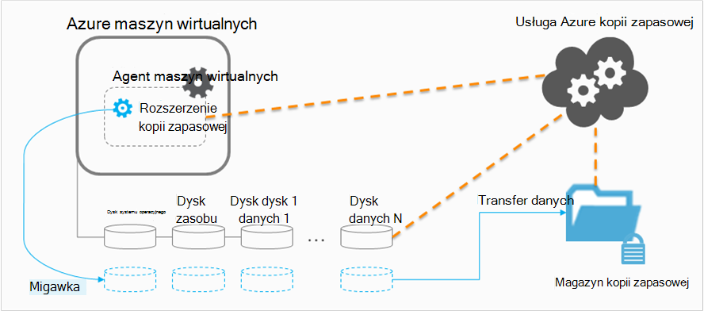

<properties
    pageTitle="Planowanie infrastruktury kopii zapasowej maszyn wirtualnych w Azure | Microsoft Azure"
    description="Ważne zagadnienia związane z planowaniem do tworzenia kopii zapasowych maszyn wirtualnych platformy Azure"
    services="backup"
    documentationCenter=""
    authors="markgalioto"
    manager="cfreeman"
    editor=""
    keywords="Aby utworzyć kopię zapasową maszyny wirtualne, wykonywanie kopii zapasowej maszyn wirtualnych"/>

<tags
    ms.service="backup"
    ms.workload="storage-backup-recovery"
    ms.tgt_pltfrm="na"
    ms.devlang="na"
    ms.topic="article"
    ms.date="10/19/2016"
    ms.author="trinadhk; jimpark; markgal;"/>

# <a name="plan-your-vm-backup-infrastructure-in-azure"></a>Planowanie infrastruktury kopii zapasowej maszyn wirtualnych platformy Azure
Ten artykuł zawiera wydajność i sugestii zasobu do planowania infrastruktury kopii zapasowych maszyn wirtualnych. Definiuje również kluczowych aspektów usług kopii zapasowej. te aspekty może być krytyczne ustalając architektury, zdolności planowania i planowania. Jeśli udało Ci się [przygotować środowisko](backup-azure-vms-prepare.md), to następnym krokiem, przed rozpoczęciem [kopii zapasowej maszyny wirtualne](backup-azure-vms.md). Aby uzyskać więcej informacji na temat Azure maszyn wirtualnych, zapoznaj się z [dokumentacją maszyn wirtualnych](https://azure.microsoft.com/documentation/services/virtual-machines/).

## <a name="how-does-azure-back-up-virtual-machines"></a>Jak działa Azure kopii zapasowych maszyn wirtualnych?
Gdy usługa Azure kopii zapasowej inicjuje zadanie kopii zapasowej w zaplanowanym terminie, uaktywnia kopii zapasowej rozszerzenia zrób migawkę w chwili. Tej migawki, jest przyjmowana w połączeniu z usługi kopiowania tle zbiorcza (VSS) do uzyskania spójnego migawki dyski maszyny wirtualnej bez konieczności zamykania go.

Po migawki, jest przyjmowana, dane są przenoszone przez usługę Azure kopii zapasowej do magazynu kopii zapasowej. Do wykonywania kopii zapasowej zwiększają skuteczność, usługa służy do identyfikowania i przesyła tylko bloki danych, które zmieniły się od ostatniej kopii zapasowej.



Po zakończeniu transferu danych migawki zostanie usunięta i utworzeniu punkt odzyskiwania.

### <a name="data-consistency"></a>Spójności danych
Wykonywanie kopii zapasowych i przywracanie firmy, do której krytycznych danych jest złożona fakt, że krytycznych danych biznesowych musi kopii zapasowej podczas powodującymi dane aplikacji są uruchomione. Aby rozwiązać ten, kopia zapasowa Azure przewiduje spójną z aplikacją kopie zapasowe obciążenia Microsoft przy użyciu VSS w celu zapewnienia poprawnie zapisywania danych do magazynowania.

>[AZURE.NOTE] Dla maszyn wirtualnych systemu Linux tylko plik spójne kopie zapasowe są to możliwe, ponieważ Linux nie ma odpowiedniej platformy VSS.

Kopia zapasowa Azure przejmuje pełne kopie zapasowe VSS maszyny wirtualne systemu Windows (Dowiedz się więcej o [pełnej kopii zapasowej VSS](http://blogs.technet.com/b/filecab/archive/2008/05/21/what-is-the-difference-between-vss-full-backup-and-vss-copy-backup-in-windows-server-2008.aspx)). Aby włączyć VSS kopii zapasowych, poniżej rejestru klucza musi być ustawiona na maszyn wirtualnych.

```
[HKEY_LOCAL_MACHINE\SOFTWARE\MICROSOFT\BCDRAGENT]
"USEVSSCOPYBACKUP"="TRUE"
```


W poniższej tabeli opisano typy spójności i warunki, które występują w obszarze podczas maszyn wirtualnych Azure kopia zapasowa i przywracanie procedur.

| Zgodność | Oparte na VSS | Wyjaśnienie i podania ich szczegółów |
|-------------|-----------|---------|
| Zgodność aplikacji | Tak | Jest to typ spójności idealne rozwiązanie dla obciążenia firmy Microsoft jako zapewnia, że:<ol><li> Maszyn wirtualnych *uruchomieniem systemu*. <li>Ma *żadnych uszkodzeń*. <li>Istnieje *bez utraty danych*.<li> Dane są zgodne z aplikacji, która korzysta z danych poprzez włączenie aplikacji w czasie wykonywania kopii zapasowej — za pomocą VSS.</ol> Większość obciążenia Microsoft mają autorzy VSS, które wykonywać pracą określonych akcji, związanych z spójności danych. Na przykład program Microsoft SQL Server ma writer VSS, która zapewnia, że zatrzymać zapisywania pliku dziennika transakcji i bazy danych.<br><br> Dla maszyn wirtualnych Azure kopie zapasowe, wprowadzenie punkt odzyskiwania spójną z aplikacją oznacza, że rozszerzenie kopii zapasowej był w stanie wywoływania przepływu pracy VSS i uzupełnić je *poprawnie* przed migawki maszyn wirtualnych. Sposób naturalny oznacza to, że autorzy VSS wszystkich aplikacji w maszyn wirtualnych Azure także odwołać.<br><br>(Nauka [podstaw VSS](http://blogs.technet.com/b/josebda/archive/2007/10/10/the-basics-of-the-volume-shadow-copy-service-vss.aspx) i zagłębić się głębokości do szczegółów [działania](https://technet.microsoft.com/library/cc785914%28v=ws.10%29.aspx)). |
| Zgodność systemu plików | Tak — dla komputerów z systemem Windows | Istnieją dwa scenariusze, gdzie punkt odzyskiwania może być *spójne systemie*:<ul><li>Kopie zapasowe maszyny wirtualne Linux w Azure, ponieważ Linux nie ma odpowiedniej platformy VSS.<li>VSS błąd podczas wykonywania kopii zapasowej dla systemu Windows maszyny wirtualne platformy Azure.</li></ul> W obu przypadkach upewnij się, że jest najlepsza, którą można wykonać: <ol><li> Maszyn wirtualnych *uruchomieniem systemu*. <li>Ma *żadnych uszkodzeń*.<li>Istnieje *bez utraty danych*.</ol> Aplikacje muszą przeprowadzić ich własny mechanizm "konfigurowania" na przywracane dane.|
| Spójność awarii | Brak | Sytuacja odpowiada maszyny wirtualnej występuje "awarii" (za pośrednictwem albo wygładzone lub słabo Przywróć). Dzieje się tak zwykle po zamknięciu Azure maszyny wirtualnej w czasie wykonywania kopii zapasowej. Kopii zapasowych Azure maszyn wirtualnych z punktu widzenia systemu operacyjnego lub z perspektywy aplikacji wprowadzenie oznacza punkt odzyskiwania spójne awarie że kopia zapasowa Azure należy przedstawiono żadnych gwarancji wokół spójność danych na nośniku —. Tylko dane znajdujące się już na dysku w czasie wykonywania kopii zapasowej jest co otrzymuje przechwytywane i kopii zapasowej. <br/> <br/> Jeśli istnieją żadnych gwarancji w większości przypadków uruchomi się system operacyjny. Następuje to zazwyczaj procedury sprawdzania dysku, takie jak chkdsk, aby poprawić błędy uszkodzenia. Wszelkie dane w pamięci i zapisuje, które nie mają została całkowicie opróżniany na dysku zostaną utracone. Aplikacja zwykle wykonuje z mechanizm weryfikacji w przypadku wycofywania danych musi zostać wykonane. <br><br>Na przykład jeśli dziennik transakcji zawiera wpisy, które nie są zawarte w bazie danych, następnie oprogramowania bazy danych nie wycofywania momentu spójnych danych. Gdy danych jest ustawiona na wielu dyskach wirtualnych (na przykład łączone objętości), punkt awarii spójne odzyskiwania przewiduje żadnych gwarancji poprawności danych.|


## <a name="performance-and-resource-utilization"></a>Wykorzystanie wydajności i zasobów
Podobnie jak oprogramowanie kopii zapasowej, wdrożonym z lokalną należy zaplanować związane z pojemnością i wykorzystania zasobów potrzeb podczas wykonywania kopii zapasowej maszyny wirtualne platformy Azure. [Ograniczenia dotyczące magazynowania Azure](azure-subscription-service-limits.md#storage-limits) zdefiniuj sposób określania struktury wdrożeń maszyn wirtualnych uzyskanie maksymalna wydajności za pomocą minimalny wpływ na uruchamianie obciążenia.

Podczas planowania wydajność kopii zapasowej, należy zwrócić uwagę na następujące limity magazynowania Azure:

- Maksymalna liczba wyjściowego dla każdego konta miejsca do magazynowania
- Liczby żądań sumy dla każdego konta miejsca do magazynowania

### <a name="storage-account-limits"></a>Ograniczenia dotyczące magazynowania konta
Gdy dane kopii zapasowej są kopiowane z konta miejsca do magazynowania, go zlicza działań wejścia i wyjścia na sekundę (operacji i/o na SEKUNDĘ) i wyjściowego (czyli przepustowość) metryki konta miejsca do magazynowania. W tym samym czasie maszyn wirtualnych są uruchomione i używające operacji i/o na SEKUNDĘ i przepustowość. Celem jest, aby upewnić się, że całkowity ruch — komputer kopii zapasowej i wirtualnych - nie przekracza limitu konta.

### <a name="number-of-disks"></a>Liczba dysków
Proces tworzenia kopii zapasowej próbuje wykonać zadanie kopii zapasowej tak szybko, jak to możliwe. W ten sposób powoduje zużycie tylu zasobów, jak go. Jednak wszystkie operacje We/Wy są ograniczone przez *Przepustowość docelowej dla pojedynczego obiektów Blob*, który ma maksymalnie 60 MB na sekundę. Próby maksymalizowanie prędkość wykonywania kopii zapasowej próbuje kopię zapasową wszystkich maszyn dyski *równolegle*. Tak, jeśli maszyny zawiera cztery dyski, następnie Azure kopia zapasowa próbuje kopię zapasową wszystkich czterech dysków równolegle. Z tego powodu najważniejszych czynnik określający kopii zapasowej ruch Zamykanie konta miejsca do magazynowania klienta jest **Liczba dysków** teraz kopię zapasową z konta miejsca do magazynowania.

### <a name="backup-schedule"></a>Harmonogram wykonywania kopii zapasowych
Dodatkowe czynniki, które wpływa na wydajność jest **harmonogramu wykonywania kopii zapasowych**. Jeśli skonfigurujesz zasad, aby wszystkie maszyny wirtualne są archiwizowane w tym samym czasie, zaplanowano zakleszczenie ruch. Proces tworzenia kopii zapasowej spróbuje kopię zapasową wszystkich dysków równolegle. Jednym ze sposobów zmniejszenia kopii zapasowej ruchu z konta miejsca do magazynowania — upewnij się, że różne maszyny wirtualne są archiwizowane w różnych porach dnia, bez zakładki.

## <a name="capacity-planning"></a>Planowanie pojemności
Zestawienie następujących czynników oznacza, że użycie konta miejsca do magazynowania musi być planowane poprawnie. Pobrać [maszyn wirtualnych kopii zapasowej zdolności planowania arkusz kalkulacyjny programu Excel](https://gallery.technet.microsoft.com/Azure-Backup-Storage-a46d7e33) , aby wyświetlić wpływ na dysku i opcje harmonogramu wykonywania kopii zapasowych.

### <a name="backup-throughput"></a>Przepustowość kopii zapasowej
Dla każdego dysku trwa wykonywanie kopii zapasowej kopii zapasowej Azure odczytuje bloków na dysku i zapisuje tylko zmienionych danych (przyrostowe kopie zapasowe). W poniższej tabeli przedstawiono wartości Średnia produktywność można oczekiwać z kopii zapasowej Azure. Dzięki można oszacować ilość czasu, która ma być do tworzenia kopii zapasowych dysku danej wielkości.

| Wykonywanie kopii zapasowej | Najlepszego przepustowość |
| ---------------- | ---------- |
| Wstępnej kopii zapasowej | 160 MB/s |
| Przyrostowe kopie zapasowe (DR) | 640 MB/s <br><br> To przepustowość można usunąć znacznie, jeśli istnieje wiele rozproszone pochodząca na dysku, który należy do wykonania kopii zapasowej. |

## <a name="total-vm-backup-time"></a>Całkowity czas tworzenia kopii zapasowych maszyn wirtualnych
Chociaż większość wykonywania kopii zapasowej poświęca na odczytywanie i kopiowanie danych, istnieją inne operacje współtworzyć całkowity czas potrzebny do tworzenia kopii zapasowych maszyn wirtualnych:

- Czas potrzebny do [instalowania lub aktualizowania kopii zapasowej rozszerzenia](backup-azure-vms.md#offline-vms).
- Czas migawkę jest czas wymagany do wyzwolenia migawkę. Migawki są wyzwalane zbliżony według harmonogramu wykonywania kopii zapasowej.
- Czas oczekiwania w kolejce. Ponieważ usługa Kopia zapasowa przetwarza kopie zapasowe z wielu klientów, kopiowanie danych kopii zapasowej z migawki do wykonywania kopii zapasowej lub magazynu usługi odzyskiwania może być uruchamiany natychmiast. W razie Szczyt załadować, czas oczekiwania może rozciąganie do 8 godzin ze względu na liczbę kopii zapasowych przetwarzane. Całkowity czas tworzenia kopii zapasowych maszyn wirtualnych będą jednak mniej niż 24 godziny dzienny zasad kopii zapasowej.

## <a name="best-practices"></a>Najważniejsze wskazówki
Zaleca się po nich podczas konfigurowania zapasowych maszyn wirtualnych:

- Nie planowanie więcej niż cztery klasyczny maszyny wirtualne z tym samym usługi w chmurze do tworzenia kopii zapasowych w tym samym czasie. Sugerujemy rozłożenie czasu rozpoczęcia kopii zapasowej przez godzinę, jeśli chcesz utworzyć kopię zapasową wielu maszyny wirtualne z tym samym usługi w chmurze.
- Planowanie nie więcej niż 40 maszyny do tworzenia kopii zapasowych w tym samym czasie wdrożony Menedżera zasobów wirtualne.
- Planowanie kopie zapasowe maszyn wirtualnych w godzinach innych niż Szczyt, aby usługa Kopia zapasowa używa operacji i/o na SEKUNDĘ do przenoszenia danych z miejsca do magazynowania odbiorcy do tworzenia kopii zapasowej lub magazynu usługi odzyskiwania.
- Upewnij się, że zasady adresów maszyny wirtualne rozciągnąć magazynu innego konta. Sugerujemy nie więcej niż 20 sumy dyski z jednego miejsca do magazynowania konta chronione przez jeden zasady. Jeśli masz większa niż 20 dysków na koncie miejsca do magazynowania, rozmieszczony wiele zasad uzyskanie wymaganych operacji i/o na SEKUNDĘ podczas fazy transfer wykonywania kopii zapasowej te maszyny wirtualne.
- Nie spowoduje przywrócenia maszyny systemem ilość miejsca do magazynowania Premium do tego samego konta miejsca do magazynowania. Jeśli proces operacji przywracania odpowiada wykonywanie kopii zapasowej, co pozwala zmniejszyć dostępne operacji i/o na SEKUNDĘ do tworzenia kopii zapasowych.
- Zalecamy uruchamiania każdego maszyn wirtualnych Premium na koncie miejsca do magazynowania odrębnych premium, aby zapewnić uzyskanie optymalnej wydajności kopii zapasowej.

## <a name="data-encryption"></a>Szyfrowanie danych

Kopia zapasowa Azure dane jako część wykonywania kopii zapasowej nie są szyfrowane. Można jednak szyfrowanie danych w maszyn wirtualnych i bezproblemowo wykonaj kopię zapasową chronionych danych (Dowiedz się więcej o [kopii zapasowej zaszyfrowanych danych](backup-azure-vms-encryption.md)).


## <a name="how-are-protected-instances-calculated"></a>Sposób obliczania wystąpienia chroniony
Azure maszyn wirtualnych, których kopię zapasową dzięki Azure tworzenie kopii zapasowych będą podlegać [ceny Azure kopii zapasowej](https://azure.microsoft.com/pricing/details/backup/). Obliczenia chroniony wystąpienia są oparte na *faktycznym* rozmiarom maszyny wirtualnej, która jest sumą wszystkich danych w maszyny wirtualnej — z wyjątkiem "dysk zasobu".

Masz *nie* dotyczy rozliczenie oparte na maksymalny rozmiar, który jest obsługiwany w przypadku każdego dysku danych maszyn wirtualnych, ale na dane przechowywane na dysku danych. Podobnie rachunku magazynu kopii zapasowej zależy od ilości danych, który jest przechowywany z kopii zapasowej Azure, czyli suma rzeczywistych danych w każdym punkcie odzyskiwania.

Na przykład skorzystaj z A2 standardowe o rozmiarze maszyn wirtualnych, który ma dwa dyski dodatkowe dane o maksymalnym rozmiarze 1 TB. Poniższa tabela zawiera dane przechowywane w każdej z tych dysków:

|Typ dysku|Maksymalny rozmiar|Rzeczywiste dane.|
|---------|--------|------|
| System operacyjny dysku | 1023 GB | 17 GB |
| Dysk lokalny / dysk zasobu | 135 GB | 5 GB (nie uwzględniony w kopii zapasowej) |
| Dysk danych 1 | 1023 GB | 30 GB |
| Dysk danych 2 | 1023 GB | 0 GB |

W tym przypadku *faktycznym* rozmiarom maszyny wirtualnej jest 17 GB + 30 GB + 0 GB = 47 GB. Staje się on rozmiar chroniony wystąpienie, oparty na fakturze miesięcznej. W miarę ilości danych maszyny wirtualnej rozmiar chroniony wystąpienia na potrzeby rozliczenia również zostanie zmieniona.

Nie można uruchomić rozliczenia, dopóki nie zakończy się pomyślnie pierwszej kopii zapasowej. W tym momencie rozpocznie się rozliczeniami dla wystąpienia chronione i magazynowania. Karta będzie nadal występował, dopóki ma *żadnych danych kopii zapasowej przechowywane Azure kopii zapasowej* dla maszyny wirtualnej. Wykonywanie operacji Zatrzymaj ochronę nie wyłączyć rozliczenie, gdy jest zachowywana danych kopii zapasowej.

Rozliczenia dla określonej maszyny wirtualnej zostanie wycofane, tylko jeśli ochrona jest zatrzymane, *a* wszystkie dane kopii zapasowej zostanie usunięty. W przypadku żadnych aktywnych zadań kopii zapasowej (jeśli został zatrzymany ochrony) rozmiar maszyny wirtualnej w momencie ostatniej pomyślnie kopii zapasowej zmieni się rozmiar chroniony wystąpienie, oparty na fakturze miesięcznej.

## <a name="questions"></a>Masz pytania?
Jeśli masz pytania lub w przypadku dowolnej funkcji, którą chcesz wyświetlić dołączone, [Prześlij opinię](http://aka.ms/azurebackup_feedback).

## <a name="next-steps"></a>Następne kroki

- [Tworzenie kopii zapasowych maszyn wirtualnych](backup-azure-vms.md)
- [Zarządzanie programem Kopia zapasowa maszyn wirtualnych](backup-azure-manage-vms.md)
- [Przywracanie maszyn wirtualnych](backup-azure-restore-vms.md)
- [Rozwiązywanie problemów z kopią zapasową maszyn wirtualnych](backup-azure-vms-troubleshoot.md)
