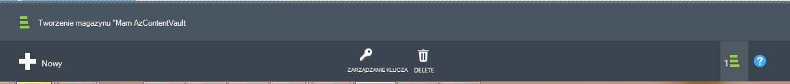
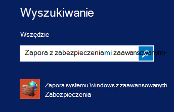
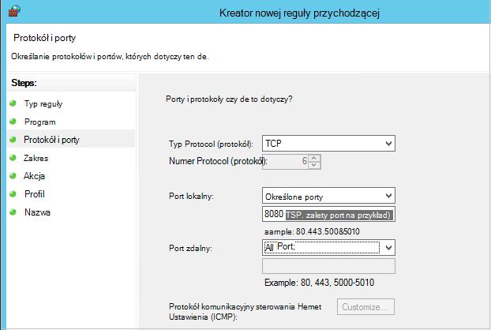

<properties
    pageTitle="Przygotowywanie środowiska do tworzenia kopii zapasowych Azure maszyn wirtualnych | Microsoft Azure"
    description="Upewnij się, że środowisko jest gotowa do wykonywania kopii zapasowych maszyn wirtualnych platformy Azure"
    services="backup"
    documentationCenter=""
    authors="markgalioto"
    manager="cfreeman"
    editor=""
    keywords="wykonywanie kopii zapasowych; wykonywanie kopii zapasowej;"/>

<tags
    ms.service="backup"
    ms.workload="storage-backup-recovery"
    ms.tgt_pltfrm="na"
    ms.devlang="na"
    ms.topic="article"
    ms.date="08/26/2016"
    ms.author="trinadhk; jimpark; markgal;"/>


# <a name="prepare-your-environment-to-back-up-azure-virtual-machines"></a>Przygotowania środowiska do tworzenia kopii zapasowych Azure maszyn wirtualnych

> [AZURE.SELECTOR]
- [Model Menedżera zasobów](backup-azure-arm-vms-prepare.md)
- [Model klasyczny](backup-azure-vms-prepare.md)

Przed utworzeniem kopii zapasowej Azure maszyn wirtualnych (maszyn wirtualnych), istnieją trzy warunki, które muszą istnieć.

- Potrzebujesz do tworzenia kopii zapasowej magazynu lub określenie istniejącej kopii zapasowej magazynu *w tym samym regionie jako usługi maszyn wirtualnych*.
- Ustanowienia połączenia z siecią między Azure publiczne adresy internetowe i punkty końcowe Azure miejsca do magazynowania.
- Instalowanie agenta maszyn wirtualnych na maszyn wirtualnych.

Jeśli wiadomo, że te warunki już istnieje w środowisku przejdź na [Wykonywanie kopii zapasowej artykułu maszyny wirtualne](backup-azure-vms.md). W przeciwnym razie Czytaj dalej, w tym artykule przeprowadzi Cię przez kroki do przygotowania środowiska do tworzenia kopii zapasowych maszyn wirtualnych Azure.


## <a name="limitations-when-backing-up-and-restoring-a-vm"></a>Ograniczenia podczas wykonywania kopii zapasowych i przywracanie maszyn wirtualnych

>[AZURE.NOTE] Azure występują dwa modele wdrożenia służące do tworzenia i pracy z zasobami: [Menedżer zasobów i klasyczny](../resource-manager-deployment-model.md). Poniższa lista zawiera ograniczenia, wdrażając w klasycznym modelu.

- Wykonywanie kopii zapasowych maszyn wirtualnych z więcej niż 16 dyski danych nie jest obsługiwane.
- Wykonywanie kopii zapasowych maszyn wirtualnych z zastrzeżonego adresu IP, a nie określonych punktów końcowych nie jest obsługiwane.
- Dane kopii zapasowej nie zawiera dyski sieci zainstalowany dołączone do maszyn wirtualnych. 
- Zastępowanie istniejących maszyn wirtualnych podczas przywracania nie jest obsługiwana. Najpierw usuń istniejący maszyny wirtualnej i wszystkie skojarzone dyski, a następnie odtworzyć dane z kopii zapasowej.
- I przywracania kopii zapasowych między region nie jest obsługiwane.
- Wykonywanie kopii zapasowych maszyn wirtualnych za pomocą usługi Azure kopii zapasowej jest obsługiwany we wszystkich regionach publicznej Azure (zobacz [Lista kontrolna](https://azure.microsoft.com/regions/#services) obsługiwanych regionów). Jeśli dzisiaj jest nieobsługiwane region, którego szukasz, nie pojawiał się na liście rozwijanej podczas tworzenia magazynu.
- Wykonywanie kopii zapasowych maszyn wirtualnych za pomocą usługi Azure kopii zapasowej jest obsługiwane tylko w przypadku wersji systemu operacyjnego wybierz pozycję:
  - **Linux**: Azure kopia zapasowa obsługuje [listy dystrybucji, które są zatwierdzone przez Azure](../virtual-machines/virtual-machines-linux-endorsed-distros.md) z wyjątkiem Core systemu operacyjnego Linux. Innych form podziału Przesuń i-właścicielem-Linux może również działają jak agenta maszyn wirtualnych jest dostępna na komputerze wirtualnych i obsługę Python istnieje.
  - **Windows Server**: w wersji wcześniejszej niż Windows Server 2008 R2 nie są obsługiwane.
- Przywracanie kontrolera domeny maszyn wirtualnych (kontrolera domeny), który jest częścią konfiguracji kontrolera domeny wiele jest obsługiwana tylko przy użyciu programu PowerShell. Dowiedz się więcej o [Przywracanie kontrolera domeny kontrolera domeny wielokrotne](backup-azure-restore-vms.md#restoring-domain-controller-vms).
- Przywracanie maszyn wirtualnych, które mają następujące konfiguracji sieci specjalnych jest obsługiwane tylko przy użyciu programu PowerShell. Maszyny wirtualne utworzone za pomocą przepływu pracy Przywróć w interfejsie użytkownika nie będą mieć te konfiguracji sieci, po zakończeniu operacji przywracania. Aby dowiedzieć się więcej, zobacz [Przywracanie maszyny wirtualne z konfiguracji sieci specjalnych](backup-azure-restore-vms.md#restoring-vms-with-special-netwrok-configurations).
    - Maszyn wirtualnych w obszarze konfigurację usługi równoważenia obciążenia (wewnętrznych i zewnętrznych)
    - Maszyn wirtualnych z wielu zastrzeżone adresy IP
    - Maszyn wirtualnych z wielu kart sieciowych

## <a name="create-a-backup-vault-for-a-vm"></a>Tworzenie kopii zapasowej magazynu dla maszyn wirtualnych

Kopii zapasowej magazynu jest jednostką, której są magazynowane kopii zapasowych i odzyskiwania punktów, które zostały utworzone w czasie. Magazyn kopii zapasowej zawiera również kopii zapasowej zasady, które zostaną zastosowane do maszyn wirtualnych teraz kopię zapasową.

Ten obraz przedstawia relacje między różnymi obiektami kopii zapasowej Azure:     

Tworzenie kopii zapasowej magazynu:

1. Zaloguj się do [portalu Azure](http://manage.windowsazure.com/).

2. W portalu Azure kliknij przycisk **Nowy** > **Integracji hybrydowych** > **kopii zapasowych**. Po kliknięciu **kopii zapasowej**, możesz automatycznie przełączy się do portalu klasyczny (jak pokazano po notatki).

    

    >[AZURE.NOTE] Jeśli Twoja subskrypcja ostatniego użycia w portalu klasyczny, Twoja subskrypcja może zostać otwarty w portalu klasyczny. W takim przypadku w celu utworzenia kopii zapasowej magazynu, kliknij przycisk **Nowy** > **Usług danych** > **Usługi odzyskiwania** > **Kopii zapasowej magazynu** > **Szybkie tworzenie** (patrz rysunek poniżej).

    

3. W polu **Nazwa**wpisz przyjazną nazwę identyfikującą magazyn. Nazwa musi być unikatowa dla Azure subskrypcji. Wpisz nazwę, która zawiera od 2 do 50 znaków. Musi rozpoczynać się od litery i mogą zawierać tylko litery, cyfry i łączniki.

4. W **regionie**zaznacz regionu geograficznego dla magazyn. Magazyn muszą znajdować się w tym samym regionie jako maszyn wirtualnych, które mają być chronione. Jeśli masz maszyn wirtualnych w wielu regionów, możesz utworzyć kopii zapasowej magazynu w każdym regionie. Istnieje potrzeba określenia konta miejsca do magazynowania do przechowywania kopii zapasowych danych — kopii zapasowej magazynu i uchwytu usługi Azure kopii zapasowej, to automatycznie.

5. **Subskrypcja** Wybierz subskrypcję, którą chcesz skojarzyć z magazynu kopii zapasowej. Będzie wiele opcji do wyboru tylko wtedy, gdy konto organizacji jest skojarzony z wiele subskrypcji Azure.

6. Kliknij przycisk **Utwórz magazynu**. Może minąć trochę czasu, zanim magazynu kopii zapasowej do utworzenia. Monitorowanie powiadomienia o stanie w dolnej części portalu.

    

7. Wiadomości będzie upewnij się, że magazyn został pomyślnie utworzony. Znajdzie się ona na stronie **usługi odzyskiwania** jako **aktywną**. Upewnij się wybrać po prawej stronie miejsca do magazynowania odpowiednie nadmiarowości opcji po utworzeniu magazyn. Dowiedz się więcej na temat [ustawiania opcji nadmiarowości miejsca do magazynowania w kopii zapasowej magazynu](backup-configure-vault.md#azure-backup---storage-redundancy-options).

    

8. Kliknij pozycję kopii zapasowej magazynu, aby przejść do strony **Szybki Start** miejsce, w którym są wyświetlane instrukcje dotyczące wykonywania kopii zapasowych Azure maszyn wirtualnych.

    


## <a name="network-connectivity"></a>Łączność sieciowa

Aby zarządzać migawki maszyn wirtualnych, rozszerzenia kopii zapasowej wymaga łączności z programem Azure publicznych adresów IP. Bez prawo łączność z Internetem limit czasu żądania HTTP maszyny wirtualnej i wykonywanie kopii zapasowej kończy się niepowodzeniem. Jeśli rozmieszczenia występują ograniczenia dostępu w miejscu (za pośrednictwem sieci grupy zabezpieczeń (NSG), na przykład), wybierz jedną z następujących opcji dostarczania wyczyść ścieżki ruchu kopii zapasowej:

- [Zakresy adresów IP centrum danych Azure listy sprawdzonej](http://www.microsoft.com/en-us/download/details.aspx?id=41653) — zobacz artykuł instrukcje w sposób do listy sprawdzonej adresów IP.
- Wdrażanie serwera proxy HTTP kierowania ruchu sieciowego.

Podczas wybierania opcji należy korzystnych rozwiązań są między zarządzania, kontrolę i koszt.

|Opcja|Zalety|Wady|
|------|----------|-------------|
|Zakresy adresów IP listy sprawdzonej| Nie dodatkowych kosztów.<br><br>Do otwierania programu access w NSG, należy użyć polecenia cmdlet <i>Set-AzureNetworkSecurityRule</i> . | Złożony, aby zarządzać nimi w dotkniętej problemem zakresów adresów IP zmiany w czasie.<br><br>Zapewnia dostęp do całego Azure i nie tylko miejsca do magazynowania.|
|Serwer proxy HTTP| Szczegółowe sterowanie na serwerze proxy przechowywania dozwolone adresy URL.<br>Pojedynczy punkt Internet dostęp do maszyny wirtualne.<br>Nie temat do zmiany adresu Azure IP.| Dodatkowe koszty systemie maszyny oprogramowanie serwera proxy.|

### <a name="whitelist-the-azure-datacenter-ip-ranges"></a>Zakresy adresów IP listy sprawdzonej Azure centrum danych

Do listy sprawdzonej zakresów adresów IP centrum danych Azure, zobacz [Azure witryny sieci Web](http://www.microsoft.com/en-us/download/details.aspx?id=41653) , aby uzyskać szczegółowe informacje na zakresów adresów IP i instrukcje.

### <a name="using-an-http-proxy-for-vm-backups"></a>Za pomocą serwer proxy HTTP kopii zapasowych maszyn wirtualnych
Podczas wykonywania kopii zapasowej maszyny, kopii zapasowej rozszerzenie na maszyn wirtualnych polecenia są wysyłane migawkę Zarządzanie magazynem usługi Azure za pomocą interfejsu API HTTPS. Skierować ruch rozszerzenia kopii zapasowej za pośrednictwem serwera proxy HTTP, ponieważ jest to jedynie składnika skonfigurowany w celu uzyskiwania dostępu do publicznego Internetu.

>[AZURE.NOTE] Istnieje Brak rekomendacji dla oprogramowania serwera proxy, który ma być używany. Upewnij się, wybierz pozycję serwer proxy, który jest zgodny z poniższych kroków konfiguracji.

Na przykład poniższej ilustracji przedstawiono kroki konfiguracji trzy konieczne użycie serwer proxy HTTP:

- Aplikacja maszyn wirtualnych kieruje cały ruch HTTP do publicznego Internetu przez maszyn wirtualnych serwera Proxy.
- Serwer proxy maszyn wirtualnych zezwala na ruch przychodzący z maszyny wirtualne w wirtualnej sieci.
- Grupa zabezpieczeń sieci (NSG) o nazwie NF blokowania musi zabezpieczeń reguły zezwalanie ruchu wychodzącego ruchu internetowego z maszyn wirtualnych serwera Proxy.


Aby użyć serwer proxy HTTP do komunikowania się z Internetem, wykonaj następujące czynności:

#### <a name="step-1-configure-outgoing-network-connections"></a>Krok 1. Konfigurowanie połączeń wychodzących
###### <a name="for-windows-machines"></a>W przypadku komputerów z systemem Windows
Spowoduje to skonfigurować konfiguracji serwera proxy dla lokalnego konta System.

1. Pobierz [PsExec](https://technet.microsoft.com/sysinternals/bb897553)
2. Uruchom następujące polecenie z podwyższonym poziomem uprawnień wiersza

     ```
     psexec -i -s "c:\Program Files\Internet Explorer\iexplore.exe"
     ```
     Zostanie otwarta okno programu internet explorer.
3. Przejdź do Narzędzia -> Opcje internetowe -> połączenia -> Ustawienia sieci LAN.
4. Sprawdź ustawienia serwera proxy dla konto systemowe. Ustawianie adresu IP serwera Proxy i portu.
5. Zamknij program Internet Explorer.

Skonfiguruje konfiguracji serwera proxy dla komputera i będzie używany do dowolnego ruchu wychodzącego protokołu HTTP/HTTPS.

Jeśli masz ustawienia serwera proxy dla bieżącego konta użytkownika (nie lokalnego konta System), należy użyć następującego skryptu nadawać je SYSTEMACCOUNT:

```
   $obj = Get-ItemProperty -Path Registry::”HKEY_CURRENT_USER\Software\Microsoft\Windows\CurrentVersion\Internet Settings\Connections"
   Set-ItemProperty -Path Registry::”HKEY_USERS\S-1-5-18\Software\Microsoft\Windows\CurrentVersion\Internet Settings\Connections" -Name DefaultConnectionSettings -Value $obj.DefaultConnectionSettings
   Set-ItemProperty -Path Registry::”HKEY_USERS\S-1-5-18\Software\Microsoft\Windows\CurrentVersion\Internet Settings\Connections" -Name SavedLegacySettings -Value $obj.SavedLegacySettings
   $obj = Get-ItemProperty -Path Registry::”HKEY_CURRENT_USER\Software\Microsoft\Windows\CurrentVersion\Internet Settings"
   Set-ItemProperty -Path Registry::”HKEY_USERS\S-1-5-18\Software\Microsoft\Windows\CurrentVersion\Internet Settings" -Name ProxyEnable -Value $obj.ProxyEnable
   Set-ItemProperty -Path Registry::”HKEY_USERS\S-1-5-18\Software\Microsoft\Windows\CurrentVersion\Internet Settings" -Name Proxyserver -Value $obj.Proxyserver
```

>[AZURE.NOTE] Jeśli możesz zaobserwować "(407) uwierzytelnianie serwera Proxy wymagane" w dzienniku serwera proxy, zaznacz pole wyboru usługi authrntication jest skonfigurowana prawidłowo.

######<a name="for-linux-machines"></a>W przypadku komputerów Linux

Dodaj następujący wiersz do ```/etc/environment``` pliku:

```
http_proxy=http://<proxy IP>:<proxy port>
```

Dodaj następujące wiersze do ```/etc/waagent.conf``` pliku:

```
HttpProxy.Host=<proxy IP>
HttpProxy.Port=<proxy port>
```

#### <a name="step-2-allow-incoming-connections-on-the-proxy-server"></a>Krok 2. Zezwól na połączenia przychodzące na serwerze proxy:

1. Na serwerze proxy otwórz Zaporę systemu Windows. Najprostszym sposobem na dostęp do zapory jest wyszukiwanie Zapora systemu Windows z zabezpieczeniami zaawansowanymi.

    

2. W oknie dialogowym Zapora systemu Windows kliknij prawym przyciskiem myszy **Reguły przychodzące** i kliknij przycisk **Nowa reguła...**.

    

3. W oknie dialogowym **Kreator nowej reguły przychodzącej**wybierz opcję **Niestandardowy** **Typ reguły** , a następnie kliknij przycisk **Dalej**.

4. Na stronie, aby wybrać **Program**wybierz pozycję **Wszystkie programy** , a następnie kliknij przycisk **Dalej**.

5. Na stronie **Protokoły i porty** wprowadź następujące informacje, a następnie kliknij przycisk **Dalej**:

    

    - *Protocol (protokół)* w obszarze Typ wybierz pozycję *TCP*
    - *port lokalny* wybierz *Określone porty*, w polu poniżej określić ```<Proxy Port>``` który został skonfigurowany.
    - *port zdalny* wybierz *Wszystkie porty*

    Do końca kreatora kliknij Dosunięty do końca i nadaj nazwę tej reguły.

#### <a name="step-3-add-an-exception-rule-to-the-nsg"></a>Krok 3. Dodawanie reguły wyjątków do NSG:

W wierszu polecenia programu PowerShell Azure wprowadź następujące polecenie:

Następujące polecenie dodaje wyjątek do NSG. Ten wyjątek umożliwia ruchu TCP z dowolnego portu na 10.0.0.5 dowolny adres internetowy na porcie 443 (HTTPS) lub 80 (HTTP). Jeśli potrzebujesz określonego portu w publicznego Internetu, pamiętaj dodać port do ```-DestinationPortRange``` także.

```
Get-AzureNetworkSecurityGroup -Name "NSG-lockdown" |
Set-AzureNetworkSecurityRule -Name "allow-proxy " -Action Allow -Protocol TCP -Type Outbound -Priority 200 -SourceAddressPrefix "10.0.0.5/32" -SourcePortRange "*" -DestinationAddressPrefix Internet -DestinationPortRange "80-443"
```

*Upewnij się, że możesz zastąpić imiona i nazwiska w tym przykładzie szczegółowe informacje do wdrożenia.*


## <a name="vm-agent"></a>Agent maszyn wirtualnych

Przed może wykonywać kopie zapasowe Azure maszyny wirtualnej, należy się upewnić, czy agent Azure maszyn wirtualnych jest poprawnie zainstalowany na komputerze wirtualnych. Ponieważ agenta maszyn wirtualnych jest opcjonalny składnik w momencie tworzenia maszyny wirtualnej, upewnij się, że jest zaznaczone pole wyboru agenta maszyn wirtualnych, zanim zainicjowano obsługę administracyjną maszyny wirtualnej.

### <a name="manual-installation-and-update"></a>Ręczna instalacja i aktualizacji

Agent maszyn wirtualnych znajduje się już w maszyny wirtualne, które zostały utworzone z galerii Azure. Jednak maszyn wirtualnych, które są migrowane z centrami danych lokalnych nie ma agenta maszyn wirtualnych zainstalowany. Takie maszyny wirtualne agenta maszyn wirtualnych musi być zainstalowany jawnie. Dowiedz się więcej o [instalowaniu agenta maszyn wirtualnych na istniejące maszyn wirtualnych](http://blogs.msdn.com/b/mast/archive/2014/04/08/install-the-vm-agent-on-an-existing-azure-vm.aspx).

| **Operacja** | **Systemu Windows** | **Linux** |
| --- | --- | --- |
| Instalowanie agenta maszyn wirtualnych | <li>Pobierz i zainstaluj [agenta MSI](http://go.microsoft.com/fwlink/?LinkID=394789&clcid=0x409). Konieczne będzie uprawnienia administratora, aby ukończyć instalację. <li>[Aktualizowanie właściwości maszyn wirtualnych](http://blogs.msdn.com/b/mast/archive/2014/04/08/install-the-vm-agent-on-an-existing-azure-vm.aspx) oznaczającą, że agent jest zainstalowany. | <li> Zainstaluj najnowszą wersję [agenta Linux](https://github.com/Azure/WALinuxAgent) z GitHub. Konieczne będzie uprawnienia administratora, aby ukończyć instalację. <li> [Aktualizowanie właściwości maszyn wirtualnych](http://blogs.msdn.com/b/mast/archive/2014/04/08/install-the-vm-agent-on-an-existing-azure-vm.aspx) oznaczającą, że agent jest zainstalowany. |
| Aktualizowanie agenta maszyn wirtualnych | Aktualizowanie agenta maszyn wirtualnych jest tak proste, jak ponownie zainstalować [plików binarnych agenta maszyn wirtualnych](http://go.microsoft.com/fwlink/?LinkID=394789&clcid=0x409). <br><br>Upewnij się, że nie wykonywanie kopii zapasowej jest uruchomiona podczas aktualizowania agenta maszyn wirtualnych. | Postępuj zgodnie z instrukcjami na temat [aktualizowania agenta maszyn wirtualnych Linux ](../virtual-machines-linux-update-agent.md). <br><br>Upewnij się, że nie wykonywanie kopii zapasowej jest uruchomiona podczas aktualizowania agenta maszyn wirtualnych. |
| Sprawdzanie poprawności instalacji agenta maszyn wirtualnych | <li>Przejdź do folderu *C:\WindowsAzure\Packages* w maszyn wirtualnych Azure. <li>Powinien znajdować się plik WaAppAgent.exe Prezentuj.<li> Kliknij prawym przyciskiem myszy plik, przejdź do **Właściwości**, a następnie wybierz kartę **Szczegóły** . Pole wersji produktu należy 2.6.1198.718 lub nowszym. | N/D! |


Informacje na temat [agenta maszyn wirtualnych](https://go.microsoft.com/fwLink/?LinkID=390493&clcid=0x409) i [jak go zainstalować](https://azure.microsoft.com/blog/2014/04/15/vm-agent-and-extensions-part-2/).

### <a name="backup-extension"></a>Rozszerzenie kopii zapasowej

Aby utworzyć kopię zapasową maszyny wirtualnej, usługa Azure kopii zapasowej instaluje rozszerzenia agenta maszyn wirtualnych. Usługa Azure kopii zapasowej bezproblemowo uaktualnienia i poprawki kopii zapasowej rozszerzenie bez dodatkowych cichym.

Jeśli jest uruchomiony maszyn wirtualnych kopii zapasowej rozszerzenie jest zainstalowany. Bieżąca maszyn wirtualnych także największe prawdopodobieństwo uzyskania punkt odzyskiwania spójną z aplikacją. Jednak kopia zapasowa Azure usługi będzie w dalszym ciągu kopię zapasową maszyn wirtualnych — nawet jeśli jest wyłączona, a nie może mieć rozszerzenie zainstalowane (czyli w trybie Offline maszyn wirtualnych). W tym przypadku punkt odzyskiwania będą *spójne ze stanem awarii* zgodnie z powyższym opisem.


## <a name="questions"></a>Masz pytania?
Jeśli masz pytania lub w przypadku dowolnej funkcji, którą chcesz wyświetlić dołączone, [Prześlij opinię](http://aka.ms/azurebackup_feedback).

## <a name="next-steps"></a>Następne kroki
Teraz, gdy już przygotowane środowiska tworzenia kopii zapasowych z maszyn wirtualnych, logiczne następnym krokiem jest utworzenie kopii zapasowej. Artykuł w planowaniu zawiera bardziej szczegółowe informacje na temat wykonywania kopii zapasowych maszyny wirtualne.

- [Tworzenie kopii zapasowych maszyn wirtualnych](backup-azure-vms.md)
- [Planowanie infrastruktury kopii zapasowych maszyn wirtualnych](backup-azure-vms-introduction.md)
- [Zarządzanie kopie zapasowe maszyn wirtualnych](backup-azure-manage-vms.md)
