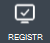
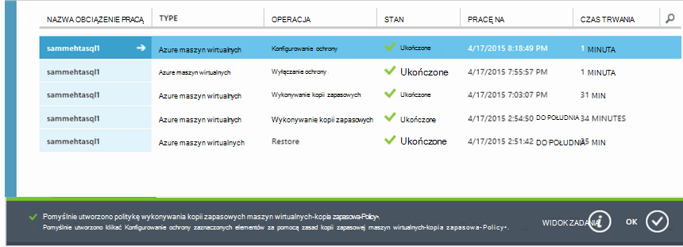

<properties
    pageTitle="Wykonywanie kopii zapasowej Azure maszyn wirtualnych | Microsoft Azure"
    description="Odnajdowanie, rejestrowanie i tworzenie kopii zapasowych maszyn wirtualnych z poniższe procedury dla kopii zapasowej Azure maszyn wirtualnych."
    services="backup"
    documentationCenter=""
    authors="markgalioto"
    manager="jwhit"
    editor=""
    keywords="kopii zapasowych maszyn wirtualnych. Tworzenie kopii zapasowych maszyn wirtualnych; odzyskiwanie kopii zapasowej i danych; wykonywanie kopii zapasowych maszyn wirtualnych"/>

<tags
    ms.service="backup"
    ms.workload="storage-backup-recovery"
    ms.tgt_pltfrm="na"
    ms.devlang="na"
    ms.topic="article"
    ms.date="09/28/2016"
    ms.author="trinadhk; jimpark; markgal;"/>

# Wykonywanie kopii zapasowej Azure maszyn wirtualnych

> [AZURE.SELECTOR]
- [Wykonywanie kopii zapasowej maszyny wirtualne do magazynu usługi odzyskiwania](backup-azure-arm-vms.md)
- [Utwórz kopię zapasową maszyny wirtualne magazynu kopii zapasowej](backup-azure-vms.md)

Ten artykuł zawiera procedury tworzenia kopii zapasowych wdrożony w klasycznym Azure maszyny wirtualnej (maszyn wirtualnych) do magazynu kopii zapasowej. Istnieje kilka zadań, które należy wykonać przed utworzeniem kopii zapasowej Azure maszyn wirtualnych. Jeśli jeszcze tego nie zrobiono, wykonaj [wymagania wstępne](backup-azure-vms-prepare.md) do przygotowania środowiska tworzenia kopii zapasowych pośrednictwem usługi SMS.

Aby uzyskać dodatkowe informacje zobacz artykuły o [planowaniu infrastruktury kopii zapasowej maszyn wirtualnych w Azure](backup-azure-vms-introduction.md) i [Azure maszyn wirtualnych](https://azure.microsoft.com/documentation/services/virtual-machines/).

>[AZURE.NOTE] Azure występują dwa modele wdrożenia służące do tworzenia i pracy z zasobami: [Menedżer zasobów i klasyczny](../resource-manager-deployment-model.md). Magazynu kopii zapasowej można chronić tylko wdrożony w klasycznym maszyny wirtualne. Nie można zabezpieczyć wdrożony Menedżera zasobów maszyny wirtualne z magazynu kopii zapasowej. Aby uzyskać szczegółowe informacje na temat pracy z magazynami usługi odzyskiwania, zobacz [Tworzenie kopii zapasowej pośrednictwem SMS do magazynu usługi odzyskiwania](backup-azure-arm-vms.md) .

Wykonywanie kopii zapasowej Azure maszyn wirtualnych obejmuje trzy podstawowe etapy:

>[AZURE.NOTE] Wykonywanie kopii zapasowych maszyn wirtualnych jest procesem lokalny. Nie można wykonać kopię zapasową maszyn wirtualnych w jednym regionie do kopii zapasowej magazynu w innym regionie. Dzięki utworzeniu kopii zapasowej magazynu w każdym regionie Azure w przypadku maszyny wirtualne, które zostaną uwzględnione w kopii zapasowej.

## Krok 1 — poznawanie Azure maszyn wirtualnych
Aby upewnić się, że wszelkie nowe wirtualnych maszyn dodane do subskrypcji są rozpoznawane przed zarejestrowaniem, należy uruchomić proces wykrywania. Kwerendy proces Azure listy maszyn wirtualnych w subskrypcji, wraz z dodatkowymi informacjami, takich jak nazwa usługi cloud i regionu.

1. Zaloguj się do [portalu klasyczny](http://manage.windowsazure.com/)

2. Na liście usług Azure kliknij pozycję **Usługi odzyskiwania** , aby otworzyć listę magazynów i witryn przywracania kopii zapasowych.
    

3. Na liście magazynami kopii zapasowej wybierz pozycję Magazyn do tworzenia kopii zapasowych maszyn wirtualnych.

    Jeśli jest to nowy magazynu portalu zostanie wyświetlona na stronie **Szybkie uruchamianie** .

    

    Jeśli wcześniej została skonfigurowana magazyn, portalu po otwarciu menu niedawno używane.

4. Z menu magazynu (u góry strony) kliknij pozycję **Registered elementy**.

    

5. Z menu **Typ** wybierz **maszyn wirtualnych Azure**.

    

6. Kliknij przycisk **Wyszukiwanie** w dolnej części strony.
    

    Proces wykrywania może potrwać kilka minut, gdy są są oznaczane znakami tabulacji maszyn wirtualnych. Istnieje powiadomienie u dołu ekranu, który umożliwia sprawdzenie, czy jest uruchomiony proces.

    

    Wykonaj zmiany dotyczące powiadamiania po zakończeniu procesu. Jeśli proces wykrywania nie znaleziono maszyn wirtualnych, najpierw upewnij się, że istnieje maszyny wirtualne. Jeśli istnieje maszyny wirtualne, upewnij się, że maszyny wirtualne znajdują się w tym samym regionie jako kopii zapasowej magazynu. Jeśli maszyny wirtualne istnieje i jest w tym samym regionie, upewnij się, że maszyny wirtualne nie jest już zarejestrowana do magazynu kopii zapasowej. Jeśli maszyny jest przypisany do kopii zapasowej magazynu nie jest dostępna dla można przypisać do innych magazynów kopii zapasowej.

    

    Po odkryć nowe elementy, przejdź do kroku 2 i zarejestrować pośrednictwem usługi SMS.

##  Krok 2 — Rejestruj Azure maszyn wirtualnych
Zarejestruj się Azure maszyny wirtualnej, który chcesz skojarzyć usługi Azure kopii zapasowej. Jest to zazwyczaj jednorazowego aktywności.

1. Przejdź do kopii zapasowej magazynu w obszarze **Odzyskiwania usług** w portalu Azure, a następnie kliknij **Zarejestrowana elementów**.

2. Z menu rozwijanego wybierz **maszyn wirtualnych Azure** .

    

3. Kliknij przycisk **ZAREJESTRUJ się** w dolnej części strony.
    

4. W menu skrótów **Zarejestrować elementów** wybierz maszyn wirtualnych, które chcesz zarejestrować. Jeśli istnieją dwa lub więcej maszyn wirtualnych o takiej samej nazwie, należy użyć usługi w chmurze, aby odróżnić między nimi.

    >[AZURE.TIP] W tym samym czasie można rejestrować wiele maszyn wirtualnych.

    Zadanie jest tworzone dla każdej z nich wirtualnych został zaznaczony.

5. Kliknij pozycję **Zadania** w powiadomieniu, aby przejść do strony **zadania** .

    

    Maszyna wirtualna pojawia się też w na liście elementów zarejestrowane wraz z stanu operacji rejestracji.

    

    Po zakończeniu operacji zmian stanu, aby odzwierciedlała stan *zarejestrowane* .

    

## Krok 3 — ochrona Azure maszyn wirtualnych
Teraz możesz skonfigurować zasady tworzenia kopii zapasowych i przechowywania maszyny wirtualnej. Wiele maszyn wirtualnych mogą być chronione za pomocą pojedynczego ochrony działań.

Azure magazynami kopii zapasowych utworzonych po maj 2015 pochodzić z domyślną zasadę wbudowane magazyn. Ten domyślnych zasad zawiera domyślne zachowanie 30 dni i harmonogram wykonywania kopii zapasowych raz dziennie.

1. Przejdź do kopii zapasowej magazynu w obszarze **Odzyskiwania usług** w portalu Azure, a następnie kliknij **Zarejestrowana elementów**.
2. Z menu rozwijanego wybierz **maszyn wirtualnych Azure** .

    

3. Kliknij przycisk **Chroń** u dołu strony.

    Zostanie wyświetlony **Kreator ochrony elementów** . Kreator wyświetla tylko maszyn wirtualnych, które są rejestrowane i nie jest chroniony. Wybierz pozycję maszyn wirtualnych, które mają być chronione.

    Jeśli istnieją dwa lub więcej maszyn wirtualnych o takiej samej nazwie, za pomocą usługi w chmurze odróżniać maszyn wirtualnych.

    >[AZURE.TIP] W tym samym czasie można chronić wiele maszyn wirtualnych.

    

4. Wybierz **Harmonogram wykonywania kopii zapasowych** do tworzenia kopii zapasowych maszyn wirtualnych, które zostały wybrane. Można wybrać z istniejącego zestawu zasad lub zdefiniuj nową.

    Każdej kopii zapasowej zasady może mieć wiele maszyn wirtualnych skojarzone z nim. Jednak maszyna wirtualna może zawierać tylko skojarzone z zasad na dowolnym etapie w czasie.

    

    >[AZURE.NOTE] Zasady tworzenia kopii zapasowych zawiera schemat przechowywania zaplanowanych kopii zapasowych. Jeśli wybierzesz istniejącą zasadę kopii zapasowej, nie można zmienić opcje przechowywania w następnym kroku.

5. Wybierz **zakres przechowywania** skojarzyć z kopii zapasowych.

    

    Zasady przechowywania określa czas przechowywania kopii zapasowej. Możesz określić zasady przechowywania różnych na podstawie przy podejmowaniu kopii zapasowej. Na przykład punktu kopii zapasowej wykonywane codziennie (który służy jako punkt odzyskiwania operacyjne) mogą być zachowywane przez 90 dni. W porównaniu punktu kopii zapasowej wykonywane na końcu każdego kwartału (dla potrzeb inspekcji) może być konieczne zachowane przez wiele miesięcy lub lat.

    

    W tym przykładzie obraz:

    - **Dzienny zasady przechowywania**: kopie zapasowe pobierane codziennie są przechowywane przez 30 dni.
    - **Tygodniowy zasady przechowywania**: kopie zapasowe pobierane co tydzień w niedzielę są zachowywane 104 tygodni.
    - **Miesięczny zasady przechowywania**: kopie zapasowe wykonane w niedzielę ostatniego dnia każdego miesiąca są zachowywane 120 miesięcy.
    - **Roczny zasady przechowywania**: kopie zapasowe wykonane na pierwszą niedzielę każdej stycznia są zachowywane dla lat 99.

    Zadanie jest tworzona Konfigurowanie zasad ochrony i kojarzenie maszyn wirtualnych do tych zasad dla każdej z nich wirtualnych jest zaznaczona.

6. Aby wyświetlić listę zadań **Konfigurowania ochrony** , z menu magazynami kliknij **zadania** i wybierz **Konfigurowanie ochrony** w filtrze **operacji** .

    

## Wstępnej kopii zapasowej
Gdy maszyny wirtualnej są chronione za pomocą zasad, go wyświetlane na karcie **Chronionych elementów** ze stanem *chronione — (oczekująca wstępnej kopii zapasowej)*. Domyślnie pierwszy zaplanowanej kopii zapasowej jest *wstępnej kopii zapasowej*.

Aby wyzwolić wstępnej kopii zapasowej zaraz po skonfigurowaniu ochrony:

1. U dołu strony **Chronionych elementów** kliknij pozycję **Kopia zapasowa teraz**.

    Usługa Azure kopii zapasowej tworzy zadanie dla początkowej wykonywanie kopii zapasowej kopii zapasowej.

2. Kliknij kartę **zadania** , aby wyświetlić listę zadań.

    

>[AZURE.NOTE] Podczas operacji wykonywania kopii zapasowej kopii zapasowej Azure problemy z usługą polecenia kopii zapasowej rozszerzenia w każdej maszyny wirtualnej, aby opróżnić wszystkie zadania zapisu i zrób migawkę spójne.

Po zakończeniu wstępnej kopii zapasowej stan maszyny wirtualnej na karcie **Elementy chroniony** jest *chroniony*.

## Wyświetlanie stanu kopii zapasowej i podania ich szczegółów
Gdy chroniony, Zliczanie maszyn wirtualnych również zwiększa Podsumowanie strony **pulpitu nawigacyjnego** . Strony **pulpitu nawigacyjnego** również pokazuje liczbę zadań z ostatnich 24 godzin, które zostały *pomyślnie*, *nie powiodło się*i jest *w toku*. Na stronie **zadania** za pomocą **stanu**, **Operacja**lub **od** i **do** menu do filtrowania zadań.

Wartości na pulpicie nawigacyjnym są odświeżane raz na 24 godziny.

## Rozwiązywanie problemów z błędami
Jeśli wystąpią problemy w czasie wykonywania kopii zapasowej konta komputera wirtualnych Przyjrzyj się [maszyn wirtualnych artykuł dotyczący rozwiązywania problemów](backup-azure-vms-troubleshoot.md) , aby uzyskać pomoc.

## Następne kroki

- [Monitorowanie maszyn wirtualnych i zarządzanie nimi](backup-azure-manage-vms.md)
- [Przywracanie maszyn wirtualnych](backup-azure-restore-vms.md)
