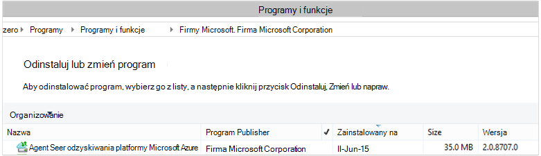

<properties
    pageTitle="Wdrażanie i zarządzanie nią kopii zapasowej dla systemu Windows Server-klienta przy użyciu programu PowerShell | Microsoft Azure"
    description="Dowiedz się, jak wdrażać i zarządzanie Azure kopii zapasowej przy użyciu programu PowerShell"
    services="backup"
    documentationCenter=""
    authors="saurabhsensharma"
    manager="shivamg"
    editor=""/>

<tags
    ms.service="backup"
    ms.workload="storage-backup-recovery"
    ms.tgt_pltfrm="na"
    ms.devlang="na"
    ms.topic="article"
    ms.date="09/01/2016"
    ms.author="saurabhsensharma;markgal;jimpark;nkolli;trinadhk"/>


# <a name="deploy-and-manage-backup-to-azure-for-windows-serverwindows-client-using-powershell"></a>Wdrażanie i zarządzanie nią kopii zapasowej Azure dla systemu Windows Server i Windows klienta za pomocą programu PowerShell

> [AZURE.SELECTOR]
- [ARM](backup-client-automation.md)
- [Klasyczny](backup-client-automation-classic.md)

W tym artykule pokazano, jak za pomocą programu PowerShell konfigurowania Azure kopii zapasowej na serwerze systemu Windows lub klienta systemu Windows oraz zarządzania nimi i przywracania kopii zapasowych.

## <a name="install-azure-powershell"></a>Instalowanie programu PowerShell Azure

[AZURE.INCLUDE [learn-about-deployment-models](../../includes/learn-about-deployment-models-include.md)]

W października 2015 r. Azure PowerShell 1.0 został wydany. Ta wersja zakończyła się pomyślnie 0.9.8 Zwolnij i temat pewne istotne zmiany, szczególnie w strukturze nazw poleceń cmdlet. polecenia cmdlet 1.0 postępuj zgodnie ze wzorcem nazw {czasownikowe}-AzureRm {rzeczownikowe;} należy 0.9.8 nazwy nie powinno obejmować **Menedżera zasobów** (na przykład nowy-AzureRmResourceGroup zamiast AzureResourceGroup nowy). Przy użyciu programu PowerShell Azure 0.9.8, należy najpierw włączyć tryb Menedżera zasobów, uruchamiając polecenie **Przełącz AzureMode AzureResourceManager** . To polecenie nie jest konieczne w 1.0 lub nowsza.

Jeśli chcesz używać skryptów napisanych dla 0.9.8 środowisko, w środowisku 1.0 lub nowszej, należy dokładnie przetestować skryptów w środowisku produkcyjnym przed przed ich użyciem produkcji, aby uniknąć nieoczekiwanych wpływ.

[Pobierz najnowszą wersję programu PowerShell](https://github.com/Azure/azure-powershell/releases) (minimalna wersja wymagana jest: 1.0.0)


[AZURE.INCLUDE [arm-getting-setup-powershell](../../includes/arm-getting-setup-powershell.md)]


## <a name="create-a-backup-vault"></a>Tworzenie kopii zapasowej magazynu

> [AZURE.WARNING] Dla klientów korzystających z kopii zapasowej Azure po raz pierwszy musisz zarejestrować dostawcy Azure kopia zapasowa może być używany przy użyciu swojej subskrypcji. Można to zrobić, uruchamiając następujące polecenie: Register AzureProvider - ProviderNamespace "Microsoft.Backup"

Możesz utworzyć nowy magazynu kopii zapasowej przy użyciu polecenia cmdlet **New-AzureRMBackupVault** . Magazyn kopii zapasowej jest zasobem ARM, więc należy umieścić w grupie zasobów. W pełnych konsoli Azure programu PowerShell uruchom następujące polecenia:

```
PS C:\> New-AzureResourceGroup –Name “test-rg” -Region “West US”
PS C:\> $backupvault = New-AzureRMBackupVault –ResourceGroupName “test-rg” –Name “test-vault” –Region “West US” –Storage GeoRedundant
```

Należy użyć polecenia cmdlet **Get-AzureRMBackupVault** do wyświetlania listy z kopii zapasowej magazynów w subskrypcji.


## <a name="installing-the-azure-backup-agent"></a>Instalowanie agenta kopii zapasowej Azure
Przed zainstalowaniem agent Azure Backup można muszą być Instalatora pobrany i znajdują się w systemie Windows Server. Można uzyskać najnowszą wersję Instalatora, z [Centrum pobierania firmy Microsoft](http://aka.ms/azurebackup_agent) lub z magazynu kopii zapasowej strony pulpitu nawigacyjnego. Zapisywanie Instalatora pakietu w łatwo dostępnym miejscu, takich jak * C:\Downloads\*.

Aby zainstalować agenta, uruchom następujące polecenie w konsoli programu PowerShell podwyższonym poziomem uprawnień:

```
PS C:\> MARSAgentInstaller.exe /q
```

Spowoduje to zainstalowanie agent przy użyciu opcji domyślnych. Instalacja trwa kilka minut w tle. Jeśli nie określisz opcję */nu* na końcu instalacji Sprawdź aktualizacje zostanie otwarte okno **Windows Update** . Po zainstalowaniu agenta zostanie wyświetlona na liście zainstalowanych programów.

Aby wyświetlić listę zainstalowanych programów, przejdź do **Panelu sterowania** > **Programy** > **Programy i funkcje**.



### <a name="installation-options"></a>Opcje instalacji

Aby wyświetlić wszystkie opcje dostępne za pośrednictwem wiersza polecenia, użyj następującego polecenia:

```
PS C:\> MARSAgentInstaller.exe /?
```

Opcje dostępne są następujące:

| Opcja | Szczegóły | Domyślne |
| ---- | ----- | ----- |
| / q | Instalacji w trybie cichym | - |
| / p: "położenie" | Ścieżka do folderu instalacji agenta kopii zapasowej Azure. | C:\Program Files\Microsoft Azure odzyskiwania usług agenta |
| / s: "położenie" | Ścieżka do folderu pamięci podręcznej agenta kopii zapasowej Azure. | C:\Program Files\Microsoft Azure odzyskiwania usług Agent\Scratch |
| /m | Wyraź zgodę na usługi Microsoft Update | - |
| /nu | Nie po zakończeniu instalacji Sprawdź aktualizacje | - |
| /d | Odinstalowywania agenta usługi Microsoft Azure odzyskiwania | - |
| /pH | Adres hosta serwera proxy | - |
| /Po | Numer portu hosta serwera proxy | - |
| /Pu | Nazwa użytkownika hosta serwera proxy | - |
| /PW | Hasło serwera proxy | - |


## <a name="registering-with-the-azure-backup-service"></a>Rejestrowanie w usłudze Azure kopii zapasowej
Przed zarejestrowaniem z usługą Azure wykonywanie kopii zapasowych, należy się upewnić, czy są spełnione [wymagania wstępne](backup-configure-vault.md) . Należy:

- Prawidłowe subskrypcji Azure
- Masz kopii zapasowej magazynu

Aby pobrać magazynu poświadczeń, uruchom polecenie cmdlet **Get-AzureRMBackupVaultCredentials** w konsoli programu Azure PowerShell i zapisać go w odpowiednim miejscu, takich jak * C:\Downloads\*.

```
PS C:\> $credspath = "C:\"
PS C:\> $credsfilename = Get-AzureRMBackupVaultCredentials -Vault $backupvault -TargetLocation $credspath
PS C:\> $credsfilename
f5303a0b-fae4-4cdb-b44d-0e4c032dde26_backuprg_backuprn_2015-08-11--06-22-35.VaultCredentials
```

Rejestrowanie komputera z magazyn jest wykonywane przy użyciu polecenia cmdlet [Start OBRegistration](https://technet.microsoft.com/library/hh770398%28v=wps.630%29.aspx) :

```
PS C:\> $cred = $credspath + $credsfilename
PS C:\> Start-OBRegistration -VaultCredentials $cred -Confirm:$false

CertThumbprint      : 7a2ef2caa2e74b6ed1222a5e89288ddad438df2
SubscriptionID      : ef4ab577-c2c0-43e4-af80-af49f485f3d1
ServiceResourceName : test-vault
Region              : West US

Machine registration succeeded.
```

> [AZURE.IMPORTANT] Nie należy używać ścieżki względne umożliwiają określenie magazyn plików poświadczeń. Należy podać ścieżkę absolutną jako dane wejściowe do polecenia cmdlet.

## <a name="networking-settings"></a>Ustawienia sieciowe
Gdy jest łączność z Internetem komputera systemu Windows za pośrednictwem serwera proxy, ustawienia serwera proxy może być również udostępniona do agenta. W tym przykładzie jest nie serwera proxy, więc możemy są wyraźnie wyczyszczenie wszelkie informacje związane z serwera proxy.

Można również sterować wykorzystania przepustowości za pomocą opcji ```work hour bandwidth``` i ```non-work hour bandwidth``` dla danego zestawu dni tygodnia.

Ustawienia serwera proxy i przepustowość szczegóły jest wykonywane przy użyciu polecenia cmdlet [Set-OBMachineSetting](https://technet.microsoft.com/library/hh770409%28v=wps.630%29.aspx) :

```
PS C:\> Set-OBMachineSetting -NoProxy
Server properties updated successfully.

PS C:\> Set-OBMachineSetting -NoThrottle
Server properties updated successfully.
```

## <a name="encryption-settings"></a>Ustawienia szyfrowania
Dane kopii zapasowej wysyłane do kopii zapasowej Azure są szyfrowane ochrony poufności danych. Hasło szyfrowania jest "hasło", aby odszyfrować dane w czasie przywracania.

```
PS C:\> ConvertTo-SecureString -String "Complex!123_STRING" -AsPlainText -Force | Set-OBMachineSetting
Server properties updated successfully
```

> [AZURE.IMPORTANT] Zachowaj dane hasło bezpieczne, po ustawieniu. Nie można przywrócić danych z Azure bez to hasło.

## <a name="back-up-files-and-folders"></a>Wykonywanie kopii zapasowej plików i folderów
Wszystkie kopie zapasowe i serwerów systemu Windows Azure kopia zapasowa podlegają zasady. Zasady obejmuje trzy elementy:

1. **Harmonogram wykonywania kopii zapasowych** umożliwia określenie, kiedy kopie zapasowe muszą być wykonywane i synchronizowane z usługą.
2. **Harmonogram przechowywania** Określa, jak długo przechowywania punktów odzyskiwania w Azure.
3. **Specyfikacja włączenie/wyłączenie pliku** decyduje o tym, co należy kopię zapasową.

W tym dokumencie ponieważ mamy już Automatyzowanie kopii zapasowej, firma Microsoft będzie założono, że nic się nie został skonfigurowany. Firma Microsoft rozpocząć od utworzenia nowego kopii zapasowej zasad przy użyciu polecenia cmdlet [New-OBPolicy](https://technet.microsoft.com/library/hh770416.aspx) i korzystania z niego.

```
PS C:\> $newpolicy = New-OBPolicy
```

W tej chwili zasady jest puste i innych poleceń cmdlet są potrzebne aby zdefiniować, jakie elementy będą dołączone lub wykluczone, podczas wykonywania kopii zapasowych, spowoduje uruchomienie i gdzie będą przechowywane kopie zapasowe.

### <a name="configuring-the-backup-schedule"></a>Konfigurowanie harmonogramu wykonywania kopii zapasowych
Pierwsze 3 części zasady jest Harmonogram kopii zapasowej przy użyciu polecenia cmdlet [New-OBSchedule](https://technet.microsoft.com/library/hh770401) jest tworzona. Harmonogram kopii zapasowej Określa, kiedy należy podjąć kopie zapasowe. Tworząc harmonogram, musisz określić 2 parametrów wejściowych:

- **Dni tygodnia** , która powinna działać w kopii zapasowej. Można uruchamiać zadania wykonywania kopii zapasowej na tylko jeden dzień lub każdego dnia, tygodnia lub dowolną kombinację między.
- **Godziny dnia** podczas tworzenia kopii zapasowej powinna działać. Można zdefiniować maksymalnie 3 różnych porach dnia, gdy zostanie wyzwolony kopii zapasowej.

Na przykład może skonfigurować zasadę kopii zapasowej, która jest uruchamiany godzinie 4, co sobotę i niedzielę.

```
PS C:\> $sched = New-OBSchedule -DaysofWeek Saturday, Sunday -TimesofDay 16:00
```

Harmonogram kopii zapasowej musi być skojarzone z zasady, a można to osiągnąć przy użyciu polecenia cmdlet [Set-OBSchedule](https://technet.microsoft.com/library/hh770407) .

```
PS C:> Set-OBSchedule -Policy $newpolicy -Schedule $sched
BackupSchedule : 4:00 PM Saturday, Sunday, Every 1 week(s) DsList : PolicyName : RetentionPolicy : State : New PolicyState : Valid
```
### <a name="configuring-a-retention-policy"></a>Konfigurowanie zasad przechowywania
Zasady przechowywania Określa, jak długo trwa punktów odzyskiwania utworzone na podstawie zadań kopii zapasowej są zachowywane. Podczas tworzenia nowych zasad przechowywania przy użyciu polecenia cmdlet [New-OBRetentionPolicy](https://technet.microsoft.com/library/hh770425) , można określić liczbę dni, które należy zachować z kopii zapasowej Azure punktów odzyskiwanie kopii zapasowej. W poniższym przykładzie ustawia zasady przechowywania 7 dni.

```
PS C:\> $retentionpolicy = New-OBRetentionPolicy -RetentionDays 7
```

Zasady przechowywania muszą być skojarzone z głównym zasady przy użyciu polecenia cmdlet [Set-OBRetentionPolicy](https://technet.microsoft.com/library/hh770405):

```
PS C:\> Set-OBRetentionPolicy -Policy $newpolicy -RetentionPolicy $retentionpolicy

BackupSchedule  : 4:00 PM
                  Saturday, Sunday,
                  Every 1 week(s)
DsList          :
PolicyName      :
RetentionPolicy : Retention Days : 7

                  WeeklyLTRSchedule :
                  Weekly schedule is not set

                  MonthlyLTRSchedule :
                  Monthly schedule is not set

                  YearlyLTRSchedule :
                  Yearly schedule is not set

State           : New
PolicyState     : Valid
```
### <a name="including-and-excluding-files-to-be-backed-up"></a>Uwzględnianie lub wykluczanie plików do wykonania kopii zapasowej
```OBFileSpec``` Obiektu określa pliki uwzględniane i wyłączone w kopii zapasowej. To jest zestaw reguł, które zakresu chronionych plików i folderów na komputerze. Można mieć wiele plików uwzględniania lub wykluczania reguły zgodnie z wymaganiami i kojarzenie ich z zasady. Podczas tworzenia nowego obiektu OBFileSpec, możesz wykonać następujące czynności:

- Określanie plików i folderów, które mają zostać uwzględnione
- Określanie plików i folderów, które mają być wyłączone
- Określ cykliczne kopię zapasową danych w folderze (lub) czy kopie powinny być tylko najwyższego poziomu plików w folderze określonym w górę.

Rozwinięciu za pomocą flagi - nierekursywne w poleceniu OBFileSpec nowy.

W poniższym przykładzie możemy utworzyć kopię zapasową woluminu C: i D: i wykluczanie plików binarnych systemu operacyjnego w folderze systemu Windows i wszystkie foldery tymczasowe. W tym celu utworzymy dwa pliku specyfikacje przy użyciu polecenia cmdlet [New-OBFileSpec](https://technet.microsoft.com/library/hh770408) - jedną do uwzględnienia, a drugi do wyłączenia. Po utworzeniu specyfikacje pliku są kojarzone z zasad przy użyciu polecenia cmdlet [OBFileSpec Dodaj](https://technet.microsoft.com/library/hh770424) .

```
PS C:\> $inclusions = New-OBFileSpec -FileSpec @("C:\", "D:\")

PS C:\> $exclusions = New-OBFileSpec -FileSpec @("C:\windows", "C:\temp") -Exclude

PS C:\> Add-OBFileSpec -Policy $newpolicy -FileSpec $inclusions

BackupSchedule  : 4:00 PM
                  Saturday, Sunday,
                  Every 1 week(s)
DsList          : {DataSource
                  DatasourceId:0
                  Name:C:\
                  FileSpec:FileSpec
                  FileSpec:C:\
                  IsExclude:False
                  IsRecursive:True

                  , DataSource
                  DatasourceId:0
                  Name:D:\
                  FileSpec:FileSpec
                  FileSpec:D:\
                  IsExclude:False
                  IsRecursive:True

                  }
PolicyName      :
RetentionPolicy : Retention Days : 7

                  WeeklyLTRSchedule :
                  Weekly schedule is not set

                  MonthlyLTRSchedule :
                  Monthly schedule is not set

                  YearlyLTRSchedule :
                  Yearly schedule is not set

State           : New
PolicyState     : Valid


PS C:\> Add-OBFileSpec -Policy $newpolicy -FileSpec $exclusions

BackupSchedule  : 4:00 PM
                  Saturday, Sunday,
                  Every 1 week(s)
DsList          : {DataSource
                  DatasourceId:0
                  Name:C:\
                  FileSpec:FileSpec
                  FileSpec:C:\
                  IsExclude:False
                  IsRecursive:True
                  ,FileSpec
                  FileSpec:C:\windows
                  IsExclude:True
                  IsRecursive:True
                  ,FileSpec
                  FileSpec:C:\temp
                  IsExclude:True
                  IsRecursive:True

                  , DataSource
                  DatasourceId:0
                  Name:D:\
                  FileSpec:FileSpec
                  FileSpec:D:\
                  IsExclude:False
                  IsRecursive:True

                  }
PolicyName      :
RetentionPolicy : Retention Days : 7

                  WeeklyLTRSchedule :
                  Weekly schedule is not set

                  MonthlyLTRSchedule :
                  Monthly schedule is not set

                  YearlyLTRSchedule :
                  Yearly schedule is not set

State           : New
PolicyState     : Valid
```

### <a name="applying-the-policy"></a>Stosowanie zasad
Teraz obiektu zasad zostało zakończone i ma skojarzony harmonogramu wykonywania kopii zapasowych, zasady przechowywania i włączenie/wyłączenie listy plików. Teraz można przeznaczane na Azure kopii zapasowej tych zasad. Przed zastosowaniem zasady nowo utworzonego upewnij się, że nie ma żadnych istniejących zasad kopii zapasowej skojarzone z serwerem przy użyciu polecenia cmdlet [OBPolicy Usuń](https://technet.microsoft.com/library/hh770415) . Usuwanie zasady wyświetli monit o potwierdzenie. Aby pominąć Użyj potwierdzenia ```-Confirm:$false``` flagi przy użyciu polecenia cmdlet.

```
PS C:> Get-OBPolicy | Remove-OBPolicy
Microsoft Azure Backup Are you sure you want to remove this backup policy? This will delete all the backed up data. [Y] Yes [A] Yes to All [N] No [L] No to All [S] Suspend [?] Help (default is "Y"):
```

Zatwierdzanie obiektu zasad jest wykonywane przy użyciu polecenia cmdlet [Set-OBPolicy](https://technet.microsoft.com/library/hh770421) . Spowoduje to również monituje o potwierdzenie. Aby pominąć Użyj potwierdzenia ```-Confirm:$false``` flagi przy użyciu polecenia cmdlet.

```
PS C:> Set-OBPolicy -Policy $newpolicy
Microsoft Azure Backup Do you want to save this backup policy ? [Y] Yes [A] Yes to All [N] No [L] No to All [S] Suspend [?] Help (default is "Y"):
BackupSchedule : 4:00 PM Saturday, Sunday, Every 1 week(s)
DsList : {DataSource
         DatasourceId:4508156004108672185
         Name:C:\
         FileSpec:FileSpec
         FileSpec:C:\
         IsExclude:False
         IsRecursive:True,

         FileSpec
         FileSpec:C:\windows
         IsExclude:True
         IsRecursive:True,

         FileSpec
         FileSpec:C:\temp
         IsExclude:True
         IsRecursive:True,

         DataSource
         DatasourceId:4508156005178868542
         Name:D:\
         FileSpec:FileSpec
         FileSpec:D:\
         IsExclude:False
         IsRecursive:True
    }
PolicyName : c2eb6568-8a06-49f4-a20e-3019ae411bac
RetentionPolicy : Retention Days : 7
              WeeklyLTRSchedule :
              Weekly schedule is not set

              MonthlyLTRSchedule :
              Monthly schedule is not set

              YearlyLTRSchedule :
              Yearly schedule is not set
State : Existing PolicyState : Valid
```

Możesz wyświetlić szczegóły istniejące zasady kopii zapasowej przy użyciu polecenia cmdlet [Get-OBPolicy](https://technet.microsoft.com/library/hh770406) . Użytkownik może rozwijania za pomocą polecenia cmdlet [Get-OBSchedule](https://technet.microsoft.com/library/hh770423) harmonogramu wykonywania kopii zapasowych i polecenia cmdlet [Get-OBRetentionPolicy](https://technet.microsoft.com/library/hh770427) zasady przechowywania

```
PS C:> Get-OBPolicy | Get-OBSchedule
SchedulePolicyName : 71944081-9950-4f7e-841d-32f0a0a1359a
ScheduleRunDays : {Saturday, Sunday}
ScheduleRunTimes : {16:00:00}
State : Existing

PS C:> Get-OBPolicy | Get-OBRetentionPolicy
RetentionDays : 7
RetentionPolicyName : ca3574ec-8331-46fd-a605-c01743a5265e
State : Existing

PS C:> Get-OBPolicy | Get-OBFileSpec
FileName : *
FilePath : \?\Volume{b835d359-a1dd-11e2-be72-2016d8d89f0f}\
FileSpec : D:\
IsExclude : False
IsRecursive : True

FileName : *
FilePath : \?\Volume{cdd41007-a22f-11e2-be6c-806e6f6e6963}\
FileSpec : C:\
IsExclude : False
IsRecursive : True

FileName : *
FilePath : \?\Volume{cdd41007-a22f-11e2-be6c-806e6f6e6963}\windows
FileSpec : C:\windows
IsExclude : True
IsRecursive : True

FileName : *
FilePath : \?\Volume{cdd41007-a22f-11e2-be6c-806e6f6e6963}\temp
FileSpec : C:\temp
IsExclude : True
IsRecursive : True
```

### <a name="performing-an-ad-hoc-backup"></a>Wykonywanie kopii zapasowej ad hoc
Po ustawieniu zasady tworzenia kopii zapasowych kopii zapasowych pojawią się na liście. Powodujące kopii zapasowej ad hoc również jest możliwe przy użyciu polecenia cmdlet [Start OBBackup](https://technet.microsoft.com/library/hh770426) :

```
PS C:> Get-OBPolicy | Start-OBBackup
Taking snapshot of volumes...
Preparing storage...
Estimating size of backup items...
Estimating size of backup items...
Transferring data...
Verifying backup...
Job completed.
The backup operation completed successfully.
```

## <a name="restore-data-from-azure-backup"></a>Przywracanie danych z kopii zapasowej Azure
W tej sekcji przeprowadzi Cię przez kolejne etapy Automatyzowanie odzyskiwanie danych z kopii zapasowej Azure. To obejmuje następujące kroki:

1. Wybierz wielkość źródła
2. Wybieranie punktu kopii zapasowej do przywrócenia
3. Wybierz odpowiedni element, aby przywrócić
4. Wyzwalanie proces przywracania

### <a name="picking-the-source-volume"></a>Wybranie woluminu źródłowego
Aby przywrócić element z kopii zapasowej Azure, należy najpierw do identyfikowania źródła elementu. Ponieważ firma Microsoft w przypadku wykonywania polecenia w kontekście systemu Windows Server lub klienta systemu Windows, komputer jest już identyfikowane. Następnym krokiem w identyfikacji źródła jest zidentyfikować woluminu zawierającego go. Wykaz źródeł teraz kopię zapasową z tego komputera lub wielkości mogą być pobierane przez wykonanie polecenia cmdlet [Get-OBRecoverableSource](https://technet.microsoft.com/library/hh770410) . To polecenie zwraca tablicę wszystkich źródeł kopii zapasowej z serwera/klienta.

```
PS C:> $source = Get-OBRecoverableSource
PS C:> $source
FriendlyName : C:\
RecoverySourceName : C:\
ServerName : myserver.microsoft.com

FriendlyName : D:\
RecoverySourceName : D:\
ServerName : myserver.microsoft.com
```

### <a name="choosing-a-backup-point-to-restore"></a>Wybieranie punktu kopii zapasowej do przywrócenia
Na liście punktów kopii zapasowej mogą być pobierane przez wykonanie polecenia cmdlet [Get-OBRecoverableItem](https://technet.microsoft.com/library/hh770399.aspx) z odpowiednie parametry. W naszym przykładzie możemy Wybierz najnowszą punkt kopii zapasowej woluminu źródła *D:* i go używać, aby odzyskać określonego pliku.

```
PS C:> $rps = Get-OBRecoverableItem -Source $source[1]
IsDir : False
ItemNameFriendly : D:\
ItemNameGuid : \?\Volume{b835d359-a1dd-11e2-be72-2016d8d89f0f}\
LocalMountPoint : D:\
MountPointName : D:\
Name : D:\
PointInTime : 18-Jun-15 6:41:52 AM
ServerName : myserver.microsoft.com
ItemSize :
ItemLastModifiedTime :

IsDir : False
ItemNameFriendly : D:\
ItemNameGuid : \?\Volume{b835d359-a1dd-11e2-be72-2016d8d89f0f}\
LocalMountPoint : D:\
MountPointName : D:\
Name : D:\
PointInTime : 17-Jun-15 6:31:31 AM
ServerName : myserver.microsoft.com
ItemSize :
ItemLastModifiedTime :
```
Obiekt ```$rps``` jest tablicą kopii zapasowej punktów. Pierwszy element jest najnowsza punktu a n-tego elementu jest wcześniejszych punktów. Aby wybrać najnowszą punkt, użyjemy ```$rps[0]```.

### <a name="choosing-an-item-to-restore"></a>Wybranie elementu do przywrócenia
Aby określić dokładne pliku lub folderu, aby przywrócić, lokalizacji użyć polecenia cmdlet [Get-OBRecoverableItem](https://technet.microsoft.com/library/hh770399.aspx) . W ten sposób hierarchii folderów może być przeglądany wyłącznie przy użyciu ```Get-OBRecoverableItem```.

W tym przykładzie Jeśli chcemy Przywracanie pliku *finances.xls* firma Microsoft może odwoływać się który przy użyciu obiektu ```$filesFolders[1]```.

```
PS C:> $filesFolders = Get-OBRecoverableItem $rps[0]
PS C:> $filesFolders
IsDir : True
ItemNameFriendly : D:\MyData\
ItemNameGuid : \?\Volume{b835d359-a1dd-11e2-be72-2016d8d89f0f}\MyData\
LocalMountPoint : D:\
MountPointName : D:\
Name : MyData
PointInTime : 18-Jun-15 6:41:52 AM
ServerName : myserver.microsoft.com
ItemSize :
ItemLastModifiedTime : 15-Jun-15 8:49:29 AM

PS C:> $filesFolders = Get-OBRecoverableItem $filesFolders[0]
PS C:> $filesFolders
IsDir : False
ItemNameFriendly : D:\MyData\screenshot.oxps
ItemNameGuid : \?\Volume{b835d359-a1dd-11e2-be72-2016d8d89f0f}\MyData\screenshot.oxps
LocalMountPoint : D:\
MountPointName : D:\
Name : screenshot.oxps
PointInTime : 18-Jun-15 6:41:52 AM
ServerName : myserver.microsoft.com
ItemSize : 228313
ItemLastModifiedTime : 21-Jun-14 6:45:09 AM

IsDir : False
ItemNameFriendly : D:\MyData\finances.xls
ItemNameGuid : \?\Volume{b835d359-a1dd-11e2-be72-2016d8d89f0f}\MyData\finances.xls
LocalMountPoint : D:\
MountPointName : D:\
Name : finances.xls
PointInTime : 18-Jun-15 6:41:52 AM
ServerName : myserver.microsoft.com
ItemSize : 96256
ItemLastModifiedTime : 21-Jun-14 6:43:02 AM
```

Możesz również wyszukiwać elementy, aby przywrócić za pomocą ```Get-OBRecoverableItem``` polecenia cmdlet. W naszym przykładzie aby wyszukać *finances.xls* firma Microsoft może przystąpić do pracy nad plikiem wykonanie tego polecenia:

```
PS C:\> $item = Get-OBRecoverableItem -RecoveryPoint $rps[0] -Location "D:\MyData" -SearchString "finance*"
```

### <a name="triggering-the-restore-process"></a>Powodujące proces przywracania
Aby wyzwolić proces przywracania, najpierw należy określić opcje odzyskiwania. To jest możliwe przy użyciu polecenia cmdlet [New-OBRecoveryOption](https://technet.microsoft.com/library/hh770417.aspx) . W tym przykładzie załóżmy się, chcemy przywrócić pliki *C:\temp*. Również Załóżmy że chcemy pominąć plików znajdujących się już w folderze docelowym *C:\temp*. Aby utworzyć opcji odzyskiwania, użyj następującego polecenia:

```
PS C:\> $recovery_option = New-OBRecoveryOption -DestinationPath "C:\temp" -OverwriteType Skip
```

Teraz wyzwalanie przywracania za pomocą polecenia [Start OBRecovery](https://technet.microsoft.com/library/hh770402.aspx) w wybranych ```$item``` z zestawu wyników ```Get-OBRecoverableItem``` polecenia cmdlet:

```
PS C:\> Start-OBRecovery -RecoverableItem $item -RecoveryOption $recover_option
Estimating size of backup items...
Estimating size of backup items...
Estimating size of backup items...
Estimating size of backup items...
Job completed.
The recovery operation completed successfully.
```


## <a name="uninstalling-the-azure-backup-agent"></a>Odinstalowanie agent Azure Backup
Odinstalowanie agent Azure Backup można przeprowadzić przy użyciu następującego polecenia:

```
PS C:\> .\MARSAgentInstaller.exe /d /q
```

Odinstalowywanie z komputera plików binarnych agenta występują niektóre konsekwencji brać pod uwagę:

- Usuwa filtr plików z komputera, a zatrzymaniu śledzenia zmian.
- Wszystkie informacje o zasadach zostanie usunięty z komputera, ale będzie nadal przechowywany w usłudze informacje o zasadach.
- Zostaną usunięte wszystkie harmonogramy kopii zapasowej, a nie dodatkowych kopii zapasowych są pobierane.

Jednak dane przechowywane w Azure pozostaje i jest zachowywana zgodnie ustawieniach zasad przechowywania przez Ciebie. Starsze punkty są automatycznie wieku.

## <a name="remote-management"></a>Zarządzania zdalnego
Wszystkie Zarządzanie wokół agenta kopii zapasowej Azure, zasady i źródeł danych można przeprowadzić zdalnie przy użyciu programu PowerShell. Komputer, który będzie wyglądało zarządzanie zdalne należy przygotować się prawidłowo.

Domyślnie Usługa WinRM jest skonfigurowany do uruchamiania ręcznego. Typ uruchomienia musi być ustawiona na *Automatyczne* i można uruchomić usługi. Aby sprawdzić, czy działa Usługa WinRM, wartość właściwości Stan powinny być *uruchomiony*.

```
PS C:\> Get-Service WinRM

Status   Name               DisplayName
------   ----               -----------
Running  winrm              Windows Remote Management (WS-Manag...
```

PowerShell należy skonfigurować dla zdalnych.

```
PS C:\> Enable-PSRemoting -force
WinRM is already set up to receive requests on this computer.
WinRM has been updated for remote management.
WinRM firewall exception enabled.

PS C:\> Set-ExecutionPolicy unrestricted -force
```

Komputer można teraz zarządzać zdalnie — od instalacji agenta. Na przykład poniższy skrypt kopiuje agenta do komputera zdalnego i instaluje go.

```
PS C:\> $dloc = "\\REMOTESERVER01\c$\Windows\Temp"
PS C:\> $agent = "\\REMOTESERVER01\c$\Windows\Temp\MARSAgentInstaller.exe"
PS C:\> $args = "/q"
PS C:\> Copy-Item "C:\Downloads\MARSAgentInstaller.exe" -Destination $dloc - force

PS C:\> $s = New-PSSession -ComputerName REMOTESERVER01
PS C:\> Invoke-Command -Session $s -Script { param($d, $a) Start-Process -FilePath $d $a -Wait } -ArgumentList $agent $args
```

## <a name="next-steps"></a>Następne kroki
Aby uzyskać więcej informacji o Azure kopii zapasowej dla serwera/klienta w systemie Windows, zobacz artykuł

- [Wprowadzenie do Azure kopii zapasowej](backup-introduction-to-azure-backup.md)
- [Wykonywanie kopii zapasowej serwerów systemu Windows](backup-configure-vault.md)
