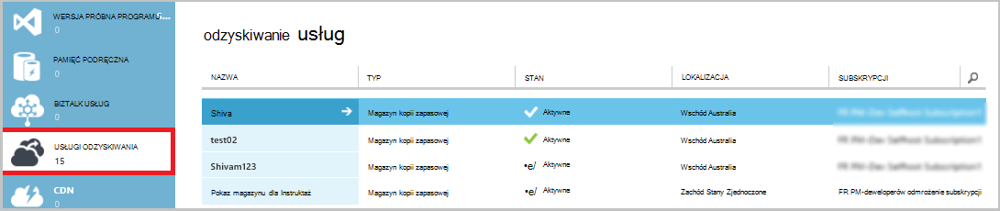
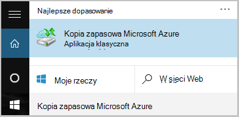
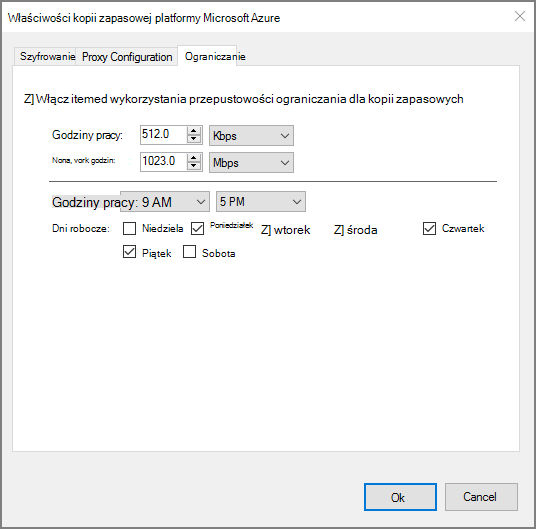

<properties
    pageTitle="Kopii zapasowych serwera Windows lub klienta przy użyciu modelu Klasyczny wdrożenia Azure | Microsoft Azure"
    description="Kopia zapasowa serwerów z systemem Windows lub klientom Azure, tworzenie kopii zapasowej magazynu, pobierając poświadczeń, instalowania agenta kopii zapasowej i kończenie początkowej wykonywania kopii zapasowej plików i folderów."
    services="backup"
    documentationCenter=""
    authors="markgalioto"
    manager="cfreeman"
    editor=""
    keywords="kopii zapasowej magazynu; wykonywanie kopii zapasowej systemu Windows server; Tworzenie kopii zapasowych;"/>

<tags
    ms.service="backup"
    ms.workload="storage-backup-recovery"
    ms.tgt_pltfrm="na"
    ms.devlang="na"
    ms.topic="article"
    ms.date="08/08/2016"
    ms.author="jimpark; trinadhk; markgal"/>

# Wykonywanie kopii zapasowej systemu Windows server lub klienta przy użyciu modelu Klasyczny wdrożenia Azure

> [AZURE.SELECTOR]
- [Klasyczny portalu](backup-configure-vault-classic.md)
- [Azure portal](backup-configure-vault.md)

W tym artykule opisano procedury, które są potrzebne do przygotowania środowiska i z powrotem w systemie Windows server (lub klienta) Azure. Obejmuje zagadnienia związane z wdrożeniem do tworzenia kopii zapasowych. Jeśli interesujesz podczas próby Azure kopii zapasowej po raz pierwszy, w tym artykule szybko przeprowadzi Cię przez proces.

>[AZURE.IMPORTANT] Azure występują dwa modele rozmieszczania służące do tworzenia i pracy z zasobami: Menedżer zasobów i klasyczny. W tym artykule opisano, jak przy użyciu modelu Klasyczny wdrożenia. Firma Microsoft zaleca się, że większość nowych wdrożeń za pomocą modelu Menedżera zasobów.

## Przed rozpoczęciem
Do tworzenia kopii zapasowych serwera lub klienta Azure, potrzebne jest konto Azure. Jeśli nie masz, możesz utworzyć [bezpłatne konto](https://azure.microsoft.com/free/) na kilka minut.

## Krok 1: Tworzenie kopii zapasowej magazynu
Aby utworzyć kopię zapasową plików i folderów z serwera lub klienta, należy utworzyć kopii zapasowej magazynu w danym regionie geograficznym miejsce, w którym mają być przechowywane dane.

### Tworzenie kopii zapasowej magazynu

1. Zaloguj się do [portalu klasyczny](https://manage.windowsazure.com/).

2. Kliknij przycisk **Nowy** > **Usług danych** > **Usługi odzyskiwania** > **Magazynu kopii zapasowej**, a następnie wybierz pozycję **Szybkie tworzenie**.

3. Parametr **Name** Wprowadź przyjazną nazwę kopii zapasowej magazynu. Wpisz nazwę, która zawiera od 2 do 50 znaków. Musi rozpoczynać się od litery i mogą zawierać tylko litery, cyfry i łączniki. Ta nazwa musi być unikatowa dla każdej subskrypcji.

4. Parametr **Region** wybierz regionu geograficznego dla magazynu kopii zapasowej. Ta opcja określa regionu geograficznego wysyłania danych kopii zapasowych. Wybierając regionu geograficznego, który jest zbliżony do lokalizacji, można zmniejszyć opóźnień sieci podczas wykonywania kopii zapasowej Azure.

5. Kliknij przycisk **Utwórz magazynu**.

    

    Może minąć trochę czasu, zanim magazynu kopii zapasowej do utworzenia. Aby sprawdzić stan, monitorować powiadomień w dolnej części portalu klasyczny.

    Po utworzeniu kopii zapasowej magazynu pojawi się komunikat z informacją, że magazyn został pomyślnie utworzony. Pojawi się również **aktywne** na liście **Usługi odzyskiwania** zasobów.

    

4. Wybierz opcję nadmiarowości miejsca do magazynowania, wykonując kroki opisane w tym miejscu.

    >[AZURE.IMPORTANT] Najlepiej do identyfikowania opcjach nadmiarowości miejsca do magazynowania jest bezpośrednio po utworzeniu magazynu i przed ani komputerów są rejestrowane do magazyn. Po zarejestrowaniu elementu do magazyn opcja nadmiarowości magazynowania jest zablokowane i nie można modyfikować.

    Jeśli korzystasz z platformy Azure jako punkt końcowy podstawowego magazynu kopii zapasowej (na przykład, kopia zapasowa Azure z systemu Windows server), należy rozważyć, czy opcja [magazynowania zbędne geo](../storage/storage-redundancy.md#geo-redundant-storage) pobrania (ustawienie domyślne).

    Jeśli korzystasz z platformy Azure jako punkt końcowy wyższego magazynu kopii zapasowej (na przykład używasz System Center Data Protection Manager do przechowywania kopii zapasowej lokalnej lokalnego i korzystania z platformy Azure w celu przechowywania długoterminowe musi), warto wybrać [lokalnie zbędne miejsca do magazynowania](../storage/storage-redundancy.md#locally-redundant-storage). Spowoduje to wyświetlenie szczegółów koszt przechowywania danych w Azure, zapewniając niższy poziom ważności dla danych, które mogą być akceptowane wyższego kopii.

    **Aby wybrać opcję nadmiarowości miejsca do magazynowania:**

    . Kliknij właśnie utworzony magazyn.

    b. Na stronie Szybkie uruchamianie wybierz pozycję **Konfiguruj**.

    

    c. Wybierz opcję nadmiarowości odpowiednie miejsca do magazynowania.

    Jeśli wybierzesz **Lokalnie zbędne**, należy kliknij przycisk **Zapisz** (ponieważ **Nadmiarowe Geo** jest domyślna opcja).

    d. W okienku nawigacji po lewej stronie kliknij **Usługi odzyskiwania** , aby powrócić do listy zasobów dla usług odzyskiwania.

## Krok 2: Pobieranie pliku magazynu poświadczeń
Na komputerze lokalnym wymaga uwierzytelniania z kopii zapasowej magazynu przed jego tworzenia kopii zapasowych danych Azure. Uwierzytelnianie uzyskuje się za pośrednictwem *magazynu poświadczeń*. Plik magazynu poświadczeń są pobierane za pośrednictwem bezpiecznego kanału w portalu klasyczny. Klucz prywatny certyfikatu nie zmieniają się w portalu lub usługi.

Dowiedz się, jak [przy użyciu magazynu poświadczeń w celu uwierzytelnienia z usługą kopii zapasowej](backup-introduction-to-azure-backup.md#what-is-the-vault-credential-file).

### Aby pobrać plik poświadczeń magazynu na komputerze lokalnym

1. W okienku nawigacji po lewej stronie kliknij **Usługi odzyskiwania**, a następnie wybierz pozycję magazynu kopii zapasowej, utworzone przez Ciebie.

    

2.  Na stronie Szybkie uruchamianie kliknij pozycję **Pobierz magazynu poświadczeń**.

    Klasyczny portalu generuje poświadczenie magazynu przy użyciu kombinacji nazwy magazynu i bieżącą datę. Plik poświadczeń magazynu jest używana tylko podczas przepływ pracy rejestracji i Dezaktualizuje się po 48 godzin.

    Plik magazynu poświadczeń można pobrać z portalu.

3. Kliknij przycisk **Zapisz** o pobranie pliku magazynu poświadczeń w folderze pobrane lokalnego konta. Możesz również wybrać **Zapisywanie jako** z menu **Zapisz** , aby określić lokalizację pliku magazynu poświadczeń.

    >[AZURE.NOTE] Upewnij się, że plik poświadczeń magazynu jest zapisywany w lokalizacji dostępnej z komputera. Jeśli jest on przechowywany w udziale lub na serwerze wiadomości funkcję blokowania plików, sprawdź, czy masz uprawnienia do nich dostęp.

## Krok 3: Pobieranie, instalowanie i zarejestrować agenta kopii zapasowej
Po utworzeniu kopii zapasowej magazynu i pobrać plik magazynu poświadczeń, agenta musi być zainstalowany na wszystkich komputerach z systemu Windows.

### Aby pobrać, zainstalować i zarejestrować agenta

1. Kliknij pozycję **Usługi odzyskiwania**, a następnie wybierz magazynu kopii zapasowej, który chcesz zarejestrować na serwerze.

2. Na stronie Szybkie uruchamianie kliknij agenta **Agent dla systemu Windows Server lub System Center Data Protection Manager lub klienta w systemie Windows**. Następnie kliknij przycisk **Zapisz**.

    

3. Po pobraniu pliku MARSagentinstaller.exe, kliknij polecenie **Uruchom** (lub kliknij dwukrotnie **MARSAgentInstaller.exe** z miejsca zapisania).

4. Wybierz folder instalacji i folderu pamięci podręcznej, które są wymagane dla agenta, a następnie kliknij przycisk **Dalej**. Lokalizacja pamięci podręcznej, zadanej musi mieć wolnego miejsca równej co najmniej 5 procent danych kopii zapasowej.

5. Możesz nawiązać połączenie z Internetem za pośrednictwem domyślne ustawienia serwera proxy.          Jeśli korzystasz z serwera proxy do łączenia się z Internetem, na stronie konfiguracji serwera Proxy, zaznacz pole wyboru **Użyj ustawień serwera proxy Niestandardowy** , a następnie wprowadź szczegóły serwera proxy. Jeśli korzystasz z serwerem proxy z uwierzytelnianiem, wprowadź szczegóły nazwę i hasło użytkownika, a następnie kliknij przycisk **Dalej**.

7. Kliknij przycisk **Zainstaluj** , aby rozpocząć instalację agenta. Agent kopii zapasowej jest instalowany program .NET Framework 4,5 i środowiska Windows PowerShell (jeśli jeszcze nie jest zainstalowany) w celu ukończenia instalacji.

8. Po zainstalowaniu agenta kliknij przycisk **Przejdź do rejestracji** , aby kontynuować przepływu pracy.

9. Na stronie identyfikacji magazynu przejdź do i wybierz wcześniej pobranego pliku poświadczeń magazynu.

    Plik poświadczeń magazynu jest prawidłowy tylko 48 godzin po pobraniu z portalu. Jeśli w przypadku wystąpienia błędu na tej strony (na przykład "magazynu poświadczeń które wygasła podany plik"), zaloguj się do portalu i ponownie pobrać plik magazynu poświadczeń.

    Upewnij się, że plik magazynu poświadczeń jest dostępna w lokalizacji dostępnej dla mogą uzyskiwać dostęp do aplikacji do konfigurowania. Jeśli wystąpią błędy związane z programu access, skopiuj plik magazynu poświadczeń do lokalizacji tymczasowej na tym samym komputerze i spróbuj jeszcze raz.

    W przypadku napotkania błędu poświadczeń magazynu, takie jak "nieprawidłowe magazynu poświadczeń dostarczonych" plik jest uszkodzony lub czy nie masz najnowsze poświadczeń skojarzonych z Usługa odzyskiwania. Powtórz operację po pobraniu nowego pliku magazynu poświadczeń w portalu. Ten błąd może również wystąpić, jeśli użytkownik kliknie opcję **pobierania magazynu poświadczeń** w szybkie naciśnięcie. W tym przypadku tylko ostatni plik poświadczeń magazynu jest prawidłowy.

9. Na stronie ustawienia szyfrowania możesz wygenerować hasło lub podaj hasło (minimum 16 znaków). Pamiętaj zapisać hasło w bezpiecznym miejscu.

10. Kliknij przycisk **Zakończ**. Kreator serwera zarejestrować rejestruje serwer z kopią zapasową.

    >[AZURE.WARNING] Jeśli zapomnienia lub utraty hasła, Microsoft nie może pomóc w odzyskiwanie danych kopii zapasowej. Jesteś właścicielem hasło szyfrowania, a nie ma wgląd hasło, którego używasz. Zapisz plik w bezpiecznym miejscu, ponieważ będzie wymagane podczas operacji odzyskiwania.

11. Po ustawieniu klucza szyfrowania pozostaw zaznaczone pole wyboru **Uruchom program Microsoft Azure odzyskiwania usług Agent** , a następnie kliknij przycisk **Zamknij**.

## Krok 4: Wykonywanie wstępnej kopii zapasowej

Wstępnej kopii zapasowej obejmuje dwa zadania kluczowe:

- Tworzenie harmonogramu wykonywania kopii zapasowych
- Wykonywanie kopii zapasowej plików i folderów po raz pierwszy

Po ukończeniu wstępnej kopii zapasowej kopii zapasowej zasad umożliwia utworzenie kopii zapasowej punktów, które można użyć, jeśli chcesz odzyskać dane. Zasady kopii zapasowej powinien się tym zająć na podstawie zdefiniowanego harmonogramu.

### Aby zaplanować wykonywanie kopii zapasowej

1. Otwórz agenta kopia zapasowa Microsoft Azure. (Zostanie otwarty automatycznie Jeśli **Uruchamianie programu Microsoft Azure odzyskiwania usług Agent** pole wyboru po zamknięciu Kreatora serwera zarejestrować.) Można znaleźć go, wyszukując **Kopia zapasowa Microsoft Azure**komputera.

    

2. W agenta kopii zapasowej kliknij pozycję **Harmonogram tworzenia kopii zapasowych**.

    

3. Na stronie wprowadzenie Kreatora harmonogramu kopii zapasowej kliknij przycisk **Dalej**.

4. Na wybieranie elementów do strony kopii zapasowej kliknij przycisk **Dodaj elementy**.

5. Zaznacz pliki i foldery, które mają być wykonywanie kopii zapasowej, a następnie kliknij **rekord**.

6. Kliknij przycisk **Dalej**.

7. Na stronie **Określanie harmonogramu wykonywania kopii zapasowych** określ **Harmonogram kopii zapasowej** , a następnie kliknij przycisk **Dalej**.

    Można zaplanować dziennego (maksymalna szybkość trzy razy dziennie) lub tygodniowy kopie zapasowe.

    

    >[AZURE.NOTE] Aby uzyskać więcej informacji na temat określania Harmonogram kopii zapasowej zobacz artykuł [Używanie Azure zapasowej aby zamienić infrastruktury taśmą](backup-azure-backup-cloud-as-tape.md).

8. Na stronie **Wybierz zasady przechowywania** wybierz **Zasady przechowywania** kopii zapasowej.

    Zasady przechowywania określa czas, w której będzie przechowywana kopia zapasowa. Zamiast po prostu określenie "prostym zasad" dla wszystkich punktów kopii zapasowej, można określić, podczas tworzenia kopii zapasowej występuje na podstawie zasad przechowywania różnych. Możesz zmienić zasady przechowywania dzienny, tygodniowy, miesięczny i roczny stosownie do potrzeb.

9. Na stronie wybierz typ kopii zapasowej początkowej wybierz początkowy typ kopii zapasowej. Pozostaw wybraną opcję **automatycznie przez sieć** zaznaczone, a następnie kliknij przycisk **Dalej**.

    Użytkownik może wykonywać kopie zapasowe automatycznie przez sieć lub kopię zapasową można wykonywać w trybie offline. W dalszej części tego artykułu opisuje proces automatycznego tworzenia kopii zapasowych. Jeśli wolisz zrobić kopii zapasowej offline, przeczytaj artykuł [Offline kopii zapasowych przepływu pracy w kopii zapasowej Azure](backup-azure-backup-import-export.md) Aby uzyskać dodatkowe informacje.

10. Na stronie potwierdzenia zapoznaj się z informacjami, a następnie kliknij przycisk **Zakończ**.

11. Po zakończeniu pracy Kreator tworzenia kopii zapasowej harmonogramu, kliknij przycisk **Zamknij**.

### Włącz ograniczanie przepustowości sieci (opcjonalnie)

Agent kopii zapasowej znajdują się ograniczanie przepustowości sieci. Ograniczanie pozwala kontrolować sposób przepustowość sieci jest używana podczas przesyłania danych. Tego formantu może być przydatne, jeśli chcesz wykonać kopię zapasową danych podczas godziny pracy, ale nie chcesz wykonywania kopii zapasowej zakłócać pozostały ruch internetowy. Ograniczanie dotyczy wykonywanie kopii zapasowych i przywracanie działania.

**Aby włączyć ograniczanie przepustowości sieci**

1. W agenta kopii zapasowej kliknij pozycję **Zmień właściwości**.

    

2. Na karcie **Throttling** zaznacz pole wyboru **Włącz wykorzystania przepustowości internetowej ograniczania dla kopii zapasowych** .

    

3. Po włączeniu ograniczania określić dozwolone przepustowość przesyłania danych z kopii zapasowej podczas **godzin pracy** i **godzin pracy nie**.

    Wartości przepustowości rozpoczynały 512 połączenie internetowe o szybkości (KB/s) i można przejść do 1,023 megabajtów na sekundę (MB/s). Można także określić rozpoczęcia i zakończenia dla **godzin pracy**i dni roboczych rozważenia są dni tygodnia. Godziny poza wyznaczonych pracy, które są traktowane jako godziny wartością pracy godziny.

4. Kliknij **przycisk OK**.

### Aby utworzyć kopię zapasową teraz

1. W agenta kopii zapasowej kliknij przycisk **Wykonaj teraz kopię zapasową** do ukończenia początkowego obsługiwanie sieci.

    

2. Na stronie potwierdzenia Przejrzyj ustawienia używane ponownie się teraz kreatora do tworzenia kopii zapasowych na komputerze. Następnie kliknij pozycję **Kopia zapasowa**.

3. Kliknij przycisk **Zamknij** , aby zamknąć kreatora. Jeśli to zrobisz przed zakończeniem wykonywania kopii zapasowej, Kreator będzie działać w tle.

Po wykonaniu początkowej kopii zapasowej, stan **zadania wykonane** jest wyświetlany w konsoli kopii zapasowej.

## Następne kroki
- Utwórz [bezpłatne konto Azure](https://azure.microsoft.com/free/).

Aby uzyskać dodatkowe informacje na temat tworzenia kopii zapasowych maszyny wirtualne lub innych obciążeń pracą zobacz:

- [Wykonywanie kopii zapasowej IaaS maszyny wirtualne](backup-azure-vms-prepare.md)
- [Wykonywanie kopii zapasowej obciążenia Azure z serwerem kopii zapasowej Microsoft Azure](backup-azure-microsoft-azure-backup.md)
- [Wykonywanie kopii zapasowej obciążenia Azure z DPM](backup-azure-dpm-introduction.md)
