<properties
    pageTitle="Kopii zapasowych serwera Windows lub klienta Azure z kopią zapasową Azure przy użyciu modelu wdrożenia Menedżera zasobów | Microsoft Azure"
    description="Kopia zapasowa serwerów z systemem Windows lub klientom Azure, tworzenie kopii zapasowej magazynu, pobierając poświadczeń, instalowania agenta kopii zapasowej i kończenie początkowej wykonywania kopii zapasowej plików i folderów."
    services="backup"
    documentationCenter=""
    authors="markgalioto"
    manager="cfreeman"
    editor=""
    keywords="kopii zapasowej magazynu; wykonywanie kopii zapasowej systemu Windows server; Tworzenie kopii zapasowych;"/>

<tags
    ms.service="backup"
    ms.workload="storage-backup-recovery"
    ms.tgt_pltfrm="na"
    ms.devlang="na"
    ms.topic="article"
    ms.date="08/10/2016"
    ms.author="jimpark; trinadhk; markgal"/>

# Wykonywanie kopii zapasowej systemu Windows Server lub klienta Azure przy użyciu modelu wdrożenia Menedżera zasobów

> [AZURE.SELECTOR]
- [Azure portal](backup-configure-vault.md)
- [Klasyczny portalu](backup-configure-vault-classic.md)

W tym artykule wyjaśniono, jak utworzyć kopię zapasową systemu Windows Server (lub klienta w systemie Windows) plików i folderów Azure z kopią zapasową Azure przy użyciu modelu wdrożenia Menedżera zasobów.

[AZURE.INCLUDE [learn-about-deployment-models](../../includes/backup-deployment-models.md)]

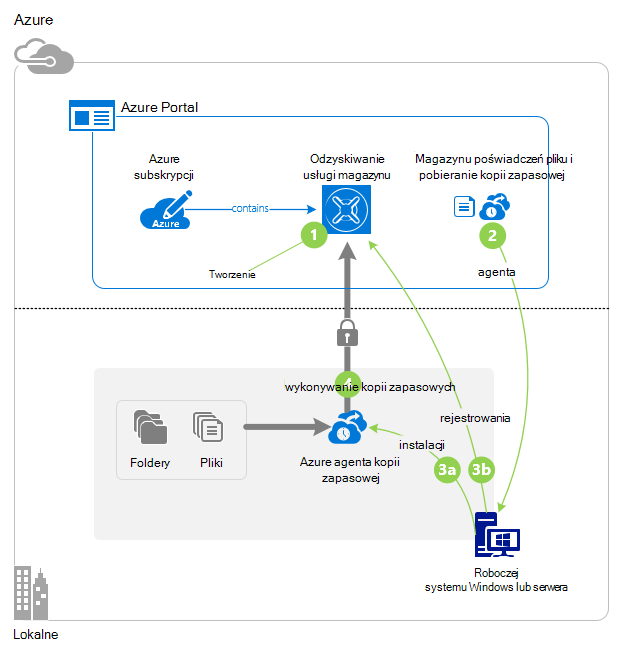

## Przed rozpoczęciem
Do tworzenia kopii zapasowych serwera lub klienta Azure, potrzebne jest konto Azure. Jeśli nie masz, możesz utworzyć [bezpłatne konto](https://azure.microsoft.com/free/) na kilka minut.

## Krok 1: Tworzenie magazynu usługi odzyskiwania

Magazynu usługi odzyskiwania jest jednostką przechowującego kopii zapasowych i odzyskiwania punktów, które możesz utworzyć w czasie. Magazynu usługi odzyskiwania zawiera również kopii zapasowej zasad zastosowane do chronionych plików i folderów. Po utworzeniu magazynu usługi odzyskiwania możesz także zaznaczyć opcję nadmiarowości odpowiednie miejsca do magazynowania.

### Aby utworzyć magazynu usługi odzyskiwania

1. Jeśli możesz jeszcze tego nie zrobiono, zaloguj się do [Azure Portal](https://portal.azure.com/) , korzystając ze swojej subskrypcji Azure.

2. W menu Centrum kliknij przycisk **Przeglądaj** , a następnie na liście zasobów, wpisz **Usługi odzyskiwania**. Po rozpoczęciu wpisywania, będzie filtrować listę według dane wejściowe. Kliknij pozycję **magazynów usługi odzyskiwania**.

    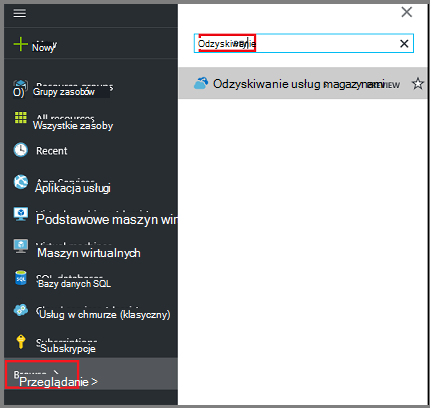  

    Zostanie wyświetlona lista magazynów usługi odzyskiwania.

3. W menu **usługi odzyskiwania magazynów** kliknij przycisk **Dodaj**.

    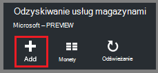

    Zostanie wyświetlona karta magazynu usługi odzyskiwania monituje o podanie **nazwy**, **subskrypcji**, **Grupa zasobów**i **lokalizacji**.

    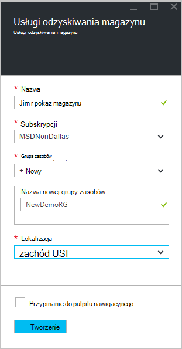

4. W polu **Nazwa**wpisz przyjazną nazwę identyfikującą magazyn. Nazwa musi być unikatowa dla Azure subskrypcji. Wpisz nazwę, która zawiera od 2 do 50 znaków. Musi rozpoczynać się od litery i mogą zawierać tylko litery, cyfry i łączniki.

5. Kliknij **subskrypcję** , aby wyświetlić listę dostępnych subskrypcji. Jeśli nie masz pewności, jakie subskrypcję, należy użyć wartości domyślnej (lub sugerowane) subskrypcji. Będzie wiele opcji do wyboru tylko wtedy, gdy konto organizacji jest skojarzony z wiele subskrypcji Azure.

6. Kliknij pozycję **Grupa zasobów** , aby wyświetlić listę dostępnych grup zasobów, lub kliknij przycisk **Nowy** , aby utworzyć nową grupę zasobów. Aby uzyskać pełne informacje dotyczące grup zasobów zobacz [Omówienie Menedżera zasobów Azure](../azure-resource-manager/resource-group-overview.md)

7. Kliknij **miejsce** , aby wybrać regionu geograficznego dla magazyn. Ta opcja określa regionu geograficznego wysyłania danych kopii zapasowych. Wybierając regionu geograficznego, który jest zbliżony do lokalizacji, można zmniejszyć opóźnień sieci podczas wykonywania kopii zapasowej Azure.

8. Kliknij przycisk **Utwórz**. Może upłynąć trochę czasu, zanim magazynu usługi odzyskiwania ma zostać utworzony. Monitorowanie powiadomienia o stanie w górnym obszarze po prawej stronie w portalu. Po utworzeniu z magazynu, należy otworzyć w portalu. Jeśli nie widzisz swojego magazynu wyświetlane po jego zakończeniu, kliknij przycisk **Odśwież**. Po odświeżeniu listy kliknij nazwę magazyn.

### Aby określić nadmiarowości miejsca do magazynowania
Po utworzeniu magazynu usługi odzyskiwania można określić, jak replikowane miejsca do magazynowania.

1. Karta **Ustawienia** , który jest uruchamiany automatycznie, z pulpitu nawigacyjnego magazynu, kliknij **Infrastruktury kopii zapasowej**.

2. W karta infrastruktury kopii zapasowej kliknij pozycję **Konfiguracji kopii zapasowej** , aby wyświetlić **typ replikacji miejsca do magazynowania**.

    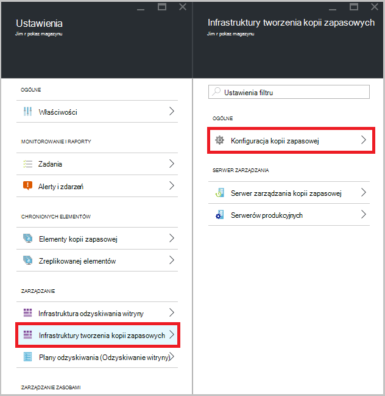

3. Wybierz opcję replikacji miejsca do magazynowania dla swojego magazynu.

    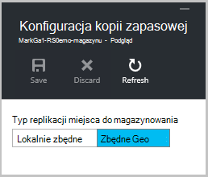

    Domyślnie do magazynu ma zbędne geo miejsca do magazynowania. Jeśli korzystasz z platformy Azure jako punkt końcowy podstawowego magazynu kopii zapasowej, nadal zbędne geo magazynu. Jeśli korzystasz z platformy Azure jako punkt końcowy inne niż podstawowe magazynu kopii zapasowej, a następnie wybierz pozycję lokalnie zbędne miejscem do magazynowania, które będzie zajmowała przechowywania danych w Azure. Przeczytaj więcej o tym [zbędne geo](../storage/storage-redundancy.md#geo-redundant-storage) i [lokalnie zbędne](../storage/storage-redundancy.md#locally-redundant-storage) opcje przechowywania w tym [Omówienie](../storage/storage-redundancy.md).

    Po wybraniu opcji miejsca do magazynowania dla swojego magazynu, możesz przystąpić do skojarzyć magazyn plików i folderów.

Teraz, gdy masz utworzony magazynu, należy przygotować infrastruktury do tworzenia kopii zapasowych plików i folderów, pobierania i instalowania agenta firmy Microsoft Azure odzyskiwania usług, pobierając magazynu poświadczeń i zarejestrować agenta usługi Magazyn za pomocą tych poświadczeń.

## Krok 2 — pliki do pobrania

>[AZURE.NOTE] Włączanie kopii zapasowej za pośrednictwem portalu Azure jest już wkrótce. W tej chwili używasz agenta usługi Microsoft Azure odzyskiwania lokalnego do tworzenia kopii zapasowych plików i folderów.

1. Kliknij przycisk **Ustawienia** na pulpicie nawigacyjnym magazynu usługi odzyskiwania.

    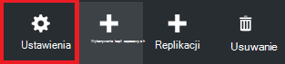

2. Kliknij pozycję **wprowadzenie > Kopia zapasowa** na karta Ustawienia.

    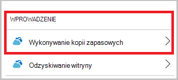

3. Kliknij pozycję **Kopia zapasowa cel** na karta kopia zapasowa.

    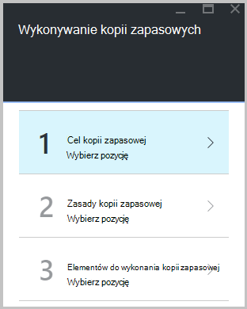

4. Wybierz pozycję **lokalnego** z gdzie jest z pracą działa? menu.

5. Zaznacz **pliki i foldery** z czym ma zawierać kopia zapasowa? menu i kliknij **przycisk OK**.

#### Pobierz agenta usługi odzyskiwania

1. Kliknij **Pobierz agenta systemu Windows Server lub klienta w systemie Windows** karta **Przygotowywanie infrastruktury** .

    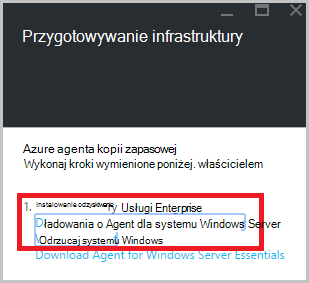

2. W oknie podręcznym plik do pobrania, kliknij przycisk **Zapisz** . Domyślnie plik **MARSagentinstaller.exe** jest zapisywany do folderu pobierania.

#### Pobierz magazynu poświadczeń

1. Kliknij pozycję **Pobierz > Zapisz** na przygotowanie karta infrastruktury.

    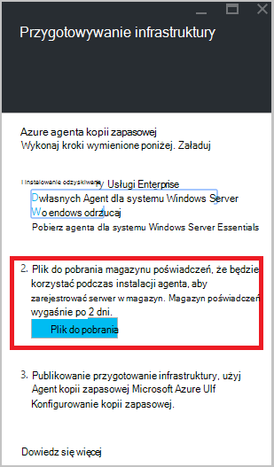

## Krok 3 — Zainstaluj i zarejestrować agenta

1. Znajdź i kliknij dwukrotnie **MARSagentinstaller.exe** z folderu pobierania (lub innej lokalizacji zapisanego).

2. Wykonywanie Kreatora konfiguracji agenta usługi Microsoft Azure odzyskiwania. Aby zakończyć działanie kreatora, należy:

    - Wybierz lokalizację dla instalacji i folderu pamięci podręcznej.
    - Podaj informacje o serwerze serwer proxy Jeśli korzystasz z serwera proxy do łączenia się z Internetem.
    - Szczegółowo użytkownika nazwę i hasło, jeśli korzystasz z serwerem proxy z uwierzytelnianiem.
    - Poświadczenia pobrany magazynu
    - Zapisz hasło szyfrowania w bezpiecznym miejscu.

    >[AZURE.NOTE] Jeśli zapomnienia lub utraty hasła, Microsoft nie można odzyskać danych kopii zapasowej. Zapisz plik w bezpiecznym miejscu. Wymagane jest przywrócić z kopii zapasowej.

Agent został zainstalowany i komputer jest zarejestrowany do magazyn. Możesz już przystąpić do konfigurowania i Planowanie kopii zapasowej.

### Potwierdzanie instalacji

Aby potwierdzić, że agent został zainstalowany i zarejestrowany poprawnie, możesz sprawdzić dla elementów, które kopii zapasowej w sekcji **Serwer produkcji** portalu zarządzania. Aby to zrobić:

1. Zaloguj się do [Azure Portal](https://portal.azure.com/) , korzystając ze swojej subskrypcji Azure.

2. W menu Centrum kliknij przycisk **Przeglądaj** , a następnie na liście zasobów, wpisz **Usługi odzyskiwania**. Po rozpoczęciu wpisywania, będzie filtrować listę według dane wejściowe. Kliknij pozycję **magazynów usługi odzyskiwania**.

      

    Zostanie wyświetlona lista magazynów usługi odzyskiwania.

2. Wybierz nazwę utworzonej magazyn.

    Zostanie wyświetlona karta Pulpit nawigacyjny magazynu usługi odzyskiwania.

    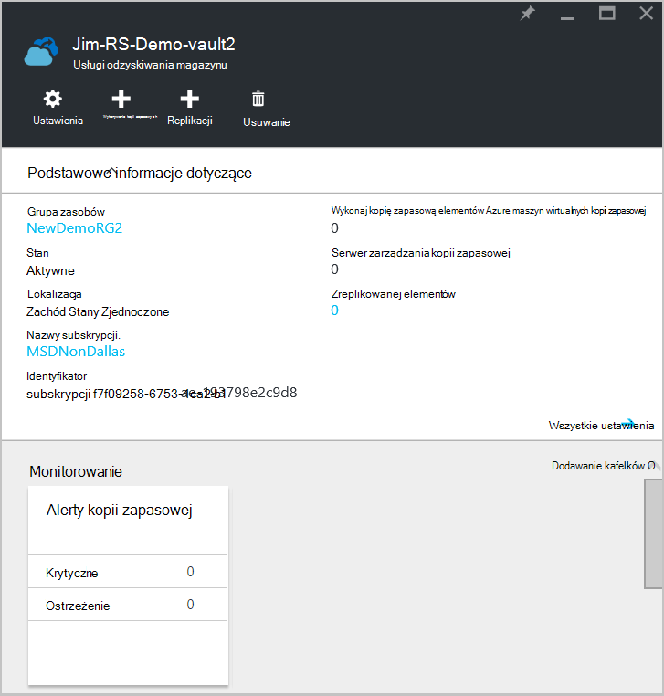  

3. Kliknij przycisk **Ustawienia** w górnej części strony.

4. Kliknij pozycję **Kopia zapasowa infrastruktury > serwerów produkcyjnych**.

    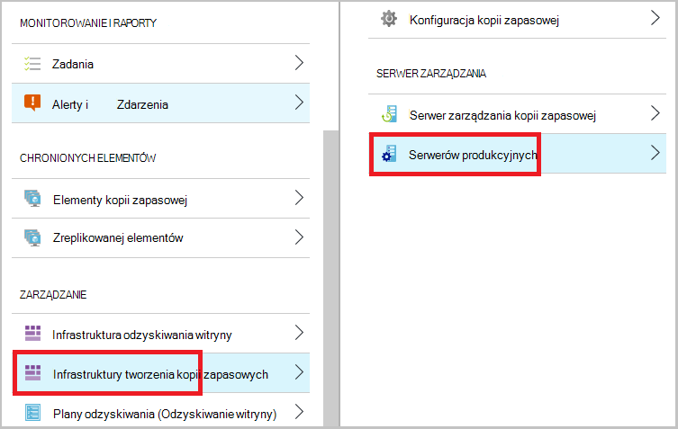

Jeśli zostanie wyświetlony na liście serwerów, masz potwierdzenia, że zainstalowano i poprawnie zarejestrowany agent.

## Krok 4: Wykonywanie wstępnej kopii zapasowej

Wstępnej kopii zapasowej obejmuje dwa zadania kluczowe:

- Planowanie tworzenia kopii zapasowej
- Wykonywanie kopii zapasowej plików i folderów po raz pierwszy

Aby wykonać wstępnej kopii zapasowej, należy użyć agenta kopii zapasowej Microsoft Azure.

### Aby zaplanować wykonywanie kopii zapasowej

1. Otwórz agenta kopia zapasowa Microsoft Azure. Można znaleźć go, wyszukując **Kopia zapasowa Microsoft Azure**komputera.

    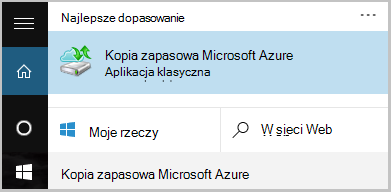

2. W agenta kopii zapasowej kliknij pozycję **Harmonogram tworzenia kopii zapasowych**.

    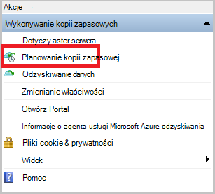

3. Na stronie wprowadzenie Kreatora harmonogramu kopii zapasowej kliknij przycisk **Dalej**.

4. Na wybieranie elementów do strony kopii zapasowej kliknij przycisk **Dodaj elementy**.

5. Zaznacz pliki i foldery, które mają być wykonywanie kopii zapasowej, a następnie kliknij **rekord**.

6. Kliknij przycisk **Dalej**.

7. Na stronie **Określanie harmonogramu wykonywania kopii zapasowych** określ **Harmonogram kopii zapasowej** , a następnie kliknij przycisk **Dalej**.

    Można zaplanować dziennego (maksymalna szybkość trzy razy dziennie) lub tygodniowy kopie zapasowe.

    

    >[AZURE.NOTE] Aby uzyskać więcej informacji na temat określania Harmonogram kopii zapasowej zobacz artykuł [Używanie Azure zapasowej aby zamienić infrastruktury taśmą](backup-azure-backup-cloud-as-tape.md).

8. Na stronie **Wybierz zasady przechowywania** wybierz **Zasady przechowywania** kopii zapasowej.

    Zasady przechowywania określa czas, w której będzie przechowywana kopia zapasowa. Zamiast po prostu określenie "prostym zasad" dla wszystkich punktów kopii zapasowej, można określić, podczas tworzenia kopii zapasowej występuje na podstawie zasad przechowywania różnych. Możesz zmienić zasady przechowywania dzienny, tygodniowy, miesięczny i roczny stosownie do potrzeb.

9. Na stronie wybierz typ kopii zapasowej początkowej wybierz początkowy typ kopii zapasowej. Pozostaw wybraną opcję **automatycznie przez sieć** zaznaczone, a następnie kliknij przycisk **Dalej**.

    Użytkownik może wykonywać kopie zapasowe automatycznie przez sieć lub kopię zapasową można wykonywać w trybie offline. W dalszej części tego artykułu opisuje proces automatycznego tworzenia kopii zapasowych. Jeśli wolisz zrobić kopii zapasowej offline, przeczytaj artykuł [Offline kopii zapasowych przepływu pracy w kopii zapasowej Azure](backup-azure-backup-import-export.md) Aby uzyskać dodatkowe informacje.

10. Na stronie potwierdzenia zapoznaj się z informacjami, a następnie kliknij przycisk **Zakończ**.

11. Po zakończeniu pracy Kreator tworzenia kopii zapasowej harmonogramu, kliknij przycisk **Zamknij**.

### Włącz ograniczanie przepustowości sieci (opcjonalnie)

Agent kopii zapasowej znajdują się ograniczanie przepustowości sieci. Ograniczanie pozwala kontrolować sposób przepustowość sieci jest używana podczas przesyłania danych. Tego formantu może być przydatne, jeśli chcesz wykonać kopię zapasową danych podczas godziny pracy, ale nie chcesz wykonywania kopii zapasowej zakłócać pozostały ruch internetowy. Ograniczanie dotyczy wykonywanie kopii zapasowych i przywracanie działania.

>[AZURE.NOTE] Ograniczanie przepustowości sieci nie jest dostępna w systemie Windows Server 2008 R2 z dodatkiem SP1, Windows Server 2008 z dodatkiem SP2 lub Windows 7 (z dodatków service pack). Sieć kopii zapasowej Azure funkcji ograniczania uczestniczy jakości z usług na lokalny system operacyjny. Chociaż Kopia zapasowa Azure chronić tych systemów operacyjnych, wersji QoS dostępne na tych platformach nie działa z kopii zapasowej Azure ograniczanie przepustowości sieci. Ograniczanie przepustowości sieci można używać na wszystkie inne [obsługiwane systemy operacyjne](backup-azure-backup-faq.md#installation-amp-configuration).

**Aby włączyć ograniczanie przepustowości sieci**

1. W agenta kopii zapasowej kliknij pozycję **Zmień właściwości**.

    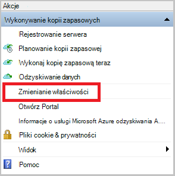

2. Na karcie **Throttling** zaznacz pole wyboru **Włącz wykorzystania przepustowości internetowej ograniczania dla kopii zapasowych** .

    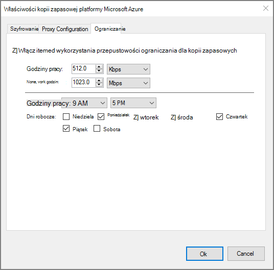

3. Po włączeniu ograniczania określić dozwolone przepustowość przesyłania danych z kopii zapasowej podczas **godzin pracy** i **godzin pracy nie**.

    Wartości przepustowości rozpoczynały 512 połączenie internetowe o szybkości (KB/s) i można przejść do 1,023 megabajtów na sekundę (MB/s). Można także określić rozpoczęcia i zakończenia dla **godzin pracy**i dni roboczych rozważenia są dni tygodnia. Godziny poza wyznaczonych pracy, które są traktowane jako godziny wartością pracy godziny.

4. Kliknij **przycisk OK**.

### Aby utworzyć kopię zapasową plików i folderów po raz pierwszy

1. W agenta kopii zapasowej kliknij przycisk **Wykonaj teraz kopię zapasową** do ukończenia początkowego obsługiwanie sieci.

    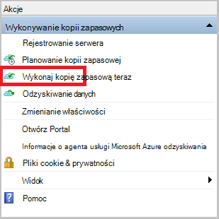

2. Na stronie potwierdzenia Przejrzyj ustawienia używane ponownie się teraz kreatora do tworzenia kopii zapasowych na komputerze. Następnie kliknij pozycję **Kopia zapasowa**.

3. Kliknij przycisk **Zamknij** , aby zamknąć kreatora. Jeśli to zrobisz przed zakończeniem wykonywania kopii zapasowej, Kreator będzie działać w tle.

Po wykonaniu początkowej kopii zapasowej, stan **zadania wykonane** jest wyświetlany w konsoli kopii zapasowej.

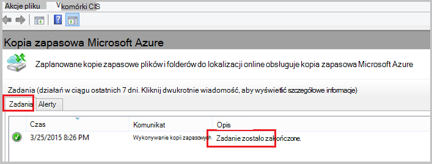

## Masz pytania?
Jeśli masz pytania lub w przypadku dowolnej funkcji, którą chcesz wyświetlić dołączone, [Prześlij opinię](http://aka.ms/azurebackup_feedback).

## Następne kroki
Aby uzyskać dodatkowe informacje na temat tworzenia kopii zapasowych maszyny wirtualne lub innych obciążeń pracą zobacz:

- Teraz, gdy zostały utworzone kopie zapasowe plików i folderów, możesz [zarządzać magazynów i serwery](backup-azure-manage-windows-server.md).
- Jeśli chcesz przywrócić kopię zapasową, za pomocą tego artykułu, aby [przywrócić pliki do komputera systemu Windows](backup-azure-restore-windows-server.md).
