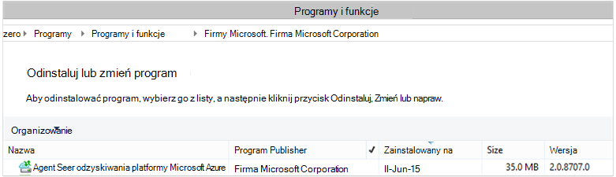

<properties
    pageTitle="Azure kopia zapasowa — wdrażanie i zarządzanie nią powrót do DPM przy użyciu programu PowerShell | Microsoft Azure"
    description="Dowiedz się, jak wdrażać i zarządzanie kopii zapasowej Azure dla danych Protection Manager (DPM) przy użyciu programu PowerShell"
    services="backup"
    documentationCenter=""
    authors="NKolli1"
    manager="shreeshd"
    editor=""/>

<tags
    ms.service="backup"
    ms.workload="storage-backup-recovery"
    ms.tgt_pltfrm="na"
    ms.devlang="na"
    ms.topic="article"
    ms.date="09/01/2016"
    ms.author="jimpark; anuragm;trinadhk;markgal"/>


# <a name="deploy-and-manage-backup-to-azure-for-data-protection-manager-dpm-servers-using-powershell"></a>Wdrażanie i zarządzanie nią kopii zapasowej Azure dla serwerów danych Protection Manager (DPM) przy użyciu programu PowerShell

> [AZURE.SELECTOR]
- [ARM](backup-dpm-automation.md)
- [Klasyczny](backup-dpm-automation-classic.md)

W tym artykule pokazano, jak za pomocą programu PowerShell konfiguracji Azure kopii zapasowej na serwerze DPM oraz do zarządzania i przywracania kopii zapasowych.

## <a name="setting-up-the-powershell-environment"></a>Konfigurowanie środowiska PowerShell

[AZURE.INCLUDE [learn-about-deployment-models](../../includes/learn-about-deployment-models-include.md)]

Zanim będzie można używać programu PowerShell do zarządzania za pomocą Menedżera ochrony danych kopii zapasowych Azure, należy mieć prawo środowiska w programie PowerShell. Na początku sesji programu PowerShell upewnij się, że uruchom następujące polecenie Importuj prawo moduły i umożliwiają poprawnie odwołanie cmdlet DPM:

```
PS C:> & "C:\Program Files\Microsoft System Center 2012 R2\DPM\DPM\bin\DpmCliInitScript.ps1"

Welcome to the DPM Management Shell!

Full list of cmdlets: Get-Command
Only DPM cmdlets: Get-DPMCommand
Get general help: help
Get help for a cmdlet: help <cmdlet-name> or <cmdlet-name> -?
Get definition of a cmdlet: Get-Command <cmdlet-name> -Syntax
Sample DPM scripts: Get-DPMSampleScript
```

## <a name="setup-and-registration"></a>Instalacja i rejestracji
Aby rozpocząć:

1. [Pobierz najnowszą programu PowerShell](https://github.com/Azure/azure-powershell/releases) (minimalna wersja wymagana jest: 1.0.0)
2. Włącz apletów poleceń Azure kopii zapasowej, możesz je przełączyć do trybu *AzureResourceManager* za pomocą polecenia **Przełącz AzureMode** :

```
PS C:\> Switch-AzureMode AzureResourceManager
```

Następujące zadania konfiguracji i rejestracji można zautomatyzować przy użyciu programu PowerShell:

- Tworzenie magazynu usługi odzyskiwania
- Instalowanie agenta kopii zapasowej Azure
- Rejestrowanie w usłudze Azure kopii zapasowej
- Ustawienia sieciowe
- Ustawienia szyfrowania

## <a name="create-a-recovery-services-vault"></a>Tworzenie magazynu usługi odzyskiwania

Poniższe kroki prowadzi użytkownika przez proces tworzenia magazynu usługi odzyskiwania. Magazynu usługi odzyskiwania różni się od magazynu kopii zapasowej.

1. Jeśli korzystasz z kopii zapasowej Azure po raz pierwszy, należy użyć polecenia cmdlet **AzureRMResourceProvider rejestru** do zarejestrowania dostawcy usługi odzyskiwania Azure za subskrypcję usługi.

    ```
    PS C:\> Register-AzureRmResourceProvider -ProviderNamespace "Microsoft.RecoveryServices"
    ```

2. Magazynu usługi odzyskiwania jest zasobem ARM, więc należy umieścić w grupie zasobów. Możesz użyć istniejącej grupy zasobów lub Utwórz nowy. Podczas tworzenia nowej grupy zasobów, określ nazwę i lokalizację dla grupy zasobów.  

    ```
    PS C:\> New-AzureRmResourceGroup –Name "test-rg" –Location "West US"
    ```

3. Polecenia cmdlet **New AzureRmRecoveryServicesVault** umożliwia utworzenie nowego magazynu. Pamiętaj określić tej samej lokalizacji dla magazyn, która była używana dla grupy zasobów.

    ```
    PS C:\> New-AzureRmRecoveryServicesVault -Name "testvault" -ResourceGroupName " test-rg" -Location "West US"
    ```

4. Określ typ nadmiarowości miejsca do magazynowania mają być używane; można użyć [Lokalnie zbędne przestrzeni dyskowej (LRS)](../storage/storage-redundancy.md#locally-redundant-storage) lub [Geo zbędne przestrzeni dyskowej (GRS)](../storage/storage-redundancy.md#geo-redundant-storage). W poniższym przykładzie pokazano, że jest ustawiona opcja - BackupStorageRedundancy testVault GeoRedundant.

    > [AZURE.TIP] Wiele kopii zapasowej Azure poleceń cmdlet wymagają obiekt magazynu usługi odzyskiwania jako danych wejściowych. Z tego powodu jest wygodny do przechowywania obiektu magazynu usługi odzyskiwania kopii zapasowych w zmiennej.

    ```
    PS C:\> $vault1 = Get-AzureRmRecoveryServicesVault –Name "testVault"
    PS C:\> Set-AzureRmRecoveryServicesBackupProperties  -vault $vault1 -BackupStorageRedundancy GeoRedundant
    ```


## <a name="view-the-vaults-in-a-subscription"></a>Wyświetlanie magazynów w subskrypcji
Aby wyświetlić listę wszystkich magazynów w bieżącej subskrypcji za pomocą **Get-AzureRmRecoveryServicesVault** . Tego polecenia można użyć, aby sprawdzić, że został utworzony nowy magazynu lub magazynów, jakie są dostępne w subskrypcji.

Uruchom polecenie Get-AzureRmRecoveryServicesVault i znajdują się wszystkie magazynami w subskrypcji.

```
PS C:\> Get-AzureRmRecoveryServicesVault
Name              : Contoso-vault
ID                : /subscriptions/1234
Type              : Microsoft.RecoveryServices/vaults
Location          : WestUS
ResourceGroupName : Contoso-docs-rg
SubscriptionId    : 1234-567f-8910-abc
Properties        : Microsoft.Azure.Commands.RecoveryServices.ARSVaultProperties
```


## <a name="installing-the-azure-backup-agent-on-a-dpm-server"></a>Instalowanie agenta kopii zapasowej Azure na serwerze DPM
Przed zainstalowaniem agent Azure Backup można muszą być Instalatora pobrany i znajdują się w systemie Windows Server. Można uzyskać najnowszą wersję Instalatora, z [Centrum pobierania firmy Microsoft](http://aka.ms/azurebackup_agent) lub z magazynu usługi odzyskiwania strony pulpitu nawigacyjnego. Zapisywanie Instalatora pakietu w łatwo dostępnym miejscu, takich jak * C:\Downloads\*.

Aby zainstalować agenta, uruchom następujące polecenie w pełnych programu PowerShell konsoli **na serwerze DPM**:

```
PS C:\> MARSAgentInstaller.exe /q
```

Spowoduje to zainstalowanie agent przy użyciu opcji domyślnych. Instalacja trwa kilka minut w tle. Jeśli nie określisz opcję */nu* zostanie otwarte okno **Windows Update** , która na końcu instalacji Sprawdź aktualizacje.

Agent wyświetlane na liście zainstalowanych programów. Aby wyświetlić listę zainstalowanych programów, przejdź do **Panelu sterowania** > **Programy** > **Programy i funkcje**.



### <a name="installation-options"></a>Opcje instalacji
Aby wyświetlić wszystkie opcje dostępne za pośrednictwem wiersza polecenia, użyj następującego polecenia:

```
PS C:\> MARSAgentInstaller.exe /?
```

Opcje dostępne są następujące:

| Opcja | Szczegóły | Domyślne |
| ---- | ----- | ----- |
| / q | Instalacji w trybie cichym | - |
| / p: "położenie" | Ścieżka do folderu instalacji agenta kopii zapasowej Azure. | C:\Program Files\Microsoft Azure odzyskiwania usług agenta |
| / s: "położenie" | Ścieżka do folderu pamięci podręcznej agenta kopii zapasowej Azure. | C:\Program Files\Microsoft Azure odzyskiwania usług Agent\Scratch |
| /m | Wyraź zgodę na usługi Microsoft Update | - |
| /nu | Nie po zakończeniu instalacji Sprawdź aktualizacje | - |
| /d | Odinstalowywania agenta usługi Microsoft Azure odzyskiwania | - |
| /pH | Adres hosta serwera proxy | - |
| /Po | Numer portu hosta serwera proxy | - |
| /Pu | Nazwa użytkownika hosta serwera proxy | - |
| /PW | Hasło serwera proxy | - |

## <a name="registering-dpm-to-a-recovery-services-vault"></a>Rejestracji DPM do odzyskiwania usług magazynu

Po utworzeniu magazynu usługi odzyskiwania Pobierz najnowszą wersję agent i magazynu poświadczeń i zapisać go w odpowiednim miejscu, takich jak C:\Downloads.

```
PS C:\> $credspath = "C:\downloads"
PS C:\> $credsfilename = Get-AzureRmRecoveryServicesVaultSettingsFile -Backup -Vault $vault1 -Path  $credspath
PS C:\> $credsfilename
C:\downloads\testvault\_Sun Apr 10 2016.VaultCredentials
```

Na serwerze DPM Uruchom polecenie cmdlet [Start OBRegistration](https://technet.microsoft.com/library/hh770398%28v=wps.630%29.aspx) zarejestrować na komputerze za pomocą magazyn.

```
PS C:\> $cred = $credspath + $credsfilename
PS C:\> Start-OBRegistration-VaultCredentials $cred -Confirm:$false
CertThumbprint      :7a2ef2caa2e74b6ed1222a5e89288ddad438df2
SubscriptionID      : ef4ab577-c2c0-43e4-af80-af49f485f3d1
ServiceResourceName: testvault
Region              :West US
Machine registration succeeded.
```

### <a name="initial-configuration-settings"></a>Początkowe ustawienia konfiguracji
Gdy serwer DPM jest zarejestrowany z magazynu usługi odzyskiwania, zaczyna się od domyślnego ustawienia subskrypcji. Ustawienia subskrypcji obejmują sieci, szyfrowania i obszaru tymczasowego. Aby zmienić ustawienia subskrypcji, musisz najpierw przystąpić do pracy przy użyciu polecenia cmdlet [Get-DPMCloudSubscriptionSetting](https://technet.microsoft.com/library/jj612793) istniejących ustawień (ustawienie domyślne):

```
$setting = Get-DPMCloudSubscriptionSetting -DPMServerName "TestingServer"
```

Wszystkie modyfikacje są przystosowane do tego lokalnego obiektu programu PowerShell ```$setting``` , a następnie obiektowego poświęca DPM i kopia zapasowa Azure, aby zapisać je przy użyciu polecenia cmdlet [Set-DPMCloudSubscriptionSetting](https://technet.microsoft.com/library/jj612791) . Należy użyć ```–Commit``` flagę, aby upewnić się, że zmiany są zachowywane. Ustawienia nie będą stosowane i używane przez Azure kopii zapasowej, chyba że projekt zatwierdzony.

```
PS C:\> Set-DPMCloudSubscriptionSetting -DPMServerName "TestingServer" -SubscriptionSetting $setting -Commit
```

## <a name="networking"></a>Sieci
Jeśli jest łączność komputera DPM z usługą Azure wykonywanie kopii zapasowych w Internecie za pośrednictwem serwera proxy, ustawienia serwera proxy należy przygotować kopii zapasowych pomyślnie. Jest to zrobić przy użyciu ```-ProxyServer```i ```-ProxyPort```, ```-ProxyUsername``` oraz ```ProxyPassword``` parametrów przy użyciu polecenia cmdlet [Set-DPMCloudSubscriptionSetting](https://technet.microsoft.com/library/jj612791) . W tym przykładzie istnieje żaden serwer proxy, więc możemy są wyraźnie wyczyszczenie wszelkie informacje związane z serwera proxy.

```
PS C:\> Set-DPMCloudSubscriptionSetting -DPMServerName "TestingServer" -SubscriptionSetting $setting -NoProxy
```

Można również sterować wykorzystania przepustowości za pomocą opcji ```-WorkHourBandwidth``` i ```-NonWorkHourBandwidth``` dla danego zestawu dni tygodnia. W tym przykładzie firma Microsoft nie ustawienia wszelkie ograniczania.

```
PS C:\> Set-DPMCloudSubscriptionSetting -DPMServerName "TestingServer" -SubscriptionSetting $setting -NoThrottle
```

## <a name="configuring-the-staging-area"></a>Konfigurowanie obszaru tymczasowego
Agent kopii zapasowej Azure na serwerze DPM musi tymczasowego przechowywania danych przywrócona z chmury (lokalny obszar tymczasowy). Konfigurowanie obszaru tymczasowego przy użyciu polecenia cmdlet [Set-DPMCloudSubscriptionSetting](https://technet.microsoft.com/library/jj612791) oraz ```-StagingAreaPath``` parametru.

```
PS C:\> Set-DPMCloudSubscriptionSetting -DPMServerName "TestingServer" -SubscriptionSetting $setting -StagingAreaPath "C:\StagingArea"
```

W powyższym przykładzie obszaru tymczasowego jest równa *C:\StagingArea* w obiekcie programu PowerShell ```$setting```. Upewnij się, że określony folder już istnieje, inaczej ostateczne zatwierdzanie ustawień subskrypcji zakończy się niepowodzeniem.


### <a name="encryption-settings"></a>Ustawienia szyfrowania
Dane kopii zapasowej wysyłane do kopii zapasowej Azure są szyfrowane ochrony poufności danych. Hasło szyfrowania jest "hasło", aby odszyfrować dane w czasie przywracania. Należy zachować te informacje bezpieczne po ustawieniu.

W poniższym przykładzie pierwsze polecenie konwertuje ciąg ```passphrase123456789``` ciąg bezpiecznego i przypisuje ciąg bezpiecznych do zmiennej o nazwie ```$Passphrase```. drugie polecenie ustawia bezpiecznego ciąg ```$Passphrase``` jako hasło do szyfrowania kopie zapasowe.

```
PS C:\> $Passphrase = ConvertTo-SecureString -string "passphrase123456789" -AsPlainText -Force

PS C:\> Set-DPMCloudSubscriptionSetting -DPMServerName "TestingServer" -SubscriptionSetting $setting -EncryptionPassphrase $Passphrase
```

> [AZURE.IMPORTANT] Zachowaj dane hasło bezpieczne, po ustawieniu. Nie można przywrócić danych z Azure bez to hasło.

W tym momencie należy wprowadzono wszystkie wymagane zmiany ```$setting``` obiektu. Pamiętaj zatwierdzić zmiany.

```
PS C:\> Set-DPMCloudSubscriptionSetting -DPMServerName "TestingServer" -SubscriptionSetting $setting -Commit
```

## <a name="protect-data-to-azure-backup"></a>Ochrona danych kopii zapasowej Azure
W tej sekcji możesz dodać serwer produkcji do DPM i chronić dane lokalne przechowywanie DPM, a następnie Azure kopii zapasowej. W przykładach możemy przedstawi wykonywania kopii zapasowej plików i folderów. Logika można łatwo rozszerzyć wykonywania kopii zapasowej każdego źródła danych obsługiwane DPM. Kopie zapasowe DPM podlegają przez ochrony grupy (strona) z czterech części:

1. **Członkowie grupy** jest lista wszystkich ochronie obiektów (nazywane także *źródeł danych* w DPM), które mają być chronione w tej samej grupie ochrona. Na przykład można chronić produkcji maszyny wirtualne w jednej grupie ochrona i baz danych programu SQL Server w innej grupie ochrona mogą mieć inne wymagania kopii zapasowej. Przed może wykonywać kopie zapasowe dowolnego źródła danych na serwerze produkcyjnym, które należy upewnić się, że DPM Agent jest zainstalowana na serwerze i zarządza DPM. Postępuj zgodnie z instrukcjami [instalowania agenta DPM](https://technet.microsoft.com/library/bb870935.aspx) i łączenie go do odpowiedniego serwera DPM.
2. **Metoda ochrony danych** określa docelowej kopii zapasowej lokalizacje - taśmą, dysku i chmury. W naszym przykładzie firma Microsoft będzie chronić dane na dysku lokalnym i w chmurze.
3. **Harmonogram wykonywania kopii zapasowych** określająca podczas wykonywania kopii zapasowych należy podjąć, i jak często dane mają synchronizowane między serwerem DPM a serwerem produkcji.
4. **Harmonogram przechowywania** Określa, jak długo przechowywania punktów odzyskiwania w Azure.

### <a name="creating-a-protection-group"></a>Tworzenie grupy ochrony
Rozpoczyna się od utworzenia nowej grupy ochrony przy użyciu polecenia cmdlet [New-DPMProtectionGroup](https://technet.microsoft.com/library/hh881722) .

```
PS C:\> $PG = New-DPMProtectionGroup -DPMServerName " TestingServer " -Name "ProtectGroup01"
```

Polecenia cmdlet powyżej utworzy grupę ochrony o nazwie *ProtectGroup01*. Istniejącej grupy ochrony można także modyfikować później dodać kopii zapasowych w chmurze Azure. Aby wprowadzić zmiany w grupie ochrona - nowym lub istniejącym — Potrzebujemy jednak przystąpić do pracy w obiekcie *można modyfikować* przy użyciu polecenia cmdlet [Get-DPMModifiableProtectionGroup](https://technet.microsoft.com/library/hh881713) .

```
PS C:\> $MPG = Get-ModifiableProtectionGroup $PG
```

### <a name="adding-group-members-to-the-protection-group"></a>Dodawanie członków grupy do grupy ochrony
Każdy Agent DPM zna wykaz źródeł danych na serwerze, na którym jest zainstalowana na. Aby dodać źródło danych do grupy ochrony, agenta DPM należy najpierw Wysyłanie listy źródeł danych na serwerze DPM. Jeden lub więcej źródeł danych są następnie zaznaczony i dodane do grupy ochrony. Kroki programu PowerShell, aby osiągnąć ten cel są:

1. Uzyskiwanie zdalnego dostępu do listy wszystkich serwerów zarządzane przez DPM za pośrednictwem agenta DPM.
2. Wybierz pozycję określonego serwera.
3. Pobierz listę wszystkich źródeł danych na serwerze.
4. Wybierz jeden lub więcej źródeł danych i dodać je do grupy ochrony

Na liście serwerów, na których jest zainstalowany i jest zarządzany przez serwer DPM DPM Agent zostanie pobrana przy użyciu polecenia cmdlet [Get-DPMProductionServer](https://technet.microsoft.com/library/hh881600) . W tym przykładzie pracujemy filtrowanie i skonfigurować PS tylko przy użyciu nazwy *productionserver01* do tworzenia kopii zapasowych.

```
PS C:\> $server = Get-ProductionServer -DPMServerName "TestingServer" | where {($_.servername) –contains “productionserver01”
```

Teraz pobrać listę źródeł danych na ```$server``` przy użyciu polecenia cmdlet [Get-DPMDatasource](https://technet.microsoft.com/library/hh881605) . W tym przykładzie możemy Filtrowanie woluminu *D:\* interesujący skonfigurować do tworzenia kopii zapasowych. Źródła danych tego następnie jest dodawana do grupy ochrony za pomocą polecenia cmdlet [DPMChildDatasource Dodaj](https://technet.microsoft.com/library/hh881732) . Pamiętaj, aby użyć *można modyfikować * obiektu grupy ochrony ```$MPG``` uzupełnianie.

```
PS C:\> $DS = Get-Datasource -ProductionServer $server -Inquire | where { $_.Name -contains “D:\” }

PS C:\> Add-DPMChildDatasource -ProtectionGroup $MPG -ChildDatasource $DS
```

Powtórz ten krok wymagane, tyle razy, aż dodasz wszystkich wybranych źródeł danych w grupie ochrona. Można również rozpocząć z jednej źródła danych i kończące przepływ pracy do tworzenia grupa ochrona i w dowolnym momencie dodać więcej źródeł danych w grupie ochrona.

### <a name="selecting-the-data-protection-method"></a>Wybieranie metody ochrony danych
Po źródła danych zostały dodane do grupy ochrony, następnym krokiem jest określanie metody ochrony przy użyciu polecenia cmdlet [Set-DPMProtectionType](https://technet.microsoft.com/library/hh881725) . W tym przykładzie grupa ochrona jest ustawiony na potrzeby kopii zapasowych w chmurze i dysku lokalnego. Należy określić źródła danych, które mają być chronione w chmurze przy użyciu polecenia cmdlet [DPMChildDatasource Dodaj](https://technet.microsoft.com/library/hh881732.aspx) flagą - Online.

```
PS C:\> Set-DPMProtectionType -ProtectionGroup $MPG -ShortTerm Disk –LongTerm Online
PS C:\> Add-DPMChildDatasource -ProtectionGroup $MPG -ChildDatasource $DS –Online
```

### <a name="setting-the-retention-range"></a>Ustawianie zakresu przechowywania
Ustawianie zasad przechowywania kopii zapasowej punktów przy użyciu polecenia cmdlet [Set-DPMPolicyObjective](https://technet.microsoft.com/library/hh881762) . Gdy może wydawać się nieparzystej ustawienie zatrzymywania, zanim zdefiniowano harmonogram kopii zapasowej, za pomocą ```Set-DPMPolicyObjective``` polecenia cmdlet ustawia automatycznie domyślnego harmonogramu kopii zapasowej, które następnie można modyfikować. Zawsze jest możliwe zestaw kopii zapasowej najpierw planowanie i zasad przechowywania po.

W poniższym przykładzie polecenia cmdlet ustawia parametry przechowywania kopii zapasowych dysku. To zachowuje kopie zapasowe 10 dni i synchronizacja danych każdej 6 godzin między serwerem produkcji i serwerem DPM. ```SynchronizationFrequencyMinutes``` Nie definiuje, ile razy punktu kopii zapasowej jest tworzona, ale jak często dane są kopiowane do serwera DPM.  To ustawienie powoduje, że kopie zapasowe staje się zbyt duży.

```
PS C:\> Set-DPMPolicyObjective –ProtectionGroup $MPG -RetentionRangeInDays 10 -SynchronizationFrequencyMinutes 360
```

Kopii zapasowych, przechodząc do Azure (DPM odwołuje się do ich jako kopii zapasowych Online) zakresów przechowywania można skonfigurować do [przechowywania długoterminową przy użyciu schematu Dziadka-ojciec – syn (GFS)](backup-azure-backup-cloud-as-tape.md). Oznacza to, że można zdefiniować zasady przechowywania Scalonej obejmujące codziennie, co tydzień, miesiąc i roczny zasady przechowywania. W tym przykładzie możemy utworzyć tablicę reprezentujące schemat przechowywania złożonych chcemy, a następnie skonfiguruj zakres przechowywania przy użyciu polecenia cmdlet [Set-DPMPolicyObjective](https://technet.microsoft.com/library/hh881762) .

```
PS C:\> $RRlist = @()
PS C:\> $RRList += (New-Object -TypeName Microsoft.Internal.EnterpriseStorage.Dls.UI.ObjectModel.OMCommon.RetentionRange -ArgumentList 180, Days)
PS C:\> $RRList += (New-Object -TypeName Microsoft.Internal.EnterpriseStorage.Dls.UI.ObjectModel.OMCommon.RetentionRange -ArgumentList 104, Weeks)
PS C:\> $RRList += (New-Object -TypeName Microsoft.Internal.EnterpriseStorage.Dls.UI.ObjectModel.OMCommon.RetentionRange -ArgumentList 60, Month)
PS C:\> $RRList += (New-Object -TypeName Microsoft.Internal.EnterpriseStorage.Dls.UI.ObjectModel.OMCommon.RetentionRange -ArgumentList 10, Years)
PS C:\> Set-DPMPolicyObjective –ProtectionGroup $MPG -OnlineRetentionRangeList $RRlist
```

### <a name="set-the-backup-schedule"></a>Ustawianie harmonogramu wykonywania kopii zapasowych
DPM ustawia automatycznie harmonogramu wykonywania kopii zapasowych domyślnej, jeśli użytkownik określi ochrony była za pomocą ```Set-DPMPolicyObjective``` polecenia cmdlet. Aby zmienić domyślne harmonogramów, użyj polecenia cmdlet [Get-DPMPolicySchedule](https://technet.microsoft.com/library/hh881749) , a po nim polecenia cmdlet [Set-DPMPolicySchedule](https://technet.microsoft.com/library/hh881723) .

```
PS C:\> $onlineSch = Get-DPMPolicySchedule -ProtectionGroup $mpg -LongTerm Online
PS C:\> Set-DPMPolicySchedule -ProtectionGroup $MPG -Schedule $onlineSch[0] -TimesOfDay 02:00
PS C:\> Set-DPMPolicySchedule -ProtectionGroup $MPG -Schedule $onlineSch[1] -TimesOfDay 02:00 -DaysOfWeek Sa,Su –Interval 1
PS C:\> Set-DPMPolicySchedule -ProtectionGroup $MPG -Schedule $onlineSch[2] -TimesOfDay 02:00 -RelativeIntervals First,Third –DaysOfWeek Sa
PS C:\> Set-DPMPolicySchedule -ProtectionGroup $MPG -Schedule $onlineSch[3] -TimesOfDay 02:00 -DaysOfMonth 2,5,8,9 -Months Jan,Jul
PS C:\> Set-DPMProtectionGroup -ProtectionGroup $MPG
```

W powyższym przykładzie ```$onlineSch``` jest tablicą z czterema elementami, zawierający istniejący harmonogram ochronę online w grupie ochrona w schemacie GFS:

1. ```$onlineSch[0]```zawiera harmonogram dzienny
2. ```$onlineSch[1]```zawiera harmonogram tygodniowy
3. ```$onlineSch[2]```zawiera miesięczny harmonogram
4. ```$onlineSch[3]```zawiera roczny harmonogram

Jeśli chcesz zmodyfikować harmonogram tygodniowy, musisz odwołują się do ```$onlineSch[1]```.

### <a name="initial-backup"></a>Wstępnej kopii zapasowej
Podczas wykonywania kopii zapasowej źródło danych po raz pierwszy, potrzeb DPM tworzy początkowej replice który tworzy kopię pełnego źródła danych mają być chronione na DPM replice głośność. To działanie mogą być planowane albo na określoną godzinę lub może być uruchomiona ręcznie, przy użyciu polecenia cmdlet [Set-DPMReplicaCreationMethod](https://technet.microsoft.com/library/hh881715) z parametrem ```-NOW```.

```
PS C:\> Set-DPMReplicaCreationMethod -ProtectionGroup $MPG -NOW
```
### <a name="changing-the-size-of-dpm-replica--recovery-point-volume"></a>Zmienianie rozmiaru replice DPM & głośność punkt odzyskiwania
Możesz również zmienić rozmiar głośność replice DPM i woluminu kopii w tle przy użyciu polecenia cmdlet [Set-DPMDatasourceDiskAllocation](https://technet.microsoft.com/library/hh881618.aspx) tak jak w poniższym przykładzie: Get DatasourceDiskAllocation - źródła danych $DS Set-DatasourceDiskAllocation - źródła danych $DS - ProtectionGroup $MPG-ręcznego - ReplicaArea (2 gb) - ShadowCopyArea (2 gb)

### <a name="committing-the-changes-to-the-protection-group"></a>Wprowadzanie zmian w grupie ochrona
Na koniec zmiany muszą być zatwierdzony przed DPM można wykonać kopię zapasową na nowej konfiguracji Grupa ochrona. Można to osiągnąć przy użyciu polecenia cmdlet [Set-DPMProtectionGroup](https://technet.microsoft.com/library/hh881758) .

```
PS C:\> Set-DPMProtectionGroup -ProtectionGroup $MPG
```
## <a name="view-the-backup-points"></a>Wyświetlanie kopii zapasowej punktów
Można użyć polecenia cmdlet [Get-DPMRecoveryPoint](https://technet.microsoft.com/library/hh881746) Aby uzyskać listę wszystkich punktów odzyskiwania dla źródła danych. W tym przykładzie zostaną wykonane:
- Uzyskiwanie zdalnego dostępu do wszystkich PGA na serwerze DPM i przechowywanej w tablicy```$PG```
- Uzyskiwanie źródeł danych, odpowiadające```$PG[0]```
- Pobierz wszystkie punkty odzyskiwania dla źródła danych.

```
PS C:\> $PG = Get-DPMProtectionGroup –DPMServerName "TestingServer"
PS C:\> $DS = Get-DPMDatasource -ProtectionGroup $PG[0]
PS C:\> $RecoveryPoints = Get-DPMRecoverypoint -Datasource $DS[0] -Online
```

## <a name="restore-data-protected-on-azure"></a>Przywracanie danych chronionych Azure
Przywracanie danych to kombinacja ```RecoverableItem``` obiektu i ```RecoveryOption``` obiektu. W poprzedniej sekcji możemy masz listę punktów kopii zapasowej dla źródła danych.

W poniższym przykładzie pokazano firma Microsoft sposób przywracanie maszyny wirtualnej funkcji Hyper-V z kopii zapasowej Azure łącząc kopii zapasowej punktów z docelowej odzyskiwania. W tym przykładzie zawiera:

- Tworzenie przy użyciu polecenia cmdlet [New-DPMRecoveryOption](https://technet.microsoft.com/library/hh881592) opcję odzyskiwania.
- Pobieranie tablicy punktami kopii zapasowej za pomocą ```Get-DPMRecoveryPoint``` polecenia cmdlet.
- Wybieranie punktu kopii zapasowej, aby przywrócić z.

```
PS C:\> $RecoveryOption = New-DPMRecoveryOption -HyperVDatasource -TargetServer "HVDCenter02" -RecoveryLocation AlternateHyperVServer -RecoveryType Recover -TargetLocation “C:\VMRecovery”

PS C:\> $PG = Get-DPMProtectionGroup –DPMServerName "TestingServer"
PS C:\> $DS = Get-DPMDatasource -ProtectionGroup $PG[0]
PS C:\> $RecoveryPoints = Get-DPMRecoverypoint -Datasource $DS[0] -Online

PS C:\> Restore-DPMRecoverableItem -RecoverableItem $RecoveryPoints[0] -RecoveryOption $RecoveryOption
```

Polecenia można łatwo rozszerzyć dla każdego typu źródła danych.

## <a name="next-steps"></a>Następne kroki

- Aby uzyskać więcej informacji dotyczących programu DPM kopia zapasowa Azure, zobacz [Wprowadzenie do DPM kopii zapasowej](backup-azure-dpm-introduction.md)
