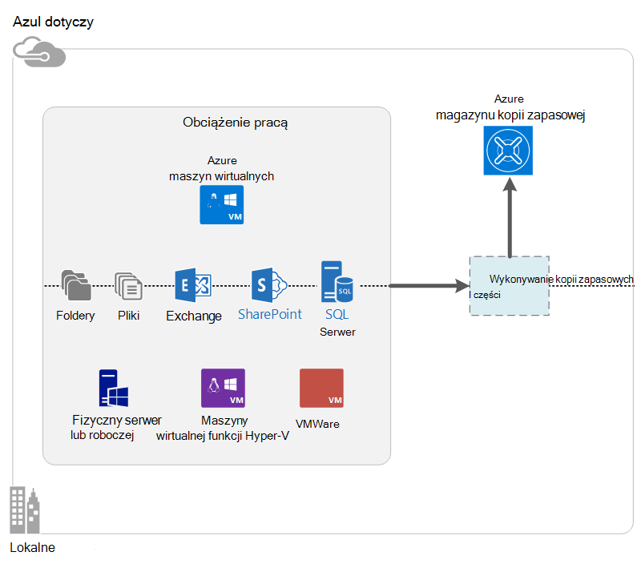

<properties
    pageTitle="Co to jest kopia zapasowa Azure? | Microsoft Azure"
    description="Za pomocą Azure wykonywanie kopii zapasowych i odzyskiwania usług, można tworzenie kopii zapasowych i przywracanie danych i aplikacji z serwerów systemu Windows, komputerów klienckich systemu Windows i serwery DPM Centrum systemu Azure maszyn wirtualnych."
    services="backup"
    documentationCenter=""
    authors="markgalioto"
    manager="cfreeman"
    editor="tysonn"
    keywords="Kopia zapasowa i przywracanie; usługi odzyskiwania; rozwiązania tworzenia kopii zapasowych"/>

<tags
    ms.service="backup"
    ms.workload="storage-backup-recovery"
    ms.tgt_pltfrm="na"
    ms.devlang="na"
    ms.topic="get-started-article"
    ms.date="10/19/2016"
    ms.author="jimpark; trinadhk"/>

# Co to jest kopia zapasowa Azure?
Kopia zapasowa Azure to usługa, która umożliwia wykonywanie kopii zapasowych i przywracanie danych w chmurze firmy Microsoft. Zastępuje z istniejącego lokalnego lub poza tworzenia kopii zapasowych opartego na chmurze rozwiązanie, które jest niezawodnego, bezpiecznego i koszt konkurencyjności. Pomaga również chronić zasoby, które są uruchamiane w chmurze. Azure kopii zapasowej zawiera usług odzyskiwania oparty na Światowej infrastrukturę, która jest skalowalna, trwałe i wysokiej dostępności.

[Obejrzyj klip wideo pokazujący Azure kopii zapasowej](https://azure.microsoft.com/documentation/videos/what-is-azure-backup/)

## Dlaczego warto używać kopii zapasowej Azure?
Tradycyjne rozwiązania tworzenia kopii zapasowych usprawnionych traktowania w chmurze jako punkt końcowy, które są podobne do dysków lub taśmą. Ta metoda jest proste, również jest ograniczona. Nie pełni wykorzystać możliwości platformy chmurze, a przekłada się na nieefektywne, co skutkuje marnowaniem rozwiązanie.
Natomiast kopii zapasowej Azure udostępnia wszystkie zalety tworzenia kopii zapasowych zaawansowanych i przystępnej chmury. Oto niektóre z najważniejszych korzyści, które zawiera Azure kopii zapasowej.

| Funkcja | Korzyści |
| ------- | ------- |
| Zarządzanie magazynem automatyczne | Wydatki kapitału jest wymagany dla urządzeń magazynu lokalnego. Kopia zapasowa Azure automatycznie przydziela i zarządza magazynu kopii zapasowej, a korzysta z modelu zużycie płatności jako — możesz użycia. |
| Nieograniczony skalowania | Korzystać z gwarancje szybkiej bez ogólnych utrzymania i monitorowania. Azure kopii zapasowej używa źródłowych dodatku i skali chmura Azure z możliwości nonintrusive autoscaling. |
| Wiele opcji miejsca do magazynowania | Wybierz z magazynu kopii zapasowej zgodnie z potrzebami:<li>Blob blok lokalnie zbędne miejsca do magazynowania jest idealny dla klientów, świadome ceny i nadal pomaga chronić dane przed awariami sprzęcie lokalnym. <li>Obiektów blob replikacji geo miejsca do magazynowania blok zawiera trzy większej liczby kopii w parach centrum danych. Te dodatkowe kopie pomoc, upewnij się, że danych jest bardzo dostępny, nawet jeśli występuje Azure awarii poziomie witryny. |
| Transfer nieograniczoną danych | Podczas operacji przywracania z magazynu kopii zapasowej jest bezpłatna przekazanie (wychodzące) dane wyjściowe. Dane dla ruchu przychodzącego Azure również są bezpłatne. Współdziała z usługą importu, w której znajduje się. |
| Szyfrowanie danych | Szyfrowanie danych umożliwia bezpieczne przesyłanie i miejsca do magazynowania danych klientów w chmurze publicznej. Hasło szyfrowania są przechowywane w źródle, a nigdy nie jest przesyłane lub przechowywane w Azure. Kluczem szyfrowania jest wymagane, aby przywrócić dane, a tylko klient ma pełny dostęp do danych w usłudze. |  
| Kopia zapasowa spójną z aplikacją | Spójne aplikacji wykonywania kopii zapasowych w systemie Windows zapewniają poprawki nie są potrzebne w czasie przywracania, zmniejszając wskaźniku czasu odzyskiwania. Dzięki temu klienci powrócić do stanie uruchomienia szybciej. |
| Długotrwałe przechowywania | Zamiast zapłacić za poza taśmą rozwiązania kopii zapasowej, klienci mogą wykonać kopię zapasową Azure, która udostępnia atrakcyjne rozwiązanie taśmą przypominających małym kosztem. |

## Azure składniki kopii zapasowej
Ponieważ kopii zapasowej jest tworzenia kopii zapasowych hybrydowe, składa się z wielu części, które współpracują ze sobą włączyć zakończenia do końca wykonywanie kopii zapasowych i przywracanie przepływów pracy.

### Scenariusze wdrażania

| Składnik | Mogą być rozmieszczone w Azure? | Może być wdrożony w lokalnej? | Obsługiwane magazynowania docelowej|
| --- | --- | --- | --- |
| Azure agenta kopii zapasowej | 
**Tak**
 
Agent Azure Backup mogą być rozmieszczone w dowolnej maszyn wirtualnych serwera systemu Windows, uruchamianego platformy Azure.
 | 
**Tak**
 
Agent kopii zapasowej mogą być rozmieszczone na maszyn wirtualnych serwera systemu Windows lub fizyczny komputer.
 | 
Azure magazynu kopii zapasowej
 |
| System Center Data Protection Manager (DPM) | 
**Tak**

Dowiedz się więcej o [ochronie obciążenia platformy Azure za pomocą DPM Centrum systemu](http://blogs.technet.com/b/dpm/archive/2014/09/02/azure-iaas-workload-protection-using-data-protection-manager.aspx).
 | 
**Tak**
 
Dowiedz się więcej o [ochronie obciążenia i maszyny wirtualne w centrum danych](https://technet.microsoft.com/library/hh758173.aspx).
 | 
Lokalnie dołączonym dysku
 
Azure magazynu kopii zapasowej,
 
taśmą (lokalnego tylko)
 |
| Serwer Azure kopii zapasowej | 
**Tak**

Dowiedz się więcej o [ochronie obciążenia platformy Azure za pośrednictwem serwera kopii zapasowej Azure](backup-azure-microsoft-azure-backup.md).
 | 
**Tak**
 
Dowiedz się więcej o [ochronie obciążenia platformy Azure za pośrednictwem serwera kopii zapasowej Azure](backup-azure-microsoft-azure-backup.md).
 | 
Lokalnie dołączonym dysku
 
Azure magazynu kopii zapasowej
 |
| Azure kopii zapasowej (maszyn wirtualnych rozszerzenie) | 
**Tak**

Część tkaninie Azure

Przeznaczone do [kopii zapasowej Azure infrastruktury jako maszyn wirtualnych usługi (IaaS)](backup-azure-vms-introduction.md).
 | 
**Brak**
 
Tworzenie kopii zapasowych maszyn wirtualnych w centrum danych za pomocą DPM Centrum systemu.
 | 
Azure magazynu kopii zapasowej
 |

### Składnik poziomu zalet i ograniczeń

| Składnik | Zalety | Ograniczenia | Odzyskiwanie szczegółowości |
| --- | --- | --- | --- |
| Azure agenta kopii zapasowej (MARS) | <li>Można utworzyć kopię zapasową plików i folderów na komputerze z systemem operacyjnym Windows fizycznych i wirtualnych (maszyny wirtualne może mieć dowolne miejsce w lokalnym lub Azure)<li>Nie osobny serwer kopii zapasowej wymagane<li>Używa magazynu kopii zapasowej Azure | <li>Przywracanie trzy razy dnia plik kopii zapasowej i poziomu<li>Przywróć poziomu woluminu plików i folderów nie aplikacji, tylko pamiętać o<li>Brak obsługi Linux | pliki i foldery i ilości |
| System Center Data Protection Manager | <li>Aplikacja pamiętać migawek (VSS)<li>Pełna elastyczność podczas wykonywania kopii zapasowych<li>Szczegółowy odzyskiwania, (wszystkie)<li>Korzystając z magazynu kopii zapasowej Azure<li>Obsługa Linux (jeśli jest hostowana w funkcji Hyper-V) | <li>Brak obsługi niejednorodnymi (VMware maszyn wirtualnych wykonywanie kopii zapasowej, obciążenie pracą Oracle kopia zapasowa).  | pliki i foldery i ilości -Maszyny wirtualne i aplikacji |
| Kopii zapasowych serwera Microsoft Azure | <li>Aplikacja pamiętać migawek (VSS)<li>Pełna elastyczność podczas wykonywania kopii zapasowych<li>Szczegółowy odzyskiwania, (wszystkie)<li>Korzystając z magazynu kopii zapasowej Azure<li>Obsługa Linux (jeśli jest hostowana w funkcji Hyper-V)<li>Nie wymaga licencji System Center | <li>Brak obsługi niejednorodnymi (VMware maszyn wirtualnych wykonywanie kopii zapasowej, obciążenie pracą Oracle kopia zapasowa).<li>Zawsze wymaga live Azure subskrypcji<li>Nie obsługuje kopii zapasowej taśmą | pliki i foldery i ilości -Maszyny wirtualne i aplikacji |
| Kopia zapasowa Azure IaaS maszyn wirtualnych | <li>Natywne kopie zapasowe systemu Windows i Linux<li>Instalacja nie określony agent wymagane<li>Tkaninie poziomu tworzenia kopii zapasowych nie niezbędnej infrastruktury kopii zapasowej | <li>Raz dziennie Wstecz w górę/dysk Przywróć poziom<li>Nie można wykonać kopię zapasową lokalnego | Maszyny wirtualne Wszystkie dyski (przy użyciu programu PowerShell) |

## Które aplikacje i obciążenia można kopii zapasowej?

| Obciążenie pracą | Komputerem źródłowym | Azure rozwiązanie kopii zapasowej |
| --- | --- |---|
| Pliki i foldery | System Windows Server | 
[Agent azure Backup](backup-configure-vault.md)
 
[Centrum systemu DPM](backup-azure-dpm-introduction.md) (+ agent Azure Backup),
 
[Serwer Azure kopii zapasowej](backup-azure-microsoft-azure-backup.md) (obejmuje agent Azure Backup)
  |
| Pliki i foldery | Klient systemu Windows | 
[Agent azure Backup](backup-configure-vault.md)
 
[Centrum systemu DPM](backup-azure-dpm-introduction.md) (+ agent Azure Backup),
 
[Serwer Azure kopii zapasowej](backup-azure-microsoft-azure-backup.md) (obejmuje agent Azure Backup)
  |
| Maszyny wirtualnej funkcji Hyper-V (Windows) | System Windows Server | 
[Centrum systemu DPM](backup-azure-backup-sql.md) (+ agent Azure Backup),
 
[Serwer Azure kopii zapasowej](backup-azure-microsoft-azure-backup.md) (obejmuje agent Azure Backup)
 |
| Maszyny wirtualnej funkcji Hyper-V (Linux). | System Windows Server | 
[Centrum systemu DPM](backup-azure-backup-sql.md) (+ agent Azure Backup),
 
[Serwer Azure kopii zapasowej](backup-azure-microsoft-azure-backup.md) (obejmuje agent Azure Backup)
  |
| Program Microsoft SQL Server | System Windows Server | 
[Centrum systemu DPM](backup-azure-backup-sql.md) (+ agent Azure Backup),
 
[Serwer Azure kopii zapasowej](backup-azure-microsoft-azure-backup.md) (obejmuje agent Azure Backup)
  |
| Microsoft SharePoint | System Windows Server | 
[Centrum systemu DPM](backup-azure-backup-sql.md) (+ agent Azure Backup),
 
[Serwer Azure kopii zapasowej](backup-azure-microsoft-azure-backup.md) (obejmuje agent Azure Backup)
   |
| Microsoft Exchange |  System Windows Server | 
[Centrum systemu DPM](backup-azure-backup-sql.md) (+ agent Azure Backup),
 
[Serwer Azure kopii zapasowej](backup-azure-microsoft-azure-backup.md) (obejmuje agent Azure Backup)
   |
| Azure IaaS maszyny wirtualne (Windows) | - | [Azure kopii zapasowej (maszyn wirtualnych rozszerzenie)](backup-azure-vms-introduction.md) |
| Azure IaaS maszyny wirtualne (Linux). | - | [Azure kopii zapasowej (maszyn wirtualnych rozszerzenie)](backup-azure-vms-introduction.md) |

## Obsługa ARM i Linux

| Składnik | Obsługa ARM | Linux (Azure zatwierdzone) pomocy technicznej |
| --- | --- | --- |
| Azure agenta kopii zapasowej (MARS) | Tak | Nie (tylko system Windows oparty na agent) |
| System Center Data Protection Manager | Tak (Agent w gościa) | Możliwe jest tylko funkcji Hyper-V (nie maszyn wirtualnych Azure) tylko plików spójną z kopii zapasowej |
| Azure serwera kopii zapasowej (MABS) | Tak (Agent w gościa) | Kopia zapasowa tylko plik spójną Hyper-V (nie maszyn wirtualnych Azure) jest możliwe tylko (taki sam jak DPM) |
| Kopia zapasowa Azure IaaS maszyn wirtualnych | Tak | Tak |

[AZURE.INCLUDE [learn-about-deployment-models](../../includes/learn-about-deployment-models-include.md)]

## Wykonywanie kopii zapasowych i przywracanie maszyny wirtualne Premium miejsca do magazynowania

Usługa Azure kopia zapasowa teraz chroni maszyny wirtualne miejsca do magazynowania Premium.

### Wykonywanie kopii zapasowej maszyny wirtualne miejsca do magazynowania Premium

Podczas kopię zapasową maszyny wirtualne miejsca do magazynowania Premium, usługa Kopia zapasowa tworzy tymczasową lokalizację tymczasowy na koncie Premium miejsca do magazynowania. Tymczasową lokalizację, o nazwie "AzureBackup-" jest równa całkowitej danych, rozmiar dysków premium dołączone do maszyn wirtualnych.

>[AZURE.NOTE] Nie wolno modyfikować ani edytować tymczasową lokalizację.

Po zakończeniu zadania kopii zapasowej tymczasową lokalizację zostanie usunięty. Cena tymczasowej lokalizacji przechowywania jest zgodna z wszystkich [Premium ceny miejsca do magazynowania](../storage/storage-premium-storage.md#pricing-and-billing).

### Przywracanie maszyny wirtualne miejsca do magazynowania Premium

Może zostać przywrócona maszyn wirtualnych miejsca do magazynowania Premium, albo Magazyn Premium lub normalnego miejsca do magazynowania. Przywracanie punkt odzyskiwania maszyn wirtualnych miejsca do magazynowania Premium Premium miejsca do magazynowania jest typowych proces przywracania. Jednak można będzie przywrócić punkt odzyskiwania maszyn wirtualnych miejsca do magazynowania Premium standardowego magazynu. Ten rodzaj przywracania można w razie potrzeby podzbioru pliki z maszyn wirtualnych.

## Funkcje
W poniższych tabelach pięć podsumowywanie jak kopii zapasowej jest obsługiwana w każdy składnik.

### Miejsca do magazynowania

| Funkcja | Azure agenta kopii zapasowej | Centrum systemu DPM | Serwer Azure kopii zapasowej | Azure kopii zapasowej (maszyn wirtualnych rozszerzenie) |
| ------- | --- | --- | --- | ---- |
| Azure magazynu kopii zapasowej | ![Tak][green] | ![Tak][green] | ![Tak][green] | ![Tak][green] |
| Ilość miejsca do magazynowania | | ![Tak][green] | ![Tak][green] |  |
| Magazynu | | ![Tak][green] |  | |
| Kompresowanie (w kopii zapasowej magazynu) | ![Tak][green] | ![Tak][green]| ![Tak][green] | |
| Przyrostowe kopie zapasowe | ![Tak][green] | ![Tak][green] | ![Tak][green] | ![Tak][green] |
| Deduplication dysku | | ![Częściowo][yellow] | ![Częściowo][yellow]| | |

Magazyn kopii zapasowej jest docelowego miejsca do magazynowania preferowaną przez wszystkie składniki. Wykonywanie kopii zapasowych serwera i DPM System Center zapewniają również opcja Kopiuj dysk lokalny. Jednak tylko DPM systemu w Centrum umożliwia zapisanie danych na urządzeniu magazynującym taśmą.

#### Przyrostowe kopie zapasowe
Każdy składnik obsługuje przyrostowa kopia zapasowa bez względu na przechowywanie docelowej (dysk, taśmą magazynu kopii zapasowej). Przyrostowa kopia zapasowa dzięki kopie zapasowe są miejsca do magazynowania i godziny efektywne, przekazując wyłącznie zmiany wprowadzone od czasu ostatniej kopii zapasowej.

#### Stopień kompresji
Aby zmniejszyć ilość miejsca do magazynowania wymagane są kompresowane kopie zapasowe. Tylko składnik, która nie korzysta z kompresji jest rozszerzenie maszyn wirtualnych. Z rozszerzeniem maszyn wirtualnych wszystkich danych kopii zapasowej jest kopiowany z konta miejsca do magazynowania klienta do kopii zapasowej magazynu w tym samym regionie bez kompresując je. Podczas przejścia bez kompresji nieco nadyma Magazyn używany, umożliwia przechowywanie danych bez kompresji osiągać krótsze czasy ich przywracania.

#### Deduplication
Deduplication jest obsługiwana przez System Centrum DPM i kopia zapasowa Server, gdy jest [używany w maszyny wirtualnej funkcji Hyper-V](http://blogs.technet.com/b/dpm/archive/2015/01/06/deduplication-of-dpm-storage-reduce-dpm-storage-consumption.aspx). Deduplication jest wykonywane na poziomie hosta przy użyciu deduplication Windows Server na wirtualnych dyskach twardych (VHD) dołączonych maszyn wirtualnych jako magazynu kopii zapasowej.

>[AZURE.WARNING] Deduplication nie jest dostępna w Azure dla dowolnej części wykonywanie kopii zapasowych. Kiedy DPM Centrum systemu i wykonywanie kopii zapasowych serwera są używane w Azure, nie deduplicated dołączone do maszyn wirtualnych dysków w magazynie.

### Zabezpieczenia

| Funkcja | Azure agenta kopii zapasowej | Centrum systemu DPM | Serwer Azure kopii zapasowej | Azure kopii zapasowej (maszyn wirtualnych rozszerzenie) |
| ------- | --- | --- | --- | ---- |
| Zabezpieczenia sieci (aby Azure) | ![Tak][green] |![Tak][green] | ![Tak][green] | ![Częściowo][yellow]|
| Bezpieczeństwo danych (w Azure) | ![Tak][green] |![Tak][green] | ![Tak][green] | ![Częściowo][yellow]|

Cały ruch kopii zapasowej z serwerów do magazynu kopii zapasowej są szyfrowane za pomocą zaawansowane 256 standardowy szyfrowania. Dane są przesyłane przy użyciu bezpiecznego łącza HTTPS. Dane kopii zapasowej znajduje się również w magazynu kopii zapasowych w zaszyfrowanej. Tylko klient zawiera hasło do odblokowania te dane. Microsoft nie można odszyfrować danych kopii zapasowej w dowolnym momencie.

>[AZURE.WARNING] Klucz użyty do zaszyfrowania danych kopii zapasowej znajduje się tylko w przypadku klienta. Firma Microsoft nie zachowuje kopię w Azure i nie ma dostępu do klucza. Jeśli klucz jest zagubione, Microsoft nie można odzyskać danych kopii zapasowej.

Wykonywanie kopii zapasowej maszyny wirtualne Azure wymaga konfigurowania szyfrowania *w* maszyny wirtualnej. Użyj funkcji BitLocker na maszyn wirtualnych systemu Windows i **kryptograficznego dm** w środowisku maszyn wirtualnych systemu Linux. Kopia zapasowa Azure nie automatycznie szyfrować danych kopii zapasowej, dostarczoną przez następującą ścieżkę.

### Obsługiwane obciążenia

| Funkcja | Azure agenta kopii zapasowej | Centrum systemu DPM | Serwer Azure kopii zapasowej | Azure kopii zapasowej (maszyn wirtualnych rozszerzenie) |
| ------- | --- | --- | --- | ---- |
| Windows Server komputerze--plików i folderów | ![Tak][green] | ![Tak][green] | ![Tak][green] | |
| Komputer kliencki systemu Windows — plików i folderów | ![Tak][green] | ![Tak][green] | ![Tak][green] | |
| Maszyny wirtualnej funkcji Hyper-V (Windows) | | ![Tak][green] | ![Tak][green] | |
| Maszyny wirtualnej funkcji Hyper-V (Linux). | | ![Tak][green] | ![Tak][green] | |
| Program Microsoft SQL Server | | ![Tak][green] | ![Tak][green] | |
| Microsoft SharePoint | | ![Tak][green] | ![Tak][green] | |
| Microsoft Exchange  | | ![Tak][green] | ![Tak][green] | |
| Azure maszyn wirtualnych (Windows) | | | | ![Tak][green] |
| Azure maszyn wirtualnych (Linux). | | | | ![Tak][green] |

### Sieci

| Funkcja | Azure agenta kopii zapasowej | Centrum systemu DPM | Serwer Azure kopii zapasowej | Azure kopii zapasowej (maszyn wirtualnych rozszerzenie) |
| ------- | --- | --- | --- | ---- |
| Sieć kompresji (na serwerze kopii zapasowej) | | ![Tak][green] | ![Tak][green] | |
| Kompresowanie sieci (do magazynu kopii zapasowej) | ![Tak][green] | ![Tak][green] | ![Tak][green] | |
| Protokół (na serwerze kopii zapasowej) | | PORT TCP | PORT TCP | |
| Protokół sieci (do magazynu kopii zapasowej) | PROTOKÓŁ HTTPS | PROTOKÓŁ HTTPS | PROTOKÓŁ HTTPS | PROTOKÓŁ HTTPS |

Ponieważ rozszerzenie maszyn wirtualnych odczytuje dane bezpośrednio z konta Azure miejsca do magazynowania w sieci magazynowania, nie jest konieczne zoptymalizować ruch. Ruch przez sieć magazynu lokalnego w obrębie Azure centrum danych, więc pojawia się potrzeba kompresji ze względu na zagadnienia dotyczące przepustowości.

W przypadku wykonywania kopii zapasowych danych na serwerze kopii zapasowej (DPM lub kopii zapasowych serwera), aby zapisać na przepustowość można skompresować ruchu z podstawowego serwera na serwerze kopii zapasowej.

#### Ograniczanie przepustowości sieci
Agent Azure Backup zapewnia możliwości ograniczania, która pozwala na kontrolowanie sposobu użycia przepustowości sieci podczas przesyłania danych. Ograniczanie może być przydatne, jeśli chcesz wykonać kopię zapasową danych podczas godziny pracy, ale nie chcesz wykonywania kopii zapasowej zakłócać pozostały ruch internetowy. Ograniczanie danych transfer dotyczy wykonywanie kopii zapasowych i przywracanie działania.

### Wykonywanie kopii zapasowych i przechowywania

|  | Azure agenta kopii zapasowej | Centrum systemu DPM | Serwer Azure kopii zapasowej | Azure kopii zapasowej (maszyn wirtualnych rozszerzenie) |
| --- | --- | --- | --- | --- |
| Częstotliwość kopii zapasowej (do magazynu kopii zapasowej) | Trzy kopie zapasowe na dzień | Dwie kopie zapasowe na dzień |Dwie kopie zapasowe na dzień | Jedna kopia zapasowa dziennie |
| Częstotliwość kopii zapasowej (na dysku) | Nie dotyczy | 
Co 15 minut w przypadku programu SQL Server
 
Co godzinę dla innych obciążeń pracą
 | 
Co 15 minut w przypadku programu SQL Server
 
Co godzinę dla innych obciążeń pracą
 |Nie dotyczy |
| Opcje przechowywania | Dzienny, tygodniowy, miesięczny, roczny | Dzienny, tygodniowy, miesięczny, roczny | Dzienny, tygodniowy, miesięczny, roczny |Dzienny, tygodniowy, miesięczny, roczny |
| Okres przechowywania | Lata do 99 | Lata do 99 | Lata do 99 | Lata do 99 |
| Odzyskiwanie punktów w kopii zapasowej magazynu | Nieograniczoną | Nieograniczoną | Nieograniczoną | Nieograniczony |
| Punkty odzyskiwania na lokalnym dysku | Nie dotyczy | 64 dla serwerów plików  448 dla serwerów aplikacji | 64 dla serwerów plików  448 dla serwerów aplikacji |Nie dotyczy |
| Odzyskiwanie punktów taśmą | Nie dotyczy | Nieograniczoną | Nie dotyczy | Nie dotyczy |

## Co to jest plik magazynu poświadczeń?

Plik magazynu poświadczeń jest certyfikat wygenerowany przez portal dla każdej kopii zapasowej magazynu. Portalu wysyła następnie klucz publiczny do usługi kontroli dostępu (ACS). Klucz prywatny jest udostępnionej użytkownikowi podczas pobierania poświadczeń, a następnie wprowadzić podczas rejestrowania komputera. Klucz prywatny uwierzytelnia komputera wysyłanie kopii zapasowych danych do określonych magazynu w usłudze Azure kopii zapasowej.

Poświadczenia magazynu jest używana tylko podczas rejestracji przepływu pracy. To obowiązek upewnij się, że nie odczyta plików magazynu poświadczeń. Jeśli wypada w ręce każdy użytkownik rozpoczęcie pliku magazynu poświadczeń może służyć do rejestrowania innych komputerów przed tym samym magazynu. Jednak ponieważ danych kopii zapasowej jest zaszyfrowany przy użyciu hasła należących tylko do klienta, nie złamane istniejące dane kopii zapasowej. Aby zmniejszyć ten problem, magazynu poświadczeń są ustawione na wygasania w 48 godzin. Gdy można pobrać magazynu poświadczeń kopii zapasowej vault dowolną liczbę razy, podczas rejestracji przepływu pracy dotyczy tylko najnowsze plik.

## Czym różni się Azure kopia zapasowa z Odzyskiwanie witryny Azure?
Odzyskiwanie kopii zapasowej i odzyskiwanie, należy mylić wielu klientów. Oba przechwytywania danych i podaj znaczeń właściwych przywracania, ale ich podstawowych atrakcyjne oferty są różne.

Azure kopii zapasowej wykonuje kopię zapasową danych lokalnych i w chmurze. Odzyskiwanie witryny Azure współrzędne replikacji maszyn wirtualnych i fizycznego serwera, pracy awaryjnej i powrotu. Obie usługi są ważne, ponieważ rozwiązania odzyskiwania danych należy Zabezpieczanie danych i odzyskania (kopia zapasowa) *i* zachować dostępne obciążenia (Odzyskiwanie witryny) wystąpieniu awarii.

Następujące pojęcia ułatwić podejmowanie decyzji ważne wokół kopii zapasowych i odtwarzania po awarii.

| Koncepcja | Szczegóły | Wykonywanie kopii zapasowych | Odzyskiwanie (DR) |
| ------- | ------- | ------ | ----------------- |
| Odzyskiwanie punktów cel (RPO) | Liczba utracie danych jeśli odzyskiwania musi zostać wykonane. | Rozwiązania tworzenia kopii zapasowych mieć szerokości zmienności w ich przyjęcia RPO. Kopie zapasowe maszyn wirtualnych zazwyczaj jest RPO jeden dzień, podczas wykonywania kopii zapasowych bazy danych jest RPOs możliwie jak 15 minut. | Rozwiązania do odzyskiwania danych mają RPOs niski. Kopiowanie DR mogą być za przez kilka sekund lub kilka minut. |
| Cel czasu odzyskiwania (RTO) | Ilość czasu, potrzebny do wykonania odzyskiwania lub przywracanie. | Ze względu na większym RPO ilości danych, który należy procesu tworzenia kopii zapasowych jest zwykle znacznie wyższa, która prowadzi do RTOs dłużej. Na przykład może potrwać dni do przywrócenia danych z taśmy, w zależności od czas potrzebny do transportu taśmą z lokalizacji poza nim. | Rozwiązania odzyskiwania po awarii mieć RTOs mniejszy, ponieważ są one bardziej synchronizacji ze źródłem. Mniej zmiany muszą być przetworzone. |
| Przechowywanie | Jak długo trwa dane mają być przechowywane | W przypadku scenariuszy wymagających operacyjne odzyskiwania (uszkodzenie danych, plik przypadkowego usunięcia błędu systemu operacyjnego) danych kopii zapasowej zazwyczaj jest zachowywana przez 30 dni lub mniej. Z punktu widzenia zgodności danych może być konieczne można przechowywać miesięcy lub nawet lata. Dane kopii zapasowej doskonale nadaje się do archiwizacji w takich przypadkach. | Odzyskiwanie musi tylko dane odzyskiwania działania, które zwykle trwa kilka godzin lub do dnia. Ze względu na Przechwytywanie szczegółowych danych używane w DR rozwiązań przy użyciu danych DR długoterminowe przechowywania nie jest zalecane. |

## Następne kroki

Wypróbuj zwykłą kopię zapasową Azure. Aby uzyskać instrukcje zobacz jeden z tych samouczkach:

- [Spróbuj Azure kopii zapasowej](backup-try-azure-backup-in-10-mins.md)
- [Spróbuj Azure maszyn wirtualnych kopii zapasowej](backup-azure-vms-first-look.md)

Ponieważ te samouczki ułatwiają wykonywanie kopii zapasowej szybko, są pokazywane możesz tylko najbardziej bezpośredni ścieżka do tworzenia kopii zapasowych danych. Aby uzyskać dodatkowe informacje o typie kopii zapasowej możesz chcesz wykonać zobacz:

- [Wykonywanie kopii zapasowej komputera systemu Windows](backup-configure-vault.md)
- [Wykonywanie kopii zapasowej aplikacji](backup-azure-microsoft-azure-backup.md)
- [Maszyny wirtualne kopii zapasowej IaaS Azure](backup-azure-vms-prepare.md)

[green]: ./media/backup-introduction-to-azure-backup/green.png
[yellow]: ./media/backup-introduction-to-azure-backup/yellow.png
[red]: ./media/backup-introduction-to-azure-backup/red.png
