<properties
   pageTitle="Dowiedz się utworzyć kopie zapasowe plików i folderów z systemu Windows Azure z kopią zapasową Azure przy użyciu modelu wdrożenia Menedżera zasobów | Microsoft Azure"
   description="Dowiedz się, jak utworzyć kopię zapasową danych systemu Windows Server, tworząc magazynu, instalowania agenta usługi odzyskiwania i tworzenie kopii zapasowych plików i folderów usługi Azure."
   services="backup"
   documentationCenter=""
   authors="markgalioto"
   manager="cfreeman"
   editor=""
   keywords="jak kopii zapasowych. jak utworzyć kopię zapasową"/>

<tags
   ms.service="backup"
   ms.workload="storage-backup-recovery"
   ms.tgt_pltfrm="na"
   ms.devlang="na"
   ms.topic="hero-article"
   ms.date="09/27/2016"
   ms.author="markgal;"/>

# Najpierw sprawdź: kopia zapasowa plików i folderów z kopią zapasową Azure przy użyciu modelu wdrożenia Menedżera zasobów

W tym artykule wyjaśniono, jak utworzyć kopię zapasową systemu Windows Server (lub klienta w systemie Windows) plików i folderów Azure z kopią zapasową Azure za pomocą Menedżera zasobów. Jest samouczek przeznaczone do opisano podstawy pracy. Jeśli chcesz rozpocząć korzystanie z kopii zapasowych Azure, jesteś we właściwym miejscu.

Jeśli chcesz dowiedzieć się więcej o kopii zapasowej Azure, przeczytaj [Omówienie](backup-introduction-to-azure-backup.md).

Wykonywanie kopii zapasowych plików i folderów na Azure wymaga następujące działania:

 uzyskać Azure subskrypcji (Jeśli nie masz jeszcze jedną). 
 Tworzenie magazynu usługi odzyskiwania. 
 pobrać potrzebne pliki. 
 instalacji i Rejestruj agenta usługi odzyskiwania. 
 kopia zapasowa plików i folderów.

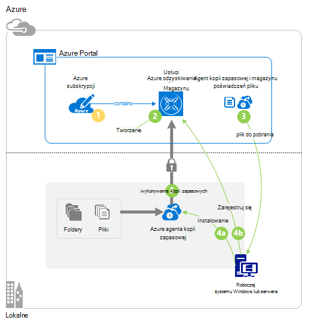

## Krok 1: Pobieranie subskrypcji usługi Azure

Jeśli nie masz subskrypcji usługi Azure, należy utworzyć [bezpłatne konto](https://azure.microsoft.com/free/) , które umożliwia uzyskanie dostępu do jakichkolwiek usług Azure.

## Krok 2: Tworzenie magazynu usługi odzyskiwania

Aby utworzyć kopię zapasową plików i folderów, należy utworzyć magazynu usługi odzyskiwania w regionie miejsce, w którym mają być przechowywane dane. Należy określić, jak magazyn replikowane.

### Aby utworzyć magazynu usługi odzyskiwania

1. Jeśli możesz jeszcze tego nie zrobiono, zaloguj się do [Azure Portal](https://portal.azure.com/) , korzystając ze swojej subskrypcji Azure.

2. W menu Centrum kliknij przycisk **Przeglądaj** i na liście zasobów, wpisz **Usługi odzyskiwania** , a następnie kliknij pozycję **magazynów usługi odzyskiwania**.

    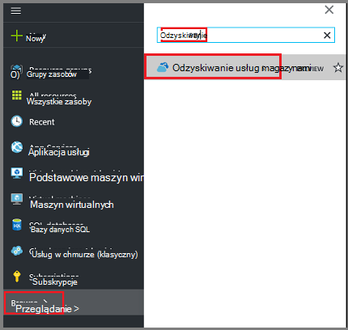  

3. W menu **usługi odzyskiwania magazynów** kliknij przycisk **Dodaj**.

    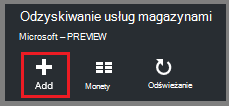

    Zostanie wyświetlona karta magazynu usługi odzyskiwania monituje o podanie **nazwy**, **subskrypcji**, **Grupa zasobów**i **lokalizacji**.

    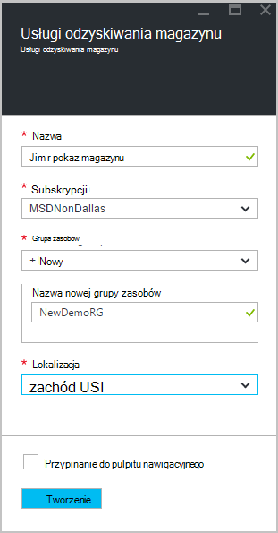

4. W polu **Nazwa**wpisz przyjazną nazwę identyfikującą magazyn.

5. Kliknij **subskrypcję** , aby wyświetlić listę dostępnych subskrypcji.

6. Kliknij pozycję **Grupa zasobów** , aby wyświetlić listę dostępnych grup zasobów, lub kliknij przycisk **Nowy** , aby utworzyć nową grupę zasobów.

7. Kliknij **miejsce** , aby wybrać regionu geograficznego dla magazyn. Ta opcja określa regionu geograficznego wysyłania danych kopii zapasowych.

8. Kliknij przycisk **Utwórz**.

    Jeśli nie widzisz swojego magazynu wyświetlane po jego zakończeniu, kliknij przycisk **Odśwież**. Po odświeżeniu listy kliknij nazwę magazyn.

### Aby określić nadmiarowości miejsca do magazynowania
Po utworzeniu magazynu usługi odzyskiwania można określić, jak replikowane miejsca do magazynowania.

1. Polecenie Nowy magazyn otworzyć pulpitu nawigacyjnego.

2. Karta **Ustawienia** , który jest uruchamiany automatycznie, z pulpitu nawigacyjnego magazynu, kliknij **Infrastruktury kopii zapasowej**.

3. W karta infrastruktury kopii zapasowej kliknij pozycję **Konfiguracji kopii zapasowej** , aby wyświetlić **typ replikacji miejsca do magazynowania**.

    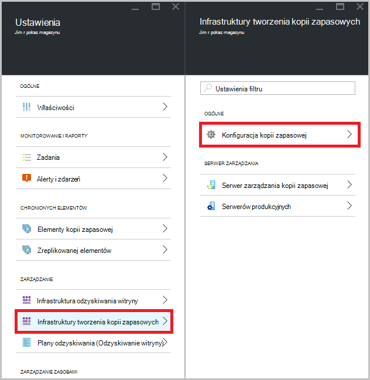

4. Wybierz opcję replikacji odpowiednie miejsca do magazynowania dla swojego magazynu.

    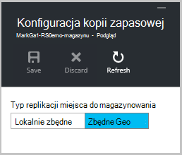

    Domyślnie do magazynu ma zbędne geo miejsca do magazynowania. Jeśli korzystasz z platformy Azure jako punkt końcowy podstawowego magazynu kopii zapasowej, Kontynuuj przy użyciu magazynu geo zbędne. Jeśli korzystasz z platformy Azure jako punkt końcowy inne niż podstawowe magazynu kopii zapasowej, a następnie wybierz pozycję lokalnie zbędne miejscem do magazynowania, który będzie zajmowała przechowywania danych w Azure. Przeczytaj więcej o tym [zbędne geo](../storage/storage-redundancy.md#geo-redundant-storage) i [lokalnie zbędne](../storage/storage-redundancy.md#locally-redundant-storage) opcje przechowywania w tym [Omówienie](../storage/storage-redundancy.md).

Teraz, gdy masz utworzony magazynu, należy przygotować infrastruktury do tworzenia kopii zapasowych plików i folderów, pobierając usługi odzyskiwania Microsoft Azure agenta i magazynu poświadczeń.

## Krok 3 — pliki do pobrania

1. Kliknij przycisk **Ustawienia** na pulpicie nawigacyjnym magazynu usługi odzyskiwania.

    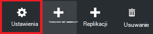

2. Kliknij pozycję **wprowadzenie > Kopia zapasowa** na karta Ustawienia.

    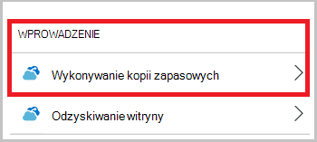

3. Kliknij pozycję **Kopia zapasowa cel** na karta kopia zapasowa.

    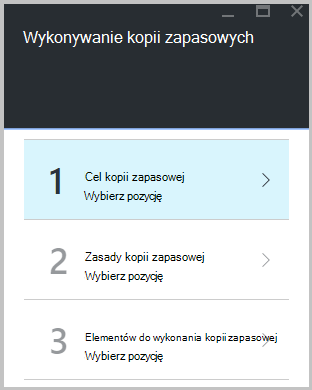

4. Wybierz pozycję **lokalnego** skąd jest z pracą działa? menu.

5. Zaznacz **pliki i foldery** z czym ma zawierać kopia zapasowa? menu i kliknij **przycisk OK**.

### Pobierz agenta usługi odzyskiwania

1. Kliknij **Pobierz agenta systemu Windows Server lub klienta w systemie Windows** karta **Przygotowywanie infrastruktury** .

    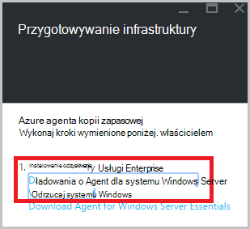

2. W oknie podręcznym plik do pobrania, kliknij przycisk **Zapisz** . Domyślnie plik **MARSagentinstaller.exe** jest zapisywany do folderu pobierania.

### Pobierz magazynu poświadczeń

1. Kliknij pozycję **Pobierz > Zapisz** na przygotowanie karta infrastruktury.

    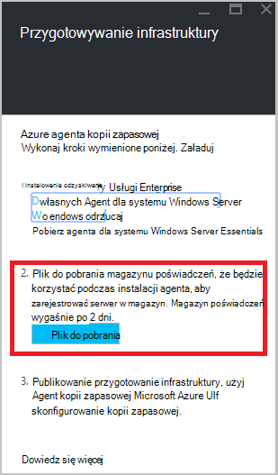

## Krok 4 — Zainstaluj i zarejestrować agenta

>[AZURE.NOTE] Włączanie kopii zapasowej za pośrednictwem portalu Azure jest już wkrótce. W tej chwili używasz agenta usługi Microsoft Azure odzyskiwania lokalnego do tworzenia kopii zapasowych plików i folderów.

1. Znajdź i kliknij dwukrotnie **MARSagentinstaller.exe** w folderze pobrane (lub innej lokalizacji zapisanego).

2. Wykonywanie Kreatora konfiguracji agenta usługi Microsoft Azure odzyskiwania. Aby zakończyć działanie kreatora, należy:

    - Wybierz lokalizację dla instalacji i folderu pamięci podręcznej.
    - Podaj informacje o serwerze serwer proxy Jeśli korzystasz z serwera proxy do łączenia się z Internetem.
    - Szczegółowo użytkownika nazwę i hasło, jeśli korzystasz z serwerem proxy z uwierzytelnianiem.
    - Poświadczenia pobrany magazynu
    - Zapisz hasło szyfrowania w bezpiecznym miejscu.

    >[AZURE.NOTE] Jeśli zapomnienia lub utraty hasła, Microsoft nie można odzyskać danych kopii zapasowej. Zapisz plik w bezpiecznym miejscu. Wymagane jest przywrócić z kopii zapasowej.

Agent jest zainstalowany, a komputer jest rejestrowany do magazyn. Możesz już przystąpić do konfigurowania i Planowanie kopii zapasowej.

## Krok 5: Tworzenie kopii zapasowej plików i folderów

Wstępnej kopii zapasowej obejmuje dwa zadania kluczowe:

- Planowanie tworzenia kopii zapasowej
- Wykonywanie kopii zapasowej plików i folderów po raz pierwszy

Aby wykonać wstępnej kopii zapasowej, należy użyć agenta firmy Microsoft Azure odzyskiwania usług.

### Aby zaplanować wykonywanie kopii zapasowej

1. Otwórz agenta firmy Microsoft Azure odzyskiwania usług. Można znaleźć go, wyszukując **Kopia zapasowa Microsoft Azure**komputera.

    

2. W programie agent usługi odzyskiwania kliknij pozycję **Harmonogram tworzenia kopii zapasowych**.

    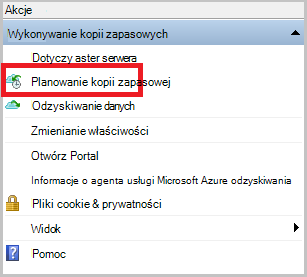

3. Na stronie wprowadzenie Kreatora harmonogramu kopii zapasowej kliknij przycisk **Dalej**.

4. Na wybieranie elementów do strony kopii zapasowej kliknij przycisk **Dodaj elementy**.

5. Zaznacz pliki i foldery, które mają być wykonywanie kopii zapasowej, a następnie kliknij **rekord**.

6. Kliknij przycisk **Dalej**.

7. Na stronie **Określanie harmonogramu wykonywania kopii zapasowych** określ **Harmonogram kopii zapasowej** , a następnie kliknij przycisk **Dalej**.

    Można zaplanować dziennego (maksymalna szybkość trzy razy dziennie) lub tygodniowy kopie zapasowe.

    

    >[AZURE.NOTE] Aby uzyskać więcej informacji na temat określania Harmonogram kopii zapasowej zobacz artykuł [Używanie Azure zapasowej aby zamienić infrastruktury taśmą](backup-azure-backup-cloud-as-tape.md).

8. Na stronie **Wybierz zasady przechowywania** wybierz **Zasady przechowywania** kopii zapasowej.

    Zasady przechowywania określa czas, w której będzie przechowywana kopia zapasowa. Zamiast po prostu określenie "prostym zasad" dla wszystkich punktów kopii zapasowej, można określić, podczas tworzenia kopii zapasowej występuje na podstawie zasad przechowywania różnych. Możesz zmienić zasady przechowywania dzienny, tygodniowy, miesięczny i roczny stosownie do potrzeb.

9. Na stronie wybierz typ kopii zapasowej początkowej wybierz początkowy typ kopii zapasowej. Pozostaw wybraną opcję **automatycznie przez sieć** zaznaczone, a następnie kliknij przycisk **Dalej**.

    Użytkownik może wykonywać kopie zapasowe automatycznie przez sieć lub kopię zapasową można wykonywać w trybie offline. W dalszej części tego artykułu opisuje proces automatycznego tworzenia kopii zapasowych. Jeśli wolisz zrobić kopii zapasowej offline, przeczytaj artykuł [Offline kopii zapasowych przepływu pracy w kopii zapasowej Azure](backup-azure-backup-import-export.md) Aby uzyskać dodatkowe informacje.

10. Na stronie potwierdzenia zapoznaj się z informacjami, a następnie kliknij przycisk **Zakończ**.

11. Po zakończeniu pracy Kreator tworzenia kopii zapasowej harmonogramu, kliknij przycisk **Zamknij**.

### Aby utworzyć kopię zapasową plików i folderów po raz pierwszy

1. W agenta usługi odzyskiwania kliknij przycisk **Wykonaj teraz kopię zapasową** do ukończenia początkowego obsługiwanie sieci.

    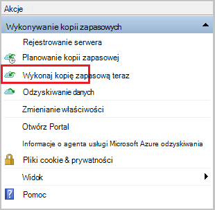

2. Na stronie potwierdzenia Przejrzyj ustawienia używane ponownie się teraz kreatora do tworzenia kopii zapasowych na komputerze. Następnie kliknij pozycję **Kopia zapasowa**.

3. Kliknij przycisk **Zamknij** , aby zamknąć kreatora. Jeśli to zrobisz przed zakończeniem wykonywania kopii zapasowej, Kreator będzie działać w tle.

Po wykonaniu początkowej kopii zapasowej, stan **zadania wykonane** jest wyświetlany w konsoli kopii zapasowej.

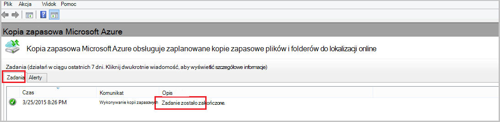

## Masz pytania?
Jeśli masz pytania lub w przypadku dowolnej funkcji, którą chcesz wyświetlić dołączone, [Prześlij opinię](http://aka.ms/azurebackup_feedback).

## Następne kroki
- Uzyskaj więcej informacji na temat [wykonywania kopii zapasowych maszyn systemu Windows](backup-configure-vault.md).
- Teraz, gdy zostały utworzone kopie zapasowe plików i folderów, możesz [zarządzać magazynów i serwery](backup-azure-manage-windows-server.md).
- Jeśli chcesz przywrócić kopię zapasową, za pomocą tego artykułu, aby [przywrócić pliki do komputera systemu Windows](backup-azure-restore-windows-server.md).
