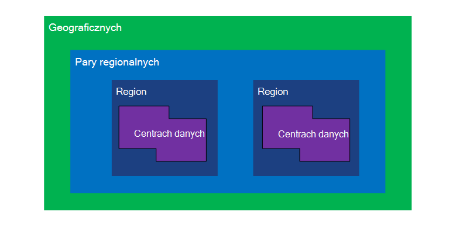
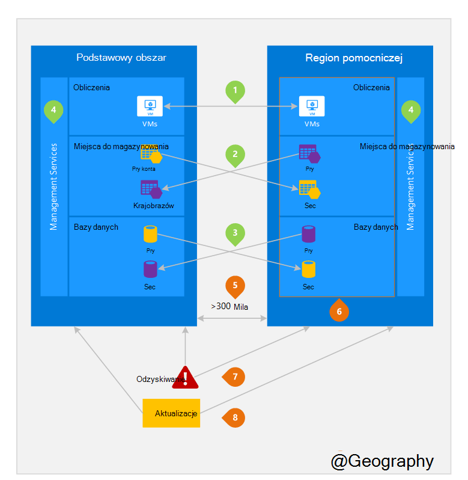

<properties
    pageTitle="Business ciągłości i awarii odzyskiwania (BCDR): regiony sparowane Azure | Microsoft Azure"
    description="Azure pary regionalne zapewnić aplikacji mechanizm podczas awarii centrum danych."
    services="site-recovery"
    documentationCenter=""
    authors="rayne-wiselman"
    manager="jwhit"
    editor=""/>

<tags
    ms.service="site-recovery"
    ms.workload="storage-backup-recovery"
    ms.tgt_pltfrm="na"
    ms.devlang="na"
    ms.topic="article"
    ms.date="08/23/2016"
    ms.author="raynew"/>

# Business ciągłości i awarii odzyskiwania (BCDR): regiony sparowane Azure

## Co to są sparowane regionów?

Azure działa w wielu obszarów geograficznych na całym świecie. Azure Geografia jest zdefiniowanym obszarze świecie, który zawiera co najmniej jeden Region Azure. Azure region jest obszarze Geografia, zawierająca jeden lub więcej centrach danych.

Każdego regionu Azure wraz z innego regionu w tym samym Geografia razem wprowadzania parę regionalne. Wyjątkiem jest południe Brazylia, które wraz z obszar poza jego geograficznych.

Rysunek 1 — diagram Azure pary regionalnych

| Geograficznych     |  ILOCZYNÓW regionów  |                     |
| :-------------| :-------------   | :-------------      |
| Ameryka Północna | Ameryka Północna centralnej w Stanach Zjednoczonych | Południowej centralnej Stany Zjednoczone    |
| Ameryka Północna | Wschodniej Stany Zjednoczone          | Zachód Stany Zjednoczone             |
| Ameryka Północna | Stany Zjednoczone wschód 2        | Centralny Stany Zjednoczone          |
| Ameryka Północna | Stany Zjednoczone zachód 2        | Stany Zjednoczone centralna zachód     |
| Europa        | Europa Północna     | Europa Zachodnia         |
| Kraje Azji          | Południowej wschodnioazjatyckie  | Wschodnioazjatyckie           |
| Chiny         | Chiny Wschodniej       | Chiny północnej         |
| Japonia         | Wschód Japonia       | Japonia zachód          |
| Brazylia        | Brazylia południe (1) | Południowej centralnej Stany Zjednoczone    |
| Australia     | Wschód Australia   | Australia kopiec |
| Rząd Stanów Zjednoczonych | Stany Zjednoczone Gov Iowa      | Virginia Gov Stanów Zjednoczonych     |
| Indie         | Indie centralnej    | Indie Płd.         |
| Kanada        | Kanada Środkowa   | Wschód Kanada         |
| ZJEDNOCZONE KRÓLESTWO            | Zjednoczone Królestwo zachód          | Południe USA            |

Tabela 1 — mapowania par regionalne azure

> (1) południe Brazylia jest unikatowy, ponieważ wraz z obszar poza własną geograficznych. Regionie pomocniczej południe Brazylia jest południe centralnej nam, ale Południowej centralnej nam na pomocniczym region nie jest południe Brazylii.

Firma Microsoft zaleca powielić obciążenia przez regionalne pary do korzystania z zasady firmy Azure izolacji i dostępności. Na przykład aktualizacje planowane systemu Azure są rozmieszczane kolejno (nie w tym samym czasie) między różnymi regionami iloczynów. Oznacza to, że nawet w przypadku rzadkich uszkodzony aktualizacji dla obu regionów nie zostaną zmienione jednocześnie. Ponadto na wypadek awarii ogólne odzyskiwania co najmniej jeden region z każdej pary priorytety są przypisywane.

## Przykład iloczynów regionów
Rysunek 2 poniżej pokazano teoretyczna aplikacji, która używa regionalne pary awarii. Zielony liczby Wyróżnij działania region między trzy usługi Azure (obliczyć Azure, przechowywania i bazy danych) i jak są skonfigurowane do replikacji między różnymi regionami. Unikatowe zalety wdrażaniu za pośrednictwem iloczynów regionów są wyróżnione liczbami pomarańczowy.

Rysunek 2 — teoretyczna Azure pary regionalnych

## Działania region krzyżowe
Określone na rysunku 2.

 **Azure obliczyć (PaaS)** — należy umożliwić obliczeń dodatkowe zasoby z góry, aby upewnić się, zasoby są dostępne w innym regionie podczas awarii. Aby uzyskać więcej informacji zobacz [wskazówki techniczne elastyczność Azure](./resiliency/resiliency-technical-guidance.md).

 **Magazyn Azure** — zbędne Geo przestrzeni dyskowej (GRS) jest domyślnie skonfigurowany po utworzeniu konta usługi Azure miejsca do magazynowania. Z GRS dane są automatycznie replikowane trzy razy w obszarze podstawowy i trzy razy w regionie iloczynów. Aby uzyskać więcej informacji zobacz [Opcje nadmiarowości przechowywania Azure](storage/storage-redundancy.md).

 **Bazy danych programu SQL Azure** — z Azure SQL standardowy Geo replikacji, można skonfigurować asynchroniczne replikacji transakcji do obszaru iloczynów. Geo replikacji Premium można skonfigurować na dowolnym regionie replikacji na świecie; jednak zaleca wdrażanie tych zasobów w regionie iloczynów dla większości scenariuszy odzyskiwania po awarii. Aby uzyskać więcej informacji zobacz [Geo replikacji w bazie danych SQL Azure](./sql-database/sql-database-geo-replication-overview.md).

 **Azure Menedżera zasobów (ARM)** - ARM założenia zawiera logiczne izolacji składniki usługi zarządzania między różnymi regionami. Oznacza to, że logiczne błędy w jednym regionie jest rzadziej wpływają na inny.

## Zalety iloczynów regionów
Określone na rysunku 2.  

**fizycznie izolacji** — Jeśli to możliwe, Azure preferowany co najmniej 300 mila rozdzielenia centrach danych w parze regionalne, mimo że nie jest to praktycznych lub możliwe w wszystkich regionów geograficznych. Rozdzielanie fizycznie centrum danych zmniejsza prawdopodobieństwo np, unrest cywilnych, dostawie energii lub awarii sieci fizycznej wpływających na obu regionów jednocześnie. Izolacji podlega ograniczeń w ramach geograficzne (rozmiar Geografia dostępność infrastruktury power sieci, przepisów, itp.).  

**replikacji dostarczonego przez platformy** - niektórych usług, takich jak zbędnych Geo miejsca do magazynowania zapewniają automatyczne replikacji sparowany region.

**kolejność odzyskiwania Region** — wypadku awarii ogólne odzyskiwania jeden region priorytety są przypisywane z każdej pary. Aplikacje, które są rozmieszczane między różnymi regionami iloczynów gwarancję mają regionów odzyskanego priorytet. Wdrożenie aplikacji między różnymi regionami, które nie są skojarzone, odzyskiwania może być opóźniona — w przypadku najgorszego wybranym regionów może być ostatnie dwa do odzyskania.

**sekwencyjne aktualizacji** systemu Azure planowana aktualizacje wdrażania iloczynów regionów kolejno (nie w tym samym czasie) aby zminimalizować przestoje, efekt usterek i logiczne błędy w rzadkich nieprawidłowe aktualizacji.

**siedziby danych** — obszar znajduje się w tym samym geograficzne jako jej parę (z wyjątkiem Południowej Brazylia) w celu spełnienia wymagań siedziby danych na potrzeby jurysdykcją wymuszania prawa i podatku.

