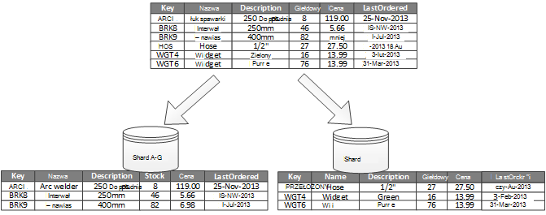
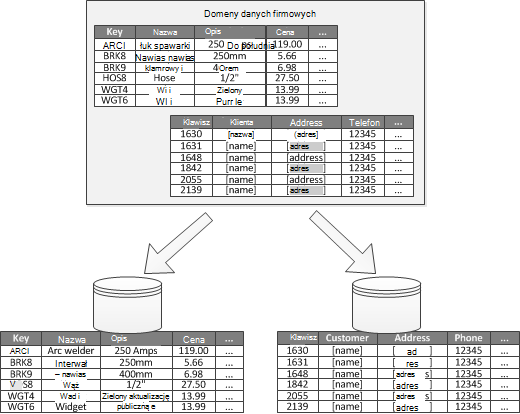

<properties
   pageTitle="Dane podziału wskazówki | Microsoft Azure"
   description="Wskazówki dotyczące sposobu oddzielić partycje zarządzania i dostępne oddzielnie."
   services=""
   documentationCenter="na"
   authors="dragon119"
   manager="christb"
   editor=""
   tags=""/>

<tags
   ms.service="best-practice"
   ms.devlang="na"
   ms.topic="article"
   ms.tgt_pltfrm="na"
   ms.workload="na"
   ms.date="07/14/2016"
   ms.author="masashin"/>

# Wskazówki dotyczące podziału danych

[AZURE.INCLUDE [pnp-header](../includes/guidance-pnp-header-include.md)]

## Omówienie

W wiele dużych rozwiązań danych jest podzielone na osobne partycje, które mogą być dostępne i zarządzane oddzielnie. Strategia podziału musi być wybrana starannie maksymalizować świadczenia minimalizując niekorzystne. Podział może pomóc poprawić skalowalność, zmniejszenie konfliktu i optymalizacji wydajności. Inną zaletą podziału jest możliwość uzyskania mechanizm dzielenia danych przez sposobu użycia. Na przykład można archiwizować starsze, mniej aktywnego (zimnej) danych w tańsze przechowywania danych.

## Dlaczego dzielenia danych?

Większość aplikacje w chmurze i usługi przechowywania i pobierania danych jako część ich działania. Projekt magazynów używanych przez aplikację mogą mieć znaczenie na wydajność, wydajność i skalowalność systemu. Jedną metodę, która jest często stosowana w dużych systemach jest dzielenia danych na osobne partycje.

> Termin _podziału_ używanej w tych wskazówek odwołuje się do proces fizycznie dzielenia danych w osobnych danych sklepy. To nie taka sama, jak podziału tabeli programu SQL Server, czyli różnych koncepcji.

Podział danych można oferują szereg korzyści. Na przykład mogą być stosowane w celu:

- **Usprawnianie skalowalność**. W przypadku skalowania system jednej bazie danych po pewnym czasie będzie nawiązywać połączenia limit sprzętu. Jeśli dzielenia danych w wielu partycje, każdy z nich znajduje się na serwerze oddzielnych, można skalować systemu niemal czas nieokreślony.
- **Poprawa wydajności**. Operacje na danych programu access na każdym partition miejsce na mniejszych ilości danych. Pod warunkiem, że dane jest podzielony na partycje w odpowiedni sposób, podziału może spowodować, że system efektywniejsze. Operacje, które mają wpływ na więcej niż jedną partycją można uruchamiać równolegle. Każdy partition może znajdować się w aplikacji, która używa go w celu zminimalizowania czasu oczekiwania w sieci.
- **Popraw dostępność**. Wyodrębniania danych na wielu serwerach pozwala uniknąć pojedynczego punktu awarii. Jeśli serwer nie powiedzie się, lub jest planowanej konserwacji tylko dane w tym partycją jest niedostępny. Operacje na partycje można kontynuować. Zwiększenie liczby partycje zmniejsza odpowiedni wpływ awarii pojedynczego serwera, redukując wartość procentową dane, które będą niedostępne. Replikacja każdego partition jeszcze bardziej zmniejszyć ryzyko uszkodzenia jedną partycją operacji. Również niemu można rozdzielić krytycznych danych, które musi być stale i wysoce dostępne w niskiej wartości danych, który zawiera dolnym wymagań dotyczących dostępności (na przykład plików dziennika).
- **Poprawianie zabezpieczeń**. W zależności od rodzaju dane i jak jest podzielona, może się zdarzyć podzielić poufne i zależne od innych niż na innym partycje i w związku z tym do różnych serwerów lub dane są przechowywane. Zabezpieczenia można następnie specjalnie zoptymalizowanej dla ważnych danych.
- **Podaj elastyczność działania**. Podział oferuje wiele możliwości cienkie dostosowywania operacji, maksymalizacja skuteczności administracyjnej i zminimalizowania koszt. Na przykład można zdefiniować różne techniki zarządzania, monitorowania, wykonywanie kopii zapasowych i przywracanie i innych zadań administracyjnych oparta na znaczeniu danych w każdym partycją.
- **Uwzględnij dane przechowywane we wzorcu użytkowania**. Podział umożliwia każdego partition do wdrożenia na innego typu magazynu danych, na podstawie kosztu i wbudowanych funkcji magazyn ofert w danych. Na przykład dużych danych binarnych mogą być przechowywane w magazynie obiektów blob danych, gdy więcej danych strukturalnych może być przechowywana w bazie danych dla dokumentu. Aby uzyskać więcej informacji, zobacz [Tworzenie polyglot rozwiązania] w podręczniku desenie i wskazówki dotyczące i [wysoce scalable rozwiązań dostępu do danych: za pomocą SQL, NoSQL i utrzymywanie polyglot] w witrynie sieci Web firmy Microsoft.

Niektóre systemy nie zaimplementować podziału, ponieważ jest traktowany jako koszt zamiast korzyści. Najczęstsze przyczyny tego uzasadnienie obejmują:

- Wiele systemów przechowywania danych nie obsługują sprzężenia przez partycje i może być trudne zachować więzy integralności w układzie podzielonym na partycje. Należy często zaimplementować sprzężeń i integralności sprawdza w kodzie aplikacji (w warstwie podziału), co może spowodować dodatkowe We/Wy i złożoność aplikacji.
- Zachowywanie partycje nie zawsze jest uproszczony zadania. W systemie miejsce, w którym dane są nietrwałe może być konieczne wyrównać partycje okresowo w celu zmniejszenia konfliktu i punkty aktywne.
- Kilka typowych narzędzi nie działają sposób naturalny podzielone na partycje danych.

## Projektowanie partycje

Dane można rozdzielonymi na różne sposoby: poziomie, w pionie lub w funkcjonalny. Strategii, która zostanie wybrana opcja zależy od przyczyny podziału danych i wymagania dotyczące aplikacji i usług, korzystających z danych.

> [AZURE.NOTE] Systemy podziału opisanego w tych wskazówek zostały omówione w sposób niezależny od technologii miejsca do magazynowania danych. Można stosować do wielu typów magazynów danych, w tym relacyjne i NoSQL baz danych.

### Strategie podziału

Są trzy typowe strategii do podziału danych:

- **Podział poziomy** (często nazywane _sharding_). W tym strategii każdego partycją jest danych przechowywanych w osobnym, ale wszystkie partycje jest tego samego schematu. Każdy partition nosi nazwę _shard_ i przytrzymuje określony podzestaw danych, takich jak wszystkich zamówień dla określonego zestawu klientów w aplikacji elektronicznego.
- **Pionowy podział**. W tym strategii każdego partition zawiera podzbiór pola dla elementów w magazynie danych. Pola są podzielone według ich sposobu użycia. Na przykład często używanych pól może znajdować się w jedną partycją pionowy i mniej często używanych pól w innym.
- **Funkcjonalne podziału**. W tym strategii danych jest agregowane według jak są one używane przez każdego ograniczonych kontekstu w systemie. Na przykład elektronicznego system że narzędzi oddzielić funkcje firm faktury i Zarządzanie zapasami produktu może przechowywać dane faktury w jedną partycją i produktu danych zapasów w innym.

Należy pamiętać, można łączyć trzy strategii opisanych tutaj. Nie są one wzajemnie wykluczających się, a firma Microsoft zaleca, rozważ ich wszystkich podczas projektowania schemat podziału. Na przykład możesz dzielenia danych na odłamki i następnie dalszych podzielić dane w każdym shard za pomocą podziału w pionie. Podobnie dane w partycją funkcjonalności można podzielić na odłamki (które można również pionowo rozdzielonymi).

Jednak różne wymagania dotyczące poszczególnych strategii można podnieść liczba problemów powodujących konflikty. Ocenia i saldo wszystkie te podczas projektowania schemat podziału, która spełnia cele wydajności ogólnej przetwarzania danych dla systemu. Poniższe sekcje Eksplorowanie każdej strategii bardziej szczegółowo.

### Poziomy podział (sharding)

Rysunek 1 zawiera omówienie podziału w poziomie lub sharding. W tym przykładzie dane zapasów produktu jest podzielony na odłamki według klucza produktu. Każdy shard przechowuje dane dla ciągły zakres kluczy shard (A-G i H Z), zorganizowane w kolejności alfabetycznej.

_Rysunek 1. Poziomo podziału danych (sharding) oparte na kluczu partition_

Sharding ułatwia rozłożyć obciążenie na większej liczbie komputerów, które ograniczyć konflikty i zwiększa wydajność. Po dodaniu dodatkowych odłamki uruchamianych na dodatkowych serwerach, można skalować system się.

Współczynnik najważniejszych podczas wykonywania tej strategii podziału jest wybór klucza sharding. Może być trudne Zmienianie klucza po systemu. Klucz należy zagwarantować, że dane jest podzielona tak, aby obciążenie pracą jest możliwie jak nawet przez odłamki.

Należy zauważyć, że różnych odłamki musi zawierać podobne ilości danych. Zamiast ważniejszych uwagę jest saldo liczba żądań. Niektóre odłamki mogą być bardzo duże, ale każdy element jest temat najmniejszą liczbę operacji dostępu. Inne odłamki może być mniejszy, ale każdego elementu jest dostępny częściej. Jest również ważne, aby zapewnić, że pojedynczy shard nie przekracza limity skali (pod względem pojemność i przetwarzania zasobów) magazynu danych, który jest używany do obsługi tego shard.

Jeśli używasz systemu sharding, należy unikać tworzenia punktów aktywnych (lub partycje ciepłej) które mogą mieć wpływ na wydajność i dostępność. Użycie skrótu identyfikator klienta zamiast pierwsza litera nazwy klienta, na przykład zapobiec niedopasowane dystrybucyjnej, będącej wynikiem typowe i mniej powszechne początkowe litery. Jest to metoda typowe, który ułatwia pracę bardziej równomiernie rozpowszechnianie danych przez partycje.

Wybierz klucz sharding, która minimalizuje wymagań przyszłych, aby podzielić duże odłamki na mniejsze części połączenie małe odłamki na partycje większe lub zmienianie schematu opisujący dane przechowywane w zestawie partycje. Te operacje mogą być bardzo czasochłonne i może wymagać przełączanie odłamki jeden lub więcej trybu offline, gdy są wykonywane.

Odłamki są replikowane, może być możliwe utrzymywanie niektóre replik w trybie online, podczas gdy inne są dzielenie, scalone lub skonfigurować. Jednak system może być konieczne ograniczyć operacji, które mogą być wykonywane na danych w tych odłamki podczas odbywa się zmianę konfiguracji. Na przykład dane w repliki może zostać oznaczony jako tylko do odczytu do ograniczania zakresu inconsistences, które mogą wystąpić podczas restrukturyzacji odłamki.

> Aby uzyskać bardziej szczegółowe informacje i wskazówki dotyczące wiele z tych zagadnieniach i zalecane techniki projektowania magazynów, implementujących poziomy podział zobacz [Sharding wzorca].

### Pionowy podział

Najczęściej używane do podziału w pionie jest skrócenie/Wy i wydajności koszty skojarzone z pobierania elementów, które są najczęściej dostępne. Rysunek 2 przedstawia przykładową podziału w pionie. W tym przykładzie różne właściwości dla każdego elementu danych odbywa się w różnych partycje. Jedna zawiera dane, który jest dostępny, w tym nazwę, opis i informacje o cenach produktów. Inny zawiera objętość zapasów i ostatnią datę numerowana.

_Rysunek 2. Pionowo podziału danych według wzorcem użytkowania_

W tym przykładzie aplikacja regularnie odwołuje się nazwa produktu, opis i cena przy wyświetlaniu szczegóły produktu dla klientów. Poziom zapasów i datę, kiedy produktu ostatniego zamówienia od producenta są przechowywane w osobne partycje, ponieważ te dwa elementy są często używane razem.

Ten schemat podziału przewaga dodano że stosunkowo wolno przenoszenie danych (nazwa produktu, opis i cena) są rozdzielone w bardziej dynamiczne danych (poziom zapasów i ostatnią datę numerowana). Aplikacja może okazać korzystne pamięci podręcznej spowalniać przenoszenia danych przechowywanych w pamięci, jeśli często jest dostępny.

Inny typowy scenariusz tej strategii podziału jest maksymalne zwiększenie bezpieczeństwa poufnych danych. Na przykład możesz to zrobić numerów kart kredytowych i odpowiadające im numery Weryfikacja zabezpieczeń kart są przechowywane w osobnym partycje.

Pionowy podział można również zmniejszyć ilość równoczesne programu access, potrzebne do danych.

> Pionowy podział działa na poziomie jednostki w magazynie danych, częściowo normalizowanie jednostka, aby podzielić je z _szerokości_ elementu do zestawu _zawęzić_ elementów. Jest idealnym rozwiązaniem dla magazynów Kolumnowa danych, takich jak HBase i Cassandra. Jeśli dane w kolekcji kolumn nie może zmienić, można też rozważyć użycie kolumnie są przechowywane w programie SQL Server.

### Podział funkcjonalności

Systemów miejsce, w którym jest możliwe do identyfikowania ograniczonych kontekstu dla każdego obszaru biznesowych lub usługi w aplikacji funkcjonalności podziału przewiduje techniką zwiększanie wydajności dostępu izolacji i danych. Inne typowe zastosowanie funkcjonalności podziału jest oddzielenia odczytu i zapisu danych tylko do odczytu danych, które jest używane w raportach. Rysunek 3 zawiera omówienie funkcjonalności podziału miejsce, w którym dane zapasów jest oddzielony od danych klientów.

_Rysunek 3. Funkcjonalny podziału danych według kontekstu ograniczone lub poddomeny_

Ten podziału strategii można ograniczyć konfliktu dostępu do danych przez różne części systemu.

## Projektowanie partycje dla skalowalność

Koniecznie należy rozważyć, czy rozmiar i obciążenie pracą dla każdego partycją i saldo je tak, aby dane są przesyłane do osiągnięcia maksymalnej skalowalność. Również musi jednak podzielić dane, tak aby nie przekracza limity skalowania magazynu jedną partycją.

Podczas projektowania partycje dla skalowalność, wykonaj następujące czynności:

1. Analizowanie aplikacji w celu zrozumienia wzorce dostępu do danych, takich jak rozmiar zestawu wyników zwróconych przez kwerendę każdej, częstotliwość dostępu, opóźnienie związane i po stronie serwera obliczeniowych wymagania dotyczące przetwarzania. W większości przypadków kilka główne jednostki będzie wymagało większość zasobów przetwarzania.
2. Analiza służą do określania docelowych obecne i przyszłe skalowalność, takich jak rozmiar danych i obciążenie pracą. Następnie rozłożenie dane w partycje spotkania docelowej skalowalność. W poziomie strategii podziału wybierania klucza shard odpowiednie koniecznie upewnij się, że rozkład jest parzysta. Aby uzyskać więcej informacji zobacz [Sharding deseniu].
3. Upewnij się, że zasobów dostępnych dla każdego partition są wystarczające do obsługi wymagania skalowalność pod względem danych, rozmiar i przepustowość. Na przykład węzeł obsługujący partycją może nałożyć stały limit ilości miejsca do magazynowania przetwarzania power lub przepustowość sieci, które znajdują się w nim. W przypadku mogących przekraczają limity te wymagania dotyczące przechowywania i przetwarzania danych może być konieczne uściślić strategii dotyczącej podziału lub dalsze dzielenie danych. Na przykład jeden z nich skalowalność może być celu oddzielenia rejestrowania danych podstawowych funkcji aplikacji. W tym celu zapobieganie wymagania dotyczące miejsca do magazynowania wszystkich danych z przekroczenie limitu skalowania węzła przy użyciu oddzielnych magazynów. Całkowita liczba magazynów danych przekracza limit węzeł, może być konieczne użycie węzły oddzielnie.
4. Monitorowanie systemu w obszarze używanie w celu potwierdzenia, że dane są przesyłane zgodnie z oczekiwaniami i obsługi obciążenia nakłada się na ich przez partycje. Istnieje możliwość użycia nie ma odpowiednika obciążenie przewiduje się w analizie. W takim przypadku może być możliwe wyrównać partycje. W przypadku braku, może być konieczne do niektórych części system w celu uzyskania wymagane saldo.

Należy zauważyć, że niektóre środowiska chmury przydzielanie zasobów za pomocą granic infrastruktury. Upewnij się, że limity granic zaznaczonego zapewniają miejsca na dowolnym przewidywany wzrost ilości danych, przechowywanie danych, power przetwarzania i przepustowość.

Na przykład jeśli korzystasz z magazynem tabel platformy Azure, zajęty shard może wymagać większej ilości zasobów, niż są dostępne dla jedną partycją do obsługi żądań. (Istnieje limit liczby żądań, które są obsługiwane przez jedną partycją w określonym przedziale czasu. Zobacz stronę [elementów docelowych wydajność i skalowalność Azure miejsca do magazynowania] w witrynie sieci Web firmy Microsoft, aby uzyskać więcej informacji).

 Jeśli jest to możliwe, shard może być konieczne zmodyfikowanie partycji, tak aby rozdzielić obciążenie. Jeśli całkowity rozmiar lub przepustowość w poniższych tabelach przekracza możliwości konta miejsca do magazynowania, może być konieczne utworzenie kont dodatkowego miejsca do magazynowania i rozmieszczony tabele tych kont. Jeśli liczba kont miejsca do magazynowania jest większa niż liczba kont, które są dostępne dla subskrypcji, następnie może być konieczne użycie wiele subskrypcji.

## Projektowanie partycje dla wydajności kwerend

Często być zwiększane wydajności kwerend, za pomocą mniejsze zestawy danych i uruchamiając zapytania równolegle. Każdy partition powinien zawierać małą część całego zestawu danych. Zmniejszenie głośności poprawić wydajność kwerend. Jednak podziału jest alternatywy do projektowania i odpowiednio Konfigurowanie bazy danych. Na przykład upewnij się, że jest to konieczne indeksy w miejscu, jeśli korzystasz z relacyjnej bazy danych.

Podczas projektowania partycje dla wydajności kwerend, wykonaj następujące czynności:

1. Sprawdź wymagania aplikacji i wydajności:
    - Umożliwia określenie krytyczne kwerend, które należy zawsze szybko wykonać wymagania.
    - Monitorowanie systemu do identyfikowania wszelkich kwerend, które działać wolniej.
    - Ustalić, które kwerendy są najczęściej wykonywane. Jedno wystąpienie każda kwerenda może być minimalnych kosztach, ale skumulowana zużycie zasobów może mieć znaczenie. Może to być korzystne oddzielić dane, które są pobierane przez te zapytania do różnych partycją lub nawet pamięci podręcznej.
2. Partition danych, który powoduje spadek wydajności:
    - Ograniczyć rozmiar każdej partition, tak aby czas reakcji zapytania znajduje się w obrębie docelowej.
    - Projektowanie klucz shard tak, aby aplikacja łatwo można znaleźć partycją, w przypadku wdrażania podziału w poziomie. Zapobiega to konieczności przeglądania wszystkich partition kwerendy.
    - Należy rozważyć lokalizacji partycją. Jeśli to możliwe spróbuj przechowywania danych w partycje, które są geograficznie aplikacji i użytkowników, które do niego dostęp.
3. Jeśli obiekt zawiera wymagania dotyczące wydajności przepustowość i kwerendy, za pomocą funkcjonalności podziału na podstawie tej jednostki. Jeśli to nadal nie spełnia wymagań, można zastosować także poziomy podział. W większości przypadków wystarczy pojedynczy strategii podziału, ale w niektórych przypadkach jest bardziej efektywne, aby połączyć dwie strategie.
4. Warto rozważyć użycie asynchroniczne zapytania, które równolegle przez partycje w celu zwiększenia wydajności.

## Projektowanie partycje dostępności

Podział danych można zwiększyć dostępność aplikacji w celu zapewnienia cały zestaw danych nie stanowi pojedynczy punkt awarii i niezależne zarządzane poszczególnych podzbiór zestawu danych. Replikacja partycje, które zawierają krytycznych danych można zwiększyć dostępność.

Projektując i wdrażając partycje, należy rozważyć następujące czynniki, które mają wpływ na dostępność:

- **Jak krytycznych danych ma prowadzonej działalności**. Niektóre dane mogą zawierać ważnych informacji biznesowych takich jak Szczegóły faktury lub transakcji bankowych. Inne dane mogą zawierać mniej ważnych danych operacyjnych, takich jak pliki dziennika, śledzenia wydajności i tak dalej. Po odnalezieniu każdego typu danych, należy rozważyć, czy:
    - Krytyczne dane są przechowywane w wysoce dostępne partycje za pomocą odpowiedniego planu wykonywania kopii zapasowych.
    - Ustanawianie osobnych zarządzania i monitorowania mechanizmy lub procedury różnych criticalities z każdego zestawu danych. Zaznacz dane, które ma taki sam poziom można w tym samym partition jego kopię zapasową można razem przy odpowiedniej częstotliwości. Na przykład partycje, które zawierają dane dla transakcji bankowych może być konieczne kopii zapasowej częściej niż partycje, które zawierają informacje o śledzeniu lub rejestrowanie.
- **W jaki sposób można zarządzać poszczególne partycje**. Projektowanie partycje do obsługi niezależnych zarządzania i konserwacja ma wiele zalet. Na przykład:
    - Jeśli partycją nie powiedzie się, czy można odzyskać niezależnie bez wpływu na wystąpień aplikacji, które uzyskiwać dostęp do danych w innych partycje.
    - Podział danych według obszaru geograficznego umożliwia zaplanowanych zadań występowały w mniejszego dla każdej lokalizacji. Upewnij się, że partycje nie są zbyt duży, aby uniemożliwić ukończenie w tym okresie dowolnego planowanej konserwacji.
- **Czy chcesz odtworzyć ważnych danych przez partycje**. Ta strategia poprawić dostępność i wydajność, chociaż może spowodować problemy zgodności. Czas dla zmiany wprowadzone w danych w partycją mają zostać zsynchronizowane z każdej replice. W tym okresie różne partycje będzie zawierać dane różnych wartości.

## Opis podziału wpływu projektowania i opracowywania

Za pomocą podziału dodaje złożoności projektu i rozwoju systemu. Należy rozważyć możliwość podziału jako podstawową częścią projektu systemu nawet wtedy, gdy w systemie, początkowo zawiera tylko jedną partycją. Jeśli adresu podziału jako ciągle podczas uruchamiania systemu na wydajność i skalowalność problemy, złożoność zwiększa, ponieważ masz już systemie aktywnym, aby zachować.

Po zaktualizowaniu system w celu włączenia podziału w tym środowisku wymaga modyfikowanie logika danych programu access. Może również obejmować Migrowanie dużych ilości istniejących danych do rozpowszechniania przez partycje często podczas oczekiwać użytkownicy mogli kontynuować korzystanie z systemu.

W niektórych przypadkach podziału nie są uwzględniane ważne ponieważ początkowego zestawu danych jest niewielka, a może być łatwo obsługiwanych przez jeden serwer. Może to być spełnione w systemie, która nie jest planowane przeskalować poza jego rozmiar początkowy, ale wiele systemów komercyjnego konieczne rozwiń jako liczba podwyżki użytkowników. Ten rozszerzeń zwykle towarzyszy wzrost ilości danych.

Jest również pamiętać, że podziału nie zawsze jest funkcją sklepy dużych danych. Na przykład magazynu małych danych może być intensywnie dostęp do setki równoczesne klientów. Podziału danych w tej sytuacji może pomóc zmniejszenie konfliktu i zwiększyć produktywność.

Podczas projektowania schemat podziału danych, rozważ następujące wskazówki:

- **Jeśli to możliwe, zachować dane najbardziej typowych operacji bazy danych w każdej partition, aby zminimalizować operacji dostępu danych między partycją**. Wykonywanie zapytań w partycje mogą być bardziej czasochłonne niż kwerenda tylko w jedną partycją, ale optymalizowania partycje jednego zestawu kwerend mogą negatywnie wpłynąć na inne zestawy kwerend. Nie można uniknąć, wykonywanie zapytań w partycje, zminimalizować czas kwerendy, uruchamiając zapytania równolegle, a następnie zsumowanie wyników w aplikacji. Tej metody może nie być możliwe w niektórych przypadkach, na przykład gdy jest to konieczne do uzyskania wyniku z jednego zapytania i używać go w następnej kwerendy.
- **Aby zapytań za pomocą odwołania względnie statyczne danych, takich jak tabele kod pocztowy lub listy produktów, warto rozważyć replikacji danych we wszystkich partycje w celu zmniejszenia wymagania operacji wyszukiwania oddzielnych w różne partycje**. Tej metody można również zmniejszyć prawdopodobieństwo staje się "ciepłej" zestawu danych, który podlega duży ruch z całego systemie danych źródłowych. Istnieje jednak dodatkowe koszty skojarzone z synchronizowanie wszelkie zmiany, które mogą się pojawić odwoływanie się do tego danych.
- **Jeśli to możliwe, minimalizowanie wymagania dotyczące więzów integralności przez pionowe i funkcjonalności partycje**. W tych programów aplikacji jest odpowiedzialny za obsługę więzów integralności w partycje, gdy dane są aktualizowane i zużyte. Zapytania, które należy dołączyć do danych w wielu partycje działać wolniej, niż zapytania, które dołączanie danych tylko w tym samym partition, ponieważ wymagane zwykle przez aplikację do wykonywania kolejnych kwerend opartych na kluczu, a następnie na klucz obcy. Należy rozważyć replikacji lub Anuluj normalizowanie odpowiednie dane. Aby zminimalizować czas kwerendy, w których należy sprzężenia krzyżowe partition uruchamiania zapytania równolegle przez partycje i Dołącz do danych w aplikacji.
- **Należy rozważyć, czy odpowiedni efekt schemat podziału może być dotyczących zgodności danych przez partycje.** Sprawdzić, czy silnego spójności jest faktycznie wymagane. Wspólne podejście w chmurze jest wdrożenie ewentualne spójności. Dane w każdym partition zostaną zaktualizowane oddzielnie, a logiki aplikacji gwarantuje, że aktualizacje są wszystkie zakończone pomyślnie. Obsługuje ona również niespójności, które mogą wynikać z badania danych, gdy jest uruchomiony po pewnym czasie spójne działanie. Aby uzyskać więcej informacji dotyczących implementowania ewentualne spójności zobacz [Elementarz spójności danych].
- **Należy rozważyć, czy jak kwerendy odszukaj partycją poprawne**. Jeśli kwerenda zeskanować wszystkie partycje, aby zlokalizować wymagane dane, jest znaczący wpływ na wydajność, nawet wtedy, gdy wielu zapytań równoległe są uruchomione. Zapytania, które są używane przez pionowe i funkcjonalności strategii podziału można określić sposób naturalny partycje. Jednak poziomy podział (sharding) mogą być lokalizowanie elementu trudne, ponieważ każdy shard ma ten sam schemat. Typowe rozwiązanie sharding jest zachowanie mapy, który może być używany do wyszukiwania lokalizacji shard dla określonych elementów danych. To mapowanie można zaimplementowana w logiczny sharding aplikacji lub obsługiwany przez magazynu danych, jeśli obsługuje sharding przezroczysty.
- **Podczas korzystania z poziomej strategii podziału, należy rozważyć, czy okresowe ponowne równoważenie odłamki**. Dzięki temu równomierne danych, rozmiar i obciążenie pracą zminimalizować punkty aktywne, maksymalizowanie wydajności kwerend i obejść ograniczenia magazyn fizyczny. Jednak to zadanie skomplikowane, której często wymaga narzędzia niestandardowego lub procesu.
- **Jeśli powielić każdej partition zapewnia dodatkową ochronę przed awariami**. Jeśli pojedynczej replice kończy się niepowodzeniem, kwerendy można skierowany do jego kopię roboczą.
- **Jeśli przejdziesz fizycznie limity strategii podziału, może być konieczne rozszerzenie skalowalność na inny poziom**. Na przykład, w przypadku podziału na poziomie bazy danych, może być konieczne Znajdź lub powielić partycje w wielu baz danych. Jeśli podziału znajduje się już na poziomie bazy danych i są fizycznie ograniczenia problemu, może to oznaczać, że chcesz zlokalizować lub powielić partycje w wielu kont hostingu.
- **Unikanie transakcje, które dostęp do danych w wielu partycje**. Niektóre dane sklepy implementowanie transakcji spójności i operacji który zmodyfikować dane, ale tylko wtedy, gdy danych znajduje się w jedną partycją. Jeśli potrzebujesz obsługę transakcji w wielu partycje, prawdopodobnie będzie konieczne zaimplementować to część logiki aplikacji, ponieważ najbardziej podziału systemy nie są dostępne aktualizacje natywnych.

Wszystkie sklepy danych wymagają niektórych zarządzanie operacyjne i monitorowanie aktywności. Zadania mogą różnić się od ładowania danych, wykonywanie kopii zapasowych i przywracanie danych zmiana danych i zapewnienie, że system działa prawidłowo i efektywne.

Należy rozważyć następujące czynniki, które mają wpływ na zarządzanie operacyjne:

- **Jak wdrażać odpowiednie zarządzania i zadań operacyjnych, gdy jest podzielona danych**. Te zadania mogą zawierać kopia zapasowa i przywracanie archiwizowanie danych monitorowania systemu oraz innych zadań administracyjnych. Na przykład zachowując logicznej spójności podczas operacji kopii zapasowych i przywracania może być trudne.
- **Jak załadować dane do wielu partycje i dodawanie nowych danych, który jest otrzymywanej z innych źródeł**. Niektóre z narzędzi może nie obsługuje operacji sharded danych, takich jak ładowania danych do partycją poprawne. Oznacza to, że może być konieczne tworzyć lub uzyskać z nowych narzędzi.
- **Jak archiwizowanie i usuwanie danych w regularnych odstępach**. Aby zapobiec nadmiarowe wzrostu partycje, musisz archiwizowanie i usuwanie danych na bieżąco (prawdopodobnie co miesiąc). Może być konieczne Przekształcanie danych zgodnie z archiwum inny schemat.
- **Jak zlokalizować problemów integralności danych**. Rozważ uruchomienie okresowych procesu, aby zlokalizować wszelkich problemów integralności danych, takich jak danych w jedną partycją, odwołujące się do brakujących informacji w innym. Proces, można albo próba automatycznie rozwiązać te problemy lub podnieść alert operatora ręcznie rozwiąż problemy. Na przykład w aplikacji elektronicznego, informacje o zamówieniach mogą być przechowywane w jedną partycją, ale pozycje, które stanowią poszczególnych zamówień mogą być przechowywane w innej. Proces umieszczania zamówienia należy dodać dane do innych partycje. Jeśli ten proces zakończy się niepowodzeniem, mogą być pozycje przechowywane dla których nie ma żadnych odpowiedniego zamówienia.

Technologie miejsca do magazynowania danych umożliwiają zazwyczaj własne funkcje do obsługi podziału. Poniższe sekcje podsumowanie opcji, które są wykonywane przez magazynów często używane przez aplikacje Azure. Zostały także opisane zagadnienia dotyczące projektowania aplikacje, które najlepiej korzystać z tych funkcji.

## Strategie podziału bazy danych SQL Azure

Baza danych SQL Azure to relacyjne bazy danych — jako a usługa uruchamianej w chmurze. Zależy programu Microsoft SQL Server. Informacje w tabelach dzieli relacyjnej bazy danych, a każda tabela zawiera informacje podmioty jako seria wierszy. Każdy wiersz zawiera kolumny, które zawierają dane dla poszczególnych pól jednostki. Strony [Co to jest baza danych SQL Azure?] w programie Microsoft witryna sieci Web zawiera szczegółowe dokumentacji dotyczących tworzenia i używania bazy danych SQL.

## Poziomy podział elastyczne baza danych

Pojedyncza baza danych SQL ma limit ilości danych, która może zawierać. Przepustowość jest ograniczona, architektura czynników i liczba równoległych połączeń, które obsługuje. Funkcja elastyczne bazy danych bazy danych SQL obsługuje skalowanie w poziomie dla bazy danych SQL. Za pomocą elastyczne bazy danych, można podzielić danych do odłamki, które są rozciągnąć wiele baz danych programu SQL. Można dodać lub usunąć odłamki wielkość dane potrzebne do obsługi powiększa się i zmniejsza. Za pomocą elastyczne bazy danych można również zmniejszyć konfliktu przekazując Załaduj baz danych.

> [AZURE.NOTE] Elastyczne baza danych jest zastąpienie dla funkcji federacje bazy danych SQL Azure. Istniejące instalacje, możesz przeprowadzić migrację elastyczne bazy danych za pomocą narzędzia migracji federacje Federacji bazy danych SQL. Można także zaimplementować własny mechanizm sharding, jeśli rozwiązania nadają się sposób naturalny do funkcji, które są dostarczane przez elastyczne bazy danych.

Każdy shard jest zaimplementowana jako bazy danych SQL. Shard może zawierać więcej niż jeden zestaw danych (nazywane _shardlet_). Każdej bazy danych przechowuje metadane opisujące shardlets, który zawiera. Shardlet może być element pojedynczy danych lub może być grupę elementów, które współużytkują ten sam klucz shardlet. Na przykład jeśli sharding danych w aplikacji multitenant, klucz shardlet może być identyfikator dzierżawy, a wszystkie dane dla danej dzierżawy może być przechowywana jako część samego shardlet. Dane dla innych dzierżaw czy przechowywanych w różnych shardlets.

Odpowiada programisty skojarzyć zestawu danych przy użyciu klucza shardlet. Oddzielnej bazy danych SQL działa jako Menedżer mapy shard globalny. Ta baza danych zawiera listę wszystkich odłamki i shardlets w systemie. Aplikacji klienckiej, która uzyskuje dostęp do danych łączy najpierw globalnej shard mapy Menedżera bazy danych uzyskanie kopii na mapie shard (Lista odłamki i shardlets), która go następnie buforowanie lokalnie.

Następnie aplikacja korzysta z tych informacji rozsyłanie żądań danych do odpowiedniej shard. Ta funkcja jest ukryty za serię interfejsów API, które są zawarte w Azure SQL bazy danych elastyczne bazy danych klienta biblioteki, który jest dostępny w pakiecie NuGet. Na stronie [Przegląd funkcji elastyczne bazy danych] w witrynie sieci Web firmy Microsoft jest bardziej zaawansowane wprowadzenie do elastycznych bazy danych.

> [AZURE.NOTE] Można replikować globalnej shard mapy i bazą danych Menedżera zmniejszyć opóźnienie zwiększyć dostępność. W przypadku zastosowania bazy danych przy użyciu jednej z warstw cennik Premium, można skonfigurować aktywnej replikacji geo stale kopiowania danych do bazy danych z różnych regionów. Utwórz kopię bazy danych w każdym regionie podstawie użytkowników. Skonfiguruj aplikację, aby nawiązać połączenie tej kopii uzyskanie mapy shard.

> Podejściem alternatywnym jest powielić bazie danych shard mapy Menedżera wielu regionów za pomocą synchronizacja danych SQL Azure lub potok Azure danych Factory. Ten formularz replikacji działa okresowo i łatwiejszy zmiana mapy shard rzadko. Ponadto shard Menedżera mapy z bazy danych nie ma ma zostać utworzony przy użyciu Premium ceny warstwy.

Elastyczne bazy danych zawiera dwa schematy mapowania danych na shardlets i zapisywanie ich w odłamki:

- **Mapa shard lista** zawiera opis skojarzenie między jednego klucza i shardlet. Na przykład w układzie multitenant dane dla każdego dzierżawy mogą być skojarzone z Unikatowy klucz i przechowywane w osobnym shardlet. Do zapewnienia prywatności i izolacji (oznacza to, aby uniemożliwić opisuje wykorzystaniu zasobów magazynowania danych dostępne dla innych użytkowników), każdego shardlet może być przechowywana w osobnym shard.

_Rysunek 4. Przy użyciu mapy shard listy do przechowywania danych dzierżawy w osobnym odłamki_

- **Mapa shard zakres** zawiera opis skojarzenie między zestaw ciągłe wartości klucza i shardlet. W tym przykładzie multitenant wspomniano, jako alternatywę do wykonania dedykowane shardlets można grupować dane dla zestawu dzierżaw (każda z własnych kluczy) w tym samym shardlet. Ten program jest drogich mniej niż pierwszy wiersz (ponieważ dzierżaw współużytkowanie zasobów miejsca do magazynowania danych), ale również tworzy ryzyko izolacji i prywatności ograniczona danych.

_Rysunek 5. Przy użyciu mapy shard zakresu do przechowywania danych dla zakresu dzierżaw w shard_

Należy zauważyć, że pojedynczy shard może zawierać dane dla kilku shardlets. Na przykład można użyć listy shardlets do przechowywania danych dla różnych nieciągłych dzierżawami w tym samym shard. Możesz łączyć shardlets zakres i shardlets listy, w tym samym shard, mimo że radzenia sobie za pośrednictwem innej mapy w bazie danych Menedżera mapy shard globalnego. (Shard globalnej menedżera mapy z bazy danych może zawierać wiele map shard). Rysunek 6 przedstawia tej metody.

_Rysunek 6. Wykonywania wielu shard mapy_

W przypadku zastosowania schemat podziału mogą mieć znaczenie na wydajność systemu. Może też na stawek, w którym odłamki trzeba dodać lub usunąć, lub rate, jaką danych musi być ponownie podzielony na partycje na odłamki. Przy użyciu elastyczne bazy danych do partycją danych, należy uwzględnić następujące punkty:

- Grupowanie danych używaną razem w tym samym shard i uniknąć operacji, które potrzebują dostępu do danych, który jest przechowywany w wielu odłamki. Należy pamiętać, że elastyczne bazy danych i shard jest baza danych SQL w osobnym i bazy danych SQL Azure nie obsługuje sprzężenia między bazami danych, (które mają zostać wykonane po stronie klienta). Należy pamiętać, że w bazie danych SQL Azure, ograniczenia integralności referencyjnej, wyzwalaczami i procedur składowanych w jednej bazie danych nie można odwoływać się do obiektów w innym. Dlatego nie projektowanie systemu, który ma zależności między odłamki. Baza danych SQL można jednak zawierać tabel, które zawierają kopii danych źródłowych często używane przez kwerend i innych operacji. W poniższych tabelach musi należeć do dowolnego określonego shardlet. Replikacji danych przez odłamki umożliwia usuwanie potrzeby łączenie danych wyświetlanego baz danych. Najlepiej, jeśli takie dane powinny być statyczne przenoszenia spowolnić zminimalizować nakładu replikacji i zmniejszyć szanse jej przedawnieniu.

    > [AZURE.NOTE] Mimo że baza danych SQL nie obsługuje sprzężenia między bazami danych, można wykonywać kwerend krzyżowych shard za pomocą elastyczne interfejsu API bazy danych. Te kwerendy można przezroczysty iterację dane przechowywane w wszystkie shardlets, do których odwołuje się mapy shard. Podziały elastyczne interfejsu API bazy danych w shard między kwerendy w dół do serii poszczególnych kwerend (po jednej dla każdej bazy danych) i następnie scala wyniki. Aby uzyskać więcej informacji zobacz stronę [shard wielu kwerend] w witrynie sieci Web firmy Microsoft.

- Dane przechowywane w shardlets, które należą do samej mapy shard powinien mieć tego samego schematu. Na przykład nie należy tworzyć listy mapy shard, która kieruje do niektórych shardlets danymi dzierżawy i innych shardlets zawierającego informacje o produktach. Ta reguła nie jest wymuszane przez elastyczne bazy danych, ale zarządzania danymi i wykonywanie zapytań za staje się bardzo złożonych każdego shardlet ma inny schemat. W tym przykładzie po prostu cytowane bardzo jest rozwiązaniem jest utworzenie dwóch mapy shard listy: taki, który odwołuje się do danych dzierżawy i drugi, która kieruje do informacji o produkcie. Należy pamiętać, że dane należące do różnych shardlets mogą być przechowywane w tym samym shard.

    > [AZURE.NOTE] Funkcje kwerendy krzyżowe shard elastyczne interfejsu API bazy danych zależy od każdego shardlet na mapie shard zawierające ten sam schemat.

- Operacje transakcji są obsługiwane tylko dla danych, które odbywa się w tym samym shard, a nie przez odłamki. Transakcje może obejmować shardlets, jak są one częścią samej shard. W związku z tym jeśli logiki biznesowej musi wykonać transakcje, przechowywanie danych dotyczy w tym samym shard albo zaimplementować ewentualne spójności. Aby uzyskać więcej informacji zobacz [Elementarz spójności danych].
- Umieść odłamki zbliżony użytkowników, których dostępu do danych w tych odłamki (czyli geo-Znajdź odłamki). Ta strategia pomaga zmniejszyć opóźnienie.
- Unikaj z różnych wysoce aktywny (punkty aktywne) i odłamki stosunkowo nieaktywny. Spróbuj rozciągnąć Załaduj równomiernie odłamki. Może to wymagać mieszania klawiszy shardlet.
- Jeśli jesteś lokalizowanie geo odłamki, upewnij się, że mieszanych klawiszy mapowanie shardlets przechowywanych w odłamki przechowywane Zamknij, aby użytkownicy, którzy do nich dostępu.
- Obecnie tylko ograniczony zestaw danych SQL, które typy są obsługiwane jako klucze shardlet; _int, bigint, zmiennej liczby dwójkowej_ i _uniqueidentifier_. Typy _int_ i _bigint_ SQL odpowiadać _int_ i _długie_ typy danych języka C# i tym samym zakresów. Typ _zmiennej liczby dwójkowej_ SQL można rozwiązać za pomocą tablicy _bajtów_ w C#, a typ _uniqueidentier_ SQL odpowiada klasy _Guid_ w architekturze .NET Framework.

Jak wskazuje nazwa, elastyczne bazy danych umożliwia systemu dodawać i usuwać odłamki jako ilości danych jest zmniejszany i zwiększany. Interfejsy API w bibliotece klienta bazy danych elastyczne bazy danych SQL Azure włączyć aplikację do tworzenia i usuwania odłamki dynamicznie (i przezroczysty aktualizowania Menedżera map shard). Usuwanie shard jest jednak operację niebezpieczne, która wymaga także usunięcie wszystkich danych w tym shard.

Jeśli aplikacja musi rozdzielić shard na dwóch oddzielnych odłamki lub połączyć odłamki, elastyczne bazy danych zawiera osobna usługa seryjnej podziału. Ta usługa działa w hostowanej chmury usługi (które muszą zostać utworzone przez projektanta) i migruje danych bezpiecznie między odłamki. Aby uzyskać więcej informacji zobacz temat [Skalowanie przy użyciu narzędzia do korespondencji seryjnej podziału elastyczne bazy danych] w witrynie sieci Web firmy Microsoft.

## Strategie podziału magazyn Azure

Magazyn Azure oferuje trzy poboru zarządzania danymi:

- Magazyn tabel wykonuje skalowalna struktury miejsca do magazynowania. Tabela zawiera kolekcję obiektów, z których każdy będzie zawierać zestaw właściwości i wartości.
- Magazyn obiektów blob, która dostarcza miejsca do magazynowania dla dużych obiektów i plików.
- Kolejki miejsca do magazynowania, które obsługują zaufanego asynchroniczne wiadomości między aplikacjami.

Magazyn tabel i magazyn obiektów blob są zoptymalizowane do przechowywania dane strukturalne i niestrukturalne odpowiednio magazynów zasadniczo wartość klucza. Magazyn kolejek mechanizmu tworzenia luźno powiązanych, skalowalna aplikacji. Magazyn tabel, magazyn obiektów blob i kolejek przestrzeni dyskowej są tworzone w ramach konta usługi Azure miejsca do magazynowania. Konta miejsca do magazynowania obsługuje trzy rodzaje nadmiarowości:

- **Lokalnie zbędne miejsca do magazynowania**, który obsługuje trzy kopie danych w jednym centrum danych. Ten rodzaj nadmiarowości chroni przed awariami sprzętu, ale nie przed danych, który obejmuje całego centrum danych.
- **Strefy zbędne miejsca do magazynowania**, która obsługuje trzy kopie rozmieszczenia wielu różnych centrach danych w ramach tego samego regionu (lub w dwóch regionów geograficznie Zamknij) danych. Ten rodzaj nadmiarowości można chronić się przed awarii, które występują w jednym centrum danych, ale nie można chronić się przed dużych sieci odłącza wpływać na całym regionie. Należy zauważyć, że zbędne strefy miejsca do magazynowania jest obecnie obecnie dostępne tylko dla obiektów blob blok.
- **Zbędne Geo miejsca do magazynowania**, co prowadzi sześć kopie danych: trzy kopie w jednym regionie (region lokalnego), a innej trzy kopie w regionie zdalnym. Ten rodzaj nadmiarowości zawiera najwyższego poziomu ochrony danych.

Microsoft opublikowała skalowalność elementów docelowych do przechowywania Azure. Aby uzyskać więcej informacji zobacz stronę [elementów docelowych wydajność i skalowalność Azure miejsca do magazynowania] w witrynie sieci Web firmy Microsoft. Obecnie całkowita pojemność konta nie może przekraczać 500 TB. (Obejmuje to rozmiar dane, które są przechowywane w magazyn tabel i magazyn obiektów blob, a także zaległych wiadomości, które są przechowywane w kolejce miejsca do magazynowania).

Stawka maksymalna żądanie (przy założeniu encja 1 KB, obiektów blob lub rozmiar wiadomości) to 20 kb/s. System mogących przekraczają limity te należy rozważyć podziału obciążenia między wieloma kontami miejsca do magazynowania. Pojedynczy Azure subskrypcji można tworzyć do 100 konta miejsca do magazynowania. Jednak pamiętać, że te limity może się zmienić w czasie.

## Podziału magazyn tabel platformy Azure

Magazyn tabel platformy Azure jest magazynem wartość klucza zaprojektowanej wokół podziału. Wszystkie obiekty są przechowywane w partycją, a partycje zarządza wewnętrznie magazyn tabel platformy Azure. Każdy obiekt, który jest przechowywany w tabeli należy podać klucz dwuczęściowe, który zawiera:

- **Klucz partycją**. Jest to wartość ciągu, która określa, w którym partition magazyn tabel platformy Azure umieści jednostki. Wszystkich obiektów z tym samym kluczem partition będą przechowywane w tym samym partycją.
- **Klucz wiersza**. To jest inną wartość ciągu, identyfikujący podmiotem w partycją. Wszystkie obiekty w partycją są sortowane w kolejności rosnącej, lexically, przez ten klucz. Partition kombinacji klawiszy klucza wiersz musi być unikatowa dla każdego obiektu i nie może przekraczać 1 KB długości.

Pozostała część danych obiektu składa się z pól zdefiniowanych przez aplikację. Nie określonego schematy są wymuszane, a każdy wiersz może zawierać inny zestaw pól zdefiniowanych przez aplikację. Jedynym ograniczeniem jest maksymalny rozmiar obiektu (w tym klawiszy partycją i wiersza) obecnie 1 MB. Maksymalny rozmiar tabeli jest 200 TB, mimo że te dane liczbowe może się zmienić w przyszłości. (Sprawdź strony [elementów docelowych wydajność i skalowalność Azure miejsca do magazynowania] w witrynie sieci Web firmy Microsoft do najnowszych informacji dotyczących tych ograniczeń).

Jeśli próbujesz przechowywania obiektów, które wykraczają poza tej pojemności, należy rozważyć, dzielenie ich na wielu tabel. Za pomocą funkcji pionowy podział dzielony pola grupy, do których najprawdopodobniej będzie można uzyskać dostępu do siebie.

Rysunek 7 zawiera struktury logicznej konta miejsca do magazynowania na przykład (danych firmy Contoso) dla aplikacji fikcyjny elektronicznym. Konto miejsca do magazynowania zawiera trzy tabele: informacje o klienta, informacje o produkcie i informacje o kolejności. Każda tabela zawiera wiele partycje.

W tabeli informacje o kliencie danych jest podzielona według miasta, w którym znajduje się klient, a klucz wiersz zawiera numer klienta. W tabeli produktu produkty są podzielona według kategorii produktów, a klucz wiersz zawiera numer produktu. W tabeli zamówienia informacje zamówienia są podzielona według daty, na którym zostały one umieszczone, a klucz wiersza określa czas, otrzymania kolejności. Należy zauważyć, że wszystkie dane porządkowania przez klucz wiersza w każdym partycją.

_Rysunek 7. Tabele i partycje na koncie przykład miejsca do magazynowania_

> [AZURE.NOTE] Magazyn tabel platformy Azure również doda pola sygnatury czasowej do każdego obiektu. Pole sygnatury czasowej są obsługiwane przez Magazyn tabel i jednostki został zmodyfikowany i zapisywane w partycją przy każdej zmianie. Usługa magazynu tabeli to pole jest używane do wdrożenia optymistyczny współbieżności. (Zawsze aplikacja zapisuje jednostka ponownie Magazyn tabel usługi Magazyn tabel porównuje wartość sygnatury czasowej w jednostki, który jest zapisywany z wartością, która jest przechowywana w magazyn tabel. Jeśli wartości są różne, oznacza to, że innej aplikacji musi mieć zmodyfikowany jednostki ostatniego pobrania, a nie operacji zapisu. Nie Modyfikuj to pole we własnym kodzie, a nie wartość w tym polu można określić podczas tworzenia nowego obiektu.

Magazyn tabel platformy Azure używa klucza partition, aby określić sposób przechowywania danych. Jeśli jednostka zostanie dodany do tabeli przy użyciu klucza wcześniej nieużywanymi partition, Magazyn tabel platformy Azure tworzy nowe partition dla tego obiektu. Osoby z tym samym kluczem partition będą przechowywane w tym samym partycją.

Ten mechanizm wprowadza skuteczne automatyczne strategii skala w nowym oknie. Każdy partycją znajduje się na serwerze w Azure centrum danych, aby zapewnić szybkie uruchamianie kwerend, które służą do pobierania danych z jedną partycją. Jednak różne partycje może zostać rozłożone na wiele serwerów. Ponadto jeden serwer może obsługiwać wiele partycje, jeżeli partycje są ograniczone w polu rozmiar.

Podczas projektowania jednostek dla magazyn tabel platformy Azure, rozważ następujące wskazówki:

- Zaznaczenia partition klucz i wiersz wartości klucza powinien być prowadzony przez sposób w jest dostępny danych. Wybierz pozycję partition klucza wiersz kombinacji klawiszy, która obsługuje większość zapytań. Najskuteczniejszą kwerend pobierania danych, określając klucz partycją i wiersza. Zapytania, które określ klucz partycją i zakres wierszy kluczy mogą być wykonywane przez skanowanie jedną partycją. Jest to stosunkowo szybko, ponieważ danych jest przechowywana w kolejności klucza wierszy. Jeśli kwerendy nie określi, które partition przeglądania, klucz partition może wymagać magazyn tabel platformy Azure, aby zeskanować każdej partition dla określonego typu danych.

    > [AZURE.TIP] Jeśli obiekt zawiera jeden klucz naturalny, użyć go jako klucza partition i określ pusty ciąg jako klucz wiersza. Jeśli obiekt zawiera klucza złożonego zawierający dwie właściwości, wybierz pozycję najwolniej Zmienianie właściwości jako klucz partition, a drugi jako klucz wiersza. Jeśli obiekt zawiera więcej niż dwóch właściwości klucza, umożliwia łączenie właściwości udostępnia klucze partycją i wiersza.

- Jeśli regularnie wykonywania kwerend, które wyszukiwanie danych przy użyciu pola niż klawiszy partycją i wiersza, warto rozważyć implementacji [indeks tabeli deseniem].
- Jeśli wygenerowania kluczy partition przy użyciu, monotoniczna zwiększenie lub zmniejszenie sekwencji (na przykład "0001", "0002", "0003" i tak dalej) i każdego partition zawiera tylko ograniczoną ilość danych, następnie magazyn tabel platformy Azure fizycznie można grupować partycje razem na tym samym serwerze. Ten mechanizm założono, że aplikacja najprawdopodobniej wykonywania kwerend w ciągłym zakresie partycje (zakres zapytania) i jest zoptymalizowana pod kątem sprawy. Jednak to podejście może prowadzić do punktów aktywnych ograniczony na serwerze, ponieważ wszystkie wstawienia nowych prawdopodobnie skoncentrowało na jednym końcu lub drugą zakresy ciągłe się. Można również zmniejszyć skalowalność. Aby rozdzielić obciążenie bardziej równomiernie na serwerach, warto rozważyć mieszania klucz partition nawiązać więcej losowej kolejności.
- Magazyn tabel platformy Azure obsługuje transakcji operacje dla obiektów, które należą do partycją. Oznacza to, że aplikacja może wykonywać wiele Wstaw, Aktualizuj, Usuń, Zamień lub operacji Scal jako jednostki Atomowej (pod warunkiem transakcji nie zawiera więcej niż 100 jednostek i ładunku żądania nie przekracza 4 MB). Operacje obejmujące wiele partycje są transakcji i może wymagać wykonania ewentualne spójności, zgodnie z opisem w [Elementarz spójności danych]. Aby uzyskać więcej informacji o przechowywaniu tabeli i transakcje przejdź do strony [transakcji grupy jednostek wykonywanie] w witrynie sieci Web firmy Microsoft.
- Nadaj uważnego szczegółowości klucz partycją z następujących powodów:
    - Używanie tego samego klucza partition dla każdej jednostki powoduje, że Usługa magazynu tabeli utworzyć jedną partycją dużych, które są przechowywane na serwerze. Zapobiega Skalowanie zewnętrzne, a zamiast tego omówiono obciążenia na serwerze. W wyniku tej metody nadaje się tylko dla systemów, które zarządzają niewielka liczba jednostek. Jednak to podejście upewnij się, że wszystkie obiekty może uczestniczyć w transakcji grupy jednostek.
    - Przy użyciu klucza partition unikatowe dla każdej jednostki powoduje, że Usługa magazynu tabeli utworzyć osobne partition dla każdej jednostki, prawdopodobnie uzyskując dużej liczby małych partycje (w zależności od rozmiaru jednostki). Ta metoda jest bardziej skalowalna niż przy użyciu klucza jedną partycją, ale transakcje grupy jednostki nie jest możliwe. Ponadto zapytania, które uzyskiwanie zdalnego dostępu do więcej niż jednego obiektu może obejmować odczytu z więcej niż jednego serwera. Jednak jeśli aplikacja wykonuje zakres kwerendy, wygenerowania kluczy partition przy użyciu monotoniczna sekwencji mogą ułatwić zoptymalizować te kwerendy.
    - Udostępnianie klucz partition podzbiór obiektów umożliwia można grupować związane z obiektów w tym samym partycją. Czynności obejmujących jednostek powiązanych mogą być wykonywane przy użyciu obiektu grupy transakcje i zapytania, które uzyskiwanie zdalnego dostępu do zestawu jednostek powiązanych może spełniać po zalogowaniu się do jednego serwera.

Aby uzyskać dodatkowe informacje na temat podziału dane w magazynie tabel platformy Azure zobacz artykuł [Podręcznik projektowania tabeli Azure miejsca do magazynowania] w witrynie sieci Web firmy Microsoft.

## Podziału magazyn obiektów blob platformy Azure

Magazyn obiektów blob platformy Azure umożliwia przytrzymaj duże obiekty binarne — obecnie maksymalnie 200 GB w rozmiarze blob blok lub 1 TB dla obiektów blob strony. (Aby uzyskać najnowsze informacje, przejdź na stronę [elementów docelowych wydajność i skalowalność Azure miejsca do magazynowania] w witrynie sieci Web firmy Microsoft.) Umożliwia blob bloku w scenariuszach, takich jak streaming, gdy trzeba przekazać lub pobrać szybko dużych ilości danych. Używanie obiektów blob stron dla aplikacji, które wymagają losowe zamiast szeregowego dostęp do części danych.

Każdy obiektów blob (Blokuj lub strony) jest przechowywana w kontenerze przy użyciu konta z miejsca do magazynowania Azure. Kontenery służy do grupy powiązanych obiektów blob, których tych samych wymaganiach zabezpieczeń, mimo że grupy jest logiczna zamiast fizycznie. Znajdujących się w kontenerze poszczególnych obiektów blob ma unikatową nazwę.

Magazyn obiektów blob jest automatycznie podzielona na podstawie nazwy obiektów blob. Każdy obiektów blob jest przechowywana w osobnym partycją. BLOB w tym samym kontenerze nie udostępniaj partycją. Ta architektura pomaga magazyn obiektów blob platformy Azure obciążenie na serwerach przezroczysty ponieważ różnych BLOB w tym samym kontenerze mogą być rozpowszechniane na różnych serwerach.

Atomowej są następujące akcje pisania pojedynczy blok (blok blob) lub strony (blob strony), ale nie są operacje zajmujące bloków, stron lub obiektami blob. Jeśli w razie potrzeby zachowania zgodności wykonywanie operacji zapisu bloków, stron i obiektów blob wykupić blokady zapisu przy użyciu dzierżawę obiektów blob.

Magazyn obiektów blob platformy Azure obsługuje szybkości przesyłania do 60 MB na drugim lub 500 żądania na sekundę dla każdego obiektów blob. Jeśli przewidujesz przekroczenie te limity i dane blob są względnie statyczne, należy rozważyć replikacji blob przy użyciu sieci dostarczania zawartości Azure. Aby uzyskać więcej informacji zobacz stronę [przy użyciu zawartości sieć dostarczania dla Azure] w witrynie sieci Web firmy Microsoft. Dodatkowe porady i zagadnienia Zobacz [przy użyciu zawartości sieć dostarczania dla Azure].

## Podziału kolejek Azure miejsca do magazynowania

Azure magazynowania kolejki umożliwiają implementowanie asynchroniczne wiadomości między procesami. Konto Azure magazynowania może zawierać dowolną liczbę kolejek i każdej kolejki mogą zawierać dowolną liczbę wiadomości. Jedynym ograniczeniem jest ilość miejsca dostępnego na koncie miejsca do magazynowania. Maksymalny rozmiar poszczególnych wiadomości jest 64 KB. Jeśli potrzebna jest większy niż to wiadomości, należy rozważyć, zamiast kolejek Bus usługi Azure.

Każda kolejka miejsca do magazynowania ma unikatową nazwę w obrębie zawierający to konto miejsca do magazynowania. Azure partycje kolejek według nazwy. Wszystkie wiadomości dla tej samej kolejki są przechowywane w partycją, za pomocą jednego serwera. Różne kolejek można zarządzać innych serwerów ułatwiające obciążenie. Alokacja kolejek serwery jest niewidoczny dla aplikacji i użytkowników.

 W aplikacji na dużą skalę ponieważ tej metody może spowodować serwera, który znajduje się w kolejce stają się punkt aktywny nie należy używać tej samej kolejki miejsca do magazynowania dla wszystkich wystąpień aplikacji. Użyj innego kolejek dla różnych obszarów funkcjonalności aplikacji. Azure miejsca do magazynowania kolejki nie obsługują transakcje, więc kierowanie wiadomości do różnych kolejek powinien mieć nieco wpływ na wiadomości spójności.

Kolejka Azure magazynowania może obsługiwać maksymalnie 2000 wiadomości na sekundę.  Jeśli potrzebujesz procesu wiadomości w większym stopniu niż ten, rozważ utworzenie wielu kolejek. Na przykład w globalnej aplikacji, tworzyć kolejki oddzielnego przechowywania na rachunkach oddzielnego przechowywania do obsługi wystąpień aplikacji, które są uruchomione w każdym regionie.

## Strategie podziału Bus usługi Azure

Azure Bus usługa używa brokera wiadomości do obsługi wiadomości, które są wysyłane do kolejki usługi Bus lub temat. Domyślnie wszystkie wiadomości, które są wysyłane do kolejki lub tematu są obsługiwane przez ten sam proces brokera wiadomości. Ta architektura można umieścić ograniczenie na ogólną wydajność kolejki wiadomości. Jednak można również podzielić kolejki lub temat po jego utworzeniu. W tym przez ustawienie właściwości _EnablePartitioning_ opisu kolejki lub temat _wartość PRAWDA_.

Kolejka podzielone na partycje lub temat jest podzielony na wielu fragmentów, z których każdy jest przechowywana w osobnej wiadomości ze sklepu i brokera wiadomości. Usługa Bus bierze odpowiedzialność do tworzenia i zarządzania tych fragmentów. Gdy aplikacja opublikuje wiadomość do kolejki podzielone na partycje lub tematu, usługa Bus przypisuje wiadomość do fragmentu dla tej kolejki lub temat. Po otrzymaniu wiadomości z kolejki lub subskrypcji, usługa Bus sprawdza każdego fragmentu następnej wiadomości dostępne i przekazuje je do aplikacji do przetwarzania.

Ta struktura pomaga dystrybucji obciążenia przez brokerów wiadomości i magazynów wiadomości, zwiększanie skalowalność oraz zwiększanie dostępności. Jeśli Magazyn Agent lub wiadomość wiadomości dla jednego fragmentu jest tymczasowo niedostępny, usługa Bus pobierać wiadomości z jednej z pozostałych fragmenty dostępne.

Usługa Bus przypisuje wiadomość fragment w następujący sposób:

- Jeśli wiadomość, należy do sesji wszystkich wiadomości z tej samej wartości dla właściwości _identyfikator sesji_ są wysyłane do tego samego fragmentu.
- Jeśli wiadomość nie należy do sesji, ale nadawcy określono wartości dla właściwości _PartitionKey_ , wszystkich wiadomości z tej samej wartości _PartitionKey_ są wysyłane do tego samego fragmentu.

    > [AZURE.NOTE] Jeśli właściwości _identyfikatora sesji_ i _PartitionKey_ są określone oba, a następnie muszą zostać ustawione na tę samą wartość lub wiadomość zostanie odrzucona.
- Jeśli nie określono _identyfikatora sesji_ i _PartitionKey_ właściwości wiadomości, ale jest włączone wykrywanie duplikatów, właściwość _komunikatu_ będzie używana. Wszystkich wiadomości z tym samym _komunikatu_ będzie kierowany do tego samego fragmentu.
- Jeśli wiadomości nie zawierają właściwość _identyfikatora sesji, PartitionKey,_ lub _komunikatu_ , następnie Bus usługi przypisuje wiadomości fragmenty kolejno. Fragment jest niedostępna, Bus usługi będzie przejdź do następnego. Oznacza to, tymczasowy błąd infrastruktury obsługi wiadomości nie powoduje niepowodzenie operacji wysyłania wiadomości.

Należy rozważyć następujące punkty przy podejmowaniu decyzji, jeśli lub sposobu partycje kolejki wiadomości usługi Bus lub temat:

- Usługa Bus kolejki i tematy są tworzone w zakresie nazw Bus usługi. Bus usługi umożliwia obecnie do 100 kolejek podzielone na partycje lub tematy na przestrzeń nazw.
- Przestrzeń nazw poszczególnych Bus usługi nakłada przydziałów dla dostępne zasoby, takie jak liczba subskrypcji na temat, liczba równoczesne Wyślij i odbierania żądań na sekundę i maksymalną liczbę równoległych połączeń, które mogą zostać ustanowione. W witrynie sieci Web firmy Microsoft na stronie [usługi Bus przydziałów]opisano tych przydziałów. Jeśli przekroczenie te wartości, tworzenie dodatkowe przestrzenie nazw z własnych kolejek i tematy i rozmieszczony pracy tych nazw. Na przykład w globalnej aplikacji, tworzenie osobnych obszarów nazw w każdym z regionów i konfigurowanie wystąpień aplikacji używać kolejek i tematy w najbliższej nazw.
- Wiadomości wysyłane jako część transakcji należy określić klucz partycją. Może to być właściwość _identyfikatora sesji_, _PartitionKey_lub _komunikatu_ . Wszystkie wiadomości, które są wysyłane jako część tej samej transakcji należy określić tego samego klucza partition, ponieważ ich musi być obsługiwane przez ten sam proces brokera wiadomości. Nie można wysyłać wiadomości do innej kolejki lub tematy znajdujące się w tej samej transakcji.
- Nie można skonfigurować kolejki podzielone na partycje i tematy do automatycznie usunięte, gdy stają się one bezczynne.
- Podzielone na partycje kolejki i tematy nie obecnie można używać z zaawansowane wiadomości Kolejkowanie Protocol (AMQP) Jeśli tworzysz i platform lub hybrydowych rozwiązań.

## Strategie podziału Azure DocumentDB baz danych

Azure DocumentDB jest NoSQL bazie danych, które mogą zawierać dokumenty. Dokument w bazie danych DocumentDB jest seryjny JSON reprezentacja obiektu lub inny element danych. Nie stały schematy są wymuszane, z wyjątkiem, że każdy dokument musi zawierać unikatowy identyfikator.

Dokumenty są zorganizowane w zbiory. Można grupować powiązanych dokumentów razem w kolekcji. Na przykład w układzie przechowuje wpisów blogu, można przechowywać zawartość każdego wpisu w blogu jako dokument w kolekcji. Można także tworzyć zbiory dla każdego typu tematu. Można także w multitenant aplikacji, takich jak system miejsce, w którym innych autorów sterowanie i zarządzanie nimi własne wpisów w blogu partition blogów autora i tworzyć oddzielne kolekcje dla każdego autora. Miejsca, przydzielona do zbioru jest elastyczne i można zmniejszanie lub powiększanie stosownie do potrzeb.

Kolekcje dokumentu mechanizmu naturalne podziału danych w jednej bazie danych. Wewnętrznie DocumentDB bazy danych może obejmować kilka serwerów, a zawarto informacje rozdzielić obciążenie przekazując zbiorów serwerów. Najłatwiejszym sposobem realizowania sharding jest utworzenie kolekcji dla każdego shard.

> [AZURE.NOTE] Każda DocumentDB baza danych ma _poziom wydajności_ , który określa ilość zasobów, które staje się. Poziom wydajności jest skojarzony z limit szybkości _jednostki żądania_ (RU). Limit szybkości RU określa wielkość zasobów jest to wyłącznie zastrzeżone i dostępne za pomocą tej kolekcji. Koszt zbioru zależy od poziom wydajności, który jest zaznaczone dla tej kolekcji. Wyższa wydajność poziom (oraz limit szybkości RU) wyższa opłaty. Poziom wydajności zbioru można dostosować za pomocą portalu Azure. Aby uzyskać więcej informacji zobacz stronę [poziomy wydajności w DocumentDB] w witrynie sieci Web firmy Microsoft.

Wszystkie bazy danych są tworzone w kontekście konta DocumentDB. Dla jednego konta DocumentDB mogą zawierać kilka baz danych, a określa, w którym regionie są tworzone bazy danych. Każdego konta DocumentDB wymusza również kontroli dostępu. Możesz użyć DocumentDB kontom geo — Znajdź odłamki (kolekcje w bazach danych), Zamknij, aby użytkownicy, którzy potrzebują dostępu do nich i nałożenia ograniczeń, tak aby tylko tych użytkowników, które można łączyć się z nimi.

Każde konto DocumentDB ma normę ogranicza liczbę baz danych i kolekcji, które mogą zawierać i ilość przechowywania dokumentów, które są dostępne. Limity te mogą ulec zmianie, ale są opisane na stronie [limity DocumentDB i przydziałów] w witrynie sieci Web firmy Microsoft. Jest teoretycznie możliwe, że w przypadku zastosowania systemu miejsce, w którym wszystkie odłamki należą do tej samej bazy danych, może skontaktować limitem magazynowania konta.

W tym przypadku może być konieczne tworzenie dodatkowych kont DocumentDB i baz danych i rozłożenie odłamki w tych baz danych. Nawet jeśli prawdopodobnie do osiągnięcia pojemności bazy danych, jednak jest zaleca się używanie wielu baz danych. Jest tak, ponieważ każdej bazy danych ma własny zestaw użytkowników i uprawnienia, a mechanizm ten służy do wyodrębnienia uzyskiwać dostęp do zbiorów na zasadzie na bazę danych.

Rysunek 8 przedstawia strukturę wysokiego poziomu architektury DocumentDB.

_Rysunek 8.  Struktura architektura DocumentDB_

To zadanie z aplikacją kliencką do kierowania żądania do odpowiednich shard, zwykle z zastosowaniem mapowania mechanizm na podstawie niektórych atrybutów dane określające klucz shard. Rysunek 9 zawiera dwa DocumentDB bazy danych, każdy zawiera dwie kolekcje, które działają jako odłamki. Dane są sharded według identyfikatorów dzierżawy i zawiera dane dla określonych dzierżawy. Bazy danych są tworzone w osobnym konta DocumentDB. Te konta znajdują się w tym samym regionie jako dzierżaw, dla których zawierają dane. Logika routingu w aplikacji klienckiej używa Identyfikatora dzierżawy jako klucz shard.

_Rysunek 9. Implementacji sharding baza danych programu Azure DocumentDB_

Należy uwzględnić następujące punkty, wybierając sposobu dzielenia danych z bazą danych DocumentDB:

- **Zasobów dostępnych dla bazy danych DocumentDB będą podlegać ograniczeń przydziału konta DocumentDB**. Liczba zbiorów mogą być przechowywane w każdej bazy danych (ponownie, jest limit), i każdego zbioru jest skojarzony z poziom wydajności, określającą limit szybkości RU (zastrzeżone przepustowość) dla tej kolekcji. Aby uzyskać więcej informacji przejdź do strony [DocumentDB limity i przydziałów] w witrynie sieci Web firmy Microsoft.
- **Każdy dokument musi mieć atrybut, który może służyć do jednoznacznie identyfikować tego dokumentu w tym zbiorze, w którym są przechowywane**. Ten atrybut różni się od klucza shard, który definiuje, które zbioru znajduje się dokument. Kolekcja może zawierać dużej liczby dokumentów. Teoretycznie jest ograniczona tylko przez maksymalna długość identyfikatora dokumentu. Identyfikatorów dokumentów może zawierać do 255 znaków.
- **Wszystkie operacje przed dokumentu są wykonywane w kontekście transakcji. Transakcje w bazach danych dla DocumentDB są ograniczone do kolekcji, w którym znajduje się dokument.** Jeśli nie powiedzie, pracy, do której wykonaniu przywróceniu. Dokument podlega operacji, wszelkie wprowadzone zmiany są objęte izolacji migawki poziom. Ten mechanizm gwarantuje, że jeśli na przykład żądanie, aby utworzyć nowy dokument kończy się niepowodzeniem, innego użytkownika, który jest jednocześnie kwerendy bazy danych nie zobaczą części dokumentu, który następnie zostanie usunięty.
- **Kwerendy bazy danych DocumentDB również są ograniczone do poziomu zbioru**. Pojedynczy kwerendy można pobierać dane z tylko jedną kolekcję. Jeśli potrzebujesz do pobierania danych z wielu zbiorów, należy pojedynczo kwerendy każdego zbioru i wyniki scalania w kodzie aplikacji.
- **DocumentDB baz danych obsługiwanych programowalnej elementów, które wszystkie można przechowywać w zbiorze wraz z dokumentami**. Należą do procedur składowanych, funkcje zdefiniowane przez użytkownika i wyzwalaczy (napisana JavaScript). Te elementy można uzyskać dostęp do dowolny dokument w obrębie tego samego zbioru. Ponadto następujące elementy uruchamiać w zakresie otaczającego transakcji (w przypadku wyzwalacz, który jest uruchamiana jako wynik tworzenie, usuwanie lub zamienianie operację przed dokumentu), bądź zaczynając nowej transakcji (w przypadku procedura składowana uruchamianego w wyniku żądania jawne klienta). Jeśli kod w elemencie programowalnej zgłasza wyjątek, transakcja jest wycofana. Aby zachować spójność i spójność dokumentów można użyć procedur składowanych i wyzwalaczy, ale wszystkie te dokumenty musi być częścią tego samego zbioru.
- **Kolekcje, które chcesz przechowywać w bazach danych na koncie DocumentDB powinny być prawdopodobne przekroczenie ograniczenia przepustowości zdefiniowane przez poziomy wydajności kolekcji**. Limity te są opisane na stronie [Zarządzanie DocumentDB zdolności musi] w witrynie sieci Web firmy Microsoft. Jeśli przewidujesz osiągnięcia te limity, warto rozważyć dzielenie zbiory w bazach danych dla różnych kont DocumentDB w celu zmniejszenia obciążenia na zbiór.

## Podziału strategie dotyczące wyszukiwania Azure

Możliwość wyszukiwania danych często jest podstawową metodą nawigacji i badań dostarczonego przez wiele aplikacji sieci web. Ułatwia użytkownikom znajdowanie zasobów szybko (na przykład produkty w aplikacji elektronicznego) na podstawie kombinacji kryteriów wyszukiwania. Usługa Azure wyszukiwania zawiera funkcje wyszukiwania pełnotekstowym nad zawartością sieci web oraz funkcje, takie jak dynamiczne, sugerowane kwerendy na podstawie w pobliżu dopasowania i nawigacji aspektowej. Pełny opis te funkcje są dostępne na stronie [Co to jest Azure wyszukiwania?] w witrynie sieci Web firmy Microsoft.

Wyszukiwanie Azure przechowuje zawartość można wyszukiwać JSON dokumenty w bazie danych. Definiowanie indeksy, które określono pola można wyszukiwać te dokumenty i Podaj te definicje do wyszukiwania Azure. Gdy użytkownik przesyła żądanie wyszukiwania, wyszukiwanie Azure korzysta odpowiednie indeksy do znalezienia pasujących elementów.

Aby zmniejszyć konfliktu, Magazyn, które jest używane przez funkcję wyszukiwania Azure można podzielić na 1, 2, 3, 4, 6 lub 12 partycje, a każdego partition mogą być replikowane do 6 godzin. Iloczyn liczby partycje pomnożona przez liczbę repliki nosi nazwę _jednostki wyszukiwania_ (SU). Jedno wystąpienie wyszukiwania Azure może zawierać maksymalnie 36 SUs (bazy danych za pomocą 12 partycje obsługuje tylko maksymalnie 3 repliki).

Konta dla każdego SU przydzielona do tej usługi. W miarę wielkość można wyszukiwać podwyżki zawartości lub liczba żądań wyszukiwania, można dodać do istniejącego wystąpienia wyszukiwania Azure obsługiwać dodatkowe obciążenie SUs. Azure wyszukiwania równomiernie rozdziela dokumenty w partycje. Nie ręcznego podziału strategie są obecnie obsługiwane.

Każdy partition mogą zawierać maksymalnie 15 milionów dokumentów lub zajmować 300 GB miejsca (w zależności od jest mniejszy). Możesz utworzyć maksymalnie 50 indeksy. Wydajność usługi zmienia się i zależy od złożoności dokumenty, dostępnych indeksów i efekty czasu oczekiwania w sieci. Średnio pojedynczej replice (1 SU) powinno być możliwe do obsługi 15 kwerend na sekundę (QPS), jednak zaleca się wykonywanie wzorców swoich danych, aby uzyskać bardziej precyzyjne miarę przepustowość. Aby uzyskać więcej informacji zobacz stronę [limity dotyczące usługi Azure wyszukiwania] w witrynie sieci Web firmy Microsoft.

> [AZURE.NOTE] Ograniczony zestaw typów danych można przechowywać w można wyszukiwać dokumenty, w tym ciągi, wartości logiczne, dane liczbowe, danych Data/Godzina i niektórych danych geograficznych. Aby uzyskać więcej informacji zobacz stronę [obsługiwane typy danych (wyszukiwanie Azure)] w witrynie sieci Web firmy Microsoft.

Mającym ograniczoną kontrolę nad jak wyszukiwania Azure partycje danych dla każdego wystąpienia usługi. Jednak w środowisku globalnym można zwiększyć wydajność i zmniejszyć opóźnienie i dodatkowo konfliktu podział usługę się przy użyciu jednej z następujących strategii:

- Tworzenie wystąpienie Azure wyszukiwania według regionów geograficznych i upewnij się, że aplikacje klienckie są kierowane do najbliższej wystąpienia dostępności. Ta strategia wymaga, że wszystkie aktualizacje do wyszukiwania zawartości są replikowane w odpowiednim czasie we wszystkich wystąpieniach usług.

- Utwórz dwie warstwy Azure wyszukiwania:
    - Usługa lokalna w każdym z regionów, która zawiera dane, których najczęściej jest dostępne dla użytkowników w danym regionie. Użytkownicy mogą kierować żądań tutaj wyniki szybka, ale ograniczona.
    - Globalne usługa, która obejmuje wszystkie dane. Użytkownicy mogą kierować żądań tutaj wolniej, ale dokładniejszy wyników.

Ta metoda jest najbardziej odpowiednie po regionalne znacznych zmian w danych, który jest przeszukiwanej.

## Strategie podziału Azure Redis w pamięci podręcznej

Azure Redis pamięci podręcznej udostępnia usługi buforowania udostępnionej w chmurze, oparty na magazynu danych wartość klucza Redis. Jak sugeruje jego nazwa, Azure Redis w pamięci podręcznej ma służyć jako buforowania rozwiązanie. Go używać tylko w przypadku przechowywania danych przejściowych, a nie jako magazynu trwały danych. Aplikacje, które są używane Azure Redis w pamięci podręcznej powinno być możliwe kontynuować działanie, jeśli pamięć podręczną jest niedostępny. Azure Redis pamięci podręcznej obsługuje replikacji głównego i pomocniczego, aby zapewnić wysoką dostępność, ale obecnie ogranicza maksymalny rozmiar pamięci podręcznej do 53 GB. Jeśli potrzebujesz więcej miejsca, należy utworzyć dodatkowe pamięci podręcznej. Aby uzyskać więcej informacji przejdź do strony [Azure Redis w pamięci podręcznej] w witrynie sieci Web firmy Microsoft.

Podział magazynu danych Redis obejmuje dzielenia danych w jego wystąpieniach usług Redis. Każde wystąpienie stanowi jedną partycją. Azure Redis pamięci podręcznej abstracts usług Redis za elewacją i nie są uwidaczniane je bezpośrednio. Najłatwiejszym sposobem zaimplementowania podziału jest tworzenie wielu wystąpień Azure Redis w pamięci podręcznej i rozciągnąć je danych.

Każdy element danych można skojarzyć z identyfikator (klucz partition), który określa, która pamięć podręczna przechowuje elementu danych. Logikę aplikacji klienta można użyć tego identyfikatora do kierowania żądań do odpowiednich partycją. Ten program jest bardzo proste, ale jeśli schemat podziału ulegnie zmianie (na przykład, jeśli są tworzone dodatkowe wystąpienia Azure Redis w pamięci podręcznej), aplikacje klienckie może być konieczne jest skonfigurowana.

Natywne Redis (nie Azure Redis pamięci podręcznej) obsługuje po stronie serwera podziału według Redis klaster. W tej metody można podzielić dane równomiernie na serwerach przy użyciu skrótu mechanizmu. Każdy serwer Redis przechowuje metadane opisujące zakres klawisze skrótu, których partycją zawiera, i zawiera także informacje, o które mieszania klawisze znajdują się w partycje na innych serwerach.

Aplikacje klienckie po prostu wysyłać żądania wymienionych serwerów Redis (prawdopodobnie najbliższym jeden). Serwer Redis sprawdza, czy żądania klienta. Jeśli może zostać rozwiązany lokalnie, wykonuje żądaną operację. W przeciwnym razie przesyła żądanie do odpowiedniego serwera.

Ten model jest zaimplementowana przy użyciu Redis klaster i opisano bardziej szczegółowo [Redis samouczek klaster] na stronie Redis witryny sieci Web. Klaster redis jest niewidoczny dla aplikacji klienckich. Można dodać dodatkowe serwery Redis z klastrem (i dane można ponownie podzielona) bez konieczności ponownego konfigurowania klientów.

> [AZURE.IMPORTANT] Azure Redis pamięci podręcznej nie obsługuje obecnie Redis klaster. Jeśli chcesz wdrożenia tego rozwiązania z Azure, musisz zaimplementować serwery Redis instalując Redis zestawu Azure maszyn wirtualnych i konfigurując je ręcznie. Przykład, w którym pokazano, jak utworzyć i skonfigurować węzła Redis z systemem jako maszyn wirtualnych Azure opisano strony [Z Redis na maszyny Linux CentOS platformy Azure] w witrynie sieci Web firmy Microsoft.

Strony [partycjonowanie: sposób podziału danych między wielu wystąpień Redis] na Redis witryny sieci Web znajdziesz więcej informacji dotyczących implementowania podziału przy użyciu Redis. Pozostała część tej sekcji przyjęto założenie, że w przypadku wdrażania po stronie klienta i serwera proxy operatora podziału.

Podczas Określanie sposobu dzielenia danych za pomocą Azure Redis w pamięci podręcznej, należy uwzględnić następujące punkty:

- Azure Redis pamięci podręcznej nie ma pełnić rolę magazynu trwały danych, aby niezależnie od schematu podziału wdrożenia, kodzie aplikacji muszą mieć możliwość pobierania danych z lokalizacji, który nie jest pamięci podręcznej.
- Dane, które często jest dostępny razem powinny być przechowywane w tym samym partycją. Redis jest zaawansowanych magazynu wartość klucza, który udostępnia kilka mechanizmy wysoce zoptymalizowanej do tworzenia struktury danych. Mechanizmy może mieć jedną z następujących czynności:
    - Prosta ciągów (dane binarne długości do 512 MB)
    - Typy agregacji, takie jak listy (które może działać jako kolejki i stosy)
    - Ustawia (uporządkowany i Nieuporządkowana)
    - Mieszania (które można pogrupować pól pokrewnych, takich jak elementy, reprezentujących pola wewnątrz obiektu)

- Agreguj typy umożliwiają kojarzenie wielu wartości powiązanych z tym samym kluczem. Klucz Redis identyfikuje listy, zestaw lub mieszania zamiast elementów danych, które zawiera. Następujące typy są wszystkie dostępne z pamięci podręcznej Azure Redis i opisano na stronie [typy danych] w witrynie sieci Web Redis. Na przykład w części systemu elektronicznego, umożliwiającą śledzenie zamówień, które są wprowadzane przez klientów, szczegóły każdego klienta mogą być przechowywane w mieszania Redis, której kluczem jest kolumna przy użyciu identyfikatora klienta. Każdy skrót może zawierać zbiór kolejności identyfikatorów dla klienta. Oddzielny zestaw Redis mogą być przechowywane zamówienia, ponownie strukturze mieszania i wprowadzić przy użyciu identyfikator zamówienia. Rysunek 10 zawiera tej struktury. Należy zauważyć, że Redis nie obsługuje jakiejkolwiek więzów integralności, więc odpowiada dewelopera zachowania relacji między klienci i zamówienia.

_Rysunek 10. Sugerowane struktury w magazynie Redis dla zamówienia i ich szczegóły nagrania_

> [AZURE.NOTE] W Redis klawisze są wartości danych binarnych (na przykład ciągi Redis) i może zawierać maksymalnie 512 MB danych. Teoretycznie klucz może zawierać niemal wszystkich informacji. Jednak zaleca się przyjęcie spójnej konwencji nazewnictwa dla kluczy opisową dla typu danych i służy do identyfikowania jednostki, ale nie jest zbyt długa. Wspólne podejście jest za pomocą klawiszy formularza "entity_type:ID". Na przykład "klienta: 99" umożliwia wskazać klucz dla klienta z 99 identyfikator.

- Można zaimplementować pionowy podział informacje są przechowywane w różnych agregacji w tej samej bazy danych. Na przykład w aplikacji elektronicznego, można przechowywać często używane informacje o produktach w jednym mieszania Redis i mniej szczegółowe informacje często używanych w innym.
Oba mieszania można użyć tego samego Identyfikatora produktu jako część klucza. Na przykład, można użyć "produkt: _nn_" (gdzie _nn_ jest identyfikator produktu) Aby uzyskać informacje o produkcie i "product_details: _nn_" szczegółowe dane. Ta strategia może pomóc w zmniejszyć objętość większości kwerend mogą zostać pobrane dane.
- Czy partycje Redis dane przechowywane, ale pamiętaj, że jest to zadanie złożone i czasochłonne. Klaster redis można partycje danych automatycznie, ale ta funkcja nie jest dostępna z Azure Redis w pamięci podręcznej. W związku z tym podczas projektowania schemat podziału, spróbuj pozostawić wystarczającą ilością miejsca w każdym partition umożliwiające wzrostu oczekiwanych danych w czasie. Należy jednak pamiętać, że Azure Redis w pamięci podręcznej ma na celu danych z pamięci podręcznej tymczasowo i że dane przechowywane w pamięci podręcznej może być ograniczone istnienia określony jako wartość time to live (TTL). Stosunkowo nietrwałe danych wartość TTL może być krótki, ale dla danych statycznych wartość TTL może być znacznie dłużej. Unikaj przechowywania dużych ilości danych długotrwałe w pamięci podręcznej, jeśli wielkość te dane prawdopodobnie do wypełnienia pamięci podręcznej. Możesz określić zasad eksmisji zwiększany, które powoduje wyświetlanie Azure Redis pamięci podręcznej, aby usunąć dane, jeśli jest miejsca.

    > [AZURE.NOTE] Użycie pamięci podręcznej Azure Redis określasz maksymalny rozmiar pamięci podręcznej (od 250 MB do 53 GB), wybierając odpowiedni poziom cennik. Jednak po utworzeniu pamięci podręcznej Azure Redis możesz nie Zwiększ lub zmniejsz jego rozmiar.

- Partie redis i transakcji nie może obejmować wiele połączeń, aby wszystkie dane, których dotyczy partii lub transakcji powinny być przechowywane w tej samej bazy danych (shard).

    > [AZURE.NOTE] Sekwencja operacji transakcji Redis jest zawsze Atomowej. Polecenia, które tworzą transakcji sprawdzane i w kolejce przed ich działania. Jeśli wystąpi błąd podczas tej fazy, cały kolejki zostanie odrzucony. Jednak po pomyślnym przesłaniu transakcji kolejce polecenia Uruchom w sekwencji. Jeśli polecenie nie powiedzie się, tylko tego polecenia przestaje działać. Wszystkie poprzednie i kolejne polecenia w kolejce są wykonywane. Aby uzyskać więcej informacji przejdź do strony [transakcji] w witrynie sieci Web Redis.

- Redis obsługuje ograniczoną liczbę operacji Atomowej. Tylko operacje tego typu, które obsługują wielu kluczy i wartości są operacje MGET i MSET. Operacje MGET zwracają zbiór wartości dla określonej listy klawiszy, a operacje MSET przechowywanie kolekcji wartości dla określonej listy klawiszy. Jeśli chcesz używać tych operacji par klucz wartość, do których odwołuje się polecenia MSET i MGET muszą być przechowywane w obrębie tej samej bazy danych.

## Ponowne równoważenie partycje

Podczas korzystania z systemu i opis upodobania lepiej, może być konieczne dostosować schemat podziału. Na przykład poszczególne partycje może rozpocząć przyciągania nieproporcjonalny wielkość ruchu związanego z i stają się ciepłej prowadzące do nadmiarowe konfliktu. Ponadto możesz może mieć zaniżone ilości danych w niektórych partycje powodując dojechać ograniczenia pojemności w partycje. Niezależnie od przyczyny, czasami jest konieczne wyrównać partycje, aby rozdzielić obciążenie bardziej równomiernie.

W niektórych przypadkach systemów przechowywania danych, które nie publicznie udostępnić, jak dane są przydzielane do serwerów można automatycznie wyrównać partycje w granicach dostępnych zasobów. W innych sytuacjach ponowne równoważenie jest zadań administracyjnych, która składa się z dwóch etapów:

1. Określanie nowej strategii podziału ustalenie:
    - Które partycje może być konieczne można podzielić (lub niekiedy Scalonej).
    - Sposób przydzielania danych do nowego partycje przez zaprojektowanie nowe klucze partycją.
2. Migrowanie dotyczy danych ze starego systemu podziału do nowego zestawu partycje.

> [AZURE.NOTE] Mapowanie DocumentDB zbiorów baz danych na serwerach jest niewidoczny, ale nadal można było skontaktować pojemność i ograniczenia przepustowości konta DocumentDB. W takim przypadku może być konieczne ponownie zaprojektować schemat podziału i przeprowadzić migrację danych.

W zależności od technologii magazynowania danych i projektowanie systemu miejsca do magazynowania danych można przeprowadzić migrację danych między partycje, gdy są one używane (migracja online). Jeśli nie jest to możliwe, może być konieczne wykonywania dotyczy partycje tymczasowo niedostępny, podczas gdy dane są przeniesione (migracja offline).

## Migracja trybu offline

Offline migracji mieć prawdopodobnie jest najprostszym rozwiązaniem, ponieważ pozwala uniknąć prawdopodobieństwo wystąpienia konfliktu. Nie wprowadzono żadnych zmian w danych podczas są przenoszone, a zrestrukturyzowane.

Koncepcji proces ten obejmuje następujące kroki:

1. Oznaczanie shard w trybie offline.
2. Scal podziału i Przenieś dane do nowego odłamki.
3. Sprawdź dane.
4. Wyświetl nowe odłamki w trybie online.
5. Usuń stary shard.

Aby zachować dostępność, możesz oznaczyć oryginalny shard jako tylko do odczytu w kroku 1, a nie co niedostępne. Dzięki temu aplikacje Odczyt danych, gdy został przeniesiony, ale nie chcesz, aby go zmienić.

## Migracja online

Migracja online jest bardziej złożone wykonać ale prostszy użytkownikom, ponieważ dane pozostają dostępne podczas całej procedury. Proces jest podobne do używana przez offline migracji, z wyjątkiem, że oryginalny shard nie jest oznaczany trybu offline (krok 1). W zależności od dokładności procesu migracji (na przykład wykonane elementu lub shard przez shard) kod dostępu do danych w aplikacjach klienckich może być konieczne obsługiwać odczytywanie i zapisywanie danych, który jest przechowywany w dwóch miejscach (oryginalnej shard i shard nowy).

Na przykład rozwiązanie, które obsługuje migrację online zobacz artykuł [Skalowanie przy użyciu narzędzia do korespondencji seryjnej podziału elastyczne bazy danych] w witrynie sieci Web firmy Microsoft.

## Wskazówki i desenie pokrewne

Zastanawiając strategii stosowania spójności danych, następujące desenie mogą również dotyczyć rozwiązania:

- Strony [Elementarz spójności danych] w witrynie sieci Web firmy Microsoft w tym artykule opisano strategii zachowaniu spójności w środowisku rozłożone, takich jak chmury.
- Strona [wskazówki podziału danych] w witrynie sieci Web firmy Microsoft zawiera ogólne omówienie projektowanie partycje spełniają różnych kryteriów w rozwiązaniu rozłożone.
- [Wzór sharding] zgodnie z opisem w witrynie sieci Web firmy Microsoft przedstawiono kilka typowych strategii sharding danych.
- [Indeks tabeli deseniu] zgodnie z opisem w witrynie sieci Web firmy Microsoft przedstawiono procedurę tworzenia indeksów pomocniczych nad danymi. Aplikacja może szybko pobrać dane z tej metody, za pomocą kwerend, które nie odwołuje się do klucza podstawowego zbioru.
- [Materialized deseniu widoku] zgodnie z opisem w witrynie sieci Web firmy Microsoft opisano, jak wygenerować wstępnie wypełnione widoków, które podsumowywanie danych do obsługi operacji Szybkie kwerendy. Takie rozwiązanie może być przydatne w magazynie podzielone na partycje danych jeśli partycje, które zawierają podsumowywanych danych są rozdzielane w wielu witrynach.
- [Za pomocą Azure zawartości sieci dostarczania] artykuł w witrynie sieci Web firmy Microsoft zawiera dodatkowe wskazówki dotyczące konfigurowania i używania sieci dostarczania zawartości z Azure.

## Więcej informacji

- Strony [Co to jest baza danych SQL Azure?] w programie Microsoft witryna sieci Web zawiera szczegółowe dokumentacji opisano sposób tworzenia i używania bazy danych SQL.
- Na stronie [Przegląd funkcji elastyczne bazy danych] w witrynie sieci Web firmy Microsoft jest pełna wprowadzenie do elastycznych bazy danych.
- Strona [Skalowanie przy użyciu narzędzia do korespondencji seryjnej podziału elastyczne bazy danych] w witrynie sieci Web firmy Microsoft zawiera informacji na temat używania usługi scalania podziału do zarządzania odłamki elastyczne bazy danych.
- Strona [elementów docelowych wydajność i skalowalność Azure miejsca do magazynowania](https://msdn.microsoft.com/library/azure/dn249410.aspx) w witrynie sieci Web firmy Microsoft dokumenty bieżące zmiany rozmiaru i przepustowość limity magazynowania Azure.
- Strona [transakcji grupy jednostek wykonywanie] w witrynie sieci Web firmy Microsoft zawiera szczegółowe informacje na temat wykonywania operacji transakcji przez obiekty, które są przechowywane w magazynie tabel platformy Azure.
- Ten artykuł [Podręcznik projektowania tabeli Azure miejsca do magazynowania] w witrynie sieci Web firmy Microsoft zawiera szczegółowe informacje na temat podziału dane w magazynie tabel platformy Azure.
- Strony [Przy użyciu Azure zawartości sieci dostarczania] w witrynie sieci Web firmy Microsoft informacje dotyczące replikacji danych, który jest przechowywany w magazynem obiektów blob Azure za pomocą sieci dostarczania zawartości Azure.
- Strona [musi zdolności Zarządzanie DocumentDB] w witrynie sieci Web firmy Microsoft zawiera dowiedzieć się, jak bazy danych Azure DocumentDB przydzielanie zasobów.
- Strony [Co to jest Azure wyszukiwania?] w programie Microsoft witryna sieci Web zawiera pełny opis funkcji, które są dostępne w wyszukiwaniu Azure.
- Strona [limity dotyczące usługi Azure wyszukiwania] w witrynie sieci Web firmy Microsoft zawiera informacje o możliwości każdego wystąpienia Azure wyszukiwania.
- Strona [obsługiwane typy danych (wyszukiwanie Azure)] w witrynie sieci Web firmy Microsoft zawiera podsumowanie typów danych, które można użyć w dokumentach można wyszukiwać i indeksy.
- Na stronie [Azure Redis w pamięci podręcznej] w witrynie sieci Web firmy Microsoft jest wprowadzenie do Azure Redis w pamięci podręcznej.
- [Partycjonowanie: sposób podziału danych między wielu wystąpień Redis] strony w witrynie sieci Web Redis zawiera informacje o sposobie implementacji podziału z Redis.
- Przykład, w którym pokazano, jak utworzyć i skonfigurować węzła Redis z systemem jako maszyn wirtualnych Azure opisano strony [Z Redis na maszyny Linux CentOS platformy Azure] w witrynie sieci Web firmy Microsoft.
- Strona [typów danych] w witrynie sieci Web Redis zawiera opis typów danych, które są dostępne z Redis i Azure Redis w pamięci podręcznej.

[Azure Redis pamięci podręcznej]: http://azure.microsoft.com/services/cache/
[Skalowalność Azure miejsca do magazynowania i cele]: storage/storage-scalability-targets.md
[Podręcznik projektowania tabeli Azure miejsca do magazynowania]: storage/storage-table-design-guide.md
[Tworzenie rozwiązania Polyglot]: https://msdn.microsoft.com/library/dn313279.aspx
[Dostęp do danych zdecydowanie skalowalna rozwiązań: przy użyciu SQL, NoSQL i utrzymywanie Polyglot]: https://msdn.microsoft.com/library/dn271399.aspx
[Elementarz spójności danych]: http://aka.ms/Data-Consistency-Primer
[Wskazówki dotyczące podziału danych]: https://msdn.microsoft.com/library/dn589795.aspx
[Typy danych]: http://redis.io/topics/data-types
[Limity DocumentDB i przydziałów]: documentdb/documentdb-limits.md
[Elastyczne Przegląd funkcji bazy danych]: sql-database/sql-database-elastic-scale-introduction.md
[Federations Migration Utility]: https://code.msdn.microsoft.com/vstudio/Federations-Migration-ce61e9c1
[Wzór tabeli indeksu]: http://aka.ms/Index-Table-Pattern
[Zarządzanie wymagana pojemność DocumentDB]: documentdb/documentdb-manage.md
[Widok zmaterializowanego deseniu]: http://aka.ms/Materialized-View-Pattern
[Kwerenda shard wielu elementów]: sql-database/sql-database-elastic-scale-multishard-querying.md
[Podziału: sposób podziału danych między wielu wystąpień Redis]: http://redis.io/topics/partitioning
[Poziomy wydajności w DocumentDB]: documentdb/documentdb-performance-levels.md
[Wykonywanie transakcji grupa jednostek]: https://msdn.microsoft.com/library/azure/dd894038.aspx
[Redis klaster samouczka]: http://redis.io/topics/cluster-tutorial
[Uruchomionych Redis maszyny Linux CentOS platformy Azure]: http://blogs.msdn.com/b/tconte/archive/2012/06/08/running-redis-on-a-centos-linux-vm-in-windows-azure.aspx
[Skalowanie przy użyciu narzędzia do korespondencji seryjnej podziału elastyczne bazy danych]: sql-database/sql-database-elastic-scale-overview-split-and-merge.md
[Za pomocą sieci dostarczania zawartości Azure]: cdn/cdn-create-new-endpoint.md
[Usługa Bus przydziałów]: service-bus/service-bus-quotas.md
[Limity dotyczące usługi Azure wyszukiwania]:  search/search-limits-quotas-capacity.md
[Wzór sharding]: http://aka.ms/Sharding-Pattern
[Obsługiwane typy danych (wyszukiwanie Azure)]:  https://msdn.microsoft.com/library/azure/dn798938.aspx
[Transakcje]: http://redis.io/topics/transactions
[Co to jest Azure wyszukiwania?]: search/search-what-is-azure-search.md
[Co to jest baza danych SQL Azure?]: sql-database/sql-database-technical-overview.md
