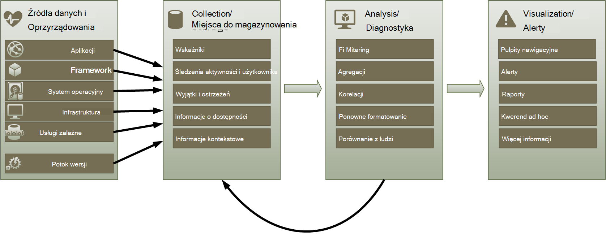
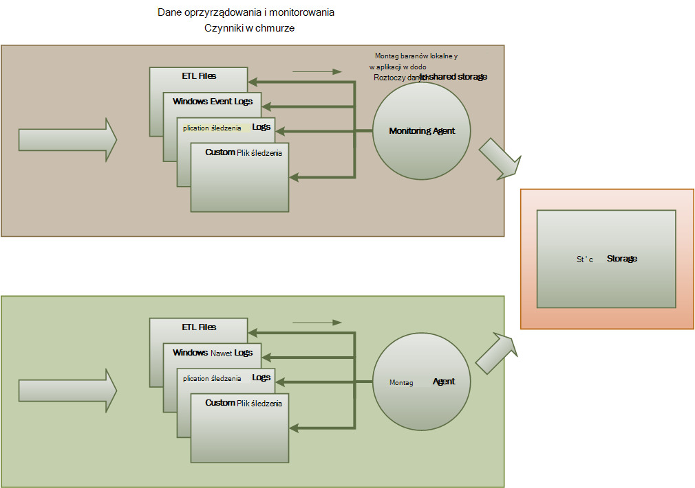
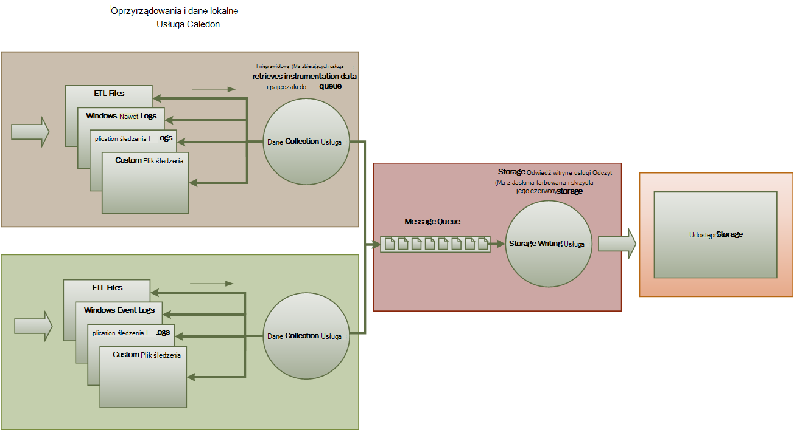
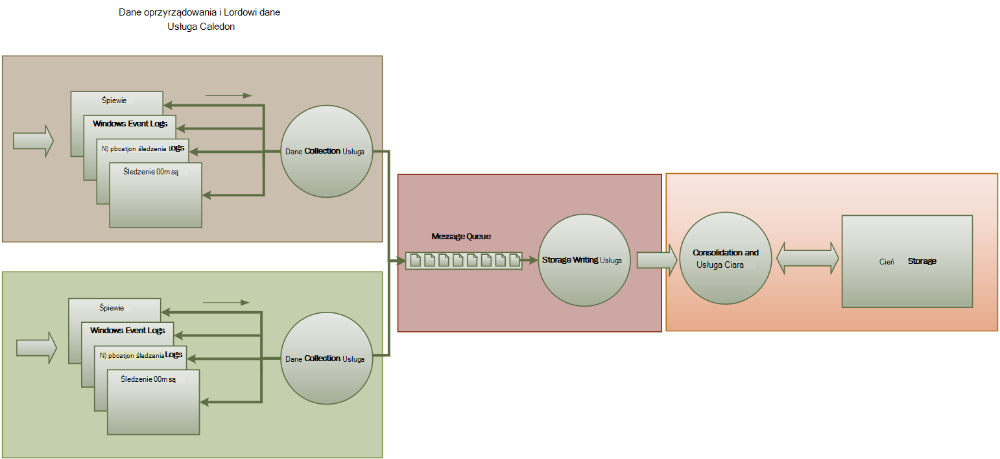

<properties
   pageTitle="Wskazówki dotyczące monitorowania i diagnostyki | Microsoft Azure"
   description="Najważniejsze wskazówki dotyczące monitorowania rozłożone aplikacji w chmurze."
   services=""
   documentationCenter="na"
   authors="dragon119"
   manager="christb"
   editor=""
   tags=""/>

<tags
   ms.service="best-practice"
   ms.devlang="na"
   ms.topic="article"
   ms.tgt_pltfrm="na"
   ms.workload="na"
   ms.date="07/13/2016"
   ms.author="masashin"/>

# <a name="monitoring-and-diagnostics-guidance"></a>Wskazówki dotyczące monitorowania i diagnostyki

[AZURE.INCLUDE [pnp-header](../includes/guidance-pnp-header-include.md)]

## <a name="overview"></a>Omówienie
Rozłożone aplikacji i usług działających w chmurze są z natury złożonych fragmenty oprogramowanie, które składają się dużej liczbie ruchomych elementów. W środowisku produkcyjnym należy śledzić sposób korzystać użytkownicy konto systemowe, śledzenia wykorzystania zasobów i ogólnie monitorować wydajność systemu i zdrowia. Za pomocą tych informacji diagnostycznych pomoc do wykrywać i poprawiać problemy oraz w celu pomocy miejsca potencjalne problemy i zapobiec występowaniu.

## <a name="monitoring-and-diagnostics-scenarios"></a>Scenariusze monitorowania i diagnostyczne
Za pomocą monitorowania, aby mieć wgląd jak działa system. Monitorowanie jest kluczową kwestią zachowaniu jakości usługi elementów docelowych. Typowe scenariusze do zbierania danych monitorowania obejmują:

- Zapewnienie, że system jest prawidłowy.
- Śledzenie dostępności systemu i jego elementy składowe.
- Zachowywanie wydajności, aby upewnić się, że wydajność systemu nie zmniejsza nieoczekiwanie jako objętość podwyżki pracy.
- Gwarantowanie, że system spełnia wszelkie umowy poziomu usług (poziomu) ustanowioną z kontrahentami.
- Ochrona prywatności i zabezpieczanie systemu, użytkowników i ich dane.
- Śledzenie operacji, które są wykonywane na potrzeby inspekcji lub przepisami.
- Monitorowanie użycia codzienną systemu i analizie trendów, które mogą powodować problemy z, jeśli nie są uwzględnione.
- Śledzenie problemów występujących z początkowy raport za pośrednictwem na potrzeby analizy możliwe przyczyny, napraw, aktualizacje oprogramowania wynikające z tego i wdrożenie.
- Śledzenie operacji i debugowanie wersjach oprogramowania.

> [AZURE.NOTE] Pełne nie ma na tej liście. W tym dokumencie opisano w poniższych scenariuszach jako najbardziej typowych sytuacjach dotyczących umożliwiających wykonywanie, monitorowanie. Mogą występować inne osoby, które są mniej powszechne lub są specyficzne dla środowiska.

W poniższych sekcjach opisano następujące scenariusze bardziej szczegółowo. Informacje dla każdego scenariusza został omówiony w następującym formacie:

1. Krótkie omówienie tego scenariusza
2. Typowe wymagania dotyczące tego scenariusza
3. Dane nieprzetworzonych oprzyrządowania, które są wymagane do obsługi scenariusz i możliwych źródeł te informacje
4. Jak można analizować i łączyć w celu wygenerowania ważnych informacji diagnostycznych nieprzetworzonych danych

## <a name="health-monitoring"></a>Monitorowanie kondycji
System nie jest uszkodzony, jeśli jest uruchomiony i możliwościach przetwarzania żądania. Celem monitorowania kondycji jest generować migawki bieżąca kondycja systemu, dzięki czemu można sprawdzić, czy wszystkie składniki systemu działają zgodnie z oczekiwaniami.

### <a name="requirements-for-health-monitoring"></a>Wymagania w zakresie monitorowania kondycji
Należy otrzymywać alerty operatora szybko (w ciągu kilku sekund), jeśli dowolną część systemu uznaje się nieprawidłowe. Operator powinno być możliwe do stwierdzenia, które części systemu działają normalnie i części, które występują problemy. Za pomocą systemu światła ruchu mogą być podświetlone kondycji systemu:

- Czerwony dla nieprawidłowe (przestał system)
- Żółty dla częściowo prawidłowy (w systemie z ograniczona funkcjonalność)
- Zieloną całkowicie prawidłowy

Monitorowanie kondycji systemu Pełna umożliwia operatora do szczegółów za pomocą systemu, aby wyświetlić stan kondycji podsystemów i składniki. Na przykład jeśli cały system jest przedstawiona jako częściowo prawidłowy, operator powinno być możliwe powiększyć i określanie, które są obecnie niedostępne.

### <a name="data-sources-instrumentation-and-data-collection-requirements"></a>Źródła danych, oprzyrządowania i wymagania dotyczące zbierania danych
Nieprzetworzonych danych, które są wymagane do obsługi monitorowanie kondycji można wygenerować w:

- Śledzenie realizacji żądań użytkownika. Te informacje można określić, które żądania zakończyło się pomyślnie, dodatniej i jak długo trwa każdego żądania.
- Monitorowanie syntetycznych użytkownika. Ten proces symuluje kroków wykonanych przez użytkownika i obejmuje wstępnie zdefiniowanych serii kroków. Powinny być przechwytywane wynik każdego kroku.
- Rejestrowanie wyjątków, błędów i ostrzeżeń. Te informacje można przechwycić wyniku instrukcji śledzenia osadzony w kodzie aplikacji, a także podczas pobierania informacji z dzienniki zdarzeń żadnych usług, które odwołuje się do systemu.
- Monitorowanie kondycji jakichkolwiek usług innych firm, używane przez system. Monitorowanie może wymagać pobierania i analizowania danych kondycji, które dostarczać tych usług. Te informacje mogą wykonywać różne formaty.
- Monitorowanie punktu końcowego. Ten mechanizm opisano bardziej szczegółowo w sekcji "Dostępność monitorowania".
- Zbieranie otaczającego wydajności informacje, takie jak tło procesora lub operacje wejścia/wyjścia (w tym sieci).

### <a name="analyzing-health-data"></a>Analizowanie danych kondycji
Monitorowanie kondycji podstawowego fokus jest szybko wskazują, czy w systemie. Najpopularniejsze analizy danych natychmiastowej może wywołać alert, składnik krytyczne w przypadku wykrycia jak nieprawidłowe. (Nie odpowiadają serię kolejnych polecenia ping, na przykład.) Operator następnie wykonać odpowiednie działania naprawcze.

Bardziej zaawansowane systemu mogą zawierać przewidywanych element, który wykonuje analizę zimnej przez ostatnich i bieżące obciążenie pracą. Analiza zimnej można wykrywanie trendów i określić, czy system prawdopodobnie pozostaną prawidłowy lub czy system konieczność dodatkowe zasoby. Ten element przewidywanych powinny być oparte na miar wydajności, takich jak:

- Liczba żądań skierowany poszczególnych usług lub podsystemu.
- Czas odpowiedzi tych wniosków.
- Wielkość danych ułożony w i wylogowywanie się z każdej z tych usług.

Jeśli wartość dowolnego metryki przekracza określonego progu, system można podnieść alert, aby włączyć operatora lub autoscaling (jeśli jest dostępne) podjęcie działania zapobiegawcze niezbędne do zachowania kondycji systemu. Te akcje mogą obejmować dodawanie zasobów, ponowne uruchomienie jeden lub więcej usług, które awarii lub stosowanie ograniczania na niższym priorytecie żądania.

## <a name="availability-monitoring"></a>Dostępność monitorowania
Naprawdę prawidłowy system wymaga składniki i podsystemów, które tworzą system są dostępne. Monitorowanie dostępność jest ściśle związane monitorowania zdrowia. Ale monitorowanie kondycji stanowi bezpośredniego widoku bieżącego kondycji systemu, monitorowanie dostępność dotyczy śledzenia dostępności systemu oraz jego składników do generowania statystyk dotyczących czasu pracy nad systemem.

W wielu systemach niektóre składniki (na przykład baza danych programu) są skonfigurowane z wbudowanych nadmiarowości umożliwiające szybkie przełączanie awaryjne w przypadku błędów poważne lub utraty łączności. Najlepiej, jeśli użytkownicy nie należy pamiętać, że wystąpił takiej awarii. Ale z dostępność monitorowania perspektywy jest niezbędne w celu uzyskania jak najwięcej informacji o tych błędów do określenia przyczyny i podejmowania działań naprawczych, aby uniemożliwić cyklicznych.

Dane, które są wymagane do śledzenia dostępności może zależeć od kilku czynników niższego poziomu. Wiele z tych czynników mogą być specyficzne dla aplikacji, systemu i środowiska. Skuteczny system monitorowania przechwytuje dane dostępności, który odpowiada następujących czynników niższego poziomu, a następnie agreguje je do przedstawienia ogólnego obrazu systemu. Na przykład w systemie elektronicznego funkcję firm, umożliwiającą klienta składanie zamówień może zależeć repozytorium, w którym są przechowywane szczegóły zamówienia i system płatności, który obsługuje pieniężnych transakcje płacisz za nimi. Dostępność położenie kolejności część systemu w związku z tym jest funkcją dostępność repozytorium i podsystemu płatności.

### <a name="requirements-for-availability-monitoring"></a>Wymagania w zakresie monitorowania dostępności
Operator należy również mogli przeglądać historycznych dostępność każdego systemu i podsystemu i wykrywanie trendów za wszelkie mogących powodować jeden lub więcej podsystemów okresowo niepowodzenie za pomocą tych informacji. (Usług rozpoczynać kończy się niepowodzeniem w określonym czasie dnia, która odpowiada godzin przetwarzanie szczyt?)

Rozwiązanie monitorowania powinien zawierać widoku natychmiastowej i historycznych dostępności lub niedostępność każdego podsystemu. Należy również możliwość szybkiego alarmowe operatora, gdy co najmniej jeden usług błędów lub użytkowników nie może nawiązać połączenia usług. Jest to kwestia nie tylko monitorowanie każdej usługi, ale również badania akcji wykonywanych przez każdego użytkownika, jeśli te akcje awarii przy próbie komunikować się z usługą. W pewnym stopniu stopień łączności błąd jest normalne i może to być spowodowane błędami przejściowych. Ale może być przydatne system lepszego alert dla liczby błędów połączenia podsystemu określonej występujące w określonym okresie.

### <a name="data-sources-instrumentation-and-data-collection-requirements"></a>Źródła danych, oprzyrządowania i wymagania dotyczące zbierania danych
Podobnie jak w przypadku monitorowanie kondycji, nieprzetworzonych dane, które są wymagane do obsługi monitorowania dostępności mogą być generowane wyniku syntetycznych użytkownika monitorowania i rejestrowania dowolne wyjątki, błędów i ostrzeżeń, które mogą się pojawić. Ponadto można uzyskać dane dostępności wykonywanie, monitorowanie punktu końcowego. Aplikacja pozwala udostępnić jeden lub więcej punkty końcowe kondycji, każdego testowania dostępu do obszaru funkcjonalnego w systemie. System monitorowania można ping każdego punktu końcowego, wykonując zdefiniowanym harmonogramem i zbierania wyników (sukces lub niepowodzenie).

Można zarejestrować limity czasu, błędów połączenia sieciowego i próby ponów próbę połączenia. Wszystkie dane powinny być oznaczony sygnaturą czasową.

<a name="analyzing-availability-data"></a>
### <a name="analyzing-availability-data"></a>Analizowanie danych dostępności
Należy agregacją i ze są obsługiwane następujące typy analizy danych oprzyrządowania:

- Natychmiastowe dostępności systemu i podsystemów.
- Dostępność awariami systemu i podsystemów. Najlepiej, jeśli operatora powinno być możliwe przeniesionym błędy z określonych działań: została co dzieje, gdy system nie może?
- Historyczne widoku awariami systemu lub dowolny podsystemów przez dowolną określony okres i załaduj w systemie (liczba żądań użytkownika, na przykład) po wystąpił błąd.
- Przyczyny niedostępności systemu lub dowolny podsystemów. Na przykład przyczyny mogą być połączone usługa nie jest uruchomiona, łączności utracone, ale limit czasu i połączony, ale zwracanie błędów.

Dostępność procent usługi w okresie można obliczyć za pomocą następującej formuły:

```
%Availability =  ((Total Time – Total Downtime) / Total Time ) * 100
```

Jest to przydatne do celów Umowa dotycząca poziomu usług. ([SLA monitorowania](#SLA-monitoring) opisano bardziej szczegółowo w dalszej części tych wskazówek.) Definicja _przestoje_ zależy od usługi. Na przykład Visual Studio zespołu tworzenia usługi definiuje przestoje jako okres (Suma minut skumulowane), w którym tworzenie usługa jest niedostępna. Minuty jest traktowany jako niedostępna, jeśli wszystkie ciągły żądania HTTP do tworzenia usługi do wykonywania operacji zainicjowane przez klienta w całym minut powodują kod błędu lub nie zwraca odpowiedź.

## <a name="performance-monitoring"></a>Monitorowanie wydajności
Jak system zostanie nawiązane przy dużym obciążeniu bardziej (przez zwiększenie liczby użytkowników), wielkość zbiorów danych, te dostępu użytkowników powiększające się oraz możliwość awarii jeden lub więcej składników staje się w większości przypadków. Często błąd składnika poprzedza spadek wydajności. Jeśli jest możliwe wykrywanie taki spadek możesz podjąć kroki aktywne, aby zaradzić zaistniałej sytuacji.

Wydajność systemu zależy od kilku czynników. Każdy czynnik jest zwykle mierzone za pomocą kluczowych wskaźników wydajności (KPI), takie jak liczba transakcji bazy danych na sekundę lub liczba żądań sieci, które pomyślnie są obsługiwane w określonym przedziale czasu. Niektóre z tych kluczowych wskaźników wydajności mogą być dostępne jako miary wydajności zależnych od, podczas gdy inne osoby mogą pochodzić z kombinacji metryki.

> [AZURE.NOTE] Określanie słaby lub dobrej wydajności wymaga, aby zrozumieć poziom wydajności, jaką system powinny być uruchomiony. W tym celu obserwowania systemu, gdy działa on przy typowym obciążeniu i rejestrowania danych dla każdego kluczowego wskaźnika wydajności w okresie. To może obejmować systemem obciążeniu symulowany w środowisku testowym i zbieranie odpowiednich danych przed wdrożeniem systemu w środowisku produkcyjnym.

> Należy upewnić się, że monitorowanie wydajności celów nie staje się obciążenie w systemie. Można dynamicznie dostosować poziom szczegółów proces monitorowania wydajności zbiera dane.

### <a name="requirements-for-performance-monitoring"></a>Wymagania dotyczące monitorowania wydajności
Aby zbadać wydajność systemu, operatora zwykle musi wyświetlić informacje, która zawiera:

- Wskaźniki odpowiedzi do żądań użytkowników.
- Liczba użytkowników równoczesne żądania.
- Wielkość ruchu sieciowego.
- Stopnie, u którego transakcje są wykonywane.
- Średni czas przetwarzania żądania.

Warto również zawierają narzędzia umożliwiające operatora ułatwiające korelacji miejsca, takich jak:

- Liczba równoczesne użytkowników i opóźnienie żądanie godziny (czas potrzebny do rozpoczęcia przetwarzania żądania, po wysłaniu go użytkownika).
- Liczba równoczesne użytkowników i Średni czas reakcji (czas potrzebny do wykonania żądania po rozpoczęciu przetwarzania).
- Liczba żądań i liczba błędy przetwarzania.

Wraz z wysokiego poziomu informacji funkcjonalności operatora powinno być możliwe uzyskać szczegółowe informacje dotyczące wydajności dla każdego składnika systemu. Te dane zwykle zapewniają liczniki wydajności niższego poziomu, które śledzić takie informacje jak:

- Wykorzystanie pamięci.
- Liczba wątków.
- Procesor czas przetwarzania.
- Długość kolejki żądań.
- Kursy We/Wy dysku lub w sieci i błędów.
- Liczba bajtów napisane lub więcej.
- Wskaźniki pośredniczącym, takich jak długość kolejki.

Wszystkie wizualizacje pozwolić operator określić przedział czasu. Wyświetlanych danych może być migawkę bieżącej sytuacji i/lub historycznych widoku działania.

Operator powinno być możliwe lepszego alertu na podstawie dowolnego wydajności miary dla wartości określonej dowolnego określonym interwale czasu.

### <a name="data-sources-instrumentation-and-data-collection-requirements"></a>Źródła danych, oprzyrządowania i wymagania dotyczące zbierania danych
Użytkownik może zbierać dane dotyczące wydajności wysokiego poziomu (przepustowość, liczba użytkowników jednocześnie, liczba transakcji, stawki błędu i tak dalej) przez monitorowanie postępu żądania użytkowników otrzymują i przechodzą przez system. Ten proces obejmuje zawierające instrukcje dotyczące śledzenia w najważniejszych punktów w kodzie aplikacji wraz z informacjami o chronometrażu. Wszystkie błędy, wyjątki i ostrzeżenia należy przechwytywane danymi wystarczające dla korelacji ich żądaniami, które je spowodowały. Dziennik Internetowe usługi informacyjne (IIS) jest innego źródła przydatne.

Jeśli to możliwe należy również przechwytywać dane dotyczące wydajności na dowolnym systemy zewnętrzne, używanych przez aplikację. Systemów zewnętrznych może zawierać własne liczniki wydajności i innych funkcji umożliwiający zażądanie dane dotyczące wydajności. Jeśli nie jest to możliwe, rekordów informacje, takie jak godzina rozpoczęcia i czas zakończenia każdego żądania do systemu zewnętrznego, razem z stan operacji (sukces, Niepowodzenie lub ostrzeżenie). Na przykład, można użyć stoper sposobem żądania czasu: uruchomienie czasomierza podczas uruchamiania żądanie, a następnie Zatrzymaj czasomierz po zakończeniu wezwanie.

Dane dotyczące wydajności niższego poziomu dla poszczególnych składników w systemie mogą być dostępne za pośrednictwem funkcji i usług, takich jak liczniki wydajności systemu Windows i diagnostyce Azure.

### <a name="analyzing-performance-data"></a>Analizowanie danych dotyczących wydajności
Większość zadań analizy składa się z agregowanie danych wydajności według typu żądanie użytkownika i/lub podsystemu lub usługi, do którego jest wysyłana każdego żądania. Przykład żądanie użytkownika jest dodawanie elementu do koszyka lub wykonywanie proces realizacji transakcji w systemie elektronicznego.

Inna wielkość typowych jest podsumowywanie danych wydajności w wybranych percentylu. Na przykład operator może określić czas odpowiedzi w przypadku 99 procent żądań, 95 procent żądań i 70 procent żądań. Mogą występować elementów docelowych Umowa dotycząca poziomu usług lub innych celów określonych dla każdej wartości percentylu. Wyniki trwających należy podać w czasie rzeczywistym najbliższego do wykrywania problemów bezpośredniego. Wyniki powinny być grupowane również przez dłuższy czas do celów statystycznych.

W przypadku problemów opóźnienie mających wpływ na wydajność operatora powinno być możliwe szybkie identyfikowanie przyczyny gardło sprawdzając opóźnienie każdy krok, który wykonuje każdego żądania. Dane dotyczące wydajności w związku z tym należy podać sposób korelacji miary wydajności dla każdego kroku powiązać je na żądanie określone.

W zależności od wymagań wizualizacji może być przydatne do tworzenia i przechowywania moduł danych, który zawiera widoki nieprzetworzonych danych. Ten moduł danych umożliwia złożonych kwerend ad hoc i analiza danych wydajności.

## <a name="security-monitoring"></a>Monitorowanie zabezpieczeń
Struktura zabezpieczeń zaimplementować wszystkich systemach handlowych, które zawierają dane poufne. Złożoność mechanizmu zabezpieczeń zazwyczaj jest to funkcja wrażliwości danych. W układzie, która wymaga uwierzytelnianie użytkowników należy w czasie rejestrowania:

- Wszystkie logowania próby, czy nie lub powiodła się.
- Wszystkie operacje wykonywane przez — i szczegółowe informacje o wszystkich zasobów dostępne przez — uwierzytelnionego użytkownika.
- Gdy użytkownik powoduje zakończenie sesji i zaloguje.

Monitorowanie może być możliwe do wykrywania atakami w systemie. Na przykład duża liczba logowania niepomyślne może świadczyć atakami siłowymi. Nieoczekiwany wzrost żądania może być wynik rozłożone atakiem (DDoS) odmowa usługi. Muszą mieć możliwość monitorować wszystkie żądania do wszystkich zasobów bez względu na to źródło tych wniosków. Systemem zawierającym zagrożenie logowania może przypadkowo uwidaczniają zasoby, aby światem bez konieczności użytkownika do faktycznie zalogowania się.

### <a name="requirements-for-security-monitoring"></a>Wymagania dotyczące zabezpieczeń monitorowania
Większość krytycznych aspektów monitorowanie zabezpieczeń należy włączać szybko operatora:

- Wykrywanie próby atakami podmiotu nieuwierzytelnionych.
- Identyfikowanie prób podmioty do wykonywania operacji na danych, dla której ta osoba nie udzielono dostępu.
- Określanie, czy system lub część systemu, jest w obszarze atakami spoza lub wewnątrz. (Na przykład złośliwy uwierzytelniony użytkownik może próbować zamknąć system.)

Aby obsługiwać te wymagania, otrzymywanie powiadomień o operatora:

- Jeśli jedno konto jest powtarzających się nie powiodło się próby logowania w określonym czasie.
- Jeśli jednego konta uwierzytelnionego wielokrotnie próbuje uzyskać dostęp do zasobu niedozwolonych w określonym okresie.
- Jeśli dużej liczby nieuwierzytelnionych lub nieautoryzowanych żądania pojawią się w określonym okresie.

Informacje, które mają operatora powinny zawierać adres hosta źródła dla każdego żądania. W przypadku naruszenia bezpieczeństwa regularnie z określonego zakresu adresów, tych hostów może być zablokowany.

Klawisz udziału w zabezpieczenie systemu jest możliwość szybkiego wykrywanie akcje, które różni się od przyjętego wzorca. Informacje, takie jak liczba żądań, które nie powiodło się i/lub pomyślnego logowania może być wyświetlana graficzne ułatwiające wykrywanie, czy jest kolekcji działalność chwili nietypowe. (Przykład to działanie jest użytkownikom logowanie się na 3:00 AM i wykonywania dużej liczby operacji wraz z ich dnia roboczego o 9:00). Można również te informacje w celu skonfigurowania opartych na czasie autoscaling. Na przykład operator przestrzega, że dużej liczby użytkowników regularnie Zaloguj się w określonym czasie dnia, operator można rozmieszczać do uruchamiania dodatkowego uwierzytelniania usług do obsługi zakresu pracy, a następnie zamknij te dodatkowe usługi, po upływie Szczyt.

### <a name="data-sources-instrumentation-and-data-collection-requirements"></a>Źródła danych, oprzyrządowania i wymagania dotyczące zbierania danych
Bezpieczeństwo jest proporcji obejmujący wszystkie systemów dystrybucji najczęściej. Do wygenerowania w wielu punktach systemu prawdopodobnie odpowiednich danych. Należy rozważyć przyjęcie informacje dotyczące zabezpieczeń i zdarzeń zarządzania (SIEM) podejście do zebrania informacji związanych z zabezpieczeniami, będącej wynikiem zdarzenia generowane przez aplikację, wyposażenia sieciowego, serwery, zapory, oprogramowanie antywirusowe i innych elementów zapobiegania intruzów.

Monitorowanie zabezpieczeń można dołączać danych z narzędzia, które nie są częścią aplikacji. Te narzędzia można zawierają narzędzia, które wskazują skanowanie portów działań przez zewnętrznych przedstawicielstwa i filtry sieci, które wykrywanie prób nieuwierzytelnionych dostęp do aplikacji i danych.

We wszystkich przypadkach zgromadzone dane należy włączyć administrator w celu określenia rodzaju atakiem, a następnie wykonaj odpowiednią przeciwdziałania.

### <a name="analyzing-security-data"></a>Analizowanie danych zabezpieczeń
Funkcja Monitorowanie zabezpieczeń jest różnych źródeł, z których pojawia się dane. Różne formaty i poziom szczegółów często wymagają złożonej analizy danych przechwycony jest powiązanie jej do spójnego wątku informacji. Oprócz najłatwiejszym spraw (takie jak wykrywanie dużej liczby niepowodzeniu rejestrowaniu lub powtarzających się próby uzyskania nieautoryzowanego dostępu do krytycznych zasobów) może nie być można wykonać dowolną złożonych automatyczne przetwarzanie danych zabezpieczeń. Zamiast tego może być lepiej zapisać te dane sygnaturami czasowymi ale inaczej w postaci oryginalnej, bezpieczne repozytorium umożliwiające ekspertów analizy ręcznego.

<a name="SLA-monitoring"></a>

## <a name="sla-monitoring"></a>Umowa dotycząca poziomu usług monitorowania
Wiele systemów komercyjnego, które obsługują rzeczywistych klientów wprowadź gwarancje dotyczące wydajności systemu w formularzu systemy. Zasadniczo poziomu Województwo, obsługi określoną objętość pracy w uzgodnione przedziale czasu i bez utraty ważnych informacji przez system. Umowa dotycząca poziomu usług monitorowania dotyczy zapewnienie, że system wypełnić mierzone zwiększany.

> [AZURE.NOTE] Umowa dotycząca poziomu usług monitorowania jest ściśle związane monitorowania wydajności. Ale monitorowanie wydajności dotyczy z zapewnienie, że system funkcje _optymalnie_, monitorowanie Umowa dotycząca poziomu usług podlega zobowiązań wynikających definiujące, jakie _optymalnie_ w rzeczywistości oznacza.

Systemy często są definiowane w zakresie:

- Ogólną dostępność systemu. Na przykład organizacja może zagwarantować, że system będzie dostępny dla 99,9% czasu. To jest równa nie więcej niż 9 godzin przestoje na rok lub około 10 minut w tygodniu.
- Operacyjne przepustowość. Ten aspekt często jest wyrażony jako jeden lub więcej — limitów górnych, takich jak gwarantującego, że system może obsługuje maksymalnie 100 000 żądań równoczesne użytkownika lub obsługiwać 10 000 równoczesne transakcji.
- Czas reakcji operacyjne. Systemu może również wykorzystać gwarancji dla stawki, w którym są przetwarzane żądania. Przykład to, że 99% wszystkich transakcji zostanie zakończony w ciągu 2 sekund, ale nie jednej transakcji trwa dłużej niż 10 sekund.

> [AZURE.NOTE] Niektóre umowy handlowe systemy mogą także zawierać zwiększany do działu obsługi klienta. Przykładem jest, że wszystkie żądania pomocy technicznej powodują odpowiedź w ciągu 5 minut i że 99 procent wszystkie problemy zostaną w pełni uwzględnione w ciągu 1 dnia roboczego. Efektywne [Śledzenie problemów](#issue-tracking) (opisane dalej w tej sekcji) jest kluczem do spotkania poziomu, takie jak te.

### <a name="requirements-for-sla-monitoring"></a>Wymagania w zakresie monitorowania Umowa dotycząca poziomu usług
Na najwyższym poziomie operatora powinny mieć możliwość określenia rzut oka, czy system jest spotkania uzgodnione zwiększany lub nie. Jeśli nie, operator powinno być możliwe przechodzić do w dół i sprawdzenie źródłowej czynników wpływających na ustalenie przyczyny niskiej wydajności.

Typowe wskaźniki wysokiego poziomu, które może być przedstawiona graficznie obejmują:

- Wartość procentowa czas działania usługi.
- Przepustowość aplikacji (mierzony w pomyślne transakcje i/lub operacji na sekundę).
- Liczba żądań aplikacji pomyślnego /.
- Liczba błędów aplikacji i systemu, wyjątki i ostrzeżeń.

Wszystkie te wskaźniki powinny być są filtrowane przez określony czas.

Aplikację chmury prawdopodobnie obejmuje wiele podsystemów i składniki. Operator powinno być możliwe zaznacz wysokiego poziomu wskaźnik i zobacz, jak składa się z kondycji podstawowych elementów. Na przykład jeśli czasu pracy cały system przypada poniżej dopuszczalne wartości, operatora powinno być możliwe Powiększ i określić elementy, które uczestniczą do tego błędu.

> [AZURE.NOTE] Przestojów należy zdefiniować uważnie. W systemie korzystającego z nadmiarowości w celu zapewnienia dostępności maksymalna poszczególne wystąpienia elementów może się nie powieść, ale system może pozostawać funkcjonalności. Czas pracy przedstawione przez monitorowanie kondycji systemu powinny wskazywać agregacji czasu pracy każdy element, a nie musi to być czy rzeczywiście został zatrzymany systemu. Ponadto błędy mogą być odizolowane. Nawet jeśli określonego systemu jest niedostępna, pozostała część systemu może być nadal dostępna, mimo że przy użyciu funkcji może się zmniejszyć. (W systemie elektronicznego awarii w systemie mogą uniemożliwiać składania zamówień klienta, ale klienta może być nadal będzie mógł przeglądać katalog produktów).

Do ostrzegania celów, system powinno być możliwe wygenerować zdarzenie, jeśli dowolny z wskaźniki wysokiego przekracza określony próg. Szczegóły niższego poziomu różnych czynników, które tworzą wysokiego poziomu wskaźnik powinien być dostępny jako danych kontekstowych do systemu alertów.

### <a name="data-sources-instrumentation-and-data-collection-requirements"></a>Źródła danych, oprzyrządowania i wymagania dotyczące zbierania danych
Nieprzetworzonych danych, które są wymagane do obsługi monitorowania, Umowa dotycząca poziomu usług jest podobna do nieprzetworzonych danych, wymaganego do monitorowania wydajności, razem z niektórych aspektów zdrowia i monitorowania dostępności. (Zobacz tych sekcji, aby uzyskać więcej informacji). Można przechwycić te dane według:

- Wykonywanie, monitorowanie punktu końcowego.
- Rejestrowanie wyjątków, błędów i ostrzeżeń.
- Śledzenie realizacji żądań użytkownika.
- Monitorowanie dostępność jakichkolwiek usług innych firm, używane przez system.
- Używanie liczników i wskaźniki.

Wszystkie dane należy Przekroczono i sygnaturami czasowymi.

### <a name="analyzing-sla-data"></a>Analizowanie danych Umowa dotycząca poziomu usług
Aby wygenerować obraz ogólną wydajność systemu muszą być zagregowane dane oprzyrządowania. Zagregowane dane również musi obsługiwać rozwijania umożliwiające badanie wydajność podstawowych podsystemów. Na przykład powinno być możliwe:

- Obliczanie całkowita liczba żądań użytkownika w określonym okresie i określanie sukcesów i porażek stopy te żądania.
- Łączenie czasy odpowiedzi żądań użytkownika, aby wygenerować widok ogólny czas reakcji systemu.
- Analizowanie wydawanych użytkownika, aby podzielić czas reakcji ogólnego żądanie do czasy odpowiedzi elementów poszczególnych pracy w tym żądaniu.  
- Określanie dostępności systemu jako procent czas pracy dla dowolnego określonego okresu.
- Analizowanie dostępność czasu procentowe pojedynczych składników i usług w systemie. To może obejmować analizowanie dzienniki wygenerowanych usług innych firm.

Wiele systemów komercyjnego są wymagane do raportu wyników rzeczywistą wydajności do poziomu uzgodnione w podanym okresie, zwykle miesiąca. Te informacje może służyć do obliczania środków lub inne formy zwrotów dla klientów, jeśli poziomu nie są spełnione w tym okresie. Dostępność usługi można obliczyć za pomocą techniki opisane w sekcji [Analizowanie dostępność danych](#analyzing-availability-data).

Do celów wewnętrznych organizacji może również śledzić liczbę i rodzaj zdarzenia, które spowodowały usługi. Dowiedz się, jak szybko rozwiązywania tych problemów lub usuń je całkowicie, pomoże zmniejszyć przestoje i spełniają zwiększany.

## <a name="auditing"></a>Inspekcja
W zależności od rodzaju aplikacji może być ustawowe lub innych przepisy prawne, które określają wymagania dotyczące inspekcji operacji użytkowników i rejestrowania wszystkich dostęp do danych. Inspekcja może udowodnić klientom próśb tego łącza. Niemożność wyparcia się jest wskaźnik ważne w wielu systemach e biznesu ze względów zaufania należeć do przedziału od klienta i organizacji, która jest odpowiedzialny za aplikacji lub usługi.

### <a name="requirements-for-auditing"></a>Wymagania dotyczące inspekcji
Analityk muszą mieć możliwość śledzenia kolejność operacji firm, które użytkownicy wykonują tak, aby można odtworzyć akcje użytkowników. Może to być konieczne, po prostu jako rekord, lub w ramach postępowania sądowej.

Informacje o inspekcji jest bardzo ważne. Jego prawdopodobnie będzie zawierać dane, które identyfikuje użytkowników systemu, razem z zadań, które już podczas wykonywania polecenia. Z tego powodu informacje inspekcji będzie najprawdopodobniej formę raportów, które są dostępne tylko w zaufanych analityków zamiast jako interakcyjne systemu, który obsługuje rozwijania szczegółów operacji graficznych. Analityk powinno być możliwe do generowania zakresu raportów. Na przykład raporty mogą zajęcia wszystkich użytkowników występujących w określonym przedziale czasu, szczegółów chronologii aktywności dla jednego użytkownika lub listy kolejność operacji wykonywanych przed jeden lub więcej zasobów.

### <a name="data-sources-instrumentation-and-data-collection-requirements"></a>Źródła danych, oprzyrządowania i wymagania dotyczące zbierania danych
Podstawowy źródła informacji dotyczących inspekcji mogą być następujące:

- System zabezpieczeń, która zarządza uwierzytelnianie użytkownika.
- Dzienniki śledzenia, które rejestrowanie aktywności użytkownika.
- Dzienniki zabezpieczeń, których wszystkie żądania identyfikowalne i niezidentyfikowana sieci.

Format danych inspekcji oraz sposobu, w której jest przechowywany może być prowadzone przez regulacji. Na przykład go może nie można wyczyścić dane w dowolny sposób. (Go musi być zapisany w oryginalnym formacie.) Dostęp do repozytorium, w którym są przechowywane muszą być chronione do nich.

### <a name="analyzing-audit-data"></a>Analizowanie danych inspekcji
Analityk muszą mieć możliwość dostępu do nieprzetworzonych danych w całości, w postaci oryginalnej. Oprócz wymogu generowanie typowych raportów inspekcji narzędzia do analizy danych prawdopodobnie specjalistyczne i przechowywana na zewnątrz systemu.

## <a name="usage-monitoring"></a>Monitorowanie użycia
Monitorowanie użycia śledzi, jak korzystać z funkcji i składników aplikacji. Operator służy zgromadzone dane do:

- Ustalić, które funkcje są intensywnie używany oraz wszelkie potencjalne punkty aktywne w systemie. Elementy o wysokim ruchu mogą korzystać z funkcjonalności podziału lub nawet replikacji, aby rozdzielić obciążenie bardziej równomiernie. Operator służy także te informacje do stwierdzenia, które funkcje rzadko są używane i są możliwe kandydatów do emerytury lub wymiany w przyszłej wersji systemu.
- Uzyskiwanie informacji na temat zdarzenia operacyjne systemu w obszarze normalnego użytkowania. Na przykład w witrynie elektronicznego, można rejestrować informacje statystyczne o liczba transakcji i wielkość klientów, które są odpowiedzialne za ich. Te informacje służą do planowania pojemności w miarę liczby klientów.
- Wykrywanie (prawdopodobnie bezpośrednio) zadowolenie użytkowników z wydajność i funkcjonalność systemu. Na przykład jeśli dużej liczby odbiorców w systemie elektronicznego zrezygnować regularnie ich koszyków, to może to być spowodowane problem z funkcją realizacji transakcji.
- Generowanie rozliczeniowym. Komercyjne aplikacji lub usługi multitenant mogą być pobierane opłaty klientom dla zasobów, które mogą używać.
- Wymuszanie przydziałów. Jeśli użytkownika w systemie multitenant przekracza ich przydział płatnej przetwarzania zastosowania czasu lub zasób w określonym okresie, ich dostęp można ograniczyć lub może być ograniczenie przetwarzania.

### <a name="requirements-for-usage-monitoring"></a>Wymagania w zakresie monitorowania zastosowania
Aby zbadać użycia systemu, operatora zwykle musi informacje, która zawiera:

- Liczba żądań, które są przetwarzane przez każdego podsystemu i skierowane do każdego zasobu.
- Praca wykonującego każdego użytkownika.
- Wielkość magazynowanie danych, która zajmuje każdego użytkownika.
- Zasoby, które uzyskuje dostęp do każdego użytkownika.

Operator również powinno być możliwe generowanie wykresów. Na przykład wykres mogą być wyświetlane użytkownikom najbardziej zasobów wymagających dużej lub najczęściej dostępne zasobów lub funkcje systemu.

### <a name="data-sources-instrumentation-and-data-collection-requirements"></a>Źródła danych, oprzyrządowania i wymagania dotyczące zbierania danych
Użycie śledzenia mogą być wykonywane na stosunkowo wysokim poziomie. Czy należy zwrócić uwagę godziny rozpoczęcia i zakończenia każdego żądania i rodzaj żądanie (Odczyt, zapis i tak dalej, w zależności od wybranego zasobu). Można uzyskać te informacje według:

- Śledzenie aktywności użytkownika.
- Przechwytywanie liczniki wydajności mierzące wykorzystania dla każdego zasobu.
- Monitorowanie zużycie zasobów za każdego użytkownika.

Do pomiaru celów, należy mieć możliwość określenia, którzy użytkownicy są odpowiedzialne za wykonywanie operacje i zasoby, które są używane te operacje. Zebrane informacje powinny być wystarczająco szczegółowe, aby włączyć dokładne rozliczenia.

<a name="issue-tracking"></a>
## <a name="issue-tracking"></a>Śledzenie problemów
Klientów i innych użytkowników mogą zgłaszać problemy, jeśli nieoczekiwanych zdarzeń lub zachowanie występuje w systemie. Śledzenie problemów dotyczy Zarządzanie tych problemów, kojarzenie ich z wysiłków w celu rozwiązania problemów źródłowych w systemie i informowanie klientów możliwe rozwiązania.

### <a name="requirements-for-issue-tracking"></a>Wymagania dotyczące śledzenie problemów
Operatory wykonują często śledzenie przy użyciu oddzielnych systemu, który umożliwia im do rejestrowania i Raport szczegółów problemów problemów tego raportu użytkowników. Szczegółowe informacje można umieścić zadania, które użytkownik próbował wykonywać Symptomy problemu, kolejność zdarzeń, a jakiekolwiek błędy lub ostrzeżenia, które zostały wydane.

### <a name="data-sources-instrumentation-and-data-collection-requirements"></a>Źródła danych, oprzyrządowania i wymagania dotyczące zbierania danych
Źródło danych początkowych danych śledzenia problemów jest użytkownika, któremu zgłoszone problem w pierwszej kolejności. Użytkownik może być możliwe o podanie dodatkowych danych, takich jak:

- Zrzut awaryjny (Jeśli aplikacja zawiera składnik, który działa na komputerze użytkownika).
- Migawki ekranu.
- Data i godzina, kiedy wystąpił błąd, oraz wszelkie inne informacje środowiska, takich jak lokalizacja użytkownika.

Te informacje może służyć do debugowania nakładu i pomocy skonstruować zaległości dla przyszłych wersjach oprogramowania.

### <a name="analyzing-issue-tracking-data"></a>Analizowanie danych śledzenia problemów
Różnych użytkowników może zgłaszać ten sam problem. System śledzenia problemów należy skojarzyć typowych raportów.

Postęp debugowania nakładu powinny być zarejestrowane przed każdy raport problem. Jeśli problem został rozwiązany, klienta może być poinformowany rozwiązania.

Jeśli użytkownik zgłasza problemu, który ma znane rozwiązanie w systemie śledzenia problemów, operator powinno być możliwe natychmiast informować użytkownika o rozwiązanie.

## <a name="tracing-operations-and-debugging-software-releases"></a>Śledzenie operacji i debugowanie wersjach oprogramowania
Gdy użytkownik raportów problem, użytkownik jest często tylko pamiętać bezpośredni wpływ, zawierającą w ich działalności. Użytkownik tylko zgłosić wyniki własne środowisko ponownie do operatora, który jest odpowiedzialny za zachowaniu systemu. Te środowiska są zwykle widoczne symptom co najmniej jeden problem podstawowych. W większości przypadków analityka należy wyświetlić za pośrednictwem chronologii podstawowych czynności w celu ustanowienia głównej przyczyny problemu. Ten proces jest nazywany _główna przyczyna analizy_.

> [AZURE.NOTE] Analiza głównych przyczyn może odkryć nieefektywność w projekcie aplikacji. W takich przypadkach może być możliwe zmian dotyczy elementów i wdrażanie ich w ramach jednej z kolejnych wersji. Ten proces wymaga staranne sterowania i monitorowane zmienić zaktualizowane składniki.

### <a name="requirements-for-tracing-and-debugging"></a>Wymagania dotyczące śledzenia i debugowania
Śledzenie nieoczekiwanych zdarzeń i innych problemów, w przypadku kluczową, że monitorowania dane zawierają wystarczających informacji, aby włączyć analityka do śledzenia powrót do pochodzenia tych problemów i odtworzyć kolejność zdarzeń, które wystąpiły. Te informacje musi być wystarczające, aby umożliwić analityka do diagnozowania głównej przyczyny problemów. Deweloper następnie można wprowadzić niezbędne zmiany w uniemożliwić cykliczne.

### <a name="data-sources-instrumentation-and-data-collection-requirements"></a>Źródła danych, oprzyrządowania i wymagania dotyczące zbierania danych
Rozwiązywanie problemów może wymagać śledzenia wszystkie metody (oraz ich parametrów) wywoływane w ramach operacji na utworzenie drzewa, przedstawiający logicznego przepływu za pomocą systemu w przypadku klienta specjalne żądanie. Wyjątki i ostrzeżenia generowane przez system w wyniku tego przepływu muszą być przechwycone i zarejestrowane.

Do obsługi debugowania, system zapewnia haki umożliwiające operatora do przechwytywania informacji o stanie w punktach ważnych w systemie. Lub systemu zapewnia szczegółowe informacje krok po kroku jako postęp wybranych operacji. Przechwytywanie danych na tym poziomie szczegółowości można nałożyć dodatkowe obciążenie w systemie i powinny być tymczasowe procesu. Operator używa tego procesu głównie podczas bardzo rzadko używana serię zdarzeń i trudno odtworzyć lub gdy nowa wersja jeden lub więcej elementów do systemu wymaga dokładnego monitorowania, aby upewnić się, że funkcja elementów, zgodnie z oczekiwaniami.

## <a name="the-monitoring-and-diagnostics-pipeline"></a>Proces monitorowania i diagnostyki
Monitorowanie dużych Rozproszony system stanowi stanowiło problem. Każdy scenariuszy opisane w poprzedniej sekcji nie zawsze należy rozważyć oddzielnie. Istnieje mogą być nakładają danych monitorowania i diagnostyczne wymaganego w różnych sytuacjach, mimo że tych danych może być konieczne przetwarzane i prezentowane na różne sposoby. Z tego powodu należy wziąć kompleksowy widok monitorowania i diagnostyki.

Można przewidzieć całego monitorowania i diagnostyki proces jako potok obejmuje etapy pokazano na rysunku 1.



_Rysunek 1. Etapy procesu monitorowania i diagnostyki_

Rysunek 1 wyróżnienie, jak danych monitorowania i diagnostyki mogą pochodzić z różnych źródeł danych. Zbieranie i oprzyrządowania etapów dotyczą identyfikowania źródła, z którym danych musi zostać uwzględniona, określanie danych do przechwytywania, jak przechwycić go i jak sformatować te dane, tak aby można je łatwo zbadać. Etap analizy i diagnostyki pobiera dane i używane do wygenerowania ważnymi informacjami, które operatora można użyć do określenia stanu systemu. Operator można za pomocą tych informacji do podejmowania decyzji o możliwe działania należy podjąć, a następnie docierać wyniki wrócić do etapów oprzyrządowania i zbioru. Faza etapu wizualizacji i alerty przedstawia eksploatacyjnych widoku stanu systemu. Umożliwia wyświetlanie informacji w czasie rzeczywistym najbliższego za pomocą serii pulpitów nawigacyjnych. I mogą powodować zwrócenie raportów, wykresów i schematów zapewnienie historyczne widok danych, który może ułatwić zidentyfikowanie długoterminowe trendów. Informacje o oznacza, że mogą przekroczyć dopuszczalne granice kluczowego wskaźnika wydajności, tym etapie może także wyzwolić alert operatora. W niektórych przypadkach alertu można również wyzwalać zautomatyzowany proces próbuje podejmowania działań naprawczych, takich jak autoscaling.

Należy zauważyć, że te kroki stanowią procesu ciągłego przepływu miejsce, w którym są dzieje etapów równolegle. Najlepiej, jeśli wszystkie fazy powinny być dynamicznie można konfigurować. W niektórych miejscach zwłaszcza w sytuacji, gdy systemu nowo wdrożeniu lub występują problemy, może być konieczne do zbierania danych rozszerzonego na podstawie częściej. W innych przypadkach powinno być możliwe powraca do przechwytywania poziomu podstawowego informacje podstawowe, aby zweryfikować, że system działa prawidłowo.

Ponadto całego procesu monitorowania należy rozważyć live, trwających rozwiązanie, które podlega dostosowywania i ulepszenia wyniku opinii. Na przykład może rozpoczynać pomiaru wiele czynników, aby określić kondycji systemu. Analiza czasem może prowadzić do uściślania jako Odrzuć miar, które nie są odpowiednie, umożliwiając dokładniej skoncentrować się na dane, które należy minimalizując szum w tle.

## <a name="sources-of-monitoring-and-diagnostic-data"></a>Źródła danych monitorowania i diagnostyczne
Informacje, które proces monitorowania mogą pochodzić z różnych źródeł, jak pokazano na rysunku 1. Na poziomie aplikacji informacje pochodzą z dzienników dołączane do kodu systemu. Deweloperów należy stosować standardowy podejście do śledzenia przepływu sterowania przy użyciu jego kodu. Na przykład wpis do metody można wysyłać wiadomości śledzenia określający nazwę metody, bieżącą godzinę, wartość każdego parametru oraz wszelkie stosowne informacje. Rejestrowanie razy wejścia i wyjścia może również okazać się przydatne.

Należy rejestrować wszystkie wyjątki i ostrzeżenia i upewnij się, zachowanie pełnego śledzenia zagnieżdżonych wyjątki i ostrzeżeń. Najlepiej należy również przechwytywać informacje identyfikujące użytkownika, który jest uruchomiony kod, razem z informacji o działaniach korelacji (Aby śledzenie żądania przechodzą przez system). I należy rejestrować prób, aby uzyskać dostęp do wszystkich zasobów, takich jak kolejkach, bazy danych, pliki i inne usługi zależne. Te informacje może służyć do pomiaru i inspekcji celów.

Wprowadź wiele aplikacji za pomocą bibliotek i struktury wykonywanie typowych zadań, takich jak uzyskiwanie dostępu do magazynu danych lub komunikowania się przez sieć. Ramy te mogą być konfigurowane w celu zapewnienia ich śledzenia wiadomości i nieprzetworzonych informacje diagnostyczne, takie jak stawki transakcji i sukcesów transmisji danych i błędów.

> [AZURE.NOTE] Wiele RAM nowoczesny automatycznie Publikuj wydajności i śledzenia zdarzeń. Przechwytywanie informacji polega po prostu na dostarczania sposób, aby pobrać i zapisać go w miejsce, w którym mogą być przetwarzane i analizy.

System operacyjny, w której aplikacja jest uruchomiona mogą być źródłem niższego poziomu informacje systemowe, takie jak liczniki wydajności, wskazujące stawki we/wy, wykorzystanie pamięci i użycie Procesora. Może też zgłaszane błędy systemu operacyjnego (na przykład wystąpił błąd podczas otwierania pliku poprawnie).

Należy rozważyć także podstawowej infrastruktury i składniki, na których działa system. Maszyn wirtualnych, wirtualnych sieci i usług magazynu wszystkie można źródeł liczników ważne wydajności infrastruktury i innych danych diagnostycznych.

Jeśli aplikacja korzysta z innych usług zewnętrznych, takich jak serwer sieci web lub systemu zarządzania baz danych, tych usług mogą publikować własne informacje o śledzeniu, dzienniki i liczników wydajności. Jako przykład można wymienić dynamiczne widoki zarządzania programu SQL Server do śledzenia operacji wykonywanych w bazie danych programu SQL Server, a dzienniki śledzenia usług IIS rejestrowania wnioski na serwerze sieci web.

Składniki systemu zostały zmodyfikowane i nowsze wersje są rozmieszczane, należy mieć możliwość problemów atrybut, zdarzeń i wskaźniki do każdej wersji. Te informacje powinny powiązanych powrót do procesu wersji, tak, aby problemy z określoną wersją składnika można szybko śledzone i naprawione.

Problemy dotyczące zabezpieczeń może pojawić się w dowolnym momencie w systemie. Na przykład użytkownik może próbować Zaloguj się przy użyciu hasła lub nieprawidłowa nazwa użytkownika. Żaden uwierzytelniony użytkownik może próbować uzyskania nieautoryzowanego dostępu do zasobu. Lub użytkownik może zawierać nieprawidłowe lub przestarzałe klawisz, aby uzyskać dostęp do zaszyfrowane informacje. Zawsze związane z zabezpieczeniami informacje dotyczące żądania pomyślnego i awarie powinny być rejestrowane.

Sekcja [Instrumentacja aplikacji](#instrumenting-an-application) zawiera więcej wskazówek dotyczących informacji, które należy przechwycić. Jednak za pomocą różnych strategii zebrać te informacje:

- **Monitorowanie aplikacji i systemu**. Ta strategia używa wewnętrznego źródła w ramach aplikacji, środowisk aplikacji, systemu operacyjnego i infrastruktury. Kod aplikacji można wygenerować własnej monitorowanie danych w punktach godne uwagi podczas cyklu żądanie klienta. Aplikacja może zawierać instrukcje śledzenie, które mogą być selektywne włączana lub wyłączana okoliczności dyktowanie. Istnieje także możliwość do dodania diagnostyki dynamicznie przy użyciu struktury diagnostyki. Ramy te zapewniają zwykle dodatki, które można dołączać do różnych punktach oprzyrządowania w kodzie i rejestrowanie danych śledzenia w następujących miejscach.

    Ponadto kodu i/lub podstawowej infrastruktury może podnieść zdarzeń w punktach krytycznych. Monitorowanie czynników, które są skonfigurowane do tych zdarzeń można rejestrować informacje dotyczące zdarzeń.

- **Monitorowanie rzeczywistego użytkownika**. Ta metoda rekordów interakcje między użytkownikiem a aplikacją i przestrzega przepływu każdego żądania i odpowiedzi. Te informacje mają zastosowanie dwukrotne: mogą być używane do pomiaru zastosowania przez każdego użytkownika, a może służyć do określenia, czy użytkownicy uzyskują odpowiedniej jakości usługi (na przykład znacznie krótsze czasy reakcji, krótki czas oczekiwania i minimalnego błędy). Przechwycone dane służy do identyfikowania obszary zainteresowania, w którym wystąpienia awarii najczęściej. Dane służy także do identyfikowania elementów miejsce, w którym system wolniej, prawdopodobnie z powodu punkty aktywne aplikacji lub w inny sposób gardło. W przypadku zastosowania tej metody starannie może być możliwe odtworzenie przepływów użytkowników za pomocą aplikacji do debugowania i testowania.

    > [AZURE.IMPORTANT] Należy rozważyć dane, które jest rejestrowany przez monitorowanie rzeczywistą użytkownicy będą bardzo ważne, ponieważ mogą zawierać poufnych. Po zapisaniu przechwycone dane go bezpieczne przechowywanie. Jeśli chcesz użyć danych w celu uzyskania wydajności monitorowania lub debugowania, usuwają wszystkie dane osobowe najpierw.

- **Monitorowanie syntetycznych użytkownika**. W tej metody można zapisywać własnego klienta test, który symuluje użytkownika i wykonuje serię można konfigurować, ale typowych operacji. Możesz śledzić wydajności klienta test pomagają w określeniu stanu systemu. Umożliwia także wielu wystąpień klienta test w ramach operacji testowania obciążenia ustalenie sposobu systemu odpowiada przy dużym obciążeniu i jakiego rodzaju monitorowania, wynik jest generowany pod tymi warunkami.

    > [AZURE.NOTE] Można zaimplementować użytkownika rzeczywistą i syntetycznych monitorowania, łącznie z kodem, który służy do śledzenia i czas realizacji metody połączeń i inne krytyczne części aplikacji.

- **Profilowanie**. Ta metoda jest przede wszystkim skierowane monitorowania i zwiększania wydajności aplikacji. Zamiast działania na poziomie funkcjonalności monitorowania rzeczywistą i syntetycznych użytkownika, jego znajdują się informacje niższego poziomu jako zostanie uruchomiona aplikacja. Można zaimplementować profilowanie przy użyciu okresowych przykłady stan wykonywania aplikacji (Określanie, który fragment kodu, że aplikacja działa w danym punkcie w czasie). Umożliwia także oprzyrządowania wstawia sondy do kodu w ważnych junctures (na przykład początek i koniec wywołanie metody), które rekordy, które metody zostały wywołać, jakie czasu i jak długo zajęła każdego połączenia. Następnie można przeanalizować te dane do określenia, które części aplikacji może powodować problemy z wydajnością.

- **Monitorowanie punktu końcowego**. Ta metoda korzysta z jednego lub więcej punktów końcowych diagnostyczne, które aplikacja udostępnia specjalnie, aby włączyć monitorowanie. Punkt końcowy zawiera przejść do kodu aplikacji i mogą być zwracane informacje o kondycji systemu. Różne skoncentrować się na różnych aspektów funkcji. Można napisać własne Diagnostyka klienta, który wysyła żądań okresowych do te punkty końcowe i zaadaptować odpowiedzi. Tej metody opisano bardziej w [punkt końcowy monitorowanie kondycji](https://msdn.microsoft.com/library/dn589789.aspx) w witrynie sieci Web firmy Microsoft.

Maksymalna liczba zapotrzebowania na należy używać kombinacji tych metod.

<a name="instrumenting-an-application"></a>
## <a name="instrumenting-an-application"></a>Instrumentacja aplikacji
Oprzyrządowania jest kluczową procesu monitorowania. Można tworzyć użyteczny decyzji dotyczących kondycji systemu i wydajności, tylko wtedy, gdy najpierw przechwycić dane, które umożliwia te decyzje. Informacje, które zbieranie za pomocą oprzyrządowania powinny być wystarczające do umożliwiają oceny wydajności, diagnozowanie problemów i podejmowanie decyzji bez konieczności zaloguj się na serwerze zdalnym do wykonywania śledzenia (i debugowanie) ręcznie. Oprzyrządowania dane zawierają zwykle metryki i informacje, które są zapisywane do dzienników.

Zawartość dziennika śledzenia może być wynikiem danych tekstowych, które są zapisywane przez aplikację lub dane binarne utworzony w wyniku zdarzenie śledzenia (jeśli jest używany przez aplikację zdarzenia śledzenia dla systemu Windows — ETW). Mogą być też generowane od dzienniki systemu, które rejestrowanie zdarzeń wynikających z części infrastruktury, takich jak serwer sieci web. Wiadomości tekstowe dziennika często mają być zrozumiałą, ale również powinny być zapisywane w formacie, który umożliwia automatyczny system analizować je łatwo.

Należy również klasyfikowanie dzienników. Nie pisz wszystkie dane śledzenia w jednym dzienniku, ale użyj oddzielne dzienniki, aby zarejestrować wyniki śledzenia różnych aspektów operacyjnych systemu. Następnie można szybko filtrować wiadomości dziennika, z odpowiedni dziennik zamiast przetwarzania w jednym pliku długiej. Nigdy nie zapisu informacje, które ma wymagania dotyczące zabezpieczeń (na przykład informacji o inspekcji i debugowania danych) do tego samego dziennika.

> [AZURE.NOTE] Dziennik może być zastosowana jako plik w systemie plików lub mogą być przechowywane w innym formacie, na przykład obiektów blob w magazynie obiektów blob. Informacje dziennika może być przechowywane w bardziej uporządkowanego magazynowania, takich jak wierszy w tabeli.

Metryki zazwyczaj będzie środek lub liczba niektórych proporcji lub zasobu w systemie w określonym czasie, z skojarzone odpowiednie znaczniki i wymiary (nazywane również _Przykładowy_). Jedno wystąpienie metryki przydaje się zwykle nie oddzielnie. Metryki musi być przechwytywane w czasie. Kluczowe problem należy rozważyć, czy jest metryk, które powinien rejestrować i częstotliwości. Generowanie danych dla miar zbyt często można nałożyć znaczną dodatkowe obciążenie w systemie Przechwytywanie metryki rzadko może powodować o każdym okoliczności tego prowadzą do znaczące zdarzenia. Zagadnienia dotyczące różnią się metryki metryki. Na przykład użycie Procesora na serwerze może być znacznie różnią się drugiego sekundę, ale wysoka wykorzystania staje się problem tylko wtedy, gdy jest długotrwałe przez liczbę minut.

<a name="information-for-correlating-data"></a>
### <a name="information-for-correlating-data"></a>Informacje o korelacji danych
Można łatwo monitorować liczniki wydajności poszczególnych systemowe, przechwytywanie metryki dla zasobów i uzyskać informacje o śledzeniu aplikacji z różnych plików dziennika. Ale niektóre formularze monitorowania wymagają analizy i diagnostyki etapowi procesu monitorowania do przeniesionym dane, które są pobierane z różnych źródeł. Te dane może potrwać kilka formularzy w nieprzetworzonych danych, a proces analizy musi być wyposażony w wystarczające dane oprzyrządowania, aby można było mapować te różne formy. Na przykład na poziomie struktury aplikacji zadania może być identyfikowany przez identyfikator wątku. W aplikacji taką samą pracę może być skojarzone z Identyfikatorem użytkownika dla użytkownika, który jest wykonywania tego zadania.

Ponadto jest prawdopodobne 1:1 mapowanie między wątków i żądań użytkownika, ponieważ operacje asynchroniczne mogą ponowne używanie samego wątków do wykonywania operacji w imieniu więcej niż jednego użytkownika. Aby skomplikować sprawach Ponadto pojedynczego żądania może być obsługiwane przez więcej niż jednym wątku jako wykonanie będzie przepływał przez system. Jeśli to możliwe skojarzyć każdego żądania Unikatowy identyfikator rozpropagowaniu w systemie jako część kontekstu żądania. (Metoda generowania i tym identyfikatorów działania w informacji o śledzeniu zależy od technologii, która jest używana do pobierania danych śledzenia).

Wszystkie dane monitorowania powinny być sygnaturami czasowymi w taki sam sposób. Zgodność zarejestrować wszystkie daty i godziny przy użyciu uniwersalny czas koordynowany. Dzięki temu łatwiej sekwencja śledzenia zdarzeń.

> [AZURE.NOTE] Komputery działające w różnych strefach czasowych i sieci nie może być synchronizowane. Nie zależy od tego, za pomocą samego sygnatury czasowe dla korelacji oprzyrządowania dane, które znajdują się na wielu komputerach.

### <a name="information-to-include-in-the-instrumentation-data"></a>Informacje do uwzględnienia w danych oprzyrządowania
Gdy już określanie, które chcesz zbierać dane oprzyrządowania, rozważ następujące wskazówki:

- Upewnij się, czy informacje o przechwycone przez śledzenia zdarzeń komputera i do odczytu. Przyjąć przejrzyste schematy o te informacje, aby umożliwić automatyczne przetwarzanie danych dziennika w systemach i aby zapewnić zgodność operacji i inżynierskie personelu pliki dziennika do czytania. Dołączanie środowiska informacje, takie jak środowisku rozmieszczania maszynowego proces uruchomiony, szczegóły procesu i stosu wywołań.  
- Włącz profilowanie tylko wtedy, gdy jest to konieczne, ponieważ można nałożyć znaczną ogólnych w systemie. Profilowanie przy użyciu oprzyrządowania zapisuje zdarzenie (na przykład połączenie metody) zawsze, gdy pojawi się, dlatego próbki rekordy tylko wybrane zdarzenia. Zaznaczanie może obejmować opartych na czasie (raz co *n* sekund), lub częstotliwość (po każdej *n* żądania). Jeśli bardzo często wystąpieniu zdarzenia, profilowanie przez oprzyrządowania może powodować nadmiernych obciążeń i sam wpłynąć na ogólną wydajność. W tym przypadku podejście przy próbkowaniu może być lepiej. Jednak jeśli brakuje częstotliwość zdarzeń przy próbkowaniu może przeoczyć je. W tym przypadku oprzyrządowania może być lepszym rozwiązaniem.
- Udostępniają kontekst wystarczające, aby umożliwić dewelopera lub administratora określić źródło każdego żądania. Ten tekst może zawierać niektóre formularza identyfikator działania, identyfikujący konkretnego wystąpienia żądania. Mogą także zawierać informacje, które może służyć do tego działania być zgodne z obliczeniowa pracy wykonanej i zasobów używanych. Należy zauważyć, że prac może być krzyżowe ograniczenia procesu i komputera. Do pomiaru, kontekst obejmuje również (bezpośrednio lub pośrednio przez inne powiązane informacje) odwołanie do klienta, wprowadzającego prośby. Ten kontekst zawiera przydatne informacje o stanie aplikacji na czas, jaki upłynął monitorowania danych.
- Rekord wszystkie żądania i lokalizacji lub regionów, z których tych wniosków. Te informacje mogą pomóc w ustalenia, czy są wszystkie punkty aktywne specyficzne dla lokalizacji. Te informacje można także przydatne podczas ustalania, czy na partycje aplikacji lub danych, która jest używana.
- Nagrywanie i starannie rejestrowania szczegółów wyjątki. Często informacje debugowania krytyczne zostaną utracone w wyniku obsługi niskiej wyjątków. Przechwytywanie szczegółowe wyjątków, które aplikacja zgłasza, w tym wyjątki wewnętrzne i inne informacje kontekstu. Jeśli to możliwe zawierać stosu połączenia.
- Być zgodne danych różnych elementów aplikacji przechwytywanie, ponieważ to może pomóc w analizie zdarzeń i korelacji ich żądaniami użytkownika. Należy rozważyć, czy zbieranie informacji za pomocą pakietu pełna i można skonfigurować rejestrowanie, a nie w zależności od deweloperów przyjęcie to samo podejście, zgodnie z ich wykonania różne części systemu. Zbierz dane od liczniki wydajności kluczowe, takie jak głośność wejścia/wyjścia wykonywana, wykorzystania sieci, liczba żądania, użycie pamięci i procesora. Niektóre usługi infrastruktury może zapewnić własne określone liczniki wydajności, takie jak liczba połączenia z bazą danych, stawek, w którym transakcje są wykonywane i liczba transakcji, które kończą się pomyślnie lub zakończyć się niepowodzeniem. Aplikacje mogą również określić własne określone liczniki wydajności.
- Zaloguj się wywołania wszystkich usług zewnętrznych, takich jak systemy baz danych, usług sieci web lub innymi usługami systemowe, które są częścią infrastruktury. Rejestrowanie informacji na temat czas potrzebny do wykonywania każdego połączenia i sukcesu lub błąd połączenia. Jeśli to możliwe przechwytywanie informacji o wszystkich ponownych prób i błędów przejściowych o błędach.

### <a name="ensuring-compatibility-with-telemetry-systems"></a>Zapewnianie zgodności z systemami telemetrycznego
W większości przypadków informacje, które tworzy oprzyrządowania jest generowane jako serię zdarzeń i przekazywane do systemu osobnych telemetrycznego przetwarzania i analizy. System telemetrycznego jest zazwyczaj niezależnie od określonej aplikacji lub technologii, ale oczekuje informacji do obserwowania określonego formatu, który jest zazwyczaj definiowane przez schemat. Schemat określa skuteczne umowę, która definiuje pola danych i typów, które można mogły zjeść tej ostatniej system telemetrycznego. Schemat należy uogólniony umożliwiające danych otrzymywanej z różnych platform i urządzeń.

Wspólny schemat powinny zawierać pola, które są wspólne dla wszystkich zdarzeniach oprzyrządowania, takie jak nazwa zdarzenia, czas zdarzenia, adres IP nadawcy i uzyskać szczegółowe informacje, które są wymagane do korelacji inne zdarzenia (na przykład nazwę użytkownika, identyfikator urządzenia i identyfikator aplikacji). Pamiętaj, że dowolna liczba urządzeń mogą ograniczać zdarzenia, więc schematu należy zależy od typu urządzenia. Ponadto różnych urządzeń może wywołania zdarzeń dla tej samej aplikacji; Aplikacja może obsługiwać mobilnego lub innych formy dystrybucji różnych urządzeń.

Schemat mogą także zawierać pola domeny, które dotyczą scenariusza, który jest wspólny dla wielu różnych aplikacji. Może to być informacji na temat wyjątków, uruchamianie aplikacji i zdarzeń zakończenia i sukcesu lub błąd interfejsu API usługi sieci web. Wszystkie aplikacje, które używają tych samych zestawów pól domeny należy wysyłać ten sam zestaw zdarzeń, włączanie zestawu typowych raportów i analiz, które mają zostać zbudowane.

Na koniec schemat może zawierać pola niestandardowe do przechwytywania szczegóły zdarzenia specyficzne dla aplikacji.

### <a name="best-practices-for-instrumenting-applications"></a>Najważniejsze wskazówki dotyczące Instrumentacja aplikacji
Poniżej przedstawiono najważniejsze wskazówki dotyczące Instrumentacja aplikacji rozproszonej uruchomiony w chmurze.

- Ułatwienia dzienniki do odczytu i łatwe do analizy. Użyj struktury, rejestrowanie, gdy jest to możliwe. Być zwięzły i opisu w wiadomościach dziennika.
- We wszystkich dziennikach identyfikowania źródła i zapewniają kontekst oraz informacji, jak każdy rekord dziennika jest zapisywana.
- Za pomocą tego samego strefy czasowej i formatowanie dla wszystkich sygnatury czasowe. Dzięki temu przeniesionym zdarzeń dla operacji, obejmujące sprzęt i services działający w różnych regionach geograficznych.
- Kategoryzowanie dzienniki i pisanie wiadomości do pliku dziennika właściwe.
- Bez ujawniania poufnych informacji o systemie lub informacje osobiste o użytkownikach. Przeciągnij te informacje przed jest rejestrowany, ale upewnij się, że odpowiednie dane są zachowywane. Na przykład usuwać dowolne ciągi połączenia bazy danych ID i hasło, ale zapisywać pozostałe informacje w dzienniku tak, aby analityk można określić, że system uzyskuje dostęp do właściwej bazy danych. Zaloguj się wszystkie wyjątki krytyczne, ale pozwalają administratorowi na włączanie i wyłączanie rejestrowania dla niższych poziomów wyjątków i ostrzeżeń. Ponadto przechwytywanie i rejestrowanie wszystkich ponów próbę logicznych informacji. Może to być przydatne w monitorowaniu przejściowych kondycji systemu.
- Śledzenie poza połączeń proces, takich jak żądania usługi sieci web zewnętrznych lub baz danych.
- Nie można mieszać komunikaty dziennika różne wymagania dotyczące zabezpieczeń w tym samym pliku dziennika. Na przykład nie pisanie debugowania i informacje do tego samego dziennika inspekcji.
- Z wyjątkiem inspekcji zdarzeń, upewnij się, że wszystkie połączenia rejestrowania są fire i zapomnisz operacji, które nie blokują postęp operacji biznesowych. Zdarzenia inspekcji są szczególnych, ponieważ są krytyczne firmy i można zaklasyfikować jako podstawową częścią działalności firmy.
- Upewnij się, że rejestrowanie jest otwarty i nie ma bezpośrednich zależności konkretną wartość docelową. Na przykład zamiast zapisywania informacji za pomocą _System.Diagnostics.Trace_, definiowanie interfejs abstrakcyjne (na przykład _ILogger_), który udostępnia metody rejestrowania i która może nastąpić w odpowiedni sposób.
- Upewnij się, że wszystkie rejestrowanie jest awaryjnych i nigdy nie wywołuje błędy kaskadowych. Rejestrowanie nie musi zostać zgłoszony wyjątki.
- Potraktuj oprzyrządowania jako trwających iterację i regularnie, przejrzyj dzienniki, nie tylko wtedy, gdy występuje problem.

## <a name="collecting-and-storing-data"></a>Gromadzenia i przechowywania danych
Etap zbioru procesu monitorowania dotyczy pobieranie informacji o generowany przez oprzyrządowania formatowania tych danych, aby ułatwić etapu analizy i diagnostyki korzystać z i zapisywanie danych przekształconych w magazynie zaufanego. Dane oprzyrządowania gromadzenie z różnych części Rozproszony system może odbywać się w różnych miejscach i z różnych formatów. Na przykład kod aplikacji może być Generowanie plików dziennika śledzenia i wygenerować dane dziennika zdarzeń aplikacji, dlatego liczniki wydajności, których można monitorować aspektami infrastruktury, która korzysta z aplikacji może być przechwycone przez inne technologie. Wszystkie składniki firm i usług, że aplikacja używa mogą udostępniać oprzyrządowania informacji w różnych formatach, za pomocą śledzenia osobne pliki, blob miejsca do magazynowania lub nawet w sklepie niestandardowe dane.

Zbieranie danych często odbywa się za pośrednictwem usługi zbioru, który może zostać uruchomiony samodzielnie z aplikacji, która umożliwia generowanie danych oprzyrządowania. Rysunek 2 przedstawia przykład takiej architektury wyróżnianie oprzyrządowania podsystemu zbierania danych.


_Rysunek 2. Zbieranie danych oprzyrządowania_

Należy zauważyć, że to jest widok uproszczone. Usługa zbioru niekoniecznie pojedynczego procesu i może zawierać wiele części składowe uruchomione na różnych komputerach, zgodnie z opisem w poniższych sekcjach. Ponadto jeśli analizy danych telemetrycznych można wykonać szybko (hot analiza, zgodnie z opisem w sekcji [pomocniczych hot, ciepłą i zimnej analizy](#supporting-hot-warm-and-cold-analysis) w dalszej części tego dokumentu), lokalnych składników, które działają spoza usługa zbierania mogą wykonywać zadania analizy natychmiast. Rysunek 2 przedstawia sytuacja dla wybranych zdarzeń. Po przetwarzania analitycznego wyniki mogą być wysyłane bezpośrednio do wizualizacji i alertów podsystemu. Dane, które podlega analizy ciepłej i zimnej odbywa się w magazynie podczas oczekuje przetwarzania.

W przypadku Azure aplikacji i usług Diagnostyka Azure udostępnia możliwe rozwiązanie do przechwytywania danych. Diagnostyka Azure zbiera dane z następujących źródeł dla każdego węzła obliczeń, agreguje go, a następnie przekazuje go do magazynu Azure:

- Dzienniki programu IIS
- Dzienniki usług IIS nie powiodło się żądanie
- Dzienniki zdarzeń systemu Windows
- Liczniki wydajności
- Zrzuty awaryjne
- Azure dzienników infrastruktury Diagnostyka  
- Dzienniki błędów niestandardowych
- Źródła zdarzeń .NET
- Oparte na manifest ETW

Aby uzyskać więcej informacji, zobacz artykuł [Azure: podstawy telemetrycznego i rozwiązywanie problemów](http://social.technet.microsoft.com/wiki/contents/articles/18146.windows-azure-telemetry-basics-and-troubleshooting.aspx).

### <a name="strategies-for-collecting-instrumentation-data"></a>Strategie dotyczące zbierania danych oprzyrządowania
Uwzględniając elastyczne charakter chmury i aby uniknąć ręcznego pobierania telemetrycznego danych z każdym węźle w systemie powinna zorganizować dane, które mają zostać przeniesione do lokalizacji centralnej i skonsolidowane. W układzie obejmuje wiele centrach danych warto najpierw zbieranie, konsolidowanie, przechowywania danych na podstawie według regionu, a następnie sumować dane regionalne do jednej centralnej systemu.

Aby zoptymalizować wykorzystanie przepustowości, można wybrać opcję transferować dane zadecydować w fragmentów jako partie. Jednak dane nie opóźnienia, zwłaszcza jeśli zawiera informacje zależne od czasu.

#### <a name="pulling-and-pushing-instrumentation-data"></a>_Pobierania danych i przekazywanie danych oprzyrządowania_
Podsystemu zbierania danych oprzyrządowania aktywnie można pobrać oprzyrządowania danych z różnych dzienników i innych źródeł dla każdego wystąpienia aplikacji ( _modelu pobieraj_). Lub może działać jako pasywne odbiorcy, który czeka na dane mają być wysyłane ze składników, które stanowią każdego wystąpienia aplikacji ( _modelu push_).

Jeden ze sposobów wykonywania modelu pobieraj jest użycie monitorowania czynników, które prowadzenie lokalnie w każdym wystąpieniu aplikacji. Agent monitorowania jest oddzielnego procesu, który okresowo pobierane dane telemetryczne pobiera (ściąga) w węźle lokalnym i zapisuje te informacje bezpośrednio do scentralizowane przechowywanie, którego udostępnianie wszystkich wystąpień aplikacji. Jest to mechanizm, który wykonuje diagnostyki Azure. Każde wystąpienie Azure ról w sieci web lub pracownika można skonfigurować do przechwytywania diagnostyczne i innych informacji śledzenia, który jest przechowywany lokalnie. Agent monitorowania, uruchamianej obok każdego wystąpienia kopiuje określone dane do magazynu Azure. Artykuł [Włączanie diagnostyki w środowisku maszyn wirtualnych systemu i usług w chmurze Azure](./cloud-services/cloud-services-dotnet-diagnostics.md) zawiera szczegółowe informacje na ten proces. Elementy, takie jak dzienniki, zrzuty awaryjne oraz dzienniki błędów niestandardowych, usług IIS są zapisywane na blob miejsca do magazynowania. Dane z dziennika zdarzeń systemu Windows, zdarzenia ETW i liczniki wydajności są zapisywane w magazynie tabel. Rysunek 3 przedstawia ten mechanizm.



_Rysunek 3. Za pomocą agenta monitorowania pobierają informacje i zapisywać w udostępnionej przestrzeni dyskowej_

> [AZURE.NOTE] Za pomocą agenta monitorowania doskonale nadaje się do rejestrowania danych oprzyrządowania sposób naturalny są pobierane ze źródła danych. Przykładem jest informacje z dynamiczne widoki zarządzania programu SQL Server lub długość kolejki Bus usługi Azure.


Należy stosować podejście opisane po prostu do przechowywania danych telemetrycznych stosowania drobnych uruchomionych ograniczoną liczbą węzły w jednym miejscu. Jednak aplikacji chmury złożone, wysoce skalowalna, globalny może generowanie dużej ilości danych na podstawie setki ról w sieci web i Pracownik, odłamki bazy danych i inne usługi. Ten duże ilości danych można łatwo zasypać przepustowość we/wy dostępną z jednym centralnym miejscu. Dlatego rozwiązania telemetrycznego muszą być skalowalna, aby uniemożliwić działającego jako gardło jako powoduje rozszerzenie systemu. Najlepiej, jeśli rozwiązania powinien zawierać stopień nadmiarowości, aby zmniejszyć ryzyko utracie ważnych informacji monitorowania (na przykład dane rozliczeń lub inspekcji), jeśli część systemu nie powiedzie się.

Aby rozwiązać te problemy, można zaimplementować kolejkowanie, jak pokazano na rysunku 4. W tej architektury, lokalne kontrolna (jeśli mogą być skonfigurowane prawidłowo) lub niestandardowe zbierania danych usługi (Jeśli nie) dane wpisów do kolejki. Oddzielnego procesu uruchamiania asynchroniczne (magazynowanie pisania usługi na rysunku 4) pobiera dane w kolejce i zapisuje go udostępnionej przestrzeni dyskowej. Kolejki wiadomości nadaje się do tego scenariusza, ponieważ "co najmniej raz" zapewnia znaczeń właściwych, które pomagają, upewnij się, że kolejce dane nie zostaną utracone po wysłana będzie. Można zaimplementować magazynowania pisania usługi przy użyciu roli osobnych pracownika.



_Rysunek 4. Przy użyciu kolejki buforu oprzyrządowania danych_

Usługa lokalnego zbierania danych dane można dodawać do kolejki natychmiast po odebraniu. Kolejki działa jako bufor i magazynowania pisania usługi można pobrać i zapisywanie danych w osobnym tempie. Domyślnie kolejki działa na zasadzie first-out pierwszego w. Ale można określić priorytet wiadomości, aby przyspieszyć ich w kolejce, jeśli zawierają dane, które są obsługiwane szybciej. Aby uzyskać więcej informacji zobacz deseniu [Kolejki Priority (priorytet)](https://msdn.microsoft.com/library/dn589794.aspx) . Za pomocą różnych kanałów (na przykład tematy usługi Bus) można także kierowania danych do różnych miejsc docelowych w zależności od formularza przetwarzania analitycznego wymaganego.

Dla skalowalność można uruchamiać wielu wystąpień miejsca zapisywania usługi. W przypadku dużej liczby zdarzeń, można użyć Centrum zdarzeń wysłanie danych do różnych obliczeń zasoby dotyczące przetwarzania i przechowywania.

<a name="consolidating-instrumentation-data"></a>
#### <a name="consolidating-instrumentation-data"></a>_Konsolidowanie danych oprzyrządowania_
Dane oprzyrządowania usługi zbierania danych pobiera z pojedynczego wystąpienia aplikacji daje zlokalizowanym widoku zdrowia i wydajności to wystąpienie. Aby ocenić ogólnego kondycji systemu, należy do skonsolidowania niektórych aspektów danych lokalnych widoków. Można to wykonać po dane zostały zapisane, ale w niektórych przypadkach można również uzyskać je jako dane są zbierane. Zamiast zapisywany bezpośrednio do udostępnionego miejsca do magazynowania danych oprzyrządowania można przekazać za pośrednictwem usługi konsolidacji osobnych danych, która łączy danych i działa jako filtr i oczyszczanie proces. Na przykład oprzyrządowania danych, która zawiera te same informacje korelacji, takie jak identyfikator działania mogą być połączone. (Jest możliwe, że użytkownik zostanie uruchomiony wykonywania operacji firm na jednym węźle i otrzymuje przeniesione do innego węzła w przypadku awarii węzła lub w zależności od sposobu skonfigurowania równoważenia obciążenia.) Ten proces można wykryć i usuń wszelkie zduplikowane dane (zawsze możliwość Jeśli usługa telemetrycznego używa kolejek wiadomości w celu przekazania danych oprzyrządowania się do miejsca do magazynowania). Rysunek 5 pokazuje przykład tej struktury.



_Rysunek 5. Korzystanie z usługi oddzielnym do skonsolidowania i oczyszczania danych oprzyrządowania_

### <a name="storing-instrumentation-data"></a>Przechowywanie danych oprzyrządowania
Poprzedniej dyskusji jest przedstawiona raczej simplistic widoku sposób, w której jest przechowywany oprzyrządowania danych. W rzeczywistości można zrozumiałe do przechowywania różnych typów informacji przy użyciu technologii, które są najbardziej odpowiednie dla sposób, w którym mogą być używane każdego typu.

Na przykład niektóre podobieństwa Azure magazyn obiektów blob i tabeli znajdują się w taki sposób, w jakiej są one używane. Ale mają ograniczenia w zakresie operacji, które można wykonać przy użyciu ich, a szczegółowości dane, które posiadają jest całkiem inna. Jeśli potrzebujesz więcej operacji analitycznych lub wymaga możliwości wyszukiwania pełnotekstowym na danych, może być bardziej właściwe wykorzystanie magazynowanie danych, która zapewnia możliwości, jakie są zoptymalizowane dla określonych typów kwerend i dostęp do danych. Na przykład:

- Dane licznika wydajności mogą być przechowywane w bazie danych SQL, aby włączyć analizy ad hoc.
- Dzienniki śledzenia mogą być lepiej przechowywane w Azure DocumentDB.
- Informacje dotyczące zabezpieczeń mogą być zapisywane HDFS.
- Informacje, które wymagają wyszukiwanie pełnotekstowe mogą być przechowywane za pośrednictwem Elasticsearch (która również może przyspieszyć wyszukiwanie przy użyciu indeksowania sformatowanego).

Można zaimplementować dodatkowo usługa okresowo pobiera dane z udostępnionej przestrzeni dyskowej, partycje i filtrowanie danych według celowi, a następnie zapisuje je do odpowiednich magazynów danych, jak pokazano na rysunku 6. Podejściem alternatywnym jest uwzględnić tę funkcję w procesie konsolidacji i oczyszczanie i wpisać dane bezpośrednio do tych sklepów, jak go zawiera pobrane zamiast zapisując je w to udostępniony obszar przechowywania. Każde podejście ma swoje wady i zalety. Implementowania oddzielnych usługi podziału powoduje zmniejszenie obszarami obciążenie konsolidacji i usługa oczyszczania oraz co najmniej umożliwia niektóre dane podzielone na partycje będzie ponowne wygenerowanie w razie potrzeby (w zależności od ilości przetwarzanych danych jest zachowywana w magazynie udostępnionym). Powoduje zużycie jednak dodatkowe zasoby. Ponadto mogą występować opóźnienia między potwierdzenie oprzyrządowania dane z każdego wystąpienia aplikacji i konwersja te dane do sankcji informacji.


_Rysunek 6. Wymagania dotyczące przechowywania i podziału danych według analitycznych_

Te same dane oprzyrządowania mogą być wymagane więcej niż jeden cel. Na przykład liczniki wydajności może służyć do historycznych widok wydajności systemu w czasie. Te informacje mogą być łączone z innych danych dotyczących użycia, aby wygenerować informacje rozliczeniowe klienta. W takiej sytuacji tych samych danych może być przesyłane do więcej niż jedno miejsce docelowe, takich jak dokument bazy danych, która może działać jako długoterminowe magazynu do przechowywania informacji rozliczeniowych dotyczących i wielowymiarowych Magazyn obsługi wydajności złożonej analizy.

Należy również rozważyć, jak pilnie dane są wymagane. Dane, które zawiera informacje dotyczące alertu muszą być dostępne szybkie powinny być przechowywane w magazynie dane i indeksowane lub struktury, aby zoptymalizować kwerendy, które wykonuje alertów systemu. W niektórych przypadkach może być konieczne dla usługi telemetrycznego zbiera dane w każdym węźle umożliwia formatowanie i zapisywanie danych lokalnie tak, aby lokalne wystąpienie systemu alertów szybko może powiadomić o problemach. Te same dane można wysyłane do magazynowania pisanie usługi pokazano w poprzedniej diagramów i przechowywane Jeśli wymagany jest również do innych celów.

Informacje, które jest używane na potrzeby więcej traktowane jako analizy, zgłaszania oraz analizie trendów w historii jest mniej pilna i mogą być przechowywane w taki sposób, który obsługuje wyszukiwania danych i kwerendy ad hoc. Aby uzyskać więcej informacji zobacz sekcję [wspierające ciepłej, ciepłej i zimnej analizy](#supporting-hot-warm-and-cold-analysis) w dalszej części tego dokumentu.

#### <a name="log-rotation-and-data-retention"></a>_Obrót dziennika i przechowywanie danych_
Oprzyrządowania mogą powodować zwrócenie znaczące ilości danych. Tych danych może być przechowywana w kilku miejscach, zaczynając od nieprzetworzonych dzien, pliki śledzenia i innych informacji uzyskanych w każdym węzła skonsolidowanej, czyszczone, a na partycje widoku danych przechowywanych w udostępnionej przestrzeni dyskowej. W niektórych przypadkach po przetworzeniu i przekazywane, dane oryginalne dane można usunąć z każdego węzła. W innych przypadkach może być konieczne lub po prostu umożliwia zapisywanie nieprzetworzonych informacji. Na przykład dane, które powoduje wygenerowanie osobnego debugowania może najlepiej pozostać dostępne w postaci nieprzetworzonych, ale może zostać odrzucony szybko po skorygowaniu wszystkie błędy.

Dane dotyczące wydajności często występują dłuższego czasu życia, aby mogą być używane w analizie trendów wydajności oraz planowania pojemności. Skonsolidowany widok danych jest zazwyczaj dostępna w trybie online na czas określony umożliwiające szybki dostęp. Po wykonaniu tej można zarchiwizować lub odrzucane. Dane zebrane w celu pomiaru i rozliczeń klientów może być konieczne można zapisać na czas nieokreślony. Ponadto regulacji może określają, że informacje zebrane w celach inspekcji i zabezpieczeń również musi być archiwizacji i zapisany. Te dane są również poufne i może być konieczne zaszyfrowane lub w inny sposób zabezpieczone do nich. Powinien nigdy nie rejestrować haseł użytkowników lub inne informacje, które mogą być używane na zatwierdzenie oszustwa tożsamości. Szczegółowe dane powinny wyczyszczonym danych, zanim jest przechowywany.

#### <a name="down-sampling"></a>_Przy próbkowaniu w dół_
Okazuje się przydatne do przechowywania danych historycznych, więc można wykrywanie trendów długoterminowe. Zamiast zapisywania starych danych w całości, może być możliwe próby szczegółów danych, aby zmniejszyć rozdzielczość jego i zapisać koszty miejsca do magazynowania. Na przykład zamiast zapisywanie wskaźniki wydajności minuta minute, można konsolidować dane, które jest większe niż jeden miesiąc stare do tworzenia widoku godzinę przez godzinę.

### <a name="best-practices-for-collecting-and-storing-logging-information"></a>Najważniejsze wskazówki dotyczące zbierania i przechowywania informacji rejestrowania
Poniżej przedstawiono najważniejsze wskazówki dotyczące rejestrowania i przechowywaniu informacji rejestrowania:

- Kontrolna lub usługi zbierania danych powinna działać jako usługa out of process i powinny być proste do wdrożenia.
- Wszystkich wyjściowych agenta monitorowania lub usługa zbierania danych powinny być o niesprecyzowanym formatu, który nie zależy od komputera, system operacyjny lub protokół. Na przykład wysyłać informacji w formacie własny opisujący, takich jak JSON, MessagePack, lub Protobuf zamiast ETL-ETW. Za pomocą standardowy format umożliwia system w celu utworzenia procesy przetwarzania; składniki, których odczytu, przekształcanie i Wyślij dane w formacie uzgodnione można łatwo zintegrować.
- Proces monitorowania i zbieranie danych musi być awaryjnych i nie musi wyzwolenia warunkom kaskadowym błędu.
- W przypadku awarii przejściowych podczas wysyłania informacji do zainstalowania stołu danych kontrolna lub usługi zbierania danych należy przygotować się do kolejności danych telemetrycznego najnowsze informacje są wysyłane w pierwszej kolejności. (Usługa zbierania danych i agenta monitorowania może wybrać opcję upuść starsze dane, lub zapisz go lokalnie i przekazuje je później, aby obejrzeć, według własnego uznania).

## <a name="analyzing-data-and-diagnosing-issues"></a>Analizowanie danych i diagnozowanie problemów
Ważne część procesu monitorowania i diagnostyki jest analizowanie zgromadzone dane w celu uzyskania obrazu ogólnego dobra systemu. Należy zdefiniowane własnych kluczowych wskaźników wydajności i wskaźniki i ważne jest, aby zrozumieć, jak można tworzyć struktury danych, które zostały zebrane do wymagań analizy. Jest również zrozumieć, jak powiązane dane, które jest rejestrowany w różnych metryki i plików dziennika, ponieważ te informacje mogą być klucz śledzenie kolejność zdarzeń, a diagnozowanie problemów, które mogą pojawić się.

Opisane w sekcji [danych oprzyrządowania Consolidating](#consolidating-instrumentation-data)dane dla każdej części systemu zazwyczaj jest rejestrowany lokalnie, ale ogólnie musi być połączone z danych uzyskanych w innych witrynach, które uczestniczą w systemie. Te informacje wymaga staranne korelacji, aby upewnić się, że dane znalazły się dokładnie. Na przykład danych dotyczących użycia dla operacji może obejmować węzeł obsługuje witryny sieci Web, do której użytkownik łączy, węzeł, na którym działa oddzielna usługa dostępne jako część tej operacji i magazynowanie danych przechowywanych w innym węźle. Informacje te muszą być powiązanych ze sobą, aby zapewnić ogólny widok użycie zasobów i przetwarzanie operacji. Niektóre wstępne przetwarzanie i filtrowanie danych może wystąpić w węźle, w którym dane są przechwytywane, agregacji i formatowanie są częściej w węźle centralnej.

<a name="supporting-hot-warm-and-cold-analysis"></a>
### <a name="supporting-hot-warm-and-cold-analysis"></a>Obsługa ciepłej, ciepłej i zimnej analizy
Analizowanie i formatowania danych dla wizualizacji, raportowanie i alertu celów może być złożonym procesem, który obejmuje własny zestaw zasobów. Niektóre formularze monitorowania są krytyczne czasu i wymaga natychmiastowej analizy danych obowiązywać. Jest to nazywane _hot analizy_. Jako przykład można wymienić analiz, które są wymagane na potrzeby alertów i niektórych aspektów monitorowanie zabezpieczeń (takich jak wykrywanie atakiem w systemie). Dane, które są wymagane w tym celu musi być szybko dostępne i strukturalnych wydajną obsługę przetwarzania. W niektórych przypadkach może być konieczne przeniesienie analizy przetwarzania do pojedynczych węzłów miejsce, w którym są przechowywane dane.

Inne formy analizy są mniej czasu kluczowych i może wymagać niektóre obliczenia i agregacji po otrzymaniu nieprzetworzonych danych. Jest to _ciepłej analizy_. Analiza wydajności często należące do tej kategorii. W tym przypadku wydarzenia są one odizolowane, pojedynczy wydajności najprawdopodobniej statystyczne znacząca. (To może być spowodowane szybkiego kolekcji lub błąd.) Dane z serię zdarzeń powinien zawierać obraz niezawodne wydajność systemu.

Można również analizy ciepłej diagnozowanie problemów zdrowia. Zdarzenie kondycji zazwyczaj jest przetwarzana w systemie analizy ciepłej i można podnieść alertu natychmiast. Operator powinno być możliwe przechodzić do przyczyny zdarzenia kondycji sprawdzając dane z ciepłą ścieżkę. Te dane powinny zawierać informacje o zdarzeniach doprowadziły do problemu powodującego zdarzenie kondycji.

Niektóre typy monitorowania generowanie bardziej długotrwałe danych. Analiza mogą być wykonywane w późniejszym terminie, prawdopodobnie według wstępnie zdefiniowanego harmonogramu. W niektórych przypadkach może być konieczne wykonywanie złożonych filtrowania dużych ilości danych przechwytywane w okresie analizy. Jest to _zimnej analizy_. Kluczowe wymagane jest, że dane są przechowywane bezpiecznie po została przechwycona. Na przykład zastosowania monitorowania i inspekcja wymagać dokładny obraz stanu systemu w regularnych odstępach czasu, ale tych informacji o stanie nie musi być niedostępne w przypadku przetwarzania natychmiast po jego zebrane.

Operator służy również zimnej analizy o podanie danych na potrzeby analizy kondycji przewidywanych. Operator można zbieranie informacji historycznych w określonym czasie i używać go w połączeniu z aktualnymi danymi kondycji (pobrane z ciepłej ścieżki) do znajdowanie trendów, które wkrótce może powodować problemy z kondycji. W takich przypadkach może być konieczne lepszego alerty o podjęcie działań naprawczych.

### <a name="correlating-data"></a>Korelacji danych
Dane, które znajdują się oprzyrządowania umożliwiają migawkę stanu systemu, ale celem analizy jest zapewnienie sankcji te dane. Na przykład:

- Co spowodowało silne we/wy ładowane na poziomie systemu w określonym czasie?
- Jest to wynik dużej liczby operacji bazy danych
- Jest to odzwierciedlane w czasu, liczba transakcji na sekundę odpowiedzi bazy danych i czasu odpowiedzi aplikacji na tym samym dnia?

Jeśli tak, jeden działań naprawczych, który może być zmniejszenia obciążenia może być shard danych przez serwery więcej. Ponadto wyjątki można mogą pojawić się w wyniku błędu w dowolnym poziomie systemu. Wyjątek w jeden poziom często uaktywnia innego błędów na poziomie powyżej.

Z tych powodów należy mieć możliwość powiązania różnego rodzaju monitorowanie danych każdego poziomu da ogólny widok stanu systemu i aplikacji, które są uruchomione na nim. Można następnie podejmowania decyzji o tego, czy system działa prawidłowo lub nie za pomocą tych informacji i określanie, jakie można wykonać, aby poprawić jakość systemu.

Zgodnie z opisem w sekcji [informacje o skorelowana danych](#information-for-correlating-data), należy się upewnić, że oprzyrządowania nieprzetworzonych danych zawiera wystarczających informacji identyfikator kontekstu i działania obsługi korelacji zdarzeń agregacje wymagane do. Ponadto te dane mogą być przechowywane w różnych formatów i może być konieczne przeanalizować te informacje, aby przekonwertować go na standardowym formacie na potrzeby analizy.

### <a name="troubleshooting-and-diagnosing-issues"></a>Rozwiązywanie problemów i diagnozowanie problemów
Diagnostyka wymaga możliwość określenia przyczyny błędy lub nieoczekiwane działanie, w tym wykonywania analizy przyczyn głównego. Informacje, które są wymagane, zwykle zawiera:

- Szczegółowe informacje z dzienników zdarzeń i śledzenia całego systemu lub dla określonego podsystemu w określonym przedziałem czasu.
- Wykonywanie śledzenia stosu wynikającym z wyjątkiem błędów dowolnego określonego poziomu, występujących w systemie lub określonej podsystemu w określonym okresie.
- Ulec awarii zrzuty dla dowolnego procesy zakończone niepowodzeniem dowolne miejsce w systemie lub dla określonego podsystemu w określonym przedziałem czasu.
- Działania dzienniki, rejestrowanie czynności wykonywanych przez wszystkich użytkowników lub dla wybranych użytkowników w określonym okresie.

Analizowanie danych w celu rozwiązywania problemów często wymaga głębokich techniczne opis architektury systemu i różne składniki, które tworzą rozwiązanie. W wyniku dużego zakresu ręczne często jest wymagane do interpretacji danych, ustanawiania przyczyną problemów z i polecić odpowiednią strategię je poprawić. Może być przydatne po prostu do przechowywania kopii tych informacji w oryginalnym formacie i udostępnić zimnej analizy przez eksperta.

## <a name="visualizing-data-and-raising-alerts"></a>Wizualizowanie danych i podnoszenie alerty
Ważnych aspektów żadnego systemu monitorowania jest możliwość prezentowanie danych w taki sposób, operatora szybko można wykrywanie trendów ani problemów. Ważne jest także że możliwość szybkiego informuje operatora, jeśli nastąpiło znaczące zdarzenia, które mogą wymagać działań.

Prezentacja danych może potrwać kilka formularzy, a także wizualizacji przy użyciu pulpitów nawigacyjnych, alertów i raportowania.

### <a name="visualization-by-using-dashboards"></a>Wizualizacja przy użyciu pulpitów nawigacyjnych
Najpopularniejszym sposobem wizualizowanie danych jest użycie pulpity nawigacyjne, które mogą być wyświetlane jako seria wykresów, wykresy i inne — ilustracja informacje. Te elementy można sparametryzowane i analityka powinno być możliwe wybierz Ważne parametry (na przykład przedział czasu) dla każdej określonej sytuacji.

Pulpity nawigacyjne mogą być zorganizowane hierarchicznie. Pulpity nawigacyjne najwyższego poziomu można zawierają ogólne informacje dotyczące poszczególnych aspektów systemu, ale włączyć operatora Drąż w dół do sekcji szczegółów. Na przykład pulpit nawigacyjny, który przedstawia ogólny dyskowej systemu pozwolić analityk wyświetlić stawki we/wy dla każdego poszczególnych dysku upewnić się, czy jeden lub więcej określonych urządzeń uwzględniania nieproporcjonalny wielkość ruchu związanego z. Najlepiej, jeśli pulpitu nawigacyjnego powinien również wyświetlić pokrewne informacje, takie jak źródła każdego żądania (użytkownika lub aktywności), generującej ten we/wy. Następnie można te informacje do określenia, czy (i jak) aby rozdzielić obciążenie bardziej równomiernie na urządzeniach, i tego, czy system może działać lepiej dodano więcej urządzeń.

Pulpitu nawigacyjnego może również za pomocą kolorowanie według wartości lub innego języka visual wskaźniki wartości, które pojawiają się anomalous lub które są poza zakresem oczekiwanych. W poprzednim przykładzie:

- Dysk z Wy, że zbliża się pojemności maksymalnej dłuższym okresie (dysku ciepłej) można wyróżniona na czerwono.
- Dysk z Wy okresowo uruchamianej na jego maksymalnej w krótkich okresach (dysku ciepłą) można jest wyróżniana na żółty.
- Dysk, który powoduje normalnego zastosowania mogą być wyświetlane na zielono.

Należy zauważyć, że system pulpitu nawigacyjnego do wydajności pracy, musi mieć nieprzetworzonych danych do przetwarzania. Jeśli tworzysz systemu pulpitu nawigacyjnego lub za pomocą pulpitu nawigacyjnego opracowanych przez innej organizacji, należy zrozumieć dane oprzyrządowania, które należy zebrać, jakie poziomie szczegółowości i jak one sformatowane korzystać z pulpitu nawigacyjnego.

Warto pulpitu nawigacyjnego nie są wyświetlane tylko informacje, umożliwia także analityka stanowić spontanicznych pytania na temat tych informacji. Niektóre systemy zapewniają narzędzi do zarządzania, które operatora umożliwia wykonywanie następujących zadań i Eksplorowanie danych źródłowych. W zależności od repozytorium, który służy do przechowywania tych informacji, może być także możliwość kwerendy te dane bezpośrednio lub zaimportuj do narzędzi, takich jak program Microsoft Excel do dalszej analizy i raportowania.

> [AZURE.NOTE] Należy ograniczyć dostęp do pulpitów nawigacyjnych do autoryzowanych personelu, ponieważ te informacje mogą być komercyjnego poufne. Należy również chronić danych źródłowych dla pulpitów nawigacyjnych uniemożliwić użytkownikom zmianę.

### <a name="raising-alerts"></a>Podnoszenie alertów
Alerty jest proces analizowania danych monitorowania i oprzyrządowania i generowanie powiadomienie, jeśli zostanie wykryta znaczące zdarzenia.

Alerty ułatwia, upewnij się, że system będzie prawidłowy, odpowiada i bezpieczny. Jest ważna część żadnego systemu, który sprawia, że gwarancje wydajność, dostępność i prywatności użytkownikom miejsce, w którym danych może być konieczne będą przetwarzane natychmiast. Operator może być konieczne powiadamiane o zdarzenie, które alert. Alerty można również wywołania funkcji systemu, takich jak autoscaling.

Zazwyczaj alertu zależy od następujących danych oprzyrządowania:

- Zdarzenia zabezpieczeń. Jeśli dzienniki zdarzeń wskazują ponownie uwierzytelniania i/lub występują błędy autoryzacji, system może znajdować się pod atakiem i operatora powinny zostać powiadomione.
- Wskaźniki. System musi szybko odpowiedzieć, jeśli metryki określonego wydajności przekracza określony próg.
- Informacje o dostępności. Jeśli zostanie wykryta błąd, może być konieczne szybko ponownie uruchomić co najmniej jeden podsystemów lub nie przez zasób kopii zapasowej. Powtarzających się usterek podsystemu może oznaczać bardziej poważne wady.

Operatory może otrzymywać alertu informacje przy użyciu wielu kanały dostarczania, takich jak wiadomości e-mail, urządzenie pager lub wiadomości SMS. Alert mogą także zawierać wskazuje, jak ważny jest sytuacji. Wiele alertów systemy obsługi grup subskrybentów, i wszystkich operatorów, którzy są członkami tej samej grupy mogą uzyskać ten sam zestaw alertów.

System alertów powinny mieć możliwość dostosowania, a odpowiednie wartości z danych źródłowych oprzyrządowania może być udostępniana jako parametrów. Ta metoda umożliwia operatora do filtrowania danych i skupić się na tych progów lub kombinacje wartości, które mogą być przydatne. Należy zauważyć, że w niektórych przypadkach może być udostępniana oprzyrządowania nieprzetworzonych danych w systemie alertów. W innych sytuacjach może być bardziej odpowiednie udzielenia zagregowane dane. (Na przykład alertu może być uruchomiona Jeśli procesora węzła przekroczyła 90 procent w ciągu ostatnich 10 minut). Szczegóły dostępne w systemie alertów obejmuje również podsumowanie i kontekst wszelkie odpowiednie informacje. Dane można ograniczyć możliwość, że zdarzenia dodatnią wartość FAŁSZ będzie rzeczy przed wyjazdem alert.

### <a name="reporting"></a>Raportowanie
Raportowanie służy do generowania ogólny widok systemu. Go może zawierać danych historycznych oprócz bieżących informacji. Raportowanie wymagania się podzielić na dwie kategorie: operacyjne raportowania i raportowania zabezpieczeń.

Zazwyczaj operacyjne raportowania obejmują następujących elementów:

- Agregowanie statystyki używanego do zrozumienia wykorzystania zasobów systemu ogólnego lub podsystemów określonych w określonym przedziałem czasu
- Identyfikowanie trendów w użycia zasobów dla systemu ogólnego lub podsystemów określonych w określonym okresie
- Monitorowanie wyjątków, które wystąpił w systemie lub w określone podsystemów w określonym okresie
- Określania wydajności aplikacji pod względem wdrożonej zasobów i opis, czy wielkość zasobów (i kosztów skojarzone) można zmniejszyć bez wpływu na wydajność zbyt

Raportowanie zabezpieczeń dotyczy śledzenia klientów korzystania z systemu. Należą:

- Inspekcja operacji użytkownika. W tym celu rejestrowania indywidualne żądania, które wykonuje każdy użytkownik, razem z daty i godziny. Dane powinny struktury w taki sposób, aby umożliwić administratorowi szybko odtworzyć kolejność operacji wykonywanych przez użytkownika w określonym czasie.
- Śledzenie zasobów używany przez użytkownika. W tym celu jak każdego żądania użytkownik uzyskuje dostęp do różnych zasobów, które tworzą systemu oraz jak długo trwa nagrywanie. Administrator musi mieć możliwość używać tych danych, aby wygenerować raport wykorzystania przez użytkownika w określonym czasie, prawdopodobnie na potrzeby rozliczeń.

W większości przypadków procesy wsadowe można Generowanie raportów według zdefiniowanych serii rozłożonych w czasie. (Opóźnienie nie jest zwykle problem). Ale powinny być również dostępne na potrzeby generowania na zasadzie ad hoc w razie potrzeby. Na przykład jeśli dane są przechowywane w relacyjnej bazy danych, takich jak bazy danych SQL Azure służy narzędzie, takie jak SQL Server Reporting Services do wyodrębniania i formatowanie danych i zaprezentować go jako zbiór raportów.

## <a name="related-patterns-and-guidance"></a>Wskazówki i desenie pokrewne
- [Wskazówki Autoscaling](best-practices-auto-scaling.md) opisano, jak zmniejszyć zarządzania obciążenie zmniejszając operatora ciągłe monitorować wydajność systemu i podejmowanie decyzji dotyczących dodawania lub usuwania zasobów.
- [Kondycja punktu końcowego monitorowania deseniu](https://msdn.microsoft.com/library/dn589789.aspx) opisano, jak przeprowadzić testy funkcjonalności aplikacji dostępnej narzędziami zewnętrznymi za pośrednictwem dostępne punkty końcowe w regularnych odstępach.
- [Priorytet kolejki wzór](https://msdn.microsoft.com/library/dn589794.aspx) pokazano, jak priorytety kolejce wiadomości, tak aby pilna żądania są odbierane i mogą być przetwarzane przed zadecydować wiadomości.

## <a name="more-information"></a>Więcej informacji
- [Monitorowanie, diagnozowanie i rozwiązywanie problemów z magazynem tabel platformy Microsoft Azure](./storage/storage-monitoring-diagnosing-troubleshooting.md)
- [Azure: Podstawy telemetrycznego i rozwiązywanie problemów](http://social.technet.microsoft.com/wiki/contents/articles/18146.windows-azure-telemetry-basics-and-troubleshooting.aspx)
- [Włączanie narzędzia diagnostyczne w środowisku maszyn wirtualnych systemu i usług w chmurze Azure](./cloud-services/cloud-services-dotnet-diagnostics.md)
- [Azure Redis pamięci podręcznej](https://azure.microsoft.com/services/cache/), [Azure DocumentDB](https://azure.microsoft.com/services/documentdb/)i [HDInsight](https://azure.microsoft.com/services/hdinsight/)
- [Jak używać usługi Bus kolejki](./service-bus-messaging/service-bus-dotnet-get-started-with-queues.md)
- [Funkcje analizy biznesowej programu SQL Server w maszyn wirtualnych Azure](./virtual-machines/virtual-machines-windows-classic-ps-sql-bi.md)
- [Odbieranie alertów](./monitoring-and-diagnostics/insights-receive-alert-notifications.md) i [Śledź kondycję usługi](./monitoring-and-diagnostics/insights-service-health.md)
- [Wnioski aplikacji](./application-insights/app-insights-overview.md)
