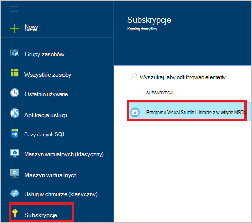
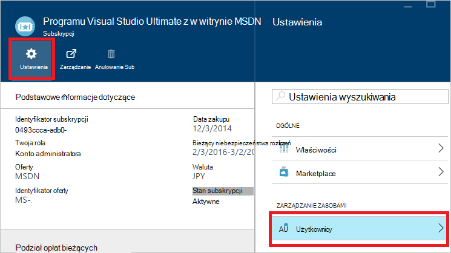
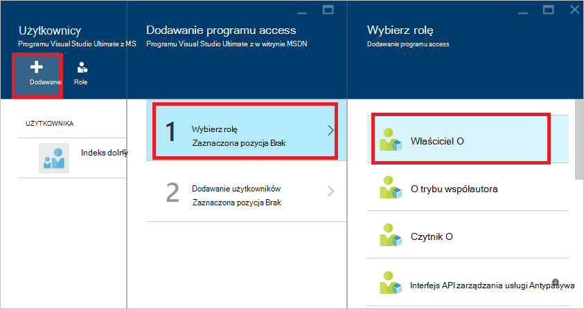
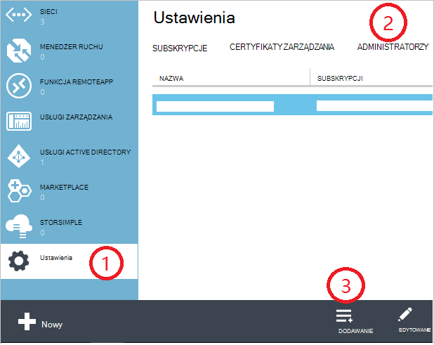
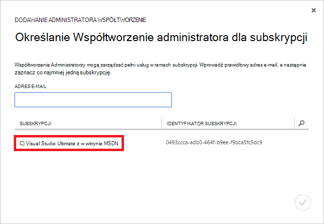
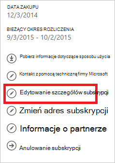
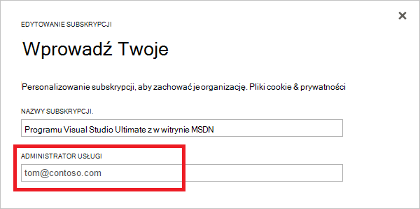

<properties
    pageTitle="Jak dodać lub zmienić role administratora Azure | Microsoft Azure"
    description="Opisano, jak dodać lub zmienić administratora współpracujących Azure, Administrator usługi i konta administratora"
    services=""
    documentationCenter=""
    authors="genlin"
    manager="mbaldwin"
    editor=""
    tags="billing"/>

<tags
    ms.service="billing"
    ms.workload="na"
    ms.tgt_pltfrm="na"
    ms.devlang="na"
    ms.topic="article"
    ms.date="08/17/2016"
    ms.author="genli"/>

# Jak dodać lub zmienić role administratora Azure

Istnieją trzy rodzaje ról administratora w Microsoft Azure:

| Ról administracyjnych   | Limit  | Opis
| ------------- | ------------- |---------------|
|Konto administratora (AA)  | 1 na konto Azure  |Jest to osoba, która utworzył konta w usłudze lub kupiony Azure subskrypcje i możliwość uzyskać dostęp do [Centrum konta](https://account.windowsazure.com/Home/Index) i wykonywać różne zadania zarządzania. Obejmują możliwość Utwórz subskrypcje, anulowania subskrypcji, zmienianie rozliczeń za subskrypcję i zmienić administratora usługi.
| Usługa administratora | 1 na subskrypcję Azure  |Ta rola jest autoryzowany do zarządzania usługami w [Azure portal](https://portal.azure.com). Domyślnie dla nowej subskrypcji administratorem konta jest również administratorem usługi.|
|Współtworzenie administratora (CA) w [portalu klasyczny Azure](https://manage.windowsazure.com)|200 subskrypcji| Ta rola ma uprawnienia równoważne programu access jako Administrator usługi, ale nie można zmienić skojarzenia subskrypcji Azure katalogów. |

> [AZURE.NOTE] Azure oparta na rolach Active Directory Access Control (RBAC) umożliwia użytkownikom można dodać do wielu ról. Aby uzyskać więcej informacji zobacz [Kontrola dostępu opartego na Azure Active Directory roli](./active-directory/role-based-access-control-configure.md).

> [AZURE.NOTE] Jeśli potrzebujesz dodatkowej pomocy w dowolnym momencie, w tym artykule, szybko [kontakt z pomocą techniczną](https://portal.azure.com/?#blade/Microsoft_Azure_Support/HelpAndSupportBlade) , aby uzyskać problemu rozwiązać, sprawdź.

## Jak dodać administratora dla subskrypcji

**Azure portal**

1. Zaloguj się do [portalu Azure](https://portal.azure.com).

2. W menu Centrum wybierz **subskrypcję** > *subskrypcję, do której ma być administratorem, aby uzyskać dostęp do*.

    

3. Karta subskrypcji, wybierz **Ustawienia**> **użytkowników**.

    
4. W karta użytkowników wybierz pozycję **Dodaj**>**Wybierz rolę** > **właściciel**.

    

    **Uwaga**
    - Rola właściciel ma same uprawnienia dostępu administratora współpracujących. Tej roli nie ma uprawnień dostępu do [Centrum konto Azure](https://account.windowsazure.com/subscriptions).
    - Właściciele dodanych przez [Azure portal](https://portal.azure.com) nie może zarządzać usług w [portalu klasyczny Azure](https://manage.windowsazure.com).  

5. Wpisz adres e-mail użytkownika, którego chcesz dodać jako właściciel, kliknij użytkownika, a następnie kliknij przycisk **Wybierz**.

    

**Portal Azure klasyczny**

1. Zaloguj się do [portalu klasyczny Azure](https://manage.windowsazure.com/).

2. W okienku nawigacji wybierz pozycję **Ustawienia**> **Administratorzy**> **Dodaj**.  

    

3. Wpisz adres e-mail osoby, którą chcesz dodać jako administrator Współtworzenie, a następnie wybierz subskrypcję, do której chcesz Współtworzenie administratorem, aby uzyskać dostęp do. 

     

Adres e-mail można dodawać jako Administrator współpracujących:

* **Konto Microsoft** (dawniej identyfikator Windows Live ID)  
 Account Microsoft umożliwia logowanie się do wszystkich produktów firmy Microsoft domowych i cloud services, takiego jak program Outlook (Hotmail), programu Skype (MSN), OneDrive, Windows Phone i Xbox LIVE.
* **Konto organizacji** 
 Konto organizacji jest kontem utworzonym w obszarze usługi Azure Active Directory. Adres organizacji konta podobny do następującego: user@ &lt;domeny&gt;. onmicrosoft.com

### Ograniczenia

 * Każdej subskrypcji jest skojarzony z katalogu Azure AD (nazywane także domyślny katalog). Aby znaleźć subskrypcji jest skojarzony z katalogu domyślne, przejdź do [portalu klasyczny Azure](https://manage.windowsazure.com/), wybierz pozycję **Ustawienia** > **subskrypcji**. Sprawdź identyfikator subskrypcji, aby odnaleźć katalog domyślny.

 * Po zalogowaniu się za pomocą Account firmy Microsoft, możesz jedynie dodać jako Administrator współpracujących innych Accounts Microsoft lub użytkowników w katalogu domyślne.

 * Jeśli użytkownik jest zalogowany przy użyciu konta organizacji, możesz dodać inne konta organizacji w Twojej organizacji, administrator Współtworzenie. Na przykład abby@contoso.com można dodać bob@contoso.com jako Administrator usługi lub współpracujących administratora, ale nie można dodać john@notcontoso.com chyba że john@noncontoso.com użytkownika w katalogu domyślne. Dodawanie użytkowników Account Microsoft jako Administrator usługi lub Administrator współpracujących nadal użytkowników zalogowanych przy użyciu konta organizacji.

 * Teraz, gdy jest możliwe do zalogowania się do Azure za pomocą konta organizacji, Oto zmian w wymaganiach konta administratora usługi i Współtworzenie administratora:

    Metody logowania| Dodawanie Account Microsoft lub użytkowników w katalogu domyślne jako urzędu certyfikacji lub SA?  |Dodawanie konta organizacji w tej samej organizacji jako urzędu certyfikacji lub SA? |Dodawanie konta organizacji w innej organizacji jako urzędu certyfikacji lub SA?
    ------------- | ------------- |---------------|---------------
    Konto Microsoft |Tak|Brak|Brak
    Konto organizacji|Tak|Tak|Brak

## Jak zmienić administratora usługi dla subskrypcji

Tylko Administrator konta może zmienić Administrator usługi dla subskrypcji.

1. Zaloguj się do [Centrum konto Azure](https://account.windowsazure.com/subscriptions) przy użyciu konta administratora.

2. Wybierz subskrypcję, którą chcesz zmienić.

3. Po prawej stronie kliknij pozycję **Edytuj subskrypcji** szczegóły.  

    

4. W oknie dialogowym **ADMINISTRATOR usługi** wpisz adres e-mail nowego administratora usługi.  

    

## Jak zmienić konto administratora

Aby przekazać własność konto Azure z innym kontem, zobacz [Transferowanie własność Azure subskrypcji](billing-subscription-transfer.md).

## Następne kroki

* Aby dowiedzieć się więcej na temat sposobu dostęp do zasobów sterują platformy Microsoft Azure, zobacz [Opis dostęp do zasobów platformy Azure](./active-directory/active-directory-understanding-resource-access.md)

* Aby uzyskać więcej informacji na jak usługi Azure Active Directory odnosi się do subskrypcji usługi Azure zobacz [jak Azure subskrypcje są skojarzone z usługi Azure Active Directory](./active-directory/active-directory-how-subscriptions-associated-directory.md)

* Aby uzyskać więcej informacji na jak usługi Azure Active Directory odnosi się do subskrypcji usługi Azure zobacz [Przypisywanie ról administratora w usłudze Active Directory platformy Azure](./active-directory/active-directory-assign-admin-roles.md)

> [AZURE.NOTE] Jeśli nadal masz dodatkowo pytania, szybko [kontakt z pomocą techniczną](https://portal.azure.com/?#blade/Microsoft_Azure_Support/HelpAndSupportBlade) , aby uzyskać problemu rozwiązać, sprawdź.
