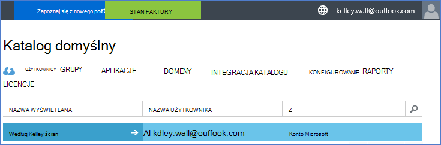
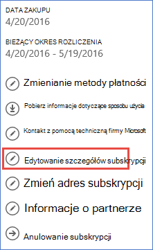

<properties
    pageTitle="Używanie dzierżawy usługi Office 365 z subskrypcją usługi Azure | Microsoft Azure"
    description="Dowiedz się, jak dodać katalog usługi Office 365 (dzierżawy) do subskrypcji usługi Azure, aby wprowadzić skojarzenia."
    services=""
    documentationCenter=""
    authors="JiangChen79"
    manager="mbaldwin"
    editor=""
    tags="billing,top-support-issue"/>

<tags
    ms.service="billing"
    ms.workload="na"
    ms.tgt_pltfrm="ibiza"
    ms.devlang="na"
    ms.topic="article"
    ms.date="09/16/2016"
    ms.author="cjiang"/>

# Kojarzenie dzierżawy usługi Office 365 z subskrypcją usługi Azure
Jeśli zarówno Azure, jak i usługi Office 365 subskrypcji został zakupiony oddzielnie w przeszłości, a teraz chcesz mieć dostępu do dzierżawy usługi Office 365 z subskrypcji Azure, jest proste to zrobić. W tym artykule pokazano, jak.

> [AZURE.NOTE] Ten artykuł nie dotyczy to klientów umowy Enterprise (EA).

## Szybkie wskazówki
Aby skojarzyć dzierżawy usługi Office 365 z subskrypcją usługi Azure, konto Azure umożliwia dodawanie dzierżawy usługi Office 365, a następnie skojarzyć subskrypcji Azure dzierżawy usługi Office 365.

## Szczegółowe kroki
W tym scenariuszu według Kelley tablica jest użytkownik, który ma subskrypcję na koncie usługi Azure kelley.wall@outlook.com. Według Kelley też ma subskrypcję usługi Office 365 przy użyciu konta kelley.wall@contoso.onmicrosoft.com. Teraz według Kelley chce uzyskać dostęp do dzierżawy usługi Office 365 z subskrypcją Azure.

### Wymagania wstępne
Skojarzenia działał poprawnie konieczne są następujące wymagania:

- Poświadczenia administratora usługi Azure subskrypcji są wymagane. Administratorów współpracujących nie można wykonać podzbiór czynności.
- Poświadczenia administratora globalnego dzierżawy usługi Office 365 są wymagane.
- Adres e-mail administratora usługi nie mogą być zawarte w dzierżawie usługi Office 365.
- Adres e-mail administratora usługi nie są zgodne z dowolnego administratora globalnego usługi dzierżawy usługi Office 365.
- Jeśli obecnie korzystasz z adresu e-mail konta Microsoft i konto organizacji, tymczasowo zmienić administratora usługi Azure subskrypcji, aby użyć innego konta Microsoft. [Strona Tworzenie konta konto Microsoft](https://signup.live.com/), możesz utworzyć nowe konto Microsoft.

Aby zmienić administratora usługi, wykonaj następujące kroki:

1. Zaloguj się do [portalu zarządzania kontem](https://account.windowsazure.com/subscriptions).
2. Wybierz subskrypcję, którą chcesz zmienić.
3. Kliknij przycisk **Edytuj szczegóły subskrypcji**.

    

4. W oknie dialogowym **ADMINISTRATOR usługi** wprowadź adres e-mail nowego administratora usługi.

    

### Kojarzenie dzierżawy usługi Office 365 z subskrypcją Azure
Aby skojarzyć dzierżawy usługi Office 365 z subskrypcją Azure, wykonaj następujące czynności:

1.  Zaloguj się do [portalu zarządzania kontem](https://account.windowsazure.com/subscriptions) przy użyciu poświadczeń administratora usługi.
2.  W okienku po lewej stronie wybierz pozycję **Usługi ACTIVE DIRECTORY**.

    

    > [AZURE.NOTE] Nie powinna być widoczna dzierżawy usługi Office 365. Jeśli zostanie wyświetlony, pomiń krok dalej.

    

3. Dodawanie dzierżawy usługi Office 365 do subskrypcji usługi Azure.

    . Wybierz pozycję **Nowy** > **katalogu** > **Utwórz niestandardowe**.

    

    b. Na stronie **Dodawanie katalogów** w **katalogu**wybierz pozycję **Użyj istniejącego katalogu**. Następnie należy zaznaczyć **mogę wylogowano się teraz**i wybierz opcję **Pełna** .

    

    c. Po wylogowano się, zaloguj się przy użyciu poświadczeń administratora globalnego dzierżawy usługi Office 365.

    

    d. Wybierz pozycję **Kontynuuj**.

    

    e. Wybierz pozycję **Wyloguj się teraz**.

    

    f. Zaloguj się do [portalu zarządzania kontem](https://account.windowsazure.com/subscriptions) przy użyciu poświadczeń administratora usługi.

    

    g. Powinien zostać wyświetlony dzierżawy usługi Office 365 na pulpicie nawigacyjnym.

    

4. Zmień katalog skojarzonego z subskrypcją Azure.

    . Wybierz pozycję **Ustawienia**.

    

    b. Wybierz subskrypcję Azure, a następnie wybierz **Edytuj katalogu**.
    

    c. Wybierz przycisk **Dalej** .

    

    > [AZURE.WARNING] Zostanie wyświetlone ostrzeżenie usunięcie wszystkich administratorów współpracujących.

    

    >[AZURE.WARNING] Ponadto spowoduje również usunięcie wszystkich użytkowników [Kontrola dostępu oparta na rolach (RBAC)](./active-directory/role-based-access-control-configure.md) z dostępem przypisane w istniejących grup zasobów. Ostrzeżenie, które otrzymujesz wzmianki tylko usunięcie administratorów współpracujących.

    

    d. Wybierz opcję **Pełna** .

5. Teraz możesz dodać konta organizacji usługi Office 365 jako administratorów współpracujących do dzierżawy usługi Azure Active Directory.

    . Wybierz kartę **ADMINISTRATORZY** , a następnie wybierz pozycję **Dodaj**.

    

    b. Wprowadź konto organizacji dzierżawy usługi Office 365, wybierz subskrypcję, Azure, a następnie wybierz **Wykonano** .

    

    c. Wróć do karty **ADMINISTRATORZY** . Konto organizacji wyświetlane jako administrator współpracujących powinna być widoczna.

    

6. Następny możesz przetestować programu access z administratorem Współtworzenie.

    . Wyloguj się do portalu zarządzania kontami.

    b. Otwórz [portal Zarządzanie kontami](https://account.windowsazure.com/subscriptions) lub [Azure portal](https://portal.azure.com/).

    c. Jeśli strona logowania jest Azure zawiera łącze **Zaloguj się przy użyciu konta organizacji**, wybierz łącze. W przeciwnym razie pomiń ten krok.

    

    d. Wprowadź poświadczenia administratora Współtworzenie, a następnie wybierz, **Zaloguj się**.

    

## Następne kroki
Scenariusze powiązanych obejmują:

- Masz już subskrypcji usługi Office 365 oraz są gotowe do subskrypcji usługi Azure, ale chcesz użyć istniejących kont użytkowników usługi Office 365 dla subskrypcji Azure.
- Jesteś użytkownikiem Azure subskrybenta i chcesz uzyskać subskrypcji usługi Office 365 dla użytkowników istniejącego wystąpienia usługi Azure Active Directory.

Aby dowiedzieć się, jak wykonać te zadania, zobacz [Korzystanie z istniejącego usługi Office 365 kont z subskrypcją usługi Azure lub odwrotnie](billing-use-existing-office-365-account-azure-subscription.md).
