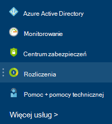

<properties
    pageTitle="Jak pobrać usługi Azure rozliczenia faktury i dzienne danych dotyczących użycia | Microsoft Azure"
    description="W tym artykule opisano sposób pobierania dzienny danych dotyczących użycia i usługi Azure faktura rozliczeniowa"
    services=""
    documentationCenter=""
    authors="genlin"
    manager="mbaldwin"
    editor=""
    tags="billing"
    />

<tags
    ms.service="billing"
    ms.workload="na"
    ms.tgt_pltfrm="na"
    ms.devlang="na"
    ms.topic="article"
    ms.date="10/10/2016"
    ms.author="genli"/>

# Jak pobrać usługi Azure rozliczenia faktury i dzienne danych dotyczących użycia

> [AZURE.NOTE] Jeśli potrzebujesz dodatkowej pomocy w dowolnym momencie, w tym artykule, szybko [kontakt z pomocą techniczną](https://portal.azure.com/?#blade/Microsoft_Azure_Support/HelpAndSupportBlade) , aby uzyskać problemu rozwiązać, sprawdź.

Jako administrator konto Azure i można przeglądać faktura rozliczeniowa dzienny danych dotyczących użycia [Azure portal](https://portal.azure.com) lub [Centrum konto Azure](https://account.windowsazure.com/subscriptions). Oto jak:

## Azure portal

1. Zaloguj się do [portalu Azure](https://portal.azure.com) jako administrator konta.

    >[AZURE.NOTE] Tylko administrator konto ma uprawnienia do uzyskiwania dostępu do danych rozliczeń. Aby uzyskać więcej informacji na temat dowiedzieć się, kto jest administratorem konta subskrypcji zobacz [często zadawane pytania](billing-subscription-transfer.md#faq).

2. W menu Centrum wybierz pozycję **rozliczenia**. Na karta **rozliczenia** można znaleźć kilka przydatne informacje, takie jak następnej daty rozliczenia.

    
3. W sekcji **koszty subskrypcja** Wybierz subskrypcję, do której chcesz wyświetlić.

    
4. Kliknij pozycję **rozliczenia i zastosowania**.

    

5. Na karta **historię rachunków** kliknij przycisk **Pobierz fakturę** wyświetlanie kopii rachunku. Kliknij pozycję okres rozliczeniowy, aby wyświetlić dzienny danych dotyczących użycia.

    

## Centrum konto Azure

1. Zaloguj się do [Centrum konto Azure](https://account.windowsazure.com/subscriptions) jako administrator konta.
2. Wybierz subskrypcję, dla której ma zostać faktury i zastosowania informacje.
3. Wybierz pozycję **HISTORIĘ rachunków**.  
4. Można wyświetlić z instrukcji dla okresu rozliczeniowego sześć ostatnich i bieżącego okresu unbilled.   
5. Wybierz **Instrukcji bieżący widok** , aby wyświetlić oszacowanie opłaty w czasie wygenerowania szacowaną. Te informacje tylko aktualizowanych codziennie i nie mogą zawierać wykorzystanie sieci. Rachunku miesięczny mogą różnić się od tej oszacowanie.   
6. Wybierz opcję **Pobierz fakturę** , aby wyświetlić kopię rachunku ostatniej.  
7. Wybierz pozycję **Pobierz zastosowania** do pobrania dzienny dane użycia jako pliku CSV. 

> [AZURE.NOTE] Jeśli nadal masz dalsze pytania, szybko [kontakt z pomocą techniczną](https://portal.azure.com/?#blade/Microsoft_Azure_Support/HelpAndSupportBlade) , aby uzyskać problemu rozwiązać, sprawdź.
