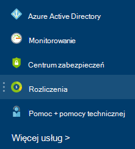

<properties
    pageTitle="Opis usługi Azure zewnętrznych opłat za usługi | Microsoft Azure"
    description="Informacje na temat rozliczeń usług zewnętrznych, wcześniej znana pod nazwą witryny Marketplace, opłaty platformy Azure."
    services=""
    documentationCenter=""
    authors="adpick"
    manager="felixwu"
    editor=""
    tags="billing"
    />

<tags
    ms.service="billing"
    ms.workload="na"
    ms.tgt_pltfrm="na"
    ms.devlang="na"
    ms.topic="article"
    ms.date="10/12/2016"
    ms.author="adpick"/>

# Opis usługi Azure kosztów usług zewnętrznych

W tym artykule wyjaśniono, rozliczenie usług zewnętrznych platformy Azure. Usług zewnętrznych umożliwia się o nazwie zamówienia Marketplace. Usług zewnętrznych są dostarczane przez dostawców niezależnych usługi, ale są całkowicie zintegrowane w ekosystemie Azure. Dowiedz się, jak:

- Identyfikowanie usług zewnętrznych
- Opis sposobu rozliczenie różni się od innych Azure zasobów
- Wyświetlanie i śledzić koszty, które możesz Naliczanie z korzystania z usług zewnętrznych
- Zarządzanie zleceniami zewnętrznych i jak zapłacić za

## Co to są Azure usług zewnętrznych?

Usług zewnętrznych umożliwia wywołać Azure Marketplace. Ogólnie rzecz biorąc są one usług opublikowany przez dostępne trzecich Azure. Na przykład ClearDB i SendGrid są usług zewnętrznych, które mogą zakupić Azure, ale nie są publikowane przez firmę Microsoft.

### Identyfikowanie usług zewnętrznych

Po przepisu nowych usług zewnętrznych lub zasobów jest pokazywana Ostrzeżenie:

>[AZURE.NOTE] Usługi zewnętrzne są publikowane przez firmy, które nie są firmy Microsoft, ale czasami produktów firmy Microsoft, są również określane jako usług zewnętrznych.

### Dotyczy oddzielnie rozliczenie usług zewnętrznych

Usług zewnętrznych są traktowane jako poszczególnych zamówień w ramach subskrypcji usługi Azure. Okres rozliczeniowy dla każdej usługi jest ustawiona, gdy Kup usługę. Nie należy mylić z okresu rozliczeniowego subskrypcji, w którym został zakupiony. Otrzymasz osobnych rozliczenia i karty kredytowej jest naliczany oddzielnie.

### Każda zewnętrznych usługa ma inny model rozliczeń

Niektóre usługi są wystawiona w sposób płatne, podczas gdy inne osoby za pomocą modelu podstawie płatności miesięcznych. Potrzebujesz karty kredytowej dla Azure usług zewnętrznych, nie można kupić usług zewnętrznych z płacą faktury.

### Nie można użyć miesięczny środków bezpłatne dla usług zewnętrznych

Jeśli korzystasz z subskrypcji usługi Azure, zawierającego [bezpłatne środków](https://azure.microsoft.com/pricing/spending-limits/), nie można zastosować do zewnętrznej usługi rozliczenia. Zakup usług zewnętrznych za pomocą karty kredytowej.

## Widok zewnętrznej usługi wydatków i Historia

Można wyświetlić listę usług zewnętrznych, znajdujących się w każdej subskrypcji w [portalu Azure](https://portal.azure.com/): 

1. Zaloguj się do [portalu Azure](https://portal.azure.com/) i [Przejdź do strony karta **rozliczenia** ](https://portal.azure.com/?flight=1#blade/Microsoft_Azure_Billing/BillingBlade).

     
  
2. W sekcji **koszty subskrypcja** Wybierz subskrypcję, do której chcesz wyświetlić. 
   
    

3. Kliknij pozycję **usług zewnętrznych**.

    

4. Powinien zostać wyświetlony poszczególnych zamówień zewnętrznej usługi, nazwę wydawcy, warstwa usług, których używasz, nazwa nadana zasobu oraz bieżący stan zamówienia. Wybierz pozycję zewnętrznej usługi, aby wyświetlić ostatnie rozliczenia.

    

5. W tym miejscu można wyświetlić wcześniejsze kwoty rachunku tym podziału podatku.

    

## Zarządzanie formy płatności dla zleceń serwisowych zewnętrznych

Aktualizowanie metodami płatności dla zleceń serwisowych zewnętrznych z poziomu [Centrum konta](https://account.windowsazure.com/).

> [AZURE.NOTE] Jeśli zakupiono subskrypcję za pomocą konta służbowe należy [kontakt z pomocą techniczną](https://portal.azure.com/?#blade/Microsoft_Azure_Support/HelpAndSupportBlade) , aby zmienić metodę płatności.

1. Zaloguj się do [Centrum konta](https://account.windowsazure.com/) , a następnie [Przejdź do karty **marketplace** ](https://account.windowsazure.com/Store)

    

2. Wybierz usługę zewnętrznych, którą chcesz zarządzać

    

3. Kliknij pozycję **Zmień metodę płatności** w prawej części strony. To łącze łączy do różnych portalu Zarządzanie metodę płatności.
    
    

4. Kliknij przycisk **Edytuj informacje** , a następnie postępuj zgodnie z instrukcjami, aby zaktualizować informacje o płatności.

    
    
## Anulowanie zamówienia zewnętrznej usługi

Jeśli chcesz anulować zamówienie zewnętrznej usługi, musisz usunąć zasobu w [Azure portal](https://portal.azure.com).

## Potrzebujesz pomocy? Kontakt z pomocą techniczną.

Jeśli nadal masz dalsze pytania, szybko [kontakt z pomocą techniczną](https://portal.azure.com/?#blade/Microsoft_Azure_Support/HelpAndSupportBlade) , aby uzyskać problemu rozwiązać, sprawdź.
