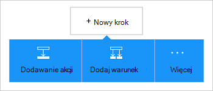

<properties
    pageTitle="Dodać magazyn obiektów blob platformy Azure łącznika w aplikacji logika | Microsoft Azure"
    description="Omówienie magazynem obiektów blob Azure łącznik z parametrami interfejsu API usługi REST"
    services=""
    documentationCenter="" 
    authors="MandiOhlinger"
    manager="anneta"
    editor=""
    tags="connectors"/>

<tags
   ms.service="logic-apps"
   ms.devlang="na"
   ms.topic="article"
   ms.tgt_pltfrm="na"
   ms.workload="integration" 
   ms.date="10/18/2016"
   ms.author="mandia"/>

# Wprowadzenie do łącznika magazyn obiektów blob platformy Azure
Magazyn obiektów Blob platformy Azure to usługa do przechowywania dużych ilości danych niestrukturalne. Wykonywać różne akcje, takie jak przekazywanie, aktualizowanie, pobieranie i usuwanie BLOB w magazynie obiektów blob platformy Azure. 

Z magazynem obiektów blob platformy Azure możesz:

- Tworzenie przepływu pracy, przekazując nowych projektów lub pobieranie plików, które zostały ostatnio zaktualizowane.
- Pobieranie metadanych pliku, usuń plik, kopiowanie plików i nie tylko za pomocą akcji. Na przykład po zaktualizowaniu narzędzia w witrynie sieci web (wyzwalacza) Azure zaktualizować plik w magazynie obiektów blob (Akcja). 

W tym temacie pokazano, jak używać łącznika magazyn obiektów blob w aplikacji logiczny, a także zawiera listę akcji.

>[AZURE.NOTE] Tą wersją artykułu dotyczy aplikacji logiki ogólnodostępną (GA). 

Aby dowiedzieć się więcej na temat aplikacji logiczny, zobacz [Co to są aplikacje logiki](../app-service-logic/app-service-logic-what-are-logic-apps.md) i [Tworzenie aplikacji logiczny](../app-service-logic/app-service-logic-create-a-logic-app.md).

## Nawiązywanie połączenia z magazynem obiektów blob platformy Azure

Przed aplikacji logika uzyskać dostęp do dowolnej usługi, należy najpierw utworzyć *połączenie* z usługą. Połączenia umożliwia łączność aplikacji logiki i innej usługi. Na przykład aby połączyć się z konta miejsca do magazynowania, tworzenia magazyn obiektów blob *połączenia*. Aby utworzyć połączenie, wprowadź poświadczenia, zwykle używanych do uzyskania dostępu do usługi, którego łączysz się. Dlatego z miejscem do magazynowania Azure, wprowadź poświadczenia konta przestrzeni dyskowej, aby utworzyć połączenie. 

#### Utwórz połączenie

>[AZURE.INCLUDE [Create a connection to Azure blob storage](../../includes/connectors-create-api-azureblobstorage.md)]
 
## Użyj wyzwalacza

Ten łącznik nie zawiera wszystkie wyzwalacze. Uruchom aplikację logiczny, takie jak wyzwalacz cyklu, wyzwalacza HTTP Webhook, wyzwalacze dostępne w przypadku innych łączników i innych elementów za pomocą innych wyzwalaczy. [Tworzenie aplikacji logiki](../app-service-logic/app-service-logic-create-a-logic-app.md) zawiera przykład.

## Za pomocą akcji
    
Akcja jest czynność wykonaną przez przepływ pracy zdefiniowane w aplikacji logicznych.

1. Kliknij znak plus. Zobacz ustawienia kilku opcji: **Dodaj akcję**, **Dodaj warunek**lub jeden z **większą liczbą** opcji.

    

2. Wybierz przycisk **Dodaj akcję**.

3. W polu tekstowym wpisz "blob", aby uzyskać listę dostępnych akcji.

     

4. W naszym przykładzie wybierz pozycję **AzureBlob — uzyskiwanie metadanych pliku przy użyciu ścieżki**. Jeśli połączenie już istnieje, wybierz pozycję **...** Przycisk (Pokaż selektor), aby wybrać plik.

    

    Jeśli zostanie wyświetlony monit o informacje o połączeniu, wprowadź szczegółowe informacje, aby utworzyć połączenie. [Utwórz połączenie](connectors-create-api-azureblobstorage.md#create-the-connection) w tym temacie opisano następujące właściwości. 

    > [AZURE.NOTE] W tym przykładzie będziemy korzystać z metadanych pliku. Aby wyświetlić metadane, Dodaj inną akcję, która tworzy nowy plik przy użyciu innego łącznika. Na przykład Dodaj akcję OneDrive, która umożliwia utworzenie nowej "Testowanie" pliku na podstawie metadanych. 

5. **Zapisz** zmiany (lewym górnym rogu paska narzędzi). Logika aplikacji są zapisywane i automatycznie włączona.

> [AZURE.TIP] [Eksplorator magazynu](http://storageexplorer.com/) jest doskonałym narzędziem do zarządzania wieloma kontami miejsca do magazynowania.

## Szczegóły techniczne

## Magazyn obiektów Blob akcje

|Akcja|Opis|
|--- | ---|
|[Pobierz plik metadanych](connectors-create-api-azureblobstorage.md#get-file-metadata)|Operacja otrzymuje metadanych pliku przy użyciu identyfikatora pliku.|
|[Aktualizowanie plików](connectors-create-api-azureblobstorage.md#update-file)|Operacja aktualizacji pliku.|
|[Usuwanie pliku](connectors-create-api-azureblobstorage.md#delete-file)|Operacja usuwa plik.|
|[Pobieranie metadanych pliku przy użyciu ścieżki](connectors-create-api-azureblobstorage.md#get-file-metadata-using-path)|Operacja otrzymuje metadanych pliku przy użyciu ścieżki.|
|[Pobieranie zawartości pliku przy użyciu ścieżki](connectors-create-api-azureblobstorage.md#get-file-content-using-path)|Operacja pobiera zawartość pliku przy użyciu ścieżki.|
|[Pobieranie zawartości pliku](connectors-create-api-azureblobstorage.md#get-file-content)|Operacja pobiera zawartość pliku przy użyciu identyfikatora.|
|[Tworzenie pliku](connectors-create-api-azureblobstorage.md#create-file)|Operacja spowoduje przekazanie pliku.|
|[Skopiuj plik](connectors-create-api-azureblobstorage.md#copy-file)|Operacja kopiuje plik magazynem obiektów Blob platformy Azure.|
|[Wyodrębnianie archiwum do folderu](connectors-create-api-azureblobstorage.md#extract-archive-to-folder)|Operacja wyodrębnia plik archiwum do folderu (przykład: zip).|

### Szczegóły akcji

W tej sekcji Zobacz szczegółowe informacje na temat każdej akcji, w tym wszystkie wymagane lub opcjonalne właściwości wprowadzania i dowolne odpowiednie dane wyjściowe skojarzone z łącznik.

#### Pobierz plik metadanych
Operacja otrzymuje metadanych pliku przy użyciu identyfikatora pliku.  

|Nazwa właściwości| Nazwa wyświetlana|Opis|
| ---|---|---|
|Identyfikator *|Plik|Wybierz plik|

Gwiazdka (*) oznacza, że są one wymagane.

##### Szczegóły wyników
BlobMetadata

| Nazwa właściwości | Typ danych |
|---|---|
|Identyfikator|ciąg|
|Nazwa|ciąg|
|DisplayName|ciąg|
|Ścieżka|ciąg|
|Ostatnia modyfikacja|ciąg|
|Rozmiar|Liczba całkowita|
|Typ nośnika|ciąg|
|IsFolder|wartość logiczna|
|ETag|ciąg|
|FileLocator|ciąg|

#### Aktualizowanie plików
Operacja aktualizacji pliku.  

|Nazwa właściwości| Nazwa wyświetlana|Opis|
| ---|---|---|
|Identyfikator *|Plik|Wybierz plik|
|Treść *|Zawartość pliku|Zawartość pliku do aktualizacji|

Gwiazdka (*) oznacza, że są one wymagane.

##### Szczegóły wyników
BlobMetadata

| Nazwa właściwości | Typ danych |
|---|---|
|Identyfikator|ciąg|
|Nazwa|ciąg|
|DisplayName|ciąg|
|Ścieżka|ciąg|
|Ostatnia modyfikacja|ciąg|
|Rozmiar|Liczba całkowita|
|Typ nośnika|ciąg|
|IsFolder|wartość logiczna|
|ETag|ciąg|
|FileLocator|ciąg|

#### Usuwanie pliku
Operacja usuwa plik.  

|Nazwa właściwości| Nazwa wyświetlana|Opis|
| ---|---|---|
|Identyfikator *|Plik|Wybierz plik|

Gwiazdka (*) oznacza, że są one wymagane.

##### Szczegóły wyników
Brak.

#### Pobieranie metadanych pliku przy użyciu ścieżki
Operacja otrzymuje metadanych pliku przy użyciu ścieżki.  

|Nazwa właściwości| Nazwa wyświetlana|Opis|
| ---|---|---|
|Ścieżka *|Ścieżka pliku|Wybierz plik|

Gwiazdka (*) oznacza, że są one wymagane.

##### Szczegóły wyników
BlobMetadata

| Nazwa właściwości | Typ danych |
|---|---|
|Identyfikator|ciąg|
|Nazwa|ciąg|
|DisplayName|ciąg|
|Ścieżka|ciąg|
|Ostatnia modyfikacja|ciąg|
|Rozmiar|Liczba całkowita|
|Typ nośnika|ciąg|
|IsFolder|wartość logiczna|
|ETag|ciąg|
|FileLocator|ciąg|

#### Pobieranie zawartości pliku przy użyciu ścieżki
Operacja pobiera zawartość pliku przy użyciu ścieżki.  

|Nazwa właściwości| Nazwa wyświetlana|Opis|
| ---|---|---|
|Ścieżka *|Ścieżka pliku|Wybierz plik|

Gwiazdka (*) oznacza, że są one wymagane.

##### Szczegóły wyników
Brak.

#### Pobieranie zawartości pliku
Operacja pobiera zawartość pliku przy użyciu identyfikatora.  

|Nazwa właściwości| Typ danych|Opis|
| ---|---|---|
|Identyfikator *|ciąg|Wybierz plik|

Gwiazdka (*) oznacza, że są one wymagane.

##### Szczegóły wyników
Brak.

#### Tworzenie pliku
Operacja spowoduje przekazanie pliku.  

|Nazwa właściwości| Nazwa wyświetlana|Opis|
| ---|---|---|
|ścieżkafolderu *|Ścieżka folderu|Wybierz folder|
|Nazwa *|Nazwa pliku|Nazwa pliku do przekazania|
|Treść *|Zawartość pliku|Zawartość pliku do przekazania|

Gwiazdka (*) oznacza, że są one wymagane.

##### Szczegóły wyników
BlobMetadata

| Nazwa właściwości | Typ danych | 
|---|---|
|Identyfikator|ciąg|
|Nazwa|ciąg|
|DisplayName|ciąg|
|Ścieżka|ciąg|
|Ostatnia modyfikacja|ciąg|
|Rozmiar|Liczba całkowita|
|Typ nośnika|ciąg|
|IsFolder|wartość logiczna|
|ETag|ciąg|
|FileLocator|ciąg|

#### Skopiuj plik
Operacja kopiuje plik magazynem obiektów Blob platformy Azure.  

|Nazwa właściwości| Nazwa wyświetlana|Opis|
| ---|---|---|
|źródło *|Adres url źródła|Określ adres Url z plikiem źródłowym|
|miejsce docelowe *|Ścieżka pliku docelowego|Określ ścieżkę pliku docelowego, w tym nazwa pliku docelowego|
|Zastąp|Czy zastąpić?|Istniejącego pliku docelowego, powinny być zastąpione (PRAWDA i FAŁSZ)?  |

Gwiazdka (*) oznacza, że są one wymagane.

##### Szczegóły wyników
BlobMetadata

| Nazwa właściwości | Typ danych |
|---|---|
|Identyfikator|ciąg|
|Nazwa|ciąg|
|DisplayName|ciąg|
|Ścieżka|ciąg|
|Ostatnia modyfikacja|ciąg|
|Rozmiar|Liczba całkowita|
|Typ nośnika|ciąg|
|IsFolder|wartość logiczna|
|ETag|ciąg|
|FileLocator|ciąg|

#### Wyodrębnianie archiwum do folderu
Operacja wyodrębnia plik archiwum do folderu (przykład: zip).  

|Nazwa właściwości| Nazwa wyświetlana|Opis|
| ---|---|---|
|źródło *|Ścieżka pliku archiwum źródła|Wybierz plik archiwum|
|miejsce docelowe *|Ścieżka folderu docelowego|Wybierz zawartość, aby wyodrębnić|
|Zastąp|Czy zastąpić?|Istniejącego pliku docelowego, powinny być zastąpione (PRAWDA i FAŁSZ)?|

Gwiazdka (*) oznacza, że są one wymagane.

##### Szczegóły wyników
BlobMetadata

| Nazwa właściwości | Typ danych |
|---|---|
|Identyfikator|ciąg|
|Nazwa|ciąg|
|DisplayName|ciąg|
|Ścieżka|ciąg|
|Ostatnia modyfikacja|ciąg|
|Rozmiar|Liczba całkowita|
|Typ nośnika|ciąg|
|IsFolder|wartość logiczna|
|ETag|ciąg|
|FileLocator|ciąg|

## Odpowiedzi HTTP

Podczas połączenia z innych działań, może zostać wyświetlony określone odpowiedzi. W poniższej tabeli przedstawiono odpowiedzi i ich opisy:  

|Nazwa|Opis|
|---|---|
|200|Ok|
|202|Zaakceptowane|
|400|Nieprawidłowe żądanie|
|401|Brak autoryzacji|
|403|Dostęp zabroniony|
|404|Nie można odnaleźć|
|500|Wewnętrzny błąd serwera. Wystąpił nieznany błąd|
|domyślne|Operacja nie powiodła się.|

## Następne kroki

[Tworzenie aplikacji logicznych](../app-service-logic/app-service-logic-create-a-logic-app.md). Poznaj dostępne łączniki w aplikacjach logiki w naszej [listy interfejsów API](apis-list.md).

