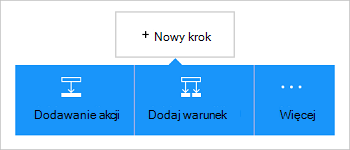

<properties
    pageTitle="Dodawanie usługi Office 365 w dodatku Outlook connector w aplikacji logika | Microsoft Azure"
    description="Tworzenie aplikacji logiki łącznikiem usługi Office 365, aby umożliwić interakcję z usługą Office 365. Na przykład: tworzenie, edytowanie i aktualizowanie elementów kalendarza i kontaktów."
    services=""    
    documentationCenter=""     
    authors="MandiOhlinger"    
    manager="anneta"    
    editor="" 
    tags="connectors" />

<tags
ms.service="logic-apps"
ms.devlang="na"
ms.topic="article"
ms.tgt_pltfrm="na"
ms.workload="integration"
ms.date="10/18/2016"
ms.author="mandia"/>

# Wprowadzenie do usługi Office 365 w dodatku Outlook connector 

Office 365 w dodatku Outlook connector umożliwia interakcję z programem Outlook w usłudze Office 365. Aby utworzyć, edytować i zaktualizuj kontakty i elementy kalendarza, również wyświetlić, wysyłanie i odpowiadanie na wiadomości e-mail za pomocą tego łącznika.

Za pomocą usługi Office 365 Outlook możesz:

- Tworzenie przepływu pracy przy użyciu funkcji kalendarza i poczty e-mail w usłudze Office 365. 
- Aby uruchomić przepływ pracy po nowej wiadomości e-mail, po zaktualizowaniu elementu kalendarza i innych z użyciem wyzwalaczy.
- Wysyłanie wiadomości e-mail, Utwórz nowe zdarzenie kalendarza i innych elementów za pomocą akcji. Na przykład gdy w usług Salesforce (wyzwalacza) znajduje się nowy obiekt, Wyślij wiadomość e-mail do usługi Office 365 Outlook (Akcja). 

W tym temacie pokazano, jak korzystać z usługi Office 365 Outlook connector w aplikacji logiczny, a także listy wyzwalacze i akcje.

>[AZURE.NOTE] Tą wersją artykułu dotyczy aplikacji logika ogólnodostępną (GA).

Aby dowiedzieć się więcej na temat aplikacji logiczny, zobacz [Co to są aplikacje logiki](../app-service-logic/app-service-logic-what-are-logic-apps.md) i [Tworzenie aplikacji logiczny](../app-service-logic/app-service-logic-create-a-logic-app.md).

## Nawiązywanie połączenia z usługi Office 365

Przed aplikacji logika uzyskać dostęp do dowolnej usługi, należy najpierw utworzyć *połączenie* z usługą. Połączenia umożliwia łączność aplikacji logiki i innej usługi. Na przykład aby nawiązać połączenie usługi Office 365 w programie Outlook, należy najpierw z usługi Office 365 *połączenia*. Aby utworzyć połączenie, wprowadź poświadczenia, zwykle używanych do uzyskania dostępu do usługi, którą chcesz nawiązać połączenie. Aby za pomocą usługi Office 365 Outlook wprowadź poświadczenia konta usługi Office 365, aby utworzyć połączenie.

## Utwórz połączenie

>[AZURE.INCLUDE [Steps to create a connection to Office 365](../../includes/connectors-create-api-office365-outlook.md)]

## Użyj wyzwalacza

Wyzwalacz to zdarzenie, które może służyć do uruchamiania przepływu pracy, zdefiniowane w aplikacji logicznych. Wyzwalacze "ankieta" usługi interwału i częstotliwość. [Dowiedz się więcej o wyzwalaczy](../app-service-logic/app-service-logic-what-are-logic-apps.md#logic-app-concepts).

1. W aplikacji logiki należy wpisać "office 365" w celu uzyskania listy wyzwalacze:  

    

2. Wybierz pozycję **Office 365 Outlook - wkrótce uruchamiając nadchodzące wydarzenie**. Jeśli połączenie już istnieje, wybierz kalendarz z listy rozwijanej.

    

    Jeśli zostanie wyświetlony monit, aby się zalogować, wprowadź znak w szczegóły, aby utworzyć połączenie. [Utwórz połączenie](connectors-create-api-office365-outlook.md#create-the-connection) w tym temacie przedstawiono kroki. 

    > [AZURE.NOTE] W tym przykładzie aplikacji logika jest uruchomiony po zaktualizowaniu zdarzenia kalendarza. Aby wyświetlić wyniki tego wyzwalacza, Dodaj inną akcję, która wysyła wiadomość tekstowa. Na przykład Dodaj akcję Twilio, *Wysyłanie wiadomości* tego tekstu podczas uruchamiania zdarzenia kalendarza w ciągu 15 minut. 

3. Wybierz przycisk **Edytuj** i ustaw wartości **częstotliwości** i **Interwał** . Na przykład jeśli chcesz wyzwalacza ankieta co 15 minut, następnie ustawiona **Częstotliwość** **minutę**i ustawianie **interwału** **15**. 

    

4. **Zapisz** zmiany (lewym górnym rogu paska narzędzi). Logika aplikacji są zapisywane i automatycznie włączona.

## Za pomocą akcji

Akcja jest czynność wykonaną przez przepływ pracy zdefiniowane w aplikacji logicznych. [Dowiedz się więcej o akcje](../app-service-logic/app-service-logic-what-are-logic-apps.md#logic-app-concepts).

1. Kliknij znak plus. Zobacz ustawienia kilku opcji: **Dodaj akcję**, **Dodaj warunek**lub jeden z **większą liczbą** opcji.

    

2. Wybierz przycisk **Dodaj akcję**.

3. W polu tekstowym wpisz "office 365" w celu uzyskania listy dostępnych akcji.

     

4. W naszym przykładzie wybierz pozycję **Office 365 Outlook - Utwórz kontakt**. Jeśli połączenie już istnieje, a następnie wybierz pozycję **Identyfikator folderu**, **Imię**i inne właściwości:  

    

    Jeśli zostanie wyświetlony monit o informacje o połączeniu, wprowadź szczegółowe informacje, aby utworzyć połączenie. [Utwórz połączenie](connectors-create-api-office365-outlook.md#create-the-connection) w tym temacie opisano następujące właściwości. 

    > [AZURE.NOTE] W tym przykładzie tworzymy nowego kontaktu w programie Outlook Office 365. Dane wyjściowe następny wyzwalacz umożliwia tworzenie kontaktu. Na przykład dodać wyzwalacza usług SalesForce *Po utworzeniu obiektu* . Następnie dodaj usługi Office 365 w programie Outlook, *Utwórz kontakt* akcję, która korzysta z pól usługi SalesForce, aby utworzyć nowy kontakt Nowy w usłudze Office 365. 

5. **Zapisz** zmiany (lewym górnym rogu paska narzędzi). Logika aplikacji są zapisywane i automatycznie włączona.

## Szczegóły techniczne

Poniżej przedstawiono szczegółowe informacje dotyczące wyzwalacze, akcje i odpowiedzi, które obsługuje to połączenie:

## Wyzwalacze usługi Office 365

|Wyzwalacza | Opis|
|--- | ---|
|[Podczas uruchamiania nadchodzące wydarzenie w wkrótce](connectors-create-api-office365-outlook.md#when-an-upcoming-event-is-starting-soon)|Operacja uaktywnia przepływu, uruchamiając Nadchodzące wydarzenia.|
|[Kiedy przychodzi nowa wiadomość e-mail](connectors-create-api-office365-outlook.md#when-a-new-email-arrives)|Operacja uaktywnia przepływu, gdy przychodzi nowa wiadomość e-mail|
|[Po utworzeniu nowego zdarzenia](connectors-create-api-office365-outlook.md#when-a-new-event-is-created)|Operacja uaktywnia przepływu po utworzeniu nowego zdarzenia w kalendarzu.|
|[Modyfikacji zdarzenia](connectors-create-api-office365-outlook.md#when-an-event-is-modified)|Operacja uaktywnia przepływu modyfikacji wydarzenia w kalendarzu.|

## Akcje usługi Office 365

|Akcja|Opis|
|--- | ---|
|[Pobieranie wiadomości e-mail](connectors-create-api-office365-outlook.md#get-emails)|Operacja otrzymuje wiadomości e-mail z folderu.|
|[Wysyłanie wiadomości e-mail](connectors-create-api-office365-outlook.md#send-an-email)|Operacja wysyła wiadomość e-mail.|
|[Usuwanie wiadomości e-mail](connectors-create-api-office365-outlook.md#delete-email)|Operacja usuwa wiadomości e-mail za pomocą identyfikatora.|
|[Oznaczanie jako przeczytane](connectors-create-api-office365-outlook.md#mark-as-read)|Operacja oznacza wiadomości e-mail jako przeczytanych.|
|[Odpowiadanie na wiadomości e-mail](connectors-create-api-office365-outlook.md#reply-to-email)|Operacja odpowiedzi na wiadomości e-mail.|
|[Pobieranie załącznika](connectors-create-api-office365-outlook.md#get-attachment)|Operacja otrzymuje załącznika wiadomości e-mail za pomocą identyfikatora.|
|[Wysyłanie wiadomości e-mail z opcjami](connectors-create-api-office365-outlook.md#send-email-with-options)|Operacja wysyła wiadomość e-mail z wiele opcji i czeka odbiorca ma odpowiedzi z jedną z opcji.|
|[Wysyłanie wiadomości e-mail zatwierdzenia](connectors-create-api-office365-outlook.md#send-approval-email)|Operacja wysyła wiadomość e-mail zatwierdzanie i czeka na odpowiedź od adresata.|
|[Uzyskiwanie kalendarzy](connectors-create-api-office365-outlook.md#get-calendars)|Operacja zawiera listę dostępnych kalendarzy.|
|[Zdarzenia](connectors-create-api-office365-outlook.md#get-events)|Operacja pobiera wydarzenia z kalendarza.|
|[Tworzenie zdarzenia](connectors-create-api-office365-outlook.md#create-event)|Operacja tworzy nowe zdarzenie w kalendarzu.|
|[Uzyskiwanie zdarzenia](connectors-create-api-office365-outlook.md#get-event)|Operacja otrzymuje określonego zdarzenia kalendarza.|
|[Usuwanie zdarzenia](connectors-create-api-office365-outlook.md#delete-event)|Operacja powoduje usunięcie wydarzenia w kalendarzu.|
|[Aktualizowanie zdarzenia](connectors-create-api-office365-outlook.md#update-event)|Operacja aktualizacji zdarzenia w kalendarzu.|
|[Pobieranie folderów kontaktów](connectors-create-api-office365-outlook.md#get-contact-folders)|Operacja Wyświetla listę folderów dostępne Kontakty.|
|[Importowanie kontaktów](connectors-create-api-office365-outlook.md#get-contacts)|Operacja pobiera kontakty z folderu kontaktów.|
|[Tworzenie kontaktu](connectors-create-api-office365-outlook.md#create-contact)|Operacja tworzy nowy kontakt w folderze Kontakty.|
|[Uzyskiwanie kontaktu](connectors-create-api-office365-outlook.md#get-contact)|Operacja pobiera określonego kontaktu z folderu kontaktów.|
|[Usuwanie kontaktu](connectors-create-api-office365-outlook.md#delete-contact)|Operacja powoduje usunięcie kontaktu z folderu Kontakty.|
|[Aktualizuj kontakt](connectors-create-api-office365-outlook.md#update-contact)|Operacja aktualizacji kontaktu w folderze Kontakty.|

### Szczegóły wyzwalacza i akcji

W tej sekcji Zobacz szczegółowe informacje o każdej wyzwalacza i działań, w tym wszystkie wymagane lub opcjonalne właściwości wprowadzania i dowolne odpowiednie dane wyjściowe skojarzone z łącznik.

#### Podczas uruchamiania nadchodzące wydarzenie w wkrótce
Operacja uaktywnia przepływu, uruchamiając Nadchodzące wydarzenia. 

|Nazwa właściwości| Nazwa wyświetlana|Opis|
| ---|---|---|
|Tabela *|Identyfikator kalendarza|Unikatowy identyfikator kalendarza|
|lookAheadTimeInMinutes|Wygląd czasu z wyprzedzeniem|Czas (w minutach) do przodu poszukaj nadchodzących wydarzeniach|

Gwiazdka (*) oznacza, że są one wymagane.

##### Szczegóły wyników
CalendarItemsList: Na liście elementów kalendarza

| Nazwa właściwości | Typ danych | Opis |
|---|---|---|
|wartość|Tablica|Lista elementów kalendarza|

#### Pobieranie wiadomości e-mail
Operacja otrzymuje wiadomości e-mail z folderu. 

|Nazwa właściwości| Nazwa wyświetlana|Opis|
| ---|---|---|
|ścieżkafolderu|Ścieżka folderu|Ścieżka folderu do pobierania wiadomości e-mail (domyślny: "Skrzynka odbiorcza")|
|Do góry|Do góry|Liczba wiadomości e-mail w celu pobrania (domyślny: 10)|
|fetchOnlyUnread|Uzyskiwanie zdalnego dostępu tylko nieprzeczytanych wiadomości|Pobieranie tylko nieprzeczytanych wiadomości e-mail?|
|includeAttachments|Załączniki|Jeśli ustawiono wartość true, załączniki pobierany wraz z wiadomości e-mail|
|searchQuery|Kwerendy wyszukiwania|Kwerendy wyszukiwania do filtrowania wiadomości e-mail|
|Pomiń|Pomiń|Liczba wiadomości e-mail, aby pominąć (domyślny: 0)|
|skipToken|Pomiń tokenu|Przejdź token do pobrania Nowa strona|

Gwiazdka (*) oznacza, że są one wymagane.

##### Szczegóły wyników
ReceiveMessage: Odbieranie wiadomości E-mail

| Nazwa właściwości | Typ danych | Opis |
|---|---|---|
|Z|ciąg|Z|
|Aby|ciąg|Aby|
|Temat|ciąg|Temat|
|Treść|ciąg|Treść|
|Znaczenie|ciąg|Znaczenie|
|HasAttachment|wartość logiczna|Zawiera załącznik|
|Identyfikator|ciąg|Identyfikator wiadomości|
|IsRead|wartość logiczna|Jest do odczytu|
|DateTimeReceived|ciąg|Data i godzina odebrana|
|Załączniki|Tablica|Załączniki|
|DW|ciąg|Określanie adresów e-mail, rozdzielając je średnikami, takich jaksomeone@contoso.com|
|Pole UDW|ciąg|Określanie adresów e-mail, rozdzielając je średnikami, takich jaksomeone@contoso.com|
|IsHtml|wartość logiczna|Jest Html|

#### Wysyłanie wiadomości e-mail
Operacja wysyła wiadomość e-mail. 

|Nazwa właściwości| Nazwa wyświetlana|Opis|
| ---|---|---|
|Funkcja emailMessage *|Adres e-mail|Adres e-mail|

Gwiazdka (*) oznacza, że są one wymagane.

##### Szczegóły wyników
Brak.

#### Usuwanie wiadomości e-mail
Operacja usuwa wiadomości e-mail za pomocą identyfikatora. 

|Nazwa właściwości| Nazwa wyświetlana|Opis|
| ---|---|---|
|Komunikatu *|Identyfikator wiadomości|Identyfikator wiadomości e-mail do usunięcia|

Gwiazdka (*) oznacza, że są one wymagane.

##### Szczegóły wyników
Brak.

#### Oznaczanie jako przeczytane
Operacja oznacza wiadomości e-mail jako przeczytanych. 

|Nazwa właściwości| Nazwa wyświetlana|Opis|
| ---|---|---|
|Komunikatu *|Identyfikator wiadomości|Czytanie wiadomości e-mail mają być oznaczane jako identyfikator|

Gwiazdka (*) oznacza, że są one wymagane.

##### Szczegóły wyników
Brak.

#### Odpowiadanie na wiadomości e-mail
Operacja odpowiedzi na wiadomości e-mail. 

|Nazwa właściwości| Nazwa wyświetlana|Opis|
| ---|---|---|
|Komunikatu *|Identyfikator wiadomości|Identyfikator odpowiadania na wiadomości e-mail|
|komentarz *|Komentarz|Odpowiedz komentarz|
|replyAll|Odpowiedz wszystkim|Odpowiedzieć wszystkim adresatom|

Gwiazdka (*) oznacza, że są one wymagane.

##### Szczegóły wyników
Brak.

#### Pobieranie załącznika
Operacja otrzymuje załącznika wiadomości e-mail za pomocą identyfikatora. 

|Nazwa właściwości| Nazwa wyświetlana|Opis|
| ---|---|---|
|Komunikatu *|Identyfikator wiadomości|Identyfikator wiadomości e-mail|
|attachmentId *|Identyfikator załącznika|Identyfikator załącznik, aby pobrać|

Gwiazdka (*) oznacza, że są one wymagane.

##### Szczegóły wyników
Brak.

#### Kiedy przychodzi nowa wiadomość e-mail
Operacja uaktywnia przepływu, gdy przychodzi nowa wiadomość e-mail.

|Nazwa właściwości| Nazwa wyświetlana|Opis|
| ---|---|---|
|ścieżkafolderu|Ścieżka folderu|Folder poczty e-mail, aby pobrać (domyślny: Skrzynka odbiorcza)|
|Aby|Aby|Adresy e-mail adresatów|
|z|Z|Z adresu|
|znaczenie|Znaczenie|Ważność wiadomości e-mail (wysoki, normalny, niski) (domyślny: normalny)|
|fetchOnlyWithAttachment|Z załącznikami|Pobieranie tylko wiadomości e-mail z załącznikiem|
|includeAttachments|Załączniki|Załączniki|
|subjectFilter|Filtr tematu|Ciąg do wyszukiwania w temacie|

Gwiazdka (*) oznacza, że są one wymagane.

##### Szczegóły wyników
TriggerBatchResponse [ReceiveMessage]

| Nazwa właściwości | Typ danych |
|---|---|
|wartość|Tablica|

#### Wysyłanie wiadomości e-mail z opcjami
Operacja wysyła wiadomość e-mail z wiele opcji i czeka odbiorca ma odpowiedzi z jedną z opcji. 

|Nazwa właściwości| Nazwa wyświetlana|Opis|
| ---|---|---|
|optionsEmailSubscription *|Żądanie subskrypcji opcje wiadomości e-mail|Żądanie subskrypcji opcje wiadomości e-mail|

Gwiazdka (*) oznacza, że są one wymagane.

##### Szczegóły wyników
SubscriptionResponse: Wzór zatwierdzenia subskrypcję poczty E-mail

| Nazwa właściwości | Typ danych | Opis |
|---|---|---|
|Identyfikator|ciąg|Identyfikator subskrypcji|
|zasób|ciąg|Zasób żądanie subskrypcji|
|notificationType|ciąg|Typ powiadomienia|
|notificationUrl|ciąg|Adres Url powiadomienia|

#### Wysyłanie wiadomości e-mail zatwierdzenia
Operacja wysyła wiadomość e-mail zatwierdzenia i czeka na odpowiedź od adresata. 

|Nazwa właściwości| Nazwa wyświetlana|Opis|
| ---|---|---|
|approvalEmailSubscription *|Żądanie subskrypcji do obsługi poczty e-mail zatwierdzenia|Żądanie subskrypcji do obsługi poczty e-mail zatwierdzenia|

Gwiazdka (*) oznacza, że są one wymagane.

##### Szczegóły wyników
SubscriptionResponse: Wzór zatwierdzenia subskrypcję poczty E-mail

| Nazwa właściwości | Typ danych | Opis |
|---|---|---|
|Identyfikator|ciąg|Identyfikator subskrypcji|
|zasób|ciąg|Zasób żądanie subskrypcji|
|notificationType|ciąg|Typ powiadomienia|
|notificationUrl|ciąg|Adres Url powiadomienia|

#### Uzyskiwanie kalendarzy
Operacja zawiera listę dostępnych kalendarzy. 

Nie ma żadnych parametrów dla tego połączenia.

##### Szczegóły wyników
TablesList

| Nazwa właściwości | Typ danych |
|---|---|
|wartość|Tablica|

#### Zdarzenia
Operacja pobiera wydarzenia z kalendarza. 

|Nazwa właściwości| Nazwa wyświetlana|Opis|
| ---|---|---|
|Tabela *|Identyfikator kalendarza|Wybierz kalendarz|
|$filter|Filtrowanie kwerendy|Kwerendę filtru ODATA, aby ograniczyć wpisy zwrócone|
|$orderby|Uporządkuj według|Kwerenda orderBy ODATA do określania kolejności wpisów.|
|$skip|Pomiń zliczanie|Liczba wpisów, aby pominąć (domyślny = 0)|
|$top|Uzyskiwanie maksymalna liczba|Maksymalna liczba wpisów do pobierania (domyślny = 256)|

Gwiazdka (*) oznacza, że są one wymagane.

##### Szczegóły wyników
CalendarEventList: Na liście elementów kalendarza

| Nazwa właściwości | Typ danych | Opis |
|---|---|---|
|wartość|Tablica|Lista elementów kalendarza|

#### Tworzenie zdarzenia
Operacja tworzy nowe zdarzenie w kalendarzu. 

|Nazwa właściwości| Nazwa wyświetlana|Opis|
| ---|---|---|
|Tabela *|Identyfikator kalendarza|Wybierz kalendarz|
|element *|Element|Tworzenie wydarzenia|

Gwiazdka (*) oznacza, że są one wymagane.

##### Szczegóły wyników
CalendarEvent: Zdarzenia klasa modelu łącznik określonego kalendarza.

| Nazwa właściwości | Typ danych | Opis |
|---|---|---|
|Identyfikator|ciąg|Unikatowy identyfikator zdarzenia.|
|Uczestnicy|Tablica|Lista uczestników dla zdarzenia.|
|Treść|nie zdefiniowano|Treść wiadomości skojarzonego ze zdarzeniem.|
|BodyPreview|ciąg|Podgląd wiadomości skojarzonego ze zdarzeniem.|
|Kategorie|Tablica|Kategorie skojarzonego ze zdarzeniem.|
|ChangeKey|ciąg|Służy do identyfikowania wersji obiektu zdarzenia. Każdej zmianie zdarzenie ChangeKey zmienia się również.|
|DateTimeCreated|ciąg|Data i godzina utworzenia wydarzenia.|
|DateTimeLastModified|ciąg|Datę i godzinę ostatniej modyfikacji wydarzenia.|
|Koniec|ciąg|Godzina zakończenia zdarzenia.|
|EndTimeZone|ciąg|Umożliwia określenie strefy czasowej spotkania czas zakończenia. Wartość ta musi być zdefiniowana w systemie Windows (przykład: "Standardowego czasu pacyficznego").|
|HasAttachments|wartość logiczna|Wartość true, jeśli wydarzenie ma załączniki.|
|Znaczenie|ciąg|Znaczenie zdarzenia: Niski, normalny lub wysoki.|
|IsAllDay|wartość logiczna|Wartość true, jeśli wydarzenie ma trwać cały dzień.|
|IsCancelled|wartość logiczna|Wartość true, jeśli zdarzenie zostało anulowane.|
|IsOrganizer|wartość logiczna|Wartość true, jeśli nadawcy wiadomości jest również organizatora.|
|Lokalizacja|nie zdefiniowano|Lokalizacja zdarzenia.|
|Organizator|nie zdefiniowano|Organizator zdarzenia.|
|Cykl|nie zdefiniowano|Wzorzec cyklu dla zdarzenia.|
|Przypomnienia|Liczba całkowita|Czas w minutach przed rozpoczęciem wydarzenia przypomnienia.|
|ResponseRequested|wartość logiczna|Wartość true, jeśli nadawca potem odpowiedź, gdy zdarzenie jest zaakceptowane lub odrzucone.|
|ResponseStatus|nie zdefiniowano|Wskazuje typ odpowiedź wysłany w odpowiedzi na wiadomość zdarzenia.|
|SeriesMasterId|ciąg|Unikatowy identyfikator typ zdarzenia wzorca serii.|
|Pokaż jako|ciąg|Przedstawia jako wolny lub zajęty.|
|Rozpoczynanie|ciąg|Godzina rozpoczęcia zdarzenia.|
|StartTimeZone|ciąg|Określa czas, czas rozpoczęcia strefę dla spotkania. Wartość ta musi być zdefiniowana w systemie Windows (przykład: "Standardowego czasu pacyficznego").|
|Temat|ciąg|Temat wydarzenia.|
|Typ|ciąg|Typ zdarzenia: jedno wystąpienie, wystąpienie, wyjątku lub serii wzorca.|
|Łącza sieci Web|ciąg|Podgląd wiadomości skojarzonego ze zdarzeniem.|

#### Uzyskiwanie zdarzenia
Operacja otrzymuje określonego zdarzenia kalendarza. 

|Nazwa właściwości| Nazwa wyświetlana|Opis|
| ---|---|---|
|Tabela *|Identyfikator kalendarza|Wybierz kalendarz|
|Identyfikator *|Identyfikator elementu|Wybierz zdarzenie|

Gwiazdka (*) oznacza, że są one wymagane.

##### Szczegóły wyników
CalendarEvent: Zdarzenia klasa modelu łącznik określonego kalendarza.

| Nazwa właściwości | Typ danych | Opis |
|---|---|---|
|Identyfikator|ciąg|Unikatowy identyfikator zdarzenia.|
|Uczestnicy|Tablica|Lista uczestników dla zdarzenia.|
|Treść|nie zdefiniowano|Treść wiadomości skojarzonego ze zdarzeniem.|
|BodyPreview|ciąg|Podgląd wiadomości skojarzonego ze zdarzeniem.|
|Kategorie|Tablica|Kategorie skojarzonego ze zdarzeniem.|
|ChangeKey|ciąg|Służy do identyfikowania wersji obiektu zdarzenia. Każdej zmianie zdarzenie ChangeKey zmienia się również.|
|DateTimeCreated|ciąg|Data i godzina utworzenia wydarzenia.|
|DateTimeLastModified|ciąg|Datę i godzinę ostatniej modyfikacji wydarzenia.|
|Koniec|ciąg|Godzina zakończenia zdarzenia.|
|EndTimeZone|ciąg|Umożliwia określenie strefy czasowej spotkania czas zakończenia. Wartość ta musi być zdefiniowana w systemie Windows (przykład: "Standardowego czasu pacyficznego").|
|HasAttachments|wartość logiczna|Wartość true, jeśli wydarzenie ma załączniki.|
|Znaczenie|ciąg|Znaczenie zdarzenia: Niski, normalny lub wysoki.|
|IsAllDay|wartość logiczna|Wartość true, jeśli wydarzenie ma trwać cały dzień.|
|IsCancelled|wartość logiczna|Wartość true, jeśli zdarzenie zostało anulowane.|
|IsOrganizer|wartość logiczna|Wartość true, jeśli nadawcy wiadomości jest również organizatora.|
|Lokalizacja|nie zdefiniowano|Lokalizacja zdarzenia.|
|Organizator|nie zdefiniowano|Organizator zdarzenia.|
|Cykl|nie zdefiniowano|Wzorzec cyklu dla zdarzenia.|
|Przypomnienia|Liczba całkowita|Czas w minutach przed rozpoczęciem wydarzenia przypomnienia.|
|ResponseRequested|wartość logiczna|Wartość true, jeśli nadawca potem odpowiedź, gdy zdarzenie jest zaakceptowane lub odrzucone.|
|ResponseStatus|nie zdefiniowano|Wskazuje typ odpowiedź wysłany w odpowiedzi na wiadomość zdarzenia.|
|SeriesMasterId|ciąg|Unikatowy identyfikator typ zdarzenia wzorca serii.|
|Pokaż jako|ciąg|Przedstawia jako wolny lub zajęty.|
|Rozpoczynanie|ciąg|Godzina rozpoczęcia zdarzenia.|
|StartTimeZone|ciąg|Określa czas, czas rozpoczęcia strefę dla spotkania. Wartość ta musi być zdefiniowana w systemie Windows (przykład: "Standardowego czasu pacyficznego").|
|Temat|ciąg|Temat wydarzenia.|
|Typ|ciąg|Typ zdarzenia: jedno wystąpienie, wystąpienie, wyjątku lub serii wzorca.|
|Łącza sieci Web|ciąg|Podgląd wiadomości skojarzonego ze zdarzeniem.|

#### Usuwanie zdarzenia
Operacja powoduje usunięcie wydarzenia w kalendarzu. 

|Nazwa właściwości| Nazwa wyświetlana|Opis|
| ---|---|---|
|Tabela *|Identyfikator kalendarza|Wybierz kalendarz|
|Identyfikator *|Identyfikator|Wybierz zdarzenie|

Gwiazdka (*) oznacza, że są one wymagane.

##### Szczegóły wyników
Brak.

#### Aktualizowanie zdarzenia
Operacja aktualizacji zdarzenia w kalendarzu. 

|Nazwa właściwości| Nazwa wyświetlana|Opis|
| ---|---|---|
|Tabela *|Identyfikator kalendarza|Wybierz kalendarz|
|Identyfikator *|Identyfikator|Wybierz zdarzenie|
|element *|Element|Zdarzenia, aby zaktualizować|

Gwiazdka (*) oznacza, że są one wymagane.

##### Szczegóły wyników
CalendarEvent: Zdarzenia klasa modelu łącznik określonego kalendarza.

| Nazwa właściwości | Typ danych | Opis |
|---|---|---|
|Identyfikator|ciąg|Unikatowy identyfikator zdarzenia.|
|Uczestnicy|Tablica|Lista uczestników dla zdarzenia.|
|Treść|nie zdefiniowano|Treść wiadomości skojarzonego ze zdarzeniem.|
|BodyPreview|ciąg|Podgląd wiadomości skojarzonego ze zdarzeniem.|
|Kategorie|Tablica|Kategorie skojarzonego ze zdarzeniem.|
|ChangeKey|ciąg|Służy do identyfikowania wersji obiektu zdarzenia. Każdej zmianie zdarzenie ChangeKey zmienia się również.|
|DateTimeCreated|ciąg|Data i godzina utworzenia wydarzenia.|
|DateTimeLastModified|ciąg|Datę i godzinę ostatniej modyfikacji wydarzenia.|
|Koniec|ciąg|Godzina zakończenia zdarzenia.|
|EndTimeZone|ciąg|Umożliwia określenie strefy czasowej spotkania czas zakończenia. Wartość ta musi być zdefiniowana w systemie Windows (przykład: "Standardowego czasu pacyficznego").|
|HasAttachments|wartość logiczna|Wartość true, jeśli wydarzenie ma załączniki.|
|Znaczenie|ciąg|Znaczenie zdarzenia: Niski, normalny lub wysoki.|
|IsAllDay|wartość logiczna|Wartość true, jeśli wydarzenie ma trwać cały dzień.|
|IsCancelled|wartość logiczna|Wartość true, jeśli zdarzenie zostało anulowane.|
|IsOrganizer|wartość logiczna|Wartość true, jeśli nadawcy wiadomości jest również organizatora.|
|Lokalizacja|nie zdefiniowano|Lokalizacja zdarzenia.|
|Organizator|nie zdefiniowano|Organizator zdarzenia.|
|Cykl|nie zdefiniowano|Wzorzec cyklu dla zdarzenia.|
|Przypomnienia|Liczba całkowita|Czas w minutach przed rozpoczęciem wydarzenia przypomnienia.|
|ResponseRequested|wartość logiczna|Wartość true, jeśli nadawca potem odpowiedź, gdy zdarzenie jest zaakceptowane lub odrzucone.|
|ResponseStatus|nie zdefiniowano|Wskazuje typ odpowiedź wysłany w odpowiedzi na wiadomość zdarzenia.|
|SeriesMasterId|ciąg|Unikatowy identyfikator typ zdarzenia wzorca serii.|
|Pokaż jako|ciąg|Przedstawia jako wolny lub zajęty.|
|Rozpoczynanie|ciąg|Godzina rozpoczęcia zdarzenia.|
|StartTimeZone|ciąg|Określa czas, czas rozpoczęcia strefę dla spotkania. Wartość ta musi być zdefiniowana w systemie Windows (przykład: "Standardowego czasu pacyficznego").|
|Temat|ciąg|Temat wydarzenia.|
|Typ|ciąg|Typ zdarzenia: jedno wystąpienie, wystąpienie, wyjątku lub serii wzorca.|
|Łącza sieci Web|ciąg|Podgląd wiadomości skojarzonego ze zdarzeniem.|

#### Po utworzeniu nowego zdarzenia
Operacja uaktywnia przepływu po utworzeniu nowego zdarzenia w kalendarzu. 

|Nazwa właściwości| Nazwa wyświetlana|Opis|
| ---|---|---|
|Tabela *|Identyfikator kalendarza|Wybierz kalendarz|
|$filter|Filtrowanie kwerendy|Kwerendę filtru ODATA, aby ograniczyć wpisy zwrócone|
|$orderby|Uporządkuj według|Kwerenda orderBy ODATA do określania kolejności wpisów.|
|$skip|Liczba Pomiń|Liczba wpisów, aby pominąć (domyślny = 0)|
|$top|Uzyskiwanie maksymalna liczba|Maksymalna liczba wpisów do pobierania (domyślny = 256)|

Gwiazdka (*) oznacza, że są one wymagane.

##### Szczegóły wyników
CalendarItemsList: Na liście elementów kalendarza

| Nazwa właściwości | Typ danych | Opis |
|---|---|---|
|wartość|Tablica|Lista elementów kalendarza|

#### Modyfikacji zdarzenia
Operacja uaktywnia przepływu modyfikacji wydarzenia w kalendarzu. 

|Nazwa właściwości| Nazwa wyświetlana|Opis|
| ---|---|---|
|Tabela *|Identyfikator kalendarza|Wybierz kalendarz|
|$filter|Filtrowanie kwerendy|Kwerendę filtru ODATA, aby ograniczyć wpisy zwrócone|
|$orderby|Uporządkuj według|Kwerenda orderBy ODATA do określania kolejności wpisów.|
|$skip|Liczba Pomiń|Liczba wpisów, aby pominąć (domyślny = 0)|
|$top|Uzyskiwanie maksymalna liczba|Maksymalna liczba wpisów do pobierania (domyślny = 256)|

Gwiazdka (*) oznacza, że są one wymagane.

##### Szczegóły wyników
CalendarItemsList: Na liście elementów kalendarza

| Nazwa właściwości | Typ danych | Opis |
|---|---|---|
|wartość|Tablica|Lista elementów kalendarza|

#### Pobieranie folderów kontaktów
Operacja Wyświetla listę folderów dostępne Kontakty. 

Nie ma żadnych parametrów dla tego połączenia.

##### Szczegóły wyników
TablesList

| Nazwa właściwości | Typ danych |
|---|---|
|wartość|Tablica|

#### Importowanie kontaktów
Operacja pobiera kontakty z folderu kontaktów. 

|Nazwa właściwości| Nazwa wyświetlana|Opis|
| ---|---|---|
|Tabela *|Identyfikator folderu|Unikatowy identyfikator folderu kontaktów do pobrania|
|$filter|Filtrowanie kwerendy|Kwerendę filtru ODATA, aby ograniczyć wpisy zwrócone|
|$orderby|Uporządkuj według|Kwerenda orderBy ODATA do określania kolejności wpisów.|
|$skip|Liczba Pomiń|Liczba wpisów, aby pominąć (domyślny = 0)|
|$top|Uzyskiwanie maksymalna liczba|Maksymalna liczba wpisów do pobierania (domyślny = 256)|

Gwiazdka (*) oznacza, że są one wymagane.

##### Szczegóły wyników
ContactList: Lista kontaktów

| Nazwa właściwości | Typ danych | Opis |
|---|---|---|
|wartość|Tablica|Lista kontaktów|

#### Tworzenie kontaktu
Operacja tworzy nowy kontakt w folderze Kontakty. 

|Nazwa właściwości| Nazwa wyświetlana|Opis|
| ---|---|---|
|Tabela *|Identyfikator folderu|Wybierz folder kontaktów|
|element *|Element|Kontakt, aby utworzyć|

Gwiazdka (*) oznacza, że są one wymagane.

##### Szczegóły wyników
Kontakt: kontaktu

| Nazwa właściwości | Typ danych | Opis |
|---|---|---|
|Identyfikator|ciąg|Unikatowy identyfikator kontaktu.|
|ParentFolderId|ciąg|Identyfikator folderu nadrzędnego kontaktu|
|Urodziny|ciąg|Urodziny kontaktu.|
|FileAs|ciąg|Nazwę kontaktu wyświetlaną.|
|DisplayName|ciąg|Nazwa wyświetlana kontaktu.|
|Imię|ciąg|Imię kontaktu.|
|Inicjały|ciąg|Inicjały kontaktu.|
|MiddleName|ciąg|Drugie imię osoby kontaktowej.|
|Pseudonimu|ciąg|Pseudonimu kontaktu.|
|Nazwisko|ciąg|Nazwisko kontaktu.|
|Tytuł|ciąg|Tytuł kontaktu.|
|Generowanie|ciąg|Generowanie kontaktu.|
|EmailAddresses|Tablica|Adresy e-mail kontaktu.|
|ImAddresses|Tablica|Kontaktu błyskawiczne wiadomości (adres wiadomości Błyskawicznych).|
|Stanowisko|ciąg|Stanowisko kontaktu.|
|Nazwa firmy|ciąg|Nazwa firmy kontaktu.|
|Dział|ciąg|Dział kontaktu.|
|OfficeLocation|ciąg|Lokalizacja biura kontaktu.|
|Zawód|ciąg|Zawód osoby kontaktowej.|
|BusinessHomePage|ciąg|Strona główna firmy kontaktu.|
|AssistantName|ciąg|Nazwa asystenta kontaktu.|
|Menedżer|ciąg|Nazwa menedżera kontaktu.|
|HomePhones|Tablica|Numery telefonów domowych kontaktu.|
|BusinessPhones|Tablica|Numery telefonów kontaktu biznesowego|
|MobilePhone1|ciąg|Numer telefonu komórkowego kontaktu.|
|AdresDomowy|nie zdefiniowano|Adres domowy kontaktu.|
|BusinessAddress|nie zdefiniowano|Adres służbowy kontaktu.|
|OtherAddress|nie zdefiniowano|Inne adresy dla kontaktu.|
|YomiCompanyName|ciąg|Japoński (fonetycznie) firmy nazwę kontaktu.|
|YomiGivenName|ciąg|Phonetic japoński podanej nazwie (imię) kontaktu.|
|YomiSurname|ciąg|Nazwisko (fonetycznie) japoński (nazwisko) kontaktu|
|Kategorie|Tablica|Kategorie skojarzone z kontaktem.|
|ChangeKey|ciąg|Identyfikuje wersję obiektu zdarzenia|
|DateTimeCreated|ciąg|Czas utworzenia kontaktu.|
|DateTimeLastModified|ciąg|Godzina modyfikacji kontaktu.|

#### Uzyskiwanie kontaktu
Operacja pobiera określonego kontaktu z folderu kontaktów. 

|Nazwa właściwości| Nazwa wyświetlana|Opis|
| ---|---|---|
|Tabela *|Identyfikator folderu|Wybierz folder kontaktów|
|Identyfikator *|Identyfikator elementu|Unikatowy identyfikator kontaktu do pobrania|

Gwiazdka (*) oznacza, że są one wymagane.

##### Szczegóły wyników
Kontakt: kontaktu

| Nazwa właściwości | Typ danych | Opis |
|---|---|---|
|Identyfikator|ciąg|Unikatowy identyfikator kontaktu.|
|ParentFolderId|ciąg|Identyfikator folderu nadrzędnego kontaktu|
|Urodziny|ciąg|Urodziny kontaktu.|
|FileAs|ciąg|Nazwę kontaktu wyświetlaną.|
|DisplayName|ciąg|Nazwa wyświetlana kontaktu.|
|Imię|ciąg|Imię kontaktu.|
|Inicjały|ciąg|Inicjały kontaktu.|
|MiddleName|ciąg|Drugie imię osoby kontaktowej.|
|Pseudonimu|ciąg|Pseudonimu kontaktu.|
|Nazwisko|ciąg|Nazwisko kontaktu.|
|Tytuł|ciąg|Tytuł kontaktu.|
|Generowanie|ciąg|Generowanie kontaktu.|
|EmailAddresses|Tablica|Adresy e-mail kontaktu.|
|ImAddresses|Tablica|Kontaktu błyskawiczne wiadomości (adres wiadomości Błyskawicznych).|
|Stanowisko|ciąg|Stanowisko kontaktu.|
|Nazwa firmy|ciąg|Nazwa firmy kontaktu.|
|Dział|ciąg|Dział kontaktu.|
|OfficeLocation|ciąg|Lokalizacja biura kontaktu.|
|Zawód|ciąg|Zawód osoby kontaktowej.|
|BusinessHomePage|ciąg|Strona główna firmy kontaktu.|
|AssistantName|ciąg|Nazwa asystenta kontaktu.|
|Menedżer|ciąg|Nazwa menedżera kontaktu.|
|HomePhones|Tablica|Numery telefonów domowych kontaktu.|
|BusinessPhones|Tablica|Numery telefonów kontaktu biznesowego|
|MobilePhone1|ciąg|Numer telefonu komórkowego kontaktu.|
|AdresDomowy|nie zdefiniowano|Adres domowy kontaktu.|
|BusinessAddress|nie zdefiniowano|Adres służbowy kontaktu.|
|OtherAddress|nie zdefiniowano|Inne adresy dla kontaktu.|
|YomiCompanyName|ciąg|Japoński (fonetycznie) firmy nazwę kontaktu.|
|YomiGivenName|ciąg|Phonetic japoński podanej nazwie (imię) kontaktu.|
|YomiSurname|ciąg|Nazwisko (fonetycznie) japoński (nazwisko) kontaktu|
|Kategorie|Tablica|Kategorie skojarzone z kontaktem.|
|ChangeKey|ciąg|Identyfikuje wersję obiektu zdarzenia|
|DateTimeCreated|ciąg|Czas utworzenia kontaktu.|
|DateTimeLastModified|ciąg|Godzina modyfikacji kontaktu.|

#### Usuwanie kontaktu
Operacja powoduje usunięcie kontaktu z folderu Kontakty. 

|Nazwa właściwości| Nazwa wyświetlana|Opis|
| ---|---|---|
|Tabela *|Identyfikator folderu|Wybierz folder kontaktów|
|Identyfikator *|Identyfikator|Unikatowy identyfikator kontaktu do usunięcia|

Gwiazdka (*) oznacza, że są one wymagane.

##### Szczegóły wyników
Brak.

#### Aktualizuj kontakt
Operacja aktualizacji kontaktu w folderze Kontakty. 

|Nazwa właściwości| Nazwa wyświetlana|Opis|
| ---|---|---|
|Tabela *|Identyfikator folderu|Wybierz folder kontaktów|
|Identyfikator *|Identyfikator|Unikatowy identyfikator kontaktu, aby zaktualizować|
|element *|Element|Kontakt, aby zaktualizować|

Gwiazdka (*) oznacza, że są one wymagane.

##### Szczegóły wyników
Kontakt: kontaktu

| Nazwa właściwości | Typ danych | Opis |
|---|---|---|
|Identyfikator|ciąg|Unikatowy identyfikator kontaktu.|
|ParentFolderId|ciąg|Identyfikator folderu nadrzędnego kontaktu|
|Urodziny|ciąg|Urodziny kontaktu.|
|FileAs|ciąg|Nazwę kontaktu wyświetlaną.|
|DisplayName|ciąg|Nazwa wyświetlana kontaktu.|
|Imię|ciąg|Imię kontaktu.|
|Inicjały|ciąg|Inicjały kontaktu.|
|MiddleName|ciąg|Drugie imię osoby kontaktowej.|
|Pseudonimu|ciąg|Pseudonimu kontaktu.|
|Nazwisko|ciąg|Nazwisko kontaktu.|
|Tytuł|ciąg|Tytuł kontaktu.|
|Generowanie|ciąg|Generowanie kontaktu.|
|EmailAddresses|Tablica|Adresy e-mail kontaktu.|
|ImAddresses|Tablica|Kontaktu błyskawiczne wiadomości (adres wiadomości Błyskawicznych).|
|Stanowisko|ciąg|Stanowisko kontaktu.|
|Nazwa firmy|ciąg|Nazwa firmy kontaktu.|
|Dział|ciąg|Dział kontaktu.|
|OfficeLocation|ciąg|Lokalizacja biura kontaktu.|
|Zawód|ciąg|Zawód osoby kontaktowej.|
|BusinessHomePage|ciąg|Strona główna firmy kontaktu.|
|AssistantName|ciąg|Nazwa asystenta kontaktu.|
|Menedżer|ciąg|Nazwa menedżera kontaktu.|
|HomePhones|Tablica|Numery telefonów domowych kontaktu.|
|BusinessPhones|Tablica|Numery telefonów kontaktu biznesowego|
|MobilePhone1|ciąg|Numer telefonu komórkowego kontaktu.|
|AdresDomowy|nie zdefiniowano|Adres domowy kontaktu.|
|BusinessAddress|nie zdefiniowano|Adres służbowy kontaktu.|
|OtherAddress|nie zdefiniowano|Inne adresy dla kontaktu.|
|YomiCompanyName|ciąg|Japoński (fonetycznie) firmy nazwę kontaktu.|
|YomiGivenName|ciąg|Phonetic japoński podanej nazwie (imię) kontaktu.|
|YomiSurname|ciąg|Nazwisko (fonetycznie) japoński (nazwisko) kontaktu|
|Kategorie|Tablica|Kategorie skojarzone z kontaktem.|
|ChangeKey|ciąg|Identyfikuje wersję obiektu zdarzenia|
|DateTimeCreated|ciąg|Czas utworzenia kontaktu.|
|DateTimeLastModified|ciąg|Godzina modyfikacji kontaktu.|

## Odpowiedzi HTTP

Akcje i wyzwalaczy powyżej może zwracać jedną lub więcej z poniższych kodów stanu HTTP: 

|Nazwa|Opis|
|---|---|
|200|Ok|
|202|Zaakceptowane|
|400|Nieprawidłowe żądanie|
|401|Brak autoryzacji|
|403|Dostęp zabroniony|
|404|Nie można odnaleźć|
|500|Wewnętrzny błąd serwera. Wystąpił nieznany błąd|
|domyślne|Operacja nie powiodła się.|

## Następne kroki

[Tworzenie aplikacji logicznych](../app-service-logic/app-service-logic-create-a-logic-app.md). Poznaj dostępne łączniki w logiczny aplikacji w naszej [listy interfejsów API](apis-list.md).