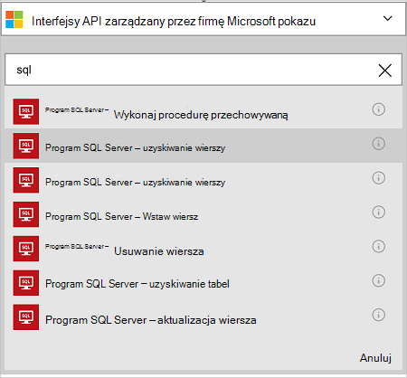

<properties
    pageTitle="Dodawanie łącznika bazy danych SQL Azure w aplikacji logika | Microsoft Azure"
    description="Omówienie łącznika bazy danych SQL Azure z parametrami interfejsu API usługi REST"
    services=""
    documentationCenter="" 
    authors="MandiOhlinger"
    manager="anneta"
    editor=""
    tags="connectors"/>

<tags
   ms.service="logic-apps"
   ms.devlang="na"
   ms.topic="article"
   ms.tgt_pltfrm="na"
   ms.workload="na" 
   ms.date="10/18/2016"
   ms.author="mandia"/>

# Wprowadzenie do łącznika bazy danych SQL Azure
Przy użyciu łącznika bazy danych SQL Azure, tworzenie przepływów pracy dla organizacji, które zarządzanie danymi w tabelach. 

Z bazy danych SQL możesz:

- Tworzenie przepływu pracy, dodawanie nowego klienta do bazy danych klientów lub aktualizowanie zamówienia w bazie danych programu zamówienia.
- Uzyskiwanie danych w wierszu, wstawić nowy wiersz, a nawet usunąć za pomocą akcji. Na przykład po utworzeniu rekordu w Dynamics CRM Online (wyzwalacza), następnie wstawić wiersz w bazie danych SQL Azure (Akcja). 

W tym temacie przedstawiono, jak używać łącznika bazy danych SQL w aplikacji dla logiki, a także zawiera listę akcji.

>[AZURE.NOTE] Tą wersją artykułu dotyczy aplikacji logiki ogólnodostępną (GA). 

Aby dowiedzieć się więcej na temat aplikacji logiczny, zobacz [Co to są aplikacje logiki](../app-service-logic/app-service-logic-what-are-logic-apps.md) i [Tworzenie aplikacji logiczny](../app-service-logic/app-service-logic-create-a-logic-app.md).

## Nawiązywanie połączenia z bazą danych Azure SQL

Przed aplikacji logika uzyskać dostęp do dowolnej usługi, należy najpierw utworzyć *połączenie* z usługą. Połączenia umożliwia łączność aplikacji logiki i innej usługi. Na przykład aby połączyć się z bazą danych SQL, tworzenia bazy danych SQL *połączenia*. Aby utworzyć połączenie, należy wprowadzić poświadczenia są zwykle używanych do uzyskania dostępu do usługi, którego łączysz się. Tak w bazie danych SQL, wprowadź poświadczenia bazy danych SQL, aby utworzyć połączenie. 

#### Utwórz połączenie

>[AZURE.INCLUDE [Create the connection to SQL Azure](../../includes/connectors-create-api-sqlazure.md)]

## Użyj wyzwalacza

Ten łącznik nie zawiera wszystkie wyzwalacze. Uruchom aplikację logiczny, takie jak wyzwalacz cyklu, wyzwalacza HTTP Webhook, wyzwalacze dostępne w przypadku innych łączników i innych elementów za pomocą innych wyzwalaczy. [Tworzenie aplikacji logiki](../app-service-logic/app-service-logic-create-a-logic-app.md) zawiera przykład.

## Za pomocą akcji
    
Akcja jest czynność wykonaną przez przepływ pracy zdefiniowane w aplikacji logicznych. [Dowiedz się więcej o akcje](../app-service-logic/app-service-logic-what-are-logic-apps.md#logic-app-concepts).

1. Kliknij znak plus. Zobacz ustawienia kilku opcji: **Dodaj akcję**, **Dodaj warunek**lub jeden z **większą liczbą** opcji.

    

2. Wybierz przycisk **Dodaj akcję**.

3. W polu tekstowym wpisz "sql", aby uzyskać listę dostępnych akcji.

     

4. W naszym przykładzie wybierz pozycję **SQL Server — uzyskiwanie wierszy**. Jeśli połączenie już istnieje, wybierz **nazwę tabeli** z listy rozwijanej i wprowadź **Identyfikator wiersza** chcesz przywrócić.

    

    Jeśli zostanie wyświetlony monit o informacje o połączeniu, wprowadź szczegółowe informacje, aby utworzyć połączenie. [Utwórz połączenie](connectors-create-api-sqlazure.md#create-the-connection) w tym temacie opisano następujące właściwości. 

    > [AZURE.NOTE] W tym przykładzie zwróconych wiersza z tabeli. Aby wyświetlić dane w tym wierszu, Dodaj inną akcję, która tworzy plik przy użyciu pola z tabeli. Na przykład dodać akcję OneDrive, która korzysta z pól Imię i nazwisko, aby utworzyć nowy plik w chmurze konta miejsca do magazynowania. 

5. **Zapisz** zmiany (lewym górnym rogu paska narzędzi). Logika aplikacji są zapisywane i automatycznie włączona.

## Szczegóły techniczne

## Akcje bazy danych SQL
Akcja jest czynność wykonaną przez przepływ pracy zdefiniowane w aplikacji logicznych. Łącznik bazy danych SQL zawiera następujące akcje. 

|Akcja|Opis|
|--- | ---|
|[ExecuteProcedure](connectors-create-api-sqlazure.md#execute-stored-procedure)|Wykonuje procedurę przechowywaną w języku SQL|
|[GetRow](connectors-create-api-sqlazure.md#get-row)|Pobiera pojedynczy wiersz z tabeli SQL|
|[GetRows](connectors-create-api-sqlazure.md#get-rows)|Pobiera wiersze z tabeli SQL|
|[InsertRow](connectors-create-api-sqlazure.md#insert-row)|Wstawia nowy wiersz w tabeli SQL|
|[Usuwaniewierszy](connectors-create-api-sqlazure.md#delete-row)|Usuwa wiersza z tabeli SQL|
|[GetTables](connectors-create-api-sqlazure.md#get-tables)|Pobiera tabel z bazy danych SQL|
|[UpdateRow](connectors-create-api-sqlazure.md#update-row)|Aktualizowanie istniejącego wiersza w tabeli SQL|

### Szczegóły akcji

W tej sekcji Zobacz szczegółowe informacje na temat każdej akcji, w tym wszystkie wymagane lub opcjonalne właściwości wprowadzania i dowolne odpowiednie dane wyjściowe skojarzone z łącznik.

#### Wykonaj procedurę przechowywaną
Procedura składowana wykonuje w języku SQL.  

| Nazwa właściwości| Nazwa wyświetlana |Opis|
| ---|---|---|
|Procedura * | Nazwa procedury | Nazwy procedury składowanej chcesz wykonać |
|Parametry * | Parametrów wejściowych | Parametry są dynamiczne i oparte na wybranym procedura przechowywana.    Na przykład jeśli korzystasz z bazy danych przykładowej firmy Adventure Works wybierz procedurę *ufnGetCustomerInformation* przechowywane. **Identyfikator klienta** parametru wejściowego jest wyświetlany. Wprowadź "6" lub jeden z innego odbiorcy identyfikatorów. |

Gwiazdka (*) oznacza, że są one wymagane.

##### Szczegóły wyników
ProcedureResult: Wynik wykonywanie procedury składowanej prowadzi

| Nazwa właściwości | Typ danych | Opis |
|---|---|---|
|OutputParameters|obiekt|Wartości parametru wyjściowych |
|Kod zwrotny|Liczba całkowita|Zwraca kod procedury |
|Zestawy wyników|obiekt| Zestaw wyników|

#### Uzyskiwanie wierszy 
Pobiera pojedynczy wiersz z tabeli SQL.  

| Nazwa właściwości| Nazwa wyświetlana |Opis|
| ---|---|---|
|Tabela * | Nazwa tabeli |Nazwa tabeli SQL|
|Identyfikator * | Identyfikator wiersza |Unikatowy identyfikator wiersza do pobrania|

Gwiazdka (*) oznacza, że są one wymagane.

##### Szczegóły wyników
Element

| Nazwa właściwości | Typ danych |
|---|---|
|ItemInternalId|ciąg|

#### Uzyskiwanie wierszy 
Pobiera wiersze z tabeli SQL.  

|Nazwa właściwości| Nazwa wyświetlana|Opis|
| ---|---|---|
|Tabela *|Nazwa tabeli|Nazwa tabeli SQL|
|$skip|Pomiń zliczanie|Liczba wpisów, aby pominąć (domyślny = 0)|
|$top|Uzyskiwanie maksymalna liczba|Maksymalna liczba wpisów do pobierania (domyślny = 256)|
|$filter|Filtrowanie kwerendy|Kwerenda filtru ODATA, aby ograniczyć liczbę wpisów|
|$orderby|Uporządkuj według|Kwerenda orderBy ODATA do określania kolejności pozycji|

Gwiazdka (*) oznacza, że są one wymagane.

##### Szczegóły wyników
ItemsList

| Nazwa właściwości | Typ danych |
|---|---|
|wartość|Tablica|

#### Wstaw wiersz 
Wstawia nowy wiersz w tabeli SQL.  

|Nazwa właściwości| Nazwa wyświetlana|Opis|
| ---|---|---|
|Tabela *|Nazwa tabeli|Nazwa tabeli SQL|
|element *|Wiersz|Wiersz, aby wstawić do określonej tabeli w języku SQL|

Gwiazdka (*) oznacza, że są one wymagane.

##### Szczegóły wyników
Element

| Nazwa właściwości | Typ danych |
|---|---|
|ItemInternalId|ciąg|

#### Usuwanie wiersza 
Usuwa wiersza z tabeli SQL.  

|Nazwa właściwości| Nazwa wyświetlana|Opis|
| ---|---|---|
|Tabela *|Nazwa tabeli|Nazwa tabeli SQL|
|Identyfikator *|Identyfikator wiersza|Unikatowy identyfikator wiersza do usunięcia|

Gwiazdka (*) oznacza, że są one wymagane.

##### Szczegóły wyników
Brak.

#### Pobieranie tabel 
Pobiera tabel z bazy danych SQL.  

Nie ma żadnych parametrów dla tego połączenia. 

##### Szczegóły wyników 
TablesList

| Nazwa właściwości | Typ danych |
|---|---|
|wartość|Tablica|

#### Aktualizowanie wierszy 
Aktualizacje istniejących wierszy w tabeli SQL.  

|Nazwa właściwości| Nazwa wyświetlana|Opis|
| ---|---|---|
|Tabela *|Nazwa tabeli|Nazwa tabeli SQL|
|Identyfikator *|Identyfikator wiersza|Unikatowy identyfikator wiersza do aktualizacji|
|element *|Wiersz|Wiersz z zaktualizowane wartości|

Gwiazdka (*) oznacza, że są one wymagane.

##### Szczegóły wyników  
Element

| Nazwa właściwości | Typ danych |
|---|---|
|ItemInternalId|ciąg|

### Odpowiedzi HTTP

Podczas połączenia z innych działań, może zostać wyświetlony określone odpowiedzi. W poniższej tabeli przedstawiono odpowiedzi i ich opisy:  

|Nazwa|Opis|
|---|---|
|200|Ok|
|202|Zaakceptowane|
|400|Nieprawidłowe żądanie|
|401|Brak autoryzacji|
|403|Dostęp zabroniony|
|404|Nie można odnaleźć|
|500|Wewnętrzny błąd serwera. Wystąpił nieznany błąd|
|domyślne|Operacja nie powiodła się.|

## Następne kroki

[Tworzenie aplikacji logicznych](../app-service-logic/app-service-logic-create-a-logic-app.md). Poznaj dostępne łączniki w aplikacjach logiki w naszej [listy interfejsów API](apis-list.md).
