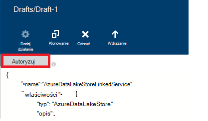

<properties
    pageTitle="Przenoszenie danych do/z magazynu Lake danych Azure | Factory Azure danych"
    description="Dowiedz się, jak przenieść dane z magazynu Lake danych Azure za pomocą Factory danych Azure"
    services="data-factory"
    documentationCenter=""
    authors="linda33wj"
    manager="jhubbard"
    editor="monicar"/>

<tags
    ms.service="data-factory"
    ms.workload="data-services"
    ms.tgt_pltfrm="na"
    ms.devlang="na"
    ms.topic="article"
    ms.date="09/27/2016"
    ms.author="jingwang"/>

# Przenoszenie danych do i z magazynu Lake danych Azure za pomocą Factory danych Azure
W tym artykule opisano, jak można to działanie kopii w factory Azure danych przenoszenie danych z magazynu Lake Azure danych z innego magazynu danych. W tym artykule opiera się na artykuł [działania przepływu danych](data-factory-data-movement-activities.md) , w którym przedstawiono ogólne omówienie przenoszenia danych z kopii aktywności i kombinacji magazynu danych obsługiwane.

> [AZURE.NOTE]
> Utwórz konto Azure magazynu Lake danych przed utworzeniem potok z działaniem Kopiuj, aby przenieść dane ze sklepu Lake danych Azure. Aby dowiedzieć się o magazynu Lake danych Azure, zobacz [Rozpoczynanie pracy z magazynu Lake danych Azure](../data-lake-store/data-lake-store-get-started-portal.md).
>  
> Przeglądanie, [Tworzenie pierwszej samouczek planowana](data-factory-build-your-first-pipeline.md) Aby uzyskać szczegółowe instrukcje można tworzyć factory danych, usługi połączone, zestawy danych i potok. Użyj wstawek JSON Edytor Factory danych lub Visual Studio lub Azure programu PowerShell, aby utworzyć podmioty Factory danych.

## Kopiowanie kreatora danych
Najprostszym sposobem utworzenia procesu, który kopiuje dane z magazynu Lake Azure danych jest za pomocą Kreatora kopiowania danych. Zobacz [Samouczek: tworzenie potok przy użyciu Kreatora kopiowania](data-factory-copy-data-wizard-tutorial.md) aby szybkie informacje na temat tworzenia potok za pomocą Kreatora kopiowania danych. 

Poniższe przykłady zawierają definicje JSON, których można utworzyć potok przy użyciu [Azure portal](data-factory-copy-activity-tutorial-using-azure-portal.md) lub [Visual Studio](data-factory-copy-activity-tutorial-using-visual-studio.md) lub [Azure programu PowerShell](data-factory-copy-activity-tutorial-using-powershell.md). Jak skopiować dane do i z magazynu Lake danych Azure i magazyn obiektów Blob platformy Azure są pokazywane. Jednak dane mogą być skopiowane **bezpośrednio** z dowolnego źródła do jakichkolwiek pochłaniacze podane [tutaj](data-factory-data-movement-activities.md#supported-data-stores) przy użyciu aktywności kopii w Azure danych Factory.  

## Przykład: Kopiowanie danych z obiektów Blob platformy Azure do magazynu Lake danych Azure
Następujący przykład przedstawia:

1.  Usługi połączone typu [AzureStorage](#azure-storage-linked-service-properties).
2.  Usługi połączone typu [AzureDataLakeStore](#azure-data-lake-linked-service-properties).
3.  Wprowadzania [zestawu danych](data-factory-create-datasets.md) typu [AzureBlob](#azure-blob-dataset-type-properties).
4.  Dane wyjściowe [zestawu danych](data-factory-create-datasets.md) typu [AzureDataLakeStore](#azure-data-lake-dataset-type-properties).
4.  [Potok](data-factory-create-pipelines.md) aktywnością kopii, która korzysta z [BlobSource](#azure-blob-copy-activity-type-properties) i [AzureDataLakeStoreSink](#azure-data-lake-copy-activity-type-properties).

Próbki kopiuje szeregu czasowego dane z magazynem obiektów Blob platformy Azure do magazynu Lake danych Azure co godzinę. Właściwości JSON używane w tych przykładów opisano w sekcjach poniżej próbki.

**Usługa Azure miejsca do magazynowania połączone:**

    {
      "name": "StorageLinkedService",
      "properties": {
        "type": "AzureStorage",
        "typeProperties": {
          "connectionString": "DefaultEndpointsProtocol=https;AccountName=<accountname>;AccountKey=<accountkey>"
        }
      }
    }

**Azure Lake dane połączone usługi:**

    {
        "name": "AzureDataLakeStoreLinkedService",
        "properties": {
            "type": "AzureDataLakeStore",
            "typeProperties": {
                "dataLakeStoreUri": "https://<accountname>.azuredatalakestore.net/webhdfs/v1",
                "sessionId": "<session ID>",
                "authorization": "<authorization URL>"
            }
        }
    }

### Aby utworzyć Azure Lake połączone usługi danych przy użyciu edytora Factory danych
W poniższej procedurze opisano kroki tworzenia usługi magazynu Lake danych Azure połączone za pomocą edytora Factory danych.

1. Kliknij przycisk **nowe dane przechowywane** na pasku poleceń i wybierz pozycję **Magazynu Lake danych Azure**.
2. W edytorze JSON właściwości **dataLakeStoreUri** wprowadź identyfikator URI lake danych.
3. Kliknij przycisk **Autoryzuj** na pasku poleceń. Okno podręczne powinny być widoczne.

    

4. Zaloguj się za pomocą poświadczeń i właściwość **autoryzacji** w formacie JSON mają być przydzielane wartość teraz.
5. (opcjonalnie) Określanie wartości parametrów opcjonalne, takie jak **Nazwa konta**, **subscriptionID**i **resourceGroupName** w formacie JSON lub usunąć te właściwości z JSON.
6. Kliknij pozycję **Rozmieść** na pasku poleceń do wdrożenia usługi połączone.

> [AZURE.IMPORTANT] Kod autoryzacji, który został wygenerowany przy użyciu przycisku **Autoryzuj** wygasa po upływie pewnego czasu. **Ponownie autoryzować** przy użyciu **Autoryzuj** przycisku po **wygaśnięciu token** i ponownego wdrażania usługi połączone. Zobacz sekcję [Usługi połączone ze sklepu Lake danych Azure](#azure-data-lake-store-linked-service-properties) , aby uzyskać szczegółowe informacje. 

**Azure Blob wprowadzania zestawu danych:**

Dane są pobierane z nowych obiektów blob co godzinę (częstotliwość: godzina, interwał: 1). Ścieżkę i nazwę folderu dla obiektów blob dynamiczne są obliczane według czasu rozpoczęcia wycinek, który jest przetwarzana. Ścieżka folderu używa rok, miesiąc i dzień część czasu rozpoczęcia, a nazwa pliku używa godzinę część godziny rozpoczęcia. "zewnętrzne": "true" ustawienie Factory danych usługi informuje, że tabeli zewnętrznej fabryki danych i nie jest tworzone przez działania w factory danych.

    {
      "name": "AzureBlobInput",
      "properties": {
        "type": "AzureBlob",
        "linkedServiceName": "StorageLinkedService",
        "typeProperties": {
          "folderPath": "mycontainer/myfolder/yearno={Year}/monthno={Month}/dayno={Day}",
          "partitionedBy": [
            {
              "name": "Year",
              "value": {
                "type": "DateTime",
                "date": "SliceStart",
                "format": "yyyy"
              }
            },
            {
              "name": "Month",
              "value": {
                "type": "DateTime",
                "date": "SliceStart",
                "format": "MM"
              }
            },
            {
              "name": "Day",
              "value": {
                "type": "DateTime",
                "date": "SliceStart",
                "format": "dd"
              }
            },
            {
              "name": "Hour",
              "value": {
                "type": "DateTime",
                "date": "SliceStart",
                "format": "HH"
              }
            }
          ]
        },
        "external": true,
        "availability": {
          "frequency": "Hour",
          "interval": 1
        },
        "policy": {
          "externalData": {
            "retryInterval": "00:01:00",
            "retryTimeout": "00:10:00",
            "maximumRetry": 3
          }
        }
      }
    }

**Azure Lake danych wyjściowych zestawu danych:**

Próbki kopiuje dane do sklepu Lake danych Azure. Nowe dane są kopii danych Lake przechowywania co godzinę.

    {
        "name": "AzureDataLakeStoreOutput",
        "properties": {
            "type": "AzureDataLakeStore",
            "linkedServiceName": "AzureDataLakeStoreLinkedService",
            "typeProperties": {
                "folderPath": "datalake/output/"
            },
            "availability": {
                "frequency": "Hour",
                "interval": 1
            }
        }
    }

**Planowanej aktywnością kopii:**

Proces zawiera działaniem Kopiuj jest skonfigurowany do używania wejściowe i wyjściowe zestawy danych, który jest zaplanowane do uruchomienia co godzinę. W potoku definicji JSON typ **źródła** jest ustawiona na **BlobSource** i typ **sink** jest ustawiona na **AzureDataLakeStoreSink**.

    {  
        "name":"SamplePipeline",
        "properties":
        {  
            "start":"2014-06-01T18:00:00",
            "end":"2014-06-01T19:00:00",
            "description":"pipeline with copy activity",
            "activities":
            [  
                {
                    "name": "AzureBlobtoDataLake",
                    "description": "Copy Activity",
                    "type": "Copy",
                    "inputs": [
                    {
                        "name": "AzureBlobInput"
                    }
                    ],
                    "outputs": [
                    {
                        "name": "AzureDataLakeStoreOutput"
                    }
                    ],
                    "typeProperties": {
                        "source": {
                            "type": "BlobSource",
                            "treatEmptyAsNull": true,
                            "blobColumnSeparators": ","
                        },
                        "sink": {
                            "type": "AzureDataLakeStoreSink"
                        }
                    },
                    "scheduler": {
                        "frequency": "Hour",
                        "interval": 1
                    },
                    "policy": {
                        "concurrency": 1,
                        "executionPriorityOrder": "OldestFirst",
                        "retry": 0,
                        "timeout": "01:00:00"
                    }
                }
            ]
        }
    }

## Przykład: Kopiowanie danych z magazynu Lake Azure danych do obiektów Blob platformy Azure
Następujący przykład przedstawia:

1.  Usługi połączone typu [AzureDataLakeStore](#azure-data-lake-linked-service-properties).
2.  Usługi połączone typu [AzureStorage](#azure-storage-linked-service-properties).
3.  Wprowadzania [zestawu danych](data-factory-create-datasets.md) typu [AzureDataLakeStore](#azure-data-lake-dataset-type-properties).
4.  Dane wyjściowe [zestawu danych](data-factory-create-datasets.md) typu [AzureBlob](#azure-blob-dataset-type-properties).
5.  [Potok](data-factory-create-pipelines.md) aktywnością kopii, która korzysta z [AzureDataLakeStoreSource](#azure-data-lake-copy-activity-type-properties) i [BlobSink](#azure-blob-copy-activity-type-properties)

Próbki kopiuje szeregu czasowego dane ze sklepu Azure Lake danych do obiektów blob platformy Azure co godzinę. Właściwości JSON używane w tych przykładów opisano w sekcjach poniżej próbki.

**Magazyn Lake danych Azure połączone usługi:**

    {
        "name": "AzureDataLakeStoreLinkedService",
        "properties": {
            "type": "AzureDataLakeStore",
            "typeProperties": {
                "dataLakeStoreUri": "https://<accountname>.azuredatalakestore.net/webhdfs/v1",
                "sessionId": "<session ID>",
                "authorization": "<authorization URL>"
            }
        }
    }

> [AZURE.NOTE] Zobacz kroki opisane w poprzedniej próbki w celu uzyskania adresu URL autoryzacji.  

**Usługa Azure miejsca do magazynowania połączone:**

    {
      "name": "StorageLinkedService",
      "properties": {
        "type": "AzureStorage",
        "typeProperties": {
          "connectionString": "DefaultEndpointsProtocol=https;AccountName=<accountname>;AccountKey=<accountkey>"
        }
      }
    }

**Azure Lake danych wejściowych zestawu danych:**

Ustawianie **"zewnętrzne": PRAWDA** usługę Factory danych informuje, że tabeli zewnętrznej fabryki danych i nie jest tworzone przez działania w factory danych.

    {
        "name": "AzureDataLakeStoreInput",
        "properties":
        {
            "type": "AzureDataLakeStore",
            "linkedServiceName": "AzureDataLakeStoreLinkedService",
            "typeProperties": {
                "folderPath": "datalake/input/",
                "fileName": "SearchLog.tsv",
                "format": {
                    "type": "TextFormat",
                    "rowDelimiter": "\n",
                    "columnDelimiter": "\t"
                }
            },
            "external": true,
            "availability": {
                "frequency": "Hour",
                "interval": 1
            },
            "policy": {
                "externalData": {
                    "retryInterval": "00:01:00",
                    "retryTimeout": "00:10:00",
                    "maximumRetry": 3
                }
            }
        }
    }

**Obiektów Blob platformy Azure wyjściowych zestawu danych:**

Dane są zapisywane nowe blob co godzinę (częstotliwość: godzina, interwał: 1). Ścieżka folderu to jest dynamicznie obliczane na podstawie czasu rozpoczęcia wycinek, który jest przetwarzana. Ścieżka folderu używa rok, miesiąc, dzień i godzin części godziny rozpoczęcia.

    {
      "name": "AzureBlobOutput",
      "properties": {
        "type": "AzureBlob",
        "linkedServiceName": "StorageLinkedService",
        "typeProperties": {
          "folderPath": "mycontainer/myfolder/yearno={Year}/monthno={Month}/dayno={Day}/hourno={Hour}",
          "partitionedBy": [
            {
              "name": "Year",
              "value": {
                "type": "DateTime",
                "date": "SliceStart",
                "format": "yyyy"
              }
            },
            {
              "name": "Month",
              "value": {
                "type": "DateTime",
                "date": "SliceStart",
                "format": "MM"
              }
            },
            {
              "name": "Day",
              "value": {
                "type": "DateTime",
                "date": "SliceStart",
                "format": "dd"
              }
            },
            {
              "name": "Hour",
              "value": {
                "type": "DateTime",
                "date": "SliceStart",
                "format": "HH"
              }
            }
          ],
          "format": {
            "type": "TextFormat",
            "columnDelimiter": "\t",
            "rowDelimiter": "\n"
          }
        },
        "availability": {
          "frequency": "Hour",
          "interval": 1
        }
      }
    }

**Planowanej z działaniem kopii:**

Proces zawiera działaniem Kopiuj jest skonfigurowany do używania wejściowe i wyjściowe zestawy danych, który jest zaplanowane do uruchomienia co godzinę. W potoku definicji JSON typ **źródła** jest ustawiona na **AzureDataLakeStoreSource** i typ **sink** jest ustawiona na **BlobSink**.

    {  
        "name":"SamplePipeline",
        "properties":{  
            "start":"2014-06-01T18:00:00",
            "end":"2014-06-01T19:00:00",
            "description":"pipeline for copy activity",
            "activities":[  
                {
                    "name": "AzureDakeLaketoBlob",
                    "description": "copy activity",
                    "type": "Copy",
                    "inputs": [
                      {
                        "name": "AzureDataLakeStoreInput"
                      }
                    ],
                    "outputs": [
                      {
                        "name": "AzureBlobOutput"
                      }
                    ],
                    "typeProperties": {
                        "source": {
                            "type": "AzureDataLakeStoreSource",
                        },
                        "sink": {
                            "type": "BlobSink"
                        }
                    },
                    "scheduler": {
                        "frequency": "Hour",
                        "interval": 1
                    },
                    "policy": {
                        "concurrency": 1,
                        "executionPriorityOrder": "OldestFirst",
                        "retry": 0,
                        "timeout": "01:00:00"
                    }
                }
             ]
        }
    }

## Azure właściwości usługi połączone dane Lake magazynu

Konto Azure magazynowania można połączyć factory Azure danych za pomocą usługi Magazyn Azure połączone. Poniższa tabela zawiera opis specyficzne dla usługi Magazyn Azure połączone elementy JSON.

| Właściwość | Opis | Wymagane |
| :-------- | :----------- | :-------- |
| Typ | Ustaw właściwości Typ: **AzureDataLakeStore** | Tak |
| dataLakeStoreUri | Określ informacje o koncie magazynu Lake danych Azure. W następującym formacie: https://<Azure Data Lake account name>.azuredatalakestore.net/webhdfs/v1 | Tak |
| Autoryzacja | Kliknij przycisk **Autoryzuj** w **Edytorze Factory danych** i wprowadź do poświadczeń przydzielany generowane automatycznie autoryzacji adresu URL do tej właściwości.  | Tak |
| Identyfikator sesji | Identyfikator sesji OAuth z sesji autoryzacji oauth. Każdy identyfikator sesji jest unikatowy i może być użyty tylko raz. To ustawienie jest generowany automatycznie, gdy używasz Edytor Factory danych. | Tak |  
| Nazwa konta | Nazwa konta lake danych | Brak |
| subscriptionId | Azure subskrypcji identyfikatora. | Nie (Jeśli nie zostanie określony, subskrypcji fabryki danych jest używany). |
| resourceGroupName |  Nazwa grupy zasobów Azure | Nie (Jeśli nie zostanie określony, grupa zasobów fabryki danych jest używany). |

## Wygaśnięcia tokenu 
Kod autoryzacji, które wygenerować przy użyciu przycisku **Autoryzuj** wygasa po upływie pewnego czasu. Zobacz następującą tabelę dla czasu wygaśnięcia dla różnych typów kont użytkowników. Może zostać wyświetlony następujący komunikat o błędzie wiadomości, kiedy uwierzytelniania **wygasa token**: "Błąd operacji poświadczeń: invalid_grant - AADSTS70002: błąd podczas sprawdzania poprawności poświadczeń. AADSTS70008: Udzielanie dostępu dostarczonych wygasła lub odwołany. Identyfikator śledzenia: Identyfikator korelacji d18629e8-af88-43c5-88e3-d8419eb1fca1: sygnatury czasowej fac30a0c-6be6-4e02-8d69-a776d2ffefd7: 2015-12-15 21-09-31Z ".

| Typ użytkownika | Dezaktualizuje się po |
| :-------- | :----------- | 
| Konta użytkowników nie zarządza usługi Azure Active Directory (@hotmail.com, @live.com, itp.). | 12 godzin |
| Użytkownicy kont zarządzanych przez Azure Active Directory (AAD) | Uruchom 14 dni od ostatniego wycinek.   90 dni, jeśli wycinek, oparte na podstawie OAuth powiązanych z jest uruchamiany co najmniej raz na 14 dni. |

Jeśli zmienisz hasło przed upływem tego czasu wygaśnięcia tokenu token od razu wygaśnie i zostanie wyświetlony komunikat o błędzie wymienionych w tej sekcji. 

Aby uniknąć i Rozwiąż ten błąd, ponownie autoryzować przy użyciu **Autoryzuj** przycisk kiedy **wygaśnie token** i ponownego wdrażania usługi połączone. Można również generować wartości dla właściwości **identyfikator sesji** i **autoryzacji** programowo przy użyciu kodu w poniższej sekcji:

### Programowy generować wartości identyfikatora sesji i autoryzacji 

    if (linkedService.Properties.TypeProperties is AzureDataLakeStoreLinkedService ||
        linkedService.Properties.TypeProperties is AzureDataLakeAnalyticsLinkedService)
    {
        AuthorizationSessionGetResponse authorizationSession = this.Client.OAuth.Get(this.ResourceGroupName, this.DataFactoryName, linkedService.Properties.Type);

        WindowsFormsWebAuthenticationDialog authenticationDialog = new WindowsFormsWebAuthenticationDialog(null);
        string authorization = authenticationDialog.AuthenticateAAD(authorizationSession.AuthorizationSession.Endpoint, new Uri("urn:ietf:wg:oauth:2.0:oob"));

        AzureDataLakeStoreLinkedService azureDataLakeStoreProperties = linkedService.Properties.TypeProperties as AzureDataLakeStoreLinkedService;
        if (azureDataLakeStoreProperties != null)
        {
            azureDataLakeStoreProperties.SessionId = authorizationSession.AuthorizationSession.SessionId;
            azureDataLakeStoreProperties.Authorization = authorization;
        }

        AzureDataLakeAnalyticsLinkedService azureDataLakeAnalyticsProperties = linkedService.Properties.TypeProperties as AzureDataLakeAnalyticsLinkedService;
        if (azureDataLakeAnalyticsProperties != null)
        {
            azureDataLakeAnalyticsProperties.SessionId = authorizationSession.AuthorizationSession.SessionId;
            azureDataLakeAnalyticsProperties.Authorization = authorization;
        }
    }

Zobacz tematy [AzureDataLakeStoreLinkedService klasy](https://msdn.microsoft.com/library/microsoft.azure.management.datafactories.models.azuredatalakestorelinkedservice.aspx), [Klasy AzureDataLakeAnalyticsLinkedService](https://msdn.microsoft.com/library/microsoft.azure.management.datafactories.models.azuredatalakeanalyticslinkedservice.aspx)i [AuthorizationSessionGetResponse klasy](https://msdn.microsoft.com/library/microsoft.azure.management.datafactories.models.authorizationsessiongetresponse.aspx) szczegółowe informacje na temat klasy Factory dane używane w kodzie. Dodaj odwołanie do wersji **2.9.10826.1824** **Microsoft.IdentityModel.Clients.ActiveDirectory.WindowsForms.dll** dla klasy WindowsFormsWebAuthenticationDialog wykorzystane w kodzie. 
 

## Właściwości typu zestawu danych Lake danych Azure

Aby uzyskać pełną listę JSON sekcje i właściwości dostępnych do definiowania zestawy danych zobacz artykuł [Tworzenie zestawów danych](data-factory-create-datasets.md) . Sekcje, takich jak struktury, dostępność i zasad zestawu danych JSON są podobne dla wszystkich typów zestawu danych (Azure SQL, obiektów blob platformy Azure, Azure tabeli itp.).

W sekcji **typeProperties** różni się dla każdego typu zestawu danych i udostępnia informacje o lokalizacji, itp., formatowanie danych w magazynie danych. W sekcji typeProperties zestawu danych typu **AzureDataLakeStore** zestawu danych zawiera następujące właściwości:

| Właściwość | Opis | Wymagane |
| :-------- | :----------- | :-------- |
| ścieżkafolderu | Ścieżka do kontenera i folderu Azure Lake dane zawierają. | Tak |
| Nazwa pliku | Nazwa pliku w magazynie Lake danych Azure. Nazwa pliku jest opcjonalne i wielkość liter.   Jeśli użytkownik określi nazwę pliku, działanie (w tym kopii) działa na określonego pliku.  Jeśli nazwa pliku nie zostanie określony, Kopiuj zawiera wszystkie pliki w ścieżkafolderu dla zestawu danych wejściowych.  Po dla zestaw danych wyjściowych nie określono nazwy pliku, nazwa wygenerowany plik jest w następującym formacie: danych. <Guid>txt (na przykład:: Data.0a405f8a-93ff-4c6f-b3be-f69616f1df7a.txt | Brak |
| partitionedBy | partitionedBy jest opcjonalne właściwości. Umożliwia ją określić ścieżkafolderu dynamiczne i nazwę pliku dla czasu serii danych. Na przykład ścieżkafolderu mogą być parametryczne dla każdej godziny danych. W sekcji [Właściwości partitionedBy używanie](#using-partitionedby-property) szczegółowe informacje i przykłady. | Brak |
| Formatowanie | Obsługiwane są następujące typy formatów: **TextFormat**, **AvroFormat**, **JsonFormat**, **OrcFormat**, **ParquetFormat**. Ustaw właściwości **Typ** w obszarze format jedną z następujących wartości. Zobacz [Określanie TextFormat](#specifying-textformat), [Określając AvroFormat](#specifying-avroformat) [Określającą JsonFormat](#specifying-jsonformat), [Określanie OrcFormat](#specifying-orcformat)i [Określanie ParquetFormat](#specifying-parquetformat) sekcji, aby uzyskać szczegółowe informacje. Jeśli chcesz skopiować pliki jako-jest między opartych na plikach magazynów (binarne kopii), możesz pominąć sekcji format w obu definicjach wejściowe i wyjściowe zestawu danych.| Brak
| stopień kompresji | Określ typ i stopień kompresji dla danych. Obsługiwane typy to: **GZip**i **Deflate**i **BZip2** poziomy obsługiwane są: **optymalna** i **najszybciej**. Obecnie ustawienia kompresji dla danych w **AvroFormat** lub **OrcFormat**nie są obsługiwane. Aby uzyskać więcej informacji, zobacz sekcję [kompresji pomocy technicznej](#compression-support) .  | Brak |

### Przy użyciu właściwości partitionedBy
Można określić ścieżkafolderu dynamiczne i nazwę pliku dla czasu serie danych za pomocą sekcji **partitionedBy** , makra danych Factory i zmienne systemu: SliceStart i SliceEnd, które wskazują godziny rozpoczęcia i zakończenia dla danego wycinek.

Zobacz artykuły [Tworzenie zestawów danych](data-factory-create-datasets.md) i [Planowanie i wykonanie](data-factory-scheduling-and-execution.md) , aby uzyskać więcej informacji na temat zestawów czasu serii danych, planowania i wycinki.

#### Przykładowy 1

    "folderPath": "wikidatagateway/wikisampledataout/{Slice}",
    "partitionedBy":
    [
        { "name": "Slice", "value": { "type": "DateTime", "date": "SliceStart", "format": "yyyyMMddHH" } },
    ],

W tym przykładzie {wycinek} jest zastępowany wartość zmiennej system Factory danych SliceStart w formacie (YYYYMMDDHH) określone. SliceStart odwołuje się do wycinek czas rozpoczęcia. Ścieżkafolderu różni się dla każdego wycinka. Na przykład: wikidatagateway-wikisampledataout-2014100103 lub wikidatagateway-wikisampledataout-2014100104

#### Przykładowy 2

    "folderPath": "wikidatagateway/wikisampledataout/{Year}/{Month}/{Day}",
    "fileName": "{Hour}.csv",
    "partitionedBy":
     [
        { "name": "Year", "value": { "type": "DateTime", "date": "SliceStart", "format": "yyyy" } },
        { "name": "Month", "value": { "type": "DateTime", "date": "SliceStart", "format": "MM" } },
        { "name": "Day", "value": { "type": "DateTime", "date": "SliceStart", "format": "dd" } },
        { "name": "Hour", "value": { "type": "DateTime", "date": "SliceStart", "format": "hh" } }
    ],

W tym przykładzie rok, miesiąc, dzień i godzinę SliceStart są wyodrębniane do oddzielnych zmiennych, które są używane przez właściwości ścieżkafolderu i nazwę pliku.

[AZURE.INCLUDE [data-factory-file-format](../../includes/data-factory-file-format.md)]
 

### Obsługa kompresji  
Przetwarzanie dużych zestawów danych mogą powodować gardeł wejścia/wyjścia oraz sieci. W związku z tym skompresowane dane w sklepach można nie tylko przyspieszyć transfer danych przez sieć zaoszczędzenia miejsca na dysku, a także wyświetlić znaczący wzrost wydajności przetwarzania danych duży. Obecnie kompresja jest obsługiwana dla magazynów opartych na plikach danych takich jak obiektów Blob platformy Azure lub lokalnego systemu plików.  

Aby określić stopień kompresji zestawu danych, należy użyć właściwości **kompresji** w zestawie danych JSON, tak jak w poniższym przykładzie:   

    {  
        "name": "AzureDatalakeStoreDataSet",  
        "properties": {  
            "availability": {  
                "frequency": "Day",  
                "interval": 1  
            },  
            "type": "AzureDatalakeStore",  
            "linkedServiceName": "DataLakeStoreLinkedService",  
            "typeProperties": {  
                "fileName": "pagecounts.csv.gz",  
                "folderPath": "compression/file/",  
                "compression": {  
                    "type": "GZip",  
                    "level": "Optimal"  
                }  
            }  
        }  
    }  
 
W sekcji **kompresji** ma dwie właściwości:  
  
- **Typ:** kompresji koder-dekoder, który może być **GZIP**i **Deflate** **BZIP2**.  
- **Poziom:** stopień kompresji, który może być **optymalna** lub **najszybciej**. 
    - **Najszybszy:** Operacji kompresowania należy ukończyć tak szybko, jak to możliwe, nawet wtedy, gdy utworzony plik nie jest skompresowany optymalnie. 
    - **Optymalna**: operacji kompresowania powinny być optymalnie kompresowany, nawet w przypadku operacji trwa dłużej. 
    
    Aby uzyskać więcej informacji zobacz temat [Poziom kompresji](https://msdn.microsoft.com/library/system.io.compression.compressionlevel.aspx) . 

Załóżmy, że zestaw przykładowych danych jest używany jako wynik działań podjętych w ramach kopii. Działanie kopii kompresuje dane wyjściowe z GZIP kodera-dekodera, za pomocą optymalny stosunek, a następnie zapisuje skompresowane dane w pliku o nazwie pagecounts.csv.gz w magazynie Lake danych Azure.   

Po określeniu właściwości kompresji w zestawie danych wejściowych JSON proces odczytuje skompresowane dane ze źródła. Po określeniu tej właściwości w zestawie danych dane wyjściowe JSON aktywności kopii można napisać skompresowane dane do miejsca docelowego. Poniżej przedstawiono kilka przykładowych scenariuszy: 

- GZIP odczytu skompresowane dane ze sklepu Azure danych Lake wyodrębnić go i zapisać wynik danych do bazy danych programu Azure SQL. W tym przypadku należy zdefiniować wprowadzania zestawu danych magazynu Lake danych Azure kompresji właściwość JSON. 
- Odczytywanie danych z pliku tekstowego z lokalnego systemu plików, go w formacie GZip skompresować i pisanie skompresowane dane do sklepu Lake Azure danych. W tym przypadku należy zdefiniować zestaw danych wyjściowych Azure danych Lake kompresji właściwość JSON.  
- Odczyt danych skompresowany GZIP Lake magazynu danych Azure, wyodrębnić go, kompresowanie go przy użyciu BZIP2 i zapisać dane wynikowe do magazynu Lake danych Azure. Ustawianie Ustaw typ kompresji jako GZIP i BZIP2 dla danych wejściowych i odpowiednio wyjściowy zestawy danych.   

## Właściwości typu danych w trybie offline kopii Lake Azure  
Aby uzyskać pełną listę sekcji i właściwości dostępnych do definiowania działania zobacz artykuł [Tworzenie procesy](data-factory-create-pipelines.md) . Właściwości, takie jak nazwa, opis, dane wejściowe i wyjściowe tabel i zasady są dostępne dla wszystkich typów działań.

Właściwości, które są dostępne w sekcji typeProperties działania z drugiej strony zależne od każdego typu działania. Wykonania kopii różnią się w zależności od rodzaju źródeł i ujść

**AzureDataLakeStoreSource** obsługuje sekcji **typeProperties** następujące właściwości:

| Właściwość | Opis | Dopuszczalne wartości | Wymagane |
| -------- | ----------- | -------------- | -------- |
| cykliczne | Wskazuje, czy dane czytania lokalizacji z folderów sub lub tylko z określonego folderu. | PRAWDA FAŁSZ (wartość domyślna) | Brak |

**AzureDataLakeStoreSink** obsługuje sekcji **typeProperties** następujące właściwości:

| Właściwość | Opis | Dopuszczalne wartości | Wymagane |
| -------- | ----------- | -------------- | -------- |
| copyBehavior | Określa zachowanie kopii. | **PreserveHierarchy:** zachowuje hierarchię pliku w folderze docelowym. Względne ścieżki pliku źródłowego do folderu źródła jest identyczny z ścieżkę względną plik docelowy do folderu docelowego.  **FlattenHierarchy:** wszystkie pliki z folderu źródłowego są tworzone w pierwszego poziomu folderu docelowego. Pliki docelowej są tworzone automatycznie wygenerowane nazwą.  **MergeFiles:** scala wszystkie pliki z folderu źródłowego do jednego pliku. Jeśli określono nazwy pliku i obiektów Blob, nazwy pliku scalonych będzie o określonej nazwie; w przeciwnym razie będzie nazwy pliku generowane automatycznie. | Brak |

[AZURE.INCLUDE [data-factory-structure-for-rectangualr-datasets](../../includes/data-factory-structure-for-rectangualr-datasets.md)]

[AZURE.INCLUDE [data-factory-type-conversion-sample](../../includes/data-factory-type-conversion-sample.md)]

[AZURE.INCLUDE [data-factory-column-mapping](../../includes/data-factory-column-mapping.md)]

## Wydajność i dostosowywanie  
Zobacz [wydajności aktywności kopiowania i dostosowywanie przewodnik](data-factory-copy-activity-performance.md) informacje o kluczowych czynników, które wpływ na wydajność przepływu danych (Kopiuj czynność) w Factory danych Azure i optymalizowanie go na różne sposoby.
