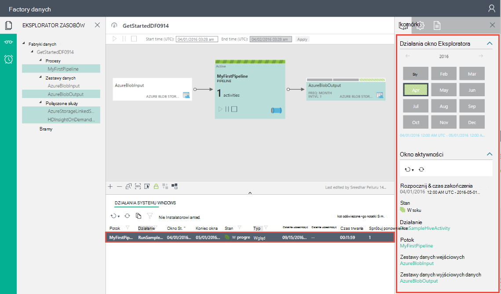

<properties
    pageTitle="Tworzenie pierwszego factory danych (Azure portal) | Microsoft Azure"
    description="W tym samouczku możesz utworzyć potok Azure Factory danych przykładowych przy użyciu edytora Factory danych w portalu Azure."
    services="data-factory"
    documentationCenter=""
    authors="spelluru"
    manager="jhubbard"
    editor="monicar"/>

<tags
    ms.service="data-factory"
    ms.workload="data-services"
    ms.tgt_pltfrm="na"
    ms.devlang="na"
    ms.topic="hero-article" 
    ms.date="09/14/2016"
    ms.author="spelluru"/>

# Samouczek: Tworzenie pierwszej firmie Azure danych za pomocą portalu Azure
> [AZURE.SELECTOR]
- [Omówienie i wymagania wstępne](data-factory-build-your-first-pipeline.md)
- [Azure portal](data-factory-build-your-first-pipeline-using-editor.md)
- [Programu Visual Studio](data-factory-build-your-first-pipeline-using-vs.md)
- [Programu PowerShell](data-factory-build-your-first-pipeline-using-powershell.md)
- [Szablon Menedżera zasobów](data-factory-build-your-first-pipeline-using-arm.md)
- [INTERFEJSU API USŁUGI REST](data-factory-build-your-first-pipeline-using-rest-api.md)

W tym artykule się, jak używać [Azure portal](https://portal.azure.com/) do tworzenia pierwszego firmie Azure danych. 

## Wymagania wstępne        
1. Przeczytaj artykuł [Omówienie samouczka](data-factory-build-your-first-pipeline.md) i wykonaj kroki **wymagania wstępne** .
2. Ten artykuł nie zawiera omówienie usługi Azure danych Factory. Zalecamy zapoznanie artykuł [Wprowadzenie do Azure Factory dane](data-factory-introduction.md) szczegółowe omówienie usługi.  

## Tworzenie factory danych
Factory danych może zawierać jedną lub więcej procesy. Potok może zawierać jedną lub więcej czynności w nim. Na przykład dane wyjściowe działaniem Kopiuj, aby skopiować dane ze źródła do magazynu danych miejsca docelowego i działaniem gałąź HDInsight uruchamianie skryptu gałęzi do przekształcania danych wejściowych produktu. Zacznijmy od tworzenia factory danych w tym kroku. 

1.  Zaloguj się do [portalu Azure](https://portal.azure.com/).
2.  W menu po lewej stronie kliknij pozycję **Nowy** , kliknij pozycję **dane + analizy**, a następnie kliknij przycisk **Factory danych**.
        
    

2.  W karta **nowego factory danych** wprowadź **GetStartedDF** dla nazwy.

    

    > [AZURE.IMPORTANT] 
    > Nazwa fabryki Azure danych musi być **globalnie unikatowa**. Jeśli zostanie wyświetlony komunikat o błędzie: **factory danych o nazwie "GetStartedDF" jest niedostępne**. Zmienianie nazwy fabryki danych (na przykład yournameGetStartedDF), a następnie spróbuj ponownie utworzyć. Temat [Danych Factory - reguł nazewnictwa](data-factory-naming-rules.md) dla reguł nazewnictwa artefakty Factory danych.
    > 
    > Nazwa fabryki danych może być zarejestrowana w przyszłości i w związku z tym stają się publicznie widoczne nazwy **DNS** .

3.  Wybierz miejsce, w którym chcesz factory danych do utworzenia **Azure subskrypcji** . 
4.  Wybieranie istniejącej **grupy zasobów** lub Utwórz nową grupę zasobów. Samouczek, należy utworzyć grupę zasobów o nazwie: **ADFGetStartedRG**. 
5.  Kliknij przycisk **Utwórz** na karta **factory nowych danych** .

    > [AZURE.IMPORTANT] Aby utworzyć wystąpienia Factory danych, musi być członkiem roli [Współautora Factory dane](../active-directory/role-based-access-built-in-roles.md/#data-factory-contributor) na poziomie grupy subskrypcji i zasobów. 
6.  Zobacz factory danych tworzonych w **Startboard** portalu Azure w następujący sposób:   

    
7. Gratulacje! Pierwszy firmie danych został utworzony pomyślnie. Po factory danych został utworzony pomyślnie, zostanie wyświetlona strona factory danych, prezentującej zawartość fabryki danych.   

    

Przed utworzeniem potok w factory danych, należy najpierw utworzyć kilka obiektów Factory danych. Należy najpierw utworzyć połączone usług łącze danych sklepy-wyrażenie oblicza do magazynu danych, definiowanie danych wejściowych i wyjściowych zestawy danych do przedstawiania danych wejścia i wyjścia w sklepach połączone dane, a następnie Utwórz proces do działania, która korzysta z tych zestawów danych. 

## Tworzenie połączonych usług
W tym kroku do których łącza Twoje konto Azure miejsca do magazynowania i klaster Azure HDInsight na żądanie firmie danych. Konta magazynu platformy Azure przechowuje dane wejściowe i wyjściowe procesu, w tym przykładzie. Usługa HDInsight połączone jest używana do uruchomienia skryptu gałęzi określony w działaniu potoku w tym przykładzie. Określenie, jakiego [przechowywanie danych](data-factory-data-movement-activities.md)/[obliczyć usług](data-factory-compute-linked-services.md) są używane w programie i łączenie tych usług do fabryki danych, tworząc usługi połączone.  

### Tworzenie usługi Magazyn Azure połączone
W tym kroku konta magazynu platformy Azure połączyć firmie danych. W tym samouczku możesz używać tego samego konta magazynu platformy Azure do przechowywania danych wejścia i wyjścia i plik skryptu HQL. 

1.  Kliknij pozycję **Autor i wdrażanie** w karta **FACTORY danych** dla **GetStartedDF**. Powinien zostać wyświetlony Edytor Factory danych. 
     
    
2.  Kliknij kolejno pozycje **sklepu nowe dane** i wybierz pozycję **Azure miejsca do magazynowania**.

    

3.  Skrypt JSON związane z tworzeniem usługi Magazyn Azure połączone w edytorze powinny być widoczne. 
    
    
     
4. Zamień **nazwę konta** nazwę swojego konta magazynu platformy Azure i **klucz konta** przy użyciu klucza dostępu do konta Azure miejsca do magazynowania. Aby dowiedzieć się, jak uzyskać klucz dostępu do magazynowania, zobacz [Wyświetlanie, Kopiuj i klawisze dostępu wyniku miejsca do magazynowania](../storage/storage-create-storage-account.md#view-copy-and-regenerate-storage-access-keys)
5. Kliknij pozycję **Rozmieść** na pasku poleceń do wdrożenia usługi połączone.

    

   Po pomyślnym wdrożeniu powiązanych z okna **Wersja robocza-1** powinien zniknąć i **AzureStorageLinkedService** zostanie wyświetlony w widoku drzewa po lewej stronie. 
       

 
### Tworzenie usługa Azure HDInsight połączone
W tym kroku na żądanie HDInsight klaster połączyć firmie danych. Klaster HDInsight jest automatycznie tworzone w czasie rzeczywistym i usunięte po zakończeniu przetwarzania i bezczynny przez określony czas. 

1. W **Edytorze Factory danych**kliknij przycisk **... Więcej**, kliknij przycisk **Nowy obliczenia**i wybierz **klaster HDInsight na żądanie**.

    
2. Skopiuj i wklej następujące wstawki kodu do okna **roboczą-1** . Fragment JSON opisuje właściwości, które są używane do tworzenia HDInsight klaster na żądanie. 

        {
          "name": "HDInsightOnDemandLinkedService",
          "properties": {
            "type": "HDInsightOnDemand",
            "typeProperties": {
              "version": "3.2",
              "clusterSize": 1,
              "timeToLive": "00:30:00",
              "linkedServiceName": "AzureStorageLinkedService"
            }
          }
        }
    
    Poniższa tabela zawiera opisy właściwości JSON używane w wstawkę kodu:
    
  	| Właściwość | Opis |
  	| :------- | :---------- |
  	| Wersja | Określa, że należy 3,2 wersji HDInsight. | 
  	| ClusterSize | Określa rozmiar klaster HDInsight. | 
  	| Licznika TimeToLive | Określa, że czas bezczynności klaster HDInsight, zanim zostanie usunięty. |
  	| linkedServiceName | Określa konto miejsca do magazynowania, który służy do przechowywania dzienniki wygenerowane przez HDInsight. |

    Zwróć uwagę następujące punkty: 
    
    - Factory danych utworzy klastrze HDInsight **systemu Windows** z JSON. Możesz również mogą mieć go utworzyć klaster HDInsight **systemem Linux** . Aby uzyskać szczegółowe informacje, zobacz [Połączone usługi HDInsight na żądanie](data-factory-compute-linked-services.md#azure-hdinsight-on-demand-linked-service) . 
    - **Klaster HDInsight** można używać zamiast klastrze HDInsight na żądanie. Aby uzyskać szczegółowe informacje, zobacz [Połączone usługi HDInsight](data-factory-compute-linked-services.md#azure-hdinsight-linked-service) .
    - Klaster HDInsight tworzy **kontener domyślny** w magazynie obiektów blob, podane w JSON (**linkedServiceName**). Usługa HDInsight nie powoduje usunięcia tego kontenera, usunięcie klaster. To zachowanie jest zgodne z projektem. Usługa HDInsight połączone na żądanie klaster HDInsight jest tworzona każdorazowo wycinek jest przetwarzana, chyba że jest istniejącym klastrem żywo (**licznika timeToLive**). Klaster jest automatycznie usuwane po zakończeniu przetwarzania.
    
        Gdy więcej wycinki są przetwarzane, widzisz liczby kontenerów w magazynie obiektów blob platformy Azure. Jeśli nie potrzebujesz do rozwiązywania problemów z zadań, można usunąć ich tak, aby zajmowała miejsca do magazynowania. Nazwy tych kontenerów wykonaj deseń: "adf**yourdatafactoryname**-**linkedservicename**- datetimestamp". Aby usunąć kontenerów w magazynie obiektów blob platformy Azure, użyj narzędzi, takich jak [Miejsca do magazynowania w Eksploratorze](http://storageexplorer.com/) .

    Aby uzyskać szczegółowe informacje, zobacz [Połączone usługi HDInsight na żądanie](data-factory-compute-linked-services.md#azure-hdinsight-on-demand-linked-service) .
3. Kliknij pozycję **Rozmieść** na pasku poleceń do wdrożenia usługi połączone. 

    

4. Upewnij się, czy jest widoczny zarówno **AzureStorageLinkedService** , jak i **HDInsightOnDemandLinkedService** w drzewie wyświetlanie po lewej stronie.

    

## Tworzenie zestawów danych
W tym kroku utworzysz zestawy danych w celu reprezentują dane wejściowe i wyjściowe danych do przetwarzania gałęzi. Te zestawy danych dotyczą **AzureStorageLinkedService** został utworzony wcześniej w tym samouczku. Wskazywany usługi połączone konto Azure miejsca do magazynowania i zestawy danych określić kontener, folder, nazwy pliku w magazynie, w którym znajduje się dane wejściowe i wyjściowe danych.   

### Tworzenie zestawu wprowadzania danych

1. W **Edytorze Factory danych**kliknij przycisk **... Więcej** na pasku poleceń kliknij przycisk **Nowy zestaw danych**, a następnie wybierz pozycję **Magazyn obiektów Blob platformy Azure**.

    
2. Skopiuj i wklej następujące wstawki kodu do okna roboczą-1. W wstawkę JSON tworzysz zestaw danych o nazwie **AzureBlobInput** reprezentujący danych wejściowych dla działania w potoku. Ponadto można określić, że dane wejściowe znajduje się w kontenerze obiektów blob o nazwie **adfgetstarted** i folderu o nazwie **inputdata**.
        
        {
            "name": "AzureBlobInput",
            "properties": {
                "type": "AzureBlob",
                "linkedServiceName": "AzureStorageLinkedService",
                "typeProperties": {
                    "fileName": "input.log",
                    "folderPath": "adfgetstarted/inputdata",
                    "format": {
                        "type": "TextFormat",
                        "columnDelimiter": ","
                    }
                },
                "availability": {
                    "frequency": "Month",
                    "interval": 1
                },
                "external": true,
                "policy": {}
            }
        } 

    Poniższa tabela zawiera opisy właściwości JSON używane w wstawkę kodu:

  	| Właściwość | Opis |
  	| :------- | :---------- |
  	| Typ | Właściwość Typ jest ustawiona na AzureBlob, ponieważ dane znajdują się w magazynie obiektów blob platformy Azure. |  
  	| linkedServiceName | odwołuje się do AzureStorageLinkedService został utworzony wcześniej. |
  	| Nazwa pliku | Ta właściwość jest opcjonalna. Jeśli ta właściwość zostanie pominięty, wszystkie pliki z ścieżkafolderu są pobierane. W tym przypadku jest przetwarzana tylko input.log. |
  	| Typ | Pliki dziennika są w formacie tekstowym, więc firma Microsoft korzysta z TextFormat. | 
  	| columnDelimiter | kolumny w plikach dziennika są rozdzielane znakami przecinek () |
  	| częstotliwość/interwał | częstotliwość ustawionym na wartość miesiąc i interwału wynosi 1, co oznacza, że wprowadzania wycinki są dostępne co miesiąc. | 
  	| zewnętrzne | Ta właściwość jest ustawiona na PRAWDA, jeśli dane wejściowe nie jest generowany przez usługę Factory danych. | 
        
3. Kliknij pozycję **Rozmieść** na pasku poleceń do wdrożenia nowo utworzonego zestawu danych. Powinien zostać wyświetlony zestawu danych w widoku drzewa po lewej stronie. 

### Tworzenie zestawu danych wyjściowych danych
Teraz możesz utworzyć zestaw danych dane wyjściowe reprezentować dane przechowywane w magazynie obiektów Blob platformy Azure. 

1. W **Edytorze Factory danych**kliknij przycisk **... Więcej** na pasku poleceń kliknij przycisk **Nowy zestaw danych**, a następnie wybierz pozycję **Magazyn obiektów Blob platformy Azure**.  
2. Skopiuj i wklej następujące wstawki kodu do okna wersja robocza-1. W wstawkę JSON tworzysz zestaw danych o nazwie **AzureBlobOutput**i określanie struktury danych, które są tworzone przez skrypt gałęzi. Ponadto można określić, że wyniki są przechowywane w kontenerze obiektów blob o nazwie **adfgetstarted** i folderu o nazwie **partitioneddata**. W sekcji **dostępność** Określa, że zestaw danych wynik jest wyprodukowane miesięcznych.
    
        {
          "name": "AzureBlobOutput",
          "properties": {
            "type": "AzureBlob",
            "linkedServiceName": "AzureStorageLinkedService",
            "typeProperties": {
              "folderPath": "adfgetstarted/partitioneddata",
              "format": {
                "type": "TextFormat",
                "columnDelimiter": ","
              }
            },
            "availability": {
              "frequency": "Month",
              "interval": 1
            }
          }
        }

    Zobacz **Tworzenie zestawu danych wejściowych** sekcję opisy tych właściwości. Nie ustawić właściwości zewnętrznych w zestawie danych wynik, jak zestaw danych jest tworzone przez usługę Factory danych.
3. Kliknij pozycję **Rozmieść** na pasku poleceń do wdrożenia nowo utworzonego zestawu danych.
4. Upewnij się, że pomyślnie utworzony zestaw danych.

    

## Tworzenie procesu
W tym kroku utworzysz pierwszego planowaną z działaniem **HDInsightHive** . Wprowadzania jest dostępny co miesiąc (częstotliwość: miesiąc, interwał: 1), dane wyjściowe wycinek powstaje miesięczny i właściwość harmonogram działania również jest ustawiona na co miesiąc. Ustawienia zestawu danych dane wyjściowe i harmonogram aktywności musi odpowiadać. Dane wyjściowe zestawu danych jest obecnie, co dyski harmonogram, należy utworzyć zestaw danych wyjściowych, nawet jeśli działania generuje żadnego wyniku. Jeśli działanie nie trwa wszelkie wprowadzone dane, możesz pominąć tworzenie zestawu danych wejściowych. Na końcu tej sekcji opisano właściwości używane w następujących JSON. 

1. W oknie **Edytor Factory danych**kliknij **wielokropek (...) Aby wyświetlić więcej poleceń** a następnie kliknij przycisk **Nowy potoku**.
    
    
2. Skopiuj i wklej następujące wstawki kodu do okna wersja robocza-1.

    > [AZURE.IMPORTANT] Zamień **storageaccountname** nazwę konta magazynu w formacie JSON.
        
        {
            "name": "MyFirstPipeline",
            "properties": {
                "description": "My first Azure Data Factory pipeline",
                "activities": [
                    {
                        "type": "HDInsightHive",
                        "typeProperties": {
                            "scriptPath": "adfgetstarted/script/partitionweblogs.hql",
                            "scriptLinkedService": "AzureStorageLinkedService",
                            "defines": {
                                "inputtable": "wasb://adfgetstarted@<storageaccountname>.blob.core.windows.net/inputdata",
                                "partitionedtable": "wasb://adfgetstarted@<storageaccountname>.blob.core.windows.net/partitioneddata"
                            }
                        },
                        "inputs": [
                            {
                                "name": "AzureBlobInput"
                            }
                        ],
                        "outputs": [
                            {
                                "name": "AzureBlobOutput"
                            }
                        ],
                        "policy": {
                            "concurrency": 1,
                            "retry": 3
                        },
                        "scheduler": {
                            "frequency": "Month",
                            "interval": 1
                        },
                        "name": "RunSampleHiveActivity",
                        "linkedServiceName": "HDInsightOnDemandLinkedService"
                    }
                ],
                "start": "2016-04-01T00:00:00Z",
                "end": "2016-04-02T00:00:00Z",
                "isPaused": false
            }
        }
 
    W wstawkę JSON tworzysz Potok składa się z jednego działania używanego gałęzi do procesu danych w klastrze HDInsight.
    
    Plik skryptu gałęzi, **partitionweblogs.hql**znajduje się w oknie konta Azure przestrzeni dyskowej (określonego przez scriptLinkedService, o nazwie **AzureStorageLinkedService**), a w folderze **skrypt** w kontenerze **adfgetstarted**.

    **Określa** sekcja służy do określania ustawień środowisko uruchomieniowe, które są przekazywane do skryptu gałęzi jako wartości konfiguracji gałęzi (np. ${hiveconf: inputtable}, ${hiveconf:partitionedtable}).

    **Początek** i **koniec** właściwości potoku określa aktywnego okresu potoku.

    W działaniu JSON możesz określić, że skrypt gałąź zostanie uruchomiona na obliczeń określony przez **linkedServiceName** — **HDInsightOnDemandLinkedService**.

    > [AZURE.NOTE] [Budowa potok](data-factory-create-pipelines.md#anatomy-of-a-pipeline) Zobacz szczegółowe informacje na temat właściwości JSON używane w przykładzie. 

3. Potwierdź następujące czynności: 
    1. plik **Input.log** istnieje w folderze **inputdata** kontenera **adfgetstarted** w magazynie obiektów blob platformy Azure
    2. plik **partitionweblogs.hql** istnieje w folderze **skrypt** kontenera **adfgetstarted** w magazynie obiektów blob platformy Azure. Ukończono wymagań wstępnych etapów [Omówienie samouczka](data-factory-build-your-first-pipeline.md) Jeśli nie widzisz tych plików. 
    3. Upewnij się, zastąpione **storageaccountname** z nazwą swojego konta miejsca do magazynowania w potoku JSON. 
2. Kliknij pozycję **Rozmieść** na pasku poleceń do wdrożenia proces. **Początek** i **koniec** godziny są ustawiane w przeszłości i **isPaused** jest ustawiona na wartość FAŁSZ, planowana (czynność w potoku) jest uruchamiany natychmiast po wdrożeniu. 
4. Upewnij się, czy jest widoczny procesu w widoku drzewa.

    
5. Gratulacje, pomyślnie utworzono pierwszy planowaną!

## Potok monitora

### Potok Monitor przy użyciu widoku diagramu

6. Kliknij przycisk **X** , aby zamknąć Edytor Factory danych karty i przejść z powrotem do karta Factory danych, a następnie kliknij pozycję **Diagram**.
  
    
7. W widoku diagramu widać omówienie procesy i zestawy danych używane w tym samouczku.
    
     
8. Aby wyświetlić wszystkie działania w potoku, kliknij prawym przyciskiem myszy procesu na diagramie, a następnie kliknij przycisk Otwórz procesu. 

    
9. Upewnij się, że zobaczysz aktywności HDInsightHive w potoku. 
  
    

    Aby przejść z powrotem do poprzedniego widoku, kliknij pozycję **factory danych** w menu łączy do stron nadrzędnych u góry. 
10. W **Widoku diagramu**kliknij dwukrotnie **AzureBlobInput**zestawu danych. Upewnij się, że wycinek jest **gotowa** do drukowania. Może potrwać kilka minut, aby być w stanie gotowości jest wyświetlany wycinek. Jeśli nie jest stosowane po Czekaj na kiedyś, zobacz, jeśli masz plik wejściowy (input.log) umieszczony w prawej kontenera (adfgetstarted) i folderów (inputdata).

    
11. Kliknij przycisk **X** , aby zamknąć karta **AzureBlobInput** . 
12. W **Widoku diagramu**kliknij dwukrotnie **AzureBlobOutput**zestawu danych. Zostanie wyświetlony wycinek, który jest obecnie przetwarzane.

    
9. Po zakończeniu przetwarzania Zobacz wycinek **gotowa** do drukowania.
    
>[AZURE.IMPORTANT] Tworzenie na żądanie HDInsight klaster zwykle trwa daty (około 20 minut). W związku z tym proces zajmie **około 30 minut** przetwarzania wycinek z oczekiwaniami.    

     
    
10. Gdy wycinek jest **gotowa** do drukowania, należy sprawdzić folder **partitioneddata** w kontenerze **adfgetstarted** w magazynie obiektów blob dla danych wyjściowych.  
 
    
11. Kliknij wycinek, aby wyświetlić szczegółowe informacje o nim w karta **wycinek** .

      
12. Kliknij działanie Uruchom **Lista zostanie uruchomiona czynności** , aby szczegółowe informacje na temat działania (gałęzi czynność w naszym scenariuszu) są uruchamiane w oknie **Uruchamianie szczegóły aktywności** .   

      
    
    Z plików dziennika widoczne gałęzi kwerendę, która została wykonana i informacje o stanie. Dzienniki te są przydatne do rozwiązywania problemów.
Zobacz [Monitor i zarządzanie nimi za pomocą karty portal Azure procesy](data-factory-monitor-manage-pipelines.md) artykuł, aby uzyskać więcej informacji. 

> [AZURE.IMPORTANT] Plik wejściowy otrzymuje usunięte po pomyślnym przetworzeniu wycinek. W związku z tym jeśli chcesz ponownie uruchomić wycinek lub wykonaj ponownie samouczka, Przekaż plik wejściowy (input.log) do folderu inputdata kontenera adfgetstarted.

### Monitorowanie planowana przy użyciu monitora i zarządzanie aplikacji
Można również użyć monitora i Zarządzanie aplikacją monitorowanie usługi procesy. Aby uzyskać szczegółowe informacje o korzystaniu z tej aplikacji, zobacz [monitorze i zarządzanie nimi procesy Factory danych Azure za pomocą monitorowania i zarządzania aplikacji](data-factory-monitor-manage-app.md).

1. Kliknij Kafelek **Monitor i Zarządzaj** na stronie głównej firmie danych.

     
2. **Monitorowanie i zarządzanie aplikacji**powinna być widoczna. Zmienić **czas rozpoczęcia** i **czas zakończenia** zgodnie z start (2016-04-01 12:00 AM) godziny i zakończenia (04-02-2016 12:00 AM) do potoku i kliknij przycisk **Zastosuj**.

     
3. Na liście **Windows aktywności** , aby wyświetlić szczegółowe informacje o tym, wybierz polecenie Okno aktywności. 
    

## Podsumowanie 
W tym samouczku utworzono fabryki Azure danych, aby dane procesu, uruchamiając skrypt gałęzi w klastrze hadoop HDInsight. Edytor Factory danych jest używane w portalu Azure wykonywania następujących czynności:  

1.  Utworzony Azure **factory danych**.
2.  Tworzone dwóch **połączonych usług**:
    1.  **Magazyn Azure** połączone usługi do połączenia z magazynem obiektów blob Azure zawierający pliki wejścia i wyjścia do fabryki danych.
    2.  **Usługa Azure HDInsight** na żądanie powiązanych z utworzyć łącze z klastrem HDInsight Hadoop na żądanie factory danych. Azure Factory danych tworzy HDInsight Hadoop klaster tylko na czas przetwarzanie danych wejściowych i warzywa danych wyjściowych. 
3.  Tworzone dwa **zestawy danych**, które opisują dane wejściowe i wyjściowe wykonania gałąź HDInsight w potoku. 
4.  Utworzony **Planowana** aktywnością **Gałąź HDInsight** . 

## Następne kroki
W tym artykule utworzono potok aktywności przekształcenie (czynność HDInsight) uruchamia skrypt gałęzi w klastrze HDInsight na żądanie. Aby zobaczyć, jak za pomocą działaniem kopii skopiuj dane z obiektów Blob platformy Azure SQL Azure, zobacz [Samouczek: kopiowanie danych z platformy Azure blob SQL Azure](data-factory-copy-data-from-azure-blob-storage-to-sql-database.md).

## Zobacz też
| Temat | Opis |
| :---- | :---- |
| [Działania przekształcania danych](data-factory-data-transformation-activities.md) | Ten artykuł zawiera listę działań przekształcania danych (na przykład transformacja gałąź HDInsight używane w tym samouczku) obsługiwanych przez Azure danych Factory. | 
| [Planowanie i wykonywanie](data-factory-scheduling-and-execution.md) | W tym artykule wyjaśniono, planowania i wykonanie aspektów model aplikacji Azure danych Factory. |
| [Procesy](data-factory-create-pipelines.md) | Ten artykuł pozwoli Ci zrozumienie potoki i działania w Azure Factory danych oraz sposób ich używać do tworzenia przepływów pracy opartych na danych kompleksowe — scenariusz lub firm. |
| [Zestawy danych](data-factory-create-datasets.md) | Ten artykuł ułatwia zrozumienie zestawów danych w Azure danych Factory.
| [Monitorowanie i zarządzanie nimi procesy przy użyciu aplikacji monitorowania](data-factory-monitor-manage-app.md) | W tym artykule opisano, jak można monitorować, zarządzanie i debugowanie procesy za pomocą monitorowania i zarządzania aplikacji. 

  

