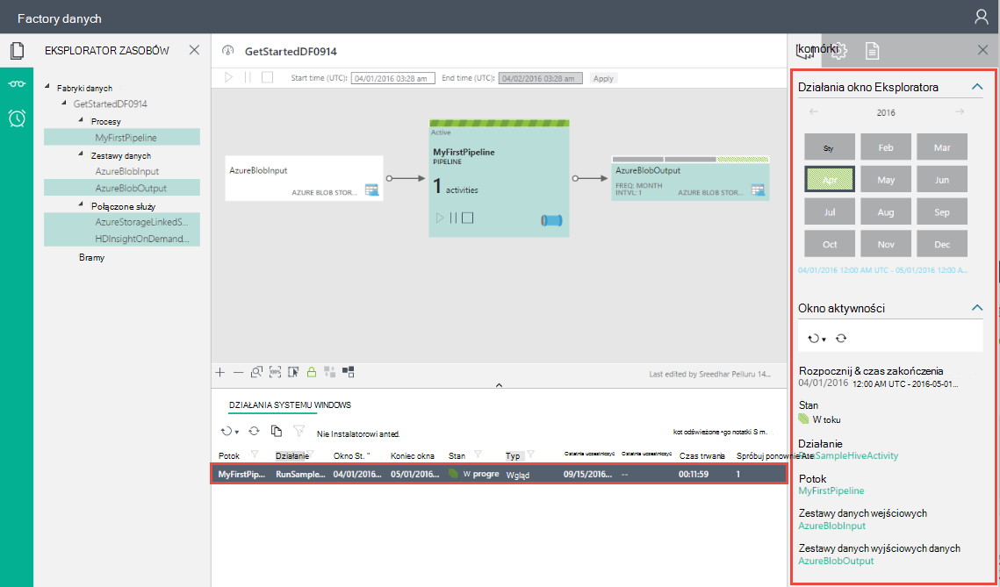
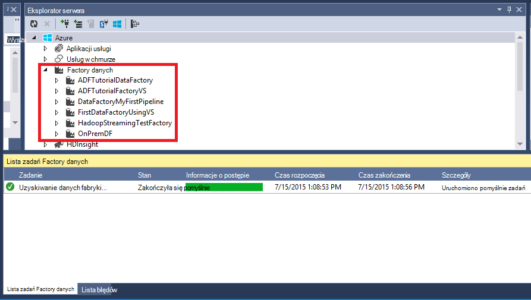

<properties
    pageTitle="Tworzenie pierwszego factory danych (Visual Studio) | Microsoft Azure"
    description="W tym samouczku możesz utworzyć potok Azure Factory danych przykładowych przy użyciu programu Visual Studio."
    services="data-factory"
    documentationCenter=""
    authors="spelluru"
    manager="jhubbard"
    editor="monicar"/>

<tags
    ms.service="data-factory"
    ms.workload="data-services"
    ms.tgt_pltfrm="na"
    ms.devlang="na"
    ms.topic="hero-article" 
    ms.date="10/17/2016"
    ms.author="spelluru"/>

# Samouczek: Tworzenie imienia Azure danych factory przy użyciu programu Microsoft Visual Studio
> [AZURE.SELECTOR]
- [Omówienie i wymagania wstępne](data-factory-build-your-first-pipeline.md)
- [Azure portal](data-factory-build-your-first-pipeline-using-editor.md)
- [Programu Visual Studio](data-factory-build-your-first-pipeline-using-vs.md)
- [Programu PowerShell](data-factory-build-your-first-pipeline-using-powershell.md)
- [Szablon Menedżera zasobów](data-factory-build-your-first-pipeline-using-arm.md)
- [INTERFEJSU API USŁUGI REST](data-factory-build-your-first-pipeline-using-rest-api.md)

W tym artykule program Microsoft Visual Studio do utworzenia pierwszego firmie Azure danych.

## Wymagania wstępne
1. Przeczytaj artykuł [Omówienie samouczka](data-factory-build-your-first-pipeline.md) i wykonaj kroki **wymagania wstępne** .
2. Aby można było opublikować jednostek Factory danych z programu Visual Studio do fabryki danych Azure, musisz być **administratorem Azure subskrypcji** .
3. Musi być zainstalowane na komputerze następujące elementy: 
    - Visual Studio 2013 lub Visual Studio 2015 r.
    - Pobierz Azure zestaw SDK programu Visual Studio 2013 lub program Visual Studio 2015 r. Przejdź do [Strony pobierania Azure](https://azure.microsoft.com/downloads/) , a następnie kliknij przycisk **2013 w PORÓWNANIU z** lub **2015 w PORÓWNANIU z** w sekcji **.NET** .
    - Pobierz najnowszą wtyczki Azure Factory danych dla programu Visual Studio: [2013 w PORÓWNANIU z](https://visualstudiogallery.msdn.microsoft.com/754d998c-8f92-4aa7-835b-e89c8c954aa5) lub [w PORÓWNANIU z 2015 r](https://visualstudiogallery.msdn.microsoft.com/371a4cf9-0093-40fa-b7dd-be3c74f49005). Możesz także zaktualizować wtyczkę, wykonując następujące czynności: W menu kliknij pozycję **Narzędzia** -> **rozszerzenia i aktualizacje** -> **Online** -> **Galerii Visual Studio** -> **Microsoft Azure danych Factory Tools for Visual Studio** -> **aktualizacji**. 
 
Teraz można użyć programu Visual Studio do tworzenia factory Azure danych. 

## Tworzenie projektu programu Visual Studio 
1. Uruchom program **Visual Studio 2013** lub **Visual Studio 2015 r**. Kliknij pozycję **plik**, wskaż polecenie **Nowy**, a następnie kliknij pozycję **Projekt**. Należy wyświetlić okno dialogowe **Nowy projekt** .  
2. W oknie dialogowym **Nowy projekt** wybierz szablon **DataFactory** , a następnie kliknij pozycję **Pusty projekt Factory danych**.   

    

3. Wprowadź **nazwę** dla projektu, **lokalizację**i nazwę **rozwiązanie**, a następnie kliknij **przycisk OK**.

    

## Tworzenie połączonych usług
Factory danych może zawierać jedną lub więcej procesy. Potok może zawierać jedną lub więcej czynności w nim. Na przykład kopiowanie działanie Aby skopiować dane ze źródła do miejsca docelowego przechowywanie danych oraz działaniem gałąź HDInsight uruchamianie skryptu gałęzi do przekształcania danych wejściowych. Zobacz [obsługiwane dane są przechowywane](data-factory-data-movement-activities.md##supported-data-stores-and-formats) dla wszystkich źródeł i pochłaniacze obsługiwane przez to działanie Kopiuj. Zobacz [obliczyć połączonych usług](data-factory-compute-linked-services.md) dla listy obsługiwanych przez Factory danych usług obliczeń. 

W tym kroku do których łącza Twoje konto Azure miejsca do magazynowania i klaster Azure HDInsight na żądanie firmie danych. Konta magazynu platformy Azure przechowuje dane wejściowe i wyjściowe procesu, w tym przykładzie. Usługa HDInsight połączone jest używana do uruchomienia skryptu gałęzi określony w działaniu potoku w tym przykładzie. Identyfikowanie danych sklepu i obliczeń usług są używane w programie i łączenie tych usług do fabryki danych, tworząc usługi połączone.  

Określ nazwę i ustawień fabrycznych danych później podczas publikowania rozwiązania Factory danych.

#### Tworzenie usługi Magazyn Azure połączone
W tym kroku konta magazynu platformy Azure połączyć firmie danych. Ten samouczek tego samego konta magazynu platformy Azure służy do przechowywania danych wejścia i wyjścia i plik skryptu HQL. 

4. Kliknij prawym przyciskiem myszy **Usługi połączone** w Eksploratorze rozwiązań, wskaż pozycję **Dodaj**, a następnie kliknij przycisk **Nowy element**.      
5. W oknie dialogowym **Dodawanie nowego elementu** wybierz z listy **Usługi połączone magazyn Azure** , a następnie kliknij przycisk **Dodaj**. 
3. Zamień nazwę konta magazynu platformy Azure i klucza **Nazwa konta** i **accountkey** . Aby dowiedzieć się, jak uzyskać klucz dostępu do magazynowania, zobacz [Wyświetlanie, Kopiuj i klawisze dostępu wyniku miejsca do magazynowania](../storage/storage-create-storage-account.md#view-copy-and-regenerate-storage-access-keys)

    

4. Zapisz plik **AzureStorageLinkedService1.json** .

#### Tworzenie usługa Azure HDInsight połączone
W tym kroku klastrze HDInsight na żądanie połączyć firmie danych. Klaster HDInsight jest automatycznie tworzone w czasie rzeczywistym i usunięte po zakończeniu przetwarzania i bezczynne przez określony czas. Klaster HDInsight można używać zamiast klastrze HDInsight na żądanie. Aby uzyskać szczegółowe informacje, zobacz [Obliczyć usługi połączone](data-factory-compute-linked-services.md) . 

1. W **Eksploratorze rozwiązań**kliknij prawym przyciskiem myszy **Usługi połączone**, wskaż pozycję **Dodaj**, a następnie kliknij przycisk **Nowy element**.
2. Zaznacz **HDInsight na żądanie powiązanych z**, a następnie kliknij przycisk **Dodaj**. 
3. Zastąp **JSON** następujące czynności:

        {
          "name": "HDInsightOnDemandLinkedService",
          "properties": {
            "type": "HDInsightOnDemand",
            "typeProperties": {
              "version": "3.2",
              "clusterSize": 1,
              "timeToLive": "00:30:00",
              "linkedServiceName": "AzureStorageLinkedService1"
            }
          }
        }
    
    Poniższa tabela zawiera opisy właściwości JSON używane w wstawkę kodu:
    
    Właściwość | Opis
    -------- | -----------
    Wersja | Określa, że należy 3,2 wersji HDInsight. 
    ClusterSize | Określa rozmiar klaster HDInsight. 
    Licznika TimeToLive | Określa, że czasu bezczynności dla klastrów HDInsight, zanim zostanie usunięty.
    linkedServiceName | Określa konto miejsca do magazynowania, który służy do przechowywania dzienniki wygenerowane przez HDInsight

    Pamiętaj o następujących kwestiach: 
    
    - Factory danych utworzy klastrze HDInsight **systemu Windows** z poprzedniego JSON. Możesz również mogą mieć go utworzyć klaster HDInsight **systemem Linux** . Aby uzyskać szczegółowe informacje, zobacz [Połączone usługi HDInsight na żądanie](data-factory-compute-linked-services.md#azure-hdinsight-on-demand-linked-service) . 
    - **Klaster HDInsight** można używać zamiast klastrze HDInsight na żądanie. Aby uzyskać szczegółowe informacje, zobacz [Połączone usługi HDInsight](data-factory-compute-linked-services.md#azure-hdinsight-linked-service) .
    - Klaster HDInsight tworzy **kontener domyślny** w magazynie obiektów blob, podane w JSON (**linkedServiceName**). Usługa HDInsight nie powoduje usunięcia tego kontenera, usunięcie klaster. To zachowanie jest zgodne z projektem. Usługa HDInsight połączone na żądanie klaster HDInsight jest tworzona każdorazowo wycinek jest przetwarzana, chyba że jest istniejącym klastrem live (**licznika timeToLive**). Klaster jest automatycznie usuwane po zakończeniu przetwarzania.
    
        Gdy więcej wycinki są przetwarzane, widzisz liczby kontenerów w magazynie obiektów blob platformy Azure. Jeśli nie potrzebujesz do rozwiązywania problemów z zadań, można usunąć ich tak, aby zajmowała miejsca do magazynowania. Nazwy tych kontenerów wykonaj deseniu: "adf**yourdatafactoryname**-**linkedservicename**- datetimestamp". Aby usunąć kontenerów w magazynie obiektów blob platformy Azure, użyj narzędzi, takich jak [Miejsca do magazynowania w Eksploratorze](http://storageexplorer.com/) .

    Aby uzyskać szczegółowe informacje, zobacz [Połączone usługi HDInsight na żądanie](data-factory-compute-linked-services.md#azure-hdinsight-on-demand-linked-service) . 
4. Zapisz plik **HDInsightOnDemandLinkedService1.json** .

## Tworzenie zestawów danych
W tym kroku utworzysz zestawy danych w celu reprezentują dane wejściowe i wyjściowe danych do przetwarzania gałęzi. Te zestawy danych dotyczą **AzureStorageLinkedService1** został utworzony wcześniej w tym samouczku. Wskazywany usługi połączone konto Azure miejsca do magazynowania i zestawy danych określić kontener, folder, nazwy pliku w magazynie, w którym znajduje się dane wejściowe i wyjściowe danych.   

#### Tworzenie zestawu wprowadzania danych

1. W **Eksploratorze rozwiązań**kliknij prawym przyciskiem myszy **tabele**, wskaż pozycję **Dodaj**, a następnie kliknij przycisk **Nowy element**. 
2. Z listy wybierz **Obiektów Blob platformy Azure** , Zmień nazwę pliku na **InputDataSet.json**i kliknij przycisk **Dodaj**.
3. Zastąp **JSON** w edytorze następujące czynności: 

    W wstawkę JSON tworzysz zestaw danych o nazwie **AzureBlobInput** reprezentujący danych wejściowych dla działania w potoku. Ponadto określisz, że dane wejściowe znajduje się w kontenerze obiektów blob o nazwie **adfgetstarted** i folderu o nazwie **inputdata**
        
        {
            "name": "AzureBlobInput",
            "properties": {
                "type": "AzureBlob",
                "linkedServiceName": "AzureStorageLinkedService1",
                "typeProperties": {
                    "fileName": "input.log",
                    "folderPath": "adfgetstarted/inputdata",
                    "format": {
                        "type": "TextFormat",
                        "columnDelimiter": ","
                    }
                },
                "availability": {
                    "frequency": "Month",
                    "interval": 1
                },
                "external": true,
                "policy": {}
            }
        } 

    Poniższa tabela zawiera opisy właściwości JSON używane w wstawkę kodu:

  	| Właściwość | Opis |
  	| :------- | :---------- |
  	| Typ | Właściwość Typ jest ustawiona na AzureBlob, ponieważ dane znajdują się w magazynie obiektów blob platformy Azure. |  
  	| linkedServiceName | odwołuje się do AzureStorageLinkedService1 został utworzony wcześniej. |
  	| Nazwa pliku | Ta właściwość jest opcjonalna. Jeśli ta właściwość zostanie pominięty, wszystkie pliki z ścieżkafolderu są pobierane. W tym przypadku jest przetwarzana tylko input.log. |
  	| Typ | Pliki dziennika są w formacie tekstowym, więc firma Microsoft korzysta z TextFormat. | 
  	| columnDelimiter | kolumny w plikach dziennika są rozdzielane znakami przecinek () |
  	| częstotliwość/interwał | częstotliwość ustawionym na wartość miesiąc i interwału wynosi 1, co oznacza, że wprowadzania wycinki są dostępne co miesiąc. | 
  	| zewnętrzne | Ta właściwość jest ustawiona na PRAWDA, jeśli dane wejściowe nie jest generowany przez usługę Factory danych. | 
      
    
3. Zapisz plik **InputDataset.json** . 

 
#### Tworzenie zestawu danych wyjściowych danych
Teraz możesz utworzyć zestaw danych dane wyjściowe reprezentować dane przechowywane w magazynie obiektów Blob platformy Azure. 

1. W **Eksploratorze rozwiązań**kliknij prawym przyciskiem myszy **tabele**, wskaż pozycję **Dodaj**, a następnie kliknij przycisk **Nowy element**. 
2. Z listy wybierz **Obiektów Blob platformy Azure** , Zmień nazwę pliku na **OutputDataset.json**i kliknij przycisk **Dodaj**. 
3. Zastąp **JSON** w edytorze następujące czynności: 

    W wstawkę JSON tworzysz zestaw danych o nazwie **AzureBlobOutput**i określanie struktury danych, które są tworzone przez skrypt gałęzi. Ponadto można określić, że wyniki są przechowywane w kontenerze obiektów blob o nazwie **adfgetstarted** i folderu o nazwie **partitioneddata**. W sekcji **dostępność** Określa, że zestaw danych wynik jest wyprodukowane miesięcznych.
    
        {
          "name": "AzureBlobOutput",
          "properties": {
            "type": "AzureBlob",
            "linkedServiceName": "AzureStorageLinkedService1",
            "typeProperties": {
              "folderPath": "adfgetstarted/partitioneddata",
              "format": {
                "type": "TextFormat",
                "columnDelimiter": ","
              }
            },
            "availability": {
              "frequency": "Month",
              "interval": 1
            }
          }
        }

    Zobacz **Tworzenie zestawu danych wejściowych** sekcję opisy tych właściwości. Nie ustawić właściwości zewnętrznych w zestawie danych wynik, jak zestaw danych jest tworzone przez usługę Factory danych.

4. Zapisz plik **OutputDataset.json** .

### Tworzenie procesu
W tym kroku utworzysz pierwszego planowaną z działaniem **HDInsightHive** . Wprowadzania jest dostępny co miesiąc (częstotliwość: miesiąc, interwał: 1), dane wyjściowe wycinek powstaje miesięczny i właściwość harmonogram działania również jest ustawiona na co miesiąc. Ustawienia zestawu danych dane wyjściowe i harmonogram aktywności musi odpowiadać. Dane wyjściowe zestawu danych jest obecnie, co dyski harmonogram, należy utworzyć zestaw danych wyjściowych, nawet jeśli działania generuje żadnego wyniku. Jeśli działanie nie trwa wszelkie wprowadzone dane, możesz pominąć tworzenie zestawu danych wejściowych. Na końcu tej sekcji opisano właściwości używane w następujących JSON.

1. W **Eksploratorze rozwiązań**, kliknij prawym przyciskiem myszy **procesy**, wskaż pozycję **Dodaj**, a następnie kliknij przycisk **Nowy element.** 
2. Z listy wybierz **Gałąź planowana przekształcenie** i kliknij przycisk **Dodaj**. 
3. Zamień **JSON** poniższy fragment.

    > [AZURE.IMPORTANT] Zamień **storageaccountname** nazwę swojego konta miejsca do magazynowania.

        {
            "name": "MyFirstPipeline",
            "properties": {
                "description": "My first Azure Data Factory pipeline",
                "activities": [
                    {
                        "type": "HDInsightHive",
                        "typeProperties": {
                            "scriptPath": "adfgetstarted/script/partitionweblogs.hql",
                            "scriptLinkedService": "AzureStorageLinkedService1",
                            "defines": {
                                "inputtable": "wasb://adfgetstarted@<storageaccountname>.blob.core.windows.net/inputdata",
                                "partitionedtable": "wasb://adfgetstarted@<storageaccountname>.blob.core.windows.net/partitioneddata"
                            }
                        },
                        "inputs": [
                            {
                                "name": "AzureBlobInput"
                            }
                        ],
                        "outputs": [
                            {
                                "name": "AzureBlobOutput"
                            }
                        ],
                        "policy": {
                            "concurrency": 1,
                            "retry": 3
                        },
                        "scheduler": {
                            "frequency": "Month",
                            "interval": 1
                        },
                        "name": "RunSampleHiveActivity",
                        "linkedServiceName": "HDInsightOnDemandLinkedService"
                    }
                ],
                "start": "2016-04-01T00:00:00Z",
                "end": "2016-04-02T00:00:00Z",
                "isPaused": false
            }
        }

    W wstawkę JSON tworzysz Potok składa się z jednego działania używającej gałęzi przetwarzania danych w klastrze HDInsight.
    
    W wstawkę JSON tworzysz Potok składa się z jednego działania używanego gałęzi do procesu danych w klastrze HDInsight.
    
    Plik skryptu gałęzi, **partitionweblogs.hql**znajduje się na koncie Azure przestrzeni dyskowej (określonego przez scriptLinkedService, o nazwie **AzureStorageLinkedService1**), a w folderze **skrypt** w kontenerze **adfgetstarted**.

    **Określa** sekcja służy do określania ustawień środowisko uruchomieniowe, które są przekazywane do skryptu gałęzi jako wartości konfiguracji gałęzi (np. ${hiveconf: inputtable}, ${hiveconf:partitionedtable}).

    **Początek** i **koniec** właściwości potoku określa aktywnego okresu potoku.

    W działaniu JSON możesz określić, że skrypt gałąź zostanie uruchomiona na obliczeń określony przez **linkedServiceName** — **HDInsightOnDemandLinkedService**.

    > [AZURE.NOTE] [Budowa potok](data-factory-create-pipelines.md#anatomy-of-a-pipeline) Zobacz szczegółowe informacje na temat właściwości JSON używane w przykładzie. 
3. Zapisz plik **HiveActivity1.json** .

### Dodawanie partitionweblogs.hql i input.log jako zależne 

1. Kliknij prawym przyciskiem myszy **zależności** w oknie **Eksplorator rozwiązanie** , wskaż pozycję **Dodaj**, a następnie kliknij **Istniejący element**.  
2. Przejdź do **C:\ADFGettingStarted** i wybierz pozycję **partitionweblogs.hql**, pliki **input.log** i kliknij przycisk **Dodaj**. Tych plików w ramach wymagania wstępne dotyczące utworzono z [Omówienie samouczka](data-factory-build-your-first-pipeline.md).

Podczas publikowania rozwiązanie w następnym kroku, w folderze skryptów w kontenerze obiektów blob **adfgetstarted** przekazaniu pliku **partitionweblogs.hql** .   

### Publikowanie i wdrażanie podmioty Factory danych

18. Kliknij prawym przyciskiem myszy projektu w Eksploratorze rozwiązań, a następnie kliknij pozycję **Publikuj**. 
19. Jeśli zostanie wyświetlone okno dialogowe **Zaloguj się do swojego konta Microsoft** , wprowadź poświadczenia konta, które ma Azure subskrypcję, a następnie kliknij przycisk **Zaloguj**.
20. Powinien zostać wyświetlony następujące okno dialogowe:

    

21. Na stronie Konfigurowanie factory danych wykonaj następujące czynności: 
    1. Wybierz opcję **Utwórz nowy Factory danych** .
    2. Wpisz unikatową **nazwę** dla factory danych. Na przykład: **FirstDataFactoryUsingVS09152016**. Nazwa musi być unikatowa globalnie.  
    
    
        > [AZURE.IMPORTANT] Jeśli zostanie wyświetlony komunikat o błędzie **factory danych o nazwie "FirstDataFactoryUsingVS" nie jest dostępny** podczas publikowania, Zmień nazwę (na przykład yournameFirstDataFactoryUsingVS). Temat [Danych Factory - reguł nadawania nazw](data-factory-naming-rules.md) dla reguł nazewnictwa artefakty Factory danych.
3. Wybierz subskrypcję prawo w polu **subskrypcji** .
     
     
        > [AZURE.IMPORTANT] Jeśli nie widzisz żadnej subskrypcji, upewnij się, zalogowany przy użyciu konta administratora lub administratorami co subskrypcji.  
        
    4. Wybierz pozycję **Grupa zasobów** dla factory danych ma zostać utworzony. 
    5. Wybierz pozycję **region** factory danych. 
    6. Kliknij przycisk **Dalej** , aby przejść na stronę **Publikowanie elementów** . (Naciśnij klawisz **TAB** , aby przenieść z pola Nazwa, jeśli jest wyłączona, przycisk **Dalej** ). 
23. Na stronie **Publikowanie elementów** upewnij się, że wszystkie fabryki danych jednostki są zaznaczone, a następnie kliknij przycisk **Dalej** , aby przejść na stronę **podsumowania** .     
24. Zapoznaj się z podsumowaniem i kliknij przycisk **Dalej** uruchomienie procesu wdrażania i wyświetlanie **Stanu rozmieszczania**.
25. Na stronie **Stanu rozmieszczania** powinna być widoczna stan procesu wdrażania. Po zakończeniu rozmieszczania, kliknij przycisk Zakończ. 

 
Ważne informacje, które należy pamiętać: 

- Jeśli zostanie wyświetlony komunikat o błędzie: "**tej subskrypcji nie została zarejestrowana jako nazw Microsoft.DataFactory**", wykonaj jedną z następujących czynności, a następnie ponownie spróbuj opublikować: 

    - W programie PowerShell Azure uruchom następujące polecenie, aby zarejestrować dostawcy danych Factory. 
        
            Register-AzureRmResourceProvider -ProviderNamespace Microsoft.DataFactory
    
        Można uruchomić następujące polecenie, aby potwierdzić, że Factory danych dostawca jest zarejestrowany. 
    
            Get-AzureRmResourceProvider
    - Zaloguj się przy użyciu Azure subskrypcję w [Azure portal](https://portal.azure.com) i przejdź do strony karta Factory danych (lub) tworzenie factory danych w portalu Azure. Ta akcja automatycznie rejestruje dostawcy dla Ciebie.
-   Nazwa fabryki danych może być zarejestrowana w przyszłości i w związku z tym stają się publicznie widoczne nazwy DNS.
-   Aby utworzyć wystąpienia Factory danych, musisz być administratorem lub administratorami co Azure subskrypcji

 
## Potok monitorze

### Potok monitorze przy użyciu widoku diagramu
6. Zaloguj się do [portalu Azure](https://portal.azure.com/), wykonaj następujące czynności:
    1. Kliknij pozycję **więcej usług** , a następnie kliknij przycisk **fabryki danych**.
         
    2. Wybierz nazwę firmie danych (na przykład: **FirstDataFactoryUsingVS09152016**) z listy fabryki danych. 
        
7. Na stronie głównej firmie danych kliknij pozycję **Diagram**.
  
    
7. W widoku diagramu widać omówienie procesy i zestawy danych używane w tym samouczku.
    
     
8. Aby wyświetlić wszystkie działania w potoku, kliknij prawym przyciskiem myszy procesu na diagramie, a następnie kliknij przycisk Otwórz procesu. 

    
9. Upewnij się, że zobaczysz aktywności HDInsightHive w potoku. 
  
    

    Aby przejść z powrotem do poprzedniego widoku, kliknij pozycję **factory danych** w menu łączy do stron nadrzędnych u góry. 
10. W **Widoku diagramu**kliknij dwukrotnie **AzureBlobInput**zestawu danych. Upewnij się, że wycinek jest **gotowa** do drukowania. Może potrwać kilka minut, aby być w stanie gotowości jest wyświetlany wycinek. Jeśli nie jest stosowane po Czekaj na daty, zobacz, jeśli masz plik wejściowy (input.log) umieszczony w prawej kontenera (adfgetstarted) i folderów (inputdata).

    
11. Kliknij przycisk **X** , aby zamknąć karta **AzureBlobInput** . 
12. W **Widoku diagramu**kliknij dwukrotnie **AzureBlobOutput**zestawu danych. Zostanie wyświetlony wycinek, który jest obecnie przetwarzane.

    
9. Po zakończeniu przetwarzania Zobacz wycinek **gotowa** do drukowania.

    > [AZURE.IMPORTANT] Tworzenie klastrze HDInsight na żądanie zwykle trwa daty (około 20 minut). W związku z tym proces zajmie **około 30 minut** przetwarzania wycinek z oczekiwaniami.  

     
    
10. Gdy wycinek jest **gotowa** do drukowania, należy sprawdzić folder **partitioneddata** w kontenerze **adfgetstarted** w magazynie obiektów blob dla danych wyjściowych.  
 
    
11. Kliknij wycinek, aby wyświetlić szczegółowe informacje o nim w karta **wycinek** .

      
12. Kliknij działanie Uruchom **Lista zostanie uruchomiona czynności** , aby szczegółowe informacje na temat działania (gałęzi czynność w naszym scenariuszu) są uruchamiane w oknie **Uruchamianie szczegóły aktywności** .   
      
    
    Z plików dziennika widoczne gałęzi kwerendę, która została wykonana i informacje o stanie. Dzienniki te są przydatne do rozwiązywania problemów.  
 

Aby uzyskać instrukcje dotyczące monitorowanie planowanej i zestawy danych za pomocą portalu Azure utworzonej w tym samouczku, zobacz [Monitorowanie zestawy danych i planowana](data-factory-monitor-manage-pipelines.md) .

### Monitorowanie planowana przy użyciu monitora i zarządzanie aplikacji
Można również użyć monitora i Zarządzanie aplikacją monitorowanie usługi procesy. Aby uzyskać szczegółowe informacje o korzystaniu z tej aplikacji, zobacz [Monitor i zarządzanie nimi procesy Factory danych Azure za pomocą monitorowania i zarządzania aplikacji](data-factory-monitor-manage-app.md).

1. Kliknij przycisk Monitor i zarządzanie kafelków.

     
2. Należy wyświetlić Monitor i Zarządzanie aplikacją. Zmienić **czas rozpoczęcia** i **czas zakończenia** zgodnie z start (2016-04-01 12:00 AM) godziny i zakończenia (04-02-2016 12:00 AM) do potoku i kliknij przycisk **Zastosuj**.

     
3. Na liście Windows aktywności, aby wyświetlić szczegółowe informacje o tym, wybierz polecenie Okno aktywności. 
    

> [AZURE.IMPORTANT] Plik wejściowy otrzymuje usunięte po pomyślnym przetworzeniu wycinek. W związku z tym jeśli chcesz ponownie wycinek lub wykonaj ponownie samouczka, Przekaż plik wejściowy (input.log) do folderu inputdata kontenera adfgetstarted.
 

## Wyświetlanie fabryki danych przy użyciu Eksploratora serwera

1. W **Programie Visual Studio**kliknij menu **Widok** , a następnie kliknij **Server Explorer**.
2. W oknie Eksplorator Server rozwiń **Azure** i rozwiń **Factory danych**. Jeśli zobaczysz, **Zaloguj się do programu Visual Studio**, wprowadź **konta** skojarzonego z subskrypcją usługi Azure i kliknij przycisk **Kontynuuj**. Wprowadź **hasło**, a następnie kliknij przycisk **Zaloguj**. Program Visual Studio próbuje uzyskać informacje na temat wszystkich fabryki Azure danych w ramach subskrypcji. Zobacz stan tej operacji w oknie **Lista zadań Factory danych** .

    
3. Kliknij prawym przyciskiem myszy factory danych i wybierz pozycję **Eksportuj Factory danych do nowego projektu** do tworzenia projektu programu Visual Studio, oparte na istniejące factory danych.

    

## Aktualizowanie narzędzia Factory danych dla programu Visual Studio

Aby zaktualizować narzędzia Factory danych Azure programu Visual Studio, wykonaj następujące czynności:

1. W menu kliknij pozycję **Narzędzia** i wybierz **rozszerzenia i aktualizacje**.
2. W okienku po lewej stronie wybierz **aktualizacje** , a następnie wybierz pozycję **Galerii Visual Studio**.
3. Wybierz pozycję **narzędzia Factory danych Azure programu Visual Studio** , a następnie kliknij przycisk **Aktualizuj**. Jeśli nie widzisz ten wpis, masz już najnowszą wersję narzędzia. 

## Korzystanie z plików konfiguracji
Korzystanie z plików konfiguracji w programie Visual Studio, aby skonfigurować właściwości połączone usług tabel procesy w inny sposób dla każdego środowiska. 

Należy rozważyć następujące definicje JSON usługi Magazyn Azure połączone. Aby określić **connectionString** o różnych wartościach nazwa konta i accountkey na podstawie środowiska (deweloperów Test-produkcja), do której są wdrażanie podmioty Factory danych. Ten problem można uzyskać za pomocą pliku konfiguracji oddzielnym dla każdego środowiska. 

    {
        "name": "StorageLinkedService",
        "properties": {
            "type": "AzureStorage",
            "description": "",
            "typeProperties": {
                "connectionString": "DefaultEndpointsProtocol=https;AccountName=<accountname>;AccountKey=<accountkey>"
            }
        }
    } 

### Dodawanie pliku konfiguracji
Dodawanie pliku konfiguracji dla każdego środowiska, wykonując następujące czynności:   

1. Kliknij prawym przyciskiem myszy Factory danych projektu w rozwiązaniu Visual Studio, wskaż pozycję **Dodaj**, a następnie kliknij przycisk **Nowy element**.
2. **Wybierz z listy zainstalowanych szablonów po lewej stronie** , wybierz **Plik konfiguracji**, wprowadź **nazwę** pliku konfiguracji i kliknij przycisk **Dodaj**.

    
3. Dodawanie parametrów konfiguracji i ich wartości w następującym formacie.

        {
            "$schema": "http://datafactories.schema.management.azure.com/vsschemas/V1/Microsoft.DataFactory.Config.json",
            "AzureStorageLinkedService1": [
                {
                    "name": "$.properties.typeProperties.connectionString",
                    "value": "DefaultEndpointsProtocol=https;AccountName=<accountname>;AccountKey=<accountkey>"
                }
            ],
            "AzureSqlLinkedService1": [
                {
                    "name": "$.properties.typeProperties.connectionString",
                    "value":  "Server=tcp:spsqlserver.database.windows.net,1433;Database=spsqldb;User ID=spelluru;Password=Sowmya123;Trusted_Connection=False;Encrypt=True;Connection Timeout=30"
                }
            ]
        }

    W tym przykładzie konfiguruje właściwości connectionString usługi Magazyn Azure połączone i SQL Azure połączone. Zwróć uwagę, że składnia Określanie nazwy jest [JsonPath](http://goessner.net/articles/JsonPath/).   

    Jeśli właściwość ma JSON zawierającego tablicę wartości, jak pokazano w poniższym kodzie:  

        "structure": [
            {
                "name": "FirstName",
                "type": "String"
            },
            {
                "name": "LastName",
                "type": "String"
            }
        ],
    
    Konfigurowanie właściwości, jak pokazano w następującym pliku konfiguracji (Użyj od zera indeksowania): 
        
        {
            "name": "$.properties.structure[0].name",
            "value": "FirstName"
        }
        {
            "name": "$.properties.structure[0].type",
            "value": "String"
        }
        {
            "name": "$.properties.structure[1].name",
            "value": "LastName"
        }
        {
            "name": "$.properties.structure[1].type",
            "value": "String"
        }

### Nazwy właściwości ze spacjami
Jeśli nazwa właściwości zawiera spacje, Użyj nawiasów kwadratowych, jak pokazano w poniższym przykładzie (nazwa serwera bazy danych): 

     {
         "name": "$.properties.activities[1].typeProperties.webServiceParameters.['Database server name']",
         "value": "MyAsqlServer.database.windows.net"
     }

### Wdrażanie rozwiązania używa konfiguracji
Publikując podmioty Factory danych Azure w PORÓWNANIU z, można określić konfiguracji, która ma być używany dla tej operacji publikowania. 

Aby opublikować podmioty w projekcie Factory danych Azure za pomocą pliku konfiguracji:   

1. Kliknij prawym przyciskiem myszy Factory danych projektu, a następnie kliknij przycisk **Publikuj** , aby wyświetlić okno dialogowe **Publikowanie elementów** . 
2. Wybierz istniejące factory danych lub określić wartości związane z tworzeniem factory danych na stronie **Konfigurowanie danych factory** i kliknij przycisk **Dalej**.   
3. Na stronie **Publikowanie elementów** : Zobacz listy rozwijanej z dostępnych konfiguracji w polu **Wybieranie konfiguracji wdrażania** .

    

4. Wybierz **plik konfiguracji** , do którego chcesz użyć, a następnie kliknij przycisk **Dalej**. 
5. Upewnij się, zobacz nazwę pliku JSON na stronie **podsumowania** , a następnie kliknij przycisk **Dalej**. 
6. Po zakończeniu operacji wdrażania, kliknij przycisk **Zakończ** . 

Po wdrożeniu, wartości z pliku konfiguracji służą do ustawiania wartości właściwości w plikach JSON podmioty Factory danych przed wdrożeniem jednostki usłudze Azure danych Factory.   

## Podsumowanie 
W tym samouczku utworzono fabryki Azure danych, aby dane procesu, uruchamiając skrypt gałęzi w klastrze hadoop HDInsight. Edytor Factory danych jest używane w portalu Azure wykonywania następujących czynności:  

1.  Utworzony Azure **factory danych**.
2.  Tworzone dwa **połączone usług**:
    1.  **Magazyn Azure** połączone usługi do połączenia z magazynem obiektów blob Azure zawierający pliki wejścia i wyjścia do fabryki danych.
    2.  **Usługa Azure HDInsight** na żądanie powiązanych z utworzyć łącze z klastrem HDInsight Hadoop na żądanie factory danych. Azure Factory danych tworzy HDInsight Hadoop klaster tylko na czas przetwarzanie danych wejściowych i warzywa danych wyjściowych. 
3.  Tworzone dwa **zestawy danych**, które opisują dane wejściowe i wyjściowe wykonania gałąź HDInsight w potoku. 
4.  Utworzony **Planowana** aktywnością **Gałąź HDInsight** .  

## Następne kroki
W tym artykule utworzono potok aktywności przekształcenie (czynność HDInsight) uruchamia skrypt gałęzi w klastrze HDInsight na żądanie. Aby zobaczyć, jak za pomocą działaniem kopii skopiuj dane z obiektów Blob platformy Azure SQL Azure, zobacz [Samouczek: kopiowanie danych z platformy Azure blob SQL Azure](data-factory-copy-data-from-azure-blob-storage-to-sql-database.md).
  
## Zobacz też
| Temat | Opis |
| :---- | :---- |
| [Działania przekształcania danych](data-factory-data-transformation-activities.md) | Ten artykuł zawiera listę działań przekształcania danych (na przykład transformacja gałąź HDInsight używane w tym samouczku) obsługiwanych przez Azure danych Factory. | 
| [Planowanie i wykonywanie](data-factory-scheduling-and-execution.md) | W tym artykule wyjaśniono, planowania i wykonanie aspektów model aplikacji Azure danych Factory. |
| [Procesy](data-factory-create-pipelines.md) | Ten artykuł pozwoli Ci zrozumienie potoki i działania w Azure Factory danych oraz sposób ich używać do tworzenia przepływów pracy opartych na danych kompleksowe — scenariusz lub firm. |
| [Zestawy danych](data-factory-create-datasets.md) | Ten artykuł ułatwia zrozumienie zestawów danych w Azure danych Factory.
| [Monitorowanie i zarządzanie nimi procesy przy użyciu aplikacji monitorowania](data-factory-monitor-manage-app.md) | W tym artykule opisano, jak można monitorować, zarządzanie i debugowanie procesy za pomocą monitorowania i zarządzania aplikacji. 
