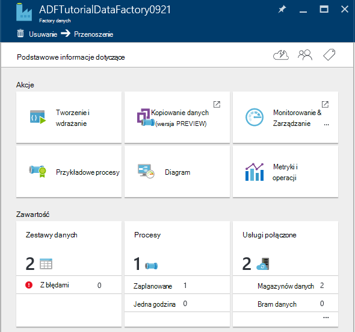

<properties 
    pageTitle="Samouczek: Tworzenie potok aktywnością kopii za pomocą portalu Azure | Microsoft Azure" 
    description="W tym samouczku możesz utworzyć potok Factory danych Azure aktywnością kopii przy użyciu edytora Factory danych w portalu Azure." 
    services="data-factory" 
    documentationCenter="" 
    authors="spelluru" 
    manager="jhubbard" 
    editor="monicar"/>

<tags 
    ms.service="data-factory" 
    ms.workload="data-services" 
    ms.tgt_pltfrm="na" 
    ms.devlang="na" 
    ms.topic="get-started-article" 
    ms.date="09/16/2016" 
    ms.author="spelluru"/>

# Samouczek: Tworzenie potok aktywnością kopii za pomocą portalu Azure
> [AZURE.SELECTOR]
- [Omówienie i wymagania wstępne](data-factory-copy-data-from-azure-blob-storage-to-sql-database.md)
- [Kreator kopii](data-factory-copy-data-wizard-tutorial.md)
- [Azure portal](data-factory-copy-activity-tutorial-using-azure-portal.md)
- [Programu Visual Studio](data-factory-copy-activity-tutorial-using-visual-studio.md)
- [Programu PowerShell](data-factory-copy-activity-tutorial-using-powershell.md)
- [Azure szablonu Menedżera zasobów](data-factory-copy-activity-tutorial-using-azure-resource-manager-template.md)
- [INTERFEJSU API USŁUGI REST](data-factory-copy-activity-tutorial-using-rest-api.md)
- [INTERFEJS API PROGRAMU .NET](data-factory-copy-activity-tutorial-using-dotnet-api.md)

Ten samouczek pokazano, jak tworzyć i monitorowanie factory Azure danych za pomocą portalu Azure. Planowana w factory danych użyto działaniem Kopiuj, aby skopiować dane z magazynem obiektów Blob platformy Azure do bazy danych SQL Azure.

Poniżej przedstawiono kroki, które można wykonać w ramach tego samouczka:

Krok | Opis
-----| -----------
[Tworzenie Factory Azure danych](#create-data-factory) | W tym kroku utworzysz factory Azure danych o nazwie **ADFTutorialDataFactory**.  
[Tworzenie połączonych usług](#create-linked-services) | W tym kroku utworzyć dwie usługi połączone: **AzureStorageLinkedService** i **AzureSqlLinkedService**.   AzureStorageLinkedService łączy Azure magazynowania i AzureSqlLinkedService łączy z bazą danych Azure SQL ADFTutorialDataFactory. Danych wejściowych dla proces znajduje się w kontenerze obiektów blob w dane wyjściowe i magazynowania obiektów blob platformy Azure znajdować się w tabeli w bazie danych Azure SQL. W związku z tym możesz dodać tych dwóch magazynów jako usługi połączone do fabryki danych.      
[Tworzenie dane wejściowe i wyjściowe zestawy danych](#create-datasets) | W poprzednim kroku utworzono połączonych usług, które odwołują się do magazynów danych, które zawierają dane wejścia i wyjścia. W tym kroku definiowania dwa zestawy danych — **InputDataset** i **OutputDataset** — reprezentujących dane wejścia i wyjścia, który jest przechowywany w magazynie danych.   Aby uzyskać InputDataset określić kontener obiektów blob, który zawiera blob z danych źródłowych i OutputDataset, określ tabeli SQL, w której są magazynowane dane wyjściowe. Można także określić inne właściwości, takie jak struktury, dostępność i zasad. 
[Utworzyć potok](#create-pipeline) | W tym kroku utworzysz potok o nazwie **ADFTutorialPipeline** w ADFTutorialDataFactory.   Dodaj **aktywności Kopiuj** do proces kopii wprowadzania danych z Azure blob do tabeli Azure SQL wyników. Działanie kopii wykonuje przenoszenia danych w Azure danych Factory. Jest on obsługiwany przez ogólnie dostępna usługa, która można skopiować dane między różnymi magazynami danych w sposób bezpieczna, niezawodne i skalowalna. Zobacz artykuł [Działania przepływu danych](data-factory-data-movement-activities.md) szczegółowe informacje na temat działania Kopiuj. 
[Potok monitora](#monitor-pipeline) | W tym kroku można monitorować za pomocą Azure portal wycinków wejściowe i wyjściowe tabel.

## Wymagania wstępne 
Wymienione w artykule [Omówienie samouczka](data-factory-copy-data-from-azure-blob-storage-to-sql-database.md) przed wykonaniem tego samouczka wykonano wymagania wstępne.

## Tworzenie factory danych
W tym kroku umożliwia Azure portal tworzenie factory Azure danych o nazwie **ADFTutorialDataFactory**.

1.  Po zalogowaniu się do [portalu Azure](https://portal.azure.com/), kliknij pozycję **Nowy**, wybierz opcję **analizy + analizy**, a następnie kliknij **Factory danych**. 

      

6. W karta **nowego factory danych** :
    1. Wprowadź **nazwę** **ADFTutorialDataFactory** . 
    
        

        Nazwa fabryki Azure danych musi być **globalnie unikatowa**. Jeśli zostanie wyświetlony następujący komunikat o błędzie, Zmień nazwę fabryki danych (na przykład yournameADFTutorialDataFactory), a następnie spróbuj ponownie utworzyć. Temat [Danych Factory - reguł nazewnictwa](data-factory-naming-rules.md) dla reguł nazewnictwa artefakty Factory danych.
    
            Data factory name “ADFTutorialDataFactory” is not available  
     
        
    2. Wybierz pozycję Azure **subskrypcji**.
    3. Grupa zasobów wykonaj jedną z następujących czynności:
        1. Wybierz pozycję **Użyj istniejącego**, a następnie z listy rozwijanej wybierz istniejącej grupy zasobów. 
        2. Wybierz pozycję **Utwórz nowy**, a następnie wprowadź nazwę grupy zasobów.   
    
            Niektóre czynności opisane w tym samouczku przyjęto założenie, możesz użyć nazwy: **ADFTutorialResourceGroup** dla grupy zasobów. Aby uzyskać informacje o grup zasobów, zobacz [Używanie grup zasobów do zarządzania zasobami Azure](../azure-resource-manager/resource-group-overview.md).  
    4. Wybierz **lokalizację** factory danych. Tylko regiony obsługiwane przez usługę Factory danych są wyświetlane na liście rozwijanej.
    5. Wybierz pozycję **Przypnij do Startboard**.     
    6. Kliknij przycisk **Utwórz**.

        > [AZURE.IMPORTANT] Aby utworzyć wystąpienia Factory danych, musi być członkiem roli [Współautora Factory dane](../active-directory/role-based-access-built-in-roles.md/#data-factory-contributor) na poziomie grupy subskrypcji i zasobów.
        >  
        >  Nazwa fabryki danych może być zarejestrowana w przyszłości i w związku z tym stają się publicznie widoczne nazwy DNS.              
9.  Aby wyświetlić stan i powiadomień, kliknij ikonę dzwonka na pasku narzędzi. 

     
10. Po zakończeniu tworzenia zobaczysz karta **Factory danych** , jak pokazano na ilustracji.

    

## Tworzenie połączonych usług
Usługi połączone łącze magazynów lub obliczyć usług do fabryki Azure danych. Zobacz [obsługiwane dane są przechowywane](data-factory-data-movement-activities.md##supported-data-stores-and-formats) dla wszystkich źródeł i pochłaniacze obsługiwane przez to działanie Kopiuj. Zobacz [obliczyć połączonych usług](data-factory-compute-linked-services.md) dla listy obsługiwanych przez Factory danych usług obliczeń. W tym samouczku nie użyć dowolnej usługi obliczeń. 

W tym kroku utworzyć dwie usługi połączone: **AzureStorageLinkedService** i **AzureSqlLinkedService**. AzureStorageLinkedService połączone łącza usługi konta magazynu platformy Azure i AzureSqlLinkedService łączy bazy danych programu Azure SQL z **ADFTutorialDataFactory**. Możesz utworzyć potok w dalszej części tego samouczka, który kopiuje dane z kontenera obiektów blob w AzureStorageLinkedService do tabeli programu SQL w AzureSqlLinkedService.

### Tworzenie połączonych usługi dla konta magazynu platformy Azure
1.  Karta **Factory danych** kliknij **Autor i wdrażanie** kafelków, aby uruchomić **Edytor** dla factory danych.

     
5. W **Edytorze**kliknij przycisk **nowe dane przechowywane** na pasku narzędzi, a następnie z menu rozwijanego wybierz pozycję **Azure miejsca do magazynowania** . Powinien zostać wyświetlony szablon JSON związane z tworzeniem usługa Azure magazynu połączone w okienku po prawej stronie. 

        
6. Zamienianie `<accountname>` i `<accountkey>` nazwę konta oraz wartości klucza konta dla Twojego konta Azure miejsca do magazynowania. 

     
6. Na pasku narzędzi kliknij pozycję **Rozmieść** . Powinna być teraz widoczna wdrożonym **AzureStorageLinkedService** w widoku drzewa. 

    

> [AZURE.NOTE]
> Aby uzyskać szczegółowe informacje o właściwościach JSON, zobacz [Przenoszenie danych z obiektów Blob platformy Azure](data-factory-azure-blob-connector.md#azure-storage-linked-service) .

### Tworzenie połączonych usługi dla bazy danych SQL Azure
1. W oknie **Edytor Factory danych**kliknij przycisk **nowe dane przechowywane** na pasku narzędzi i z menu rozwijanego wybierz **Bazy danych SQL Azure** . Powinien zostać wyświetlony szablon JSON do tworzenia usługa SQL Azure połączone w okienku po prawej stronie.
2. Zamienianie `<servername>`, `<databasename>`, `<username>@<servername>`, i `<password>` z nazwy serwera Azure SQL, bazy danych, konto użytkownika i hasło. 
3. Kliknij pozycję **Rozmieść** na pasku narzędzi, aby tworzyć i wdrażać **AzureSqlLinkedService**.
4. Upewnij się, zobacz **AzureSqlLinkedService** w widoku drzewa. 

> [AZURE.NOTE]
> Aby uzyskać szczegółowe informacje o właściwościach JSON, zobacz [Przenoszenie danych z bazy danych SQL Azure](data-factory-azure-sql-connector.md#azure-sql-linked-service-properties) .

## Tworzenie zestawów danych
W poprzednim kroku, utworzono połączonych usług **AzureStorageLinkedService** i **AzureSqlLinkedService** , aby połączyć konto Azure miejsca do magazynowania i baza danych Azure SQL factory danych: **ADFTutorialDataFactory**. W tym kroku definiowania dwa zestawy danych — **InputDataset** i **OutputDataset** — reprezentujących dane wejścia i wyjścia, który jest przechowywany w magazynie danych określonego przez AzureStorageLinkedService i AzureSqlLinkedService odpowiednio. Aby uzyskać InputDataset określić kontener obiektów blob, który zawiera blob z danych źródłowych i OutputDataset, określ tabeli SQL, w której są magazynowane dane wyjściowe. 

### Tworzenie zestawu wprowadzania danych 
W tym kroku utworzysz zestaw danych o nazwie **InputDataset** , która kieruje do kontenera obiektów blob w magazynie Azure reprezentowany przez usługę **AzureStorageLinkedService** połączone.

1. W **Edytorze** dla Factory danych kliknij przycisk **. Więcej**, kliknij przycisk **Nowy zestaw danych**i kliknij pozycję **Magazyn obiektów Blob platformy Azure** z menu rozwijanego. 

    
2. Zastąp JSON w okienku po prawej stronie wstawkę JSON następujące czynności: 

        {
          "name": "InputDataset",
          "properties": {
            "structure": [
              {
                "name": "FirstName",
                "type": "String"
              },
              {
                "name": "LastName",
                "type": "String"
              }
            ],
            "type": "AzureBlob",
            "linkedServiceName": "AzureStorageLinkedService",
            "typeProperties": {
              "folderPath": "adftutorial/",
              "fileName": "emp.txt",
              "format": {
                "type": "TextFormat",
                "columnDelimiter": ","
              }
            },
            "external": true,
            "availability": {
              "frequency": "Hour",
              "interval": 1
            }
          }
        }
        
     Zwróć uwagę następujące punkty: 
    
    - zestaw danych **typu** jest ustawiony na **AzureBlob**.
    - **linkedServiceName** jest ustawiona na **AzureStorageLinkedService**. Ta usługa połączony został utworzony w kroku 2.
    - **ścieżkafolderu** jest ustawiona na kontenerze **adftutorial** . Można również określić nazwy obiektów blob w folderze przy użyciu właściwości **Nazwa pliku** . Ponieważ nie określisz nazwę obiektu blob, dane z wszystkich obiektów blob w kontenerze jest traktowana jako danych wejściowych.  
    - Format **Typ** jest ustawiona na **TextFormat**
    - Istnieją dwa pola w pliku tekstowym — **Imię** i **nazwisko** — oddzielone znakiem przecinkami (**columnDelimiter**) 
    - **Dostępność** jest ustawiona na **co godzinę** (**Częstotliwość** jest ustawiona na **godzinę** i **interwału** jest ustawiona na **1**). Dlatego Factory danych wyszukuje dane wejściowe co godzinę w folderze głównym kontenera obiektów blob (**adftutorial**) określonej. 
    
    Jeśli nie określisz **nazwę pliku** dla zestawu danych **wejściowych** , wszystkie pliki i blob z folderu wprowadzania (**ścieżkafolderu**) są traktowane jako jako danych wejściowych. Jeśli użytkownik określi nazwę pliku w formacie JSON, tylko określony plik/obiektów blob jest traktowany jako danych wejściowych asn.
 
    Jeśli nie określisz **nazwę pliku** dla **tabeli wyników**, wygenerowane pliki w **ścieżkafolderu** są nazywane w następującym formacie: danych. &lt;Guid\&BT;. txt (przykład: Data.0a405f8a-93ff-4c6f-b3be-f69616f1df7a.txt.).

    Aby ustawić **ścieżkafolderu** i **nazwę pliku** dynamicznie na podstawie **SliceStart** czasu, należy użyć właściwości **partitionedBy** . W poniższym przykładzie ścieżkafolderu została użyta rok, miesiąc i dzień z SliceStart (godzina rozpoczęcia wycinka przetwarzane) i godzinę od SliceStart używa nazwy pliku. Na przykład wycinek jest wyprodukowane dla 2016-09-20T08:00:00, nazwa_folderu jest ustawiona na wikidatagateway-wikisampledataout-2016-09-20 i nazwę pliku jest ustawiona na 08.csv. 

            "folderPath": "wikidatagateway/wikisampledataout/{Year}/{Month}/{Day}",
            "fileName": "{Hour}.csv",
            "partitionedBy": 
            [
                { "name": "Year", "value": { "type": "DateTime", "date": "SliceStart", "format": "yyyy" } },
                { "name": "Month", "value": { "type": "DateTime", "date": "SliceStart", "format": "MM" } }, 
                { "name": "Day", "value": { "type": "DateTime", "date": "SliceStart", "format": "dd" } }, 
                { "name": "Hour", "value": { "type": "DateTime", "date": "SliceStart", "format": "hh" } } 
            ],
2. Kliknij pozycję **Rozmieść** na pasku narzędzi, aby tworzyć i wdrażać **InputDataset** zestawu danych. Upewnij się, że jest wyświetlany **InputDataset** w widoku drzewa.

> [AZURE.NOTE]
> Aby uzyskać szczegółowe informacje o właściwościach JSON, zobacz [Przenoszenie danych z obiektów Blob platformy Azure](data-factory-azure-blob-connector.md#azure-blob-dataset-type-properties) .

### Tworzenie zestawu danych wyjściowych danych
W tej części krok możesz utworzyć zestaw danych wyjściowych o nazwie **OutputDataset**. Punktów tego zestawu danych do tabeli programu SQL w bazie danych Azure SQL reprezentowany przez **AzureSqlLinkedService**. 

1. W **Edytorze** dla Factory danych kliknij przycisk **. Więcej**, kliknij przycisk **Nowy zestaw danych**i kliknij pozycję **Azure SQL** z menu rozwijanego. 
2. Zastąp JSON w okienku po prawej stronie wstawkę JSON następujące czynności:

        {
          "name": "OutputDataset",
          "properties": {
            "structure": [
              {
                "name": "FirstName",
                "type": "String"
              },
              {
                "name": "LastName",
                "type": "String"
              }
            ],
            "type": "AzureSqlTable",
            "linkedServiceName": "AzureSqlLinkedService",
            "typeProperties": {
              "tableName": "emp"
            },
            "availability": {
              "frequency": "Hour",
              "interval": 1
            }
          }
        }
        
     Zwróć uwagę następujące punkty: 
    
    - zestaw danych **typu** jest ustawiony na **AzureSQLTable**.
    - **linkedServiceName** jest ustawiona na **AzureSqlLinkedService** (utworzonej tej usługi połączone w kroku 2).
    - **TableName** ustawiono **emp**.
    - Istnieją trzy kolumny — **identyfikator**, **pole Imię**i **nazwisko** — w tabeli emp w bazie danych. Identyfikator jest kolumną tożsamości, więc należy określić tylko **Imię** i **nazwisko** w tym miejscu.
    - **Dostępność** jest ustawiona na **co godzinę** (**Częstotliwość** **godzinę** i **interwału** ustawiona na **1**).  Usługa danych Factory generuje wycinek wynik co godzinę w tabeli **emp** w bazie danych Azure SQL.

3. Kliknij pozycję **Rozmieść** na pasku narzędzi, aby tworzyć i wdrażać **OutputDataset** zestawu danych. Upewnij się, że jest wyświetlany **OutputDataset** w widoku drzewa. 

> [AZURE.NOTE]
> Aby uzyskać szczegółowe informacje o właściwościach JSON, zobacz [Przenoszenie danych z bazy danych SQL Azure](data-factory-azure-sql-connector.md#azure-sql-linked-service-properties) .

## Tworzenie procesu
W tym kroku utworzyć potok z operuje **InputDataset** **Kopii aktywności** i **OutputDataset** jako wynik.

1. W **Edytorze** dla Factory danych kliknij przycisk **. Więcej**i kliknij pozycję **Nowy potoku**. Można także kliknij prawym przyciskiem myszy **procesy** w widoku drzewa i kliknij przycisk **Nowy planowana**.
2. Zastąp JSON w okienku po prawej stronie wstawkę JSON następujące czynności: 
        
        {
          "name": "ADFTutorialPipeline",
          "properties": {
            "description": "Copy data from a blob to Azure SQL table",
            "activities": [
              {
                "name": "CopyFromBlobToSQL",
                "type": "Copy",
                "inputs": [
                  {
                    "name": "InputDataset"
                  }
                ],
                "outputs": [
                  {
                    "name": "OutputDataset"
                  }
                ],
                "typeProperties": {
                  "source": {
                    "type": "BlobSource"
                  },
                  "sink": {
                    "type": "SqlSink",
                    "writeBatchSize": 10000,
                    "writeBatchTimeout": "60:00:00"
                  }
                },
                "Policy": {
                  "concurrency": 1,
                  "executionPriorityOrder": "NewestFirst",
                  "retry": 0,
                  "timeout": "01:00:00"
                }
              }
            ],
            "start": "2016-07-12T00:00:00Z",
            "end": "2016-07-13T00:00:00Z"
          }
        } 

    Zwróć uwagę następujące punkty:

    - W sekcji działania istnieje tylko jedno działanie, którego **Typ** jest ustawiona na **kopii**.
    - Danych wejściowych dla działania jest ustawiona na **InputDataset** , a wynik działania jest ustawiona na **OutputDataset**.
    - W sekcji **typeProperties** **BlobSource** jest określony jako typ źródła i **SqlSink** jest określony jako typ sink.

    Wartość właściwości **rozpocząć** należy zastąpić bieżącą wartość dnia i **zakończenia** z następnego dnia. Można określić tylko część daty i pominąć czasu część czasu daty. Na przykład "2016-02-03", który jest odpowiednikiem "2016-02-03T00:00:00Z"
    
    Oba Uruchom i dat zakończenia musi być w [formacie ISO](http://en.wikipedia.org/wiki/ISO_8601). Na przykład: 2016-10-14T16:32:41Z. Czas **zakończenia** jest opcjonalne, ale firma Microsoft korzysta w tym samouczku. 
    
    Jeśli nie określisz wartości dla właściwości **zakończenia** , jest obliczana jako "**start + 48 godzin**". Aby uruchomić proces czas nieokreślony, określ **9999-09-09** jako wartość właściwości **zakończenia** .
    
    W powyższym przykładzie istnieje 24 fragmenty danych podczas każdego wycinek powstaje co godzinę.
    
4. Kliknij pozycję **Rozmieść** na pasku narzędzi, aby tworzyć i wdrażać **ADFTutorialPipeline**. Upewnij się, czy jest widoczny procesu w widoku drzewa. 
5. Teraz zamknij karta **Edytor** , klikając pozycję **X**. Kliknij przycisk **X** ponownie, aby wyświetlić stronę główną **Factory danych** **ADFTutorialDataFactory**.

**Gratulacje!** Pomyślnie utworzone factory Azure danych, usługi połączone tabele i potok i według harmonogramu proces.   
 
### Wyświetlanie factory danych w widoku diagramu 
1. W karta **Factory danych** kliknij pozycję **Diagram**.

    
2. Powinien zostać wyświetlony diagram podobne na poniższej ilustracji: 

    

    Możesz powiększyć, pomniejszyć, powiększenie 100%, powiększenie do dopasowania, automatycznie umieść potoki i tabele i wyświetlić informacje dotyczące elementów nadrzędnych (wyróżnia powyżej i poniżej elementy wybranych elementów).  Dwukrotne kliknięcie obiektu (Tabela wejścia i wyjścia lub potoku), aby wyświetlić właściwości. 
3. Kliknij prawym przyciskiem myszy **ADFTutorialPipeline** w widoku diagramu, a następnie kliknij pozycję **Otwórz procesu**. 

    
4. Powinien zostać wyświetlony działania w potoku wraz z wejściowe i wyjściowe zestawy danych działań. W tym samouczku masz tylko jedno działanie w potoku (Kopiuj czynność) z InputDataset jako danych wejściowych i OutputDataset jako wynik zestawu danych.   

    
5. Kliknij łącza do stron nadrzędnych w lewy górny róg, aby wrócić do widoku diagram **factory danych** . Widok diagramu Wyświetla wszystkie procesy. W tym przykładzie utworzono tylko jednego procesu.   
 

## Potok monitora
W tym kroku Azure portal służy do monitorowania, co się dzieje w factory Azure danych. 

### Potok Monitor przy użyciu widoku diagramu

1. Kliknij przycisk **X** , aby zamknąć widok **diagramu** , aby wyświetlić stronę główną Factory danych factory danych. Po zamknięciu przeglądarki sieci web, wykonaj następujące czynności: 
    2. Przejdź do [portalu Azure](https://portal.azure.com/). 
    2. Kliknij dwukrotnie **ADFTutorialDataFactory** na **Startboard** (lub) w lewym menu kliknij polecenie **fabryki danych** i wyszukaj ADFTutorialDataFactory. 
3. Liczby i nazw tabel i planowana utworzonego w tym karta powinny być widoczne.

    
4. Teraz kliknij Kafelek **zestawy danych** .
5. Karta **zestawy danych** kliknij **InputDataset**. Tego zestawu danych jest zestawu danych wejściowych dla **ADFTutorialPipeline**.

       
5. Kliknij przycisk **... (wielokropek)** Aby wyświetlić wszystkie wycinki danych.

      

    Zwróć uwagę, że wszystkie wycinki danych do bieżącej godziny są **Gotowe** , ponieważ plik **emp.txt** istnieje cały czas w kontenerze obiektów blob: **adftutorial\input**. Upewnij się, że nie wycinki są wyświetlane w sekcji **wycinków ostatnio nie powiodło się** u dołu.

    List zarówno **ostatnio zaktualizowane wycinków** i **ostatnio nie powiodło się wycinki** są sortowane według **czasu OSTATNIEJ aktualizacji**. 
    
    Kliknij przycisk **Filtruj** na pasku narzędzi, aby odfiltrować wycinki.  
    
    
6. Zamknięcie karty, aż pojawi się karta **zestawy danych** . Kliknij pozycję **OutputDataset**. Tego zestawu danych jest zestawu danych dane wyjściowe dla **ADFTutorialPipeline**.

    
6. Powinna być widoczna karta **OutputDataset** , jak pokazano na poniższej ilustracji:

     
7. Zwróć uwagę, że wyprodukowano już fragmenty danych do bieżącej godziny i są **Gotowe**. Wycinki nie są wyświetlane w sekcji **wycinków Problem** u dołu.
8. Kliknij przycisk **... (Wielokropek)** Aby wyświetlić wszystkie wycinki.

    
9. Kliknij dowolny wycinek danych z listy i powinna być widoczna karta **wycinek** .

    
  
    Jeśli wycinek nie jest w stanie **gotowości** , zobaczysz nadrzędny wycinki, które nie są gotowe i blokują bieżący fragment wykonywanie na liście **nadrzędny wycinki, które są nie jest gotowy** .
11. W karta **WYCINEK** powinny być widoczne wszystkie operacje działa na liście u dołu. Kliknij przycisk **Uruchom aktywności** Aby wyświetlić karta **aktywności uruchamianie szczegóły** . 

    
12. Kliknij przycisk **X** , aby zamknąć wszystkie karty, aż powrócisz do karta Narzędzia główne dla **ADFTutorialDataFactory**.
14. (opcjonalnie) Kliknij **procesy** na stronie głównej dla **ADFTutorialDataFactory**, kliknij pozycję **ADFTutorialPipeline** w karta **procesy** i przechodzenie do za pomocą tabel wejściowych (**zużyto**) lub tabeli (**produkcji**).
15. Uruchamianie **Programu SQL Server Management Studio**, nawiązywanie połączenia z bazą danych SQL Azure i sprawdź, czy wiersze są wstawiane do tabeli **emp** w bazie danych.

    

### Monitorowanie planowana przy użyciu monitora i zarządzanie aplikacji
Można również użyć monitora i Zarządzanie aplikacją monitorowanie usługi procesy. Aby uzyskać szczegółowe informacje o korzystaniu z tej aplikacji, zobacz [monitorze i zarządzanie nimi procesy Factory danych Azure za pomocą monitorowania i zarządzania aplikacji](data-factory-monitor-manage-app.md).

1. Kliknij Kafelek **Monitor i Zarządzaj** na stronie głównej firmie danych.

     
2. **Monitorowanie i zarządzanie aplikacji**powinna być widoczna. Zmienić **czas rozpoczęcia** i **czas zakończenia** do zawiera start (2016-07-12) i zakończyć godzin (2016-07-13) planowaną sprzedażą i kliknij przycisk **Zastosuj**. 

     
3. Na liście **Windows aktywności** , aby wyświetlić szczegółowe informacje o tym, wybierz polecenie Okno aktywności. 
    

## Podsumowanie 
W tym samouczku utworzono factory Azure danych, aby skopiować dane z Azure blob z bazą danych programu Azure SQL. Azure portal umożliwia tworzenie factory danych, usługi połączone, zestawy danych i potok. Poniżej przedstawiono czynności wysokiego poziomu, które można wykonać w tym samouczku:  

1.  Utworzony Azure **factory danych**.
2.  Tworzone **połączonych usług**:
    1. Usługi **Magazyn Azure** połączone, aby połączyć swoje konto Azure miejsca do magazynowania, który zawiera dane wejściowe.    
    2. Usługa **Azure SQL** połączone do połączenia z bazą danych Azure SQL zawiera dane wyjściowe. 
3.  Tworzone **zestawy danych** , które opisują dane wejściowe i wyjściowe dane procesy.
4.  Tworzone **Planowana** **Aktywności Kopiuj** z **BlobSource** źródła i **SqlSink** jako sink.  

## Zobacz też
| Temat | Opis |
| :---- | :---- |
| [Działania przepływu danych](data-factory-data-movement-activities.md) | Ten artykuł zawiera szczegółowe informacje na temat działania kopii używanych w samouczku. |
| [Planowanie i wykonywanie](data-factory-scheduling-and-execution.md) | W tym artykule wyjaśniono, planowania i wykonanie aspektów model aplikacji Azure danych Factory. |
| [Procesy](data-factory-create-pipelines.md) | Ten artykuł ułatwia zrozumienie potoki i działania w Azure danych Factory. |
| [Zestawy danych](data-factory-create-datasets.md) | Ten artykuł ułatwia zrozumienie zestawów danych w Azure danych Factory.
| [Monitorowanie i zarządzanie nimi procesy przy użyciu aplikacji monitorowania](data-factory-monitor-manage-app.md) | W tym artykule opisano, jak można monitorować, zarządzanie i debugowanie procesy za pomocą monitorowania i zarządzania aplikacji. 

