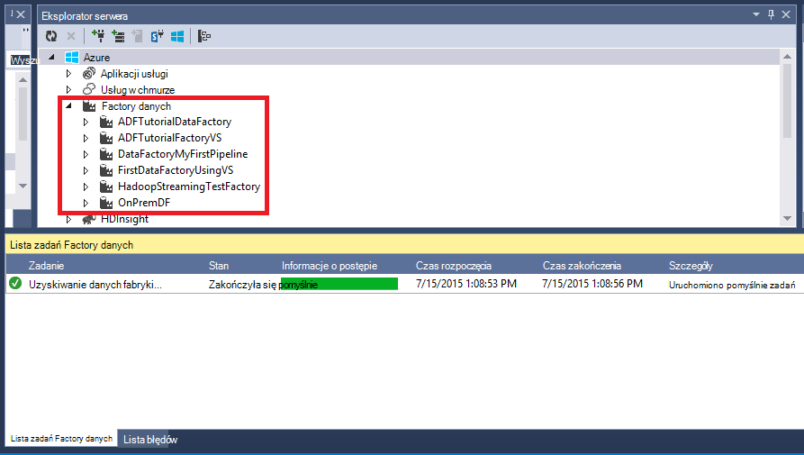

<properties 
    pageTitle="Samouczek: Tworzenie potok aktywnością kopii przy użyciu programu Visual Studio | Microsoft Azure" 
    description="W tym samouczku możesz utworzyć potok Factory danych Azure z działaniem kopii przy użyciu programu Visual Studio." 
    services="data-factory" 
    documentationCenter="" 
    authors="spelluru" 
    manager="jhubbard" 
    editor="monicar"/>

<tags 
    ms.service="data-factory" 
    ms.workload="data-services" 
    ms.tgt_pltfrm="na" 
    ms.devlang="na" 
    ms.topic="get-started-article" 
    ms.date="10/17/2016" 
    ms.author="spelluru"/>

# Samouczek: Tworzenie potok aktywnością kopii przy użyciu programu Visual Studio
> [AZURE.SELECTOR]
- [Omówienie i wymagania wstępne](data-factory-copy-data-from-azure-blob-storage-to-sql-database.md)
- [Kreator kopii](data-factory-copy-data-wizard-tutorial.md)
- [Azure portal](data-factory-copy-activity-tutorial-using-azure-portal.md)
- [Programu Visual Studio](data-factory-copy-activity-tutorial-using-visual-studio.md)
- [Programu PowerShell](data-factory-copy-activity-tutorial-using-powershell.md)
- [Azure szablonu Menedżera zasobów](data-factory-copy-activity-tutorial-using-azure-resource-manager-template.md)
- [INTERFEJSU API USŁUGI REST](data-factory-copy-activity-tutorial-using-rest-api.md)
- [INTERFEJS API PROGRAMU .NET](data-factory-copy-activity-tutorial-using-dotnet-api.md)

Ten samouczek pokazano, jak tworzyć i monitorowanie factory Azure danych przy użyciu programu Visual Studio. Planowana w factory danych użyto działaniem Kopiuj, aby skopiować dane z magazynem obiektów Blob platformy Azure do bazy danych SQL Azure.

Poniżej przedstawiono kroki, które można wykonać w ramach tego samouczka:

1. Utwórz dwie usługi połączone: **AzureStorageLinkedService1** i **AzureSqlinkedService1**. 

    AzureStorageLinkedService1 łączy Azure magazynowania i AzureSqlLinkedService1 łączy bazy danych programu Azure SQL factory danych: **ADFTutorialDataFactoryVS**. Dane wejściowe procesu znajduje się w kontenerze obiektów blob w magazynie obiektów blob platformy Azure i dane są przechowywane w tabeli w bazie danych Azure SQL. W związku z tym możesz dodać tych dwóch magazynów jako usługi połączone do fabryki danych.
2. Utwórz dwa zestawy danych: **InputDataset** i **OutputDataset**, które zawierają dane wejścia i wyjścia, które są przechowywane w magazynie danych. 

    Dla InputDataset należy określić kontener obiektów blob zawierający obiektów blob z danymi źródłowymi. Dla OutputDataset należy określić tabelę SQL, która są przechowywane dane wyjściowe. Można także określić inne właściwości, takie jak struktury, dostępność i zasad.
3. Utworzyć potok o nazwie **ADFTutorialPipeline** w ADFTutorialDataFactoryVS. 

    Proces ma kopii wprowadzania danych z Azure blob do tabeli Azure SQL wynik **Działania Kopiuj** . Działanie kopii wykonuje przenoszenia danych w Azure danych Factory. To działanie jest obsługiwany przez ogólnie dostępna usługa, która można kopiować danych między różnych magazynów w sposób bezpieczna, niezawodne i skalowalna. Zobacz artykuł [Działania przepływu danych](data-factory-data-movement-activities.md) szczegółowe informacje na temat działania Kopiuj. 
4. Tworzenie fabryki danych o nazwie **VSTutorialFactory**. Wdrażanie factory danych i wszystkich obiektów Factory dane (połączone usług, tabel i potoku).    

## Wymagania wstępne

1. Przeczytaj artykuł [Omówienie samouczka](data-factory-copy-data-from-azure-blob-storage-to-sql-database.md) i wykonaj kroki **wymagania wstępne** . 
2. Aby można było opublikować podmioty Factory danych do fabryki danych Azure, musisz być **administratorem Azure subskrypcji** .  
3. Musi być zainstalowane na komputerze następujące elementy: 
    - Visual Studio 2013 lub Visual Studio 2015 r.
    - Pobierz Azure zestaw SDK programu Visual Studio 2013 lub program Visual Studio 2015 r. Przejdź do [Strony pobierania Azure](https://azure.microsoft.com/downloads/) , a następnie kliknij przycisk **2013 w PORÓWNANIU z** lub **2015 w PORÓWNANIU z** w sekcji **.NET** .
    - Pobierz najnowszą wtyczki Azure Factory danych dla programu Visual Studio: [2013 w PORÓWNANIU z](https://visualstudiogallery.msdn.microsoft.com/754d998c-8f92-4aa7-835b-e89c8c954aa5) lub [w PORÓWNANIU z 2015 r](https://visualstudiogallery.msdn.microsoft.com/371a4cf9-0093-40fa-b7dd-be3c74f49005). Możesz także zaktualizować wtyczkę, wykonując następujące czynności: W menu kliknij pozycję **Narzędzia** -> **rozszerzenia i aktualizacje** -> **Online** -> **Galerii Visual Studio** -> **Microsoft Azure danych Factory Tools for Visual Studio** -> **aktualizacji**.

## Tworzenie projektu programu Visual Studio 
1. Uruchom program **Visual Studio 2013**. Kliknij pozycję **plik**, wskaż polecenie **Nowy**, a następnie kliknij pozycję **Projekt**. Należy wyświetlić okno dialogowe **Nowy projekt** .  
2. W oknie dialogowym **Nowy projekt** wybierz szablon **DataFactory** , a następnie kliknij pozycję **Pusty projekt Factory danych**. Jeśli nie widzisz szablonu DataFactory, zamknij program Visual Studio, instalowanie Azure SDK 2013 Visual Studio i ponownym otwarciu programu Visual Studio.  

    

3. Wprowadź **nazwę** dla projektu, **lokalizację**i nazwę **rozwiązanie**, a następnie kliknij **przycisk OK**.

     

## Tworzenie połączonych usług
Usługi połączone łącze magazynów lub obliczyć usług do fabryki Azure danych. Zobacz [obsługiwane dane są przechowywane](data-factory-data-movement-activities.md##supported-data-stores-and-formats) dla wszystkich źródeł i pochłaniacze obsługiwane przez to działanie Kopiuj. Zobacz [obliczyć połączonych usług](data-factory-compute-linked-services.md) dla listy obsługiwanych przez Factory danych usług obliczeń. W tym samouczku nie użyć dowolnej usługi obliczeń. 

W tym kroku utworzyć dwie usługi połączone: **AzureStorageLinkedService1** i **AzureSqlLinkedService1**. AzureStorageLinkedService1 połączone łącza usługi konta magazynu platformy Azure i AzureSqlLinkedService łączy bazy danych programu Azure SQL factory danych: **ADFTutorialDataFactory**. 

### Tworzenie usługi Magazyn Azure połączone

4. Kliknij prawym przyciskiem myszy **Usługi połączone** w Eksploratorze rozwiązań, wskaż pozycję **Dodaj**, a następnie kliknij przycisk **Nowy element**.      
5. W oknie dialogowym **Dodawanie nowego elementu** wybierz z listy **Usługi połączone magazyn Azure** , a następnie kliknij przycisk **Dodaj**. 

    
 
3. Zamienianie `<accountname>` i `<accountkey>`* nazwę konta magazynu platformy Azure i klucza. 

    

4. Zapisz plik **AzureStorageLinkedService1.json** .

> Aby uzyskać szczegółowe informacje o właściwościach JSON, zobacz [Przenoszenie danych z obiektów Blob platformy Azure](data-factory-azure-blob-connector.md#azure-storage-linked-service) .

### Tworzenie usługa SQL Azure połączone

5. Kliknij prawym przyciskiem myszy węzeł **Usług połączonych** w **Eksploratorze rozwiązań** ponownie, wskaż pozycję **Dodaj**, a następnie kliknij przycisk **Nowy element**. 
6. Tym razem, zaznacz **Połączone usługa SQL Azure**, a następnie kliknij przycisk **Dodaj**. 
7. W **pliku AzureSqlLinkedService1.json**Zamień `<servername>`, `<databasename>`, `<username@servername>`, i `<password>` z nazwy serwera Azure SQL, bazy danych, konto użytkownika i hasło.    
8.  Zapisz plik **AzureSqlLinkedService1.json** . 

> [AZURE.NOTE]
> Aby uzyskać szczegółowe informacje o właściwościach JSON, zobacz [Przenoszenie danych z bazy danych SQL Azure](data-factory-azure-sql-connector.md#azure-sql-linked-service-properties) .

## Tworzenie zestawów danych
W poprzednim kroku, utworzono połączonych usług **AzureStorageLinkedService1** i **AzureSqlLinkedService1** , aby połączyć konto Azure miejsca do magazynowania i baza danych Azure SQL factory danych: **ADFTutorialDataFactory**. W tym kroku zdefiniujesz dwa zestawy danych — **InputDataset** i **OutputDataset** — reprezentujących dane wejścia i wyjścia, który jest przechowywany w magazynie danych określonego przez AzureStorageLinkedService1 i AzureSqlLinkedService1 odpowiednio. Dla InputDataset należy określić kontener blob, który zawiera blob z danymi źródłowymi. Dla OutputDataset należy określić tabelę SQL, która są przechowywane dane wyjściowe.

### Tworzenie zestawu wprowadzania danych
W tym kroku utworzysz zestaw danych o nazwie **InputDataset** , która kieruje do kontenera obiektów blob w magazynie Azure reprezentowaną przez usługę **AzureStorageLinkedService1** połączone. Tabela jest prostokątnym zestawu danych i jest to jedyny typ zestawu danych obsługiwane w chwili. 

9. Kliknij prawym przyciskiem myszy **tabel** w **Eksploratorze rozwiązań**, wskaż pozycję **Dodaj**, a następnie kliknij przycisk **Nowy element**.
10. W oknie dialogowym **Dodawanie nowego elementu** zaznacz **Obiektów Blob platformy Azure**, a następnie kliknij przycisk **Dodaj**.   
10. Zastąp tekst JSON następujący tekst i Zapisz plik **AzureBlobLocation1.json** . 

        {
          "name": "InputDataset",
          "properties": {
            "structure": [
              {
                "name": "FirstName",
                "type": "String"
              },
              {
                "name": "LastName",
                "type": "String"
              }
            ],
            "type": "AzureBlob",
            "linkedServiceName": "AzureStorageLinkedService1",
            "typeProperties": {
              "folderPath": "adftutorial/",
              "format": {
                "type": "TextFormat",
                "columnDelimiter": ","
              }
            },
            "external": true,
            "availability": {
              "frequency": "Hour",
              "interval": 1
            }
          }
        }

     Zwróć uwagę następujące punkty: 
    
    - zestaw danych **typu** jest ustawiony na **AzureBlob**.
    - **linkedServiceName** jest ustawiona na **AzureStorageLinkedService**. Ta usługa połączony został utworzony w kroku 2.
    - **ścieżkafolderu** jest ustawiona na kontenerze **adftutorial** . Można również określić nazwy obiektów blob w folderze przy użyciu właściwości **Nazwa pliku** . Ponieważ nie określisz nazwę obiektu blob, dane z wszystkich obiektów blob w kontenerze jest traktowana jako danych wejściowych.  
    - Format **Typ** jest ustawiona na **TextFormat**
    - Istnieją dwa pola w pliku tekstowym — **Imię** i **nazwisko** — oddzielone znakiem przecinkami (**columnDelimiter**) 
    - **Dostępność** jest ustawiona na **co godzinę** (**Częstotliwość** jest ustawiona na **godzinę** i **interwału** jest ustawiona na **1**). Dlatego Factory danych wyszukuje dane wejściowe co godzinę w folderze głównym kontenera obiektów blob (**adftutorial**) określonej. 
    
    Jeśli nie określisz **nazwę pliku** dla zestawu danych **wejściowych** , wszystkie pliki i blob z folderu wprowadzania (**ścieżkafolderu**) są traktowane jako jako danych wejściowych. Jeśli użytkownik określi nazwę pliku w formacie JSON, tylko określony plik/obiektów blob jest traktowany jako danych wejściowych asn.
 
    Jeśli nie określisz **nazwę pliku** dla **tabeli wyników**, wygenerowane pliki w **ścieżkafolderu** są nazywane w następującym formacie: danych. &lt;Guid\&BT;. txt (przykład: Data.0a405f8a-93ff-4c6f-b3be-f69616f1df7a.txt.).

    Aby ustawić **ścieżkafolderu** i **nazwę pliku** dynamicznie na podstawie **SliceStart** czasu, należy użyć właściwości **partitionedBy** . W poniższym przykładzie ścieżkafolderu została użyta rok, miesiąc i dzień z SliceStart (godzina rozpoczęcia wycinka przetwarzane) i godzinę od SliceStart używa nazwy pliku. Na przykład wycinek jest wyprodukowane dla 2016-09-20T08:00:00, nazwa_folderu jest ustawiona na wikidatagateway-wikisampledataout-2016-09-20 i nazwę pliku jest ustawiona na 08.csv. 

            "folderPath": "wikidatagateway/wikisampledataout/{Year}/{Month}/{Day}",
            "fileName": "{Hour}.csv",
            "partitionedBy": 
            [
                { "name": "Year", "value": { "type": "DateTime", "date": "SliceStart", "format": "yyyy" } },
                { "name": "Month", "value": { "type": "DateTime", "date": "SliceStart", "format": "MM" } }, 
                { "name": "Day", "value": { "type": "DateTime", "date": "SliceStart", "format": "dd" } }, 
                { "name": "Hour", "value": { "type": "DateTime", "date": "SliceStart", "format": "hh" } } 

> [AZURE.NOTE]
> Aby uzyskać szczegółowe informacje o właściwościach JSON, zobacz [Przenoszenie danych z obiektów Blob platformy Azure](data-factory-azure-blob-connector.md#azure-blob-dataset-type-properties) .

### Tworzenie zestawu danych wyjściowych danych
W tym kroku utworzysz zestaw danych wyjściowych o nazwie **OutputDataset**. Punktów tego zestawu danych do tabeli programu SQL w bazie danych Azure SQL reprezentowany przez **AzureSqlLinkedService1**. 

11. Ponownie kliknij prawym przyciskiem myszy **tabel** w **Eksploratorze rozwiązań** , wskaż pozycję **Dodaj**, a następnie kliknij przycisk **Nowy element**.
12. W oknie dialogowym **Dodawanie nowego elementu** zaznacz **Azure SQL**, a następnie kliknij przycisk **Dodaj**. 
13. Zastąp tekst JSON następujące JSON i Zapisz plik **AzureSqlTableLocation1.json** .

        {
          "name": "OutputDataset",
          "properties": {
            "structure": [
              {
                "name": "FirstName",
                "type": "String"
              },
              {
                "name": "LastName",
                "type": "String"
              }
            ],
            "type": "AzureSqlTable",
            "linkedServiceName": "AzureSqlLinkedService1",
            "typeProperties": {
              "tableName": "emp"
            },
            "availability": {
              "frequency": "Hour",
              "interval": 1
            }
          }
        }

     Zwróć uwagę następujące punkty: 
    
    - zestaw danych **typu** jest ustawiony na **AzureSQLTable**.
    - **linkedServiceName** jest ustawiona na **AzureSqlLinkedService** (utworzonej tej usługi połączone w kroku 2).
    - **TableName** jest ustawiona na **emp**.
    - Istnieją trzy kolumny — **identyfikator**, **pole Imię**i **nazwisko** — w tabeli emp w bazie danych. Identyfikator jest kolumną tożsamości, więc należy określić tylko **Imię** i **nazwisko** w tym miejscu.
    - **Dostępność** jest ustawiona na **co godzinę** (**Częstotliwość** **godzinę** i **interwału** równa **1**).  Usługa danych Factory generuje wycinek dane wyjściowe co godzinę w tabeli **emp** w bazie danych Azure SQL.

> [AZURE.NOTE]
> Aby uzyskać szczegółowe informacje o właściwościach JSON, zobacz [Przenoszenie danych z bazy danych SQL Azure](data-factory-azure-sql-connector.md#azure-sql-linked-service-properties) .

## Tworzenie procesu 
Utworzono usługi połączone wejścia i wyjścia i tabele pory. Teraz utworzyć potok z **Aktywności Kopiuj** do skopiowania danych z Azure blob bazą danych Azure SQL. 

1. Kliknij prawym przyciskiem myszy **procesy** w **Eksploratorze rozwiązań**, wskaż pozycję **Dodaj**, a następnie kliknij przycisk **Nowy element**.  
15. Wybierz pozycję **Kopiuj planowana danych** w oknie dialogowym **Dodawanie nowego elementu** , a następnie kliknij przycisk **Dodaj**. 
16. Zamień JSON następujące JSON i Zapisz plik **CopyActivity1.json** .
            
        {
          "name": "ADFTutorialPipeline",
          "properties": {
            "description": "Copy data from a blob to Azure SQL table",
            "activities": [
              {
                "name": "CopyFromBlobToSQL",
                "type": "Copy",
                "inputs": [
                  {
                    "name": "InputDataset"
                  }
                ],
                "outputs": [
                  {
                    "name": "OutputDataset"
                  }
                ],
                "typeProperties": {
                  "source": {
                    "type": "BlobSource"
                  },
                  "sink": {
                    "type": "SqlSink",
                    "writeBatchSize": 10000,
                    "writeBatchTimeout": "60:00:00"
                  }
                },
                "Policy": {
                  "concurrency": 1,
                  "executionPriorityOrder": "NewestFirst",
                  "style": "StartOfInterval",
                  "retry": 0,
                  "timeout": "01:00:00"
                }
              }
            ],
            "start": "2015-07-12T00:00:00Z",
            "end": "2015-07-13T00:00:00Z",
            "isPaused": false
          }
        }

    Zwróć uwagę następujące punkty:

    - W sekcji działania istnieje tylko jedno działanie, którego **Typ** jest ustawiona na **kopii**.
    - Danych wejściowych dla działania jest ustawiona na **InputDataset** , a wynik działania jest ustawiona na **OutputDataset**.
    - W sekcji **typeProperties** **BlobSource** jest określony jako typ źródła i **SqlSink** jest określony jako typ sink.

    Wartość właściwości **rozpocząć** należy zastąpić bieżącą wartość dnia i **zakończenia** z następnego dnia. Można określić tylko część daty i pominąć czasu część czasu daty. Na przykład "2016-02-03", który jest odpowiednikiem "2016-02-03T00:00:00Z"
    
    Oba Uruchom i dat zakończenia musi być w [formacie ISO](http://en.wikipedia.org/wiki/ISO_8601). Na przykład: 2016-10-14T16:32:41Z. Czas **zakończenia** jest opcjonalne, ale firma Microsoft korzysta w tym samouczku. 
    
    Jeśli nie określisz wartości dla właściwości **zakończenia** , jest obliczana jako "**start + 48 godzin**". Aby uruchomić proces czas nieokreślony, określ **9999-09-09** jako wartość właściwości **zakończenia** .
    
    W powyższym przykładzie istnieje 24 fragmenty danych podczas każdego wycinek powstaje co godzinę.

## Publikowanie i wdrażanie podmioty Factory danych
W tym kroku możesz opublikować podmioty Factory dane (połączone usług, zestawy danych i planowana) został utworzony wcześniej. Możesz również Określ nazwę nowego fabryki danych ma zostać utworzony do przechowywania tych obiektów.  

18. Kliknij prawym przyciskiem myszy projektu w Eksploratorze rozwiązań, a następnie kliknij pozycję **Publikuj**. 
19. Jeśli zostanie wyświetlone okno dialogowe **Zaloguj się do swojego konta Microsoft** , wprowadź poświadczenia konta, które ma Azure subskrypcję, a następnie kliknij przycisk **Zaloguj**.
20. Powinien zostać wyświetlony następujące okno dialogowe:

    
21. Na stronie Konfigurowanie factory danych wykonaj następujące czynności: 
    1. Wybierz opcję **Utwórz nowy Factory danych** .
    2. Wprowadź **nazwę** **VSTutorialFactory** .  
    
        > [AZURE.IMPORTANT]  
        > Nazwa fabryki Azure danych musi być globalnie unikatowa. Jeśli zostanie wyświetlony komunikat o błędzie o nazwie fabryki danych podczas publikowania, Zmień nazwę factory danych (na przykład yournameVSTutorialFactory) i spróbuj ponownie opublikować. Temat [Danych Factory - reguł nazewnictwa](data-factory-naming-rules.md) dla reguł nazewnictwa artefakty Factory danych.     
    3. Wybierz subskrypcję Azure w polu **subskrypcji** .
     
        > [AZURE.IMPORTANT]Jeśli nie widzisz żadnej subskrypcji, upewnij się, zalogowany przy użyciu konta administratora lub administratorami co subskrypcji.  
    4. Wybierz **Grupa zasobów** dla factory danych ma zostać utworzony. 5. Wybierz pozycję **region** factory danych. Tylko regiony obsługiwane przez usługę Factory danych są wyświetlane na liście rozwijanej.
6. Kliknij przycisk **Dalej** , aby przejść na stronę **Publikowanie elementów** .
    
           
23. Na stronie **Publikowanie elementów** upewnij się, że wszystkie fabryki danych jednostki są zaznaczone, a następnie kliknij przycisk **Dalej** , aby przejść na stronę **podsumowania** .
    
         
24. Zapoznaj się z podsumowaniem i kliknij przycisk **Dalej** uruchomienie procesu wdrażania i wyświetlanie **Stanu rozmieszczania**.

    
25. Na stronie **Stanu rozmieszczania** powinna być widoczna stan procesu wdrażania. Po zakończeniu rozmieszczania, kliknij przycisk Zakończ. 
     Zwróć uwagę następujące punkty: 

- Jeśli zostanie wyświetlony komunikat o błędzie: "**tej subskrypcji nie została zarejestrowana jako nazw Microsoft.DataFactory**", wykonaj jedną z następujących czynności, a następnie ponownie spróbuj opublikować: 

    - W programie PowerShell Azure uruchom następujące polecenie, aby zarejestrować dostawcy danych Factory. 
        
            Register-AzureRmResourceProvider -ProviderNamespace Microsoft.DataFactory
    
        Można uruchomić następujące polecenie, aby potwierdzić, że Factory danych dostawca jest zarejestrowany. 
    
            Get-AzureRmResourceProvider
    - Zaloguj się przy użyciu Azure subskrypcji do [Azure portal](https://portal.azure.com) i przejdź do strony karta Factory danych (lub) tworzenie factory danych w portalu Azure. Ta akcja automatycznie rejestruje dostawcy dla Ciebie.
-   Nazwa fabryki danych może być zarejestrowany jako nazwę DNS w przyszłości i w związku z tym stają się publicznie widoczne.

> [AZURE.IMPORTANT] Aby utworzyć wystąpienia Factory danych, musisz być administrator co administratora usługi Azure subskrypcji

## Podsumowanie
W tym samouczku utworzono factory Azure danych, aby skopiować dane z Azure blob z bazą danych programu Azure SQL. Visual Studio umożliwia tworzenie factory danych, usługi połączone, zestawy danych i potok. Poniżej przedstawiono czynności wysokiego poziomu, które można wykonać w tym samouczku:  

1.  Utworzony Azure **factory danych**.
2.  Tworzone **połączonych usług**:
    1. Usługi **Magazyn Azure** połączone, aby połączyć swoje konto Azure miejsca do magazynowania, który zawiera dane wejściowe.    
    2. Usługa **Azure SQL** połączone do połączenia z bazą danych Azure SQL zawiera dane wyjściowe. 
3.  Tworzone **zestawy danych**, które opisują dane wejściowe i wyjściowe dane procesy.
4.  Tworzone **Planowana** **Aktywności Kopiuj** z **BlobSource** źródła i **SqlSink** jako sink. 

## Wyświetlanie fabryki danych przy użyciu Eksploratora serwera

1. W **Programie Visual Studio**kliknij menu **Widok** , a następnie kliknij **Server Explorer**.
2. W oknie Eksplorator Server rozwiń **Azure** i rozwiń **Factory danych**. Jeśli zobaczysz, **Zaloguj się do programu Visual Studio**, wprowadź **konta** skojarzonego z subskrypcją usługi Azure i kliknij przycisk **Kontynuuj**. Wprowadź **hasło**, a następnie kliknij przycisk **Zaloguj**. Program Visual Studio próbuje uzyskać informacje na temat wszystkich fabryki Azure danych w ramach subskrypcji. Zobacz stan tej operacji w oknie **Lista zadań Factory danych** .
    
3. Kliknij prawym przyciskiem myszy factory danych i wybierz pozycję Eksportuj Factory danych do nowego projektu, aby utworzyć projekt programu Visual Studio, oparte na istniejące factory danych.
      

## Aktualizowanie narzędzia Factory danych dla programu Visual Studio
Aby zaktualizować narzędzia Factory danych Azure programu Visual Studio, wykonaj następujące czynności:

1. W menu kliknij pozycję **Narzędzia** i wybierz **rozszerzenia i aktualizacje**. 
2. W okienku po lewej stronie wybierz **aktualizacje** , a następnie wybierz pozycję **Galerii Visual Studio**.
4. Wybierz pozycję **narzędzia Factory danych Azure programu Visual Studio** , a następnie kliknij przycisk **Aktualizuj**. Jeśli nie widzisz ten wpis, masz już najnowszą wersję narzędzia. 

Aby uzyskać instrukcje dotyczące monitorowanie planowanej i zestawy danych za pomocą portalu Azure utworzonej w tym samouczku, zobacz [Monitorowanie zestawy danych i planowana](data-factory-copy-activity-tutorial-using-azure-portal.md#monitor-pipeline) .

## Zobacz też
| Temat | Opis |
| :---- | :---- |
| [Działania przepływu danych](data-factory-data-movement-activities.md) | Ten artykuł zawiera szczegółowe informacje na temat działania kopii używanych w samouczku. |
| [Planowanie i wykonywanie](data-factory-scheduling-and-execution.md) | W tym artykule wyjaśniono, planowania i wykonanie aspektów model aplikacji Azure danych Factory. |
| [Procesy](data-factory-create-pipelines.md) | Ten artykuł ułatwia zrozumienie potoki i działania w Factory danych Azure |
| [Zestawy danych](data-factory-create-datasets.md) | Ten artykuł ułatwia zrozumienie zestawów danych w Azure danych Factory.
| [Monitorowanie i zarządzanie nimi procesy przy użyciu aplikacji monitorowania](data-factory-monitor-manage-app.md) | W tym artykule opisano, jak można monitorować, zarządzanie i debugowanie procesy za pomocą monitorowania i zarządzania aplikacji. 
