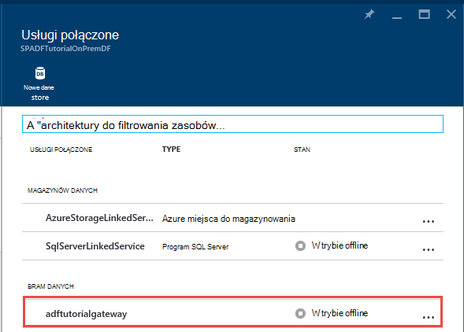

<properties 
    pageTitle="Brama zarządzania danymi dla danych Factory | Microsoft Azure"
    description="Konfigurowanie bramy danymi przenoszenie danych między lokalnym a chmurą. Przenoszenie danych za pomocą bramy zarządzania danymi w Azure danych Factory." 
    services="data-factory" 
    documentationCenter="" 
    authors="linda33wj" 
    manager="jhubbard" 
    editor="monicar"/>

<tags 
    ms.service="data-factory" 
    ms.workload="data-services" 
    ms.tgt_pltfrm="na" 
    ms.devlang="na" 
    ms.topic="article" 
    ms.date="10/11/2016" 
    ms.author="jingwang"/>

# Brama zarządzania danymi
Brama zarządzania danymi jest agenta klienta, którą należy zainstalować w środowisku lokalnym, aby skopiować danych między chmury i lokalny magazynów danych. Magazynów lokalnego obsługiwanych przez Factory dane znajdują się w sekcji [źródła danych obsługiwane](data-factory-data-movement-activities.md##supported-data-stores) . 

> [AZURE.NOTE] Obecnie bramy obsługuje tylko Kopiuj aktywności i procedura składowana aktywności w Factory danych. Nie istnieje możliwość dostępu do lokalnych źródeł danych za pomocą bramy z niestandardowym działaniem. 

W tym artykule uzupełnia instruktaż w [Przenoszenie danych między wdrożeniem lokalnym a chmurą magazynów](data-factory-move-data-between-onprem-and-cloud.md) artykuł. W Instruktaż możesz utworzyć potok używa bramy, aby przenieść dane z bazy danych programu SQL Server lokalnego obiektów blob platformy Azure. Ten artykuł zawiera szczegółowe szczegółowe informacje na temat bramy zarządzania danymi.   

## Omówienie

### Możliwości bramy zarządzania danymi
Brama zarządzania danymi zapewnia następujące możliwości:

- Wzór lokalnych źródeł danych i źródeł danych w ramach tej samej fabryki danych w chmurze i przenoszenie danych.
- Mają pojedynczy okienko szkła monitorowania i zarządzania z wgląd stan bramy z karta Factory danych.
- Zarządzanie bezpiecznego dostępu do lokalnych źródeł danych.
    - Brak zmian wymaganych do zaporę firmową. Brama tylko sprawia, że ruchu wychodzącego połączenia oparte na HTTP, aby otworzyć internetowe.
    - Szyfrowania poświadczeń lokalnych sklepach danych przy użyciu certyfikatu.
- Wydajne przenoszenie danych — dane są przekazywane równolegle, ponawiania sieci mechanizm do przejściowymi problemami z automatycznego.

### Polecenia i przepływ danych
Podczas kopiowania danych między wdrożeniem lokalnym a chmurą za pomocą działaniem kopiowanie działanie używa bramy do przenoszenia danych z lokalnego źródła danych do chmury i na odwrót.

Tutaj danych wysokiego poziomu przepływ uwierzytelniania i podsumowanie kroków kopii bramy danych: 

1.  Deweloper danych tworzy bramy dla Factory danych Azure za pomocą [Azure portal](https://portal.azure.com) lub [Polecenia Cmdlet programu PowerShell](https://msdn.microsoft.com/library/dn820234.aspx). 
2.  Deweloper danych tworzy powiązanych z magazynu danych lokalnych, określając bramy. Podczas konfigurowania usługi połączone Deweloper danych używa aplikacji ustawić poświadczenia, aby określić typy uwierzytelniania i poświadczenia.  Okno dialogowe Ustawianie poświadczeń aplikacji komunikuje się z magazynu danych, aby przetestować bramy, aby zapisać poświadczenia i połączenia.
3. Brama są szyfrowane poświadczenia z certyfikat skojarzony z bramy (dostarczany przez dewelopera danych), przed zapisaniem poświadczeń w chmurze.
4. Usługi danych Factory komunikuje się z bramy dla planowania i zarządzania zadaniami za pośrednictwem kanału kontroli, która korzysta z usługi Azure udostępnionej kolejki bus. Jeśli zadanie działania kopii musi być kopać, Factory danych kolejek żądanie wraz z informacjami o poświadczeniach. Brama jest uruchamiane poza zadania po sondowanie kolejki.
5.  Brama odszyfrowuje poświadczenia z tego samego certyfikatu i połączy się lokalnego magazynu danych przy użyciu poświadczeń i typ uwierzytelniania pisane z wielkiej litery.
6.  Brama kopiuje dane z magazynu lokalnego magazynu w chmurze, lub odwrotnie w zależności od konfiguracji aktywności kopii w potoku danych. W tym kroku bramy komunikuje się bezpośrednio z usług w chmurze, takich jak magazyn obiektów Blob platformy Azure na bezpiecznego kanału (HTTPS).

### Zagadnienia dotyczące korzystania z bramy
- Jedno wystąpienie brama zarządzania danymi może służyć do wielu lokalnych źródeł danych. Jednak **w przypadku wystąpienia pojedyncza brama jest powiązane tylko jeden factory Azure danych** i nie mogą być udostępniane innym factory danych.
- Możesz mieć **tylko jedno wystąpienie bramy zarządzania danymi** zainstalowane na jednym komputerze. Załóżmy, masz dwie fabryki danych, które potrzebują dostępu do lokalnych źródeł danych, należy zainstalować bram na dwóch komputerach lokalnego. Innymi słowy brama jest powiązane factory określonych danych
- **Brama nie musi znajdować się na tym samym komputerze jako źródła danych**. Jednak o bliżej bramy w źródle danych skraca czas bramy połączyć się ze źródłem danych. Zaleca się zainstalowanie bramy na komputerze, który różni się od tej, która obsługuje lokalnego źródła danych. Gdy bramy i źródła danych na różnych komputerach, bramy nie współzawodniczenia dla zasobów ze źródłem danych.
- Możesz mieć **wielu bram na różnych komputerach połączenie do tego samego lokalne źródło danych**. Na przykład masz dwie bramy serwowania dwie fabryki danych, ale tym samym lokalne źródło danych jest zarejestrowany fabryki danych.
- Jeśli masz już zainstalowany na Twoim komputerze serwowania scenariusz **Power BI** bramy, zainstaluj **osobnych bramy Factory danych Azure** na innym komputerze.
- Nawet wtedy, gdy używasz **ExpressRoute**należy użyć bramy.
- Potraktuj źródła danych jako lokalnego źródła danych (który znajduje się za zaporą) nawet podczas używania **ExpressRoute**. Za pomocą bramy ustanowić połączenie między usługą i źródła danych.
- Należy **używać bramy** , nawet wtedy, gdy do przechowywania danych w chmurze na **Maszyn wirtualnych IaaS Azure**. 

## Instalacji

### Wymagania wstępne
- Obsługiwane wersje **systemu operacyjnego** to systemu Windows 7, Windows 8/8.1, Windows 10, Windows Server 2008 R2, Windows Server 2012, Windows Server 2012 R2. Instalacja bramy zarządzania danymi na kontrolerze domeny nie jest obecnie obsługiwana.
- .NET framework 4.5.1 lub powyżej jest wymagane. Jeśli instalujesz bramy na komputerze z systemem Windows 7, należy zainstalować .NET Framework 4,5 lub nowszy. Aby uzyskać szczegółowe informacje, zobacz [Wymagania systemowe programu .NET Framework](https://msdn.microsoft.com/library/8z6watww.aspx) . 
- Zalecana **Konfiguracja** komputera bramy jest co najmniej 2 GHz, 4 rdzenie 8 GB pamięci RAM i dysk 80 GB.
- Jeśli na komputerze obsługującym w stan hibernacji, bramy nie odpowiadać na żądania danych. W związku z tym należy skonfigurować odpowiedni **plan zasilania** na komputerze, przed zainstalowaniem bramy. Jeśli komputer jest skonfigurowany do hibernacji, instalacja bramy jest wyświetlany monit wiadomości.
- Musi być administratorem na komputerze, aby zainstalować i skonfigurować bramę zarządzania danymi pomyślnie. Możesz dodać dodatkowych użytkowników do lokalnej grupy **Użytkowników bramy zarządzania danymi** w systemie Windows. Członkowie tej grupy mogą korzystać z narzędzia Menedżer konfiguracji bramy zarządzania danymi, aby skonfigurować bramę. 

Jak działa aktywności kopii związanej określonych częstotliwości, użycie zasobów (Procesora, pamięci) na komputerze również zgodny ze wzorcem samej z Szczyt i czasu bezczynności. Wykorzystanie zasobów zależy również intensywnie ilość danych jest przenoszony. W przypadku wielu zadań kopiowania w toku, zobacz przejść o czasie Szczyt użycie zasobu. 

### Opcje instalacji
Może być zainstalowana brama zarządzania danymi w następujący sposób: 

- Pobierając MSI Instalator pakietu z [Centrum pobierania Microsoft](https://www.microsoft.com/download/details.aspx?id=39717).  Plik MSI można także uaktualnić istniejące brama zarządzania danymi do najnowszej wersji z wszystkimi ustawieniami zachowywane.
- Klikając łącze **Pobierz i zainstaluj bramy danych** w obszarze ustawienia ręcznie lub **zainstalować bezpośrednio na tym komputerze** , w obszarze Ustawienia EXPRESS. Zobacz [Przenoszenie danych między wdrożeniem lokalnym a chmurą](data-factory-move-data-between-onprem-and-cloud.md) artykuł instrukcje krok po kroku na temat korzystania z express konfiguracji. Ręczne krok umożliwia przejście do Centrum pobierania.  Instrukcje dotyczące pobraniu i zainstalowaniu bramy w Centrum pobierania znajdują się w następnej sekcji. 

### Najważniejsze wskazówki dotyczące instalacji:
1.  Plan zasilania na komputerze hosta bramy tak skonfigurować program nie hibernacji komputera. Jeśli na komputerze obsługującym w stan hibernacji, bramy nie odpowiadać na żądania danych.
2.  Wykonaj kopię zapasową certyfikat skojarzony z bramy.

### Instalowanie bramy w Centrum pobierania
1. Przejdź do [strony pobierania bramy zarządzania danymi firmy Microsoft](https://www.microsoft.com/download/details.aspx?id=39717). 
2. Kliknij przycisk **Pobierz**, wybierz odpowiednią wersję (**32-bitowa** a **64-bitowa**), a następnie kliknij przycisk **Dalej**. 
3. Uruchom **Instalatora MSI** bezpośrednio lub zapisz go na dysku twardym i uruchom.
4. Na stronie **powitalnej** wybierz **język** kliknij przycisk **Dalej**.
5. **Zaakceptuj** umowę licencyjną użytkownika i kliknij przycisk **Dalej**. 
6. Wybierz **folder** , aby zainstalować bramę, a następnie kliknij przycisk **Dalej**. 
7. Na stronie **gotowy do instalacji** kliknij przycisk **Zainstaluj**. 
8. Kliknij przycisk **Zakończ** , aby ukończyć instalację.
9. Uzyskaj klucz z portalu Azure. W następnej sekcji instrukcje krok po kroku. 
10. Na stronie **rejestrować bramę** **Menedżer konfiguracji bramy zarządzania danymi** na komputerze wykonaj następujące czynności: 
    1. Wklej klucz w tekście.
    2. Opcjonalnie kliknij pozycję **Pokaż klucza bramy** , aby wyświetlić tekst klucza.
    3. Kliknij przycisk **Zarejestruj**. 

### Rejestrować bramę przy użyciu klucza

#### Jeśli jeszcze nie utworzono logiczne bramy w portalu
Aby utworzyć bramę w portalu i uzyskać klucz z karta **Konfigurowanie** , wykonaj kroki od instruktaż zawiera artykuł [Przenoszenie danych między wdrożeniem lokalnym a chmurą](data-factory-move-data-between-onprem-and-cloud.md) .    

#### Jeśli utworzono już logiczne bramy w portalu
1. W portalu Azure przejdź do karta **Factory danych** i kliknij Kafelek **Usługi połączone** .

    
2. W karta **Usługi połączone** wybierz logiczne **bramy** utworzony w portalu. 

      
2. W karta **Bramy danych** kliknij przycisk **Pobierz i zainstaluj bramy danych**.

       
3. Karta **Konfigurowanie** kliknij **odtworzenia klucza**. Kliknij przycisk Tak w komunikacie ostrzegawczym dotyczącym po przeczytaniu go dokładnie.

    
4. Kliknij przycisk Kopiuj obok klawisza. Klucz jest kopiowana do Schowka.
    
     

### Ikony paska zadań systemu i powiadomienia
Na poniższej ilustracji przedstawiono niektóre ikony paska zadań, które są wyświetlane. 

Jeśli umieszczeniu kursora na system obszar powiadomień ikony-powiadomienie zostanie wyświetlone szczegółowe informacje o stanie operacji bramy i aktualizacji w oknie podręcznym.

### Porty i zapory
Istnieją dwa zapory należy wziąć pod uwagę: **zaporę firmową** uruchomione na centralnej router organizacji i **zapory systemu Windows** skonfigurowanego jako demon na komputerze lokalnym, miejsce, w którym jest zainstalowana brama.  

Na poziomie zaporę musi skonfigurować następujące domeny i porty wyjściowe:

| Nazwy domen | Porty | Opis |
| ------ | --------- | ------------ |
| *. servicebus.windows.net | 443, 80 | Detektory na usługę Bus przekazywania przez TCP (wymaga 443 uzyskania tokenu kontrola dostępu) | 
| *. servicebus.windows.net | 5671 9350 9354, | Usługa opcjonalna bus przekazywania przez TCP | 
| *. core.windows.net | 443 | PROTOKÓŁ HTTPS | 
| *. clouddatahub.net | 443 | PROTOKÓŁ HTTPS | 
| Graph.Windows.NET | 443 | PROTOKÓŁ HTTPS |
| Login.Windows.NET | 443 | PROTOKÓŁ HTTPS | 

Na poziomie zapory systemu windows następujące porty wyjściowe zwykle są włączone. Jeśli nie można skonfigurować domeny i porty odpowiednio na komputerze bramy.

#### Kopiowanie danych z magazynu danych źródłowych do magazynu danych sink

Zapewnić reguły zapory są prawidłowo włączone zaporę firmową Zapora systemu Windows na komputerze bramy i dane przechowywane się. Włączenie tych reguł umożliwia bramy nawiązać połączenie z obu źródeł i zlew pomyślnie. Włącz reguły dla każdego sklepu danych biorących udział w operacji kopiowania.

Na przykład aby skopiować z **lokalnego magazynu danych do bazy danych SQL Azure zlew lub magazynu danych SQL Azure zlew**, wykonaj następujące czynności: 

- Zezwalanie komunikacji wychodzącej **TCP** na porcie **1433** zarówno Zapora systemu Windows i zaporę firmową
- Konfigurowanie ustawień zapory serwera Azure SQL, aby dodać adres IP komputera bramy do listy dozwolonych adresów IP. 

### Zagadnienia dotyczące serwera proxy
Jeśli firmie sieć korzysta z serwera proxy, aby uzyskać dostęp do Internetu, należy skonfigurować bramę zarządzania danymi umożliwia odpowiednie ustawienia serwera proxy. Serwer proxy można ustawić w fazie pierwszej rejestracji. 

Brama łączy do usługi w chmurze za pośrednictwem serwera proxy. Kliknij łącze **Zmień** podczas początkowej konfiguracji. Pojawi się okno dialogowe **Ustawienia serwera proxy** .

Dostępne są trzy opcje konfiguracji: 

- **Nie używaj serwera proxy**: bramy nie jawnie za pomocą dowolnego serwera proxy nawiązywania połączenia z usługami w chmurze.
- **Użyj systemu proxy**: ustawienia serwera proxy skonfigurowane w diahost.exe.config korzysta z bramy.  Jeśli serwer proxy nie jest skonfigurowany w diahost.exe.config, bramy łączy do usługi w chmurze bezpośrednio, bez pośrednictwa serwera proxy.
- **Użyj niestandardowych serwera proxy**: konfigurowanie ustawienia służących do bramy, zamiast w diahost.exe.config przy użyciu konfiguracji serwera proxy HTTP.  Adres i Port są wymagane.  Nazwa użytkownika i hasło są opcjonalne w zależności od ustawienia uwierzytelniania serwer proxy.  Wszystkie ustawienia są szyfrowane przy użyciu certyfikatu poświadczeń bramy i zgromadzone na komputerze obsługującym bramę.

Usługa hosta bramy zarządzania danymi automatycznie uruchamia ponownie po zapisaniu zaktualizowane ustawienia serwera proxy. 

Po bramy został pomyślnie zarejestrowany, jeśli chcesz wyświetlić lub zaktualizować ustawienia serwera proxy, za pomocą Menedżer konfiguracji bramy zarządzania danymi. 

1. Uruchom program Menedżer konfiguracji bramy zarządzania danymi.
2. Przejdź na kartę **Ustawienia** .
3. Kliknij łącze **Zmień** w sekcji **Serwer HTTP Proxy** , aby Uruchom okno dialogowe **Ustawianie serwer Proxy HTTP** .  
4. Po kliknięciu przycisku **Dalej** , pojawi się okno dialogowe z ostrzeżeniem monitem o Twojej zgody zapisać ustawienia serwera proxy i ponowne uruchomienie usługi hosta bramy.

Można przeglądać i aktualizować serwer proxy HTTP za pomocą narzędzia Menedżer konfiguracji. 

> [AZURE.NOTE] Po skonfigurowaniu serwera proxy z uwierzytelnianiem NTLM usługi hosta bramy uruchamiana konta domeny. Jeśli zmienisz hasło konta domeny w dalszej części, pamiętaj, aby zaktualizować ustawienia konfiguracji dla usługi i odpowiednio uruchom go ponownie. Ze względu na to wymaganie zaleca się, że używasz konta domeny dedykowane do dostępu do serwera proxy, które nie wymagają często zaktualizuj hasło.

### Konfigurowanie ustawień serwera proxy w diahost.exe.config
Po wybraniu ustawienia serwera proxy HTTP **serwera proxy systemu użyj** brama używa ustawienia w diahost.exe.config serwera proxy.  Jeśli w diahost.exe.config określono bez serwera proxy, bramy łączy do usługi w chmurze bezpośrednio, bez pośrednictwa serwera proxy. Poniższa procedura zawiera instrukcje dotyczące aktualizowania pliku konfiguracji. 

1.  W Eksploratorze plików kopię bezpiecznych C:\Program Files\Microsoft danych zarządzania Gateway\2.0\Shared\diahost.exe.config do tworzenia kopii zapasowych oryginalny plik.
2.  Uruchamianie Notepad.exe działającego jako administrator i Otwórz plik tekstowy "C:\Program Files\Microsoft danych zarządzania Gateway\2.0\Shared\diahost.exe.config. Domyślny znacznik możesz znaleźć dla system.net, jak pokazano w poniższym kodzie:

            <system.net>
                <defaultProxy useDefaultCredentials="true" />
            </system.net>   

    Następnie można dodać szczegóły serwera proxy, jak pokazano w poniższym przykładzie:

            <system.net>
                  <defaultProxy enabled="true">
                        <proxy bypassonlocal="true" proxyaddress="http://proxy.domain.org:8888/" />
                  </defaultProxy>
            </system.net>

    Dodatkowe właściwości mogą wewnątrz znacznika serwera proxy określ wymagane ustawienia, takie jak scriptLocation. Zapoznaj się z [serwera proxy elementu (ustawień sieci)](https://msdn.microsoft.com/library/sa91de1e.aspx) na składni.

            <proxy autoDetect="true|false|unspecified" bypassonlocal="true|false|unspecified" proxyaddress="uriString" scriptLocation="uriString" usesystemdefault="true|false|unspecified "/>

3. Zapisz plik konfiguracji w pierwotnej lokalizacji, a następnie ponowne uruchomienie usługi hosta bramy zarządzania danymi, która przejmuje zmiany. Aby ponownie uruchomić usługę: za pomocą apletu usługi w Panelu sterowania lub **Menedżer konfiguracji bramy zarządzania danymi** > kliknij przycisk **Zatrzymaj usługę** , a następnie kliknij przycisk **Uruchom usługę**. Jeśli nie można uruchomić usługi, prawdopodobnie czy nieprawidłowa składnia tag XML został dodany do pliku konfiguracji aplikacji, które było edytowane.     

Oprócz punkty trzeba również upewnij się, że jest listy sprawdzonej firmy Microsoft Azure. Na liście prawidłowych adresów IP Azure firmy Microsoft można pobrać z [Centrum pobierania Microsoft](https://www.microsoft.com/download/details.aspx?id=41653).

#### Możliwe objawy zapory i serwera proxy sprawach związanych z serwera
Jeśli wystąpią błędy podobne do nich następujące, prawdopodobnie z powodu nieprawidłowa konfiguracja zapory lub serwera proxy, która blokuje połączenie bramy z w Factory danych w celu uwierzytelnienia bramy. Zapoznaj się z poprzedniej sekcji, aby upewnić się, zapory i serwera proxy są poprawnie skonfigurowane.

1.  Podczas próby zarejestrowania bramy jest wyświetlany następujący komunikat o błędzie: "nie można zarejestrować klucza bramy. Przed próbą ponownie zarejestrować klucza bramy, upewnij się, że brama zarządzania danymi jest w stanie połączenia i zostanie uruchomiona usługa hosta bramy zarządzania danymi."
2.  Po otwarciu Menedżera konfiguracji, zobacz stan jako "Rozłączono" lub "Łączenie". Podczas wyświetlania dzienniki zdarzeń systemu Windows, w obszarze "Podgląd zdarzeń" > "Aplikacji i usług dzienniki" > "Bramy zarządzania danymi", zostanie wyświetlony komunikat o błędzie, taki jak następujący komunikat o błędzie:`Unable to connect to the remote server` 
    `A component of Data Management Gateway has become unresponsive and restarts automatically. Component name: Gateway.`

### Otwórz port 8050 na potrzeby szyfrowania poświadczeń 
Użycie aplikacji **Poświadczeń ustawienie** portu wejściowego **8050** do przekazywania poświadczeń do bramy, podczas konfigurowania lokalnego połączone usługi w portalu Azure. Podczas konfigurowania bramy domyślnie instalacja bramy zarządzania danymi powoduje otwarcie go na komputerze bramy.
 
Jeśli korzystasz z zapory innych firm, możesz ręcznie otworzyć port 8050. Jeśli napotkasz problem zapory podczas konfiguracji bramy, możesz spróbować zainstalować bramę bez Konfigurowanie zapory za pomocą następującego polecenia.

    msiexec /q /i DataManagementGateway.msi NOFIREWALL=1

Jeśli nie chcesz otworzyć port 8050 na komputerze bramy, za pomocą mechanizmy niż Konfigurowanie poświadczeń magazynu danych za pomocą aplikacji **Ustawić poświadczenia** . Na przykład można użyć polecenia cmdlet programu PowerShell [AzureRmDataFactoryEncryptValue nowy](https://msdn.microsoft.com/library/mt603802.aspx) . Zobacz zestawu sekcji [ustawić poświadczenia i zabezpieczeń](#set-credentials-and-securityy) na jak danych przechowywanie poświadczeń.

## Aktualizacja 
Domyślnie bramy zarządzania danymi jest automatycznie aktualizowana, gdy jest dostępna nowsza wersja bramy. Bramy nie są aktualizowane, dopóki zaplanowanych zadań są wykonywane. Żadne następne zadania są przetwarzane przez bramę, dopóki nie zakończy się operacji aktualizacji. Jeśli aktualizacja, bramy przywróceniu starszej wersji. 

Pojawi się podczas zaplanowanej aktualizacji w następujących miejscach:

- Karta właściwości bramy w portalu Azure.
- Strona główna z danych Menedżer konfiguracji bramy zarządzania
- Wiadomość z powiadomieniem o obszar powiadomień systemu. 

Na karcie Narzędzia główne z danych Menedżer konfiguracji bramy zarządzania jest wyświetlany harmonogram aktualizacji i ostatniego brama została zainstalowana aktualizacja. 

Możesz od razu zainstalować aktualizację lub poczekaj, aż bramę do automatycznie zaktualizowana zgodnie z harmonogramem. Na przykład poniższa ilustracja przedstawia wiadomość z powiadomieniem wyświetlany w Menedżerze konfiguracji bramy wraz z przycisku aktualizacji, które można kliknąć, aby natychmiast zainstalować. 

Powiadomienie na pasku zadań systemu powinien wyglądać, jak pokazano na poniższej ilustracji: 

Wyświetlić stan operacji aktualizacji (automatyczne lub ręczne) na pasku zadań. Po uruchomieniu Menedżer konfiguracji bramy w następnym razem, zostanie wyświetlony komunikat na pasku powiadomienie, że brama została zaktualizowana wraz z łączem do [tego co jest nowego tematu](data-factory-gateway-release-notes.md).

### Aby włączyć/wyłączyć funkcję Aktualizacje automatyczne
Możesz wyłączyć i włączyć funkcję automatycznej aktualizacji, wykonując następujące czynności: 

1. Uruchamianie programu Windows PowerShell na komputerze bramy. 
2. Przejdź do folderu C:\Program Files\Microsoft danych zarządzania Gateway\2.0\PowerShellScript.
3. Uruchom następujące polecenie, aby włączyć automatycznej aktualizacji funkcji Wyłącz.   

        .\GatewayAutoUpdateToggle.ps1  -off

4. Aby ponownie włączyć okienko folderów: 
    
        .\GatewayAutoUpdateToggle.ps1  -on  

## Menedżer konfiguracji 
Po zainstalowaniu bramy, możesz uruchomić Menedżer konfiguracji bramy zarządzania danymi w jednym z następujących sposobów: 

- W oknie **Wyszukiwanie** wpisz **Bramy zarządzania danymi** , aby uzyskać dostęp do tego narzędzia. 
- Uruchom plik wykonywalny **ConfigManager.exe** w folderze: **C:\Program Files\Microsoft danych zarządzania Gateway\2.0\Shared** 
 
### Strona główna
Strona główna umożliwia wykonaj następujące czynności: 

- Wyświetlanie stanu bramy (połączony z usług w chmurze itp.). 
- **Zarejestruj się** przy użyciu klucza z portalu.
- **Zatrzymaj** i uruchomić **usługi hosta bramy zarządzania danymi** na komputerze bramy.
- **Planowanie aktualizacji** w określonym czasie dni.
- Wyświetl datę bramy **Data ostatniej aktualizacji**. 

### Ustawienia strony
Na stronie Ustawienia umożliwia wykonaj następujące czynności:

- Wyświetlanie, zmienianie i eksportowanie **certyfikatu** użytego przez bramę. Ten certyfikat jest używany do szyfrowania poświadczeń źródeł danych.
- Zmienianie **portu HTTPS** dla punktu końcowego. Brama otwiera port do ustawiania poświadczeń źródła danych. 
- **Stan** punktu końcowego
- Wyświetl **certyfikat SSL** służy do SSL komunikacji między portalem i bramą do Ustawianie poświadczeń dla źródła danych.  

### Strona diagnostyki
Strona diagnostyki umożliwia wykonaj następujące czynności:

- Włączone pełne **Rejestrowanie**, wyświetlanie dzienników w Podglądzie zdarzeń i wysłać dzienniki do firmy Microsoft, jeśli wystąpił błąd.
- **Testuj połączenie** ze źródłem danych.  

### Strona pomocy
Strona pomocy są wyświetlane następujące informacje:  

- Krótki opis bramy
- Numer wersji
- Łącza do pomocy online i zasady zachowania poufności informacji oraz umowę licencyjną.  

## Rozwiązywanie problemów

- Można znaleźć szczegółowe informacje w polu Brama dzienniki w dzienniki zdarzeń systemu Windows. Za pomocą systemu Windows **Podgląd zdarzeń** w obszarze **usługi Dzienniki aplikacji i**można je znaleźć > **Brama zarządzania danymi**. Podczas rozwiązywania problemów związanych z bramy, poszukaj błąd poziomu zdarzeń podglądu.
- Jeśli bramy przestanie działać po **zmienić certyfikatu**, uruchom **Usługa bramy zarządzania danymi** przy użyciu narzędzia Menedżer konfiguracji bramy zarządzania danymi firmy Microsoft lub usług w Panelu sterowania. Jeśli nadal widzisz błąd, może być konieczne nadanie im jawnych uprawnień dla użytkownika usługi bramy zarządzania danymi uzyskać dostęp do certyfikatu w Menedżerze certyfikatów (certmgr.msc).  Domyślne konto użytkownika w usłudze jest: **NT Service\DIAHostService**. 
- Po kliknięciu przycisku szyfrowanie w edytorze Factory danych, do **szyfrowania** poświadczeń nie powiedzie się aplikacji **Menedżer poświadczeń** , upewnij się, że korzystasz z tej aplikacji na **komputerze bramy**. Jeśli nie, uruchom aplikację na komputerze bramy i spróbuj do szyfrowania poświadczeń.  
- Jeśli zostanie wyświetlony magazyn połączenie lub błędy związane z sterownik danych, wykonaj następujące czynności: 
    - Uruchamianie **Menedżer konfiguracji bramy zarządzania danymi** na komputerze bramy.
    - Przejdź do karty **Narzędzia diagnostyczne**
    - Wybierz i wprowadź odpowiednie wartości dla pola w grupie **Testuj połączenie ze źródłem danych lokalnych przy użyciu tej bramy**
    - Kliknij przycisk **Testuj połączenie** , aby sprawdzić, czy można nawiązać lokalnego źródła danych z komputera bramy przy użyciu poświadczeń i informacje o połączeniu. Jeśli połączenie testowe nadal kończy się niepowodzeniem po zainstalowaniu sterownik, uruchom ponownie bramy, aby wznowić ostatnią zmianę.  

    

### Wysyłanie dzienników bramy do firmy Microsoft
Kontaktując się Microsoft Support Aby uzyskać pomoc dotyczącą rozwiązywania problemów bramy, możesz otrzymać prośbę udostępnianie dzienników bramy. Wersji bramy umożliwia łatwe udostępnianie dzienników wymagane bramy za pomocą dwóch kliknięć przycisk w Menedżerze konfiguracji bramy.   

1. Przejdź do karty **Narzędzia diagnostyczne** Menedżer konfiguracji bramy.
 
    
2. Kliknij łącze **wysłać dzienniki** , aby wyświetlić okno dialogowe następujące: 

    
3. (opcjonalnie) Kliknij pozycję **Wyświetl dzienniki** , aby zapoznać się z dzienników w Podglądzie zdarzeń.
4. (opcjonalnie) Kliknij opcję **prywatności** , aby zapoznać się z programu Microsoft online services — zasady zachowania poufności informacji. 
3. Po zakończeniu masz zamiar przekazania, kliknij pozycję **Wyślij dzienniki** faktycznie wysyłania dzienników z ostatnich siedmiu dni do firmy Microsoft dotyczących rozwiązywania problemów. Powinien zostać wyświetlony stanu operacji dzienniki Wyślij, jak pokazano na poniższej ilustracji:

    
4. Po wykonaniu operacji zostanie wyświetlone okno dialogowe, jak pokazano na poniższej ilustracji:
    
    
5. Zanotuj **Identyfikator raportu** i udostępnij go innym Support firmy Microsoft. Identyfikator raportu służy do lokalizowania dzienniki bram, które zostały przekazane do rozwiązywania problemów.  Identyfikator raportu również zostanie zapisany w Podglądzie zdarzeń dla odwołania.  Można je znaleźć, sprawdzając identyfikator zdarzenia "25" i sprawdź datę i godzinę.
    
        

### Dzienniki bramy archiwum na komputerze obsługującym bramę
Istnieje kilka scenariuszy, której dotyczą problemy bramy i dzienniki bramy nie można udostępniać bezpośrednio: 

- Ręcznie zainstaluj bramy i zarejestruj bramę;
- Próby zarejestrowania bramy przy użyciu klucza regenerowanej w Menedżerze konfiguracji; 
- Próbujesz wysłać dzienniki, i nie można połączyć usługi hosta bramy;

W takich przypadkach można zapisać dzienniki bramy jako pliku zip i udostępnij go podczas kontaktowania się z pomocą techniczną firmy Microsoft później. Na przykład jeśli zostanie wyświetlony komunikat o błędzie podczas rejestrowania bramy jako pokazano na poniższej ilustracji:   

Kliknij łącze dzienniki **archiwum bramy** , aby archiwizować i Zapisz dzienniki, a następnie udostępnienie pliku zip z pomocą techniczną firmy Microsoft. 

### Brama jest w trybie online przy użyciu ograniczona funkcjonalność 
Stan bramy zostanie wyświetlona jako **online z ograniczona funkcjonalność** w jeden z następujących powodów.

- Brama nie może nawiązać usługi w chmurze za pośrednictwem usługi bus.
- Usługa w chmurze nie może nawiązać połączenia bramy za pośrednictwem usługi bus.

Po brama jest w trybie online przy użyciu ograniczona funkcjonalność, nie można utworzyć procesy danych do kopiowania danych z lokalnego magazynów za pomocą Kreatora kopiowania Factory danych.

Rozdzielczość i obejścia tego problemu (online z ograniczona funkcjonalność) na podstawie tego, czy bramy nie może nawiązać połączenia usługi w chmurze lub inny sposób. W poniższych sekcjach przedstawiono te obejścia. 

#### Brama nie może nawiązać połączenia usługi w chmurze za pośrednictwem usługi bus
Wykonaj poniższe czynności, aby brama trybu online: 

1. Włącz porty wyjściowe 9350 9354 na Zapora systemu Windows na komputerze bramy i zaporę firmową. Podano [portów zapory i serwera](#ports-and-firewall) w sekcji szczegółów.
2. Konfigurowanie ustawień serwera proxy na bramy. [Zagadnienia dotyczące serwera Proxy](#proxy-server-considerations) podano w sekcji szczegółów. 

Aby obejść ten problem przy użyciu edytora Factory danych Azure portalu (lub) programu Visual Studio (lub) Azure programu PowerShell.

#### Błąd: Usługi w chmurze nie można połączyć bramy za pośrednictwem usługi bus.
Wykonaj poniższe czynności, aby brama trybu online:
 
1. Włącz porty wyjściowe 5671 i 9350-9354 na Zapora systemu Windows na komputerze bramy i zaporę firmową. Podano [portów zapory i serwera](#ports-and-firewall) w sekcji szczegółów.
2. Konfigurowanie ustawień serwera proxy w bramy. [Zagadnienia dotyczące serwera Proxy](#proxy-server-considerations) podano w sekcji szczegółów.
3. Usuń statyczne ograniczenia IP serwera proxy. 

Obejść ten problem można użyć edytora Factory danych Azure portalu (lub) programu Visual Studio (lub) Azure programu PowerShell.
 
## Przenoszenie bramy z komputera do drugiego
W tej sekcji opisano procedury dla przenoszenie klienta bramy z jednego komputera na inny komputer. 

2. W portalu przejdź do **strony głównej Factory danych**, a następnie kliknij kafelków **Usługi połączone** . 

     
3. Wybierz pozycję Centrum w sekcji **Danych BRAM** karta **Usługi połączone** .
    
    
4. W karta **bramy danych** kliknij przycisk **Pobierz i zainstaluj bramy danych**.
    
     
5. W karta **konfiguracji** kliknij przycisk **Pobierz i zainstaluj bramy danych**i postępuj zgodnie z instrukcjami, aby zainstalować na komputerze bramy danych. 

    
6. Nie zamykaj **Menedżer konfiguracji bramy zarządzania danymi firmy Microsoft** . 
 
     
7. W karta **Konfiguruj** w portalu kliknij pozycję **odtworzenia klucza** na pasku poleceń i kliknij przycisk **Tak** , aby komunikat ostrzegawczy. Kliknij **przycisk Kopiuj** obok klucza tekst, który kopiuje klucz do Schowka. Bramy na komputerze stare awarii podczas wkrótce odtworzenia tego klucza.  
    
    
     
8. Wklej **klucz** do pola tekstowego na stronie **Zarejestruj bramę** **Menedżer konfiguracji bramy zarządzania danymi** na tym komputerze. (opcjonalnie) Kliknij pole wyboru **Pokaż klucza bramy** Aby wyświetlić kluczy tekstu. 
 
    
9. Kliknij przycisk **Zarejestruj** , aby rejestrować bramę usług w chmurze.
10. Na karcie **Ustawienia** kliknij przycisk **Zmień** zaznacz tego samego certyfikatu użytego stare bramy, wprowadź **hasło**i kliknij przycisk **Zakończ**. 
 
    

    Możesz wyeksportować certyfikat z stare bramy, wykonując następujące czynności: uruchamianie Menedżer konfiguracji bramy zarządzania danymi na komputerze stare, przejdź na kartę **certyfikat** , kliknij przycisk **Eksportuj** i postępuj zgodnie z instrukcjami. 
10. Po pomyślnym rejestracji bramy powinna być widoczna **rejestracji** ustawiona wartość **zarejestrowano** i **Stan** ustawiony na **wprowadzenie** na stronie głównej Menedżer konfiguracji bramy. 

## Ponieważ do szyfrowania poświadczeń 
Do szyfrowania poświadczeń w edytorze Factory danych, wykonaj następujące czynności:

1. Uruchamianie przeglądarki sieci web na **komputerze bramy**, przejdź do [portalu Azure](http://portal.azure.com). Wyszukiwanie firmie danych w razie potrzeby otwórz dane factory karta **FACTORY danych** , a następnie kliknij pozycję **autora i rozmieszczanie** Aby uruchomić Edytor Factory danych.   
1. Kliknij przycisk istniejące **usługi połączone** w widoku drzewa, aby sprawdzić JSON lub Utwórz połączony usługa, która wymaga bramy zarządzania danymi (na przykład: SQL Server lub Oracle). 
2. W edytorze JSON właściwości **gatewayName** wprowadź nazwę bramy. 
3. Wprowadź nazwę serwera dla właściwości **Źródła danych** w elemencie **connectionString**.
4. Wprowadź nazwę bazy danych dla właściwości **Początkowego wykazu** w elemencie **connectionString**.    
5. Kliknij przycisk **Szyfrowanie** na pasku poleceń uruchamiająca kliknij-raz **Menedżer poświadczeń** aplikacji. Należy wyświetlić okno dialogowe **Ustawienia poświadczeń** . 
    
6. W oknie dialogowym **Ustawianie poświadczeń** wykonaj następujące czynności:  
    1.  Wybierz opcję **uwierzytelniania** odpowiednią usługę Factory danych za pomocą połączenia z bazą danych. 
    2.  Wprowadź nazwę użytkownika, kto ma dostęp do bazy danych dla ustawienia **Nazwa użytkownika** . 
    3.  Wprowadź hasło dla użytkownika w przypadku ustawienie **HASŁA** .  
    4.  Kliknij **przycisk OK** , aby szyfrowania poświadczeń i zamknąć okno dialogowe. 
5.  Właściwość **encryptedCredential** w elemencie **connectionString** powinna być widoczna teraz.      
        
            {
                "name": "SqlServerLinkedService",
                "properties": {
                    "type": "OnPremisesSqlServer",
                    "description": "",
                    "typeProperties": {
                        "connectionString": "data source=myserver;initial catalog=mydatabase;Integrated Security=False;EncryptedCredential=eyJDb25uZWN0aW9uU3R",
                        "gatewayName": "adftutorialgateway"
                    }
                }
            }

Jeśli uzyskujesz dostęp do portalu z komputera, który różni się od komputera bramy, należy się upewnić, że aplikacja Menedżer poświadczeń można połączyć się z komputerem bramy. Jeśli aplikacji nie może uzyskać dostęp do komputera bramy, nie umożliwia ustawianie poświadczeń dla źródła danych i Testuj połączenie ze źródłem danych.  

Podczas używania aplikacji **Ustawić poświadczenia** portalu są szyfrowane poświadczeń przy użyciu certyfikatu określonego w karcie **certyfikat** **Menedżer konfiguracji bramy** na komputerze bramy. 

Jeśli szukasz interfejs API opartego na do szyfrowania poświadczeń służy polecenia cmdlet programu PowerShell [Nowy AzureRmDataFactoryEncryptValue](https://msdn.microsoft.com/library/mt603802.aspx) do szyfrowania poświadczeń. Polecenie cmdlet certyfikatem tej bramy jest skonfigurowany do używania do szyfrowania poświadczeń. Zaszyfrowane poświadczenia możesz dodać do elementu **EncryptedCredential** **connectionString** w formacie JSON. Za pomocą JSON, przy użyciu polecenia cmdlet [New-AzureRmDataFactoryLinkedService](https://msdn.microsoft.com/library/mt603647.aspx) lub w edytorze Factory danych. 

    "connectionString": "Data Source=<servername>;Initial Catalog=<databasename>;Integrated Security=True;EncryptedCredential=<encrypted credential>",

Istnieje jedno więcej podejście do ustawiania poświadczeń przy użyciu edytora Factory danych. Tworzenie usług SQL Server połączone za pomocą edytora i wprowadź poświadczenia w formacie zwykłego tekstu, poświadczenia są szyfrowane przy użyciu certyfikatu usługi Factory danych należą. Nie używa certyfikatu tej bramy jest skonfigurowany do używania. Tej metody może być nieco szybciej, w niektórych przypadkach, jest mniej bezpieczne. Dlatego zaleca się wykonanie tej metody tylko do celów badania i rozwój. 

## Polecenia cmdlet programu PowerShell 
W tej sekcji opisano, jak utworzyć i zarejestrować bramy przy użyciu poleceń cmdlet środowiska PowerShell Azure. 

1. Uruchamianie **Programu PowerShell Azure** w trybie administratora. 
2. Zaloguj się do swojego konta Azure, uruchamiając następujące polecenie i wprowadzając Azure poświadczenia. 

    AzureRmAccount logowania
2. Należy użyć polecenia cmdlet **AzureRmDataFactoryGateway nowy** , aby utworzyć bramę logicznych w następujący sposób:

        $MyDMG = New-AzureRmDataFactoryGateway -Name <gatewayName> -DataFactoryName <dataFactoryName> -ResourceGroupName ADF –Description <desc>

    **Polecenie przykładowe i wyjściowe**:

        PS C:\> $MyDMG = New-AzureRmDataFactoryGateway -Name MyGateway -DataFactoryName $df -ResourceGroupName ADF –Description “gateway for walkthrough”

        Name              : MyGateway
        Description       : gateway for walkthrough
        Version           :
        Status            : NeedRegistration
        VersionStatus     : None
        CreateTime        : 9/28/2014 10:58:22
        RegisterTime      :
        LastConnectTime   :
        ExpiryTime        :
        ProvisioningState : Succeeded
        Key               : ADF#00000000-0000-4fb8-a867-947877aef6cb@fda06d87-f446-43b1-9485-78af26b8bab0@4707262b-dc25-4fe5-881c-c8a7c3c569fe@wu#nfU4aBlq/heRyYFZ2Xt/CD+7i73PEO521Sj2AFOCmiI

    
4. W programie PowerShell Azure, przejdź do folderu: * *C:\Program Files\Microsoft danych zarządzania Gateway\2.0\PowerShellScript\**. Uruchamianie * *RegisterGateway.ps1* * skojarzone z zmiennej lokalnej * *$Key** przedstawione następujące polecenie. Ten skrypt rejestruje agenta klienta zainstalowane na komputerze z bramą logiczne utworzonego wcześniej.

        PS C:\> .\RegisterGateway.ps1 $MyDMG.Key
        
        Agent registration is successful!

    Przy użyciu parametru IsRegisterOnRemoteMachine, można rejestrować bramę na komputerze zdalnym. Przykład:
        
        .\RegisterGateway.ps1 $MyDMG.Key -IsRegisterOnRemoteMachine true

5. Polecenia cmdlet **Get-AzureRmDataFactoryGateway** umożliwia uzyskiwanie listy bram w firmie danych. Jeśli **Stan** jest wyświetlany stan **online**, oznacza to, że Centrum jest gotowy do użycia.

        Get-AzureRmDataFactoryGateway -DataFactoryName <dataFactoryName> -ResourceGroupName ADF

Można usunąć bramy przy użyciu polecenia cmdlet **AzureRmDataFactoryGateway Usuń** i zaktualizuj opis bramy przy użyciu polecenia cmdlet **Set-AzureRmDataFactoryGateway** . Informacje o składni i inne szczegóły dotyczące tych poleceń cmdlet zobacz informacje dotyczące poleceń Cmdlet Factory danych.  

### Lista bramy przy użyciu programu PowerShell

    Get-AzureRmDataFactoryGateway -DataFactoryName jasoncopyusingstoredprocedure -ResourceGroupName ADF_ResourceGroup

### Usuwanie bramy przy użyciu programu PowerShell
    
    Remove-AzureRmDataFactoryGateway -Name JasonHDMG_byPSRemote -ResourceGroupName ADF_ResourceGroup -DataFactoryName jasoncopyusingstoredprocedure -Force 

## Następne kroki
- Zobacz [Przenoszenie danych między wdrożeniem lokalnym a chmurą magazynów](data-factory-move-data-between-onprem-and-cloud.md) artykuł. W Instruktaż możesz utworzyć potok używa bramy, aby przenieść dane z bazy danych programu SQL Server lokalnego obiektów blob platformy Azure.  
