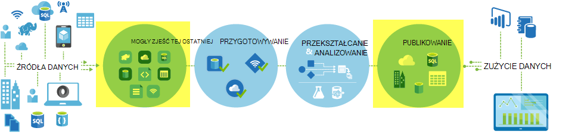
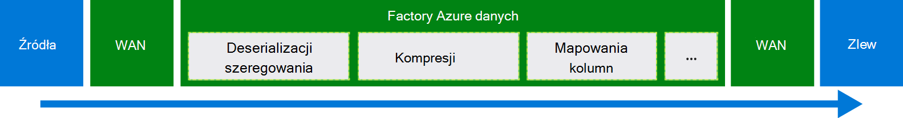
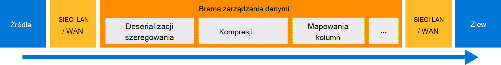

<properties
    pageTitle="Przenoszenie danych za pomocą polecenia Kopiuj aktywności | Microsoft Azure"
    description="Więcej informacji na temat przenoszenia danych w procesy Factory danych: migracji danych między sklepy chmurze oraz między magazynu lokalnego i magazynu w chmurze. Za pomocą kopiowania aktywności."
    keywords="Kopiowanie danych, przenoszenia danych migracji danych, transfer danych"
    services="data-factory"
    documentationCenter=""
    authors="linda33wj"
    manager="jhubbard"
    editor="monicar"/>

<tags
    ms.service="data-factory"
    ms.workload="data-services"
    ms.tgt_pltfrm="na"
    ms.devlang="na"
    ms.topic="article"
    ms.date="09/22/2016"
    ms.author="jingwang"/>

# Przenoszenie danych za pomocą polecenia Kopiuj aktywności

## Omówienie
Za pomocą aktywności kopiowanie danych do skopiowania różnych kształtów z różnych lokalnego i źródeł danych w celu Azure w chmurze, w Factory danych Azure. Po skopiowaniu danych można go dodatkowo przekształcania i analizy. Za pomocą kopiowania aktywności publikowania przekształcenie i wyniki analizy do analizy biznesowej (BI) i zużycie aplikacji.

Kopiowanie działanie korzysta bezpieczne, niezawodne i skalowalna i [Usługa ogólnie dostępna](#global). Ten artykuł zawiera informacje przepływu danych w Factory danych i kopiowanie działanie.

Najpierw Zobaczmy, jak migracji danych występuje między dwoma zbiorów danych chmurze oraz między lokalnego magazynu danych i magazynu danych w chmurze.

> [AZURE.NOTE] Aby dowiedzieć się o działaniach ogólnie, zobacz [Opis potoki i działania](data-factory-create-pipelines.md).

### Kopiowanie danych między dwoma zbiorów danych chmury
Gdy źródłowego i sink magazynów danych w chmurze, aktywności kopii przechodzi przez następujące etapy, aby skopiować dane ze źródła do obiekt sink. Usługa, która uprawnień kopii działania:

1. Odczytuje danych z magazynu danych źródłowych.
2. Wykonuje szeregowania i deserializacji, kompresja/dekompresja, mapowanie kolumny, a następnie wpisz konwersji. Tak, aby te operacje konfiguracji zestawu wprowadzania danych, zestaw danych dane wyjściowe i aktywności Kopiuj.
3.  Zapisuje dane do magazynu danych miejsca docelowego.

Usługa automatycznie wybiera optymalnego region do wykonywania przenoszenia danych. Ten obszar jest zazwyczaj najbliżej sink magazynu danych.

### Kopiowanie danych między lokalnego magazynu danych i magazynu danych w chmurze
Bezpieczne przenoszenie danych między lokalne przechowywanie danych i magazynu danych w chmurze, należy zainstalować bramę zarządzania danymi na komputerze lokalnym. Brama zarządzania danymi jest agenta, który umożliwia przenoszenie danych hybrydowych i przetwarzania. Możesz zainstalować go na tym samym komputerze danych przechowywania samego lub na komputerze osobnych którego ma dostęp do magazynu danych.

W tym scenariuszu bramy zarządzania danymi wykonuje szeregowania i deserializacji, kompresja/dekompresja, mapowanie kolumny, a konwersja typów. Za pośrednictwem usługi Azure danych Factory nie przepływu danych. Zamiast tego bramy zarządzania danymi bezpośrednio zapisuje dane do magazynu docelowego.

Zobacz [Przenoszenie danych między wdrożeniem lokalnym a chmurą magazynów](data-factory-move-data-between-onprem-and-cloud.md) wprowadzenie i instrukcje. Aby uzyskać szczegółowe informacje na temat tego agenta, zobacz [Bramy zarządzania danymi](data-factory-data-management-gateway.md) .

Można również przenieść dane z obsługiwane magazynów obsługiwane na Azure IaaS wirtualnych maszyn za pomocą bramy zarządzania danymi. W takim przypadku możesz zainstalować bramy zarządzania danymi na tym samym maszyn wirtualnych dane przechowywane samego lub w oddzielnym maszyn wirtualnych którego ma dostęp do magazynu danych.

## Obsługiwane dane są przechowywane i formatowania
[AZURE.INCLUDE [data-factory-supported-data-stores](../../includes/data-factory-supported-data-stores.md)]

Jeśli trzeba przenieść dane z danych zawierają że aktywności kopii nie obsługuje, należy użyć **niestandardowym działaniem** w Factory danych z własnych logiczny kopiowanie i przenoszenie danych. Aby uzyskać szczegółowe informacje na temat tworzenia i używania niestandardowe działania zobacz [Używanie niestandardowe działania w potoku Azure danych Factory](data-factory-use-custom-activities.md).

### Obsługiwane formaty plików
Kopiowanie działanie umożliwia skopiowanie plików jako-między magazynów dwóch danych opartych na plikach, takich jak obiektów Blob platformy Azure lub System plików HDFS. Aby to zrobić, możesz pominąć [sekcja format](data-factory-create-datasets.md) w definicji wejściowe i wyjściowe zestawu danych. Dane są kopiowane efektywne bez dowolnego szeregowania i deserializacji.

Kopiowanie działanie również odczytuje i zapisuje do plików w formatach określonej: tekst, Avro, ORC, Parquet i JSON. Możesz wykonać następujące działania Kopiuj, na przykład:

-   Kopiowanie danych w formacie tekstowym (CSV) z obiektów Blob platformy Azure i zapisu do bazy danych SQL Azure.
-   Kopiowanie plików w formacie tekstowym (CSV) w systemie plików lokalnego i zapisać w formacie Avro obiektów Blob platformy Azure.
-   Kopiowanie danych w bazie danych SQL Azure i zapisze HDFS lokalnego w formacie ORC.

## Przenoszenie danych dostępne globalnie
Azure Factory danych jest dostępna tylko w regionów zachód Stanów Zjednoczonych, USA Wschodniej i Północnej Europe. Jednak usługa, która uprawnień aktywności kopii są dostępne globalnie w następujących regionach i regionach. Dostępne globalnie topologii gwarantuje ruch wydajną obsługę danych zazwyczaj pozwala uniknąć przeskoków krzyżowe region. Zobacz [usługi według regionów](https://azure.microsoft.com/regions/#services) dostępności Factory danych i przenoszenia danych w regionie.

### Kopiowanie danych między magazynów chmury
Gdy źródłowego i sink magazynów danych w chmurze, Factory danych użyto wdrażanie usługi w obszarze znajdującym się najbliżej sink w tym samym geograficznych, aby przenieść dane. Można znaleźć w poniższej tabeli mapowania:

Obszar docelowy magazynu danych | Region na potrzeby przenoszenia danych
:----------------------------------- | :----------------------------
Wschodniej Stany Zjednoczone | Wschodniej Stany Zjednoczone
Wschodniej USA 2 | Wschodniej USA 2
Zachód Stany Zjednoczone | Zachód Stany Zjednoczone
Stany Zjednoczone zachód 2 | Zachód Stany Zjednoczone
Centralny Stany Zjednoczone | Centralny Stany Zjednoczone
Stany Zjednoczone centralna zachód | Centralny Stany Zjednoczone
Ameryka Północna centralnej w Stanach Zjednoczonych | Ameryka Północna centralnej w Stanach Zjednoczonych
Południowej centralnej Stany Zjednoczone | Południowej centralnej Stany Zjednoczone
Europa Północna | Europa Północna
Europa Zachodnia | Europa Zachodnia
Kraje Azji Południowo | Kraje Azji Południowo
Wschodnioazjatyckie | Kraje Azji Południowo
Wschód Japonia | Wschód Japonia
Japonia zachód | Wschód Japonia
Brazylia Południowej | Brazylia Południowej
Wschód Australia | Wschód Australia
Australia kopiec | Australia kopiec
Indie centralnej | Indie centralnej
Indie Płd. | Indie centralnej
Indie zachód | Indie centralnej

> [AZURE.NOTE] W przypadku obszaru magazynu danych miejsce docelowe nie na powyższej liście, kopiowanie działanie kończy się niepowodzeniem, zamiast przechodzące przez alternatywny region.

### Kopiowanie danych między lokalnego magazynu danych i magazynu danych w chmurze
Gdy danych jest kopiowana między lokalnego (lub Azure maszyn wirtualnych IaaS) i sklepów chmurze [Brama zarządzania danymi](data-factory-data-management-gateway.md) wykonuje przenoszenia danych na komputerze lokalnym lub maszyn wirtualnych. Nie przepływ danych za pośrednictwem usługi w chmurze, jeśli nie jest używana funkcja [umieszczane Kopiuj](data-factory-copy-activity-performance.md#staged-copy) . W tym przypadku dane są wczytywane za pośrednictwem tymczasowy magazyn obiektów Blob platformy Azure przed zapisaniem w magazynie danych sink.

## Utworzyć potok aktywnością Kopiuj
Możesz utworzyć potok aktywnością kopii na kilka sposobów:

### Za pomocą Kreatora kopiowania
Kreator kopii Factory danych ułatwia tworzenie potok aktywnością Kopiuj. Tego procesu umożliwia kopiowanie danych z obsługiwanych źródeł do miejsc docelowych *bez zapisywania JSON* definicji usługi połączone, zestawy danych oraz procesy. Aby uzyskać szczegółowe informacje o Kreatorze, zobacz [Kreatora kopiowania Factory danych](data-factory-copy-wizard.md) .  

### Za pomocą skryptów JSON
Edytor Factory danych w Azure portal, Visual Studio lub Azure programu PowerShell służy do tworzenia definicji JSON potok (przy użyciu aktywności Kopiuj). Następnie należy wdrożyć go, aby utworzyć proces w Factory danych. Zobacz [Samouczek: używanie kopii aktywności w potoku Factory danych Azure](data-factory-copy-data-from-azure-blob-storage-to-sql-database.md) samouczek z instrukcji krok po kroku.    

Właściwości JSON (takie jak nazwa, opis, dane wejściowe i wyjściowe tabel i zasady) są dostępne dla wszystkich typów działań. Właściwości, które są dostępne w `typeProperties` sekcji działania zależą od każdego typu działania.

Wykonania kopii `typeProperties` sekcji zmienia się w zależności od typów źródeł i sink. Kliknij pozycję zainstalowania źródła i stołu w sekcji [obsługiwanych źródeł i ujść](#supported-data-stores) , aby uzyskać informacje o właściwości typu, obsługiwanych przez kopiowanie działanie dla tego magazynu danych.   

Oto przykładowe definicji JSON:

    {
      "name": "ADFTutorialPipeline",
      "properties": {
        "description": "Copy data from Azure blob to Azure SQL table",
        "activities": [
          {
            "name": "CopyFromBlobToSQL",
            "type": "Copy",
            "inputs": [
              {
                "name": "InputBlobTable"
              }
            ],
            "outputs": [
              {
                "name": "OutputSQLTable"
              }
            ],
            "typeProperties": {
              "source": {
                "type": "BlobSource"
              },
              "sink": {
                "type": "SqlSink",
                "writeBatchSize": 10000,
                "writeBatchTimeout": "60:00:00"
              }
            },
            "Policy": {
              "concurrency": 1,
              "executionPriorityOrder": "NewestFirst",
              "retry": 0,
              "timeout": "01:00:00"
            }
          }
        ],
        "start": "2016-07-12T00:00:00Z",
        "end": "2016-07-13T00:00:00Z"
      }
    }

Harmonogram, która jest zdefiniowana w zestawie danych dane wyjściowe Określa, gdy jest uruchomiony działania (na przykład: **Dzienny**, częstotliwości jako **dzień**i interwału jako **1**). Działanie kopiuje dane z zestawu danych wejściowych (**źródło**) do zestaw danych wyjściowych (**sink**).

Można określić więcej niż jeden zestaw wprowadzania danych kopiowanie działanie. Służą do weryfikacji zależności przed działania. Jednak tylko dane z pierwszego zestawu danych jest kopiowana do miejsca docelowego zestawu danych. Aby uzyskać więcej informacji zobacz [Planowanie i wykonanie](data-factory-scheduling-and-execution.md).  

## Wydajność i dostosowywanie
Zobacz [wydajność działania kopii i dostosowywania przewodnik](data-factory-copy-activity-performance.md), który opisuje kluczowe czynniki mające wpływ na wydajność przepływu danych (Kopiuj czynność) w Factory danych Azure. Również listy obserwowanych wydajności podczas testowania wewnętrznego i w tym artykule omówiono różne sposoby Optymalizowanie działania kopii.

## Kopiowanie planowania i sekwencyjne
Aby uzyskać szczegółowe informacje o sposobie planowania i wykonanie działania Factory danych, zobacz [Planowanie i wykonanie](data-factory-scheduling-and-execution.md) . Istnieje możliwość przeprowadzić wielu operacji kopiowania jeden po drugim w sposób sekwencyjne zamówiono. Zobacz sekcję [zamówiono Kopiuj](data-factory-scheduling-and-execution.md#ordered-copy) .

## Konwersje typów
Różne magazynów mają systemów innego typu macierzystego. Kopiowanie działanie wykonuje konwersje typów automatyczne z typów źródeł tonięcia typy z następujących rozwinięcie na:

1. Konwertowanie typów źródeł natywnych na typ .NET.
2. Konwertowanie typu .NET do typu natywnych sink.

Mapowanie systemu typu macierzystego do typu .NET dla magazynu danych znajduje się w artykule sklepu odpowiednich danych. (Kliknij łącze w tabeli [obsługiwane magazynów danych](#supported-data-stores) ). Za pomocą tych mapowań ustalenie odpowiednie typy podczas tworzenia tabel, dlatego aktywności kopii wykonuje prawo konwersji.

## Następne kroki
- Więcej informacji o działaniach kopii zobacz [Kopiowanie danych z magazynem obiektów Blob platformy Azure do bazy danych SQL Azure](data-factory-copy-data-from-azure-blob-storage-to-sql-database.md).
- Aby uzyskać informacje o przenoszenie danych z lokalnego magazynu danych do magazynu danych w chmurze, zobacz [Przenoszenie danych z lokalnego do chmury dane są przechowywane](data-factory-move-data-between-onprem-and-cloud.md).
