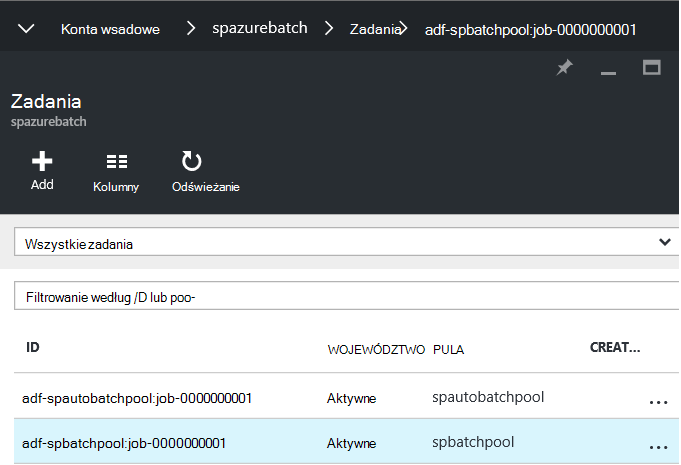
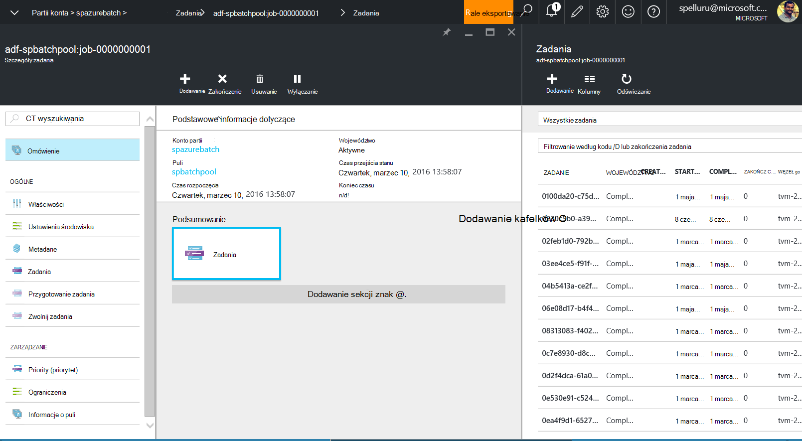

<properties
    pageTitle="Przetwarzanie dużych zestawów danych przy użyciu Factory danych i partii | Microsoft Azure"
    description="W tym artykule opisano sposób przetwarzania dużej ilości danych w potoku Azure Factory danych przy użyciu funkcji przetwarzanie równoległe partii Azure."
    services="data-factory"
    documentationCenter=""
    authors="spelluru"
    manager="jhubbard"
    editor="monicar"/>

<tags
    ms.service="data-factory"
    ms.workload="data-services"
    ms.tgt_pltfrm="na"
    ms.devlang="na"
    ms.topic="article"
    ms.date="10/17/2016"
    ms.author="spelluru"/>

# Proces dużych zestawów danych przy użyciu Factory danych i wsadowe
Ten artykuł zawiera opis architektury przykładowe rozwiązanie, które jest przenoszony i procesów dużych zestawów danych w sposób automatyczny i według harmonogramu. Umożliwia także przewodnikiem end-to-end, aby wdrożyć rozwiązanie przy użyciu Factory danych Azure i partii Azure. 

W tym artykule jest dłuższa niż naszych typowe artykuł, ponieważ zawiera instrukcje rozwiązania całej próbki. W przypadku nowej partii i Factory danych można Dowiedz się więcej o tych usług i w jaki sposób ich współpracę. Jeśli znasz czegoś o usługach które są projektowanie i Projektując rozwiązanie, może być skoncentrowanie się tylko na [Architektura sekcji](#architecture-of-sample-solution) tego artykułu, a jeśli tworzysz prototypu lub rozwiązanie również warto wypróbować instrukcje krok po kroku [instruktażu](#implementation-of-sample-solution). Zapraszamy komentarze dotyczące tej zawartości i jak z niej korzystać.

Najpierw Przyjrzyjmy się jak usługi Factory danych i partii może pomóc w przetwarzania dużych zestawów danych w chmurze.     

## Dlaczego partii Azure?
Azure partii umożliwia uruchamianie aplikacji na dużą skalę równoległych i wysokiej wydajności przetwarzania (HPC) — w chmurze. Jest usługą platformę, która planuje obliczeniowych pracy do uruchomienia w zbiorze zarządzanych maszyn wirtualnych i automatycznie Skala obliczyć zasobów do potrzeb zadań.

Usługa partii definiowania obliczeń Azure zasoby, aby wykonać aplikacji równolegle, a w skali. Można uruchomić na żądanie lub zaplanowanych zadań, dzięki czemu nie trzeba ręcznie utworzyć, konfigurowanie i zarządzanie klastrze HPC, poszczególnych maszyn wirtualnych, wirtualnych sieci lub złożone zadania i zadania planowania infrastruktury.

Jeśli znasz nie wsadowe Azure jako ułatwia zrozumienie architektura i wdrażania rozwiązania opisane w tym artykule, zobacz następujące artykuły.   

- [Podstawy partia Azure](../batch/batch-technical-overview.md)
- [Omówienie funkcji partii](../batch/batch-api-basics.md)

(opcjonalnie) Aby dowiedzieć się więcej na temat partii Azure, zobacz [ścieżka nauki partii Azure](https://azure.microsoft.com/documentation/learning-paths/batch/).

## Dlaczego Factory Azure danych?
Factory danych to usługa integracji danych opartych na chmurze, która orchestrates i zautomatyzować poruszania się i przekształcania danych. Za pomocą usługi Factory danych, możesz utworzyć kanał danych zarządzanych przenoszenie danych z lokalnego i magazynów do magazynu scentralizowane danych w chmurze (na przykład: magazyn obiektów Blob platformy Azure), a proces i przekształcania danych przy użyciu usług, takich jak usługa Azure HDInsight i nauka maszynowego Azure. Można również zaplanować procesy danych, aby uruchomić w monitorze i sposób według harmonogramu (co godzinę, dzienny, tygodniowy, itp.) i zarządzać nimi w skrócie do identyfikowania problemy, a następnie wykonaj czynności. 

Jeśli znasz nie Factory danych Azure jako ułatwia zrozumienie architektura i wdrażania rozwiązania opisane w tym artykule, zobacz następujące artykuły.  

- [Wprowadzenie fabryki Azure danych](data-factory-introduction.md)
- [Tworzenie pierwszego planowaną danych](data-factory-build-your-first-pipeline.md)   

(opcjonalnie) Aby dowiedzieć się więcej na temat Factory danych Azure, zobacz [ścieżka nauki dla Azure danych Factory](https://azure.microsoft.com/documentation/learning-paths/data-factory/).

## Factory danych i partii razem
Factory danych zawiera wbudowane wykonywanie działań, takich jak Kopiuj aktywności kopiowanie i przenoszenie danych z magazynu danych źródłowego do magazynu danych miejsca docelowego i gałęzi aktywności przetworzyć danych za pomocą klastrów Hadoop (HDInsight) na Azure. Zobacz [Działania przekształcania danych](data-factory-data-transformation-activities.md) dla listy obsługiwanych transformacja działań. 

W tym obszarze można również utworzyć niestandardowe działania .NET przenoszenie lub przetwarzanie danych za pomocą własnego logiki i uruchomić działalności w klastrze Azure HDInsight lub w puli partii Azure maszyny wirtualne. Użycie partii Azure, można skonfigurować puli skali automatyczne (Dodawanie lub usuwanie maszyny wirtualne oparte na obciążenie pracą) na podstawie formuły, podane.     

## Architektura przykładowe rozwiązanie
Mimo że architektura opisane w tym artykule jest to proste rozwiązanie, jest istotny dla złożonych scenariuszy, takich jak modelowanie usług finansowych, przetwarzanie obrazu i renderowanie i genomu analizy ryzyka. 

Diagram przedstawia 1) jak Factory danych orchestrates przenoszenia danych i przetwarzania i (2) jak Azure partii przetwarzania danych w sposób równoległe. Pobieranie i drukowanie diagramu klawiaturowe (11 x 17 cali. lub rozmiar A3): [aranżacji HPC i danych przy użyciu partii Azure i Factory danych](http://go.microsoft.com/fwlink/?LinkId=717686).

Poniżej przedstawiono podstawowe etapy procesu. Rozwiązanie zawiera kod i objaśnienia rozwiązania do końca do końca.

1.  **Konfigurowanie partia Azure z puli węzłów obliczeń (pośrednictwem SMS)**. Można określić liczbę węzłów i rozmiaru każdego węzła.

2.  **Tworzenie wystąpienia Factory danych Azure** skonfigurowanym z osobami, reprezentujących magazynem obiektów blob Azure, partii Azure do uruchamiania usługi, wejścia i wyjścia danych i przepływu pracy i planowana z działania, które przenoszenie i przekształcania danych.

3.   **Tworzenie niestandardowego działania .NET w potoku Factory danych**. Działanie jest swój kod użytkownika, który jest uruchamiany w puli partii Azure.

4.  **Magazyn dużych ilości danych wejściowych jako obiektów blob w magazynie Azure**. Danych jest podzielony na logiczne wycinków (zazwyczaj według czasu).

5.  **Dane Factory kopiuje dane przetworzony równolegle** do lokalizacji pomocniczej.

6.  **Factory danych uruchamia niestandardowym działaniem przy użyciu puli przydzielonych przez partię**. Factory danych można uruchomić działania jednocześnie. Wszystkie czynności przetwarza fragment danych. Wyniki są przechowywane w magazynie Azure.

7.  **Ostateczne wyniki w trzecim lokalizacji przenosi Factory danych**, do dystrybucji za pośrednictwem aplikacji lub do dalszego przetwarzania przez inne narzędzia.

## Implementacja przykładowe rozwiązanie
Rozwiązanie próbki jest celowo proste i ma pokazano, jak przy użyciu Factory danych i partii procesu zestawy danych. Rozwiązanie po prostu zlicza liczby wystąpień wyszukiwany termin ("Microsoft") w plikach wprowadzania zorganizowane w szeregu czasowego. Wyświetla go wartość określająca liczbę plików wyjściowych.

**Czas**: Jeśli zaznajomieni z podstawowych funkcji Azure, Factory danych i partię, a została ukończona wymagania wstępne wymienione poniżej, firma Microsoft oszacowania tego rozwiązania trwa godzin 1 i 2.

### Wymagania wstępne

#### Azure subskrypcji
Jeśli nie masz subskrypcji usługi Azure, możesz utworzyć bezpłatne konto wersji próbnej na kilka minut. Zobacz [bezpłatnej wersji próbnej](https://azure.microsoft.com/pricing/free-trial/).

#### Konto Azure miejsca do magazynowania
Korzystasz z konta Azure miejsca do magazynowania do przechowywania danych w tym samouczku. Jeśli nie masz konta usługi Azure miejsca do magazynowania, zobacz [Tworzenie konta miejsca do magazynowania](../storage/storage-create-storage-account.md#create-a-storage-account). Rozwiązanie przykładowy używa magazynu obiektów blob.

#### Konto Azure partii
Utwórz konto partii Azure za pomocą [Azure portal](http://manage.windowsazure.com/). Zobacz [Utwórz i Zarządzaj kontem partii Azure](../batch/batch-account-create-portal.md). Uwaga klucz konta i nazwę konta partii Azure. Za pomocą polecenia cmdlet [New-AzureRmBatchAccount](https://msdn.microsoft.com/library/mt603749.aspx) utworzyć konto Azure partię. Aby uzyskać szczegółowe instrukcje na temat korzystania z tego polecenia cmdlet, zobacz [Wprowadzenie do poleceń cmdlet programu PowerShell wsadowe Azure](../batch/batch-powershell-cmdlets-get-started.md) .

Rozwiązanie przykładowe używa partii Azure (pośrednio przez potok Factory danych Azure) do procesu danych w sposób równoległego w puli węzłów obliczeń (zarządzanych zbioru maszyn wirtualnych).

#### Azure puli partii wirtualnych maszyn
Tworzenie **puli wsadowe Azure** z co najmniej 2 węzły obliczeń.

1.  W [portalu Azure](https://portal.azure.com)w menu po lewej stronie kliknij przycisk **Przeglądaj** , a następnie kliknij przycisk **Konta partii**. 
2. Wybierz swoje konto Azure partii, aby otworzyć karta **Wsadowe konta** . 
3. Kliknij Kafelek **pul** .
4. W karta **puli** kliknij przycisk Dodaj na pasku narzędzi, aby dodać puli.
    1. Wprowadź identyfikator puli (**Identyfikator puli**). Zanotuj **Identyfikator puli**; będzie potrzebny podczas tworzenia rozwiązanie Factory danych. 
    2. **Windows Server 2012 R2** określ dla ustawienia rodziny System operacyjny.
    3. Wybierz **węzeł cennik warstwy**.
    4. Wprowadź **2** jako wartość ustawienia **Dedykowane docelowej** .
    5. Wprowadź **2** jako wartość ustawienia **zadania Max na węzeł** .
    6. Kliknij **przycisk OK** , aby utworzyć puli. 
    
#### Eksplorator magazynu platformy Azure   
[Azure miejsca do magazynowania Explorer 6 (Narzędzia)](https://azurestorageexplorer.codeplex.com/) lub [CloudXplorer](http://clumsyleaf.com/products/cloudxplorer) (z oprogramowania ClumsyLeaf). Sprawdzanie i zmienianie danych w projektach magazyn Azure tym dzienniki aplikacji hostowanej w chmurze za pomocą tych narzędzi.

1.  Tworzenie kontenera o nazwie **mycontainer** z dostępem prywatnych (Brak dostępu anonimowego)

2.  Jeśli korzystasz z **CloudXplorer**, Utwórz foldery i podfoldery z następującą strukturę:

    

    **Inputfolder** i **outputfolder** są folderów najwyższego poziomu w **mycontainer,** i **inputfolder** zawiera podfoldery z sygnatury daty i godziny (RRRR-MM-DD-GG).

    Jeśli używasz **Eksplorator magazynu Azure**w następnym kroku, musisz przekazać pliki, których nazwy: inputfolder/2015-11-16-00/file.txt, inputfolder/2015-11-16-01/file.txt i tak dalej. W tym kroku automatycznie tworzy foldery.

3.  Tworzenie pliku tekstowego **plik.txt** na komputerze z zawartością, która zawiera słowo kluczowe **firmy Microsoft**. Na przykład: "Testowanie niestandardowym działaniem Microsoft test niestandardowym działaniem Microsoft".

4.  Przekaż plik do następujących folderów wprowadzania w magazynie obiektów blob platformy Azure.

    

    Jeśli korzystasz z **Eksploratora magazynu Azure**, Przekaż plik **plik.txt** do **mycontainer**. Kliknij przycisk **Kopiuj** na pasku narzędzi, aby utworzyć kopię obiektów blob. W oknie dialogowym **Obiektów Blob Kopiuj** zmienić **nazwy obiektów blob miejsce docelowe** , aby **inputfolder/2015-11-16-00/file.txt.** Powtórz ten krok, aby utworzyć inputfolder/2015-11-16-01/file.txt, inputfolder/2015-11-16-02/file.txt, inputfolder/2015-11-16-03/file.txt, inputfolder/2015-11-16-04/file.txt i tak dalej. Ta akcja automatycznie tworzy foldery.

3.  Tworzenie innego kontenera o nazwie: **customactivitycontainer**. Możesz przekazać plik zip niestandardowym działaniem z tym kontenerem.

#### Programu Visual Studio
Zainstaluj program Microsoft Visual Studio 2012 lub nowszy Aby utworzyć niestandardowe działanie partii może być używany w rozwiązaniu Factory danych.

### Wysokiego poziomu czynności, aby utworzyć rozwiązanie

1.  Tworzenie niestandardowego działanie, które zawiera logikę przetwarzania danych.
2.  Tworzenie factory Azure danych, która korzysta z niestandardowym działaniem:

### Tworzenie niestandardowego działania

Działania niestandardowego Factory danych jest serce tego rozwiązania próbki. Rozwiązanie przykładowe korzysta partii Azure, aby uruchomić działania niestandardowego. Informacje na temat [Niestandardowe działania w potoku Factory danych Azure za pomocą](data-factory-use-custom-activities.md) podstawowe informacje można opracowywać niestandardowe działania i używania ich w procesy Azure danych Factory.

Aby utworzyć .NET działania niestandardowego, którego można używać w potoku Azure Factory danych, należy utworzyć projektu **Biblioteka klas .NET** z klasą tego interfejsu **IDotNetActivity** . Ten interfejs zawiera tylko jedną metodę: **Wykonywanie**. Oto podpis metody:

    public IDictionary<string, string> Execute(
                IEnumerable<LinkedService> linkedServices,
                IEnumerable<Dataset> datasets,
                Activity activity,
                IActivityLogger logger)

Metoda ma kilka kluczowe składniki, które należy zrozumieć.

-   Metoda wymaga cztery parametry:

    1.  **linkedServices**. Ustalony listy usługi połączone, które połączyć źródła danych wejścia i wyjścia (na przykład: magazyn obiektów Blob platformy Azure) do fabryki danych. W tym przykładzie istnieje tylko jedna usługa połączonych typu Magazyn Azure przeznaczone zarówno dane wejściowe i wyjściowe.

    2.  **zestawy danych**. Jest to ustalony lista zestawy danych. Ten parametr umożliwia uzyskiwanie lokalizacji i schematów zdefiniowanych przez wejściowe i wyjściowe zestawy danych.

    3.  **działania**. Ten parametr reprezentuje bieżącego obliczeń obiektu — w tym przypadku usługi Azure partię.

    4.  **rejestratora**. Rejestratora pozwala komentarze debugowania tej powierzchni logowania "Użytkownika" procesu.

-   Metoda zwraca słownik, który może służyć do łańcuch niestandardowe działania w przyszłości. Ta funkcja nie jest jeszcze zaimplementowana, dlatego zwracana pustego słownik z metody. 

#### Procedura: Tworzenie niestandardowego działania

1.  Tworzenie projektu Biblioteka klas .NET w programie Visual Studio.

    1.  Uruchamianie **programu Visual Studio 2012**/**2015-2013**.

    2.  Kliknij pozycję **plik**, wskaż polecenie **Nowy**, a następnie kliknij pozycję **Projekt**.

    3.  Rozwiń listę **Szablony**, a następnie wybierz pozycję **podpowiedzi wizualne\#**. W tym instruktażu, można użyć C\#, ale możesz użyć dowolnego języka .NET opracowywaniu działania niestandardowego.

    4.  **Biblioteka klas** wybierz z listy typów projektów po prawej stronie.

    5.  Wprowadź **nazwę** **MyDotNetActivity** .

    6.  Wybierz pozycję **C:\\ADF** dla **lokalizacji**. Jeśli nie istnieje, Utwórz folder **ADF** .

    7.  Kliknij przycisk **OK** , aby utworzyć projekt.

2.  Kliknij pozycję **Narzędzia**, wskaż pozycję **Menedżer pakietów NuGet**, a następnie kliknij **Konsoli Menedżera pakietów**.

3.  W **Konsoli Menedżera pakietów**wykonaj następujące polecenie, aby zaimportować **Microsoft.Azure.Management.DataFactories**.

            Install-Package Microsoft.Azure.Management.DataFactories

4.  Importowanie pakietu NuGet **Magazyn Azure** w do projektu. Ten pakiet jest potrzebna, ponieważ korzystasz z magazynem obiektów Blob interfejsu API w tym przykładzie.

        Install-Package Azure.Storage

5.  Dodaj następujące dyrektywy **przy użyciu** z plikiem źródłowym w projekcie.

        using System.IO;
        using System.Globalization;
        using System.Diagnostics;
        using System.Linq;

        using Microsoft.Azure.Management.DataFactories.Models;
        using Microsoft.Azure.Management.DataFactories.Runtime;

        using Microsoft.WindowsAzure.Storage;
        using Microsoft.WindowsAzure.Storage.Blob;

6.  Zmień nazwę obszaru **nazw** na **MyDotNetActivityNS**.

        namespace MyDotNetActivityNS

7.  Zmień nazwę klasy do **MyDotNetActivity** i pochodzić z interfejsu **IDotNetActivity** , tak jak pokazano poniżej.

        public class MyDotNetActivity : IDotNetActivity

8.  Implementacji (Dodaj) **Wykonywanie** metody interfejsu **IDotNetActivity** do klasy **MyDotNetActivity** i skopiuj następujący kod do metody. W sekcji [Metoda wykonania](#execute-method) wyjaśnienie logiczny używane w tej metody.

        /// 

        /// Execute method is the only method of IDotNetActivity interface you must implement.
        /// In this sample, the method invokes the Calculate method to perform the core logic.  
        /// 

        public IDictionary<string, string> Execute(
            IEnumerable<LinkedService> linkedServices,
            IEnumerable<Dataset> datasets,
            Activity activity,
            IActivityLogger logger)
        {

            // declare types for input and output data stores
            AzureStorageLinkedService inputLinkedService;

            Dataset inputDataset = datasets.Single(dataset => dataset.Name == activity.Inputs.Single().Name);
    
            foreach (LinkedService ls in linkedServices)
                logger.Write("linkedService.Name {0}", ls.Name);

            // using First method instead of Single since we are using the same
            // Azure Storage linked service for input and output.
            inputLinkedService = linkedServices.First(
                linkedService =>
                linkedService.Name ==
                inputDataset.Properties.LinkedServiceName).Properties.TypeProperties
                as AzureStorageLinkedService;

            string connectionString = inputLinkedService.ConnectionString; // To create an input storage client.
            string folderPath = GetFolderPath(inputDataset);
            string output = string.Empty; // for use later.

            // create storage client for input. Pass the connection string.
            CloudStorageAccount inputStorageAccount = CloudStorageAccount.Parse(connectionString);
            CloudBlobClient inputClient = inputStorageAccount.CreateCloudBlobClient();

            // initialize the continuation token before using it in the do-while loop.
            BlobContinuationToken continuationToken = null;
            do
            {   // get the list of input blobs from the input storage client object.
                BlobResultSegment blobList = inputClient.ListBlobsSegmented(folderPath,
                                         true,
                                         BlobListingDetails.Metadata,
                                         null,
                                         continuationToken,
                                         null,
                                         null);

                // Calculate method returns the number of occurrences of
                // the search term (“Microsoft”) in each blob associated
                // with the data slice.
                //
                // definition of the method is shown in the next step.
                output = Calculate(blobList, logger, folderPath, ref continuationToken, "Microsoft");

            } while (continuationToken != null);

            // get the output dataset using the name of the dataset matched to a name in the Activity output collection.
            Dataset outputDataset = datasets.Single(dataset => dataset.Name == activity.Outputs.Single().Name);

            folderPath = GetFolderPath(outputDataset);

            logger.Write("Writing blob to the folder: {0}", folderPath);

            // create a storage object for the output blob.
            CloudStorageAccount outputStorageAccount = CloudStorageAccount.Parse(connectionString);
            // write the name of the file.
            Uri outputBlobUri = new Uri(outputStorageAccount.BlobEndpoint, folderPath + "/" + GetFileName(outputDataset));

            logger.Write("output blob URI: {0}", outputBlobUri.ToString());
            // create a blob and upload the output text.
            CloudBlockBlob outputBlob = new CloudBlockBlob(outputBlobUri, outputStorageAccount.Credentials);
            logger.Write("Writing {0} to the output blob", output);
            outputBlob.UploadText(output);

            // The dictionary can be used to chain custom activities together in the future.
            // This feature is not implemented yet, so just return an empty dictionary.
            return new Dictionary<string, string>();
        }

9.  Dodaj następujące metody pomocy do klasy. Te metody są wywoływane przez metodę **Execute** . Najważniejsze metodę **obliczania** wyodrębnia kod, którego iterację poszczególnych obiektów blob.

        /// 

        /// Gets the folderPath value from the input/output dataset.
        /// 

        private static string GetFolderPath(Dataset dataArtifact)
        {
            if (dataArtifact == null || dataArtifact.Properties == null)
            {
                return null;
            }

            AzureBlobDataset blobDataset = dataArtifact.Properties.TypeProperties as AzureBlobDataset;
            if (blobDataset == null)
            {
                return null;
            }

            return blobDataset.FolderPath;
        }

        /// 

        /// Gets the fileName value from the input/output dataset.
        /// 

        private static string GetFileName(Dataset dataArtifact)
        {
            if (dataArtifact == null || dataArtifact.Properties == null)
            {
                return null;
            }

            AzureBlobDataset blobDataset = dataArtifact.Properties.TypeProperties as AzureBlobDataset;
            if (blobDataset == null)
            {
                return null;
            }

            return blobDataset.FileName;
        }

        /// 

        /// Iterates through each blob (file) in the folder, counts the number of instances of search term in the file,
        /// and prepares the output text that is written to the output blob.
        /// 

        public static string Calculate(BlobResultSegment Bresult, IActivityLogger logger, string folderPath, ref BlobContinuationToken token, string searchTerm)
        {
            string output = string.Empty;
            logger.Write("number of blobs found: {0}", Bresult.Results.Count<IListBlobItem>());
            foreach (IListBlobItem listBlobItem in Bresult.Results)
            {
                CloudBlockBlob inputBlob = listBlobItem as CloudBlockBlob;
                if ((inputBlob != null) && (inputBlob.Name.IndexOf("$$$.$$$") == -1))
                {
                    string blobText = inputBlob.DownloadText(Encoding.ASCII, null, null, null);
                    logger.Write("input blob text: {0}", blobText);
                    string[] source = blobText.Split(new char[] { '.', '?', '!', ' ', ';', ':', ',' }, StringSplitOptions.RemoveEmptyEntries);
                    var matchQuery = from word in source
                                     where word.ToLowerInvariant() == searchTerm.ToLowerInvariant()
                                     select word;
                    int wordCount = matchQuery.Count();
                    output += string.Format("{0} occurrences(s) of the search term \"{1}\" were found in the file {2}.\r\n", wordCount, searchTerm, inputBlob.Name);
                }
            }
            return output;
        }

    Metoda **GetFolderPath** zwraca ścieżkę do folderu, który wskazuje zestawu danych i metodę **GetFileName** zwraca nazwę obiektów blob pliku wskazuje zestaw danych.

        "name": "InputDataset",
        "properties": {
            "type": "AzureBlob",
            "linkedServiceName": "StorageLinkedService",
            "typeProperties": {
                "fileName": "file.txt",
                "folderPath": "mycontainer/inputfolder/{Year}-{Month}-{Day}-{Hour}",

    Metoda **obliczania** oblicza liczbę wystąpień słowa kluczowego **firmy Microsoft** w plikach wprowadzania (BLOB w folderze). Wyszukiwany termin ("Microsoft") jest stałe w kodzie.

10.  Kompilacji projektu. Kliknij przycisk **Konstruuj** z menu, a następnie kliknij przycisk **Konstruuj rozwiązanie**.

11.  Uruchom **Eksploratora Windows**i przejdź do strony **pojemnika\\debugowanie** lub **pojemnika\\Zwolnij** folderu, w zależności od typu kompilacji.

12.  Tworzenie pliku zip **MyDotNetActivity.zip** , który zawiera wszystkie pliki binarne w ** \\pojemnika\\debugowanie** folder. Warto uwzględnić MyDotNetActivity. plik **PDB** , tak aby uzyskać dodatkowe informacje, takie jak numer wiersza kodu źródłowego, które spowodowały problem podczas błąd występuje.

    

13.  Prześlij **MyDotNetActivity.zip** jako obiektów blob w kontenerze obiektów blob: używa **customactivitycontainer** w magazynie obiektów blob platformy Azure, że **StorageLinkedService** połączony usługi w **ADFTutorialDataFactory** . Tworzenie kontenera obiektów blob **customactivitycontainer** , jeśli jeszcze nie istnieje.

#### Wykonywanie metody

Ta sekcja zawiera bardziej szczegółowe informacje i uwagi dotyczące kod w Metoda Execute.

1.  Elementy członkowskie dla iteracji w kolekcji wprowadzania znajdują się w obszarze nazw [Microsoft.WindowsAzure.Storage.Blob](https://msdn.microsoft.com/library/azure/microsoft.windowsazure.storage.blob.aspx) . Iteracji w kolekcji obiektów blob wymaga za pomocą klasy **BlobContinuationToken** . W zasadzie należy użyć-podczas pętli z token jako mechanizm zamykanie pętli. Aby uzyskać więcej informacji zobacz [jak za pomocą magazyn obiektów Blob z .NET](../storage/storage-dotnet-how-to-use-blobs.md). Podstawowe pętli pokazano poniżej:

        // Initialize the continuation token.
        BlobContinuationToken continuationToken = null;
        do
        {
        // Get the list of input blobs from the input storage client object.
        BlobResultSegment blobList = inputClient.ListBlobsSegmented(folderPath,
                                true,
                                          BlobListingDetails.Metadata,
                                          null,
                                          continuationToken,
                                          null,
                                          null);
        // Return a string derived from parsing each blob.
            output = Calculate(blobList, logger, folderPath, ref continuationToken, "Microsoft");

        } while (continuationToken != null);

    Zapoznaj się z dokumentacją dla metody [ListBlobsSegmented](https://msdn.microsoft.com/library/jj717596.aspx) , aby uzyskać szczegółowe informacje.

2.  Kod pracy w zestawie obiektów blob logicznie przechodzi w ramach nie-podczas pętli. W przypadku metody **Execute** nie-podczas pętli przekazuje na liście obiektów blob do metodę o nazwie **Calculate**. Metoda zwraca ciąg zmiennej o nazwie **dane wyjściowe** wynik o powtórzyć za pośrednictwem wszystkich obiektów blob segmentu.

    Zwraca liczbę wystąpień wyszukiwanego (**Microsoft**) w obiekcie blob przekazany do metody **obliczania** .

        output += string.Format("{0} occurrences of the search term \"{1}\" were found in the file {2}.\r\n", wordCount, searchTerm, inputBlob.Name);

3.  Po zakończeniu pracy metodę **obliczania** muszą być zapisane na nowych obiektów blob. Aby dla każdego zestawu obiektów blob przetwarzane nowych obiektów blob mogą być pisane z wynikami. Aby zapisać na nowych obiektów blob, najpierw Znajdź dane wyjściowe zestawu danych.

        // Get the output dataset using the name of the dataset matched to a name in the Activity output collection.
        Dataset outputDataset = datasets.Single(dataset => dataset.Name == activity.Outputs.Single().Name);

4.  Kod wywołuje również metodę Pomocnik: **GetFolderPath** pobrać ścieżki folderu (nazwa kontenera miejsca do magazynowania).

        folderPath = GetFolderPath(outputDataset);

    **GetFolderPath** rzutuje obiektu zestawu danych w celu AzureBlobDataSet, która ma właściwość o nazwie ścieżkafolderu.

        AzureBlobDataset blobDataset = dataArtifact.Properties.TypeProperties as AzureBlobDataset;

        return blobDataset.FolderPath;

5.  Kod wywołuje metodę **GetFileName** , aby pobrać plik (nazwa obiektów blob). Kod przypomina kod powyżej, aby pobrać ścieżkę folderu.

        AzureBlobDataset blobDataset = dataArtifact.Properties.TypeProperties as AzureBlobDataset;

        return blobDataset.FileName;

6.  Nazwa pliku jest zapisywany, tworząc obiekt URI. Konstruktor URI użyto właściwości **BlobEndpoint** nazwa zwracana w kontenerze. Folder ścieżkę i nazwę pliku są dodawane do tworzenia obiektów blob dane wyjściowe identyfikatora URI.  

        // Write the name of the file.
        Uri outputBlobUri = new Uri(outputStorageAccount.BlobEndpoint, folderPath + "/" + GetFileName(outputDataset));

7.  Nazwa pliku zostały zapisane i teraz możesz zapisywać ciągu wyjściowego z metody **obliczania** do nowych obiektów blob:

        // Create a blob and upload the output text.
        CloudBlockBlob outputBlob = new CloudBlockBlob(outputBlobUri, outputStorageAccount.Credentials);
        logger.Write("Writing {0} to the output blob", output);
        outputBlob.UploadText(output);

### Tworzenie factory danych

W sekcji [Tworzenie niestandardowego działania](#create-the-custom-activity) zostało utworzone niestandardowe działania i przekazać plik zip przy użyciu plików binarnych i plik PDB do kontenera obiektów blob platformy Azure. W tej sekcji możesz utworzyć Azure **factory danych** z **Planowana** , która korzysta z **niestandardowym działaniem**.

Wprowadzania zestawu danych dla niestandardowym działaniem reprezentuje BLOB (plików) w folderze wprowadzania (mycontainer\\inputfolder) w magazynie obiektów blob. Zestaw danych wynik działania reprezentuje blob wyjścia w folderze wyjściowym (mycontainer\\outputfolder) w magazynie obiektów blob.

Usuwanie jednego lub więcej plików w folderach wprowadzania:

    mycontainer -\> inputfolder
        2015-11-16-00
        2015-11-16-01
        2015-11-16-02
        2015-11-16-03
        2015-11-16-04

Na przykład upuszczanie jednego pliku (plik.txt) o następującej treści do poszczególnych folderów.

    test custom activity Microsoft test custom activity Microsoft

Każdy folder wejściowy odpowiada wycinek Factory danych Azure, nawet jeśli folder zawiera 2 lub więcej plików. Podczas przetwarzania każdego wycinka przez potok niestandardowym działaniem iterację wszystkich obiektów blob w folderze wprowadzania ten wycinek.

Zobacz pięć plików wyjściowych o tej samej zawartości. Na przykład plik docelowy przetwarzanie pliku w folderze 2015-11-16-00 ma następującą zawartość:

    2 occurrences(s) of the search term "Microsoft" were found in the file inputfolder/2015-11-16-00/file.txt.

Jeśli upuszczeniu wielu plików (plik.txt, Plik2.txt file3.txt) o tej samej zawartości w folderze wprowadzania zostanie wyświetlone następujące zawartości w pliku docelowym. Każdy folder (2015-11-16-00 itd.) odpowiada wycinek w tym przykładzie, nawet jeśli folder zawiera wiele plików wejściowych.

    2 occurrences(s) of the search term "Microsoft" were found in the file inputfolder/2015-11-16-00/file.txt.
    2 occurrences(s) of the search term "Microsoft" were found in the file inputfolder/2015-11-16-00/file2.txt.
    2 occurrences(s) of the search term "Microsoft" were found in the file inputfolder/2015-11-16-00/file3.txt.

Plik docelowy zawiera trzy wiersze po jednym dla każdego pliku wejściowego (blob) w folderze skojarzone z wycinek (2015-11-16-00).

Zadanie jest tworzone dla każdej czynności uruchom. W tym przykładzie istnieje tylko jedna działanie w potoku. Podczas przetwarzania wycinek przez potok niestandardowym działaniem jest uruchamiany w partii Azure przetwarzania wycinek. Ponieważ istnieje pięć wycinków (każdego wycinka może być wiele obiektów blob lub pliku), istnieje pięć zadania utworzone w partii Azure. Po uruchomieniu partii zadania jest wielkości niestandardowego, którym jest uruchomiony.

Następujące instruktaż zawiera dodatkowe informacje.

#### Krok 1: Tworzenie factory danych

1.  Po zalogowaniu się do [portalu Azure](https://portal.azure.com/), wykonaj następujące czynności:

    1.  Kliknij przycisk **Nowy** w lewym menu.

    2.  Karta **Nowy** kliknij **danych + analizy** .

    3.  Kliknij pozycję **Factory danych** na karta **analizy danych** .

2.  W karta **nowego factory danych** wprowadź **CustomActivityFactory** dla nazwy. Nazwa fabryki Azure danych musi być globalnie unikatowa. Jeśli zostanie wyświetlony komunikat o błędzie: **factory danych o nazwie "CustomActivityFactory" nie jest dostępny**, Zmień nazwę fabryki danych (na przykład **yournameCustomActivityFactory**) i spróbuj ponownie utworzyć.

3.  Kliknij **Nazwę grupy zasobów**, a następnie naciśnij istniejącej grupy zasobów lub utworzyć grupę zasobów.

4.  Upewnij się, że korzystasz z poprawne subskrypcji i region, w którym chcesz factory danych ma zostać utworzony.

5.  Kliknij przycisk **Utwórz** na karta **factory nowych danych** .

6.  Zobacz factory danych tworzonych w **pulpicie nawigacyjnym** portalu Azure.

7.  Po factory danych został utworzony pomyślnie, zostanie wyświetlona strona factory danych, prezentującej zawartość fabryki danych.

 

#### Krok 2: Tworzenie usługi połączone

Usługi połączone łącze magazynów lub obliczyć usług do fabryki Azure danych. W tym kroku można połączyć swoje konto **Azure miejsca do magazynowania** i konto **Azure partii** firmie danych.

#### Tworzenie usługi Magazyn Azure połączone

1.  Kliknij pozycję **Autor i wdrażanie** kafelków na karta **FACTORY danych** dla **CustomActivityFactory**. Zostanie wyświetlony Edytor Factory danych.

2.  Kliknij pozycję **nowe dane przechowywane** na pasku poleceń i wybierz **Azure przestrzeni dyskowej.** Skrypt JSON związane z tworzeniem usługi Magazyn Azure połączone w edytorze powinny być widoczne.

    

3.  Zamień **nazwę konta** nazwę swojego konta magazynu platformy Azure i **klucz konta** przy użyciu klucza dostępu do konta Azure miejsca do magazynowania. Aby dowiedzieć się, jak uzyskać klucz dostępu do magazynowania, zobacz [Wyświetlanie, Kopiuj i klawisze dostępu wyniku miejsca do magazynowania](../storage/storage-create-storage-account.md#view-copy-and-regenerate-storage-access-keys).

4.  Kliknij pozycję **Rozmieść** na pasku poleceń do wdrożenia usługi połączone.

    

#### Tworzenie usługi Azure wsadowe połączone

W tym kroku utworzysz połączone usługi dla Twojego konta **Partii Azure** , używanym do uruchomienia niestandardowym działaniem Factory danych.

1.  Kliknij **Nowy obliczenia** na pasku poleceń i wybierz pozycję **partii Azure.** Skrypt JSON związane z tworzeniem usługi Azure partii połączone w edytorze powinny być widoczne.

2.  W obszarze skrypt JSON:

    1.  Zamień nazwę swojego konta partii Azure **nazwę konta** .

    2.  Zamień **klawisz dostępu** z kluczem dostępu do konta partii Azure.

    3.  Wprowadź identyfikator puli właściwości **Nazwa_puli** **.** Tej właściwości można określić albo nazwa puli lub puli identyfikatora.

    4.  Wprowadź partii URI **batchUri** właściwości JSON. 
    
        > [AZURE.IMPORTANT] Jest używany adres **URL** z **Karta konto Azure partii** w następującym formacie: \<nazwa konta\>. \<region\>. batch.azure.com. Dla właściwości **batchUri** w formacie JSON należy **usunąć "Nazwa konta."** z adresu URL. Przykład: `"batchUri": "https://eastus.batch.azure.com"`.

        

        Właściwość **Nazwa_puli** można określić także identyfikator puli zamiast imienia i nazwiska puli.

        > [AZURE.NOTE] Usługa Factory danych nie obsługuje opcję na żądanie partii Azure, jak w przypadku usługi HDInsight. Własne puli partii Azure można używać tylko w factory Azure danych.

    5.  Określ **StorageLinkedService** dla właściwości **linkedServiceName** . Ta usługa połączony został utworzony w poprzednim kroku. Ten magazyn jest używany jako obszaru tymczasowego dotyczące plików i dzienników.

3.  Kliknij pozycję **Rozmieść** na pasku poleceń do wdrożenia usługi połączone.

#### Krok 3: Tworzenie zestawów danych

W tym kroku utworzysz zestawy danych, aby oznaczyć dane wejściowe i wyjściowe.

#### Tworzenie zestawu wprowadzania danych

1.  W **Edytorze** dla Factory danych kliknij przycisk **Nowy zestaw danych** na pasku narzędzi, a następnie kliknij przycisk **Magazyn obiektów Blob platformy Azure** z menu rozwijanego.

2.  Zastąp JSON w okienku po prawej stronie wstawkę JSON następujące czynności:

        {
            "name": "InputDataset",
            "properties": {
                "type": "AzureBlob",
                "linkedServiceName": "AzureStorageLinkedService",
                "typeProperties": {
                    "folderPath": "mycontainer/inputfolder/{Year}-{Month}-{Day}-{Hour}",
                    "format": {
                        "type": "TextFormat"
                    },
                    "partitionedBy": [
                        {
                            "name": "Year",
                            "value": {
                                "type": "DateTime",
                                "date": "SliceStart",
                                "format": "yyyy"
                            }
                        },
                        {
                            "name": "Month",
                            "value": {
                                "type": "DateTime",
                                "date": "SliceStart",
                                "format": "MM"
                            }
                        },
                        {
                            "name": "Day",
                            "value": {
                                "type": "DateTime",
                                "date": "SliceStart",
                                "format": "dd"
                            }
                        },
                        {
                            "name": "Hour",
                            "value": {
                                "type": "DateTime",
                                "date": "SliceStart",
                                "format": "HH"
                            }
                        }
                    ]
                },
                "availability": {
                    "frequency": "Hour",
                    "interval": 1
                },
                "external": true,
                "policy": {}
            }
        }

     Utworzyć potok w dalszej części tego instruktażu czas rozpoczęcia: 2015-11-godziny 16T00:00:00Z i zakończenie: 2015-11-16T05:00:00Z. Zaplanowano w celu utworzenia danych **co godzinę**, więc 5 wycinków wejścia i wyjścia (od **00**: 00:00 -\> **05**: 00:00).

     **Częstotliwość** i **Interwał** w zestawie danych wejściowych jest ustawiona na **godziny** i **1**, co oznacza, że wprowadzania wycinek jest dostępny co godzinę.

     Poniżej przedstawiono czasu rozpoczęcia dla każdego wycinka, którego jest reprezentowany przez **SliceStart** zmienna w powyższych wstawek JSON.

  	| **Wycinek** | **Czas rozpoczęcia**          |
  	|-----------|-------------------------|
  	| 1         | 2015-11-16T**00**: 00:00 |
  	| 2         | 2015-11-16T**01**: 00:00 |
  	| 3         | 2015-11-16T**02**: 00:00 |
  	| 4         | 2015-11-16T**03**: 00:00 |
  	| 5         | 2015-11-16T**04**: 00:00 |

     **Ścieżkafolderu** jest obliczana przy użyciu rok, miesiąc, dzień i godzinę część czasu rozpoczęcia wycinek (**SliceStart**). W związku z tym Oto jak folder wejściowy są mapowane wycinek.

  	| **Wycinek** | **Czas rozpoczęcia**          | **Folder wejściowy**  |
  	|-----------|-------------------------|-------------------|
  	| 1         | 2015-11-16T**00**: 00:00 | 2015-11-16 -**00** |
  	| 2         | 2015-11-16T**01**: 00:00 | 2015-11-16 -**01** |
  	| 3         | 2015-11-16T**02**: 00:00 | 2015-11-16 -**02** |
  	| 4         | 2015-11-16T**03**: 00:00 | 2015-11-16 -**03** |
  	| 5         | 2015-11-16T**04**: 00:00 | 2015-11-16 -**04** |

3.  Kliknij pozycję **Rozmieść** na pasku narzędzi, aby tworzyć i wdrażać tabeli **InputDataset** . 

#### Tworzenie zestawu danych wyjściowych danych

W tym kroku utworzysz innego zestawu danych typu AzureBlob reprezentować danych wyjściowych.

1.  W **Edytorze** dla Factory danych kliknij przycisk **Nowy zestaw danych** na pasku narzędzi, a następnie kliknij przycisk **Magazyn obiektów Blob platformy Azure** z menu rozwijanego.

2.  Zastąp JSON w okienku po prawej stronie wstawkę JSON następujące czynności:

        {
            "name": "OutputDataset",
            "properties": {
                "type": "AzureBlob",
                "linkedServiceName": "AzureStorageLinkedService",
                "typeProperties": {
                    "fileName": "{slice}.txt",
                    "folderPath": "mycontainer/outputfolder",
                    "partitionedBy": [
                        {
                            "name": "slice",
                            "value": {
                                "type": "DateTime",
                                "date": "SliceStart",
                                "format": "yyyy-MM-dd-HH"
                            }
                        }
                    ]
                },
                "availability": {
                    "frequency": "Hour",
                    "interval": 1
                }
            }
        }

    Obiektów blob plik docelowy jest generowany dla każdego wycinka wprowadzania danych. Poniżej przedstawiono, jak o nazwie pliku wyjściowego dla każdego wycinka. Wszystkie pliki wyjściowe są generowane w jednym folderze wynik: **mycontainer\\outputfolder**.

  	| **Wycinek** | **Czas rozpoczęcia**          | **Plik docelowy**       |
  	|-----------|-------------------------|-----------------------|
  	| 1         | 2015-11-16T**00**: 00:00 | 2015-11-16 -**00. txt** |
  	| 2         | 2015-11-16T**01**: 00:00 | 2015-11-16 -**01. txt** |
  	| 3         | 2015-11-16T**02**: 00:00 | 2015-11-16 -**02. txt** |
  	| 4         | 2015-11-16T**03**: 00:00 | 2015-11-16 -**03. txt** |
  	| 5         | 2015-11-16T**04**: 00:00 | 2015-11-16 -**04. txt** |

     Należy pamiętać, że wszystkie pliki w folderze wprowadzania (na przykład: 2015-11-16-00) są częścią wycinek czas rozpoczęcia: 2015-11-16-00. Podczas przetwarzania fragmencie niestandardowym działaniem skanuje za pośrednictwem każdego pliku i tworzy linię w pliku wyjściowym o liczbie wystąpienia wyszukiwanego terminu ("Microsoft"). Jeśli istnieją trzy pliki w folderze 2015-11-16-00, istnieją trzy wiersze w pliku wyjściowym: 2015-11-16-00.txt.

3.  Kliknij pozycję **Rozmieść** na pasku narzędzi, aby tworzyć i wdrażać **OutputDataset**.

#### Krok 4: Tworzenie i uruchamianie procesu z niestandardowym działaniem

W tym kroku utworzysz potok z jednego działania, działanie niestandardowego, utworzony wcześniej.

> [AZURE.IMPORTANT] Jeśli jeszcze nie zostały przekazane **plik.txt** do wprowadzania folderów w kontenerze obiektów blob, zrób to przed utworzeniem proces. Właściwość **isPaused** jest ustawiona na wartość false w potoku JSON, więc proces uruchamia natychmiast jako data **rozpoczęcia** znajduje się w przeszłości.

1.  W edytorze Factory danych, kliknij **Nowy potok** na pasku poleceń. Jeśli nie widzisz polecenia, kliknij przycisk **... (Wielokropek)** Aby ją wyświetlić.

2.  Zastąp JSON w okienku po prawej stronie tego skryptu JSON:

        {
            "name": "PipelineCustom",
            "properties": {
                "description": "Use custom activity",
                "activities": [
                    {
                        "type": "DotNetActivity",
                        "typeProperties": {
                            "assemblyName": "MyDotNetActivity.dll",
                            "entryPoint": "MyDotNetActivityNS.MyDotNetActivity",
                            "packageLinkedService": "AzureStorageLinkedService",
                            "packageFile": "customactivitycontainer/MyDotNetActivity.zip"
                        },
                        "inputs": [
                            {
                                "name": "InputDataset"
                            }
                        ],
                        "outputs": [
                            {
                                "name": "OutputDataset"
                            }
                        ],
                        "policy": {
                            "timeout": "00:30:00",
                            "concurrency": 5,
                            "retry": 3
                        },
                        "scheduler": {
                            "frequency": "Hour",
                            "interval": 1
                        },
                        "name": "MyDotNetActivity",
                        "linkedServiceName": "AzureBatchLinkedService"
                    }
                ],
                "start": "2015-11-16T00:00:00Z",
                "end": "2015-11-16T05:00:00Z",
                "isPaused": false
           }
        }

    Zwróć uwagę następujące punkty:

    -   Istnieje tylko jedna działanie w potoku i jest typu: **DotNetActivity**.

    -   **AssemblyName** jest ustawiona na nazwę biblioteki DLL: **MyDotNetActivity.dll**.

    -   **Punkt wejścia** jest ustawiona na **MyDotNetActivityNS.MyDotNetActivity**. Zasadniczo jest \<nazw\>. \<nazwa_klasy\> w kodzie.

    -   **PackageLinkedService** jest ustawiona na **StorageLinkedService** wskazującego na magazyn obiektów blob, zawierającego plik zip działania niestandardowego. Jeśli korzystasz z różnych kont magazyn Azure wejścia i wyjścia plików i plik zip działania niestandardowego, musisz utworzyć innej usługi Magazyn Azure połączone. W tym artykule założono, że używasz tego samego konta magazynu platformy Azure.

    -   **PackageFile** jest ustawiona na **customactivitycontainer/MyDotNetActivity.zip**. Jest w formacie: \<containerforthezip\>/\<nameofthezip.zip\>.

    -   Niestandardowe działania trwa **InputDataset** jako danych wejściowych i **OutputDataset** jako wynik.

    -   Właściwość **linkedServiceName** niestandardowe działania wskazuje na **AzureBatchLinkedService**, która wskazuje Factory danych Azure, który należy uruchomić partię Azure niestandardowym działaniem.

    -   Ustawienie **współbieżności** jest ważna. Jeśli korzystasz z wartością domyślną, czyli 1, nawet jeśli masz 2 lub więcej obliczyć węzłów na puli partii Azure, wycinki są przetwarzane po kolei. Dlatego nie korzystasz możliwości przetwarzanie równoległe partii Azure. Jeśli ustawisz **współbieżności** na wartość większą powiedz 2, oznacza to dwa plasterki (odpowiada dwóch zadań w partii Azure) mogą być przetwarzane w tym samym czasie, w tym przypadku VMs w partii Azure puli są wykorzystywane. W związku z tym odpowiednio ustawić właściwość współbieżności.

    -   Tylko jedno zadanie (wycinek) jest wykonywane na maszyn wirtualnych w dowolnym momencie domyślnie. Przyczyną tego jest, aby domyślnie **Maksimum zadania na maszyn wirtualnych** jest ustawiona na 1 dla puli partii Azure. W ramach wymagania wstępne dotyczące tworzenia puli z tej właściwości ustawienie 2, więc dwa wycinków Factory danych można uruchomić na maszyny w tym samym czasie.

    -   Właściwość **isPaused** jest domyślnie ma wartość FAŁSZ. Proces uruchamia natychmiast w tym przykładzie, ponieważ wycinki można uruchomić w przeszłości. Tej właściwości można ustawić wartość PRAWDA, aby wstrzymać proces i ustawianie go ponownie ma wartość FAŁSZ, aby ponownie uruchomić.

    -   Czas **rozpoczęcia** i **zakończenia** są pięć godzin od siebie i wycinki są tworzone co godzinę, więc pięć wycinki są wytwarzane przez proces.

3.  Kliknij pozycję **Rozmieść** na pasku poleceń do wdrożenia proces.

#### Krok 5: Testowanie proces

W tym kroku można przetestować proces upuszczanie plików do wprowadzania folderów. Zacznijmy od badania proces z jednego pliku na jeden folder wprowadzania danych.

1.  W karta Factory danych w portalu Azure kliknij pozycję **Diagram**.

    

2.  W widoku diagramu, kliknij dwukrotnie zestawu danych wejściowych: **InputDataset**.

    

3.  Powinna być widoczna karta **InputDataset** z wszystkich wycinków pięć gotowe. Zwróć uwagę, **czas rozpoczęcia WYCINEK** i **czas zakończenia WYCINEK** dla każdego wycinka.

    

4.  W **Widoku diagramu**kliknij przycisk **OutputDataset**.

5.  Powinna być widoczna, że wycinków pięć dane wyjściowe są w stanie gotowe, jeśli już zostały wyprodukowane.

    

6.  Azure portal umożliwia wyświetlenie **zadania** związane z **wycinków** oraz jakie maszyn wirtualnych każdego wycinka został uruchomiony na. Zobacz sekcję [Factory danych oraz integracja partii](#data-factory-and-batch-integration) Aby uzyskać szczegółowe informacje. 

7.  Pliki wyjściowe w **outputfolder** z **mycontainer** powinny być widoczne w Twoim magazynie obiektów blob platformy Azure.

    

    Powinien zostać wyświetlony pięć plików wyjściowych, jedną dla każdego wycinka wprowadzania danych. Każdy plik docelowy powinien mieć zawartości jest podobne do następujących wyników:

        2 occurrences(s) of the search term "Microsoft" were found in the file inputfolder/2015-11-16-00/file.txt.

    Na poniższym diagramie przedstawiono, jak wycinki Factory danych Mapowanie zadań w partii Azure. W tym przykładzie wycinek zawiera tylko jedną Uruchom.

    

8.  Teraz spróbuj z wielu plików w folderze. Tworzenie plików: **plik2.txt**, **file3.txt**, **file4.txt**i **file5.txt** o tej samej zawartości, tak jak plik.txt w folderze: **2015-11-06-01**.

9.  W folderze wyjściowym, **Usuń** plik docelowy: **2015-11-16-01.txt**.

10. Teraz w karta **OutputDataset** , kliknij prawym przyciskiem myszy wycinek z **czas rozpoczęcia WYCINEK** ustawioną na **2015-11-16 01:00:00 AM**i kliknij przycisk **Uruchom** , aby Uruchom ponownie i ponownie-process wycinek. Teraz wycinek zawiera pięć plików zamiast jednego pliku.

    

11. Po uruchomieniu wycinek i jego stan to **Gotowe**, zweryfikuj zawartości w pliku wyjściowym dla fragmencie (**2015-11-16-01.txt**) **outputfolder** z **mycontainer** w magazynie obiektów blob. Należy wiersza dla każdego pliku wycinek.

        2 occurrences(s) of the search term "Microsoft" were found in the file inputfolder/2015-11-16-01/file.txt.
        2 occurrences(s) of the search term "Microsoft" were found in the file inputfolder/2015-11-16-01/file2.txt.
        2 occurrences(s) of the search term "Microsoft" were found in the file inputfolder/2015-11-16-01/file3.txt.
        2 occurrences(s) of the search term "Microsoft" were found in the file inputfolder/2015-11-16-01/file4.txt.
        2 occurrences(s) of the search term "Microsoft" were found in the file inputfolder/2015-11-16-01/file5.txt.

> [AZURE.NOTE] Jeśli nie została usunięta dane wyjściowe pliku 2015-11-16-01.txt przed próbą z pięciu plików wejściowych, jest wyświetlany jeden wiersz z poprzedniego tworzenia wycinek i pięć wierszy z bieżącym uruchamiania wycinek. Domyślnie zawartość jest dołączana w pliku wyjściowym, jeśli już istnieje.

#### Integracja danych Factory i partii
Usługi danych Factory tworzy zadanie w partii Azure o nazwie: **adf-poolname:job-xxx**. 

Zadania w zadaniu jest tworzony dla każdej serii aktywności wycinka. W przypadku 10 wycinków gotowe do przetwarzania 10 zadań są tworzone w zadaniu. Możesz mieć więcej niż jednym wycinkiem uruchomione równolegle, jeśli masz wiele węzłów obliczeń w puli. Jeśli maksymalna zadania na węzeł obliczeń jest ustawiona na > 1, może być więcej niż jednym wycinkiem uruchomione na tym samym obliczeń.

W tym przykładzie istnieje pięć wycinki, dlatego pięć zadania w partii Azure. Z **współbieżności** równa **5** w potoku JSON Factory danych Azure i **Maksimum zadań na maszyn wirtualnych** ustaw **2** w puli partii Azure z **2** maszyny wirtualne, uruchamia zadania szybkiego (Sprawdź godziny rozpoczęcia i zakończenia zadań).

Portal umożliwia wyświetlenie zadaniu i jego zadań, które są skojarzone z **wycinków** oraz jakie maszyn wirtualnych każdego wycinka został uruchomiony na. 

### Debugowanie proces

Debugowanie składa się z kilku podstawowych technik:

1.  Jeśli wycinek wprowadzania nie jest ustawiona na **Gotowe**, potwierdzenia, że struktura folderów wprowadzania jest poprawny i plik.txt istnieje w folderach wprowadzania danych.

    

2.  W przypadku **wykonywania** metody działania niestandardowego umożliwia rejestrowanie informacji, która ułatwia rozwiązywanie problemów z obiektu **IActivityLogger** . Zarejestrowane komunikaty są wyświetlane w użytkownika\_0. pliku dziennika.

    W karta **OutputDataset** kliknij wycinek, aby wyświetlić karta **WYCINEK** dla ten wycinek. Zobaczysz **aktywności jest uruchamiany** dla ten wycinek. Powinien zostać wyświetlony jeden aktywności uruchamianie dla wycinek. Po kliknięciu przycisku **Uruchom** na pasku poleceń można uruchomić innego działania uruchamianie dla samej wycinek.

    Po kliknięciu przycisku Uruchom aktywności, pojawi się karta **Szczegóły uruchomić działania** z listy pliki dziennika. Zobacz zarejestrowane wiadomości **użytkownika\_0. dziennika** pliku. Wystąpi błąd, zostanie wyświetlony trzy aktywności zostanie uruchomiona, ponieważ liczby powtórzeń jest ustawiona na 3 w potoku/działaniu JSON. Po kliknięciu przycisku Uruchom aktywności, zobacz pliki dziennika, które można przeglądać, aby rozwiązać problem.

    

    Na liście plików dziennika kliknij przycisk **0.log użytkownika**. W prawym panelu są wyników przy użyciu metody **IActivityLogger.Write** .

    

    Sprawdź system-0.log system komunikaty o błędach i wyjątki.

        Trace\_T\_D\_12/6/2015 1:43:35 AM\_T\_D\_\_T\_D\_Verbose\_T\_D\_0\_T\_D\_Loading assembly file MyDotNetActivity...

        Trace\_T\_D\_12/6/2015 1:43:35 AM\_T\_D\_\_T\_D\_Verbose\_T\_D\_0\_T\_D\_Creating an instance of MyDotNetActivityNS.MyDotNetActivity from assembly file MyDotNetActivity...

        Trace\_T\_D\_12/6/2015 1:43:35 AM\_T\_D\_\_T\_D\_Verbose\_T\_D\_0\_T\_D\_Executing Module

        Trace\_T\_D\_12/6/2015 1:43:38 AM\_T\_D\_\_T\_D\_Information\_T\_D\_0\_T\_D\_Activity e3817da0-d843-4c5c-85c6-40ba7424dce2 finished successfully

3.  W pliku zip należy umieścić plik **PDB** , dzięki czemu szczegóły błędu mieć informacje, takie jak **stos wywołań** , gdy wystąpi błąd.

4.  Wszystkie pliki w pliku zip niestandardowe działania musi być na **najwyższym poziomie** z żadnych podfolderów.

    

5.  Upewnij się, że **assemblyName** (MyDotNetActivity.dll), **punktu wejścia** (MyDotNetActivityNS.MyDotNetActivity), **packageFile** (customactivitycontainer/MyDotNetActivity.zip) i **packageLinkedService** (powinny wskazywać z magazynem obiektów blob platformy Azure, zawierającego plik zip) są ustawione prawidłowe wartości.

6.  Jeśli stałej komunikat o błędzie i chcesz ponownie przetworzyć wycinek, kliknij prawym przyciskiem myszy wycinek karta **OutputDataset** , a następnie kliknij polecenie **Uruchom**.

    

    > [AZURE.NOTE] 
    > Zostanie wyświetlony **kontener** w magazynie obiektów Blob platformy Azure o nazwie: **adfjobs**. Ten kontener nie są usuwane automatycznie, ale można je bezpiecznie usunąć po zakończeniu badania rozwiązanie. Podobnie rozwiązanie Factory danych tworzy wsadowe Azure **zadania** o nazwie: **adf -\<ID-Nazwa puli\>: 0000000001 zadania**. Po przetestowaniu rozwiązanie, jeśli chcesz, możesz usunąć to zadanie.
7. Niestandardowe działania nie korzysta z pliku **app.config** na opakowaniu. W związku z tym jeśli kodzie dowolne ciągi połączenia z pliku konfiguracji, działa w czasie rzeczywistym. Za najbardziej skuteczne rozwiązanie, gdy przy użyciu partii Azure ma przytrzymaj dowolną hasła w **Azure KeyVault**za pomocą kapitału na podstawie certyfikatu usługi ochrony keyvault i rozpowszechnianie certyfikatu do puli wsadowe Azure. Działania niestandardowego .NET następnie dostęp do hasła KeyVault w czasie rzeczywistym. To rozwiązanie jest ogólne i można skalować do dowolnego rodzaju tajny, nie tylko parametry połączenia.

    Istnieje ułatwić obejście problemu (ale nie najlepiej): tworzenie **Azure SQL połączone usługi** przy użyciu połączenia ustawień ciągów, tworzenie zestawu danych, która korzysta z usługi połączone i łańcucha jako fikcyjna wprowadzania zestawu danych do działania .NET niestandardowego zestawu danych. Następnie możesz uzyskać dostęp do powiązanych z parametrów połączenia w kodzie niestandardowym działaniem i powinna działać poprawnie w czasie rzeczywistym.  

#### Rozszerzanie próbki

Można rozszerzyć ten przykład, aby dowiedzieć się więcej o funkcjach Factory danych Azure i partii Azure. Na przykład aby przetwarzać wycinków na inny zakres czasu, wykonaj następujące czynności:

1.  Dodaj następujące podfoldery w **inputfolder**: 2015-11-16-05 2015-11-16-06 201-11-16-07, 2011-11-16-08 2015-11-16-09 i umieszczanie dane wejściowe pliki w tych folderach. Zmienić czas zakończenia procesu z `2015-11-16T05:00:00Z` do `2015-11-16T10:00:00Z`. W **Widoku diagramu**kliknij dwukrotnie **InputDataset**i upewnij się, że wprowadzania wycinki są gotowe. Kliknij dwukrotnie **OuptutDataset** , aby wyświetlić stan wycinków dane wyjściowe. Jeśli ta osoba jest w stanie gotowości, sprawdź outputfolder dla plików wyjściowych.

2.  Zwiększanie lub zmniejszanie ustawienie **współbieżności** , aby dowiedzieć się, jak mają wpływ na wydajność rozwiązania, zwłaszcza w partii Azure przetwarzania. (Zobacz krok 4: tworzenie i uruchamianie proces, aby uzyskać więcej informacji na temat ustawień **współbieżności** .)

3.  Tworzenie puli z wyższymi dolnym **Maksimum zadania na maszyn wirtualnych**. Aby użyć nowej puli utworzony, zaktualizuj usługi Azure partii połączone w rozwiązanie Factory danych. (Zobacz krok 4: tworzenie i uruchamianie proces, aby uzyskać więcej informacji na temat ustawień **zadania maksymalnie na maszyn wirtualnych** .)

4.  Tworzenie puli partii Azure za pomocą funkcji **autoscale** . Automatyczne skalowanie węzły obliczeń w puli partii Azure jest dynamiczne dostosowania przetwarzania power używane przez aplikację. Na przykład można utworzyć puli azure partii z 0 dedykowane maszyny wirtualne i formułę autoscale na podstawie liczby oczekujących zadań:
 
    Jeden maszyn wirtualnych na oczekujących zadań jednocześnie (na przykład: nadawania oczekujących zadań -> pięć maszyny wirtualne):

        pendingTaskSampleVector=$PendingTasks.GetSample(600 * TimeInterval_Second);
        $TargetDedicated = max(pendingTaskSampleVector);

    MAX jeden maszyn wirtualnych w danej chwili, niezależnie od liczby oczekujących zadań:

        pendingTaskSampleVector=$PendingTasks.GetSample(600 * TimeInterval_Second);
        $TargetDedicated = (max(pendingTaskSampleVector)>0)?1:0;

    Aby uzyskać szczegółowe informacje, zobacz [automatycznie skali obliczyć węzły w puli wsadowe Azure](../batch/batch-automatic-scaling.md) . 

    Jeśli puli korzysta z domyślnego [autoScaleEvaluationInterval](https://msdn.microsoft.com/library/azure/dn820173.aspx), usługę partii może potrwać 15-30 minut, aby przygotować maszyn wirtualnych przed uruchomieniem działania niestandardowego.  Jeśli puli korzysta z różnych autoScaleEvaluationInterval, usługę partii może potrwać autoScaleEvaluationInterval + 10 minut. 
     
5. W rozwiązaniu przykładowe metoda **Execute** wywołuje odpowiednią metodę **obliczania** przetwarza wycinek danych wejściowych da wycinek dane wyjściowe. Można napisać metodę przetwarzanie danych wejściowych i zastąpić wywołanie metody obliczania w Metoda Execute połączenia do wybranej metody.

 

### Następne kroki: korzystającą z danych

Po przetwarzania danych mogą używać go z narzędzi online, takich jak **Microsoft Power BI**. Oto łącza, aby ułatwić zrozumienie Power BI i jak z niego korzystać w Azure:

-   [Eksplorowanie danych w usłudze Power BI](https://powerbi.microsoft.com/en-us/documentation/powerbi-service-get-data/)

-   [Wprowadzenie do programu Power BI Desktop](https://powerbi.microsoft.com/en-us/documentation/powerbi-desktop-getting-started/)

-   [Odświeżanie danych w usłudze Power BI](https://powerbi.microsoft.com/en-us/documentation/powerbi-refresh-data/)

-   [Azure i Power BI — omówienie](https://powerbi.microsoft.com/en-us/documentation/powerbi-azure-and-power-bi/)

## Odwołania

-   [Factory Azure danych](https://azure.microsoft.com/documentation/services/data-factory/)

    -   [Wprowadzenie do usługi Azure danych Factory](data-factory-introduction.md)

    -   [Wprowadzenie do programu Factory danych Azure](data-factory-build-your-first-pipeline.md)

    -   [Używanie niestandardowe działania w potoku Factory danych Azure](data-factory-use-custom-activities.md)

-   [Azure partii](https://azure.microsoft.com/documentation/services/batch/)

    -   [Podstawy partia Azure](../batch/batch-technical-overview.md)

    -   [Omówienie funkcji partii Azure](../batch/batch-api-basics.md)

    -   [Tworzenie i zarządzanie kontem partii Azure w portalu Azure](../batch/batch-account-create-portal.md)

    -   [Wprowadzenie do programu .NET biblioteki partii Azure](../batch/batch-dotnet-get-started.md)

[batch-explorer]: https://github.com/Azure/azure-batch-samples/tree/master/CSharp/BatchExplorer
[batch-explorer-walkthrough]: http://blogs.technet.com/b/windowshpc/archive/2015/01/20/azure-batch-explorer-sample-walkthrough.aspx

