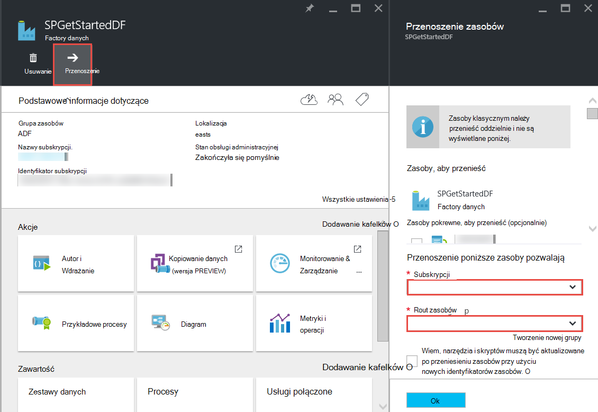

<properties 
    pageTitle="Factory Azure danych — często zadawane pytania" 
    description="Często zadawane pytania dotyczące Azure danych Factory." 
    services="data-factory" 
    documentationCenter="" 
    authors="sharonlo101" 
    manager="jhubbard" 
    editor="monicar"/>

<tags 
    ms.service="data-factory" 
    ms.workload="data-services" 
    ms.tgt_pltfrm="na" 
    ms.devlang="na" 
    ms.topic="article" 
    ms.date="09/12/2016" 
    ms.author="shlo"/>

# Factory Azure danych — często zadawane pytania

## Ogólne pytania

### Co to jest Azure Factory danych?

Factory danych jest oparty na chmurze usługi integracji danych tego **zautomatyzowanie poruszania się i przekształcania danych**. Podobnie jak factory uruchamianej sprzętu, aby zrobić materiałów i ich przekształcenie gotowych Factory danych orchestrates istniejących usług, które zbierać dane i przekształcania informacji gotowych do użycia. 
 
Factory danych umożliwia tworzenie sterowanych danymi przepływów pracy przenoszenie danych między zarówno w lokalnym i magazynów chmury jak proces i przekształcania danych przy użyciu usług obliczeń, takich jak usługa Azure HDInsight i analizy Lake danych Azure. Po utworzeniu procesu, który wykonuje akcję, która jest potrzebna, można zaplanować go, aby uruchomić okresowo (co godzina, dzienną, tygodniową itp.).   

Aby uzyskać więcej informacji, zobacz [Omówienie i pojęć klucza](data-factory-introduction.md) . 

### Gdzie można znaleźć cennik szczegóły usługi Azure Factory danych?

Odwiedź [stronę Szczegóły ceny Factory danych] [ adf-pricing-details] uzyskać szczegółowe informacje o cenach dla Factory danych Azure.  

### Jak rozpocząć pracę z Factory danych Azure?

- Omówienie fabryki danych Azure zobacz [Wprowadzenie do Azure danych Factory](data-factory-introduction.md).
- Samouczek na temat **Kopiowanie i przenoszenie danych** przy użyciu kopii aktywności zobacz [Kopiowanie danych z magazynem obiektów Blob platformy Azure do bazy danych SQL Azure](data-factory-copy-data-from-azure-blob-storage-to-sql-database.md).
- Samouczek dotyczący sposób **przekształcania danych** za pomocą usługi HDInsight gałęzi aktywności. Zobacz [danych proces, uruchamiając skrypt gałęzi w klastrze Hadoop](data-factory-build-your-first-pipeline.md) 
  
### Co to jest dostępność region Factory danych?
Factory danych jest dostępna w **Stanach Zjednoczonych zachód** i **Północnej Europe**. Usługi obliczeń i miejsca do magazynowania, używany przez fabryki danych mogą być w innych regionach. Zobacz [obsługiwane regionów](data-factory-introduction.md#supported-regions). 
 
### Jakie są ograniczenia dotyczące liczby danych fabryki i procesy i działania/zestawy danych?
 
Zobacz sekcję **Azure danych Factory limity** w artykule [subskrypcji Azure i limity dotyczące usługi, przydziały oraz ograniczenia](../azure-subscription-service-limits.md#data-factory-limits) .

### Co to jest środowisko tworzenia Deweloper z usługą Azure Factory danych?

Autor i tworzenia fabryki danych przy użyciu jednej z następujących czynności:

- **Azure portal**  
   karty Factory danych w portalu Azure stanowią interfejs użytkownika sformatowanego do tworzenia usług ad połączone fabryki danych. **Edytor Factory danych**, który jest również częścią portalu, pozwala na łatwe tworzenie połączonych usług, tabele, zestawy danych i procesy, określając definicje JSON dla tych efektów. Zobacz [Tworzenie pierwszej planowaną danych za pomocą portalu Azure](data-factory-build-your-first-pipeline-using-editor.md) , na przykład sposób tworzyć i wdrażać factory danych za pomocą portalu/Edytor.

- **Program Visual Studio**  
   programu Visual Studio umożliwia tworzenie factory Azure danych. Aby uzyskać szczegółowe informacje, zobacz [Tworzenie pierwszej planowaną danych przy użyciu programu Visual Studio](data-factory-build-your-first-pipeline-using-vs.md) . 

- **Azure programu PowerShell**  
   zobacz [Tworzenie i monitorowanie Azure Factory danych przy użyciu programu PowerShell Azure](data-factory-build-your-first-pipeline-using-powershell.md) dla samouczka i instrukcje dotyczące tworzenia fabryki danych przy użyciu programu PowerShell. Zobacz [Informacje dotyczące poleceń Cmdlet Factory danych] [ adf-powershell-reference] zawartości w bibliotece w witrynie MSDN dokumentacji pełna poleceń cmdlet Factory danych.
   
- **Biblioteka klas .NET**  
   fabryki danych można utworzyć programowo przy użyciu danych Factory .NET SDK. Zobacz [Tworzenie, monitorować i zarządzanie nimi fabryki danych przy użyciu zestawu SDK .NET](data-factory-create-data-factories-programmatically.md) dla instrukcje tworzenia fabryki danych przy użyciu zestawu SDK .NET. Zobacz [Informacje dotyczące biblioteki klas fabrycznych danych] [ msdn-class-library-reference] dokumentacji pełnego zestawu SDK .NET Factory danych.

- **Interfejsu API usługi REST**  
   również umożliwia ujawnionego przez usługę Azure danych Factory interfejsu API usługi REST tworzenie i wdrażanie fabryki danych. Zobacz [Data Factory pozostałych API Reference] [ msdn-rest-api-reference] dla pełna dokumentacja interfejsu API usługi REST Factory danych.
 
- **Azure szablonu Menedżera zasobów** 
   zobacz [Samouczek: tworzenie pierwszej firmie Azure danych przy użyciu szablonu Menedżera zasobów Azure](data-factory-build-your-first-pipeline-using-arm.md) szczegóły źródeł. 

### Czy mogę zmienić nazwę factory danych?
Wartość nie. Podobnie jak inne zasoby Azure nie można zmienić nazwy fabryki Azure danych. 

### Czy można przenosić factory danych z jedną subskrypcję Azure do innego? 
Wartość Tak. Użyj przycisku **przenieść** na usługi karta factory danych, jak pokazano na poniższym diagramie. 

### Co to są środowiskach obliczeń obsługiwanych przez Factory danych?
Poniższa tabela zawiera listę środowiskach obliczeń obsługiwanych przez Factory danych i działania, które można uruchamiać na ich. 

| Obliczanie środowiska | działania |
| ------------------- | -------- | 
| [Klaster HDInsight na żądanie](data-factory-compute-linked-services.md#azure-hdinsight-on-demand-linked-service) lub [klaster HDInsight](data-factory-compute-linked-services.md#azure-hdinsight-linked-service) | [DotNet](data-factory-use-custom-activities.md) [gałęzi](data-factory-hive-activity.md), [świnka](data-factory-pig-activity.md), [MapReduce](data-factory-map-reduce.md), [Hadoop strumieniowego przesyłania](data-factory-hadoop-streaming-activity.md) | 
| [Azure partii](data-factory-compute-linked-services.md#azure-batch-linked-service) | [DotNet](data-factory-use-custom-activities.md) |  
| [Nauka Azure komputera](data-factory-compute-linked-services.md#azure-machine-learning-linked-service) | [Stanowiska nauki działań: aktualizacja zasobów i wsadowe](data-factory-azure-ml-batch-execution-activity.md) |
| [Analizy Lake Azure danych](data-factory-compute-linked-services.md#azure-data-lake-analytics-linked-service) | [U Lake analizy danych SQL](data-factory-usql-activity.md)
| [Azure SQL](data-factory-compute-linked-services.md#azure-sql-linked-service) [Azure SQL magazynu danych](data-factory-compute-linked-services.md#azure-sql-data-warehouse-linked-service) [programu SQL Server](data-factory-compute-linked-services.md#sql-server-linked-service) | [Procedura składowana](data-factory-stored-proc-activity.md)

## Działania — często zadawane pytania
### Co to są różne typy działania, które są dostępne w potoku Factory danych? 

- [Działania przepływu danych](data-factory-data-movement-activities.md) do przenoszenia danych.
- [Działania przekształcania danych](data-factory-data-transformation-activities.md) do procesu i przekształcania danych. 

### Gdy działa działanie?
Ustawienie konfiguracji **dostępność** w tabeli danych wyników określa uruchomienia działania. Jeśli podano zestawy danych wejściowych, działania sprawdza, czy są spełnione wszystkie zależności danych wejściowych (stan **Gotowe** ) przed jego uruchamiania. 

## Kopiowanie działanie — często zadawane pytania
### Lepiej jest planowana z wielu działań lub potok oddzielnych dla każdej czynności? 
Procesy ma zawierać pokrewnych działań. Jeśli zestawy danych, które je łączą nie są używane przez inne działania poza proces, możesz zachować działań w jednym potoku. W ten sposób nie potrzebuje do aktywnego okresów planowana łańcucha tak, aby były wyrównane ze sobą. Ponadto integralności danych w tabelach wewnętrzne proces lepiej jest zachowywany podczas aktualizowania proces. Aktualizacja planowana zasadniczo przestaje wszystkich czynności wykonywanych w ramach procesu, usuwa je i tworzy je ponownie. Z perspektywy do tworzenia, może być także lepiej widoczne przepływu danych pokrewnych działań w jednym pliku JSON procesu.

### Co to są obsługiwane magazynów?
[AZURE.INCLUDE [data-factory-supported-data-stores](../../includes/data-factory-supported-data-stores.md)]

### Co to są obsługiwane formaty plików? 
[AZURE.INCLUDE [data-factory-file-format](../../includes/data-factory-file-format.md)]

### Gdzie jest wykonywane operacji kopiowania 
Zobacz sekcję [przenoszenia danych dostępne globalnie](data-factory-data-movement-activities.md#global) , aby uzyskać szczegółowe informacje. Krótko mówiąc w przypadku lokalnego magazynu danych jest operacja kopiowania jest wykonywane przez bramy zarządzania danymi w środowisku lokalnym. A w przypadku przenoszenia danych między dwoma magazynami w chmurze, przeprowadzana jest operacja kopii w regionie najbliżej miejsca sink w tym samym geograficznych. 

## Usługa HDInsight aktywności — często zadawane pytania

### Jakie regiony są obsługiwane przez usługi HDInsight?

W sekcji dostępność geograficzne w następujący artykuł: lub [Szczegóły ceny HDInsight][hdinsight-supported-regions].

### Jakie region jest używany przez klaster HDInsight na żądanie?

Klaster HDInsight na żądanie jest tworzony w tym samym regionie, w którym istnieje przestrzeni dyskowej, określonej może być używany z klastrem.    

### Jak skojarzyć konta dodatkowego miejsca do magazynowania, aby klaster HDInsight?

Jeśli używasz własnego klaster HDInsight (BYOC - wyświetlić swój własny klaster), zobacz następujące tematy: 

- [Klaster HDInsight za pomocą konta magazynu alternatywnego i Metastores][hdinsight-alternate-storage]
- [Używanie kont dodatkowego miejsca do magazynowania z gałęzi HDInsight][hdinsight-alternate-storage-2]

Jeśli korzystasz z klaster na żądanie, który jest tworzona przez usługę Factory danych, określić kont dodatkowego miejsca do magazynowania dla HDInsight połączone usługi, dzięki czemu usługę Factory danych można zarejestrować je w Twoim imieniu. W definicji JSON usługi połączone na żądanie Określ konta magazynu alternatywnego, jak pokazano w poniższej wstawek JSON za pomocą właściwości **additionalLinkedServiceNames** :
 
    {
        "name": "MyHDInsightOnDemandLinkedService",
        "properties":
        {
            "type": "HDInsightOnDemandLinkedService",
            "typeProperties": {
                "clusterSize": 1,
                "timeToLive": "00:01:00",
                "linkedServiceName": "LinkedService-SampleData",
                "additionalLinkedServiceNames": [ "otherLinkedServiceName1", "otherLinkedServiceName2" ] 
            }
        }
    } 

W powyższym przykładzie otherLinkedServiceName1 i otherLinkedServiceName2 reprezentuje połączonych usług, których definicje zawierają poświadczeń, które ma dostęp do kont magazynu alternatywnego klaster HDInsight.

## Wycinki — często zadawane pytania

### Dlaczego są moje wprowadzania wycinków w stanie gotowości?  
To częsty błąd jest ustawienie właściwości **zewnętrznych** na **PRAWDA** w zestawie wprowadzania danych w przypadku wprowadzania danych zewnętrznych do fabryki danych (nie realizowane przez factory danych). 

W poniższym przykładzie wystarczy tylko **zewnętrznych** ustawiona na PRAWDA na **dataset1**.  

**DataFactory1** Planowana sprzedaż 1: dataset1 -> activity1 -> dataset2 -> activity2 -> Planowana dataset3 2: dataset3 -> activity3 -> dataset4

Jeśli masz inny factory danych przy użyciu procesu, która ma dataset4 (realizowane przez potok 2 w danych factory 1), oznacz dataset4 jako zestaw danych zewnętrznych, ponieważ zestaw danych jest tworzone przez inne dane fabryki (DataFactory1, nie DataFactory2).  

**DataFactory2**    
Planowana sprzedaż 1: dataset4 -> activity4 -> dataset5

Jeśli zewnętrznych właściwość jest poprawnie ustawiona, sprawdź, czy dane wejściowe istnieje w lokalizacji określonej w definicji zestawu danych wejściowych. 

### Jak uruchomić wycinek później niż północ po wycinek jest wyprodukowane codziennie?
Aby określić czas, w którym ma być przedstawiane wycinek, należy użyć właściwości **Przesunięcie** . Zobacz sekcję [Dostępność zestawu danych](data-factory-create-datasets.md#Availability) , aby uzyskać szczegółowe informacje dotyczące tej właściwości. Oto przykład szybkie:

    "availability":
    {
        "frequency": "Day",
        "interval": 1,
        "offset": "06:00:00"
    }

Dzienny wycinków Rozpocznij od **6 AM** zamiast północy domyślne.     

### Jak można uruchomić wycinek?
Wycinek można uruchomić w jednym z następujących sposobów: 

- Uruchom ponownie okno działań lub wycinek przy użyciu Monitor i zarządzanie aplikacji. Aby uzyskać instrukcje, zobacz [Uruchom ponownie wybrane działania systemu windows](data-factory-monitor-manage-app.md#re-run-selected-activity-windows) .   
- Kliknij przycisk **Uruchom** na pasku poleceń na karta **WYCINEK** dla wycinek w portalu Azure.
- Uruchom polecenie cmdlet **Set-AzureRmDataFactorySliceStatus** stanem ustawieniem **Trwa oczekiwanie** wycinek.   
    
        Set-AzureRmDataFactorySliceStatus -Status Waiting -ResourceGroupName $ResourceGroup -DataFactoryName $df -TableName $table -StartDateTime "02/26/2015 19:00:00" -EndDateTime "02/26/2015 20:00:00" 

Zobacz [Konfigurowanie AzureRmDataFactorySliceStatus] [ set-azure-datafactory-slice-status] szczegółowe informacje na temat polecenia cmdlet. 

### Jak długo trwa procesu wycinek?
Aby dowiedzieć się, ile czasu zajęło przetwarzanie wycinek danych za pomocą aktywności okna Eksploratora w monitorze i zarządzanie aplikacji. Aby uzyskać szczegółowe informacje, zobacz [Aktywności okna Eksploratora](data-factory-monitor-manage-app.md#activity-window-explorer) . 

Można też wykonać następujące czynności w portalu Azure:  

1. Kliknij Kafelek **zestawy danych** na karta **FACTORY danych** dla firmie danych.
2. Kliknij pozycję określonego zestawu danych na karta **zestawy danych** .
3. Zaznacz wycinek, który Cię interesuje z listy **ostatnio używanych wycinków** karta **tabeli** .
4. Kliknij działanie, uruchom na liście **Zostanie uruchomiona aktywności** na karta **WYCINEK** . 
5. Kliknij Kafelek **Właściwości** na karta **Szczegóły uruchomić działania** . 
6. Powinien zostać wyświetlony w polu **czas trwania** z wartością. Ta wartość jest czas przetwarzania wycinek.   

### Jak zatrzymać uruchomiony wycinek?
Jeśli potrzebujesz zatrzymać proces wykonywanie, można użyć polecenia cmdlet [AzureRmDataFactoryPipeline wstrzymania](https://msdn.microsoft.com/library/mt603721.aspx) . Obecnie zawieszenia proces nie zatrzymać wykonania wycinek, które są w toku. Po wykonania w trakcie wykonywania zakończyć, nie dodatkowych wycinek zostaje pobrana.

Jeśli na pewno chcesz zatrzymać wszystkie wykonania od razu, jedynym sposobem może być usunąć proces i utworzyć go ponownie. Jeśli wybierzesz opcję usunięcia proces, nie musisz usunąć tabele i połączone usług używanych przez proces. 

[create-factory-using-dotnet-sdk]: data-factory-create-data-factories-programmatically.md
[msdn-class-library-reference]: https://msdn.microsoft.com/library/dn883654.aspx
[msdn-rest-api-reference]: https://msdn.microsoft.com/library/dn906738.aspx

[adf-powershell-reference]: https://msdn.microsoft.com/library/dn820234.aspx 
[azure-portal]: http://portal.azure.com
[set-azure-datafactory-slice-status]: https://msdn.microsoft.com/library/mt603522.aspx

[adf-pricing-details]: http://go.microsoft.com/fwlink/?LinkId=517777
[hdinsight-supported-regions]: http://azure.microsoft.com/pricing/details/hdinsight/
[hdinsight-alternate-storage]: http://social.technet.microsoft.com/wiki/contents/articles/23256.using-an-hdinsight-cluster-with-alternate-storage-accounts-and-metastores.aspx
[hdinsight-alternate-storage-2]: http://blogs.msdn.com/b/cindygross/archive/2014/05/05/use-additional-storage-accounts-with-hdinsight-hive.aspx
 
