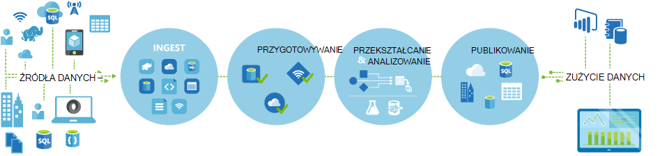
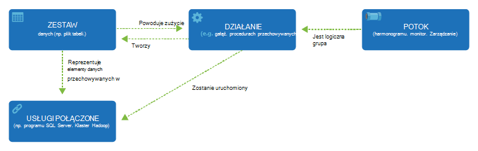

<properties 
    pageTitle="Wprowadzenie do danych fabryki, usługi integracji danych | Microsoft Azure" 
    description="Dowiedz się, co to jest Azure danych Factory: usługi integracji danych w chmurze orchestrates i zautomatyzowanie przepływu i przekształcania danych." 
    keywords="Integracja danych integracji danych w chmurze, co to jest azure danych factory"
    services="data-factory" 
    documentationCenter="" 
    authors="sharonlo101" 
    manager="jhubbard" 
    editor="monicar"/>

<tags 
    ms.service="data-factory" 
    ms.workload="data-services" 
    ms.tgt_pltfrm="na" 
    ms.devlang="na" 
    ms.topic="get-started-article" 
    ms.date="09/22/2016" 
    ms.author="shlo"/>

# Wprowadzenie do usługi Microsoft Azure Factory danych, usługi integracji danych w chmurze

## Co to jest Azure Factory danych? 
Factory danych to usługa integracji danych opartych na chmurze, która orchestrates i zautomatyzować **poruszania** się i **przekształcania** danych. Możesz utworzyć rozwiązań integracji danych przy użyciu usługi Factory danych można mogły zjeść tej ostatniej danych z różnych baz danych, procesu przekształcania danych i publikowanie dane wynikowe ze zbioru danych. 

Usługa Factory danych umożliwia tworzenie kanał danych przenoszenie i przekształcania danych, a następnie uruchom procesy według określonego harmonogramu (godzina, codziennie, co tydzień, itp.). Umożliwia także zaawansowanych wizualizacji, aby wyświetlić dotyczące elementów nadrzędnych i zależności między procesy z danymi, a monitorowanie usługi procesy danych z pojedynczego widoku ujednolicony w celu łatwego określenia problemów i konfigurowanie monitorowania alertów.

**Figure1.** Mogły zjeść tej ostatniej danych z różnych źródeł danych, przygotowywanie, Przekształć, analizy danych i potem publikować dane zawsze gotowe do użycia dla zużycie.

## Potoki i działania
W rozwiązaniu Factory danych możesz utworzyć jeden lub więcej danych **procesy**. Potok jest logiczna grupa działań. Są one używane do działania grupy w jednostkę wykonujących zadania. 

**Działania** zdefiniuj akcje do wykonania na danych. Za pomocą działaniem kopii może być na przykład, skopiuj dane z magazynu jednego danych do innego magazynu danych. Podobnie możesz użyć działalność gałęzi, która uruchamia kwerendę gałęzi w klastrze Azure HDInsight Przekształcanie i analizowanie danych. Factory danych obsługuje dwa typy działań: działania przepływu danych i działania przekształcania danych. 
  
## Działania przepływu danych 
[AZURE.INCLUDE [data-factory-supported-data-stores](../../includes/data-factory-supported-data-stores.md)]

Zobacz artykuł [Działania przepływu danych](data-factory-data-movement-activities.md) , aby uzyskać więcej informacji. 

## Działania przekształcania danych
[AZURE.INCLUDE [data-factory-transformation-activities](../../includes/data-factory-transformation-activities.md)]

Zobacz artykuł [Działania przekształcania danych](data-factory-data-transformation-activities.md) uzyskać więcej szczegółowych informacji.

Jeśli trzeba przenieść dane z danych zawierają że aktywności kopii nie obsługuje, lub Przekształcanie danych za pomocą własnego logiki, Utwórz **Niestandardowe działania .NET**. Aby uzyskać szczegółowe informacje na temat tworzenia i używania niestandardowe działania zobacz [Używanie niestandardowe działania w potoku Azure danych Factory](data-factory-use-custom-activities.md).

## Usługi połączone
Usługi połączone Definiowanie informacji potrzebnych do fabryki danych, aby połączyć się z zasobami zewnętrznych (przykłady: Magazyn Azure SQL Server Azure HDInsight lokalnego). Usługi połączone są używane na potrzeby dwóch w Factory danych:

- Reprezentować **przechowywania danych** w tym, ale nie wyłącznie, SQL Server w lokalnej bazy danych Oracle pliku Udostępnij lub konta usługi Magazyn obiektów Blob platformy Azure. Zobacz sekcję [działania przepływu danych](data-factory-data-movement-activities.md) dla listy obsługiwanych magazynów. 
- Reprezentować **obliczyć zasobów** który może zawierać wykonanie działania. Na przykład aktywności HDInsightHive jest uruchamiany w klastrze HDInsight Hadoop. Zobacz sekcję [działania przekształcania danych](data-factory-data-transformation-activities.md) dla listy obsługiwanych środowiskach obliczeń. 

## Zestawy danych 
Usługi połączone połączyć magazynów factory Azure danych. Zestawy danych reprezentują struktury danych z ze zbioru danych. Na przykład usługa magazynu Azure połączone zawiera informacje o połączeniu dla Factory danych do łączenia się z kontem magazyn Azure. Zestaw obiektów Blob platformy Azure określa obiektów blob kontener i folderów w magazynie obiektów Blob platformy Azure, z którego proces odczytywane dane. Podobnie usługa SQL Azure połączone zawiera informacje o połączeniu dla bazy danych programu Azure SQL i zestaw danych Azure SQL Określa tabelę, która zawiera dane.   

## Relacja między obiektami Factory danych
Factory danych zawiera kilka kluczowych jednostki, które współpracują ze sobą zdefiniować dane wejściowe i wyjściowe dane, przetwarzania zdarzenia oraz harmonogram i zasoby wymagany do wykonania przepływu żądane dane.

**Rysunek 2.** Relacje między usługi zestawu danych, działania, planowana i połączone

Z czterech prostych pojęcia usługi połączone, zestawy danych, działania i procesy masz chcesz zacząć pracę! Możesz [utworzyć pierwszy planowaną sprzedażą](data-factory-build-your-first-pipeline.md). 

## Obsługiwanych regionów
Obecnie możesz utworzyć fabryki danych w regionach **Zachód Stanów Zjednoczonych**, **USA Wschodniej**i **Północnej Europe** . Jednak factory danych można uzyskać dostęp do danych i obliczenia usług w innych regionach Azure przenoszenie danych między magazynów lub obliczyć proces danych przy użyciu usług. 

Azure Factory danych sam jakiekolwiek dane nie są zapisywane. Umożliwia tworzenie przepływów opartych na danych, aby dodać akompaniament przepływu danych między [obsługiwane magazynów](data-factory-data-movement-activities.md#supported-data-stores) i przetwarzanie danych za pomocą [obliczenia usług](data-factory-compute-linked-services.md) w innych regionach lub w środowisku lokalnym. Również umożliwia do [monitorowania i zarządzania przepływów pracy](data-factory-monitor-manage-pipelines.md) przy użyciu zarówno programistyczny i mechanizmy interfejsu użytkownika. 

Mimo że Azure Factory danych jest dostępna w **USA zachód**, **Wschodniego Stany Zjednoczone**i regionów w **Europie północnej** , usługę zasilania przenoszenia danych w Factory danych jest dostępne [globalnie](data-factory-data-movement-activities.md#global) w kilku regionach. W przypadku magazynu danych znajduje za zaporą następnie [Bramy zarządzania danymi](data-factory-move-data-between-onprem-and-cloud.md) zainstalowanych w środowisku lokalnym zamiast tego przenosi dane. 

Na przykład załóżmy usługi środowiskach obliczeń, takich jak usługa Azure HDInsight klaster i Azure maszynowego uczenia brakuje regionie Zachód Europe. Można tworzyć i używając wystąpienia Factory danych Azure w Europie północnej i umożliwia planowanie zadań na swojej środowiskach obliczeń w Europie Zachód. Wystarczy kilka milisekundach Factory danych wyzwalać zadanie w środowisku obliczeń, ale nie zmienia się czas wykonywania zadania w środowisku komputerowym.

Mają być Factory danych Azure w każdej Geografia obsługiwanych przez Azure w przyszłości.
  
## Następne kroki
Aby dowiedzieć się, jak tworzyć fabryki danych przy użyciu danych procesy, wykonaj instrukcje krok po kroku w następujące samouczki. 

Samouczek | Opis
-------- | -----------
[Tworzenie przetwarzającym danych przy użyciu Hadoop klaster potok danych](data-factory-build-your-first-pipeline.md) | W tym samouczku konstruujesz firmie pierwszego Azure danych z potoku danych **danych procesów** , uruchamiając skrypt gałęzi w klastrze Azure HDInsight (Hadoop). |
[Tworzenie procesu danych, przenoszenie danych między dwoma zbiorów danych chmury](data-factory-copy-data-from-azure-blob-storage-to-sql-database.md) | W tym samouczku możesz utworzyć factory danych z potok tego **przenosi dane** z magazynem obiektów Blob do bazy danych SQL.
[Tworzenie procesu danych, przenoszenie danych między lokalnego magazynu danych i magazynu danych chmurze za pomocą bramy zarządzania danymi](data-factory-move-data-between-onprem-and-cloud.md) | W tym samouczku tworzenia fabryki danych z potok tego **Przeniesienie danych** z bazy danych programu SQL Server **lokalnego** do obiektów blob platformy Azure. Jako część Instruktaż zainstalować i skonfigurować bramę zarządzania danymi na komputerze. 
