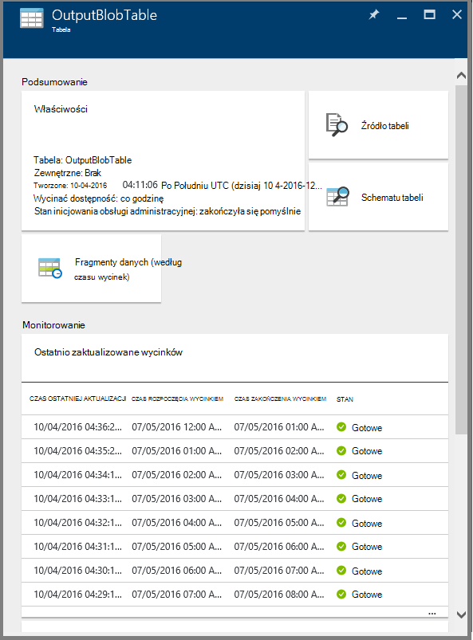
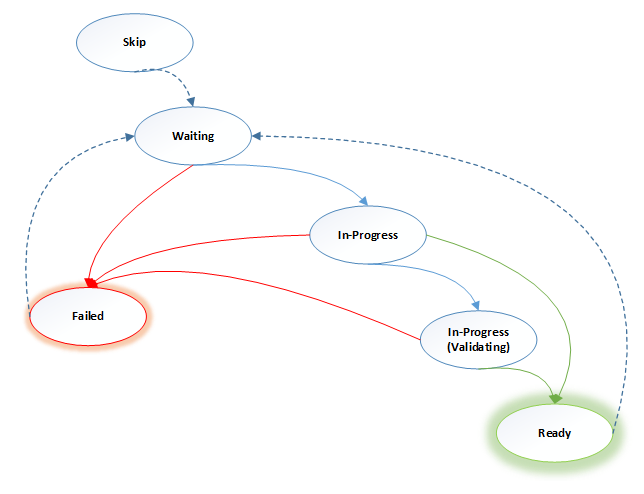

<properties 
    pageTitle="Monitorowanie i zarządzanie nimi procesy Factory danych Azure" 
    description="Dowiedz się, jak monitorowanie i zarządzanie danymi Azure fabryki procesy, które zostały utworzone przy użyciu Azure Portal i Azure programu PowerShell." 
    services="data-factory" 
    documentationCenter="" 
    authors="spelluru" 
    manager="jhubbard" 
    editor="monicar"/>

<tags 
    ms.service="data-factory" 
    ms.workload="data-services" 
    ms.tgt_pltfrm="na" 
    ms.devlang="na" 
    ms.topic="article" 
    ms.date="09/06/2016" 
    ms.author="spelluru"/>

# Monitorowanie i zarządzanie nimi procesy Factory danych Azure
> [AZURE.SELECTOR]
- [Za pomocą portal Azure-Azure programu PowerShell](data-factory-monitor-manage-pipelines.md)
- [Za pomocą monitorowania i zarządzania aplikacji](data-factory-monitor-manage-app.md)

Usługa Factory danych zapewnia widok wiarygodnych i wykonania usługi przepływu przechowywania, przetwarzania i danych. Usługa udostępnia monitorowania ułatwia pulpitu nawigacyjnego, które umożliwiają wykonywanie następujących zadań: 

- Szybko ocenić kondycji planowana zakończenia do końca danych.
- Identyfikowanie problemów i podejmowania działań naprawczych w razie potrzeby. 
- Śledzenie danych dotyczące elementów nadrzędnych. 
- Śledzenie relacji między w dowolnej z własnych źródeł danych.
- Wyświetlanie pełnego historycznych accounting wykonywania zadań, kondycji systemu i zależności.

W tym artykule opisano, jak można monitorować, zarządzanie i debugowania usługi procesy. Zawiera także informacje na temat tworzenia alertów i otrzymywanie powiadomień o błędzie.

## Opis potoki i stany aktywności
Za pomocą portalu Azure, możesz wykonać następujące czynności:

- Wyświetlanie firmie danych jako diagramu
- Wyświetlanie działań związanych z w potoku
- Wyświetlanie wejściowe i wyjściowe zestawy danych
- i nie tylko. 

Ta sekcja zawiera również, jak wycinek przejścia z jednego stanu do innego stanu.   

### Przejdź do swojej factory danych
1.  Zaloguj się do [portalu Azure](https://portal.azure.com).
2.  W menu po lewej stronie, kliknij polecenie **fabryki danych** . Jeśli nie widzisz, kliknij pozycję **więcej usług >** i kliknij opcję **fabryki danych** w kategorii **analizy + analizy** . 

    

    Powinien zostać wyświetlony wszystkich fabryki danych karta **fabryki danych** . 
4. W karta fabryki danych wybierz factory danych, który Cię interesuje.

      
5.  i powinna być widoczna strona główna (karta**dane factory** ) factory danych.

    

#### Widok diagramu z fabryki danych
Widok diagramu factory danych zawiera jednego okienka szkła do monitorowania i zarządzania factory danych i jego aktywów.

Aby wyświetlić podgląd diagramu firmie danych, kliknij pozycję **Diagram** na stronie głównej factory danych.

Możesz powiększyć, pomniejszyć, Powiększ do dopasowania, powiększenie 100% blokowanie układu diagramu i automatycznie Rozmieść potoki i tabel. Można też wyświetlić informacje dotyczące elementów nadrzędnych danych (Pokaż powyżej i poniżej elementy zaznaczone elementy).
 

### Czynności wykonywanych w potoku 
1. Kliknij prawym przyciskiem myszy proces, a następnie kliknij pozycję **Otwórz planowana** Aby wyświetlić wszystkie działania w potoku wraz z wejściowe i wyjściowe zestawy danych działań. Ta funkcja jest przydatny, gdy planowaną składa się z więcej niż jedną działalność i chcesz opis działania dotyczące elementów nadrzędnych pojedynczego procesu.

      
2. W poniższym przykładzie widać dwa działania w potoku z ich dane wejściowe i wyjściowe. Działanie **JoinData** typu działania gałęzi HDInsight oraz **EgressDataAzure** typu działania kopii są w tym potoku przykładowe. 
    
     
3. Powrót do strony głównej Factory danych można przejść, klikając łącze factory danych w łącza do stron nadrzędnych w lewym górnym rogu.

    

### Stan każdej czynności wewnątrz potok widoku
Możesz wyświetlić bieżący stan aktywności, wyświetlając stanu zestawy danych, tworzone przez to działanie. 

Na przykład: w tym przykładzie **BlobPartitionHiveActivity** działał poprawnie i wyprodukowano zestaw danych o nazwie **PartitionedProductsUsageTable**, który jest **gotowa** do drukowania.

Dwukrotne kliknięcie **PartitionedProductsUsageTable** w widoku diagramu ilustrację wszystkie wycinki tworzone przez różne działania zostanie uruchomiona w potoku. Widać, że **BlobPartitionHiveActivity** działał poprawnie co miesiąc dla ostatnie osiem miesięcy i wyprodukowane wycinków **gotowa** do drukowania.

Wycinki zestawu danych factory danych może mieć jeden z następujących statusów:

<table>
<tr>
    <th align="left">Województwo</th><th align="left">Substrat</th><th align="left">Opis</th>
</tr>
<tr>
    <td rowspan="8">Oczekiwanie</td><td>ScheduleTime</td><td>Aby uzyskać wycinek uruchomić nie nadszedł czas.</td>
</tr>
<tr>
<td>DatasetDependencies</td><td>Zależności nadrzędny nie są gotowe.</td>
</tr>
<tr>
<td>ComputeResources</td><td>Zasoby komputerowe nie są dostępne.</td>
</tr>
<tr>
<td>ConcurrencyLimit</td> <td>Wszystkie wystąpienia aktywności są zajęte, uruchamiania innych wycinki.</td>
</tr>
<tr>
<td>ActivityResume</td><td>Działanie została wstrzymana i nie można uruchomić wycinki, dopóki nie jest wznawiane.</td>
</tr>
<tr>
<td>Spróbuj ponownie</td><td>Wykonanie działania zostanie wykonana ponownie.</td>
</tr>
<tr>
<td>Sprawdzanie poprawności</td><td>Sprawdzanie poprawności nie została jeszcze rozpoczęta.</td>
</tr>
<tr>
<td>ValidationRetry</td><td>Oczekiwanie na sprawdzania poprawności ponowienia.</td>
</tr>
<tr>
<tr
<td rowspan="2">Trakcie wykonywania</td><td>Sprawdzanie poprawności</td><td>Sprawdzanie poprawności informacji o postępie.</td>
</tr>
<td></td>
<td>Wycinek jest przetwarzana.</td>
</tr>
<tr>
<td rowspan="4">Nie powiodła się</td><td>Upłynął limit czasu</td><td>Wykonanie trwała dłużej niż którego jest dozwolony przez to działanie.</td>
</tr>
<tr>
<td>Anulowane</td><td>Anulowane przez użytkownika akcji.</td>
</tr>
<tr>
<td>Sprawdzanie poprawności</td><td>Sprawdzanie poprawności nie powiodło się.</td>
</tr>
<tr>
<td></td><td>Nie można wygenerować i/lub sprawdzić poprawność wycinek.</td>
</tr>
<td>Gotowe</td><td></td><td>Wycinek jest gotowy do zużycie.</td>
</tr>
<tr>
<td>Pominięte</td><td></td><td>Wycinek nie jest przetwarzana.</td>
</tr>
<tr>
<td>Brak</td><td></td><td>Wycinek używane z inny stan, które zostało zresetowane.</td>
</tr>
</table>

Możesz wyświetlić szczegółowe informacje dotyczące wycinek, klikając pozycję wycinek wpisowi karta **Ostatnio zaktualizowane wycinki** .

 
Jeśli wykonano wycinek wielokrotnie, pojawi się wiele wierszy na liście **aktywności jest uruchomiony** . Możesz wyświetlić szczegółowe informacje dotyczące aktywności, uruchamianie, klikając pozycję Uruchom pozycję na liście **aktywności jest uruchomiony** . Lista zawiera wszystkie pliki dziennika oraz komunikat o błędzie, jeśli istnieją. Ta funkcja jest przydatna do wyświetlania i debugowanie dzienniki bez opuszczania firmie danych.

Jeśli wycinek nie jest w stanie **gotowości** , zobaczysz nadrzędny wycinki, które nie są gotowe i blokują bieżący fragment wykonywanie na liście **nadrzędny wycinki, które są nie jest gotowy** . Ta funkcja jest przydatny, gdy usługi wycinek jest w stanie **oczekiwania** i chcesz zrozumieć zależności nadrzędny, na których oczekuje wycinek.

### Diagram stanu zestawu danych
Po wdrażanie factory danych i procesy mają prawidłowe aktywnego okresu, zestawu danych plasterki przejście z jednego stanu do innego. Obecnie stan wycinek obejmuje następujące diagram stanu:

Przepływ przejścia stanu zestawu danych w factory danych: W toku i w toku (Validating) -> oczekiwania -> gotowe i nie powiodła się

Rozpocznij wycinków w stanie **oczekiwania** warunki wstępne, które muszą być spełnione przed wykonaniem. Następnie rozpoczęciem wykonywania działania i przechodzi wycinek w stanie **W toku** . Wykonanie działania powiodła się lub zakończyć się niepowodzeniem. Wycinek jest oznaczony jako **gotowy**"lub **nie powiodło się** na podstawie wyniku wykonania. 

Możesz zresetować wycinek, aby przejść wstecz **gotowy** lub **nie powiodło się** **Oczekiwanie** stan. Można również oznaczyć Państwo wycinek **Pomiń**, co uniemożliwi wykonywanie czynności i przetwarza wycinek.

## Zarządzanie procesy
Możesz zarządzać usługi procesy przy użyciu programu PowerShell Azure. Można na przykład wstrzymywać i wznowienie procesy, uruchamiając Azure poleceń cmdlet. 

### Wstrzymywanie i wznawianie procesy
Można Wstrzymaj/wstrzymać procesy przy użyciu polecenia cmdlet programu Powershell **AzureRmDataFactoryPipeline wstrzymania** . To polecenie cmdlet jest przydatny, gdy nie chcesz, aby uruchomić usługi procesy problem został rozwiązany.

Na przykład: na poniższym obrazie zrzut wykryto problem z **PartitionProductsUsagePipeline** w **productrecgamalbox1dev** factory danych i chcemy zawieszenia proces.

Aby wstrzymać potok, uruchom następujące polecenia programu PowerShell:

    Suspend-AzureRmDataFactoryPipeline [-ResourceGroupName] <String> [-DataFactoryName] <String> [-Name] <String>

Na przykład:

    Suspend-AzureRmDataFactoryPipeline -ResourceGroupName ADF -DataFactoryName productrecgamalbox1dev -Name PartitionProductsUsagePipeline 

Po skorygowaniu problem z **PartitionProductsUsagePipeline**potoku zawieszone można wznowić przy użyciu następującego polecenia programu PowerShell:

    Resume-AzureRmDataFactoryPipeline [-ResourceGroupName] <String> [-DataFactoryName] <String> [-Name] <String>

Na przykład:

    Resume-AzureRmDataFactoryPipeline -ResourceGroupName ADF -DataFactoryName productrecgamalbox1dev -Name PartitionProductsUsagePipeline 

## Debugowanie procesy
Azure Factory danych zapewnia możliwości sformatowanego przez Azure portal i Azure programu PowerShell do debugowania i rozwiązywanie problemów z procesy.

### Znajdowanie błędów w potoku
Jeśli Uruchom działanie kończy się niepowodzeniem w potoku, zestawu danych, tworzone przez proces jest w stanie błędu z powodu błędu. Możesz debugowanie i rozwiązywanie problemów z błędami w Factory danych Azure za pomocą następujących mechanizmy.

#### Azure portal umożliwia debugowanie komunikat o błędzie:

3.  W karta **tabeli** kliknij wycinek problem z **stanu** **nie powiodła się**.

    
4.  W karta **WYCINEK** kliknij działanie, którego nie można uruchomić.
    
    
5.  W karta **Szczegóły uruchomić działania** możesz pobrać pliki skojarzone z przetwarzanie HDInsight. Kliknij pozycję Pobierz dla stanu/stderr do pobrania pliku dziennika błędów, który zawiera szczegółowe informacje o błędzie.

      

#### Używanie programu PowerShell debugowania błędów
1.  Uruchom program **Azure PowerShell**.
3.  Uruchom polecenie **Get-AzureRmDataFactorySlice** wycinków i informacjami o ich stanie. Powinien zostać wyświetlony wycinek ze stanem: **nie powiodło się**.       

            Get-AzureRmDataFactorySlice [-ResourceGroupName] <String> [-DataFactoryName] <String> [-TableName] <String> [-StartDateTime] <DateTime> [[-EndDateTime] <DateTime> ] [-Profile <AzureProfile> ] [ <CommonParameters>]
    
    Na przykład:
        
            Get-AzureRmDataFactorySlice -ResourceGroupName ADF -DataFactoryName LogProcessingFactory -TableName EnrichedGameEventsTable -StartDateTime 2014-05-04 20:00:00

    Zamień **początekDataCzas** wybrane do AzureRmDataFactoryPipelineActivePeriod ustaw wartość początekDataCzas.
4. Teraz uruchomić polecenia cmdlet **Get-AzureRmDataFactoryRun** , aby uzyskać szczegółowe informacje dotyczące aktywności uruchamianie dla wycinek.

        Get-AzureRmDataFactoryRun [-ResourceGroupName] <String> [-DataFactoryName] <String> [-TableName] <String> [-StartDateTime] 
        <DateTime> [-Profile <AzureProfile> ] [ <CommonParameters>]
    
    Na przykład:

        Get-AzureRmDataFactoryRun -ResourceGroupName ADF -DataFactoryName LogProcessingFactory -TableName EnrichedGameEventsTable -StartDateTime "5/5/2014 12:00:00 AM"

    Wartość argumentu początekDataCzas jest godzina rozpoczęcia wycinek błędu/problem, który możesz zauważyć, że w poprzednim kroku. Daty i godziny, należy ująć w podwójny cudzysłów.
5.  Powinien zostać wyświetlony wynik ze szczegółami (podobny do następującego) komunikat o błędzie:

            Id                      : 841b77c9-d56c-48d1-99a3-8c16c3e77d39
            ResourceGroupName       : ADF
            DataFactoryName         : LogProcessingFactory3
            TableName               : EnrichedGameEventsTable
            ProcessingStartTime     : 10/10/2014 3:04:52 AM
            ProcessingEndTime       : 10/10/2014 3:06:49 AM
            PercentComplete         : 0
            DataSliceStart          : 5/5/2014 12:00:00 AM
            DataSliceEnd            : 5/6/2014 12:00:00 AM
            Status                  : FailedExecution
            Timestamp               : 10/10/2014 3:04:52 AM
            RetryAttempt            : 0
            Properties              : {}
            ErrorMessage            : Pig script failed with exit code '5'. See wasb://     adfjobs@spestore.blob.core.windows.net/PigQuery
                                            Jobs/841b77c9-d56c-48d1-99a3-
                        8c16c3e77d39/10_10_2014_03_04_53_277/Status/stderr' for
                        more details.
            ActivityName            : PigEnrichLogs
            PipelineName            : EnrichGameLogsPipeline
            Type                    :
    
    
6.  Polecenie cmdlet **AzureRmDataFactoryLog Zapisz** można uruchamiać z identyfikatorem Zobacz z danych wyjściowych i pobieranie plików dziennika przy użyciu **-DownloadLogsoption** dla polecenia cmdlet.

            Save-AzureRmDataFactoryLog -ResourceGroupName "ADF" -DataFactoryName "LogProcessingFactory" -Id "841b77c9-d56c-48d1-99a3-8c16c3e77d39" -DownloadLogs -Output "C:\Test"

## Uruchom ponownie błędy w potoku

### Za pomocą portalu Azure

Po Rozwiązywanie problemów i debugowania błędów w potoku, przechodząc do wycinek błędu, a kliknięcie przycisku **Uruchom** na pasku poleceń można uruchomić błędy.

W przypadku, gdy wycinek zostało zakończone niepowodzeniem sprawdzania poprawności ze względu na błąd zasad (dla ex: dane nie są dostępne), można naprawić błąd i ponownie sprawdź poprawność, klikając przycisk **Sprawdź poprawność** na pasku poleceń.

### Przy użyciu programu PowerShell Azure

Błędy, można uruchomić program przy użyciu polecenia cmdlet Set-AzureRmDataFactorySliceStatus. Zobacz temat [Ustawianie AzureRmDataFactorySliceStatus](https://msdn.microsoft.com/library/mt603522.aspx) składnię i inne szczegóły na temat polecenia cmdlet. 

**Przykład:** Poniższy przykład ustawia stan wszystkich fragmentów tabeli "DAWikiAggregatedData" oczekiwania w factory Azure danych "WikiADF".

UpdateType jest ustawiona na UpstreamInPipeline, co oznacza, że statusy każdego wycinka dla tabeli i wszystkie tabele zależne (nadrzędny) są ustawione "Oczekiwanie". Inne możliwe wartości dla tego parametru jest "Osoby".

    Set-AzureRmDataFactorySliceStatus -ResourceGroupName ADF -DataFactoryName WikiADF -TableName DAWikiAggregatedData -Status Waiting -UpdateType UpstreamInPipeline -StartDateTime 2014-05-21T16:00:00 -EndDateTime 2014-05-21T20:00:00

## Tworzenie alertów
Dzienniki Azure użytkownika zdarzenia, gdy zasób Azure (na przykład factory danych) jest utworzony, zaktualizowane lub usunięte. Alerty można tworzyć na te zdarzenia. Factory danych pozwala na przechwytywanie różnych metryki i tworzenie alertów na metryki. Firma Microsoft zaleca używanie zdarzeń monitorowania i metryki w czasie rzeczywistym w celach historycznych. 

### Alerty na zdarzenia
Zdarzenia Azure zapewniają przydatne spostrzeżeń co się dzieje w Azure zasobów. Dzienniki Azure użytkownika zdarzenia, gdy zasób Azure (na przykład factory danych) jest utworzony, zaktualizowane lub usunięte. Podczas korzystania z platformy Azure Factory danych zdarzenia są generowane, gdy:

- Azure Factory danych jest utworzone/zaktualizowane i usunięte.
- Przetwarzania danych (nazywane jako zostanie uruchomiona) zostało uruchomione ukończone.
- Klaster HDInsight na żądanie jest tworzony i usunięte.

Można tworzyć alerty na temat tych przypadków użytkownika i skonfigurować je do wysyłania powiadomień e-mail do administratora i administratorów współpracujących subskrypcji. Ponadto można określić kolejnych adresów e-mail użytkowników, którzy chcą otrzymywać powiadomienia e-mail, gdy warunki są spełnione. Ta funkcja jest przydatne, gdy chcesz otrzymywanie powiadomień o błędzie i nie chcesz, aby stale monitorować firmie danych.

> [AZURE.NOTE] Obecnie portalu nie są wyświetlane alerty o zdarzeniach. Aby wyświetlić wszystkie alerty, użyj [monitorowania i zarządzania aplikacji](data-factory-monitor-manage-app.md) .

#### Określanie definicji alert:
Aby określić definicji alertów, możesz utworzyć plik JSON opisujący operacji, które chcesz otrzymywać alerty na. W poniższym przykładzie alert wysyła wiadomości e-mail z powiadomieniem operacji RunFinished. Na konkretnym powiadomienie e-mail jest wysyłana po zakończeniu uruchom w factory danych i uruchom nie powiodło się (stan = FailedExecution).

    {
        "contentVersion": "1.0.0.0",
         "$schema": "http://schema.management.azure.com/schemas/2014-04-01-preview/deploymentTemplate.json#",
        "parameters": {},
        "resources": 
        [
            {
                "name": "ADFAlertsSlice",
                "type": "microsoft.insights/alertrules",
                "apiVersion": "2014-04-01",
                "location": "East US",
                "properties": 
                {
                    "name": "ADFAlertsSlice",
                    "description": "One or more of the data slices for the Azure Data Factory has failed processing.",
                    "isEnabled": true,
                    "condition": 
                    {
                        "odata.type": "Microsoft.Azure.Management.Insights.Models.ManagementEventRuleCondition",
                        "dataSource": 
                        {
                            "odata.type": "Microsoft.Azure.Management.Insights.Models.RuleManagementEventDataSource",
                            "operationName": "RunFinished",
                            "status": "Failed",
                            "subStatus": "FailedExecution"   
                        }
                    },
                    "action": 
                    {
                        "odata.type": "Microsoft.Azure.Management.Insights.Models.RuleEmailAction",
                        "customEmails": [ "<your alias>@contoso.com" ]
                    }
                }
            }
        ]
    }

Z definicji JSON **podstanu** można usunąć, jeśli nie chcesz, aby otrzymywać alerty o określonych awarii.

W tym przykładzie alertem o dla wszystkich fabryki danych w ramach subskrypcji. Jeśli chcesz alert dla factory danych, można określić factory danych **resourceUri** w **źródła danych**:

    "resourceUri" : "/SUBSCRIPTIONS/<subscriptionId>/RESOURCEGROUPS/<resourceGroupName>/PROVIDERS/MICROSOFT.DATAFACTORY/DATAFACTORIES/<dataFactoryName>"

Poniższa tabela zawiera listę dostępnych operacji i statusy (i statusy podrzędny).

Nazwa operacji | Stan | Stan Sub
-------------- | ------ | ----------
RunStarted | Wprowadzenie | Uruchamianie
RunFinished | Nie powiodło się / zakończyła się pomyślnie | FailedResourceAllocation  Zakończyła się pomyślnie  FailedExecution  Upłynął limit czasu  < anulowana  FailedValidation  Porzucone.
OnDemandClusterCreateStarted | Wprowadzenie
OnDemandClusterCreateSuccessful | Zakończyła się pomyślnie
OnDemandClusterDeleted | Zakończyła się pomyślnie

Aby uzyskać szczegółowe informacje o elementach JSON w przykładzie użyto, zobacz [Tworzenie alertu](https://msdn.microsoft.com/library/azure/dn510366.aspx) . 

#### Wdrażanie alertu 
Aby wdrożyć alert, użyj polecenia cmdlet programu PowerShell Azure: **Nowy AzureRmResourceGroupDeployment**, jak pokazano w poniższym przykładzie:

    New-AzureRmResourceGroupDeployment -ResourceGroupName adf -TemplateFile .\ADFAlertFailedSlice.json  

Po pomyślnym zakończeniu wdrażania grupa zasobów pojawi się następujące komunikaty:

    VERBOSE: 7:00:48 PM - Template is valid.
    WARNING: 7:00:48 PM - The StorageAccountName parameter is no longer used and will be removed in a future release.
    Please update scripts to remove this parameter.
    VERBOSE: 7:00:49 PM - Create template deployment 'ADFAlertFailedSlice'.
    VERBOSE: 7:00:57 PM - Resource microsoft.insights/alertrules 'ADFAlertsSlice' provisioning status is succeeded
    
    DeploymentName    : ADFAlertFailedSlice
    ResourceGroupName : adf
    ProvisioningState : Succeeded
    Timestamp         : 10/11/2014 2:01:00 AM
    Mode              : Incremental
    TemplateLink      :
    Parameters        :
    Outputs           :

> [AZURE.NOTE] Za pomocą interfejsu API usługi REST [Utwórz regułę alertu](https://msdn.microsoft.com/library/azure/dn510366.aspx) do utworzenia reguły alertu. Ładunek JSON jest podobny do JSON.  

#### Pobieranie listy wdrożeń grupa zasobów Azure
Aby pobrać listę wdrożonym wdrożeń Azure grupa zasobów, należy użyć polecenia cmdlet: **Get-AzureRmResourceGroupDeployment**, jak pokazano w poniższym przykładzie:

    Get-AzureRmResourceGroupDeployment -ResourceGroupName adf
    
    DeploymentName    : ADFAlertFailedSlice
    ResourceGroupName : adf
    ProvisioningState : Succeeded
    Timestamp         : 10/11/2014 2:01:00 AM
    Mode              : Incremental
    TemplateLink      :
    Parameters        :
    Outputs           :

#### Rozwiązywanie problemów z zdarzenia użytkownika

1. Można zobaczyć wszystkie zdarzenia wygenerowane po kliknięciu kafelka **metryki i operacji** .

    

2. Kliknij pole **zdarzenia** , aby zobaczyć zdarzenia. 

    
3. Karta **zdarzenia** możesz wyświetlić szczegółowe informacje o zdarzeniach, filtrowanie zdarzeń i tak dalej. 

    
4. Kliknij pozycję **operacji** na liście operacje, który powoduje błąd.
    
     
5. Kliknij zdarzenie **błędu** , aby wyświetlić szczegółowe informacje o błędzie.

    
  

Zobacz artykuł [Poleceń cmdlet wglądu Azure](https://msdn.microsoft.com/library/mt282452.aspx) dla poleceń cmdlet programu PowerShell, który umożliwia dodawanie/get usuwanie alertów. Oto kilka przykładów przy użyciu polecenia cmdlet **Get-AlertRule** : 

    PS C:\> get-alertrule -res $resourceGroup -n ADFAlertsSlice -det
        
            Properties :
            Action      : Microsoft.Azure.Management.Insights.Models.RuleEmailAction
            Condition   :
            DataSource :
            EventName             :
            Category              :
            Level                 :
            OperationName         : RunFinished
            ResourceGroupName     :
            ResourceProviderName  :
            ResourceId            :
            Status                : Failed
            SubStatus             : FailedExecution
            Claims                : Microsoft.Azure.Management.Insights.Models.RuleManagementEventClaimsDataSource
            Condition   :
            Description : One or more of the data slices for the Azure Data Factory has failed processing.
            Status      : Enabled
            Name:       : ADFAlertsSlice
            Tags       :
            $type          : Microsoft.WindowsAzure.Management.Common.Storage.CasePreservedDictionary, Microsoft.WindowsAzure.Management.Common.Storage
            Id: /subscriptions/<subscription ID>/resourceGroups/<resource group name>/providers/microsoft.insights/alertrules/ADFAlertsSlice
            Location   : West US
            Name       : ADFAlertsSlice
    
    PS C:\> Get-AlertRule -res $resourceGroup

            Properties : Microsoft.Azure.Management.Insights.Models.Rule
            Tags       : {[$type, Microsoft.WindowsAzure.Management.Common.Storage.CasePreservedDictionary, Microsoft.WindowsAzure.Management.Common.Storage]}
            Id         : /subscriptions/<subscription id>/resourceGroups/<resource group name>/providers/microsoft.insights/alertrules/FailedExecutionRunsWest0
            Location   : West US
            Name       : FailedExecutionRunsWest0
    
            Properties : Microsoft.Azure.Management.Insights.Models.Rule
            Tags       : {[$type, Microsoft.WindowsAzure.Management.Common.Storage.CasePreservedDictionary, Microsoft.WindowsAzure.Management.Common.Storage]}
            Id         : /subscriptions/<subscription id>/resourceGroups/<resource group name>/providers/microsoft.insights/alertrules/FailedExecutionRunsWest3
            Location   : West US
            Name       : FailedExecutionRunsWest3

    PS C:\> Get-AlertRule -res $resourceGroup -Name FailedExecutionRunsWest0
    
            Properties : Microsoft.Azure.Management.Insights.Models.Rule
            Tags       : {[$type, Microsoft.WindowsAzure.Management.Common.Storage.CasePreservedDictionary, Microsoft.WindowsAzure.Management.Common.Storage]}
            Id         : /subscriptions/<subscription id>/resourceGroups/<resource group name>/providers/microsoft.insights/alertrules/FailedExecutionRunsWest0
            Location   : West US
            Name       : FailedExecutionRunsWest0

Uruchom następujące polecenia uzyskiwanie pomocy, aby wyświetlić szczegółowe informacje i przykłady dotyczące polecenia cmdlet Get-AlertRule. 

    get-help Get-AlertRule -detailed 
    get-help Get-AlertRule -examples

- Jeśli widzisz zdarzeń Generowanie alertów na karta portalu, ale nie będziesz otrzymywać powiadomienia e-mail, sprawdź, czy adres e-mail podany jest ustawiony chcesz otrzymywać wiadomości e-mail od nadawców zewnętrznych. Alert wiadomości e-mail może być zostało zablokowane przez ustawienia poczty e-mail.

### Alerty na metryk
Factory danych pozwala na przechwytywanie różnych metryki i tworzenie alertów na metryki. Możesz monitorować i tworzenie alertów na następujące metryki dla wycinków w firmie danych.
 
- Zostanie uruchomiony nie powiodło się
- Zostanie pomyślnie uruchomiona

Te wskaźniki są przydatne i pozwalają omówienie ogólnej zakończonego niepowodzeniem i pomyślnie zostanie uruchomiona w ich factory danych. Metryki emisję każdym użyciu Uruchom wycinek. U góry godzinę te wskaźniki są agregacją i przypisany do konta miejsca do magazynowania. W związku z tym aby włączyć miar, skonfiguruj konto miejsca do magazynowania.

#### Włączanie metryk:
Aby włączyć metryki, kliknij poniżej z karta Factory danych:

**Monitorowanie** -> **metryki** -> **ustawień diagnostycznych** -> **diagnostyczne**

Na **diagnostyczne** karta kliknij **na** i wybierz konto miejsca do magazynowania i Zapisz.

Po zapisaniu może potrwać do godziny miar, które mają być wyświetlane na karta monitorowania, ponieważ agregacji metryki się dzieje, co godzinę.

### Ustawianie alertu na metryk:

Kliknij pozycję Karta **metryki Factory danych** : 

Na karta **metryki** kliknij przycisk **+ Dodaj alert** na pasku narzędzi. 

Na stronie **Dodawanie reguły alertu** wykonaj następujące czynności, a następnie kliknij **przycisk OK**.
 
- Wprowadź nazwę alertu (przykład: nie powiodło się alert).
- Wprowadź opis alertu (przykład: wysyłanie wiadomości e-mail, gdy wystąpi błąd).
- Wybierz pozycję metryczne (nie powiodło się działa a zostanie pomyślnie uruchomiona).
- Określ warunek i wartość progowa.   
- Określ ten przedział. 
- Określ, czy właściciele, współautorzy i czytniki powinna być wysłana wiadomość e-mail.
- i nie tylko. 

Po pomyślnym dodaniu reguły alertu karta zamknięte, a zostanie wyświetlony nowy alert na stronie **metryki** . 

Należy umożliwia wyświetlenie liczby alertów na kafelku **alertów** . Kliknij Kafelek **alertów** .

Karta **alertów** zobaczysz wszelkie istniejące alerty. Aby dodać alert, kliknij pozycję **Dodaj alert** na pasku narzędzi.

### Alert powiadomienia:
Gdy reguła alertu warunek, należy uzyskać alertów e-mail aktywowany. Gdy problem został rozwiązany i alertów warunek nie są zgodne z dalszych, zostanie wyświetlony alert e-mail rozwiązany.

To zachowanie jest inne niż zdarzenia wysyłania powiadomienia w przypadku każdej awarii dla reguły, które alert kwalifikuje się.

### Wdrażanie alerty przy użyciu programu PowerShell
Podobnie jak w przypadku zdarzenia, należy wdrożyć alertów dla metryki w taki sam sposób. 

**Definicja alert:**

    {
        "contentVersion" : "1.0.0.0",
        "$schema" : "http://schema.management.azure.com/schemas/2014-04-01-preview/deploymentTemplate.json#",
        "parameters" : {},
        "resources" : [
        {
                "name" : "FailedRunsGreaterThan5",
                "type" : "microsoft.insights/alertrules",
                "apiVersion" : "2014-04-01",
                "location" : "East US",
                "properties" : {
                    "name" : "FailedRunsGreaterThan5",
                    "description" : "Failed Runs greater than 5",
                    "isEnabled" : true,
                    "condition" : {
                        "$type" : "Microsoft.WindowsAzure.Management.Monitoring.Alerts.Models.ThresholdRuleCondition, Microsoft.WindowsAzure.Management.Mon.Client",
                        "odata.type" : "Microsoft.Azure.Management.Insights.Models.ThresholdRuleCondition",
                        "dataSource" : {
                            "$type" : "Microsoft.WindowsAzure.Management.Monitoring.Alerts.Models.RuleMetricDataSource, Microsoft.WindowsAzure.Management.Mon.Client",
                            "odata.type" : "Microsoft.Azure.Management.Insights.Models.RuleMetricDataSource",
                            "resourceUri" : "/SUBSCRIPTIONS/<subscriptionId>/RESOURCEGROUPS/<resourceGroupName
    >/PROVIDERS/MICROSOFT.DATAFACTORY/DATAFACTORIES/<dataFactoryName>",
                            "metricName" : "FailedRuns"
                        },
                        "threshold" : 5.0,
                        "windowSize" : "PT3H",
                        "timeAggregation" : "Total"
                    },
                    "action" : {
                        "$type" : "Microsoft.WindowsAzure.Management.Monitoring.Alerts.Models.RuleEmailAction, Microsoft.WindowsAzure.Management.Mon.Client",
                        "odata.type" : "Microsoft.Azure.Management.Insights.Models.RuleEmailAction",
                        "customEmails" : ["abhinav.gpt@live.com"]
                    }
                }
            }
        ]
    }
 
Zamień subscriptionId, resourceGroupName i dataFactoryName w próbce odpowiednie wartości.

*metricName* od teraz obsługuje dwie wartości:
- FailedRuns
- SuccessfulRuns

**Wdrażanie alert:**

Aby wdrożyć alert, użyj polecenia cmdlet programu PowerShell Azure: **Nowy AzureRmResourceGroupDeployment**, jak pokazano w poniższym przykładzie:

    New-AzureRmResourceGroupDeployment -ResourceGroupName adf -TemplateFile .\FailedRunsGreaterThan5.json

Powinien zostać wyświetlony po wiadomości od pomyślnego wdrożenia:

    VERBOSE: 12:52:47 PM - Template is valid.
    VERBOSE: 12:52:48 PM - Create template deployment 'FailedRunsGreaterThan5'.
    VERBOSE: 12:52:55 PM - Resource microsoft.insights/alertrules 'FailedRunsGreaterThan5' provisioning status is succeeded
    
    
    DeploymentName    : FailedRunsGreaterThan5
    ResourceGroupName : adf
    ProvisioningState : Succeeded
    Timestamp         : 7/27/2015 7:52:56 PM
    Mode              : Incremental
    TemplateLink      :
    Parameters        :
    Outputs           

Można również użyć polecenia cmdlet **AlertRule Dodaj** do wdrożenia reguły alertu. Zobacz temat [AlertRule Dodaj](https://msdn.microsoft.com/library/mt282468.aspx) szczegółowe informacje i przykłady.  

## Przenoszenie factory danych do innego zasobu grupy lub innej subskrypcji
Możesz przenieść factory danych do różnych grupach zasobów lub innej subskrypcji przy użyciu przycisku **Przenieś** pasek polecenia na stronie głównej firmie danych. 

Wszystkie zasoby pokrewne (na przykład alerty skojarzone z factory danych) można również przesuwać wraz z factory danych.

