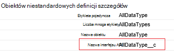
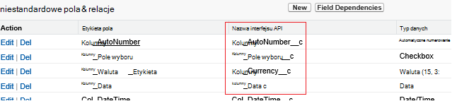

<properties
    pageTitle="Przenoszenie danych z usług Salesforce przy użyciu danych Factory | Microsoft Azure"
    description="Informacje na temat przenoszenia danych z usług Salesforce przy użyciu Azure danych Factory."
    services="data-factory"
    documentationCenter=""
    authors="linda33wj"
    manager="jhubbard"
    editor="monicar"/>

<tags
    ms.service="data-factory"
    ms.workload="data-services"
    ms.tgt_pltfrm="na"
    ms.devlang="na"
    ms.topic="article"
    ms.date="10/25/2016"
    ms.author="jingwang"/>

# Przenoszenie danych z usług Salesforce przy użyciu Factory danych Azure
W tym artykule opisano, jak użyć aktywności kopii w factory Azure danych w celu skopiowania danych z usług Salesforce do dowolnego magazynu danych, który jest wyświetlany w kolumnie Sink w tabeli [obsługiwanych źródeł i ujść](data-factory-data-movement-activities.md#supported-data-stores) . W tym artykule opiera się na artykuł [działania przepływu danych](data-factory-data-movement-activities.md) , w którym przedstawiono ogólne omówienie przenoszenia danych z kopii aktywności i danych obsługiwanych kombinacji magazynu.

Azure Factory danych obsługuje obecnie tylko przenoszenie danych z usług Salesforce [stores]((data-factory-data-movement-activities.md#supported-data-stores) danych sink obsługiwane, ale ma przechowuje nie obsługuje przenoszenie danych z innych danych do usług Salesforce.

## Wymagania wstępne
- Należy użyć jednego z następujących wersjach usług Salesforce: Developer Edition, Professional Edition, Enterprise Edition lub nieograniczony Edition.
- Musi być włączony interfejs API uprawnień. Zobacz [jak włączyć dostęp interfejsu API w usług Salesforce zestaw uprawnień?](https://www.data2crm.com/migration/faqs/enable-api-access-salesforce-permission-set/)
- Aby skopiować dane z usługi Salesforce do sklepów danych lokalnych, należy mieć co najmniej 2.0 bramy zarządzania danymi zainstalowanych w środowisku lokalnym.

## Limity żądania usługi SalesForce
Usługi SalesForce występują ograniczenia zarówno całkowita liczba żądań interfejsu API i równoczesne żądania interfejsu API. Zobacz sekcję "Interfejs API żądanie limity" w artykule [Limity Deweloper usług Salesforce](http://resources.docs.salesforce.com/200/20/en-us/sfdc/pdf/salesforce_app_limits_cheatsheet.pdf) , aby uzyskać szczegółowe informacje. Uwaga Jeśli liczbę żądań przekracza limit, ograniczania występuje i zostanie wyświetlony przypadkowe błędy; Jeśli liczba żądań przekracza limit, konta usługi Salesforce zostaną zablokowane przez 24 godziny; w obu przypadkach, może wystąpić błąd "REQUEST_LIMIT_EXCEEDED".

## Kopiowanie kreatora danych
Najprostszym sposobem utworzenia potok skopiowanie danych z usług Salesforce do dowolnego z magazynów sink obsługiwane jest za pomocą Kreatora kopiowanie danych. Zobacz [Samouczek: tworzenie potok przy użyciu Kreatora kopiowania](data-factory-copy-data-wizard-tutorial.md) aby szybkie informacje na temat tworzenia potok przy użyciu Kreatora kopiowanie danych.

Poniższy przykład zawiera definicje JSON, których można utworzyć potok przy użyciu [Azure portal](data-factory-copy-activity-tutorial-using-azure-portal.md), [Visual Studio](data-factory-copy-activity-tutorial-using-visual-studio.md)lub [Azure programu PowerShell](data-factory-copy-activity-tutorial-using-powershell.md). Jak skopiować danych z usług Salesforce magazynem obiektów Blob platformy Azure są pokazywane. Jednak dane można kopiować do jakichkolwiek pochłaniacze podane [tutaj](data-factory-data-movement-activities.md#supported-data-stores) przy użyciu aktywności kopii w Azure danych Factory.   

## Przykład: Kopiowanie danych z usług Salesforce do obiektów blob platformy Azure
W tym przykładzie skopiowanie danych z usług Salesforce do obiektów blob platformy Azure co godzinę. Właściwości JSON, które są używane w tych przykładach opisano w sekcjach za pomocą przykładów. Możesz skopiować dane bezpośrednio do pochłaniacze, które znajdują się w artykule [działania przepływu danych](data-factory-data-movement-activities.md#supported-data-stores) za pomocą kopiowania aktywności w Factory danych Azure.

Poniżej przedstawiono artefakty Factory danych, które musisz utworzyć do wykonania tego scenariusza. Sekcje listy zawierają szczegółowe informacje na temat tych czynności.

- Usługi połączone typu [usług Salesforce](#salesforce-linked-service-properties)
- Usługi połączone typu [AzureStorage](data-factory-azure-blob-connector.md#azure-storage-linked-service-properties)
- Wprowadzania [zestawu danych](data-factory-create-datasets.md) typu [RelationalTable](#salesforce-dataset-properties)
- Dane wyjściowe [zestawu danych](data-factory-create-datasets.md) typu [AzureBlob](data-factory-azure-blob-connector.md#azure-blob-dataset-type-properties)
- [Potok](data-factory-create-pipelines.md) z działaniem kopii w korzystającego z [RelationalSource](#relationalsource-type-properties) i [BlobSink](data-factory-azure-blob-connector.md#azure-blob-copy-activity-type-properties)

**Usługi połączone usług SalesForce**

W tym przykładzie jest używana usługa **usług Salesforce** połączone. W sekcji [usług Salesforce połączone usługi](#salesforce-linked-service-properties) dla właściwości, które są obsługiwane przez tę usługę połączone.  Aby uzyskać instrukcje dotyczące resetowania i uzyskiwanie tokenu zabezpieczającego, zobacz [Uzyskiwanie tokenu zabezpieczającego](https://help.salesforce.com/apex/HTViewHelpDoc?id=user_security_token.htm) .

    {
        "name": "SalesforceLinkedService",
        "properties":
        {
            "type": "Salesforce",
            "typeProperties":
            {
                "username": "<user name>",
                "password": "<password>",
                "securityToken": "<security token>"
            }
        }
    }

**Azure Usługa magazynu połączone**

    {
      "name": "AzureStorageLinkedService",
      "properties": {
        "type": "AzureStorage",
        "typeProperties": {
          "connectionString": "DefaultEndpointsProtocol=https;AccountName=<accountname>;AccountKey=<accountkey>"
        }
      }
    }

**Zestaw danych wejściowych usług SalesForce**

    {
        "name": "SalesforceInput",
        "properties": {
            "linkedServiceName": "SalesforceLinkedService",
            "type": "RelationalTable",
            "typeProperties": {
                "tableName": "AllDataType__c"  
            },
            "availability": {
                "frequency": "Hour",
                "interval": 1
            },
            "external": true,
            "policy": {
                "externalData": {
                    "retryInterval": "00:01:00",
                    "retryTimeout": "00:10:00",
                    "maximumRetry": 3
                }
            }
        }
    }

Ustawienie **zewnętrznych** na **wartość true** informuje usługę Factory danych, że zestawu danych jest zewnętrznych do fabryki danych i nie jest tworzone przez działania w factory danych.

> [AZURE.IMPORTANT] "__C" część nazwy interfejsu API jest wymagany dla dowolnego obiektu niestandardowego.

**Zestaw danych dane wyjściowe obiektów blob platformy Azure**

Dane są zapisywane nowe blob co godzinę (częstotliwość: godzina, interwał: 1).

    {
        "name": "AzureBlobOutput",
        "properties":
        {
            "type": "AzureBlob",
            "linkedServiceName": "AzureStorageLinkedService",
            "typeProperties":
            {
                "folderPath": "adfgetstarted/alltypes_c"
            },
            "availability":
            {
                "frequency": "Hour",
                "interval": 1
            }
        }
    }

**Potok aktywnością Kopiuj**

Proces zawiera działalność kopii, która jest skonfigurowany za pomocą powyższych dane wejściowe i wyjściowe zestawy danych, a zaplanowanego co godzinę. W potoku definicji JSON typ **źródła** jest ustawiona na **RelationalSource**, a typ **sink** jest ustawiona na **BlobSink**.

Zobacz [RelationalSource typ właściwości](#relationalsource-type-properties) na liście właściwości, które są obsługiwane przez RelationalSource.

    {  
        "name":"SamplePipeline",
        "properties":{  
            "start":"2016-06-01T18:00:00",
            "end":"2016-06-01T19:00:00",
            "description":"pipeline with copy activity",
            "activities":[  
            {
                "name": "SalesforceToAzureBlob",
                "description": "Copy from Salesforce to an Azure blob",
                "type": "Copy",
                "inputs": [
                {
                    "name": "SalesforceInput"
                }
                ],
                "outputs": [
                {
                    "name": "AzureBlobOutput"
                }
                ],
                "typeProperties": {
                    "source": {
                        "type": "RelationalSource",
                        "query": "SELECT Id, Col_AutoNumber__c, Col_Checkbox__c, Col_Currency__c, Col_Date__c, Col_DateTime__c, Col_Email__c, Col_Number__c, Col_Percent__c, Col_Phone__c, Col_Picklist__c, Col_Picklist_MultiSelect__c, Col_Text__c, Col_Text_Area__c, Col_Text_AreaLong__c, Col_Text_AreaRich__c, Col_URL__c, Col_Text_Encrypt__c, Col_Lookup__c FROM AllDataType__c"             
                    },
                    "sink": {
                        "type": "BlobSink"
                    }
                },
                "scheduler": {
                    "frequency": "Hour",
                    "interval": 1
                },
                "policy": {
                    "concurrency": 1,
                    "executionPriorityOrder": "OldestFirst",
                    "retry": 0,
                    "timeout": "01:00:00"
                }
            }
            ]
        }
    }

> [AZURE.IMPORTANT] "__C" część nazwy interfejsu API jest wymagany dla dowolnego obiektu niestandardowego.

## Właściwości usługi połączone usług SalesForce

Poniższa tabela zawiera opisy JSON elementy, które są specyficzne dla usługi połączone usług Salesforce.

| Właściwość | Opis | Wymagane |
| -------- | ----------- | -------- |
| Typ | Ustaw właściwości Typ: **usług Salesforce**. | Tak |
| Nazwa użytkownika |Określ nazwę użytkownika dla konta użytkownika. | Tak |
| hasło | Określ hasło do konta użytkownika.  | Tak |
| securityToken | Określ tokenu zabezpieczającego dla konta użytkownika. Aby uzyskać instrukcje dotyczące resetowania i uzyskiwanie tokenu zabezpieczającego, zobacz [Uzyskiwanie tokenu zabezpieczającego](https://help.salesforce.com/apex/HTViewHelpDoc?id=user_security_token.htm) . Aby uzyskać informacje o tokenów zabezpieczających ogólnie, zobacz [zabezpieczeń i API](https://developer.salesforce.com/docs/atlas.en-us.api.meta/api/sforce_api_concepts_security.htm).  | Tak |

## Właściwości zestawu danych usług SalesForce

Aby pełną listę sekcje i właściwości, które są dostępne dla definiowania zestawy danych zobacz artykuł [Tworzenie zestawów danych](data-factory-create-datasets.md) . Sekcje, takich jak struktury, dostępność i zasad zestawu danych JSON są podobne dla wszystkich typów zestawu danych (Azure SQL, obiektów blob platformy Azure, tabel platformy Azure i tak dalej).

W sekcji **typeProperties** różni się dla każdego typu zestawu danych i zawiera informacje o lokalizacji danych w magazynie danych. Sekcja typeProperties zestawu danych typu **RelationalTable** zawiera następujące właściwości:

| Właściwość | Opis | Wymagane |
| -------- | ----------- | -------- |
| tableName | Nazwa tabeli w usług Salesforce. | Brak (jeśli jest określony **kwerendy** dotyczącej **RelationalSource** ) |

> [AZURE.IMPORTANT]  "__C" część nazwy interfejsu API jest wymagany dla dowolnego obiektu niestandardowego.

## Właściwości typu RelationalSource

Aby pełną listę sekcje i właściwości, które są dostępne dla definiowania działania zobacz artykuł [Tworzenie procesy](data-factory-create-pipelines.md) . Właściwości, takie jak nazwa i opis, wejściowe i wyjściowe tabel i różnych zasady są dostępne dla wszystkich typów działań.

Właściwości, które są dostępne w sekcji typeProperties działalności, z drugiej strony, zależne od każdego typu działania. Wykonania kopii różnią się w zależności od rodzaju źródeł i ujść.

W działaniu Kopiuj gdy źródłem jest typu **RelationalSource** (obejmująca usług Salesforce), następujące właściwości są dostępne w sekcji typeProperties:

| Właściwość | Opis | Dopuszczalne wartości | Wymagane |
| -------- | ----------- | -------------- | -------- |
| kwerendy | Użyj kwerendy niestandardowej do odczytywania danych. | Kwerenda SQL-92 lub kwerenda, [Usług Salesforce obiektu kwerendy języka (SOQL)](https://developer.salesforce.com/docs/atlas.en-us.soql_sosl.meta/soql_sosl/sforce_api_calls_soql.htm) . Na przykład: `select * from MyTable__c`. | Brak (jeśli jest określony **tableName** z **zestawu danych** ) |

> [AZURE.IMPORTANT] "__C" część nazwy interfejsu API jest wymagany dla dowolnego obiektu niestandardowego.

## Porady dotyczące kwerend

### Pobieranie danych przy użyciu gdzie klauzula w kolumnie Data/Godzina
Gdy Określ SOQL lub SQL kwerendy, uwagę płatności różnica formatu daty i godziny. Na przykład:

- **Przykładowe SOQL**: $$Text.Format ("Wybierz OPCJĘ identyfikator, imię, BillingCity z konta miejsce, w którym data ostatniej modyfikacji > = {0:yyyy-MM-ddTHH:mm:ssZ} i Data ostatniej modyfikacji < {1:yyyy-MM-ddTHH:mm:ssZ}", WindowStart, WindowEnd)
- **Przykładowe SQL**: $$Text.Format ("wybierz pozycję * z konta miejsce, w którym data ostatniej modyfikacji > = {{ts\'{0:yyyy-MM-dd HH: mm:}\'}} i Data ostatniej modyfikacji < {{ts\'{1:yyyy-MM-dd HH: mm:}\'}}", WindowStart, WindowEnd) ".

### Pobieranie danych z raportu usług Salesforce
Można pobrać dane z raportów usług Salesforce, określając kwerendy jako `{call "<report name>"}`, np `"query": "{call \"TestReport\"}"`.

### Przywracanie usuniętych rekordów z Kosza usługi Salesforce
Aby wykonać kwerendę wygładzone rekordy usunięte z Kosza usługi Salesforce, można określić **"IsDeleted = 1"** w kwerendzie. Na przykład 

- Aby wykonać kwerendę usuniętych rekordów, określ "Wybierz *z MyTable__c * *miejsce, w którym IsDeleted = 1**"
- Aby wykonać kwerendę wszystkich rekordów, w tym istniejących i usunięte, określ "Wybierz *z MyTable__c * *miejsce, w którym IsDeleted = 0 lub IsDeleted = 1**"

[AZURE.INCLUDE [data-factory-structure-for-rectangualr-datasets](../../includes/data-factory-structure-for-rectangualr-datasets.md)]

### Mapowanie typu dla usług Salesforce
Typ usługi SalesForce | . Oparty na netto
--------------- | ---------------
Automatyczne numerowanie | Ciąg
Pole wyboru | Wartość logiczna
Waluta | Naciśnij dwukrotnie
Data | Daty i godziny
Data/Godzina | Daty i godziny
Adres e-mail | Ciąg
Identyfikator | Ciąg
Relacja Odnośnik | Ciąg
Lista wyboru wielokrotnego wyboru | Ciąg
Liczba | Naciśnij dwukrotnie
Procent | Naciśnij dwukrotnie
Telefon | Ciąg
Lista wyboru | Ciąg
Tekst | Ciąg
Obszar tekstu | Ciąg
Obszar tekstu (długa) | Ciąg
Obszar tekst (sformatowany RTF) | Ciąg
Tekst (szyfrowane) | Ciąg
ADRES URL | Ciąg

[AZURE.INCLUDE [data-factory-column-mapping](../../includes/data-factory-column-mapping.md)]
[AZURE.INCLUDE [data-factory-structure-for-rectangualr-datasets](../../includes/data-factory-structure-for-rectangualr-datasets.md)]

## Wydajność i dostosowywanie  
Zobacz [Podręcznik dostosowywania i wydajność działania kopii](data-factory-copy-activity-performance.md) Aby uzyskać informacje o kluczowych czynników, które wpływ na wydajność przepływu danych (Kopiuj czynność) w Factory danych Azure i optymalizowanie go na różne sposoby.
