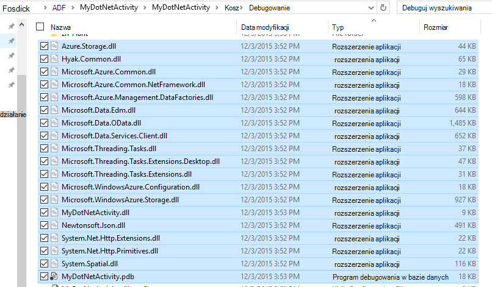
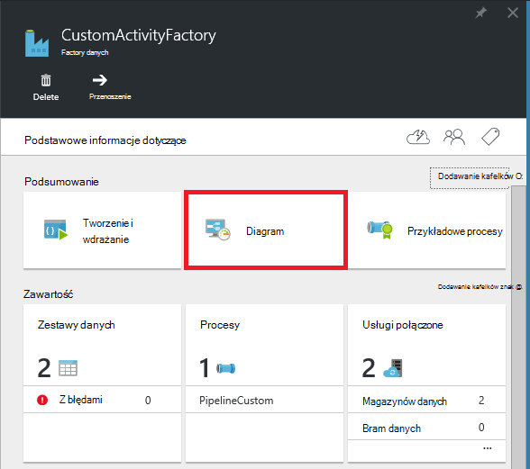
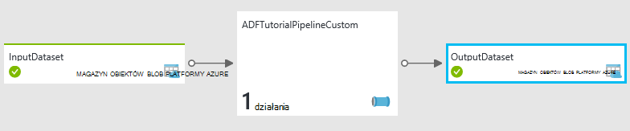
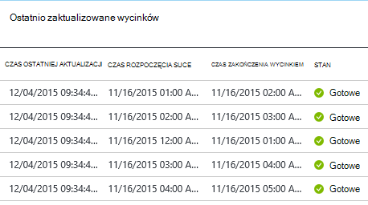
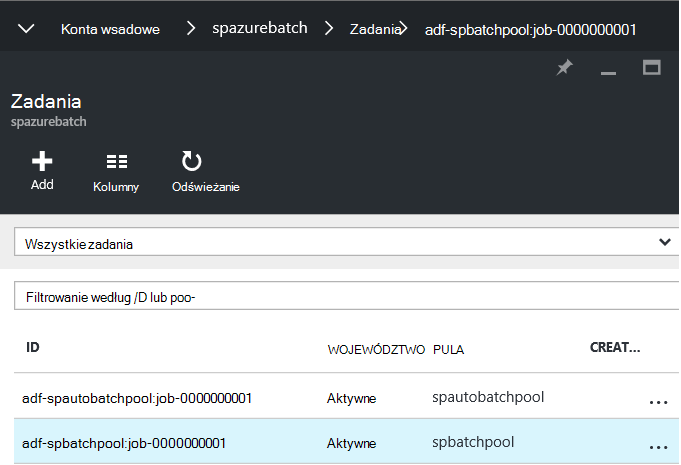
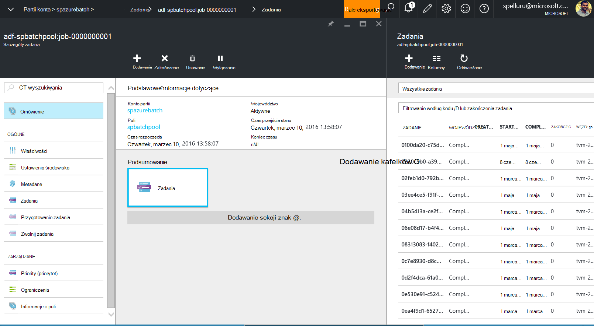
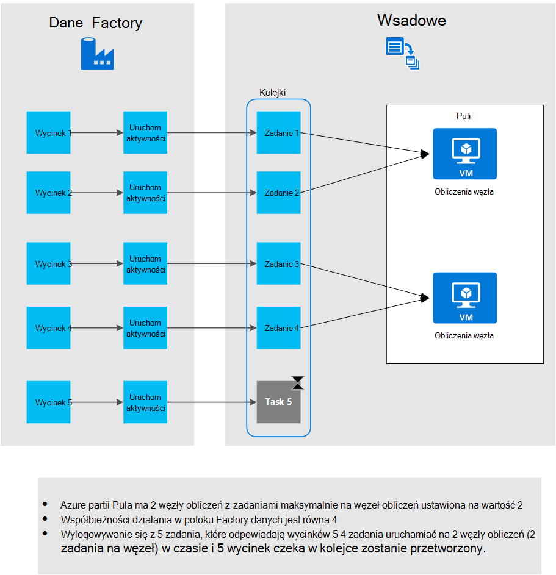

<properties
    pageTitle="Używanie niestandardowe działania w potoku Factory danych Azure"
    description="Dowiedz się, jak tworzyć niestandardowe działania i używać ich w potoku Azure danych Factory."
    services="data-factory"
    documentationCenter=""
    authors="spelluru"
    manager="jhubbard"
    editor="monicar"/>

<tags
    ms.service="data-factory"
    ms.workload="data-services"
    ms.tgt_pltfrm="na"
    ms.devlang="na"
    ms.topic="article"
    ms.date="10/17/2016"
    ms.author="spelluru"/>

# Używanie niestandardowe działania w potoku Factory danych Azure
> [AZURE.SELECTOR]
[Gałąź](data-factory-hive-activity.md)  
[Świnka](data-factory-pig-activity.md)  
[MapReduce](data-factory-map-reduce.md)  
[Przesyłanie strumieniowe Hadoop](data-factory-hadoop-streaming-activity.md)
[Maszynowego uczenia](data-factory-azure-ml-batch-execution-activity.md) 
[Procedura przechowywana](data-factory-stored-proc-activity.md)
[Analizy Lake danych U-SQL](data-factory-usql-activity.md)
[.NET niestandardowe](data-factory-use-custom-activities.md)

Istnieją dwa typy działań, które można użyć w potoku Azure danych Factory.
 
- [Działania przepływu danych](data-factory-data-movement-activities.md) przenoszenie danych między [obsługiwane magazynów danych](data-factory-data-movement-activities.md#supported-data-stores).
- Oblicza [Działania przekształcania danych](data-factory-data-transformation-activities.md) do procesu przekształcania danych przy użyciu takich jak usługa Azure HDInsight partii Azure i Azure maszynowego uczenia. Na przykład: gałąź HDInsight i maszynowego nauki wsadowe.  

Przenoszenie danych z magazynu danych, który nie jest obsługiwany przez Factory danych Azure należy można utworzyć niestandardowe działania .NET z własnych logika przepływu danych i używana w potoku. 

Podobnie jeśli musisz procesu przekształcania danych w taki sposób, aby nie jest obsługiwana przez Factory danych można utworzyć niestandardowe działania z logiki przetwarzania danych i używana w potoku.

> [AZURE.NOTE] Obecnie brama zarządzania danymi obsługuje tylko Kopiuj aktywności i procedura składowana aktywności w Factory danych. Nie istnieje możliwość dostępu do lokalnych źródeł danych za pomocą bramy z niestandardowym działaniem.
 
Można skonfigurować niestandardowe działania .NET przy użyciu usługi **Azure partii** lub klaster **Azure HDInsight** .   

Instruktaż następujące instrukcje krok po kroku tworzenia niestandardowym działaniem .NET i używania niestandardowym działaniem w potoku. Instruktaż korzysta z usługi **Azure partii** połączone. Umożliwia Azure HDInsight połączone usługi zamiast, tworzenie powiązanych z typu **HDInsight** (Jeśli używasz klaster HDInsight) lub **HDInsightOnDemand** (Jeśli chcesz, aby Factory danych, aby utworzyć HDInsight klaster na żądanie) i używać go w sekcji aktywności potoku JSON (**linkedServiceName**). Zobacz sekcję [Korzystanie Azure HDInsight powiązanych usług](#use-azure-hdinsight-linked-services) uzyskać szczegółowe informacje o korzystaniu z usługi HDInsight Azure do uruchomienia działania niestandardowego.

> [AZURE.IMPORTANT] Ustawianie 4.5.2 wersja programu .NET Framework jako framework docelowej projektu działania niestandardowego w programie Visual Studio .NET. Factory danych nie obsługuje niestandardowe działania skompilowany przed wersji .NET Framework później niż 4.5.2.   

## Instruktaż 

### Wymagania wstępne

- Program Visual Studio 2012 2013 2015-
- Pobierz i zainstaluj [Zestaw SDK programu .NET Azure][azure-developer-center]

### Azure partii wymagania wstępne
W Instruktaż możesz uruchomić niestandardowe działań .NET przy użyciu partii Azure jako zasób obliczeń. Zobacz [podstawy partia Azure] [ batch-technical-overview] zawiera omówienie partii Azure obsługi i zobacz [Wprowadzenie do biblioteki partii Azure dla środowiska .NET] [ batch-get-started] umożliwiające szybkie rozpoczęcie pracy z usługą Azure partię.

Samouczek musisz utworzyć konto Azure partii przy użyciu puli maszyny wirtualne. Wykonaj poniższe kroki:

1. Tworzenie **konta partii Azure** za pomocą [Azure portal](http://manage.windowsazure.com). Zobacz [Utwórz i Zarządzaj kontem partii Azure] [ batch-create-account] artykuł, aby uzyskać instrukcje. Zanotuj klucz konta i nazwę konta partii Azure.

    Można również użyć [Nowy AzureBatchAccount] [ new-azure-batch-account] polecenia cmdlet, aby utworzyć konto Azure partię. Zobacz [Za pomocą programu Azure Zarządzaj kontem partii Azure] [ azure-batch-blog] szczegółowe informacje na temat korzystania z tego polecenia cmdlet.
2. Tworzenie **puli partii Azure**.
    1. W [portalu Azure](https://portal.azure.com)w menu po lewej stronie kliknij przycisk **Przeglądaj** , a następnie kliknij przycisk **Konta partii**. 
    2. Wybierz swoje konto Azure partii, aby otworzyć karta **Wsadowe konta** . 
    3. Kliknij Kafelek **pul** .
    4. W karta **puli** kliknij przycisk Dodaj na pasku narzędzi, aby dodać puli.
        1. Wprowadź identyfikator puli (**Identyfikator puli**). Zanotuj **Identyfikator puli**; będzie potrzebny podczas tworzenia rozwiązanie Factory danych. 
        2. **Windows Server 2012 R2** określ dla ustawienia rodziny System operacyjny.
        3. Wybierz **węzeł cennik warstwy**. 
        3. Wprowadź **2** jako wartość ustawienia **Dedykowane docelowej** .
        4. Wprowadź **2** jako wartość ustawienia **zadania Max na węzeł** .
    5. Kliknij **przycisk OK** , aby utworzyć puli. 
 
    Za pomocą polecenia cmdlet [New-AzureBatchPool](https://msdn.microsoft.com/library/mt628690.aspx) tworzenie puli partii Azure.    

### Czynności wysokiego poziomu 
1.  **Tworzenie niestandardowego działania** używać potok Factory danych. Niestandardowe działania w tym przykładzie zawiera logika przekształcania i przetwarzanie danych. 
    1.  W programie Visual Studio Tworzenie projektu Biblioteka klas .NET, dodawanie kodu w celu przetworzenia danych wejściowych, a także Kompilowanie projektu. 
    2.  ZIP plików binarnych i PDB pliku (opcjonalnie) w folderze wyjściowym.  
    3.  Przekaż plik zip z magazynem obiektów blob platformy Azure. Szczegółowe kroki są w oknie Tworzenie sekcji działania niestandardowego. 
2. **Tworzenie factory Azure danych, która korzysta z niestandardowym działaniem**:
    1. Tworzenie factory Azure danych.
    2. Tworzenie połączonych usług.
        1. AzureStorageLinkedService: Materiałów eksploatacyjnych miejsca do magazynowania poświadczenia dostępu do obiektów blob.
        2. AzureBatchLinkedService: Określa partii Azure podczas obliczania.
    3. Tworzenie zestawów danych.
        1. InputDataset: Określa kontenera magazynu i folder dla wprowadzania obiektów blob.
        1. OuputDataset: Określa kontenera magazynu i folder dla obiektów blob dane wyjściowe.
    2. Tworzenie procesu, która korzysta z niestandardowym działaniem.
    3. Uruchom i przetestuj proces.
    4. Debugowanie proces.

## Tworzenie niestandardowego działania
Aby utworzyć niestandardowe działanie .NET, Utwórz projekt **Biblioteka klas .NET** z klasą tego interfejsu **IDotNetActivity** . Ten interfejs zawiera tylko jedną metodę: [Wykonywanie](https://msdn.microsoft.com/library/azure/mt603945.aspx) i podpis jest:

    public IDictionary<string, string> Execute(
            IEnumerable<LinkedService> linkedServices, 
            IEnumerable<Dataset> datasets, 
            Activity activity, 
            IActivityLogger logger)
        

Metoda wymaga cztery parametry:

- **linkedServices**. Ta właściwość jest ustalony listy usługi połączone, które połączyć źródła danych wejścia i wyjścia (na przykład: magazyn obiektów Blob platformy Azure) do fabryki danych. W tym przykładzie istnieje tylko jedna usługa połączonych typu Magazyn Azure przeznaczone zarówno dane wejściowe i wyjściowe. 
- **zestawy danych**. Ta właściwość jest ustalony wykaz zestawy danych. Ten parametr umożliwia uzyskiwanie lokalizacji i schematów zdefiniowanych przez wejściowe i wyjściowe zestawy danych.
- **działania**. Ta właściwość reprezentuje bieżącego obliczeń obiektu — w tym przypadku partii Azure.
- **rejestratora**. Ten obiekt umożliwia komentarze debugowania tej powierzchni logowania "Użytkownika" procesu. 

Metoda zwraca słownik, który może służyć do łańcuch niestandardowe działania w przyszłości. Ta funkcja nie jest jeszcze zaimplementowana, dlatego zwracana pustego słownik z metody.  

### Procedura 
1.  Tworzenie projektu **Biblioteka klas .NET** .
    <ol type="a">
        <li>Uruchom program <b>Visual Studio 2015</b> lub <b>programu Visual Studio 2013</b> lub <b>program Visual Studio 2012</b>.</li>
        <li>Kliknij pozycję <b>plik</b>, wskaż polecenie <b>Nowy</b>, a następnie kliknij pozycję <b>Projekt</b>.</li>
        <li>Rozwiń listę <b>Szablony</b>, a następnie wybierz <b>Visual C#</b>. W tym instruktażu używasz C#, ale można używać dowolnego języka .NET opracowywaniu działania niestandardowego.</li>
        <li><b>Biblioteka klas</b> wybierz z listy typów projektów po prawej stronie.</li>
        <li>Wprowadź <b>nazwę</b> <b>MyDotNetActivity</b> .</li>
        <li>Wybierz pozycję <b>C:\ADFGetStarted</b> dla <b>lokalizacji</b>.</li>
        <li>Kliknij przycisk <b>OK</b> , aby utworzyć projekt.</li>
    </ol>
2.  Kliknij pozycję **Narzędzia**, wskaż pozycję **Menedżer pakietów NuGet**, a następnie kliknij **Konsoli Menedżera pakietów**.
3.  W konsoli Menedżera pakietów wykonaj następujące polecenie, aby zaimportować **Microsoft.Azure.Management.DataFactories**.

        Install-Package Microsoft.Azure.Management.DataFactories

4. Importowanie pakietu NuGet **Magazyn Azure** w do projektu.

        Install-Package Azure.Storage

5. Dodaj poniższe instrukcje **przy użyciu** z plikiem źródłowym w projekcie.

        using System.IO;
        using System.Globalization;
        using System.Diagnostics;
        using System.Linq;

        using Microsoft.Azure.Management.DataFactories.Models;
        using Microsoft.Azure.Management.DataFactories.Runtime;

        using Microsoft.WindowsAzure.Storage;
        using Microsoft.WindowsAzure.Storage.Blob;

6. Zmień nazwę obszaru **nazw** na **MyDotNetActivityNS**.

        namespace MyDotNetActivityNS

7. Zmień nazwę klasy **MyDotNetActivity** i pochodzić z interfejsu **IDotNetActivity** , jak pokazano w poniższej wstawkę kodu:

        public class MyDotNetActivity : IDotNetActivity

8. Implementacji (Dodaj) **Wykonywanie** metody interfejsu **IDotNetActivity** do klasy **MyDotNetActivity** i skopiuj następujący kod do metody.

    Poniższy przykład zlicza wystąpienia wyszukiwanego ("Microsoft") w poszczególnych obiektów blob skojarzone z wycinek danych. 

        /// 

        /// Execute method is the only method of IDotNetActivity interface you must implement. 
        /// In this sample, the method invokes the Calculate method to perform the core logic.  
        /// 

        public IDictionary<string, string> Execute(
            IEnumerable<LinkedService> linkedServices,
            IEnumerable<Dataset> datasets,
            Activity activity,
            IActivityLogger logger)
        {
            // to get extended properties (for example: SliceStart)
            DotNetActivity dotNetActivity = (DotNetActivity)activity.TypeProperties;
            string sliceStartString = dotNetActivity.ExtendedProperties["SliceStart"];

            // to log all extended properties           
            IDictionary<string, string> extendedProperties = dotNetActivity.ExtendedProperties;
            logger.Write("Logging extended properties if any...");
            foreach (KeyValuePair<string, string> entry in extendedProperties)
            {
                logger.Write("<key:{0}> <value:{1}>", entry.Key, entry.Value);
            }
        
            // declare types for input and output data stores
            AzureStorageLinkedService inputLinkedService;

            // declare dataset types
            CustomDataset inputLocation;
            AzureBlobDataset outputLocation;

            Dataset inputDataset = datasets.Single(dataset => dataset.Name == activity.Inputs.Single().Name);
            inputLocation = inputDataset.Properties.TypeProperties as CustomDataset;

            foreach (LinkedService ls in linkedServices)
                logger.Write("linkedService.Name {0}", ls.Name);

            // using First method instead of Single since we are using the same 
            // Azure Storage linked service for input and output. 
            inputLinkedService = linkedServices.First(
                linkedService =>
                linkedService.Name ==
                inputDataset.Properties.LinkedServiceName).Properties.TypeProperties
                as AzureStorageLinkedService;

            string connectionString = inputLinkedService.ConnectionString; 

            // To create an input storage client.
            string folderPath = GetFolderPath(inputDataset);
            string output = string.Empty; // for use later.

            // create storage client for input. Pass the connection string.
            CloudStorageAccount inputStorageAccount = CloudStorageAccount.Parse(connectionString);
            CloudBlobClient inputClient = inputStorageAccount.CreateCloudBlobClient();

            // initialize the continuation token before using it in the do-while loop.
            BlobContinuationToken continuationToken = null;
            do
            {   // get the list of input blobs from the input storage client object.
                BlobResultSegment blobList = inputClient.ListBlobsSegmented(folderPath,
                                         true,
                                         BlobListingDetails.Metadata,
                                         null,
                                         continuationToken,
                                         null,
                                         null);
                
                // Calculate method returns the number of occurrences of 
                // the search term (“Microsoft”) in each blob associated
                // with the data slice. definition of the method is shown in the next step.
 
                output = Calculate(blobList, logger, folderPath, ref continuationToken, "Microsoft");

            } while (continuationToken != null);

            // get the output dataset using the name of the dataset matched to a name in the Activity output collection.
            Dataset outputDataset = datasets.Single(dataset => dataset.Name == activity.Outputs.Single().Name);
            // convert to blob location object.
            outputLocation = outputDataset.Properties.TypeProperties as AzureBlobDataset;

            folderPath = GetFolderPath(outputDataset);

            logger.Write("Writing blob to the folder: {0}", folderPath);

            // create a storage object for the output blob.
            CloudStorageAccount outputStorageAccount = CloudStorageAccount.Parse(connectionString);
            // write the name of the file. 
            Uri outputBlobUri = new Uri(outputStorageAccount.BlobEndpoint, folderPath + "/" + GetFileName(outputDataset));

            logger.Write("output blob URI: {0}", outputBlobUri.ToString());
            // create a blob and upload the output text.
            CloudBlockBlob outputBlob = new CloudBlockBlob(outputBlobUri, outputStorageAccount.Credentials);
            logger.Write("Writing {0} to the output blob", output);
            outputBlob.UploadText(output);

            // The dictionary can be used to chain custom activities together in the future.
            // This feature is not implemented yet, so just return an empty dictionary.  

            return new Dictionary<string, string>();
        }

9. Dodaj następujące metody pomocy. Metoda **Execute** wywołuje te metody Pomocnik. Metoda **GetConnectionString** pobiera parametry połączenia magazyn Azure i metoda **GetFolderPath** pobiera lokalizacji obiektów blob. Najważniejsze metodę **obliczania** wyodrębnia kod, którego iterację poszczególnych obiektów blob.

        /// 

        /// Gets the folderPath value from the input/output dataset.
        /// 

        private static string GetFolderPath(Dataset dataArtifact)
        {
            if (dataArtifact == null || dataArtifact.Properties == null)
            {
                return null;
            }

            AzureBlobDataset blobDataset = dataArtifact.Properties.TypeProperties as AzureBlobDataset;
            if (blobDataset == null)
            {
                return null;
            }

            return blobDataset.FolderPath;
        }

        /// 

        /// Gets the fileName value from the input/output dataset.   
        /// 

        private static string GetFileName(Dataset dataArtifact)
        {
            if (dataArtifact == null || dataArtifact.Properties == null)
            {
                return null;
            }

            AzureBlobDataset blobDataset = dataArtifact.Properties.TypeProperties as AzureBlobDataset;
            if (blobDataset == null)
            {
                return null;
            }

            return blobDataset.FileName;
        }

        /// 

        /// Iterates through each blob (file) in the folder, counts the number of instances of search term in the file, 
        /// and prepares the output text that is written to the output blob. 
        /// 

        public static string Calculate(BlobResultSegment Bresult, IActivityLogger logger, string folderPath, ref BlobContinuationToken token, string searchTerm)
        {
            string output = string.Empty;
            logger.Write("number of blobs found: {0}", Bresult.Results.Count<IListBlobItem>());
            foreach (IListBlobItem listBlobItem in Bresult.Results)
            {
                CloudBlockBlob inputBlob = listBlobItem as CloudBlockBlob;
                if ((inputBlob != null) && (inputBlob.Name.IndexOf("$$$.$$$") == -1))
                {
                    string blobText = inputBlob.DownloadText(Encoding.ASCII, null, null, null);
                    logger.Write("input blob text: {0}", blobText);
                    string[] source = blobText.Split(new char[] { '.', '?', '!', ' ', ';', ':', ',' }, StringSplitOptions.RemoveEmptyEntries);
                    var matchQuery = from word in source
                                     where word.ToLowerInvariant() == searchTerm.ToLowerInvariant()
                                     select word;
                    int wordCount = matchQuery.Count();
                    output += string.Format("{0} occurrences(s) of the search term \"{1}\" were found in the file {2}.\r\n", wordCount, searchTerm, inputBlob.Name);
                }
            }
            return output;
        }

    Metoda GetFolderPath zwraca ścieżkę do folderu, który wskazuje zestawu danych i metodę GetFileName zwraca nazwę obiektów blob pliku wskazuje zestaw danych. Jeśli możesz havefolderPath definiuje przy użyciu zmiennych, takich jak {roku}, {miesiąc}, {dnia} itd., metoda zwraca ciąg jego jest bez zastępowania ich wartościami runtime. Zobacz sekcję dotyczącą [programu Access właściwości rozszerzonych](#access-extended-properties) szczegółowe informacje na temat uzyskiwania dostępu do SliceStart, SliceEnd itd.    
    
            "name": "InputDataset",
            "properties": {
                "type": "AzureBlob",
                "linkedServiceName": "AzureStorageLinkedService",
                "typeProperties": {
                    "fileName": "file.txt",
                    "folderPath": "adftutorial/inputfolder/",
    
    Metoda obliczania oblicza liczbę wystąpień słowa kluczowego firmy Microsoft w plikach wprowadzania (BLOB w folderze). Wyszukiwany termin ("Microsoft") jest stałe w kodzie.

10. Kompilacji projektu. Kliknij przycisk **Konstruuj** z menu, a następnie kliknij przycisk **Konstruuj rozwiązanie**.

    > [AZURE.IMPORTANT] Ustawianie 4.5.2 wersji programu .NET Framework jako framework docelowej projektu: kliknij prawym przyciskiem myszy projektu, a następnie kliknij polecenie **Właściwości** , aby ustawić framework docelowej. Factory danych nie obsługuje niestandardowe działania skompilowany przed wersji .NET Framework później niż 4.5.2. 
11. Uruchom **Eksploratora Windows**, a następnie przejdź do folderu **bin\debug** lub **bin\release** w zależności od typu kompilacji.
12. Tworzenie pliku zip **MyDotNetActivity.zip** , który zawiera wszystkie pliki binarne w <project folder>\bin\Debug folder. Można dołączyć plik **MyDotNetActivity.pdb** , tak aby uzyskać dodatkowe informacje, takie jak numer wiersza kodu źródłowego, które spowodowały problem, jeśli wystąpił błąd. Wszystkie pliki w pliku zip niestandardowe działania musi być na **najwyższym poziomie** nie foldery podrzędne.

    
13. Prześlij **MyDotNetActivity.zip** jako obiektów blob w kontenerze obiektów blob: używa **customactivitycontainer** w magazynie obiektów blob platformy Azure, że **AzureStorageLinkedService** połączony usługi w **ADFTutorialDataFactory** .  Tworzenie kontenera obiektów blob **customactivitycontainer** , jeśli jeszcze nie istnieje.

> [AZURE.NOTE] Jeśli dodać ten projekt aktywności .NET do rozwiązania w programie Visual Studio, zawierający projekt Factory danych, a następnie dodaj odwołanie do .NET działania projektu z programu project aplikacji Factory danych, nie musisz wykonywać dwa ostatnie kroki ręcznego tworzenia pliku zip i przekazania go z magazynem obiektów blob platformy Azure. Podczas publikowania jednostki Factory danych za pomocą programu Visual Studio, te kroki wykonywane są automatycznie przez proces publikowania. Zobacz artykuły [Tworzenie pierwszej planowaną przy użyciu programu Visual Studio](data-factory-build-your-first-pipeline-using-vs.md) i [Skopiuj dane z obiektów Blob platformy Azure SQL Azure](data-factory-copy-activity-tutorial-using-visual-studio.md) , aby uzyskać informacje o, tworzenie i publikowanie jednostki Factory danych za pomocą programu Visual Studio.  

### Wykonywanie metody

Ta sekcja zawiera bardziej szczegółowe informacje i uwagi dotyczące kod w metoda **Execute** .
 
1. Elementy członkowskie dla iteracji w kolekcji wprowadzania znajdują się w obszarze nazw [Microsoft.WindowsAzure.Storage.Blob](https://msdn.microsoft.com/library/azure/microsoft.windowsazure.storage.blob.aspx) . Iteracji w kolekcji obiektów blob wymaga za pomocą klasy **BlobContinuationToken** . W zasadzie należy użyć-podczas pętli z token jako mechanizm zamykanie pętli. Aby uzyskać więcej informacji zobacz [jak za pomocą magazyn obiektów Blob z .NET](../storage/storage-dotnet-how-to-use-blobs.md). Podstawowe pętli pokazano poniżej:

        // Initialize the continuation token.
        BlobContinuationToken continuationToken = null;
        do
        {   
            // Get the list of input blobs from the input storage client object.
            BlobResultSegment blobList = inputClient.ListBlobsSegmented(folderPath,
                                      true,
                                      BlobListingDetails.Metadata,
                                      null,
                                      continuationToken,
                                      null,
                                      null);
            // Return a string derived from parsing each blob.
            output = Calculate(blobList, logger, folderPath, ref continuationToken, "Microsoft");
        } while (continuationToken != null);

    Zapoznaj się z dokumentacją dla metody [ListBlobsSegmented](https://msdn.microsoft.com/library/jj717596.aspx) , aby uzyskać szczegółowe informacje.

2.  Kod pracy w zestawie obiektów blob logicznie przechodzi w ramach nie-podczas pętli. W przypadku metody **Execute** nie-podczas pętli przekazuje na liście obiektów blob do metodę o nazwie **Calculate**. Metoda zwraca ciąg zmiennej o nazwie **dane wyjściowe** wynik o powtórzyć za pośrednictwem wszystkich obiektów blob segmentu. 

    Zwraca liczbę wystąpień wyszukiwanego (**Microsoft**) w obiekcie blob przekazany do metody **obliczania** . 

            output += string.Format("{0} occurrences of the search term \"{1}\" were found in the file {2}.\r\n", wordCount, searchTerm, inputBlob.Name);

3.  Po zakończeniu pracy metodę **obliczania** muszą być zapisane na nowych obiektów blob. Aby dla każdego zestawu obiektów blob przetwarzane nowych obiektów blob mogą być pisane z wynikami. Aby zapisać na nowych obiektów blob, najpierw Znajdź dane wyjściowe zestawu danych. 

            // Get the output dataset using the name of the dataset matched to a name in the Activity output collection.
            Dataset outputDataset = datasets.Single(dataset => dataset.Name == activity.Outputs.Single().Name);

            // Convert to blob location object.
            outputLocation = outputDataset.Properties.TypeProperties as AzureBlobDataset;

4.  Kod wywołuje również metodę Pomocnik: **GetFolderPath** pobrać ścieżki folderu (nazwa kontenera miejsca do magazynowania).
 
            folderPath = GetFolderPath(outputDataset);

    **GetFolderPath** rzutuje obiektu zestawu danych w celu AzureBlobDataSet, która ma właściwość o nazwie ścieżkafolderu.
            
            AzureBlobDataset blobDataset = dataArtifact.Properties.TypeProperties as AzureBlobDataset;
            
            return blobDataset.FolderPath;

5.  Kod wywołuje metodę **GetFileName** , aby pobrać plik (nazwa obiektów blob).  

            AzureBlobDataset blobDataset = dataArtifact.Properties.TypeProperties as AzureBlobDataset;

            return blobDataset.FileName;

6.  Nazwa pliku jest zapisywany, tworząc obiekt URI. Konstruktor URI użyto właściwości **BlobEndpoint** nazwa zwracana w kontenerze. Folder ścieżkę i nazwę pliku są dodawane do tworzenia obiektów blob dane wyjściowe identyfikatora URI.  

            // Write the name of the file. 
            Uri outputBlobUri = new Uri(outputStorageAccount.BlobEndpoint, folderPath + "/" + GetFileName(outputDataset));

7.  Nazwa pliku zostały zapisane i teraz możesz zapisywać ciągu wyjściowego z metody obliczania do nowych obiektów blob:

            // Create a blob and upload the output text.
            CloudBlockBlob outputBlob = new CloudBlockBlob(outputBlobUri, outputStorageAccount.Credentials);
            logger.Write("Writing {0} to the output blob", output);
            outputBlob.UploadText(output);

## Tworzenie factory danych za pomocą portalu Azure

W sekcji **Tworzenie niestandardowego działania** zostało utworzone niestandardowe działania i przekazać plik zip przy użyciu plików binarnych i plik PDB do kontenera obiektów blob platformy Azure. W tej sekcji możesz utworzyć Azure **factory danych** z **Planowana** , która korzysta z **niestandardowym działaniem**.
 
Wprowadzania zestawu danych dla niestandardowym działaniem reprezentuje BLOB (plików) w folderze wprowadzania (adftutorial\inputfolder) w magazynie obiektów blob. Zestaw danych wynik działania reprezentuje blob wyjścia w folderze wyjściowym (adftutorial\outputfolder) w magazynie obiektów blob. 

Tworzenie pliku o nazwie **plik.txt** o następującej treści i przekaż go do **adftutorial\inputfolder** (adftutorial to nazwa kontenera obiektów blob platformy Azure i inputfolder to nazwa folderu w danym kontenerze.)

    test custom activity Microsoft test custom activity Microsoft

Folder wejściowy odpowiada wycinek Factory danych Azure, nawet jeśli folder zawiera dwa lub więcej plików. Podczas przetwarzania każdego wycinka przez potok niestandardowym działaniem iterację wszystkich obiektów blob w folderze wprowadzania ten wycinek. 

Możesz sprawdzić, czy plik w folderze adftutorial\output jedną wyprowadzenia z jednego lub więcej wierszy (tak jak liczba BLOB w folderze wprowadzania):
 
    2 occurrences(s) of the search term "Microsoft" were found in the file inputfolder/2015-11-16-00/file.txt.

Poniżej przedstawiono kroki, które można wykonać w tej sekcji:

1. Tworzenie **factory danych**.
2. **Usługi połączone** dla puli partii Azure maszyny wirtualne na uruchamianej niestandardowym działaniem i Magazyn Azure, które zawiera blob wejścia i wyjścia. 
2. Wejściowe i wyjściowe **zestawy danych** reprezentujące dane wejściowe i wyjściowe działania niestandardowego. 
3. **Potok** , która korzysta z niestandardowym działaniem.
4. **Factory danych**. Można utworzyć podczas publikowania tych obiektów Azure. 

> [AZURE.NOTE] Tworzenie **plik.txt** i przekaż go do kontenera obiektów blob, jeśli jeszcze tego nie zrobiono. Zapoznaj się z instrukcjami powyżej.  

### Krok 1: Tworzenie factory danych

1.  Po zalogowaniu się do portalu Azure, wykonaj następujące czynności:
    1.  Kliknij przycisk **Nowy** w lewym menu.
    2.  Karta **Nowy** kliknij **danych + analizy** .
    3.  Kliknij pozycję **Factory danych** na karta **analizy danych** .
2.  W karta **nowego factory danych** wprowadź **CustomActivityFactory** dla nazwy. Nazwa fabryki Azure danych musi być globalnie unikatowa. Jeśli zostanie wyświetlony komunikat o błędzie: **factory danych o nazwie "CustomActivityFactory" nie jest dostępny**, Zmień nazwę fabryki danych (na przykład **yournameCustomActivityFactory**) i spróbuj ponownie utworzyć.
3.  Kliknij **Nazwę grupy zasobów**, a następnie naciśnij istniejącej grupy zasobów lub utworzyć grupę zasobów. 
4.  Upewnij się, że używasz poprawne **subskrypcji** i **region** , w którym chcesz factory danych ma zostać utworzony. 
5.  Kliknij przycisk **Utwórz** na karta **factory nowych danych** .
6.  Zobacz factory danych tworzonych w **pulpicie nawigacyjnym** portalu Azure.
7.  Po utworzeniu pomyślnie factory danych, pojawi się karta Factory danych, prezentującej zawartość fabryki danych.

### Krok 2: Tworzenie usługi połączone

Usługi połączone łącze magazynów lub obliczyć usług do fabryki Azure danych. W tym kroku można połączyć swoje konto Azure miejsca do magazynowania i konto Azure partii firmie danych.

#### Tworzenie usługi Magazyn Azure połączone

1.  Kliknij pozycję **Autor i wdrażanie** kafelków na karta **FACTORY danych** dla **CustomActivityFactory**. Zostanie wyświetlony Edytor Factory danych.
2.  Kliknij przycisk **nowe dane przechowywane** na pasku poleceń i wybierz pozycję **Azure miejsca do magazynowania**. Skrypt JSON związane z tworzeniem usługi Magazyn Azure połączone w edytorze powinny być widoczne.
3.  Zamień **nazwę konta** nazwę swojego konta magazynu platformy Azure i **klucz konta** przy użyciu klucza dostępu do konta Azure miejsca do magazynowania. Aby dowiedzieć się, jak uzyskać klucz dostępu do magazynowania, zobacz [Wyświetlanie, Kopiuj i klawisze dostępu wyniku miejsca do magazynowania](../storage/storage-create-storage-account.md#view-copy-and-regenerate-storage-access-keys).
4.  Kliknij pozycję **Rozmieść** na pasku poleceń do wdrożenia usługi połączone.

#### Tworzenie usługi Azure wsadowe połączone

2. W edytorze Factory danych, kliknij pozycję **Nowy obliczenia** na pasku poleceń i z menu wybierz **Partię Azure** .
3. Skrypt JSON wprowadzić następujące zmiany:
    1. Określ nazwę konta partii Azure właściwości **Nazwa konta** . Jest używany adres **URL** z **Karta konto Azure partii** w następującym formacie: http://**Nazwa konta**. region.batch.azure.com. Dla właściwości **batchUri** w formacie JSON należy **usunąć "Nazwa konta."** z adresu URL i używania **Nazwa konta** dla właściwości JSON **Nazwa konta** .
    2. Określ klucz konta wsadowe Azure właściwości **accessKey** . 
    3. Określ nazwę utworzonej puli jako część wymagania wstępne dotyczące właściwości **Nazwa_puli** . Można również określić identyfikator puli zamiast imienia i nazwiska puli.
    4. Określ identyfikator URI wsadowe Azure właściwości **batchUri** . Zobacz uwagi powyżej właściwości **Nazwa konta** . Przykład: https://westus.batch.azure.com.  
    5. Określ **AzureStorageLinkedService** dla właściwości **linkedServiceName** .
        
            {
              "name": "AzureBatchLinkedService",
              "properties": {
                "type": "AzureBatch",
                "typeProperties": {
                  "accountName": "myazurebatchaccount",
                  "batchUri": "https://westus.batch.azure.com",
                  "accessKey": "<yourbatchaccountkey>",
                  "poolName": "myazurebatchpool",
                  "linkedServiceName": "AzureStorageLinkedService"
                }
              }
            }

        Właściwość **Nazwa_puli** można określić także identyfikator puli zamiast imienia i nazwiska puli.

    > [AZURE.NOTE] Usługa Factory danych nie obsługuje opcję na żądanie partii Azure, jak w przypadku usługi HDInsight. Własne puli partii Azure można używać tylko w factory Azure danych.
    
### Krok 3: Tworzenie zestawów danych
W tym kroku utworzysz zestawy danych, aby oznaczyć dane wejściowe i wyjściowe.

#### Tworzenie zestawu wprowadzania danych
1.  W **Edytorze** dla Factory danych kliknij przycisk **Nowy zestaw danych** na pasku narzędzi, a następnie kliknij przycisk **Magazyn obiektów Blob platformy Azure** z menu rozwijanego.
2.  Zastąp JSON w okienku po prawej stronie wstawkę JSON następujące czynności:

            {
                "name": "InputDataset",
                "properties": {
                    "type": "AzureBlob",
                    "linkedServiceName": "AzureStorageLinkedService",
                    "typeProperties": {
                        "folderPath": "adftutorial/customactivityinput/",
                        "format": {
                            "type": "TextFormat"
                        }
                    },
                    "availability": {
                        "frequency": "Hour",
                        "interval": 1
                    },
                    "external": true,
                    "policy": {}
                }
            }

    Utworzyć potok w dalszej części tego instruktażu czas rozpoczęcia: 2015-11-godziny 16T00:00:00Z i zakończenie: 2015-11-16T05:00:00Z. Zostaje zaplanowane da danych co godzinę, więc 5 wycinków wejścia i wyjścia (od **00**: **05**-> 00:00: 00:00). 

    **Częstotliwość** i **Interwał** w zestawie danych wejściowych jest ustawiona na **godziny** i **1**, co oznacza, że wprowadzania wycinek jest dostępny co godzinę. W tym przykładzie jest tego samego pliku (plik.txt) w intputfolder. 

    Poniżej przedstawiono czasu rozpoczęcia dla każdego wycinka, którego jest reprezentowany przez SliceStart zmienna w powyższych wstawek JSON. 

    
3.  Kliknij pozycję **Rozmieść** na pasku narzędzi, aby tworzyć i wdrażać **InputDataset**. Upewnij się, zostanie wyświetlony komunikat **UTWORZONE pomyślnie w tabeli** na pasku tytułu edytora.

#### Utwórz zestaw danych wyjściowych

1. W **Edytorze Factory danych**kliknij przycisk **Nowy zestaw danych**, a następnie kliknij **Magazyn obiektów Blob platformy Azure** na pasku poleceń.
2. Zastąp skrypt JSON w okienku po prawej stronie tego skryptu JSON:

        {
            "name": "OutputDataset",
            "properties": {
                "type": "AzureBlob",
                "linkedServiceName": "AzureStorageLinkedService",
                "typeProperties": {
                    "fileName": "{slice}.txt",
                    "folderPath": "adftutorial/customactivityoutput/",
                    "partitionedBy": [
                        {
                            "name": "slice",
                            "value": {
                                "type": "DateTime",
                                "date": "SliceStart",
                                "format": "yyyy-MM-dd-HH"
                            }
                        }
                    ]
                },
                "availability": {
                    "frequency": "Hour",
                    "interval": 1
                }
            }
        }

    Lokalizację danych wyjściowych jest **adftutorial-customactivityoutput-** i nazwa pliku wyjściowego jest yyyy-MM-dd-HH.txt, gdzie RRRR MM-dd-HH jest rok, miesiąc, Data i godzina wycinka wyprodukowane. Zobacz [Dokumentacja dewelopera] [ adf-developer-reference] Aby uzyskać szczegółowe informacje.

    Obiektów blob plik docelowy jest generowany dla każdego wycinka wprowadzania danych. Poniżej przedstawiono, jak o nazwie pliku wyjściowego dla każdego wycinka. Wszystkie pliki wyjściowe są generowane w jednym folderze wyjściowym: **adftutorial\customactivityoutput**.

  	| Wycinek | Czas rozpoczęcia | Plik docelowy |
  	| :---- | :--------- | :---------- | 
  	| 1 | 2015-11-16T00:00:00 | 2015-11-16-00.txt |
  	| 2 | 2015-11-16T01:00:00 | 2015-11-16-01.txt |
  	| 3 | 2015-11-16T02:00:00 | 2015-11-16-02.txt |
  	| 4 | 2015-11-16T03:00:00 | 2015-11-16-03.txt |
  	| 5 | 2015-11-16T04:00:00 | 2015-11-16-04.txt |

    Należy pamiętać, że wszystkie pliki w folderze wprowadzania część wycinek z czasu rozpoczęcia wymienionych powyżej. Podczas przetwarzania fragmencie niestandardowym działaniem skanuje za pośrednictwem każdego pliku i tworzy linię w pliku wyjściowym o liczbie wystąpienia wyszukiwanego terminu ("Microsoft"). Jeśli istnieją trzy pliki w inputfolder, w pliku docelowym dla każdego wycinka godzinowe są trzy wiersze: 2015-11-16-00.txt 2015-11-16:01:00:00.txt itp. 

2. Kliknij pozycję **Rozmieść** na pasku poleceń do wdrożenia **OutputDataset**.

### Tworzenie i uruchamianie procesu, która korzysta z niestandardowym działaniem

1. W edytorze Factory danych, kliknij **Nowy potok** na pasku poleceń. Jeśli nie widzisz polecenia, kliknij przycisk **... (Wielokropek)** Aby ją wyświetlić.
2. Zamień JSON w okienku po prawej stronie tego skryptu JSON. 

        {
          "name": "ADFTutorialPipelineCustom",
          "properties": {
            "description": "Use custom activity",
            "activities": [
              {
                "Name": "MyDotNetActivity",
                "Type": "DotNetActivity",
                "Inputs": [
                  {
                    "Name": "InputDataset"
                  }
                ],
                "Outputs": [
                  {
                    "Name": "OutputDataset"
                  }
                ],
                "LinkedServiceName": "AzureBatchLinkedService",
                "typeProperties": {
                  "AssemblyName": "MyDotNetActivity.dll",
                  "EntryPoint": "MyDotNetActivityNS.MyDotNetActivity",
                  "PackageLinkedService": "AzureStorageLinkedService",
                  "PackageFile": "customactivitycontainer/MyDotNetActivity.zip",
                  "extendedProperties": {
                    "SliceStart": "$$Text.Format('{0:yyyyMMddHH-mm}', Time.AddMinutes(SliceStart, 0))"
                  }
                },
                "Policy": {
                  "Concurrency": 2,
                  "ExecutionPriorityOrder": "OldestFirst",
                  "Retry": 3,
                  "Timeout": "00:30:00",
                  "Delay": "00:00:00"
                }
              }
            ],
            "start": "2015-11-16T00:00:00Z",
            "end": "2015-11-16T05:00:00Z",
            "isPaused": false
          }
        }

    Zwróć uwagę następujące punkty:

    - **Współbieżności** jest ustawiona na **2** , dzięki czemu dwóch wycinki są przetwarzane równolegle za pośrednictwem 2 SMS w puli partii Azure.
    - W sekcji działania występuje jeden aktywności i typu: **DotNetActivity**.
    - **AssemblyName** jest ustawiona na nazwę biblioteki DLL: **MyDotnetActivity.dll**.
    - **Punkt wejścia** jest ustawiona na **MyDotNetActivityNS.MyDotNetActivity**.
    - **PackageLinkedService** jest ustawiona na **AzureStorageLinkedService** wskazującego na magazyn obiektów blob, zawierającego plik zip działania niestandardowego. Jeśli korzystasz z różnych kont magazyn Azure wejścia i wyjścia plików i plik zip niestandardowym działaniem, możesz utworzyć innej usługi Magazyn Azure połączone. W tym artykule założono, że używasz tego samego konta magazynu platformy Azure.
    - **PackageFile** jest ustawiona na **customactivitycontainer/MyDotNetActivity.zip**. Jest w formacie: containerforthezip/nameofthezip.zip.
    - Niestandardowe działania trwa **InputDataset** jako danych wejściowych i **OutputDataset** jako wynik.
    - Właściwość linkedServiceName niestandardowe działania wskazuje na **AzureBatchLinkedService**, informujące Factory danych Azure niestandardowym działaniem powinien uruchamiać na maszyny wirtualne partii Azure.
    - Właściwość **isPaused** jest domyślnie ustawiona na **wartość false** . Proces uruchamia natychmiast w tym przykładzie, ponieważ wycinki można uruchomić w przeszłości. Tej właściwości można ustawić wartość PRAWDA, aby wstrzymać proces i ustawianie go ponownie ma wartość FAŁSZ, aby ponownie uruchomić. 
    - Czas **rozpoczęcia** i **zakończenia** to **pięć** godzin od siebie i wycinki są tworzone co godzinę, więc pięć wycinki są wytwarzane przez proces. 

4. Kliknij pozycję **Rozmieść** na pasku poleceń do wdrożenia proces.

### Monitorowanie planowanej sprzedaży
 
8. W karta Factory danych w portalu Azure kliknij pozycję **Diagram**.
    
    
 
9. W widoku diagramu kliknij przycisk OutputDataset.
 
    

10. Powinna być widoczna, że wycinków pięć dane wyjściowe są w stanie gotowe, jeśli już zostały wyprodukowane.

    
    
12. Upewnij się, że pliki wyjściowe są generowane w magazynie obiektów blob w kontenerze **adftutorial** .

    ![Wyjście z niestandardowym działaniem][image-data-factory-ouput-from-custom-activity]

9. Jeśli otworzysz plik docelowy powinny zostać wyświetlone dane wyjściowe podobne do następujący wynik:

    2 wystąpień (s) frazę "Microsoft" znaleziono w inputfolder/2015-11-16-00/file.txt pliku.

10. [Azure portal] za pomocą[ azure-preview-portal] lub poleceń cmdlet środowiska PowerShell Azure do monitorowania factory danych, procesy i zestawy danych. Można wyświetlać wiadomości z **ActivityLogger** w kodzie niestandardowym działaniem w dzienników (specjalnie 0.log użytkownika), które można pobrać z portalu lub przy użyciu poleceń cmdlet.

    ![Pobierz dzienniki z niestandardowym działaniem][image-data-factory-download-logs-from-custom-activity]

Aby uzyskać szczegółowe instrukcje monitorowania zestawy danych oraz procesy, zobacz [Monitorowanie i zarządzanie procesy](data-factory-monitor-manage-pipelines.md) .      

### Integracja danych Factory i partii
Usługi danych Factory tworzy zadanie w partii Azure o nazwie: **adf-poolname:job-xxx**. 

Zadanie jest tworzone dla każdej serii aktywności wycinka. W przypadku 10 wycinków gotowe do przetwarzania 10 zadań są tworzone w tym zadaniu. Możesz mieć więcej niż jednym wycinkiem uruchomione równolegle, jeśli masz wiele węzłów obliczeń w puli. Można także używać więcej niż jednym wycinkiem uruchomione na tym samym obliczeń, jeśli maksymalna zadania na węzeł obliczeń jest ustawiona na > 1. 

Poniższy diagram przedstawia relacje między zadaniami Factory danych Azure i partii. 

## Debugowanie proces
Debugowanie składa się z kilku podstawowych technik:

1.  Jeśli zostanie wyświetlony następujący komunikat o błędzie, upewnij się, że nazwa klasy w pliku CS odpowiada nazwie określonej właściwości **punktu wejścia** w potoku JSON. W powyższym przykładzie jest nazwę klasy: MyDotNetActivity i punktu wejścia w formacie JSON: MyDotNetActivityNS. **MyDotNetActivity**. 

            MyDotNetActivity assembly does not exist or doesn't implement the type Microsoft.DataFactories.Runtime.IDotNetActivity properly

    Jeśli imiona i nazwiska są zgodne, upewnij się, że wszystkie pliki binarne znajdują się w **folderze głównym** pliku zip. Oznacza to, że po otwarciu pliku zip powinien zostać wyświetlony wszystkie pliki w folderze głównym, a nie wszystkie foldery podrzędne.   
2.  Jeśli wycinek wprowadzania nie jest ustawiona na **Gotowe**, potwierdzenia, że struktura folderów wprowadzania jest poprawny i **plik.txt** istnieje w folderach wprowadzania danych. 
2.  W przypadku **wykonywania** metody działania niestandardowego umożliwia rejestrowanie informacji, która ułatwia rozwiązywanie problemów z obiektu **IActivityLogger** . Zarejestrowane komunikaty są wyświetlane w plikach dziennika użytkownika (jeden lub więcej plików o nazwie: 0.log użytkownika, 1.log użytkownika, 2.log użytkownika itd.). 

    W karta **OutputDataset** kliknij wycinek, aby wyświetlić karta **WYCINEK** dla ten wycinek. Zobaczysz **aktywności jest uruchamiany** dla ten wycinek. Powinien zostać wyświetlony jeden aktywności uruchamianie dla wycinek. Kliknięcie przycisku Uruchom na pasku poleceń można uruchomić innego działania uruchamianie dla samej wycinek. 

    Po kliknięciu przycisku Uruchom aktywności, pojawi się karta **Szczegóły uruchomić działania** z listy pliki dziennika. Zobacz zarejestrowane komunikaty w pliku user_0.log. Wystąpi błąd, zostanie wyświetlony trzy aktywności zostanie uruchomiona, ponieważ liczby powtórzeń jest ustawiona na 3 w potoku/działaniu JSON. Po kliknięciu przycisku Uruchom aktywności, zobacz pliki dziennika, które można przeglądać, aby rozwiązać problem. 

    Na liście plików dziennika kliknij przycisk **0.log użytkownika**. W prawym panelu są wyników przy użyciu metody **IActivityLogger.Write** . Jeśli nie widzisz wszystkich wiadomości, sprawdź, jeśli masz więcej plików dziennika o nazwie: user_1.log, user_2.log itp. W przeciwnym razie kod nie powiodła się po zarejestrowaniu ostatnią wiadomość.

    Należy także sprawdzić **system 0.log** systemu komunikaty o błędach i wyjątki.

3.  W pliku zip należy umieścić plik **PDB** , dzięki czemu szczegóły błędu mieć informacje, takie jak **stos wywołań** , gdy wystąpi błąd.
4.  Wszystkie pliki w pliku zip niestandardowe działania musi być na **najwyższym poziomie** nie foldery podrzędne.
5.  Upewnij się, że **assemblyName** (MyDotNetActivity.dll), **punktu wejścia**(MyDotNetActivityNS.MyDotNetActivity), **packageFile** (customactivitycontainer/MyDotNetActivity.zip) i **packageLinkedService** (powinny wskazywać z magazynem obiektów blob platformy Azure, zawierającego plik zip) są ustawione prawidłowe wartości. 
6.  Jeśli stałej komunikat o błędzie i chcesz ponownie przetworzyć wycinek, kliknij prawym przyciskiem myszy wycinek karta **OutputDataset** , a następnie kliknij polecenie **Uruchom**. 
7.  Niestandardowe działania nie korzysta z pliku **app.config** z pakietu, więc jeśli kodzie wszystkie ciągi połączenia z pliku konfiguracji, nie działa w czasie rzeczywistym. Podczas korzystania z platformy Azure partii najlepiej przytrzymaj dowolną hasła w **Azure KeyVault**, chronić **keyvault**za pomocą kapitału na podstawie certyfikatu usługi i rozpowszechnianie certyfikatu do puli partii Azure. Działania niestandardowego .NET następnie dostęp do hasła KeyVault w czasie rzeczywistym. To rozwiązanie jest rozwiązaniem ogólne i można skalować do dowolnego rodzaju tajny, nie tylko parametry połączenia.

    Istnieje ułatwić obejście problemu (ale nie najlepiej): tworzenie **Azure SQL połączone usługi** przy użyciu połączenia ustawień ciągów, tworzenie zestawu danych, która korzysta z usługi połączone i łańcucha jako fikcyjna wprowadzania zestawu danych do działania .NET niestandardowego zestawu danych. Następnie możesz uzyskać dostęp do powiązanych z parametrów połączenia w kodzie niestandardowym działaniem i powinna działać poprawnie w czasie rzeczywistym.  

## Aktualizowanie działania niestandardowego
Gdy zaktualizujesz kod niestandardowym działaniem jego tworzenia i przekaż plik zip zawierający nowe pliki binarne z magazynem obiektów blob.

## Kopiowanie i przenoszenie danych 
Kopiowanie kopii aktywności przechowywanie danych ze **źródła** danych do magazynu danych **sink** . Zobacz [obsługiwane magazynów](data-factory-data-movement-activities.md#supported-data-stores) na liście magazynów danych jako źródeł i ujść obsługiwane wykonania kopii. 

Jeśli potrzebujesz przenoszenie danych z magazynu danych, który nie jest obsługiwany przez **Kopiowanie działanie**, można używać **niestandardowym działaniem** w Factory danych z własnych logiki kopiowania i przenoszenia danych. Zobacz [próbki Downloader danych HTTP](https://github.com/Azure/Azure-DataFactory/tree/master/Samples/HttpDataDownloaderSample) na GitHub.  

## Izolacji domeny aplikacji 
Zobacz [Krzyżowe domeny aplikacji przykładowych](https://github.com/Azure/Azure-DataFactory/tree/master/Samples/CrossAppDomainDotNetActivitySample) pokazano, jak tworzyć niestandardowe działania .NET dla Azure Factory danych, który nie jest ograniczona do wersji zestawu używanych przez uruchamianie Azure Factory danych (na przykład WindowsAzure.Storage v4.3.0 Newtonsoft.Json v6.0.x, itp.).

## Rozszerzone właściwości programu Access
Można deklarować właściwości rozszerzone w działaniu JSON, tak jak pokazano poniżej: 

    "typeProperties": {
      "AssemblyName": "MyDotNetActivity.dll",
      "EntryPoint": "MyDotNetActivityNS.MyDotNetActivity",
      "PackageLinkedService": "AzureStorageLinkedService",
      "PackageFile": "customactivitycontainer/MyDotNetActivity.zip",
      "extendedProperties": {
        "SliceStart": "$$Text.Format('{0:yyyyMMddHH-mm}', Time.AddMinutes(SliceStart, 0))",
        "DataFactoryName": "CustomActivityFactory"
      }
    },

W kodzie, są dwie właściwości rozszerzone: **SliceStart** i **DataFactoryName**. Wartość w polu SliceStart jest oparty na zmienna SliceStart. Aby uzyskać listę zmiennych obsługiwanego systemu zobacz [Zmienne systemowe](data-factory-scheduling-and-execution.md#data-factory-system-variables) . Wartość DataFactoryName jest ustalone "CustomActivityFactory". 

Aby uzyskać dostęp do tych właściwości rozszerzone w metoda **Execute** , użyj kod podobny do następującego kodu: 

    // to get extended properties (for example: SliceStart)
    DotNetActivity dotNetActivity = (DotNetActivity)activity.TypeProperties;
    string sliceStartString = dotNetActivity.ExtendedProperties["SliceStart"];

    // to log all extended properties                               
    IDictionary<string, string> extendedProperties = dotNetActivity.ExtendedProperties;
    logger.Write("Logging extended properties if any...");
    foreach (KeyValuePair<string, string> entry in extendedProperties)
    {
        logger.Write("<key:{0}> <value:{1}>", entry.Key, entry.Value);
    }

## Automatyczne skalowanie funkcji partii Azure
Można także tworzyć puli wsadowe Azure za pomocą funkcji **autoscale** . Na przykład można utworzyć puli azure partii z 0 dedykowane maszyny wirtualne i formułę autoscale na podstawie liczby oczekujących zadań:

Jeden maszyn wirtualnych na oczekujących zadań jednocześnie (na przykład: pięć oczekujących zadań -> pięć maszyny wirtualne):

    pendingTaskSampleVector=$PendingTasks.GetSample(600 * TimeInterval_Second);
    $TargetDedicated = max(pendingTaskSampleVector);

MAX jeden maszyn wirtualnych w danej chwili, niezależnie od liczby oczekujących zadań:

    pendingTaskSampleVector=$PendingTasks.GetSample(600 * TimeInterval_Second);
    $TargetDedicated = (max(pendingTaskSampleVector)>0)?1:0;

Aby uzyskać szczegółowe informacje, zobacz [automatycznie skali obliczyć węzły w puli wsadowe Azure](../batch/batch-automatic-scaling.md) . 

Jeśli puli korzysta z domyślnego [autoScaleEvaluationInterval](https://msdn.microsoft.com/library/azure/dn820173.aspx), usługę partii może potrwać 15-30 minut, aby przygotować maszyn wirtualnych przed uruchomieniem działania niestandardowego.  Jeśli puli korzysta z różnych autoScaleEvaluationInterval, usługę partii może potrwać autoScaleEvaluationInterval + 10 minut.

## Za pomocą usług Azure HDInsight połączone
W Instruktaż partii Azure obliczeń jest używanych do uruchamiania działania niestandardowego. Można użyć klaster HDInsight lub mieć Factory danych, utworzyć klaster HDInsight na żądanie i mieć niestandardowym działaniem uruchamiania w klastrze HDInsight. Poniżej przedstawiono czynności wysokiego poziomu dotyczące korzystania z usługi HDInsight klaster.  

1. Tworzenie usługi HDInsight Azure połączone.   
2. Za pomocą usługi HDInsight połączone zamiast **AzureBatchLinkedService** w potoku JSON. 

Można zmienić godziny **Początek** i **koniec** procesu, aby mógł testować scenariusz z usługą HDInsight platformy Azure.

#### Tworzenie usługa Azure HDInsight połączone 
Usługa Azure danych Factory Obsługa tworzenia klaster na żądanie i używać go do procesu dane wejściowe do utworzenia danych wyjściowych. Za pomocą własnego klaster przeprowadzić takie same. Gdy używasz na żądanie HDInsight klaster dla każdego wycinka zostanie utworzony w klastrze. Jeśli używasz klaster HDInsight, klaster jest gotowa do natychmiast przetwarza wycinek. W związku z tym gdy używasz klaster na żądanie nie widać danych wyjściowych tak szybko, jak przy użyciu własnej klaster.

> [AZURE.NOTE] W czasie wykonywania wystąpienie działaniem .NET działa tylko w jednym węźle pracownik klaster HDInsight; Nie można skalować do uruchomienia na wielu węzłach. Wielu wystąpień działania .NET można uruchamiać równolegle na poszczególnych węzłów klaster HDInsight.

##### Aby użyć klaster HDInsight na żądanie

1. W **portalu Azure**kliknij **autora i rozmieszczanie** na stronie głównej Factory danych.
2. W edytorze Factory danych, kliknij pozycję **Nowy obliczenia** na pasku poleceń i z menu wybierz **klaster HDInsight na żądanie** .
2. Skrypt JSON wprowadzić następujące zmiany:
    1. Dla właściwości **clusterSize** określenia rozmiaru klaster HDInsight.
    3. Właściwości **licznika timeToLive** Określ, jak długo trwa klienta może być bezczynny, zanim zostanie usunięty.
    4. Właściwość **wersji** Określ wersji usługi HDInsight, którego chcesz użyć. Jeśli ta właściwość zostanie pominięty, jest używana najnowszą wersję.  
    5. **LinkedServiceName**Określ, czy Samouczek wprowadzający **AzureStorageLinkedService** została utworzona w oknie Pobieranie.

            {
                "name": "HDInsightOnDemandLinkedService",
                "properties": {
                    "type": "HDInsightOnDemand",
                    "typeProperties": {
                        "clusterSize": 4,
                        "timeToLive": "00:05:00",
                        "osType": "Windows",
                        "linkedServiceName": "AzureStorageLinkedService",
                    }
                }
            }

2. Kliknij pozycję **Rozmieść** na pasku poleceń do wdrożenia usługi połączone.

##### Aby użyć klaster HDInsight:

1. W **portalu Azure**kliknij **autora i rozmieszczanie** na stronie głównej Factory danych.
2. W oknie **Edytor Factory danych**kliknij pozycję **Nowy obliczenia** na pasku poleceń i z menu wybierz **klaster HDInsight** .
2. Skrypt JSON wprowadzić następujące zmiany:
    1. Dla właściwości **clusterUri** wprowadź adres URL usługi HDInsight. Na przykład: https://<clustername>.azurehdinsight.net/     
    2. Dla właściwości **Nazwa użytkownika** wprowadź nazwę użytkownika, kto ma dostęp do klastrów HDInsight.
    3. Dla właściwości **hasło** wprowadź hasło dla użytkownika.
    4. Właściwość **LinkedServiceName** wprowadź **AzureStorageLinkedService**. Ta usługa połączonych utworzono samouczka Wprowadzenie Get.

2. Kliknij pozycję **Rozmieść** na pasku poleceń do wdrożenia usługi połączone.

Aby uzyskać szczegółowe informacje, zobacz [obliczyć usługi połączone](data-factory-compute-linked-services.md) . 

W **potoku JSON**, użyj HDInsight (na żądanie lub własne) połączone usługi: 

    {
      "name": "ADFTutorialPipelineCustom",
      "properties": {
        "description": "Use custom activity",
        "activities": [
          {
            "Name": "MyDotNetActivity",
            "Type": "DotNetActivity",
            "Inputs": [
              {
                "Name": "InputDataset"
              }
            ],
            "Outputs": [
              {
                "Name": "OutputDataset"
              }
            ],
            "LinkedServiceName": "HDInsightOnDemandLinkedService",
            "typeProperties": {
              "AssemblyName": "MyDotNetActivity.dll",
              "EntryPoint": "MyDotNetActivityNS.MyDotNetActivity",
              "PackageLinkedService": "AzureStorageLinkedService",
              "PackageFile": "customactivitycontainer/MyDotNetActivity.zip",
              "extendedProperties": {
                "SliceStart": "$$Text.Format('{0:yyyyMMddHH-mm}', Time.AddMinutes(SliceStart, 0))"
              }
            },
            "Policy": {
              "Concurrency": 2,
              "ExecutionPriorityOrder": "OldestFirst",
              "Retry": 3,
              "Timeout": "00:30:00",
              "Delay": "00:00:00"
            }
          }
        ],
        "start": "2015-11-16T00:00:00Z",
        "end": "2015-11-16T05:00:00Z",
        "isPaused": false
      }
    }

## Przykłady

Przykładowe | Czy jakie działania niestandardowego 
------ | ----------- 
[Downloader danych HTTP](https://github.com/Azure/Azure-DataFactory/tree/master/Samples/HttpDataDownloaderSample). | Pobieranie danych z punktu końcowego HTTP magazynem obiektów Blob platformy Azure za pomocą niestandardowego C# działania w Factory danych.
[Przykładowa analiza upodobania Twitter](https://github.com/Azure/Azure-DataFactory/tree/master/Samples/TwitterAnalysisSample-CustomC%23Activity) | Wywołuje modelu Azure ML i analizy upodobania wyników, przewidywania itp.
[Uruchamianie skryptu R](https://github.com/Azure/Azure-DataFactory/tree/master/Samples/RunRScriptUsingADFSample). | Wywołuje skrypt R, uruchamiając RScript.exe w klastrze HDInsight, w którym jest już zainstalowany R nad nim. 
[Krzyżowe domeny aplikacji .NET aktywności](https://github.com/Azure/Azure-DataFactory/tree/master/Samples/CrossAppDomainDotNetActivitySample) | Używane wersje różnych zestawów z etapach używane przez uruchamianie Factory danych  
 

## Zobacz też

[Aktualizacje Factory danych azure: wykonywanie ADF .NET niestandardowe działania przy użyciu partii Azure](https://azure.microsoft.com/blog/2015/05/01/azure-data-factory-updates-execute-adf-custom-net-activities-using-azure-batch/).

[batch-net-library]: ../batch/batch-dotnet-get-started.md
[batch-create-account]: ../batch/batch-account-create-portal.md
[batch-technical-overview]: ../batch/batch-technical-overview.md
[batch-get-started]: ../batch/batch-dotnet-get-started.md
[use-custom-activities]: data-factory-use-custom-activities.md
[troubleshoot]: data-factory-troubleshoot.md
[data-factory-introduction]: data-factory-introduction.md
[azure-powershell-install]: https://github.com/Azure/azure-sdk-tools/releases

[developer-reference]: http://go.microsoft.com/fwlink/?LinkId=516908
[cmdlet-reference]: http://go.microsoft.com/fwlink/?LinkId=517456

[new-azure-batch-account]: https://msdn.microsoft.com/library/mt125880.aspx
[new-azure-batch-pool]: https://msdn.microsoft.com/library/mt125936.aspx
[azure-batch-blog]: http://blogs.technet.com/b/windowshpc/archive/2014/10/28/using-azure-powershell-to-manage-azure-batch-account.aspx

[nuget-package]: http://go.microsoft.com/fwlink/?LinkId=517478
[azure-developer-center]: http://azure.microsoft.com/develop/net/
[adf-developer-reference]: http://go.microsoft.com/fwlink/?LinkId=516908
[azure-preview-portal]: https://portal.azure.com/

[adfgetstarted]: data-factory-copy-data-from-azure-blob-storage-to-sql-database.md
[hivewalkthrough]: data-factory-data-transformation-activities.md

[image-data-factory-ouput-from-custom-activity]: ./media/data-factory-use-custom-activities/OutputFilesFromCustomActivity.png

[image-data-factory-download-logs-from-custom-activity]: ./media/data-factory-use-custom-activities/DownloadLogsFromCustomActivity.png
