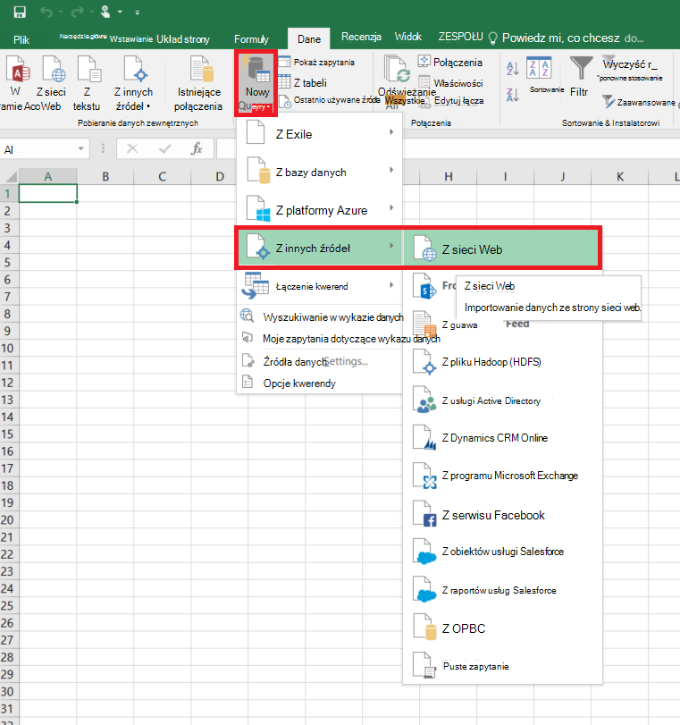
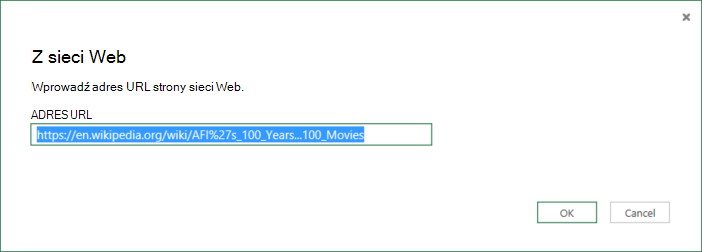
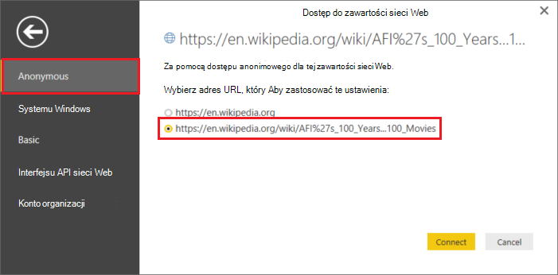
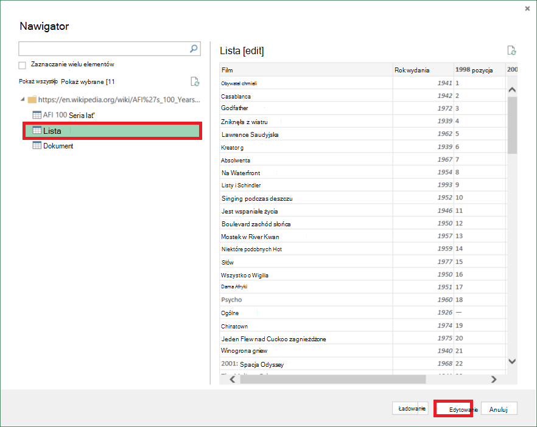
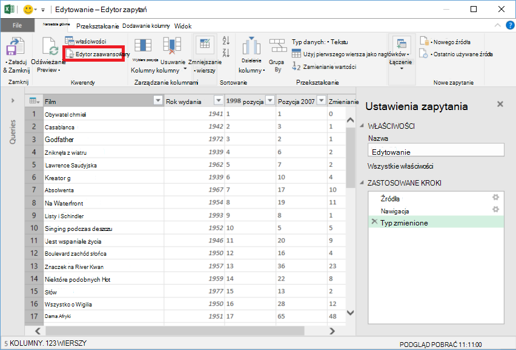
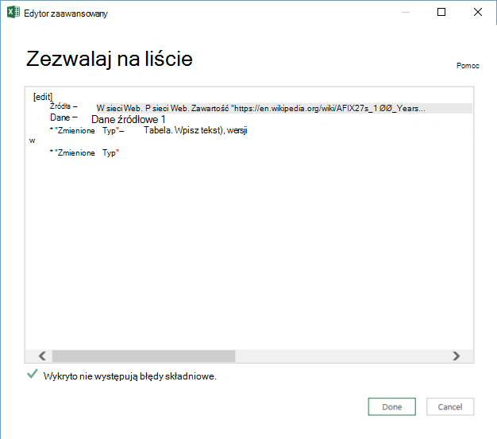

<properties 
    pageTitle="Przenoszenie danych z tabeli sieci Web | Factory Azure danych" 
    description="Informacje na temat przenoszenia danych z lokalnego tabeli na stronie sieci Web przy użyciu Azure danych Factory." 
    services="data-factory" 
    documentationCenter="" 
    authors="linda33wj" 
    manager="jhubbard" 
    editor="monicar"/>

<tags 
    ms.service="data-factory" 
    ms.workload="data-services" 
    ms.tgt_pltfrm="na" 
    ms.devlang="na" 
    ms.topic="article" 
    ms.date="09/26/2016" 
    ms.author="jingwang"/>

# Przenoszenie danych z tabeli źródło w sieci Web przy użyciu Factory danych Azure
W tym artykule opisano, jak użyć aktywności kopii w factory Azure danych w celu skopiowania danych z tabeli na stronie sieci Web do innego magazynu danych. W tym artykule opiera się na artykuł [działania przepływu danych](data-factory-data-movement-activities.md) , w którym przedstawiono ogólne omówienie przenoszenia danych z kopii aktywności i danych obsługiwanych kombinacji magazynu.

Factory danych obecnie obsługuje tylko przenoszenie danych z tabeli sieci Web do innych sklepów danych, ale nie przenoszenie danych z innych danych są przechowywane do miejsca docelowego tabeli sieci Web.

> [AZURE.NOTE] Ten łącznik Web obecnie obsługuje tylko się zawartość tabeli ze strony HTML.

## Przykład: Kopiowanie danych z tabeli sieci Web do obiektów Blob platformy Azure

Poniżej pokazano:

1.  Usługi połączone typu [sieci Web](#web-linked-service-properties).
2.  Usługi połączone typu [AzureStorage](data-factory-azure-blob-connector.md#azure-storage-linked-service-properties).
3.  Wprowadzania [zestawu danych](data-factory-create-datasets.md) typu [WebTable](#WebTable-dataset-properties).
4.  Dane wyjściowe [zestawu danych](data-factory-create-datasets.md) typu [AzureBlob](data-factory-azure-blob-connector.md#azure-blob-dataset-type-properties).
4.  [Potok](data-factory-create-pipelines.md) z działaniem kopii w korzystającego z [WebSource](#websource-copy-activity-type-properties) i [BlobSink](data-factory-azure-blob-connector.md#azure-blob-copy-activity-type-properties).

Próbki kopiuje dane z tabeli sieci Web do obiektów blob platformy Azure co godzinę. Właściwości JSON używane w tych przykładów opisano w sekcjach poniżej próbki. 

Następujący przykład przedstawia sposób skopiować dane z tabeli sieci Web do obiektów blob platformy Azure. Jednak dane można kopiować bezpośrednio do pochłaniacze wspomniano w artykule [Działania przepływu danych](data-factory-data-movement-activities.md) przy użyciu aktywności kopii w Azure danych Factory. 

**Usługi połączone sieci Web** W tym przykładzie użyto usługi sieci Web połączone z uwierzytelnianie anonimowe. Zobacz sekcję [Web połączone usługi](#web-linked-service-properties) dla różnych typów uwierzytelniania, możesz użyć. 

    {
        "name": "WebLinkedService",
        "properties":
        {
            "type": "Web",
            "typeProperties":
            {
                "authenticationType": "Anonymous",
                "url" : "https://en.wikipedia.org/wiki/"
            }
        }
    }

**Azure Usługa magazynu połączone**

    {
      "name": "AzureStorageLinkedService",
      "properties": {
        "type": "AzureStorage",
        "typeProperties": {
          "connectionString": "DefaultEndpointsProtocol=https;AccountName=<accountname>;AccountKey=<accountkey>"
        }
      }
    }

**Zestaw WebTable wprowadzania danych** Ustawienie **zewnętrznych** na **wartość true** informuje usługę Factory danych, że zestawu danych jest zewnętrznych do fabryki danych i nie jest tworzone przez działania w factory danych.

> [AZURE.NOTE] Zobacz sekcję [Uzyskiwanie indeksu tabeli na stronie HTML](#get-index-of-a-table-in-an-html-page) dla czynności, aby wprowadzenie indeks tabeli na stronie HTML.  

    
    {
        "name": "WebTableInput",
        "properties": {
            "type": "WebTable",
            "linkedServiceName": "WebLinkedService",
            "typeProperties": {
                "index": 1,
                "path": "AFI's_100_Years...100_Movies"
            },
            "external": true,
            "availability": {
                "frequency": "Hour",
                "interval":  1
            }
        }
    }

**Zestaw danych wyjściowych obiektów Blob platformy Azure**

Dane są zapisywane nowe blob co godzinę (częstotliwość: godzina, interwał: 1). 

    {
        "name": "AzureBlobOutput",
        "properties":
        {
            "type": "AzureBlob",
            "linkedServiceName": "AzureStorageLinkedService",
            "typeProperties":
            {
                "folderPath": "adfgetstarted/Movies"
            },
            "availability":
            {
                "frequency": "Hour",
                "interval": 1
            }
        }
    }

**Planowanej aktywnością Kopiuj**

Proces zawiera działaniem kopii, który jest skonfigurowany do używania powyżej dane wejściowe i wyjściowe zestawy danych i zaplanowanego co godzinę. W potoku definicji JSON typ **źródła** jest ustawiona na **WebSource** i typ **sink** jest ustawiona na **BlobSink**. 

Zobacz [WebSource typ właściwości](#websource-copy-activity-type-properties) na liście właściwości obsługiwane przez WebSource. 
    
    {  
        "name":"SamplePipeline",
        "properties":{  
        "start":"2014-06-01T18:00:00",
        "end":"2014-06-01T19:00:00",
        "description":"pipeline with copy activity",
        "activities":[  
          {
            "name": "WebTableToAzureBlob",
            "description": "Copy from a Web table to an Azure blob",
            "type": "Copy",
            "inputs": [
              {
                "name": "WebTableInput"
              }
            ],
            "outputs": [
              {
                "name": "AzureBlobOutput"
              }
            ],
            "typeProperties": {
              "source": {
                "type": "WebSource"
              },
              "sink": {
                "type": "BlobSink"
              }
            },
           "scheduler": {
              "frequency": "Hour",
              "interval": 1
            },
            "policy": {
              "concurrency": 1,
              "executionPriorityOrder": "OldestFirst",
              "retry": 0,
              "timeout": "01:00:00"
            }
          }
          ]
       }
    }

## Właściwości powiązanych z sieci Web

Poniższa tabela zawiera opis JSON elementy specyficzne dla połączonej usługi sieci Web.

| Właściwość | Opis | Wymagane |
| -------- | ----------- | -------- | 
| Typ | Ustaw właściwości Typ: **sieci Web** | Tak | 
| Adres URL | Adres URL źródła w sieci Web | Tak |
| authenticationType | Anonimowe lub podstawowe. | Tak |
| Nazwa użytkownika | Nazwa użytkownika dla uwierzytelniania podstawowego. | Tak (w przypadku uwierzytelniania podstawowego)
| hasło | Hasło do uwierzytelniania podstawowego. | Tak (w przypadku uwierzytelniania podstawowego)

### Uwierzytelnianie anonimowe

    {
        "name": "web",
        "properties":
        {
            "type": "Web",
            "typeProperties":
            {
                "authenticationType": "Anonymous",
                "url" : "https://en.wikipedia.org/wiki/"
            }
        }
    }

### Przy użyciu uwierzytelniania podstawowego
    
    {
        "name": "web",
        "properties":
        {
            "type": "Web",
            "typeProperties":
            {
                "authenticationType": "basic",
                "url" : "http://myit.mycompany.com/",
                "userName": "Administrator",
                "password": "password"
            }
        }
    }

## Właściwości zestawu danych WebTable

Aby uzyskać pełną listę sekcji i właściwości dostępnych do definiowania zestawy danych zobacz artykuł [Tworzenie zestawów danych](data-factory-create-datasets.md) . Sekcje, takich jak struktury, dostępność i zasad zestawu danych JSON są podobne dla wszystkich typów zestawu danych (Azure SQL, obiektów blob platformy Azure, Azure tabeli itp.).

W sekcji **typeProperties** różni się dla każdego typu zestawu danych i zawiera informacje o lokalizacji danych w magazynie danych. W sekcji typeProperties zestawu danych typu **WebTable** ma następujące właściwości

Właściwość | Opis | Wymagane
:-------- | :----------- | :--------
Typ    | Typ zestawu danych. musi być ustawiona na **WebTable** | Tak
Ścieżka | Względny adres URL do zasobu, zawierającą tabelę. | Wartość nie. Jeśli ścieżka nie zostanie określony, jest używana tylko adres URL określony w definicji usługi połączone. 
Indeks | Indeks tabeli w zasobie. Zobacz sekcję [Uzyskiwanie indeksu tabeli na stronie HTML](#get-index-of-a-table-in-an-html-page) dla czynności, aby wprowadzenie indeks tabeli na stronie HTML. | Tak

**Przykład:**

    {
        "name": "WebTableInput",
        "properties": {
            "type": "WebTable",
            "linkedServiceName": "WebLinkedService",
            "typeProperties": {
                "index": 1,
                "path": "AFI's_100_Years...100_Movies"
            },
            "external": true,
            "availability": {
                "frequency": "Hour",
                "interval":  1
            }
        }
    }

## WebSource - właściwości Typ kopii aktywności

Aby uzyskać pełną listę sekcji i właściwości dostępnych do definiowania działania zobacz artykuł [Tworzenie procesy](data-factory-create-pipelines.md) . Właściwości, takie jak nazwa, opis, dane wejściowe i wyjściowe tabel i zasady są dostępne dla wszystkich typów działań. 

Właściwości, które są dostępne w sekcji typeProperties działania z drugiej strony zależne od każdego typu działania. Wykonania kopii różnią się w zależności od rodzaju źródeł i ujść.

Obecnie gdy źródle w działaniu Kopiuj jest typu **WebSource**, żadne dodatkowe właściwości są obsługiwane. 

## Uzyskiwanie indeksu tabeli na stronie HTML

1. Uruchom **program Excel 2016** i przejdź do karty **danych** .  
2. Na pasku narzędzi kliknij pozycję **Nowe zapytanie** , wskaż pozycję **Z innych źródeł** , a następnie kliknij pozycję **Z sieci Web**.
    
     
3. W oknie dialogowym **Z sieci Web** , wprowadź **adres URL** , którego użyjesz połączone usługi JSON (na przykład: https://en.wikipedia.org/wiki/) oraz ścieżkę należy określić dla zestawu danych (na przykład: AFI % 27s_100_Years... 100_Movies) i kliknij **przycisk OK**. 

     

    W tym przykładzie użyto adresu URL: https://en.wikipedia.org/wiki/AFI%27s_100_Years...100_Movies 
4.  Jeśli zobaczysz okno dialogowe **zawartości sieci Web programu Access** , zaznacz prawo **adresu URL**, **uwierzytelniania**, a następnie kliknij przycisk **Połącz**. 

    
5.  Kliknij element w widoku drzewa, aby wyświetlić zawartość z tabeli, a następnie kliknij przycisk **Edytuj** u dołu **tabeli** .  

     

5. W oknie **Edytor zapytań** kliknij pozycję **Edytor zaawansowany** przycisku na pasku narzędzi.

    

6. W oknie dialogowym Edytor zaawansowany numer widoczny obok etykiety "Źródłowy" jest indeks.

     

Jeśli korzystasz z programu Excel 2013, użyj [Microsoft Power Query dla programu Excel](https://www.microsoft.com/download/details.aspx?id=39379) , aby uzyskać indeks. Zobacz artykuł [Nawiązywanie połączenia ze stroną sieci web](https://support.office.com/article/Connect-to-a-web-page-Power-Query-b2725d67-c9e8-43e6-a590-c0a175bd64d8) , aby uzyskać szczegółowe informacje. Czynności są podobne, jeśli korzystasz z [Programu Microsoft Power BI dla komputerów stacjonarnych](https://powerbi.microsoft.com/desktop/). 

[AZURE.INCLUDE [data-factory-column-mapping](../../includes/data-factory-column-mapping.md)]

[AZURE.INCLUDE [data-factory-structure-for-rectangualr-datasets](../../includes/data-factory-structure-for-rectangualr-datasets.md)]

## Wydajność i dostosowywanie  
Zobacz [wydajności aktywności kopiowania i dostosowywanie przewodnik](data-factory-copy-activity-performance.md) informacje o kluczowych czynników, które wpływ na wydajność przepływu danych (Kopiuj czynność) w Factory danych Azure i optymalizowanie go na różne sposoby.
