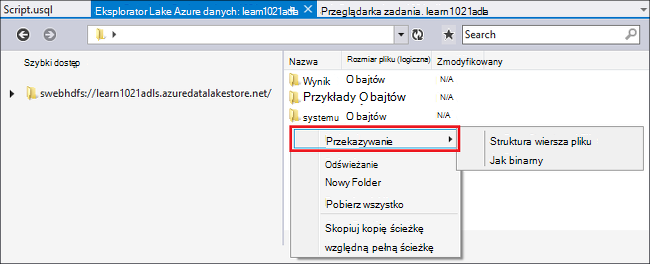
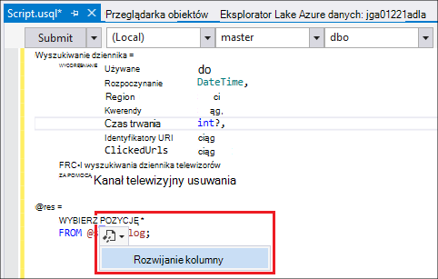
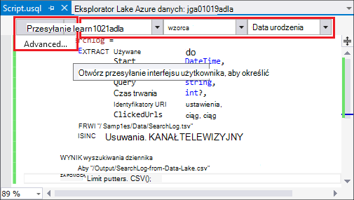
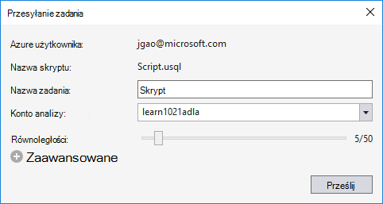
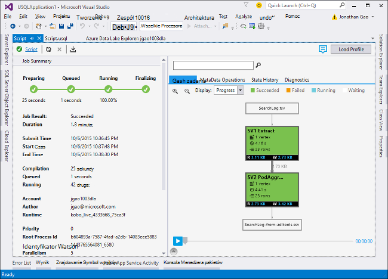
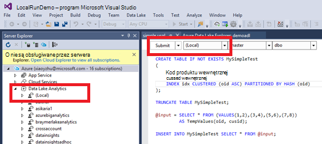
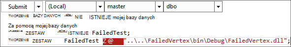

<properties
   pageTitle="Można opracowywać skrypty U SQL za pomocą narzędzia Lake danych dla programu Visual Studio | Azure"
   description="Dowiedz się, jak zainstalować narzędzia Lake danych dla programu Visual Studio, jak opracowywać i skryptów test U-SQL. "
   services="data-lake-analytics"
   documentationCenter=""
   authors="edmacauley"
   manager="jhubbard"
   editor="cgronlun"/>

<tags
   ms.service="data-lake-analytics"
   ms.devlang="na"
   ms.topic="get-started-article"
   ms.tgt_pltfrm="na"
   ms.workload="big-data"
   ms.date="05/16/2016"
   ms.author="edmaca"/>

# Samouczek: projektowania skryptów U SQL przy użyciu narzędzia Lake danych dla programu Visual Studio

[AZURE.INCLUDE [get-started-selector](../../includes/data-lake-analytics-selector-get-started.md)]

Dowiedz się, jak zainstalować narzędzia Lake danych dla programu Visual Studio i pisanie i przetestować skrypty U SQL za pomocą narzędzia Lake danych dla programu Visual Studio.

U SQL jest językiem hyper skalowalna, zdecydowanie extensible przygotowania, przekształcanie i analizowanie danych wszystkich lake danych i późniejsze. Aby uzyskać więcej informacji zobacz — U SQL odwołanie (http://go.microsoft.com/fwlink/p/?LinkId=691348).

##Wymagania wstępne

- **Visual Studio 2015, Visual Studio 2013 zaktualizuj 4 lub program Visual Studio 2012. Enterprise (Ultimate-Premium), Professional, wersje są obsługiwane; społeczności Express edition nie jest obsługiwane. Program Visual Studio "15" nie jest obecnie obsługiwane i pracujemy obecnie nad którą.**
- **Microsoft Azure SDK dla .NET wersji 2.7.1 lub nowszej**.  Zainstaluj go za pomocą [Instalatora platformy sieci Web](http://www.microsoft.com/web/downloads/platform.aspx).
- **[Dane Lake Tools for Visual Studio](http://aka.ms/adltoolsvs)**.

    Po zainstalowaniu narzędzia Lake danych dla programu Visual Studio, zostanie wyświetlony węzeł "Analizy danych Lake" w Eksploratorze serwera węźle "Azure" (można otworzyć Eksploratora serwera, naciskając klawisze Ctrl + Alt + S).

- **Przeglądanie w następujących dwóch sekcjach [Wprowadzenie do analizy Lake danych Azure za pomocą portalu Azure](data-lake-analytics-get-started-portal.md)**.

    - [Utwórz konto Azure danych Lake analizy](data-lake-analytics-get-started-portal.md#create_adl_analytics_account).
    - [Przekazywanie SearchLog.tsv do domyślnego konta magazynowanie Lake danych](data-lake-analytics-get-started-portal.md#update-data-to-the-default-adl-storage-account).

    Dla wygody przykładowy skrypt programu PowerShell Tworzenie danych Lake analityczny usługi i przekazywania plik źródła danych można znaleźć w [próbce Appx-A PowerShell dotyczące przygotowywania samouczka](data-lake-analytics-data-lake-tools-get-started.md#appx-a-powershell-sample-for-preparing-the-tutorial).

    Narzędzia Lake danych nie obsługuje tworzenia kont analizy Lake danych. Dlatego należy utworzyć za pomocą portalu Azure Azure programu PowerShell, .NET SDK lub polecenie Azure. Aby uruchomić zadanie analizy Lake danych, konieczne będzie niektóre dane. Mimo że narzędzia Lake danych obsługuje przekazywania danych, będą korzystać z portalu przekazywania przykładowych danych, aby ułatwić ten samouczek do obserwowania.

## Nawiązywanie połączenia z platformy Azure

**Aby nawiązać połączenie danych Lake analizy**

1. Otwórz program Visual Studio.
2. W menu **Widok** kliknij polecenie **Server Explorer** , aby otworzyć Eksploratora serwera. Lub naciśnij klawisz **[klawisz CTRL,] + [ALT] + S**.
3. Kliknij prawym przyciskiem myszy **Azure**, kliknij pozycję "Łączenie do firmy Microsoft Azure subskrypcję", a następnie postępuj zgodnie instrukcjami.
4. Korzystając z **Eksploratora serwera**rozwiń **Azure**, a następnie rozwiń **Analizy Lake danych**. Jeśli istnieją, są zostanie wyświetlona lista Twoich kont analizy Lake danych. Nie można utworzyć konta analizy Lake danych z programu Visual Studio. Aby utworzyć konto, zobacz [Wprowadzenie do analizy Lake danych Azure za pomocą portalu Azure](data-lake-analytics-get-started-portal.md) lub [Wprowadzenie do analiz Lake danych Azure za pomocą programu PowerShell Azure](data-lake-analytics-get-started-powershell.md).

## Przekazywanie plików danych źródłowych

Niektóre dane w sekcji **wstępne** przekazano wcześniej w samouczku.  

W przypadku, gdy użytkownik chce używać swoich danych, poniżej przedstawiono procedury przekazywania danych na karcie Narzędzia Lake danych.

**Przekazywanie plików do rachunku Lake danych Azure zależne**

1. Korzystając z **Eksploratora serwera**rozwiń węzeł **Azure**, rozwiń węzeł **Analizy Lake danych**, rozwiń konta analizy Lake danych, rozwiń **Kont miejsca do magazynowania**. Są Zobacz domyślne konto magazynowanie Lake danych i połączonych kont magazynowanie Lake danych i połączonych kont magazyn Azure. Domyślne konto Lake danych ma etykietę "Domyślnego magazynu konta".
2. Kliknij prawym przyciskiem myszy domyślne konto magazynowanie Lake danych, a następnie kliknij **Eksploratora**.  Zostanie otwarty narzędzia Lake danych okienka Eksploratora programu Visual Studio.  W po lewej stronie jest wyświetlany widoku drzewa jest widok zawartości po prawej stronie.
3. Przejdź do folderu, w którym chcesz przekazać pliki,
4. Kliknij prawym przyciskiem myszy dowolne puste miejsce, a następnie kliknij przycisk **Przekaż**.

    

**Przekazywanie plików do połączonego konta magazyn obiektów Blob platformy Azure**

1. Korzystając z **Eksploratora serwera**rozwiń węzeł **Azure**, rozwiń węzeł **Analizy Lake danych**, rozwiń konta analizy Lake danych, rozwiń **Kont miejsca do magazynowania**. Są Zobacz domyślne konto magazynowanie Lake danych i połączonych kont magazynowanie Lake danych i połączonych kont magazyn Azure.
2. Rozwijanie konto Azure miejsca do magazynowania.
3. Kliknij prawym przyciskiem myszy kontener, w której chcesz przekazać pliki, a następnie kliknij polecenie **Eksplorator**. Jeśli nie masz kontenera, możesz ją za pomocą portalu Azure, Azure programu PowerShell i innych narzędzi najpierw utworzyć.
4. Przejdź do folderu, w którym chcesz przekazać pliki,
5. Kliknij prawym przyciskiem myszy dowolne puste miejsce, a następnie kliknij przycisk **Przekaż**.

## Można opracowywać skrypty U SQL

Zadania analizy Lake danych są zapisywane w języku U SQL. Aby dowiedzieć się więcej na temat U SQL, zobacz [Wprowadzenie do języka U SQL](data-lake-analytics-u-sql-get-started.md) i [Dokumentacja języka U SQL](http://go.microsoft.com/fwlink/?LinkId=691348).

**Aby utworzyć i przesłać zadanie analizy Lake danych**

1. W menu **plik** kliknij polecenie **Nowy**, a następnie kliknij **Projekt**.
2. Wybierz typ **Projektu U-SQL** .

    

3. Kliknij **przycisk OK**. Program Visual studio powoduje rozwiązanie z pliku **Script.usql** .
4. Wprowadź następujący skrypt do **Script.usql**:

        @searchlog =
            EXTRACT UserId          int,
                    Start           DateTime,
                    Region          string,
                    Query           string,
                    Duration        int?,
                    Urls            string,
                    ClickedUrls     string
            FROM "/Samples/Data/SearchLog.tsv"
            USING Extractors.Tsv();

        @res =
            SELECT *
            FROM @searchlog;        

        OUTPUT @res   
            TO "/Output/SearchLog-from-Data-Lake.csv"
        USING Outputters.Csv();

    Ten skrypt U SQL odczytuje plik źródła danych przy użyciu **Extractors.Tsv()**, a następnie utworzy plik csv przy użyciu **Outputters.Csv()**.

    Nie Modyfikuj dwie ścieżki, jeśli plikiem źródłowym jest kopiowana do innej lokalizacji.  Jeśli nie istnieje, analizy Lake danych utworzy folder wyjściowy.

    Jest prostsze Użyj ścieżki względne do plików przechowywanych w domyślnych danych Lake konta. Można także używać ścieżek bezwzględnych.  Na przykład

        adl://<Data LakeStorageAccountName>.azuredatalakestore.net:443/Samples/Data/SearchLog.tsv

    Aby uzyskać dostęp do plików w połączonych kont miejsca do magazynowania, należy użyć ścieżki bezwzględne.  Składnia plików przechowywanych w połączony klient magazyn Azure jest następująca:

        wasb://<BlobContainerName>@<StorageAccountName>.blob.core.windows.net/Samples/Data/SearchLog.tsv

    >[AZURE.NOTE] Azure kontenera obiektów Blob z uprawnieniami dostępu publicznej kontenerów lub publicznej blob nie są obecnie obsługiwane.  

    Zwróć uwagę następujące funkcje:

    - **Lista IntelliSense**

        Automatyczne nazwę wykonane i członków będą wyświetlane dla wierszy, klas, bazy danych, schematy i obiekty zdefiniowane przez użytkownika (UDOs).

        IntelliSense dla jednostek wykazu (baz danych, schematy, tabele, UDOs itp.) jest związanych z Twoim kontem obliczeń. Sprawdzanie konta aktywnego obliczeń, bazy danych i schematu na pasku narzędzi u góry i włączenie ich do listy rozwijane.

    - **Rozwiń* kolumn**

        Kliknij przycisk po prawej stronie *, zapewniają niebieski podkreślenie pod *. Umieść kursor myszy na niebieskim podkreślenie, a następnie kliknij strzałkę w dół.
        

        **Rozwijanie kolumn**, kliknij narzędzie zostanie zastąpiony * z nazwami kolumn.

    - **Automatyczne formatowanie**

        Użytkownicy mogą zmienić wcięcie skryptu U SQL na podstawie kodu struktury w obszarze Edytuj -> Zaawansowane:

        - Formatowanie dokumentu (Ctrl + E, D): Formatowanie całego dokumentu   
        - Formatuj zaznaczenie (Ctrl + K, Ctrl + F): Formatuje zaznaczenia. Jeśli dokonano żadnego zaznaczenia, ten skrót formatuje wiersz, który znajduje się kursor.  

        Całe formatowanie reguły są konfigurowane w obszarze Narzędzia -> Opcje -> edytora tekstu - > SIP -> Formatowanie.  
    - **Wcięcie inteligentne**

        Narzędzia Lake danych dla programu Visual Studio będzie mógł wcięcie wyrażeń automatycznie podczas pisania skryptów. Ta funkcja jest domyślnie wyłączona, należy włączyć ją do sprawdzania U użytkownikom-SQL -> Opcje i Ustawienia -> przełączniki -> Włącz inteligentne wcięcie.

    - **Przejdź do definicji i Znajdź wszystkie odwołania**

        Klikając prawym przyciskiem myszy nazwę wierszy/parametru kolumny i UDO itd., a następnie klikając polecenie Przejdź do definicji (F12) umożliwia przejście do definicji. Klikając przycisk Znajdź wszystkie odwołania (Shift + F12), zostanie wyświetlona wszystkie odwołania.

    - **Wstaw ścieżkę Azure**

        Zamiast dokonywaniu ścieżka pliku Azure i wpisz go ręcznie, podczas pisania skryptu, narzędzia Lake danych dla programu Visual Studio umożliwia łatwe: kliknij prawym przyciskiem myszy w edytorze, kliknij przycisk Wstaw ścieżkę Azure. Przejdź do pliku w oknie przeglądarki obiektów Blob platformy Azure. Kliknij **przycisk OK**. Ścieżka pliku zostanie wstawiona do kodu.

5. Określ konto analizy Lake danych, bazy danych i schematu. Możesz wybrać **(lokalny)** do uruchomienia skryptu lokalnie w celu testowania. Aby uzyskać więcej informacji zobacz [Uruchamianie U-SQL lokalnie](#run-u-sql-locally).

    

    Aby uzyskać więcej informacji zobacz [katalog Użyj U-SQL](data-lake-analytics-use-u-sql-catalog.md).

5. Korzystając z **Eksploratora rozwiązań**kliknij prawym przyciskiem myszy **Script.usql**, a następnie kliknij **Tworzenia skryptów**. Sprawdź wyniki w okienku wynik.
6. Korzystając z **Eksploratora rozwiązań**kliknij prawym przyciskiem myszy **Script.usql**, a następnie kliknij **Przesyłanie skryptu**. Opcjonalnie możesz również kliknąć **Prześlij** z okienka Script.usql.  Zobacz poprzedniego zrzut ekranu.  Kliknij strzałkę w dół obok przycisk Zatwierdź, aby przesłać przy użyciu opcji advance:
7. Określ **Nazwę zadania**, sprawdź **Analizy konta**, a następnie kliknij przycisk **Prześlij**. Wyniki przesyłania i łącze do zadania są dostępne w narzędziach Lake danych dla programu Visual Studio powoduje okna po zakończeniu przekazywania.

    

8. Należy kliknąć przycisk Odśwież, aby wyświetlić najnowsze stan zadania i odświeżanie ekranu. Gdy sukcesów zadanie zostanie wyświetlona **Wykresu zadania** **Operacje na danych Meta** **Historii stanu**, **Diagnostyka**:

    

    * Podsumowanie zadań. Pokaż podsumowanie bieżące zadanie, np.: stan postępu, czas wykonywania, nazwę środowisko uruchomieniowe, przesyłające itp.   
    * Szczegóły zadania. Szczegółowe informacje nad tym zadaniem, znajdują się w tym skrypt, zasób, wierzchołek wykonanie widoku.
    * Wykres zadania. Cztery wykresy służą do wizualizacji informacje o zadaniu: postęp odczytu danych, dane zapisane, czas wykonywania, Średni czas wykonywania na węzeł, przepustowość danych wejściowych, przepustowość dane wyjściowe.
    * Operacje metadanych. Pokazuje wszystkie operacje metadanych.
    * Historia stanu.
    * Narzędzia diagnostyczne. Narzędzia Lake danych dla programu Visual Studio będzie automatycznie diagnozowanie wykonywania zadań. W przypadku niektórych błędów lub występują problemy z wydajnością w swoich zadań będą otrzymywać alerty. Zobacz zadania część diagnostyki (łącze do ustalenia), aby uzyskać więcej informacji.

**Aby sprawdzić stan zadania**

1. Eksploratora serwera rozwiń **Azure**, rozwiń węzeł **Analizy Lake danych**, rozwiń nazwę konta analizy Lake danych
2. Kliknij dwukrotnie **zadania** , aby wyświetlić listę zadań.
2. Kliknij zadanie, aby wyświetlić stan.

**Aby wyświetlić wynik zadania**

1. Korzystając z **Eksploratora serwera**rozwiń **Azure**, rozwiń węzeł **Analizy Lake danych**, rozwiń konta analizy Lake danych, rozwiń **Kont miejsca do magazynowania**, kliknij prawym przyciskiem myszy domyślne konto magazynowanie Lake danych, a następnie kliknij **Eksploratora**.
2.  Kliknij dwukrotnie **wynik** , aby otworzyć folder
3.  Kliknij dwukrotnie **SearchLog z adltools.csv**.

###Odtwarzanie zadania

Odtwarzanie zadania umożliwia obejrzeć postępu wykonania zadania i wizualnie wykrywa się różnic w odniesieniu wydajności i problemów. Czy można użyć tej funkcji, przed zakończeniem zadanie wykonanie (to znaczy w czasie, gdy zadanie jest uruchomione aktywnie), a także po zakończeniu wykonywania. Wykonując odtwarzanie podczas wykonywania zadania pozwoli użytkownikowi na odczytywanie na głos postępu do bieżącej godziny.

**Aby wyświetlić postęp realizacji zadania**  

1. Kliknij przycisk **Załaduj profil** w prawym górnym rogu. Zobacz poprzedniego zrzut ekranu.
2. Kliknij przycisk odtwarzania w lewym dolnym rogu umożliwia przeglądanie postępu wykonania zadania.
3. Podczas odtwarzania kliknij przycisk **Wstrzymaj** , aby je zatrzymać lub bezpośrednio do konkretnych pozycji przeciągnij pasek postępu.

###Konturowy

Narzędzia Lake danych dla programu Visual Studio zawiera możliwe do wybrania użytkownika nakładki kolorów w widoku zadania, aby wskazać postępu, danych we/wy, czas wykonywania przepustowość danych każdego etapu. Za pośrednictwem tego użytkownicy mogą ustalanie potencjalne problemy i rozkład właściwości zadania bezpośrednio i intuicyjnie. Możesz wybrać źródła danych, aby wyświetlić na liście rozwijanej.  

## Uruchom program SQL U lokalnie

Używanie lokalnego U SQL uruchomienia systemu w programie Visual Studio, można:

- Uruchom lokalnie, skrypty U SQL wraz z zestawów C#.
- Debugowanie C# zestawów lokalnie.
- Tworzenie i usuwanie widoku lokalnych bazach danych, zestawy, schematy i tabel w Eksploratorze serwera tylko, jak usługi Azure danych Lake analizy.

Zostanie wyświetlona *lokalnego* konta w programie Visual Studio i Instalator tworzy *DataRoot* folderu znajdującego się *C:\LocalRunRoot*. Będzie można użyć folderu DataRoot:

- Magazyn metadanych w tym tabele, DBs, TVFs itd.
- Dla niektórych skryptu: Jeśli ścieżkę względną odwołuje się do ścieżki wejścia i wyjścia, możemy przeszukuje DataRoot (a także ścieżkę skryptu, jeśli wejściowych informatycznego)
- DataRoot folder nie będzie się odwoływać, jeśli chcesz zarejestrować zestawu i używanie ścieżkę względną (patrz "używanie zestawów Twoją lokalne Uruchom" część uzyskać więcej szczegółowych informacji)

Poniższym klipie wideo zaprezentowano lokalne funkcji wykonywania U SQL:

>[AZURE.VIDEO usql-localrun]

### Znane problemy i ograniczenia

- Nie można utworzyć tabelę DB itd. w Eksploratorze serwera dla lokalnego konta.
- Kiedy przez odwołanie względne ścieżki:

    - Wprowadzanie skrypt w (WYODRĘBNIĆ * od "/ ścieżki/abc") — zarówno ścieżkę DataRoot, jak i ścieżkę skryptu będzie przeszukiwana.
    - Skrypt rezultaty (wyjścia do "Ścieżka/abc"): ścieżka DataRoot będzie używany jako folder wyjściowy.
    - W zestawie rejestracji (Tworzenie zestawu xyz z "/ ścieżki/abc"): ścieżka skryptu będą przeszukiwane, ale nie DataRoot.
    - W zarejestrowany TVF-widoku lub innych jednostkach metadanych: ścieżka DataRoot będą przeszukiwane, ale nie ścieżkę skryptu.

    Dotyczące skryptów uruchomiono Lake danych usługi, domyślne konto miejsca do magazynowania będzie używany jako folder główny i będą odpowiednio przeszukiwane.

### Testowanie lokalnie skryptów U SQL
Aby uzyskać instrukcje dotyczące tworzenia skryptów U SQL zobacz [skryptów można opracowywać U-SQL](#develop-and-test-u-sql-scripts). Aby tworzenie i uruchamianie U SQL skryptów lokalnie, wybierz z listy rozwijanej klaster **(lokalny)** i kliknij przycisk **Prześlij**. Upewnij się, że masz właściwych danych, do których odwołuje się - albo zajrzyj do ścieżki lub umieszczenia danych w folderze DataRoot.

Możesz można kliknij prawym przyciskiem myszy skrypt, a następnie kliknij polecenie **Uruchom Plan lokalnych** w menu kontekstowym lub naciśnij klawisze **CTRL + F5** lokalnie wyzwalacza uruchamianie.

### Używanie zestawów lokalnego uruchamianie

Istnieją dwa sposoby uruchamiania niestandardowych plików C#:

- Pisanie zestawów w kodu źródłowego pliku i zestawy zostaną automatycznie zarejestrowane i usunięte po zakończeniu skrypt.
- Tworzenie projektu zestawu C# i zarejestrować biblioteki wyjścia do lokalnego konta za pomocą skryptu tak jak poniżej. Pamiętaj, że ścieżka jest względna w stosunku skrypt, a nie DataRoot folder.

### Debugowanie skryptów i C# zestawów lokalnie

C# zestawy można debugowania bez przesyłania i jego zarejestrowaniem z usługą Azure danych Lake analizy. W obu kodu źródłowego pliku i zakresem projektu C# można ustawić punktów kontrolnych.

**Debugowanie kod lokalny w kodu źródłowego pliku**
1.  Ustawianie punktów kontrolnych w kodu źródłowego pliku.
2.  Naciśnij klawisz **F5** , aby debugowanie skryptu lokalnie.

Poniższa procedura dotyczy tylko w Visual Studio 2015 r. W programie Visual Studio starsze może być konieczne ręczne dodawanie plików pdb.

**Debugowanie kod lokalny w zakresem projektu C#**
1.  Tworzenie projektu C# zestawu i tworzenie go, aby wygenerować dll dane wyjściowe.
2.  Zarejestruj dll przy użyciu instrukcji U SQL:

        CREATE ASSEMBLY assemblyname FROM @"..\..\path\to\output\.dll";
3.  Ustawianie punktów kontrolnych w kodzie C#.
4.  Naciśnij klawisz **F5** , aby debugowanie skryptu odwoływanie się do C# dll lokalnie.  

##Zobacz też

Aby rozpocząć pracę z analiz Lake danych za pomocą różnych narzędzi, zobacz:

- [Wprowadzenie do analizy Lake danych za pomocą portalu Azure](data-lake-analytics-get-started-portal.md)
- [Wprowadzenie do analizy Lake danych przy użyciu programu PowerShell Azure](data-lake-analytics-get-started-powershell.md)
- [Wprowadzenie do analizy Lake danych przy użyciu zestawu SDK .NET](data-lake-analytics-get-started-net-sdk.md)
- [Debugowanie kodu C# w zadaniach U SQL](data-lake-analytics-debug-u-sql-jobs.md)

Aby wyświetlić więcej tematów rozwoju:

- [Analizowanie dzienniki w sieci Web przy użyciu analizy Lake danych](data-lake-analytics-analyze-weblogs.md)
- [Można opracowywać skrypty U SQL za pomocą narzędzia Lake danych dla programu Visual Studio](data-lake-analytics-data-lake-tools-get-started.md)
- [Wprowadzenie do języka Azure danych Lake analizy U-SQL](data-lake-analytics-u-sql-get-started.md)
- [Można opracowywać U SQL operatorów zdefiniowanych przez użytkownika dla zadań analizy Lake danych](data-lake-analytics-u-sql-develop-user-defined-operators.md)

##Przykładowy programu PowerShell A ApX dotyczące przygotowywania przerabiania samouczka

Poniższy skrypt programu PowerShell przygotowuje konto Azure danych Lake analizy i dane źródłowe, można przejść do [skryptów można opracowywać U-SQL](data-lake-analytics-data-lake-tools-get-started.md#develop-u-sql-scripts).

    #region - used for creating Azure service names
    $nameToken = "<Enter an alias>"
    $namePrefix = $nameToken.ToLower() + (Get-Date -Format "MMdd")
    #endregion

    #region - service names
    $resourceGroupName = $namePrefix + "rg"
    $dataLakeStoreName = $namePrefix + "adas"
    $dataLakeAnalyticsName = $namePrefix + "adla"
    $location = "East US 2"
    #endregion

    # Treat all errors as terminating
    $ErrorActionPreference = "Stop"

    #region - Connect to Azure subscription
    Write-Host "`nConnecting to your Azure subscription ..." -ForegroundColor Green
    try{Get-AzureRmContext}
    catch{Login-AzureRmAccount}
    #endregion

    #region - Create an Azure Data Lake Analytics service account
    Write-Host "Create a resource group ..." -ForegroundColor Green
    New-AzureRmResourceGroup `
        -Name  $resourceGroupName `
        -Location $location

    Write-Host "Create a Data Lake account ..."  -ForegroundColor Green
    New-AzureRmDataLakeStoreAccount `
        -ResourceGroupName $resourceGroupName `
        -Name $dataLakeStoreName `
        -Location $location

    Write-Host "Create a Data Lake Analytics account ..."  -ForegroundColor Green
    New-AzureRmDataLakeAnalyticsAccount `
        -Name $dataLakeAnalyticsName `
        -ResourceGroupName $resourceGroupName `
        -Location $location `
        -DefaultDataLake $dataLakeStoreName

    Write-Host "The newly created Data Lake Analytics account ..."  -ForegroundColor Green
    Get-AzureRmDataLakeAnalyticsAccount `
        -ResourceGroupName $resourceGroupName `
        -Name $dataLakeAnalyticsName  
    #endregion

    #region - prepare the source data
    Write-Host "Import the source data ..."  -ForegroundColor Green
    $localFolder = "C:\Tutorials\Downloads\" # A temp location for the file.
    $storageAccount = "adltutorials"  # Don't modify this value.
    $container = "adls-sample-data"  #Don't modify this value.

    # Create the temp location  
    New-Item -Path $localFolder -ItemType Directory -Force

    # Download the sample file from Azure Blob storage
    $context = New-AzureStorageContext -StorageAccountName $storageAccount -Anonymous
    $blobs = Azure\Get-AzureStorageBlob -Container $container -Context $context
    $blobs | Get-AzureStorageBlobContent -Context $context -Destination $localFolder

    # Upload the file to the default Data Lake Store account    
    Import-AzureRmDataLakeStoreItem -AccountName $dataLakeStoreName -Path $localFolder"SearchLog.tsv" -Destination "/Samples/Data/SearchLog.tsv"

    Write-Host "List the source data ..."  -ForegroundColor Green
    Get-AzureRmDataLakeStoreChildItem -Account $dataLakeStoreName -Path  "/Samples/Data/"
    #endregion
