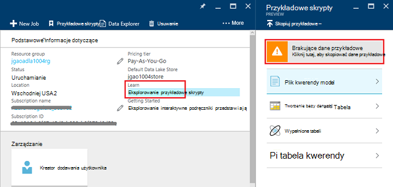
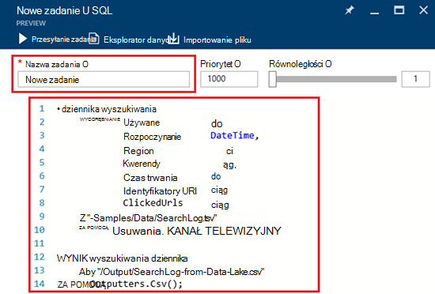
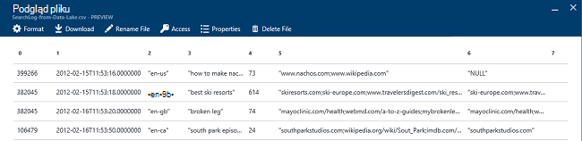

<properties 
   pageTitle="Wprowadzenie do analizy Lake danych Azure za pomocą portalu Azure | Azure" 
   description="Dowiedz się, jak utworzyć konto analizy Lake danych, utworzyć zadanie analizy Lake danych za pomocą U-SQL za pomocą portalu Azure i przesłać zadanie. " 
   services="data-lake-analytics" 
   documentationCenter="" 
   authors="edmacauley" 
   manager="jhubbard" 
   editor="cgronlun"/>
 
<tags
   ms.service="data-lake-analytics"
   ms.devlang="na"
   ms.topic="hero-article"
   ms.tgt_pltfrm="na"
   ms.workload="big-data" 
   ms.date="10/06/2016"
   ms.author="edmaca"/>

# Samouczek: wprowadzenie do analiz Lake danych Azure za pomocą Azure portal

[AZURE.INCLUDE [get-started-selector](../../includes/data-lake-analytics-selector-get-started.md)]

Dowiedz się, jak utworzyć konta Azure danych Lake analizy, definiowanie zadań analizy Lake danych w [Języku SQL U](data-lake-analytics-u-sql-get-started.md)i przesyłać zadania z usługą analizy Lake danych za pomocą portalu Azure. Aby uzyskać więcej informacji na temat analizy Lake danych zobacz [Omówienie analizy Lake danych Azure](data-lake-analytics-overview.md).

W tym samouczku można opracowywać zadanie, który odczytuje karty pliku wartości (TSV) i konwertuje ją do pliku (CSV wartości) przecinkami. Do wykonywania kroków samej samouczka przy użyciu innych obsługiwanych narzędzi, kliknij karty u góry tej sekcji. Po pomyślnym pierwszego zadania możesz rozpocząć pisanie bardziej złożonych danych przekształceń U-SQL.

##Wymagania wstępne

Przed rozpoczęciem tego samouczka, musi mieć następujące elementy:

- **Azure subskrypcji**. Zobacz [Azure pobrać bezpłatną wersję próbną](https://azure.microsoft.com/pricing/free-trial/).

##Tworzenie konta analizy Lake danych

Przed uruchomieniem zadania, musisz mieć konto analizy Lake danych.

Każde konto analizy Lake danych ma zależność konto [Azure magazynu Lake danych]() .  To konto jest określana jako konto domyślne magazynu Lake danych.  Możesz utworzyć konta magazynu Lake danych wcześniej, lub po utworzeniu konta analizy Lake danych. W tym samouczku utworzysz konto magazynu Lake danych za pomocą konta analizy Lake danych.

**Aby utworzyć konto analizy Lake danych**

1. Logowanie się do [portalu Azure](https://portal.azure.com).
2. Kliknij przycisk **Nowy**, kliknij pozycję **analizy + analizy**, a następnie kliknij **Analizy Lake danych**.
3. Wpisz lub wybierz następujące wartości:

    

    - **Nazwa**: Nazwa konta analizy Lake danych.
    - **Subskrypcja**: Wybierz subskrypcję Azure dla konta analizy.
    - **Grupa zasobów**. Wybierz istniejącą grupą zasobów Azure lub Utwórz nową. Azure Menedżera zasobów umożliwia pracę z zasobami w aplikacji jako grupy. Aby uzyskać więcej informacji zobacz [Omówienie Menedżera zasobów Azure](resource-group-overview.md). 
    - **Lokalizacja**. Wybierz pozycję Centrum danych Azure konta analizy Lake danych. 
    - **Magazyn Lake danych**: Konto każdego analizy Lake danych ma zależne konta magazynu Lake danych. Konto analizy Lake danych oraz zależne magazynu Lake danych musi znajdować się w tym samym centrum danych Azure. Postępuj zgodnie z instrukcjami, aby utworzyć nowe konto magazynu Lake danych, lub wybierz istniejący.

8. Kliknij przycisk **Utwórz**. Przejście do portalu ekranu głównego. Fragment jest dodawana do StartBoard z etykietą przedstawiający "Wdrażanie Azure danych Lake analizy". Wystarczy kilka minut, aby utworzyć konto analizy Lake danych. Po utworzeniu konta portalu zostanie wyświetlona na koncie dla nowych kart.

Po utworzeniu konta analizy Lake danych, możesz dodać kolejne konta magazynu Lake danych i Magazyn Azure. Aby uzyskać instrukcje zobacz [Zarządzanie analizy lake dane konto źródeł danych](data-lake-analytics-manage-use-portal.md#manage-account-data-sources).

##Przygotowywanie danych źródłowych

W tym samouczku proces niektóre dzienniki wyszukiwania.  Dziennik wyszukiwania mogą być przechowywane w magazynie dData Lake lub magazyn obiektów Blob platformy Azure. 

Azure portal przewiduje kopiowania kilka przykładowych plików danych do domyślnego konta magazynu Lake danych, które dołączyć plik dziennika wyszukiwania w interfejsie użytkownika.

**Aby skopiować przykładowe pliki danych**

1. [Azure portal](https://portal.azure.com)Otwórz konta analizy Lake danych.  Zobacz [Zarządzanie danymi analizy Lake kont](data-lake-analytics-get-started-portal.md#manage-accounts) utworzyć i otworzyć konto w portalu.
3. Rozwiń okienko **Essentials** , a następnie kliknij polecenie **Eksploruj przykładowe skrypty**. Otwiera innego karta o nazwie **Przykładowe skrypty**.

    

4. Kliknij pozycję **Brak przykładowych danych** do skopiowania przykładowe pliki danych. Po zakończeniu, portalu są wyświetlane **dane przykładowe zaktualizowane pomyślnie**.
7. Na górze karta konta analizy Lake danych, kliknij **Eksplorator danych** . 

    

    Zostanie otwarty dwie karty. Jest **Eksplorator danych**, a drugi jest domyślne konto magazynu Lake danych.
8. W domyślnej karta konta magazynu Lake danych kliknij przycisk **próbki** rozwiń folder i kliknij pozycję **dane** do rozwiń folder. Zobaczysz są następujące pliki i foldery:

    - AmbulanceData-
    - AdsLog.tsv
    - SearchLog.tsv
    - Version.txt
    - WebLog.log
    
    W tym samouczku program SearchLog.tsv.

W praktyce albo program aplikacje zapis danych do kont połączonych miejsca do magazynowania lub Przekaż danych. Aby uzyskać przekazywania plików, zobacz [przekazywanie danych do magazynu Lake danych](data-lake-analytics-manage-use-portal.md#upload-data-to-adls) lub [przekazywanie danych z magazynem obiektów Blob](data-lake-analytics-manage-use-portal.md#upload-data-to-wasb).

##Tworzenie i przesyłanie danych Lake analizy zadań

Po zostały przygotowane dane źródłowe, możesz zacząć opracowywania skrypt U-SQL.  

**Aby przesłać zadanie**

1. W portalu karta konta analizy Lake danych kliknij **Nowe zadanie**. 

    

    Jeśli karta nie jest widoczna, zobacz [Otwieranie konto analizy Lake danych w portalu](data-lake-analytics-manage-use-portal.md#access-adla-account).
2. Wpisz **Nazwę zadania**i poniższy skrypt U SQL:

        @searchlog =
            EXTRACT UserId          int,
                    Start           DateTime,
                    Region          string,
                    Query           string,
                    Duration        int?,
                    Urls            string,
                    ClickedUrls     string
            FROM "/Samples/Data/SearchLog.tsv"
            USING Extractors.Tsv();
        
        OUTPUT @searchlog   
            TO "/Output/SearchLog-from-Data-Lake.csv"
        USING Outputters.Csv();

    

    Ten skrypt U SQL odczytuje plik źródła danych przy użyciu **Extractors.Tsv()**, a następnie utworzy plik csv przy użyciu **Outputters.Csv()**. 
    
    Nie Modyfikuj dwie ścieżki, chyba że skopiuj plik źródłowy do innej lokalizacji.  Dane Lake analizy tworzy folder wyjściowy, jeśli nie istnieje.  W tym przypadku użyto prostej i względne ścieżki.  
    
    Jest prostsze używanie ścieżek względnych dla plików przechowywanych w domyślnych Lake danych kont. Można także używać ścieżek bezwzględnych.  Na przykład 
    
        adl://<Data LakeStorageAccountName>.azuredatalakestore.net:443/Samples/Data/SearchLog.tsv
      

    Aby uzyskać więcej informacji o U SQL zobacz [Wprowadzenie do języka Azure danych Lake analizy U-SQL](data-lake-analytics-u-sql-get-started.md) i [Dokumentacja języka U SQL](http://go.microsoft.com/fwlink/?LinkId=691348).
     
3. Kliknij przycisk **Prześlij zadanie** , od góry.   
4. Poczekaj, aż stan zadania został zamieniony na **powiodło się**. Możesz sprawdzić, czy zadanie zajęła około minutę do wykonania.
    
    W przypadku, gdy zadanie powiodło się, zobacz [monitorze i rozwiązywanie problemów z zadaniami danych Lake analizy](data-lake-analytics-monitor-and-troubleshoot-jobs-tutorial.md).

5. W dolnej części karta kliknij kartę **dane wyjściowe** , a następnie kliknij **SearchLog z danych Lake.csv**. Można wyświetlić podgląd, Pobierz, Zmień nazwę i usuń plik docelowy.

    

##Zobacz też

- Aby uzyskać bardziej złożonych kwerend, zobacz [Dzienniki analiza witryny sieci Web przy użyciu analizy Lake danych Azure](data-lake-analytics-analyze-weblogs.md).
- Aby rozpocząć tworzenie aplikacji U SQL, zobacz [skryptów można opracowywać U-SQL przy użyciu narzędzia Lake danych dla programu Visual Studio](data-lake-analytics-data-lake-tools-get-started.md).
- Aby dowiedzieć się U SQL, zobacz [Wprowadzenie do języka Azure danych Lake analizy U-SQL](data-lake-analytics-u-sql-get-started.md).
- Do zadań zarządzania zobacz [Zarządzanie analizy Lake danych Azure za pomocą portalu Azure](data-lake-analytics-manage-use-portal.md).
- Aby uzyskać omówienie analizy Lake danych, zobacz [Omówienie analizy Lake danych Azure](data-lake-analytics-overview.md).
- Aby wyświetlić samej samouczka przy użyciu innych narzędzi, kliknij selektory kartę w górnej części strony.
- Aby rejestrować informacje diagnostyczne, zobacz [Uzyskiwanie dostępu do dzienników Diagnostyka Azure danych Lake analiz](data-lake-analytics-diagnostic-logs.md)
