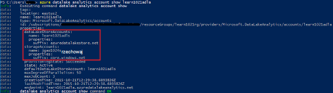
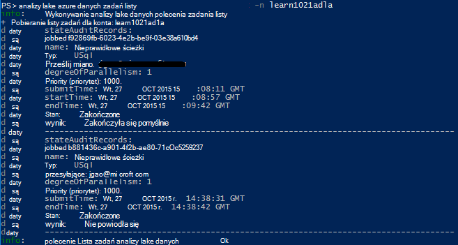

<properties 
   pageTitle="Zarządzanie analiz Lake danych Azure za pomocą interfejsu wiersza polecenia Azure | Azure" 
   description="Dowiedz się, jak zarządzać kontami analizy Lake danych, źródła danych, zadania i użytkowników przy użyciu interfejsu wiersza polecenia Azure" 
   services="data-lake-analytics" 
   documentationCenter="" 
   authors="edmacauley" 
   manager="jhubbard" 
   editor="cgronlun"/>
 
<tags
   ms.service="data-lake-analytics"
   ms.devlang="na"
   ms.topic="article"
   ms.tgt_pltfrm="na"
   ms.workload="big-data" 
   ms.date="05/16/2016"
   ms.author="edmaca"/>

# Zarządzanie analiz Lake danych Azure za pomocą interfejsu wiersza polecenia Azure (polecenie)

[AZURE.INCLUDE [manage-selector](../../includes/data-lake-analytics-selector-manage.md)]

Dowiedz się, jak zarządzać kontami Azure danych Lake analizy, źródeł danych użytkowników i zadań przy użyciu Azure. Aby wyświetlić temat zarządzania przy użyciu innych narzędzi, kliknij powyższe wybierz kartę.

**Wymagania wstępne**

Przed rozpoczęciem tego samouczka, musisz mieć następujące czynności:

- **Azure subskrypcji**. Zobacz [Azure pobrać bezpłatną wersję próbną](https://azure.microsoft.com/pricing/free-trial/).
- **Polecenie azure**. Zobacz [zainstalować i skonfigurować polecenie Azure](../xplat-cli-install.md).
    - Pobieranie i instalowanie **wersji wstępnej** [Azure interfejsu wiersza polecenia narzędzia](https://github.com/MicrosoftBigData/AzureDataLake/releases) w celu wykonania tego pokazu.
- **Uwierzytelnianie**przy użyciu następującego polecenia:

        azure login
    Aby uzyskać więcej informacji o uwierzytelnianiu za pomocą konta służbowego zobacz [Łączenie się Azure subskrypcję polecenie Azure](../xplat-cli-connect.md).
- **Przełącz do trybu Menedżer zasobów Azure**, przy użyciu następującego polecenia:

        azure config mode arm

**Aby wyświetlić listę poleceń magazynu Lake danych i analizy Lake danych:**

    azure datalake store
    azure datalake analytics

<!-- ################################ -->
<!-- ################################ -->
## Zarządzanie kontami

Przed uruchomieniem zadania analizy Lake danych, musisz mieć konto analizy Lake danych. W odróżnieniu od Azure HDInsight nie zapłacić dla konta analizy zadanie nie jest uruchomiony.  Płacisz tylko raz, gdy działa zadanie.  Aby uzyskać więcej informacji zobacz [Omówienie analizy Lake danych Azure](data-lake-analytics-overview.md).  

###Tworzenie kont

    azure datalake analytics account create "<Data Lake Analytics Account Name>" "<Azure Location>" "<Resource Group Name>" "<Default Data Lake Account Name>"

###Aktualizowanie kont

Następujące polecenie aktualizuje właściwości istniejącego konta analizy Lake danych
    
    azure datalake analytics account set "<Data Lake Analytics Account Name>"

###Listy kont

Konta analizy Lake danych listy 

    azure datalake analytics account list

Kont analizy Lake danych listy w obrębie danej grupy zasobów

    azure datalake analytics account list -g "<Azure Resource Group Name>"

Wyświetlanie szczegółów określonego konta analizy Lake danych

    azure datalake analytics account show -g "<Azure Resource Group Name>" -n "<Data Lake Analytics Account Name>"

###Usuwanie kont analizy Lake danych

    azure datalake analytics account delete "<Data Lake Analytics Account Name>"

<!-- ################################ -->
<!-- ################################ -->
## Zarządzanie źródłami danych konta

Analizy Lake danych obsługuje obecnie następujących źródeł danych:

- [Magazyn Lake danych Azure](../data-lake-store/data-lake-store-overview.md)
- [Azure miejsca do magazynowania](../storage/storage-introduction.md)

Po utworzeniu konta analizy należy wyznaczyć konto Azure masowej Lake był domyślnym kontem miejsca do magazynowania. Domyślne konto miejsca do magazynowania ADL służy do przechowywania dzienników inspekcji metadanych i zlecenia zadania. Po utworzeniu konta analizy, możesz dodać kolejne konta magazynowanie Lake danych i/lub konto Azure miejsca do magazynowania. 

### Znajdowanie konta domyślnego ADL miejsca do magazynowania

    azure datalake analytics account show "<Data Lake Analytics Account Name>"

Wartość jest wyświetlany w obszarze właściwości: datalakeStoreAccount:name.

### Dodawanie kont magazyn obiektów Blob platformy Azure

    azure datalake analytics account datasource add -n "<Data Lake Analytics Account Name>" -b "<Azure Blob Storage Account Short Name>" -k "<Azure Storage Account Key>"

>[AZURE.NOTE] Tylko obiektów Blob miejsca do magazynowania krótkiej nazwy są obsługiwane.  Nie używaj FQDN, na przykład "myblob.blob.core.windows.net".

### Dodać kolejne konta magazynu Lake danych

    azure datalake analytics account datasource add -n "<Data Lake Analytics Account Name>" -l "<Data Lake Store Account Name>" [-d]

[-d] jest opcjonalny przełącznik, który wskazuje, czy Lake danych dodana jest domyślne konto Lake danych. 

### Aktualizowanie istniejącego źródła danych

Aby ustawić istniejące konto magazynu Lake danych ma być domyślnym:

    azure datalake analytics account datasource set -n "<Data Lake Analytics Account Name>" -l "<Azure Data Lake Store Account Name>" -d
      
Aby zaktualizować istniejący klucz konta magazyn obiektów Blob:

    azure datalake analytics account datasource set -n "<Data Lake Analytics Account Name>" -b "<Blob Storage Account Name>" -k "<New Blob Storage Account Key>"

### Lista źródeł danych:

    azure datalake analytics account show "<Data Lake Analytics Account Name>"
    

### Usuwanie źródła danych:

Aby usunąć konto magazynu Lake danych:

    azure datalake analytics account datasource delete "<Data Lake Analytics Account Name>" "<Azure Data Lake Store Account Name>"

Aby usunąć konto magazyn obiektów Blob:

    azure datalake analytics account datasource delete "<Data Lake Analytics Account Name>" "<Blob Storage Account Name>"

## Zarządzanie zadaniami

Aby można było utworzyć zadanie, musisz mieć konto analizy Lake danych.  Aby uzyskać więcej informacji zobacz [Zarządzanie danymi analizy Lake konta](#manage-accounts).

### Wyświetlanie listy zadań

    azure datalake analytics job list -n "<Data Lake Analytics Account Name>"

### Wyświetlanie szczegółów zadania

    azure datalake analytics job show -n "<Data Lake Analytics Account Name>" -j "<Job ID>"
    
### Przesyłanie zadań

> [AZURE.NOTE] Domyślny priorytet zadania wynosi 1000, a domyślne stopień równoległego wykonywania zadania jest 1.

    azure datalake analytics job create  "<Data Lake Analytics Account Name>" "<Job Name>" "<Script>"

### Anulowanie zadań

Aby znaleźć identyfikator zadania, a następnie użyj Anuluj, aby anulować zadania za pomocą polecenia listy.

    azure datalake analytics job list -n "<Data Lake Analytics Account Name>"
    azure datalake analytics job cancel "<Data Lake Analytics Account Name>" "<Job ID>"

## Zarządzanie wykazu

Wykaz U SQL służy do struktury danych i kodu, może być udostępniane przez skrypty U-SQL. Wykaz umożliwia najwyższą wydajność możliwe z danymi w Lake danych Azure. Aby uzyskać więcej informacji zobacz [Używanie U-SQL wykazu](data-lake-analytics-use-u-sql-catalog.md).
 
###Lista elementów wykazu

    #List databases
    azure datalake analytics catalog list -n "<Data Lake Analytics Account Name>" -t database

    #List tables
    azure datalake analytics catalog list -n "<Data Lake Analytics Account Name>" -t table
    
Typy obejmują bazy danych, schematu, zestawu, zewnętrznego źródła danych, tabeli, funkcja zwracające tabelę lub tabeli statystyki.

###Tworzenie hasła wykazu

    azure datalake analytics catalog secret create -n "<Data Lake Analytics Account Name>" <databaseName> <hostUri> <secretName>

### Modyfikowanie hasła wykazu

    azure datalake analytics catalog secret set -n "<Data Lake Analytics Account Name>" <databaseName> <hostUri> <secretName>

###Usuwanie hasła wykazu

    azure datalake analytics catalog secrete delete -n "<Data Lake Analytics Account Name>" <databaseName> <hostUri> <secretName>

<!-- ################################ -->
<!-- ################################ -->
## Używanie grup ARM

Aplikacje zwykle składają się wiele elementów, na przykład aplikacji sieci web, bazy danych, serwer bazy danych, magazynowania i 3 usług innych firm. Menedżer zasobów Azure (ARM) umożliwia pracę z zasobami w aplikacji grupowo, określane jako grupa zasobów Azure. Możesz wdrożyć, aktualizowanie, monitorować lub usunąć wszystkie zasoby aplikacji w jednym, skoordynowanego operacji. Używanie szablonu do wdrożenia i tego szablonu można pracować w różnych środowiskach takich jak testowania, organizowanie i produkcji. Może zawierać wyjaśnienie rozliczenia dla Twojej organizacji, wyświetlając rzutowane koszty dla całej grupy. Aby uzyskać więcej informacji zobacz [Omówienie Menedżera zasobów Azure](../azure-resource-manager/resource-group-overview.md). 

Usługi analizy Lake danych może zawierać następujące składniki:

- Lake danych Azure analizy konta
- Konto Azure masowej Lake niezbędnych ustawień domyślnych
- Dodatkowe Azure danych Lake magazynu kont
- Kolejne konta magazynu platformy Azure

Możesz utworzyć wszystkie te elementy w jednej grupie ARM aby ułatwić zarządzanie.

Konto analizy Lake danych i kont zależne miejsca do magazynowania musi znajdować się w tym samym centrum danych Azure.
Jednak grupy ARM może znajdować się w centrum danych.  

##Zobacz też 

- [Omówienie analizy danych Lake bazy wiedzy Microsoft Azure](data-lake-analytics-overview.md)
- [Wprowadzenie do analiz Lake danych za pomocą Azure Portal](data-lake-analytics-get-started-portal.md)
- [Zarządzanie analiz Lake danych Azure za pomocą Azure Portal](data-lake-analytics-manage-use-portal.md)
- [Monitorowanie i rozwiązywanie problemów z Azure danych Lake analizy zadań przy użyciu Azure Portal](data-lake-analytics-monitor-and-troubleshoot-jobs-tutorial.md)

