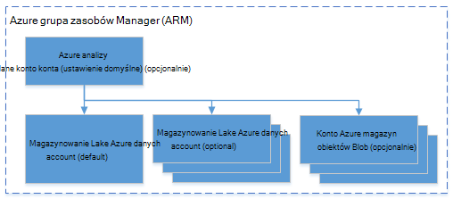

<properties 
   pageTitle="Zarządzanie analiz Lake danych Azure za pomocą Azure .NET SDK | Azure" 
   description="Dowiedz się, jak zarządzać zadaniami danych Lake analizy, źródeł danych, użytkownicy. " 
   services="data-lake-analytics" 
   documentationCenter="" 
   authors="mumian" 
   manager="jhubbard" 
   editor="cgronlun"/>
 
<tags
   ms.service="data-lake-analytics"
   ms.devlang="na"
   ms.topic="article"
   ms.tgt_pltfrm="na"
   ms.workload="big-data" 
   ms.date="09/23/2016"
   ms.author="jgao"/>

# Zarządzanie analiz Lake danych Azure za pomocą Azure .NET SDK

[AZURE.INCLUDE [manage-selector](../../includes/data-lake-analytics-selector-manage.md)]

Dowiedz się, jak zarządzać kontami Azure danych Lake analizy, źródeł danych użytkowników i zadań przy użyciu zestawu SDK .NET Azure. Aby wyświetlić tematy dotyczące zarządzania przy użyciu innych narzędzi, kliknij pozycję Wybierz kartę powyżej.

**Wymagania wstępne**

Przed rozpoczęciem tego samouczka, musisz mieć następujące czynności:

- **Azure subskrypcji**. Zobacz [Azure pobrać bezpłatną wersję próbną](https://azure.microsoft.com/pricing/free-trial/).

<!-- ################################ -->
<!-- ################################ -->

## Nawiązywanie połączenia z analizy Lake Azure danych

Potrzebne są następujące pakiety Nuget:

    Install-Package Microsoft.Rest.ClientRuntime.Azure.Authentication -Pre
    Install-Package Microsoft.Azure.Common 
    Install-Package Microsoft.Azure.Management.ResourceManager -Pre
    Install-Package Microsoft.Azure.Management.DataLake.Analytics -Pre

Poniższy przykład kodu pokazano, jak nawiązać połączenie z Azure i listy istniejących kont analizy Lake danych w obszarze Azure subskrypcji.

    using System;
    using System.Collections.Generic;
    using System.Threading;

    using Microsoft.Rest;
    using Microsoft.Rest.Azure.Authentication;

    using Microsoft.Azure.Management.ResourceManager;
    using Microsoft.Azure.Management.DataLake.Store;
    using Microsoft.Azure.Management.DataLake.Analytics;
    using Microsoft.Azure.Management.DataLake.Analytics.Models;

    namespace ConsoleAcplication1
    {
        class Program
        {

            private const string SUBSCRIPTIONID = "<Enter Your Azure Subscription ID>";
            private const string CLIENTID = "1950a258-227b-4e31-a9cf-717495945fc2";
            private const string DOMAINNAME = "common"; // Replace this string with the user's Azure Active Directory tenant ID or domain name, if needed.

            private static DataLakeAnalyticsAccountManagementClient _adlaClient;

            private static void Main(string[] args)
            {

                var creds = AuthenticateAzure(DOMAINNAME, CLIENTID);

                _adlaClient = new DataLakeAnalyticsAccountManagementClient(creds);
                _adlaClient.SubscriptionId = SUBSCRIPTIONID;

                var adlaAccounts = ListADLAAccounts();

                Console.WriteLine("You have %i Data Lake Analytics account(s).", adlaAccounts.Count);
                for (int i = 0; i < adlaAccounts.Count; i ++)
                {
                    Console.WriteLine(adlaAccounts[i].Name);
                }

                System.Console.WriteLine("Press ENTER to continue");
                System.Console.ReadLine();
            }

            public static ServiceClientCredentials AuthenticateAzure(
            string domainName,
            string nativeClientAppCLIENTID)
            {
                // User login via interactive popup
                SynchronizationContext.SetSynchronizationContext(new SynchronizationContext());
                // Use the client ID of an existing AAD "Native Client" application.
                var activeDirectoryClientSettings = ActiveDirectoryClientSettings.UsePromptOnly(nativeClientAppCLIENTID, new Uri("urn:ietf:wg:oauth:2.0:oob"));
                return UserTokenProvider.LoginWithPromptAsync(domainName, activeDirectoryClientSettings).Result;
            }

            public static List<DataLakeAnalyticsAccount> ListADLAAccounts()
            {
                var response = _adlaClient.Account.List();
                var accounts = new List<DataLakeAnalyticsAccount>(response);

                while (response.NextPageLink != null)
                {
                    response = _adlaClient.Account.ListNext(response.NextPageLink);
                    accounts.AddRange(response);
                }

                return accounts;
            }
        }
    }

## Zarządzanie kontami

Przed uruchomieniem zadania analizy Lake danych, musisz mieć konto analizy Lake danych. W odróżnieniu od Azure HDInsight nie zapłacić dla konta analizy zadanie nie jest uruchomiony.  Płacisz tylko raz, gdy działa zadanie.  Aby uzyskać więcej informacji zobacz [Omówienie analizy Lake danych Azure](data-lake-analytics-overview.md).  

###Tworzenie kont

Przed uruchomieniem Poniższy przykładowy musi mieć grupę zarządzania zasobami Azure i konta magazynu Lake danych.

Poniższy kod pokazano, jak utworzyć grupę zasobów:

    public static async Task<ResourceGroup> CreateResourceGroupAsync(
        ServiceClientCredentials credential,
        string groupName,
        string subscriptionId,
        string location)
    {

        Console.WriteLine("Creating the resource group...");
        var resourceManagementClient = new ResourceManagementClient(credential)
        { SubscriptionId = subscriptionId };
        var resourceGroup = new ResourceGroup { Location = location };
        return await resourceManagementClient.ResourceGroups.CreateOrUpdateAsync(groupName, resourceGroup);
    }

Poniższy kod przedstawia sposób utworzyć konto magazynu Lake danych:

    var adlsParameters = new DataLakeStoreAccount(location: _location);
    _adlsClient.Account.Create(_resourceGroupName, _adlsAccountName, adlsParameters);

Poniższy kod przedstawia sposób tworzenia konta analizy Lake danych:

    var defaultAdlsAccount = new List<DataLakeStoreAccountInfo> { new DataLakeStoreAccountInfo(adlsAccountName, new DataLakeStoreAccountInfoProperties()) };
    var adlaProperties = new DataLakeAnalyticsAccountProperties(defaultDataLakeStoreAccount: adlsAccountName, dataLakeStoreAccounts: defaultAdlsAccount);
    var adlaParameters = new DataLakeAnalyticsAccount(properties: adlaProperties, location: location);
    var adlaAccount = _adlaClient.Account.Create(resourceGroupName, adlaAccountName, adlaParameters);

###Listy kont

Zobacz [Nawiązywanie połączenia z analizy Lake Azure danych](#connect_to_azure_data_lake_analytics).

###Znajdowanie konta

Gdy obiekt listę kont analizy Lake danych, można następujące do znalezienia konta:

    Predicate<DataLakeAnalyticsAccount> accountFinder = (DataLakeAnalyticsAccount a) => { return a.Name == adlaAccountName; };
    var myAdlaAccount = adlaAccounts.Find(accountFinder);

###Usuwanie kont analizy Lake danych

Poniższy fragment kodu usuwa konto analizy Lake danych:

    _adlaClient.Account.Delete(resourceGroupName, adlaAccountName);

<!-- ################################ -->
<!-- ################################ -->
## Zarządzanie źródłami danych konta

Analizy Lake danych obsługuje obecnie następujących źródeł danych:

- [Magazynowanie Lake Azure danych](../data-lake-store/data-lake-store-overview.md)
- [Azure miejsca do magazynowania](../storage/storage-introduction.md)

Po utworzeniu konta analizy należy wyznaczyć konto Azure masowej Lake był domyślnym kontem miejsca do magazynowania. Domyślne konto magazynu Lake danych służy do przechowywania dzienników inspekcji metadanych i zlecenia zadania. Po utworzeniu konta analizy, możesz dodać kolejne konta magazynowanie Lake danych i/lub konto Azure miejsca do magazynowania. 

### Znajdowanie domyślnego konta magazynu Lake danych

Zobacz Znajdowanie konta w tym artykule do wyszukiwania konta analizy Lake danych. Następnie użyj następujących opcji:

    string adlaDefaultDataLakeStoreAccountName = myAccount.Properties.DefaultDataLakeStoreAccount;

## Używanie Menedżera zasobów Azure grup

Aplikacje zwykle składają się wiele elementów, na przykład aplikacji sieci web, bazy danych, serwer bazy danych, magazynowania i 3 usług innych firm. Azure Menedżera zasobów umożliwia pracę z zasobami w aplikacji grupowo, określane jako grupa zasobów Azure. Możesz wdrożyć, aktualizowanie, monitorować lub usunąć wszystkie zasoby aplikacji w jednym, skoordynowanego operacji. Używanie szablonu do wdrożenia i tego szablonu można pracować w różnych środowiskach takich jak testowania, organizowanie i produkcji. Może zawierać wyjaśnienie rozliczenia dla Twojej organizacji, wyświetlając rzutowane koszty dla całej grupy. Aby uzyskać więcej informacji zobacz [Omówienie Menedżera zasobów Azure](../azure-resource-manager/resource-group-overview.md). 

Usługi analizy Lake danych może zawierać następujące składniki:

- Lake danych Azure analizy konta
- Konto Azure masowej Lake niezbędnych ustawień domyślnych
- Dodatkowe Azure danych Lake magazynu kont
- Kolejne konta magazynu platformy Azure

Możesz utworzyć wszystkie te elementy w jednej grupie zarządzania zasobami, aby ułatwić zarządzanie.

Konto analizy Lake danych i kont zależne miejsca do magazynowania musi znajdować się w tym samym centrum danych Azure.
Jednak grupie zarządzania zasobami może znajdować się w centrum danych.  

##Zobacz też 

- [Omówienie analizy danych Lake bazy wiedzy Microsoft Azure](data-lake-analytics-overview.md)
- [Wprowadzenie do analizy Lake danych za pomocą portalu Azure](data-lake-analytics-get-started-portal.md)
- [Zarządzanie analizy Lake danych Azure za pomocą portalu Azure](data-lake-analytics-manage-use-portal.md)
- [Monitorowanie i rozwiązywanie problemów z Azure danych Lake analizy zadań przy użyciu Azure portal](data-lake-analytics-monitor-and-troubleshoot-jobs-tutorial.md)

