<properties 
   pageTitle="Zarządzanie analiz Lake danych Azure za pomocą portalu Azure | Azure" 
   description="Dowiedz się, jak zarządzać analizy Lake danych księgowości, źródeł danych użytkowników i zadania." 
   services="data-lake-analytics" 
   documentationCenter="" 
   authors="edmacauley" 
   manager="jhubbard" 
   editor="cgronlun"/>
 
<tags
   ms.service="data-lake-analytics"
   ms.devlang="na"
   ms.topic="article"
   ms.tgt_pltfrm="na"
   ms.workload="big-data" 
   ms.date="10/06/2016"
   ms.author="edmaca"/>

# Zarządzanie analizy Lake danych Azure za pomocą portalu Azure

[AZURE.INCLUDE [manage-selector](../../includes/data-lake-analytics-selector-manage.md)]

Dowiedz się, jak zarządzać kontami Azure danych Lake analizy, źródeł danych konta użytkowników i zadań przy użyciu Azure portal. Aby wyświetlić tematy dotyczące zarządzania przy użyciu innych narzędzi, kliknij selektor tabulatorów w górnej części strony.

**Wymagania wstępne**

Przed rozpoczęciem tego samouczka, musi mieć następujące elementy:

- **Azure subskrypcji**. Zobacz [Azure pobrać bezpłatną wersję próbną](https://azure.microsoft.com/pricing/free-trial/).

<!-- ################################ -->
<!-- ################################ -->
## Zarządzanie kontami

Przed uruchomieniem zadania analizy Lake danych, musisz mieć konto analizy Lake danych. W odróżnieniu od Azure HDInsight tylko płatność dla konta analizy Lake danych podczas wykonywania zadania.  Płacisz tylko raz, gdy działa zadanie.  Aby uzyskać więcej informacji zobacz [Omówienie analizy Lake danych Azure](data-lake-analytics-overview.md).  

**Aby utworzyć konto analizy Lake danych**

1. Logowanie się do [portalu Azure](https://portal.azure.com).
2. Kliknij przycisk **Nowy**, kliknij pozycję **analizy + analizy**, a następnie kliknij **Analizy Lake danych**.
3. Wpisz lub wybierz następujące wartości:

    

    - **Nazwa**: Nazwa konta analizy Lake danych.
    - **Subskrypcja**: Wybierz subskrypcję Azure dla konta analizy.
    - **Grupa zasobów**. Wybierz istniejącą grupą zasobów Azure lub Utwórz nową. Azure Menedżera zasobów umożliwia pracę z zasobami w aplikacji jako grupy. Aby uzyskać więcej informacji zobacz [Omówienie Menedżera zasobów Azure](resource-group-overview.md). 
    - **Lokalizacja**. Wybierz pozycję Centrum danych Azure konta analizy Lake danych. 
    - **Magazyn Lake danych**: Konto każdego analizy Lake danych ma zależne konta magazynu Lake danych. Konto analizy Lake danych oraz zależne magazynu Lake danych musi znajdować się w tym samym centrum danych Azure. Postępuj zgodnie z instrukcjami, aby utworzyć nowe konto magazynu Lake danych, lub wybierz istniejący.

8. Kliknij przycisk **Utwórz**. Przejście do portalu ekranu głównego. Fragment jest dodawana do StartBoard z etykietą przedstawiający "Wdrażanie Azure danych Lake analizy". Wystarczy kilka minut, aby utworzyć konto analizy Lake danych. Po utworzeniu konta portalu zostanie wyświetlona na koncie dla nowych kart.

Po utworzeniu konta analizy Lake danych, możesz dodać kolejne konta magazynu Lake danych i Magazyn Azure. Aby uzyskać instrukcje zobacz [Zarządzanie analizy lake dane konto źródeł danych](data-lake-analytics-manage-use-portal.md#manage-account-data-sources).

**Do programu access lub otwieranie konta analizy Lake danych**

1. Logowanie się do [portalu Azure](https://portal.azure.com/).
2. W menu po lewej stronie kliknij pozycję **Analizy Lake danych** .  Jeśli nie widzisz, kliknij pozycję **więcej usług**, a następnie kliknij **Analizy Lake danych** w obszarze **analizy + analizy**.
3. Kliknij konto analizy Lake danych, do którego chcesz uzyskać dostęp. Konto zostanie otwarty w nowej kart.

**Aby usunąć konto analizy Lake danych**

1. Otwórz konto analizy Lake dane, które chcesz usunąć. Aby uzyskać instrukcje zobacz [konta analizy Lake danych programu Access](#access-adla-account).
2. Kliknij przycisk **Usuń** w menu przycisku się karta.
3. Wpisz nazwę konta, a następnie kliknij polecenie **Usuń**.

Usuwanie konta analizy Lake danych nie powoduje usunięcia zależne konta magazynu Lake danych. Aby uzyskać instrukcje dotyczące usuwania konta magazynowanie Lake danych zobacz [magazynu Lake danych Usuń konto](data-lake-store-get-started-portal.md#delete-azure-data-lake-store-account).

<!-- ################################ -->
<!-- ################################ -->
## Zarządzanie źródłami danych konta

Analizy Lake danych obsługuje obecnie następujących źródeł danych:

- [Magazyn Lake danych Azure](../data-lake-store/data-lake-store-overview.md)
- [Azure miejsca do magazynowania](../storage/storage-introduction.md)

Po utworzeniu konta analizy Lake danych należy wyznaczyć magazynu Lake danych Azure konta jako domyślnego konta miejsca do magazynowania. Domyślne konto magazynu Lake danych służy do przechowywania dzienników inspekcji metadanych i zlecenia zadania. Po utworzeniu konta analizy Lake danych, możesz dodać kolejne konta magazynu Lake danych i/lub konto Azure miejsca do magazynowania. 

**Aby znaleźć miejsca do magazynowania danych Lake domyślnego konta**

- Otwórz konto analizy Lake dane, które chcesz zarządzać. Aby uzyskać instrukcje zobacz [konta analizy Lake danych programu Access](#access-adla-account). Domyślnego magazynu Lake danych są wyświetlane w **podstawowych**:

    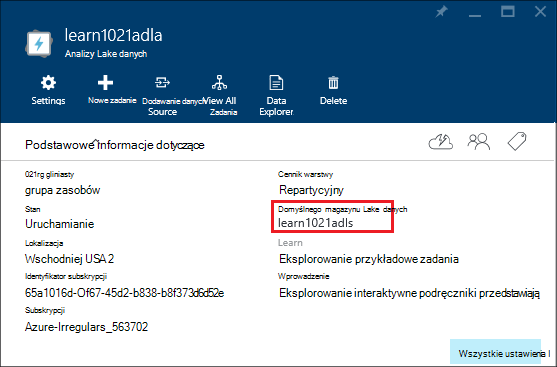

**Aby dodać dodatkowe źródła danych**

1. Otwórz konto analizy Lake dane, które chcesz zarządzać. Aby uzyskać instrukcje zobacz [konta analizy Lake danych programu Access](#access-adla-account).
2. Kliknij pozycję **Ustawienia** , a następnie kliknij pozycję **Źródła danych**. Domyślne konto magazynu Lake danych na liście są Zobacz. 
3. Kliknij przycisk **Dodaj źródło danych**.

    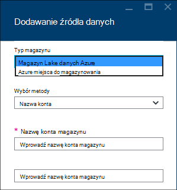

    Aby dodać konto Azure magazynu Lake danych, potrzebne konto nazwę i dostępu do konta będą mogły go kwerendy.
    Aby dodać magazyn obiektów Blob platformy Azure, potrzebujesz konta miejsca do magazynowania i klucz konta, które można znaleźć, przechodząc do konta miejsca do magazynowania w portalu.

**Aby poznać źródła danych**  

1. Otwórz konto analizy, który chcesz zarządzać. Aby uzyskać instrukcje zobacz [konta analizy Lake danych programu Access](#access-adla-account).
2. Kliknij pozycję **Ustawienia** , a następnie kliknij pozycję **Eksplorator danych**. 
 
    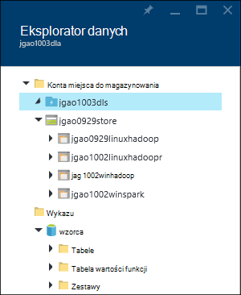
    
3. Kliknij konto magazynu Lake danych, aby otworzyć konto.

    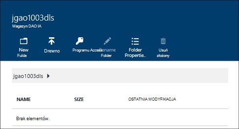
    
    Dla każdego konta magazynu Lake danych można wykonywać następujące czynności
    
    - **Nowy Folder**: Dodawanie nowego folderu.
    - **Przekazywanie**: przekazywanie plików do konta miejsca do magazynowania w miejscu pracy.
    - **Dostęp**: Konfigurowanie dostępu uprawnienia.
    - **Zmień nazwę folderu**: Zmienianie nazwy folderu.
    - **Właściwości folderu**: wyświetlanie właściwości pliku lub folderu, takich jak WASB ścieżkę, ścieżka WEBHDFS ostatniej modyfikacji czasu i tak dalej.
    - **Usuń Folder**: usuwanie folderu.

**Aby przekazać pliki do konta magazynu Lake danych**

1. W portalu z menu po lewej stronie kliknij przycisk **Przeglądaj** , a następnie kliknij **Magazynu Lake danych**.
2. Kliknij konto magazynu Lake danych, które chcesz przekazać danych. Aby znaleźć domyślnego konta magazynowanie Lake danych, zobacz [poniżej](#default-adl-account).
3. Kliknij pozycję **Eksplorator danych** z górnym menu.
4. Kliknij przycisk **Nowy katalog** , aby utworzyć nowy folder lub kliknij nazwę folderu, aby zmienić folder.
6. Z menu górnego, aby przekazać plik, kliknij przycisk **Przekaż** .

**Aby przekazać pliki do konta magazyn obiektów Blob platformy Azure**

Zobacz [przekazywanie danych dla zadań Hadoop w HDInsight](../hdinsight/hdinsight-upload-data.md).  Informacje dotyczą analizy Lake danych.

## Zarządzanie użytkownikami

Kontrola dostępu oparta na rolach jest używana w analizy Lake danych z usługi Azure Active Directory. Po utworzeniu konta analizy Lake danych roli "Administratorzy subskrypcji" jest dodawany do konta. Możesz dodać dodatkowych użytkowników i grup zabezpieczeń z następujących ról:

|Rola|Opis|
|----|-----------|
|Właściciel|Umożliwiają zarządzanie wszystko, łącznie z dostępem do zasobów.|
|Trybu współautora|Dostęp do portalu; przesyłanie i Monitoruj zadania. Aby mieć możliwość wysyłania zadań, współautora musi uprawnień odczytu lub zapisu do kont magazynu Lake danych.|
|DataLakeAnalyticsDeveloper | Przesyłanie, monitorowanie i anulować zadania.  Ci użytkownicy tylko anulować własne zadania. Własne konta nie można na przykład zarządzają dodawać użytkowników, zmienianie uprawnień lub usunąć konto. Aby mieć możliwość wykonywania zadań, muszą odczytu lub zapisu do kont magazynu Lake danych     | 
|Czytnik|Umożliwia wyświetlanie wszystkich, ale nie wprowadź odpowiednie zmiany.|  
|DevTest Labs użytkownika|Umożliwia wyświetlanie wszystkich i połączyć, Rozpocznij, zamknięcia i ponownego uruchomienia maszyn wirtualnych.|  
|Administrator dostępu użytkowników|Umożliwia zarządzanie dostępem użytkowników do zasobów Azure.|  

Aby uzyskać informacje na temat tworzenia usługi Azure Active Directory Użytkownicy i grupy zabezpieczeń zobacz [Co to jest Azure Active Directory](../active-directory/active-directory-whatis.md).

**Aby dodać użytkowników lub grupy zabezpieczeń na koncie analizy Lake danych**

1. Otwórz konto analizy, który chcesz zarządzać. Aby uzyskać instrukcje zobacz [konta analizy Lake danych programu Access](#access-adla-account).
2. Kliknij pozycję **Ustawienia**, a następnie kliknij pozycję **Użytkownicy**. Na pasku tytułu **Essentials** , jak pokazano w poniższej zrzut ekranu, kliknij pozycję **dostęp** :

    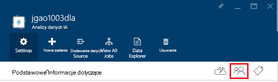
3. Z karta **użytkownika** kliknij przycisk **Dodaj**.
4. Wybierz rolę i Dodaj użytkownika, a następnie kliknij **przycisk OK**.

**Uwaga: Jeśli tego użytkownika lub grupę zabezpieczeń musi przesyłać zadania, muszą mieć uprawnienie także magazynu Lake danych. Aby uzyskać więcej informacji zobacz [bezpieczne dane przechowywane w magazynie Lake danych](../data-lake-store/data-lake-store-secure-data.md).**

<!-- ################################ -->
<!-- ################################ -->
## Zarządzanie zadaniami

Przed uruchomieniem zadania U SQL, musisz mieć konto analizy Lake danych.  Aby uzyskać więcej informacji zobacz [Zarządzanie danymi analizy Lake konta](#manage-data-lake-analytics-accounts).

**Aby utworzyć zadanie**

1. Otwórz konto analizy, który chcesz zarządzać. Aby uzyskać instrukcje zobacz [konta analizy Lake danych programu Access](#access-adla-account).
2. Kliknij przycisk **Nowe zadanie**.

    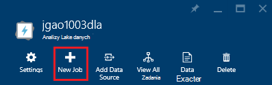

    Są pojawi się karta nowego podobne do:

    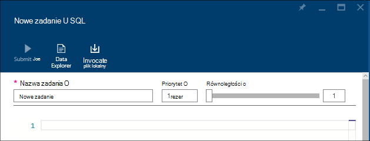

    Dla każdego zadania można skonfigurować

  	|Nazwa|Opis|
  	|----|-----------|
  	|Nazwa zadania|Wpisz nazwę zadania.|
  	|Priority (priorytet)|Liczba dolnym ma wyższy priorytet. W przypadku dwóch zadań zarówno w kolejce, osoba używająca niższe priorytet uruchamia najpierw|
  	|Równoległości |Maksymalna liczba procesów obliczeń, jakie mogą wystąpić w tym samym czasie. Zwiększenie tej liczby można zwiększyć wydajność, ale można również zwiększyć koszt.|
  	|Skrypt|Wprowadź skrypt języka SQL U dla zadania.|

    Za pomocą tego samego interfejsu, można też eksplorować źródeł danych łącze i dodawać nowe pliki do połączonych źródeł danych. 
3. Kliknij przycisk **Prześlij zadanie** , jeśli chcesz przesłać zadanie.

**Aby przesłać zadanie**

Zobacz [Tworzenie analizy Lake dane zadania](#create-job).

**Monitorowanie zadania**

1. Otwórz konto analizy, który chcesz zarządzać. Aby uzyskać instrukcje zobacz [konta analizy Lake danych programu Access](#access-adla-account). Zarządzanie zadaniami panelu wyświetlane są informacje podstawowe zadania:

    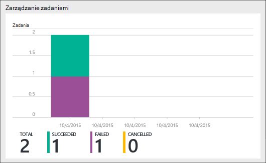

3. Kliknij pozycję **Zarządzanie zadaniami** , jak pokazano w poprzedniej zrzut ekranu.

    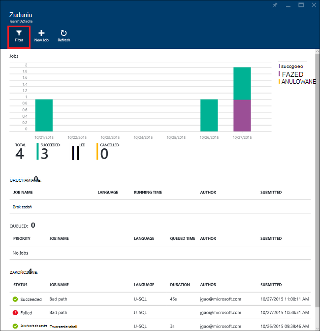

4. Kliknij zadanie z listy. Lub kliknij pozycję **Filtr** ułatwiają znajdowanie zadania:

    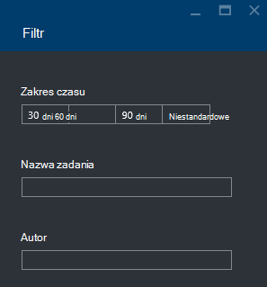

    Można filtrować zadań według **Przedziału czasu**, **Nazwa zadania**i **Autor**.
5. Kliknij przycisk **Prześlij ponownie** , Prześlij zadanie.

**Prześlij zadanie**

Zobacz [Monitorowanie danych Lake analizy zadania](#monitor-jobs).

##Monitorowanie użycia konta

**Monitorowanie użycia konta**

1. Otwórz konto analizy, który chcesz zarządzać. Aby uzyskać instrukcje zobacz [konta analizy Lake danych programu Access](#access-adla-account). Panel zastosowania przedstawia użycia:

    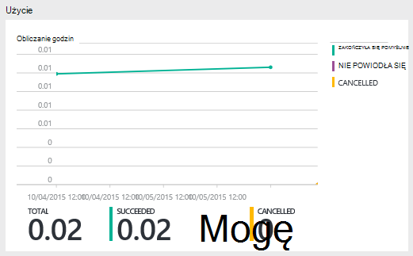

2. Kliknij dwukrotnie w okienku, aby wyświetlić więcej szczegółów.

##Widok U SQL wykazu

[Wykaz U SQL](data-lake-analytics-use-u-sql-catalog.md) jest używany do struktury danych i kodu, może być udostępniane przez skrypty U-SQL. Wykaz umożliwia najwyższą wydajność możliwe z danymi w Lake danych Azure. Z portalu Azure jest możliwość wyświetlania wykazu U-SQL.

**Aby przeglądać katalog U SQL**

1. Otwórz konto analizy, który chcesz zarządzać. Aby uzyskać instrukcje zobacz [konta analizy Lake danych programu Access](#access-adla-account).
2. Kliknij pozycję **Eksplorator danych** z górnym menu.
3. Rozwiń **wykaz**, rozwiń **wzorca**, rozwiń **tabele lub **funkcje wartości tabelaryczne**, lub **zestawów **. Następujące zrzucie ekranu pokazano jedną funkcję zwracające tabelę.

    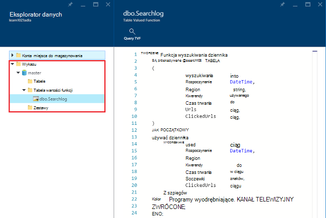

<!-- ################################ -->
<!-- ################################ -->
## Używanie Menedżera zasobów Azure grup

Aplikacje zwykle składają się wiele elementów, na przykład aplikacji sieci web, bazy danych, serwer bazy danych, magazynowania i usług innych firm. Azure Menedżera zasobów umożliwia pracę z zasobami w aplikacji grupowo, określane jako grupa zasobów Azure. Możesz wdrożyć, aktualizowanie, monitorować lub usunąć wszystkie zasoby aplikacji w jednym, skoordynowanego operacji. Używanie szablonu do wdrożenia i tego szablonu można pracować w różnych środowiskach takich jak badania, organizowanie i produkcji. Może zawierać wyjaśnienie rozliczenia dla Twojej organizacji, wyświetlając rzutowane koszty dla całej grupy. Aby uzyskać więcej informacji zobacz [Omówienie Menedżera zasobów Azure](../azure-resource-manager/resource-group-overview.md). 

Usługi analizy Lake danych może zawierać następujące składniki:

- Lake danych Azure analizy konta
- Wymagane domyślnego konta magazynu Lake danych Azure
- Konto w sklepie Lake danych Azure dodatkowe
- Kolejne konta magazynu platformy Azure

Możesz utworzyć wszystkie te elementy w jednej grupie zarządzania zasobami, aby ułatwić zarządzanie.

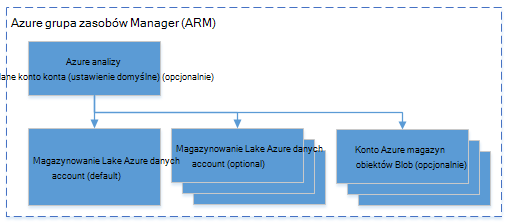

Konto analizy Lake danych i kont zależne miejsca do magazynowania musi znajdować się w tym samym centrum danych Azure.
Jednak grupie zarządzania zasobami może znajdować się w centrum danych.  

##Zobacz też 

- [Omówienie analizy danych Lake bazy wiedzy Microsoft Azure](data-lake-analytics-overview.md)
- [Wprowadzenie do analizy Lake danych za pomocą portalu Azure](data-lake-analytics-get-started-portal.md)
- [Zarządzanie analiz Lake danych Azure za pomocą programu PowerShell Azure](data-lake-analytics-manage-use-powershell.md)
- [Monitorowanie i rozwiązywanie problemów z Azure danych Lake analizy zadań przy użyciu Azure portal](data-lake-analytics-monitor-and-troubleshoot-jobs-tutorial.md)

