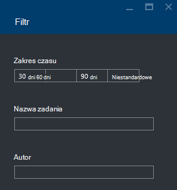

<properties 
   pageTitle="Rozwiązywanie problemów z Azure danych Lake analizy zadań przy użyciu Azure Portal | Azure" 
   description="Dowiedz się, jak korzystać z portalu Azure rozwiązywać zadania analizy Lake danych. " 
   services="data-lake-analytics" 
   documentationCenter="" 
   authors="edmacauley" 
   manager="jhubbard" 
   editor="cgronlun"/>
 
<tags
   ms.service="data-lake-analytics"
   ms.devlang="na"
   ms.topic="article"
   ms.tgt_pltfrm="na"
   ms.workload="big-data" 
   ms.date="05/16/2016"
   ms.author="edmaca"/>

# Rozwiązywanie problemów z Azure danych Lake analizy zadań przy użyciu Azure Portal

Dowiedz się, jak korzystać z portalu Azure rozwiązywać zadania analizy Lake danych.

W tym samouczku będzie konfiguracji Brak problem pliku źródłowego i rozwiązywanie problemu za pomocą Azure Portal.

**Wymagania wstępne**

Przed rozpoczęciem tego samouczka, musisz mieć następujące czynności:

- **Podstawowe informacje dotyczące analizy Lake danych zadań procesu**. Zobacz [Wprowadzenie do analiz Lake danych Azure za pomocą Azure Portal](data-lake-analytics-get-started-portal.md).
- **Konto analizy Lake danych**. Zobacz [Wprowadzenie do analiz Lake danych Azure za pomocą Azure Portal](data-lake-analytics-get-started-portal.md#create-adl-analytics-account).
- **Skopiuj przykładowe dane do domyślnego konta magazynu Lake danych**.  Zobacz [Przygotowywanie źródła danych](data-lake-analytics-get-started-portal.md#prepare-source-data)

##Prześlij zadanie analizy Lake danych

Teraz utworzy zadanie U SQL z nazwą pliku źródłowego nieprawidłowe.  

**Aby przesłać zadanie**

1. Azure Portal kliknij **Platformy Microsoft Azure** w lewym górnym rogu.
2. Kliknij Kafelek nazwą konta analizy Lake danych.  Została przypięta tutaj podczas tworzenia konta.
Jeśli konto nie jest dostępne przypięte, zobacz [otworzyć konto analizy w portalu](data-lake-analytics-manage-use-portal.md#access-adla-account).
3. Kliknij polecenie **Nowe zadanie** w górnym menu.
4. Wpisz nazwę zadania i poniższy skrypt U SQL:

        @searchlog =
            EXTRACT UserId          int,
                    Start           DateTime,
                    Region          string,
                    Query           string,
                    Duration        int?,
                    Urls            string,
                    ClickedUrls     string
            FROM "/Samples/Data/SearchLog.tsv1"
            USING Extractors.Tsv();
        
        OUTPUT @searchlog   
            TO "/output/SearchLog-from-adls.csv"
        USING Outputters.Csv();

    Plik źródłowy zdefiniowane w skrypt jest **/Samples/Data/SearchLog.tsv1**, gdzie jest ona **/Samples/Data/SearchLog.tsv**.
     
5. Kliknij przycisk **Prześlij zadanie** , od góry. Zostanie otwarte nowe okienko szczegółów zadania. Na pasku tytułu jest wyświetlany stan zadania. Wystarczy kilka minut, aby zakończyć. Można kliknąć przycisk **Odśwież** , aby pobrać najnowszą stanu.
6. Poczekaj, aż stan zadania został zamieniony na **nie powiodło się**.  Jeśli zadanie jest **powiodło się**, to, że nie możesz usunąć /Samples folder. Zobacz sekcję **wstępne** na początku samouczka.

Być może zastanawiasz się - dlaczego trwa tak długo dla małych zadania.  Należy pamiętać, że analizy Lake danych jest przeznaczona do przetwarzania danych duży.  Go narzędziem podczas przetwarzania dużej ilości danych przy użyciu jego Rozproszony system.

Załóżmy założono, że przesłane zadanie, a następnie zamknij portalu.  W następnej sekcji dowiesz się, jak rozwiązywać zadania.

## Rozwiązywanie problemów z zadania

W sekcji ostatniej zostały przesłane zadanie, a zadanie powiodło się.  

**Aby wyświetlić wszystkie zadania**

1. Z poziomu portalu Azure kliknij pozycję **Microsoft Azure** w lewym górnym rogu.
2. Kliknij Kafelek nazwą konta analizy Lake danych.  Zadania sumaryczne są wyświetlane na kafelku **Zarządzania zadaniami** .

    
    
    Zadania zarządzania umożliwia szybkie stan zadania. Zwróć uwagę, że zadanie nie powiodło się.
   
3. Kliknij pole **Zarządzanie zadaniami** , aby zobaczyć zadania. Zadania są podzielone na **Uruchamianie**, **kolejce**i **zakończone**. Zapewniają zadania nie powiodło się w sekcji **zakończone** . Jest pierwsza na liście. Jeśli masz wiele zadań, możesz kliknąć pozycję **Filtr** ułatwiają Znajdź zadania.

    

4. Kliknij zadanie nie powiodło się z listy, aby otworzyć szczegóły zadania w nowych kart:

    
    
    Zwróć uwagę, przycisk **Prześlij** . Po rozwiązaniu problemu można Prześlij ponownie to zadanie.

5. Kliknij wyróżniony części z poprzedniego zrzut ekranu Otwórz szczegóły błędu.  Są Zobacz mniej więcej tak:

    

    Określa, że nie znaleziono folderu źródła.
    
6. Kliknij polecenie **Duplikuj skrypt**.
7. Zaktualizuj ścieżkę **od** do następującego:

    "-Samples/Data/SearchLog.tsv"

8. Kliknij przycisk **Prześlij zadania**.

##Zobacz też

- [Omówienie analizy Lake danych Azure](data-lake-analytics-overview.md)
- [Wprowadzenie do analiz Lake danych Azure za pomocą programu PowerShell Azure](data-lake-analytics-get-started-powershell.md)
- [Wprowadzenie do analizy Lake danych Azure i U-SQL przy użyciu programu Visual Studio](data-lake-analytics-u-sql-get-started.md)
- [Zarządzanie analiz Lake danych Azure za pomocą Azure Portal](data-lake-analytics-manage-use-portal.md)

