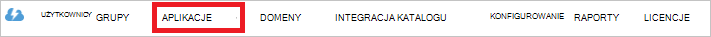

<properties
   pageTitle="Typ poświadczeń uwierzytelniania magazynu Lake danych za pomocą usługi Active Directory | Microsoft Azure"
   description="Dowiedz się, jak uwierzytelnienia z magazynu Lake danych za pomocą usługi Active Directory"
   services="data-lake-store"
   documentationCenter=""
   authors="nitinme"
   manager="jhubbard"
   editor="cgronlun"/>

<tags
   ms.service="data-lake-store"
   ms.devlang="na"
   ms.topic="article"
   ms.tgt_pltfrm="na"
   ms.workload="big-data"
   ms.date="10/17/2016"
   ms.author="nitinme"/>

# Uwierzytelnianie usługi do usługi z magazynu Lake danych za pomocą usługi Azure Active Directory

> [AZURE.SELECTOR]
- [Aby usługi uwierzytelniania](data-lake-store-authenticate-using-active-directory.md)
- [Uwierzytelnianie użytkownika końcowego](data-lake-store-end-user-authenticate-using-active-directory.md)

Azure magazynu Lake danych do uwierzytelniania używa usługi Azure Active Directory. Przed do tworzenia aplikacji, która działa z magazynu Lake danych Azure lub Azure danych Lake analizy, należy najpierw wybrać sposób do uwierzytelniania aplikacji z usługą Azure Active Directory (Azure AD). Dwa główne dostępne są następujące opcje:

* Uwierzytelnianie użytkownika końcowego, i 
* Aby usługi uwierzytelniania. 

W aplikacji są do dyspozycji token OAuth 2.0, który jest dołączony do każdego żądania magazynu Lake danych Azure lub Azure danych Lake analizy powoduje obu tych opcji.

Ten artykuł omówiono sposób tworzenia aplikacji sieci web Azure AD dla uwierzytelniania do usługi. Aby uzyskać instrukcje dotyczące konfiguracji aplikacji Azure AD dla uwierzytelniania użytkowników końcowych zobacz [uwierzytelniania użytkowników końcowych z magazynu Lake danych za pomocą usługi Azure Active Directory](data-lake-store-end-user-authenticate-using-active-directory.md).

## Wymagania wstępne

* Subskrypcję usługi Azure. Zobacz [Azure pobrać bezpłatną wersję próbną](https://azure.microsoft.com/pricing/free-trial/).
* Twoja nazwa subskrypcji. Czy można pobrać z Azure Portal. Na przykład jest dostępna z magazynu Lake danych karta konta.

    

* Nazwy domeny Azure AD. Można je podjąć przez umieszczenie wskaźnika myszy wskaźnik myszy w prawym górnym rogu Azure Portal. Z poniższych zrzut ekranu nazwą domeny jest **contoso.microsoft.com**, a identyfikator GUID w nawiasach jest identyfikatora dzierżawy. 

    

## Aby usługi uwierzytelniania

Jest to zalecane podejście, jeśli chcesz, aby aplikacja automatycznie typ poświadczeń uwierzytelniania Azure AD, bez konieczności dla użytkowników końcowych o podanie poświadczeń. Aplikacja będzie mógł uwierzytelnienia bramy dla dopóki jego poświadczenia są prawidłowe, które dostosowany do pełnienia funkcji kolejności lata.

### Co trzeba używać tej metody?

* Nazwa domeny w usłudze Azure AD. To jest już wymieniona w wstępny tego artykułu.

* Azure AD **aplikacji sieci web**.

* Identyfikator klienta dla aplikacji sieci web Azure AD.

* Tajny klienta Azure AD aplikacji sieci web.

* Token punkt końcowy dla aplikacji sieci web Azure AD.

* Włączanie dostępu dla aplikacji sieci web Azure AD na plik/folder magazynu Lake danych lub konta analizy Lake danych, które mają być używane.

Aby uzyskać instrukcje dotyczące tworzenia aplikacji sieci web Azure AD i skonfiguruj go na potrzeby wymienionych powyżej zobacz sekcję poniżej [Tworzenie aplikacji usługi Active Directory](#create-an-active-directory-application) .

>[AZURE.NOTE] Domyślnie aplikacja Azure AD jest skonfigurowana do Użyj hasła klienta, który można pobrać z poziomu aplikacji Azure AD. Jednak jeśli chcesz aplikacjom Azure AD zamiast tego Użyj certyfikatu, musisz utworzyć aplikacji sieci web Azure AD przy użyciu programu PowerShell Azure, zgodnie z opisem w [Tworzenie głównej przy użyciu certyfikatu usługi](../resource-group-authenticate-service-principal.md#create-service-principal-with-certificate).

## Tworzenie aplikacji usługi Active Directory

W tej sekcji możemy informacje na temat tworzenia i konfigurowania aplikacji sieci web Azure AD dla uwierzytelniania do usługi Azure danych Lake sklepu za pomocą usługi Azure Active Directory. 

### Krok 1: Tworzenie aplikacji usługi Azure Active Directory

>[AZURE.NOTE] Azure Portal za pomocą poniższych kroków. Możesz również utworzyć aplikację Azure AD przy użyciu [Programu PowerShell Azure](../resource-group-authenticate-service-principal.md) lub [Polecenie Azure](../resource-group-authenticate-service-principal-cli.md).

1. Zaloguj się do swojego konta Azure za pomocą [portalu klasyczny](https://manage.windowsazure.com/).

2. Wybierz pozycję **Usługi Active Directory** w okienku po lewej stronie.

     
     
3. Wybierz pozycję usługi Active Directory, który ma być używany do tworzenia nowej aplikacji. Jeśli masz więcej niż jeden usługi Active Directory, zazwyczaj chcesz utworzyć aplikację w katalogu, w którym znajduje się Twoja subskrypcja. Tylko można udzielić dostępu do zasobu w ramach subskrypcji dla aplikacji, w tym samym katalogu co subskrypcji.  

     
    
    
3. Aby wyświetlić aplikacje w katalogu, kliknij przycisk **aplikacje**.

     

4. Jeśli nie utworzono aplikację w tym katalogu przed powinna być widoczna podobne coś na poniższej ilustracji. Wybierz polecenie **Dodaj APLIKACJĘ**

     

     Lub kliknij przycisk **Dodaj** w dolnym okienku.

     

6. Podaj nazwę aplikacji, a następnie wybierz typ aplikacji, którą chcesz utworzyć. Ten samouczek tworzenie **Interfejs API sieci WEB i/lub aplikacji sieci WEB** i kliknij przycisk Dalej.

     

7. Wypełnij właściwości aplikacji. Dla **Adresu URL logowania na**przekazać go do witryny sieci web, który opisuje aplikacji. Obecność w witrynie sieci web nie jest sprawdzany. W przypadku **Aplikacji identyfikator URI**zapewnić identyfikator URI, który identyfikuje aplikację.

     

    Kliknij znacznik wyboru, aby zakończyć działanie kreatora i utworzyć aplikację.

### Krok 2: Uzyskaj identyfikator klienta, tajny klienta i token punktu końcowego

Podczas logowania programowy, potrzebny jest identyfikator aplikacji. Jeśli aplikacja działa w obszarze własnej poświadczeń, konieczne będzie również klucz uwierzytelniania.

1. Kliknij kartę **Konfiguruj** , aby skonfigurować hasło aplikacji.

     

2. Skopiuj **identyfikator klienta**.
  
     

3. Jeśli aplikacja będzie działać w obszarze własnej poświadczeń, przewiń w dół do sekcji **klawiszy** i wybierz jak długo chcesz hasło jest nieprawidłowy.

     

4. Wybierz pozycję **Zapisz** , aby utworzyć klucza.

    

    Zostanie wyświetlona zapisany klucz i można go skopiować. Nie można pobrać klucza później, aby skopiować go teraz.

    

5. Pobrać token punktu końcowego, wybierając **Widok punkty końcowe** w dolnej części ekranu, a pobierania wartości dla pola **Końcowy Token OAuth 2.0** , tak jak pokazano poniżej.  

    

### Krok 3: Przypisywanie aplikacji Azure AD magazynu Lake danych Azure konta plik lub folder (tylko dla uwierzytelniania do usługi)

1. Logowanie do nowego [Azure Portal](https://portal.azure.com) i otwórz konto Azure magazynu Lake danych, które chcesz skojarzyć z aplikacją usługi Azure Active Directory utworzony wcześniej.

1. W swojej karta konta magazynu Lake danych kliknij pozycję **Eksplorator danych**.

    ![Tworzenie katalogów na koncie magazynu Lake danych] (./media/data-lake-store-authenticate-using-active-directory/adl.start.data.explorer.png "Tworzenie katalogów na koncie Lake danych")

2. W karta **Eksplorator danych** kliknij plik lub folder, dla którego chcesz umożliwić dostęp do aplikacji Azure AD, a następnie kliknij **programu Access**. Aby skonfigurować dostępu do pliku, należy kliknąć przycisk **dostępu** z karta **Podgląd pliku** .

    ![Ustawianie ACL w systemie plików Lake danych] (./media/data-lake-store-authenticate-using-active-directory/adl.acl.1.png "Ustawianie ACL w systemie plików Lake danych")

3. Karta **programu Access** Wyświetla dostępu standardowego i niestandardowego programu access już przypisany do katalogu głównego. Kliknij ikonę **Dodaj** , aby dodać ACL Poziom niestandardowy.

    ![Lista standardowych i niestandardowych programu access] (./media/data-lake-store-authenticate-using-active-directory/adl.acl.2.png "Lista standardowych i niestandardowych programu access")

4. Kliknij ikonę **Dodaj** , aby otworzyć karta **Dodawanie dostępu niestandardowe** . W tym karta kliknij **Wybierz użytkownika lub grupy**, a następnie **Wybierz użytkownika lub grupę** karta, poszukaj grupy zabezpieczeń, utworzony wcześniej w usługi Azure Active Directory. Jeśli masz wiele grup wyszukiwanie od, użyj pola tekstowego u góry, aby odfiltrować nazwę grupy. Kliknij grupę, którą chcesz dodać, a następnie kliknij przycisk **Wybierz**.

    ![Dodaj grupę] (./media/data-lake-store-authenticate-using-active-directory/adl.acl.3.png "Dodaj grupę")

5. Kliknij pozycję **Wybierz uprawnienia**, wybierz uprawnienia i czy chcesz przypisać uprawnienia jako domyślne ACL dostępu do list ACL lub obie. Kliknij **przycisk OK**.

    ![Przypisywanie uprawnień do grupy] (./media/data-lake-store-authenticate-using-active-directory/adl.acl.4.png "Przypisywanie uprawnień do grupy")

    Aby uzyskać więcej informacji na temat uprawnień w magazynie Lake danych i ACL domyślnego i dostępu Zobacz [Kontrola dostępu w magazynie Lake danych](data-lake-store-access-control.md).

6. W karta **Dodawanie dostępu niestandardowe** kliknij **przycisk OK**. Nowo dodanej grupy, skojarzone z nimi uprawnienia zostanie dodany do listy w **programie Access** karta.

    ![Przypisywanie uprawnień do grupy] (./media/data-lake-store-authenticate-using-active-directory/adl.acl.5.png "Przypisywanie uprawnień do grupy") 

## Następne kroki

W tym artykule została utworzona Azure AD aplikacji sieci web i zgromadzono informacje, które są potrzebne w aplikacjach klienckich Autor przy użyciu zestawu SDK usługi .NET Java SDK, itp. Teraz można przystąpić do następujących artykułów, które porozmawiać na temat sposobu używania aplikacji sieci web Azure AD do najpierw uwierzytelnienia z magazynu Lake danych, a następnie wykonać inne operacje w magazynie.

- [Rozpoczynanie pracy z magazynu Lake danych Azure przy użyciu zestawu SDK .NET](data-lake-store-get-started-net-sdk.md)
- [Rozpoczynanie pracy z magazynu Lake danych Azure przy użyciu zestawu SDK Java](data-lake-store-get-started-java-sdk.md)
